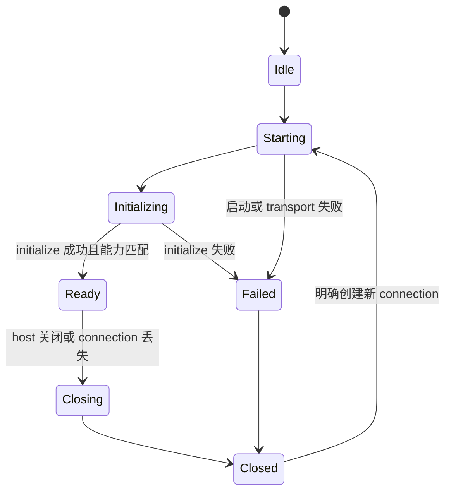

# 连接与所有权

本文件规定最终进程边界、连接所有权和目标目录。路径是目标职责，不是对当前 Zeta 目录的认可；已有代码放错位置时，应把 owner 移到这里，而不是在旧位置增加转发层。

## 一条完整调用链


前端领域接口和 Rust 线上协议是两份不同契约：前者服务 renderer，后者跨进程。Electron Main 领域 adapter 是唯一允许同时理解两者的位置。

## 所有权

| 对象 | 唯一 owner | 不能负责 |
| --- | --- | --- |
| 前端领域接口、事件和可见错误 | `src/platform/<domain>/common/` 或 `src/workbench/services/<domain>/common/` | transport、JSON-RPC、Rust DTO |
| renderer channel client | 领域的 `common/` 或 `electron-browser/` | 后端进程、请求编号、重连 |
| renderer ↔ Main IPC | `src/base/parts/ipc/` 与 `src/platform/ipc/` | app-server 方法和业务状态 |
| 后端进程与 connection | `src/platform/appServer/electron-main/` | 领域业务和 UI 状态 |
| transport 与请求配对 | `src/platform/appServer/node/` | 领域方法、缓存和权限判断 |
| 领域线上转换 | `src/platform/<domain>/electron-main/` 或对应 workbench service | Rust 业务规则、前端状态副本 |
| 线上协议与生成物 | `../app-server-protocol/` | runtime、系统访问、UI 类型 |
| 统一分派与连接 session | `../app-server/` | transport framing、前端领域状态 |
| transport 接受、读取和写出 | `../app-server-transport/` | initialize 语义、领域分派、业务错误 |
| Rust 领域行为 | 对应领域 crate | IPC channel、renderer 类型、JSON-RPC envelope |

`base → platform → workbench` 是前端依赖方向。连接机制属于 `platform`；领域仍由自己的 `platform/<domain>` 或 `workbench/services/<domain>` 拥有，不能因为使用 app-server 就搬进 `platform/appServer`。

## 目标目录

前端源码根目录以下记为 `src/`：

```text
src/
├── base/parts/ipc/
│   ├── common/ipc.ts
│   ├── electron-browser/
│   └── electron-main/
├── platform/
│   ├── ipc/
│   │   ├── common/
│   │   └── electron-browser/
│   ├── appServer/
│   │   ├── node/
│   │   │   ├── appServerTransport.ts
│   │   │   └── appServerConnection.ts
│   │   └── electron-main/
│   │       └── appServerProcessService.ts
│   └── <domain>/
│       ├── common/
│       │   ├── <domain>.ts
│       │   └── <domain>Ipc.ts
│       └── electron-main/
│           └── <domain>AppServerChannel.ts
├── workbench/services/<domain>/
│   ├── common/
│   ├── electron-browser/
│   └── electron-main/
└── code/electron-main/app.ts
```

只创建有真实调用方的文件。`appServerTransport.ts` 拥有字节或消息收发和关闭；`appServerConnection.ts` 拥有初始化、请求配对与线上消息分类；`appServerProcessService.ts` 拥有 Electron 生命周期下的进程启动、停止和 connection 选择。三项职责不能合并进领域 channel，也不需要继续拆成空接口和单实现文件。

后端按并列 crate 表示：

```text
../app-server-protocol/
├── src/protocol/common.rs
├── src/protocol/v2/<domain>.rs
└── schema/typescript/

../app-server/
├── src/message_processor.rs
├── src/request_serialization.rs
├── src/outgoing_message.rs
├── src/request_processors/<domain>_processor.rs
└── src/<domain>_resource.rs

../app-server-transport/
└── src/transport/
```

`<domain>_resource.rs` 只在该领域确实拥有跨请求资源时存在，例如 watch、process 或 stream。普通 request 不为匹配目录树创建资源 manager。

## 生成物边界

Rust 协议注册同时生成以下 TypeScript 契约，输出由 `../app-server-protocol/schema/typescript/` 拥有：

- client request 的方法、params 和 response 映射；
- server notification 的方法和 params 映射；
- server request 的方法、params 和 response 映射；
- request ID、错误和初始化 DTO。

前端通过一个构建别名直接消费该生成目录，不把生成文件复制到另一个手写目录。只有 `src/platform/appServer/node/` 和领域 `electron-main/` adapter/handler 可以导入生成物；renderer、领域 `common/`、editor、workbench contribution 和 UI 不得导入。

若生成器当前只有 request union 和零散 response 类型，却没有“方法 → response”的映射，应扩展生成器。不能在 `appServerConnection.ts` 或领域 channel 中手写响应表，因为那会产生第二个协议 owner。

## Connection owner

一个 Electron Main host 可以拥有多个后端 session，但同一个 session 只能有一个 connection owner。session key 必须由真实隔离边界组成，例如远端目标、工作区执行环境或权限边界；不能以领域名作为 key。

connection owner 独占：

- transport reader、writer 和有界队列；
- client request ID 分配和唯一 pending map；
- `initialize` 请求、能力协商和 ready gate；
- typed notification 分派；
- typed server request handler registry；
- 关闭原因、pending rejection 和资源失效通知；
- 新 connection 代次，防止旧异步结果进入新 session。

领域 channel 只获得一个已经选定 session 的 connection 接口。它不能访问 child process、socket、stdout、request ID 或 pending map。

## 连接状态



- `Ready` 前的领域调用等待同一个 ready promise；初始化失败后全部收到同一个明确错误。
- initialize 期间到达的通知和 server request 必须被解析并暂存，不能因为尚未 ready 而丢失或阻塞 reader。
- connection 关闭先停止接收新请求，再拒绝全部 pending、终止资源事件、清理 handler 和 transport。
- 重启产生新代次。旧请求不重放，旧资源 ID 不复用，修改请求不自动重试；领域通过重新读取和重新订阅恢复。

## 两段 IPC 不能混成一段

renderer ↔ Electron Main 的 channel command/event 名称属于前端领域契约；Electron Main ↔ Rust 的 method 属于线上协议。两者可以表达相同动作，但不能共用同一常量或让线上 method 穿过 renderer IPC。

前端 IPC 自动提供的 call cancellation 和 listener dispose 只到达 Electron Main。它们不会自动取消 Rust 工作或释放 Rust 资源；领域 channel 必须按 [协议语义](protocol-semantics.md) 显式映射。

## 装配

`src/code/electron-main/app.ts` 只做以下工作：

1. 创建进程 owner 和共享 connection；
2. 创建领域 channel，注入 connection；
3. 按稳定 channel name 注册；
4. 把所有资源注册到 host 生命周期。

该文件不实现 transport、不解析消息、不转换 DTO，也不包含领域 switch。renderer 在对应 `electron-browser` 注册远程领域 service，调用方通过依赖注入取得领域接口。
