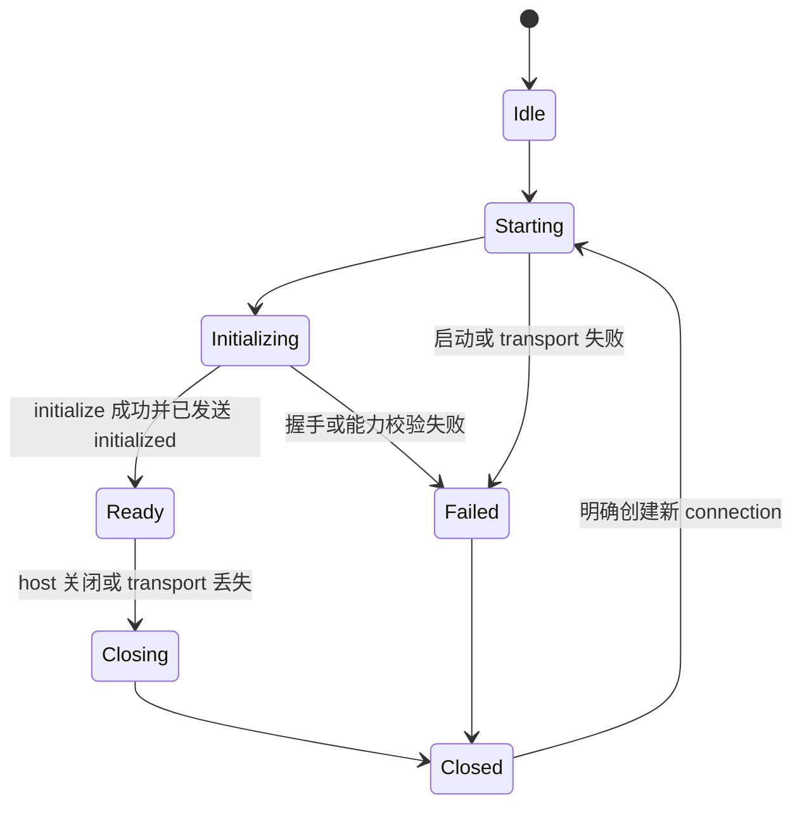

# 连接与所有权

本文件规定最终进程边界、session、connection、多窗口路由和目标目录。路径表达最终职责，不认可任何现有目录；代码位于错误 owner 时迁回目标位置并迁移调用方，不在旧位置保留转发层。

## 端到端调用


前端领域契约和线上协议服务不同调用者。领域 channel 使用 renderer context 选择 session，把前端输入转为生成参数，再把生成响应、通知和错误转回领域对象；其他层不能同时理解两份契约。

## 所有权表

| 对象 | 唯一 owner | 禁止承担 |
| --- | --- | --- |
| 前端领域接口、事件和可见错误 | `src/platform/<domain>/common/` 或 `src/workbench/services/<domain>/common/` | transport、JSON-RPC、Rust DTO |
| renderer channel client | 领域的 `common/` 或 `electron-browser/` | 进程、session、request ID、重连 |
| renderer ↔ Main IPC | `src/base/parts/ipc/` 与 `src/platform/ipc/` | app-server method、后端状态、业务决定 |
| connection 状态机与消息分类 | `src/platform/appServer/common/` | Node/Electron API、领域缓存、UI 状态 |
| stdio framing 与有界写队列 | `src/platform/appServer/node/` | initialize、session、领域 method |
| 进程、session 和 renderer attachment | `src/platform/appServer/electron-main/` | 领域 DTO 转换、UI 决定 |
| 领域线上转换 | `src/platform/<domain>/electron-main/` 或对应 workbench service | Rust 业务规则、前端状态副本 |
| 线上协议、注册和生成物 | `../app-server-protocol/` | runtime、系统访问、前端领域类型 |
| 统一分派与 connection session | `../app-server/` | stdio framing、renderer 状态 |
| transport 接受、读写和背压 | `../app-server-transport/` | initialize 语义、领域分派 |
| Rust 领域行为 | 对应领域 crate | IPC channel、renderer 类型、JSON-RPC envelope |

前端依赖方向是 `base → platform → editor → workbench → code`。`sessions` 可以依赖 `workbench` 及更低层，反向依赖不成立。连接机制属于 `platform`；领域仍由自己的 platform 或 workbench service 目录拥有。

## 目标目录

前端参考源码根以下统一写作 `src/`：

```text
src/
├── base/parts/ipc/
│   ├── common/ipc.ts
│   ├── electron-browser/
│   └── electron-main/
├── platform/
│   ├── ipc/
│   │   ├── common/
│   │   └── electron-browser/
│   ├── appServer/
│   │   ├── common/
│   │   │   └── appServerConnection.ts
│   │   ├── node/
│   │   │   └── appServerStdioTransport.ts
│   │   └── electron-main/
│   │       └── appServerProcessService.ts
│   └── <domain>/
│       ├── common/
│       │   ├── <domain>.ts
│       │   └── <domain>Ipc.ts
│       └── electron-main/
│           ├── <domain>AppServerChannel.ts
│           └── <domain>HostRequestHandler.ts
├── workbench/services/<domain>/
│   ├── common/
│   ├── electron-browser/
│   └── electron-main/
└── code/electron-main/app.ts
```

只创建具有独立职责和真实调用方的文件。连接类型很小时可与连接实现同文件；没有 server request 的领域不创建 handler；领域只属于 workbench 时使用 `src/workbench/services/<domain>/`，不重复创建 platform 版本。

后端参考源码使用并列 crate 路径：

```text
../app-server-protocol/
├── src/protocol/common.rs
├── src/protocol/v2/<domain>.rs
├── src/export.rs
└── schema/typescript/

../app-server/
├── src/message_processor.rs
├── src/request_serialization.rs
├── src/outgoing_message.rs
├── src/request_processors/<domain>_processor.rs
└── src/<domain>_resource.rs

../app-server-transport/
└── src/transport/
```

`<domain>_resource.rs` 只用于跨请求存活的 watch、process、stream 等资源。普通 request 不创建资源 manager。

## 三层连接职责

### `common/appServerConnection.ts`

该文件只依赖环境无关的消息 transport 接口和生成协议，负责：

- connection 状态与代次；
- request ID 和唯一 pending map；
- `initialize` response、`initialized` notification 与 ready gate；
- response、error、notification、server request 分类；
- typed notification listener 与 server request handler registry；
- 关闭时拒绝 pending、终止路由并忽略旧代次结果。

它不启动进程、不选择 session、不知道 renderer，也不包含领域 method switch。

### `node/appServerStdioTransport.ts`

该文件只负责逐行 JSON framing、stdin 写入、stdout 读取、stderr 诊断、写入背压和关闭事件。线上消息省略标准 JSON-RPC 版本字段，因此 parser 按生成 envelope 解码，不能依赖完整标准 header。

transport 不执行 initialize，不分派领域消息，不拥有 pending request。默认桌面链路使用 stdio；实验 transport 不能成为正式路径或备用路径。

### `electron-main/appServerProcessService.ts`

该文件负责解析可执行文件、启动和停止子进程、计算 session key、创建 transport/connection、管理 renderer attachment，并把进程退出收敛为一次 connection close。它可以拥有多个 session，但同一 session 只有一条 connection。

该文件不转换领域 DTO，不保存 UI 状态，不根据英文错误消息决定行为。

## Session 与 renderer attachment

session key 来自真实隔离边界，例如工作区执行环境、远端目标、账户或权限边界。领域名、窗口 ID 和随机 connection ID 不能单独作为 session key。

Main 为每个 renderer attachment 记录：

- renderer context 与所属 session；
- 该 renderer 创建的本地订阅和 host request handler；
- thread、turn、resource 等需要反向路由的归属；
- 断开时必须释放的 attachment 资源。

领域 channel 的 `context` 不能忽略。每次调用先由 `context` 取得 attachment 和 session，再取得该 session 的 connection。renderer 断开时只释放它拥有的订阅、handler 和归属记录；是否关闭后端 session 由明确的 session 生命周期决定，不能因为任一窗口关闭就无条件杀死共享进程。

## 反向请求路由

app-server 发起审批、输入或宿主能力请求时，connection 先按生成 method 找到 Main handler，再由 handler 按 thread、turn、resource 或 session 归属选择唯一 renderer channel。不能广播，也不能把线上 server request union 交给普通 contribution。

路由必须处理：

- 找不到 owner；
- owner 窗口已关闭；
- handler dispose；
- 用户交互超时或取消；
- connection 在回复前关闭。

每种结果恰好回复一次成功或稳定错误，并从 pending server request 表移除。

## 生成物边界

`../app-server-protocol/schema/typescript/` 必须由一个注册点生成：

- client request method → params → response map；
- server notification method → params map；
- server request method → params → response map；
- request ID、错误、初始化和 envelope 类型。

前端通过构建别名直接消费生成目录，不复制到另一个手写目录。只有 `src/platform/appServer/common/`、`src/platform/appServer/node/` 和领域 `electron-main/` adapter/handler 可以导入生成物；renderer、领域 `common/`、editor、workbench contribution 与 UI 不得导入。

如果生成器只有 request union 和分散的 response 类型，缺少方法到返回值映射，这是协议缺口，会阻止通用 typed connection。先修改 `../app-server-protocol/src/export.rs` 或其生成 owner；禁止在前端补第二份映射。

## Connection 状态



- `Ready` 前的领域调用等待同一个 ready promise；初始化失败后全部得到同一明确错误。
- 初始化期间收到的已知 notification 和 server request 继续解析并按协议顺序暂存，未知 server request 立即拒绝；reader 不能被 ready gate 阻塞。
- close 先拒绝新请求，再停止 transport，拒绝全部 pending，结束资源事件并清空 handler。
- restart 创建新代次。旧 pending、resource ID、response 和 notification 不能进入新 connection；修改请求不自动重放。

## 两段协议的生命周期映射

renderer IPC 的 call cancellation 和 event dispose 只到达 Main。领域 channel 必须决定它们是否对应线上 interrupt、stop、unwatch、terminate 或 cancel；没有协议取消的普通 request 不能假装已经停止后端工作。

renderer IPC connection 关闭只说明该窗口离开。app-server connection 关闭则使整个 session 的 pending 和资源失效。两者必须分别处理，不能用同一个 `dispose()` 含糊覆盖。

## 产品装配

`src/code/electron-main/app.ts` 只完成：

1. 创建进程服务并绑定应用生命周期；
2. 创建领域 channel/handler 并注入进程服务或 connection accessor；
3. 注册稳定 channel name；
4. 注册所有 disposable。

该文件不解析 JSON、不转换 DTO、不实现领域 switch，也不保存 session 业务状态。renderer 在对应 `electron-browser` 文件注册远程领域 service，调用方通过依赖注入取得领域接口。
