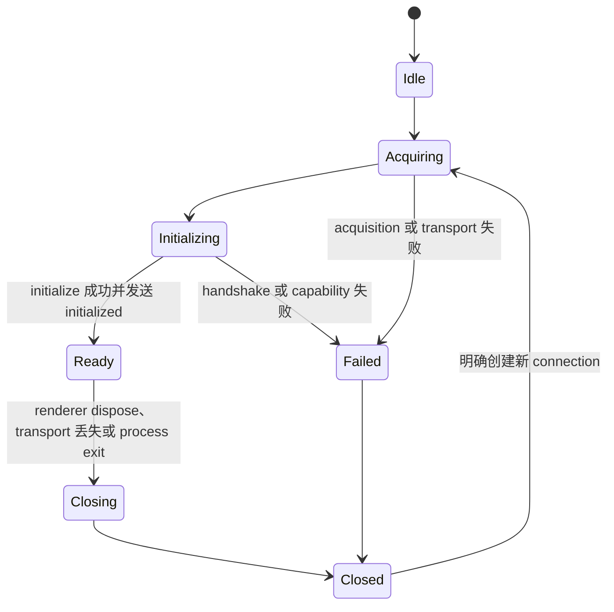

# 连接与所有权

本文件规定前端领域 service、adapter、renderer/Main、process、connection 和后端对象的最终边界。Sessions 只在 Thread 进入 Agents Window 时适用。路径表达最终职责，不认可目标仓库的现有错误目录；迁移选择不明确时执行主 skill 的冲突门禁。

## 端到端结构


账户调用方依赖账户 service，文件调用方依赖文件 service，配置调用方依赖配置 service；它们不依赖 Sessions。每个领域 adapter 消费同一个 renderer host service，但只暴露该领域的前端契约。

每个 renderer 独立完成 connection initialize、request pairing、notification 订阅和 server request 回复。Main 只启动共享进程、为窗口取得独立 backend connection 并透明转发 frame；Main 不解析 method、不改 request ID，也不保存领域状态。

## 所有权表

| 对象 | 唯一 owner | 禁止承担 |
| --- | --- | --- |
| 前端领域接口、状态、事件和可见错误 | `src/platform/<domain>/common/` 或 `src/workbench/services/<domain>/common/` | transport、JSON-RPC、Rust DTO |
| 领域 app-server adapter | 对应领域的 `browser/` 或 `electron-browser/` | process、通用 pending、其他领域状态 |
| renderer host service contract | `src/platform/appServer/common/` | 具体领域 API、UI 状态 |
| protocol client 与 connection 状态机 | `src/platform/appServer/browser/` | 领域 facade、业务决定 |
| renderer transport acquisition | `src/platform/appServer/electron-browser/` | process spawn、领域状态 |
| 进程与 renderer connection relay | `src/platform/appServer/electron-main/` | initialize、request pairing、method routing |
| Agents Window 的 Session/Chat contract | `src/sessions/services/sessions/common/`，仅 Thread UI 使用 | 通用 app-server API |
| Thread 的 Sessions Provider adapter | `src/sessions/contrib/providers/appServer/browser/`，仅 Thread UI 使用 | 文件、账户、配置等领域入口 |
| 产品装配 | `src/code/electron-main/app.ts` 与对应 renderer main entry | protocol parser、DTO 转换、领域状态 |
| 线上协议与生成物 | `../app-server-protocol/` | runtime、renderer 类型 |
| backend connection 与 typed dispatch | `../app-server/` | renderer/window 状态 |
| 多 connection transport | `../app-server-transport/` | 领域业务规则 |
| Rust 领域行为 | 对应领域 crate | IPC、前端类型、JSON-RPC envelope |

前端依赖方向是 `base → platform → editor → workbench`。`src/platform/appServer/` 不得依赖具体领域或 `src/sessions/`；领域 adapter 依赖 app-server host service。Sessions 位于 Workbench 之上，只能作为其中一个领域消费者。

## 目标目录

前端参考源码根以下统一写作 `src/`：

```text
src/
├── platform/appServer/
│   ├── common/
│   │   ├── appServerService.ts
│   │   ├── appServerProtocol.ts
│   │   └── protocol/generated/
│   ├── browser/
│   │   └── appServerProtocolClient.ts
│   ├── electron-browser/
│   │   ├── appServerMessagePortTransport.ts
│   │   └── localAppServerService.ts
│   └── electron-main/
│       ├── appServerStarter.ts
│       └── appServerConnectionRelay.ts
├── platform/<domain>/
│   ├── common/<domain>.ts
│   └── browser/<domain>AppServerAdapter.ts
├── workbench/services/<domain>/
│   ├── common/<domain>.ts
│   └── electron-browser/<domain>AppServerAdapter.ts
├── sessions/contrib/providers/appServer/browser/
│   ├── appServerSessionsProvider.ts
│   └── appServerSessionAdapter.ts
└── code/electron-main/app.ts

build/lib/appServerProtocol.ts
```

`protocol/generated/` 是 `../app-server-protocol/schema/typescript/` 的机械镜像，由 `build/lib/appServerProtocol.ts` 复制并校验 schema hash，禁止手改。领域属于 platform 还是 workbench 由前端调用方和依赖方向决定。只属于 Agents Window 的 Thread facade 才放进 Sessions Provider。只创建有真实调用方的文件；小型 adapter 可以与领域 service implementation 同文件，没有 relay 逻辑时可与 starter 合并，不能为了目录对称创建占位文件。

后端参考源码使用并列 crate 路径：

```text
../app-server-protocol/
├── src/listen_info.rs
├── src/protocol/common.rs
├── src/protocol/v2/<domain>.rs
├── src/export.rs
└── schema/typescript/

../app-server/
├── src/main.rs
├── src/message_processor.rs
├── src/request_serialization.rs
├── src/outgoing_message.rs
├── src/request_processors/<domain>_processor.rs
└── src/<domain>_resource.rs

../app-server-transport/
├── src/lib.rs
└── src/transport/
    ├── auth.rs
    └── websocket.rs
```

`<domain>_resource.rs` 只用于跨 request 存活的 watch、process、stream 等资源。普通 request 不创建 resource manager。

## Process 与 connection 拓扑

最终拓扑是：

```text
一个 host process
  ├── renderer A → connection A → protocol client A → 多个领域 adapter
  ├── renderer B → connection B → protocol client B → 多个领域 adapter
  └── renderer C → connection C → protocol client C → 多个领域 adapter
```

Main starter 在首次请求时启动一个进程。每个 renderer 通过带 nonce 的 acquisition 请求取得专属 MessagePort；Main relay 为该 MessagePort 打开一条独立 backend connection。relay 只进行 frame 转发、背压和关闭传播，不解码 JSON、不执行 initialize、不分配或重写 request ID。

同一 renderer 的领域 adapter 复用同一个 protocol client，不能各自创建 connection、pending map、reader 或 reconnect loop。renderer 关闭时只关闭自己的 MessagePort、backend connection、pending、订阅和资源。应用关闭、明确 restart 或 host 致命失败才停止共享进程；进程停止会关闭全部 renderer connection。

领域、Project、Workspace 和 renderer window 都不能启动新进程。只有账户或安全边界要求进程级隔离且协议无法在 connection 或 request 参数表达时，才报告冲突并询问用户是否增加 host process。

### 多 connection transport 门禁

正式桌面 transport 必须同时满足：

- 一个进程接受多个独立 connection；
- 每条 connection 单独 initialize、拥有独立 capabilities 和 request ID 空间；
- macOS、Linux 和 Windows 都有正式支持的本地 endpoint；
- Main relay 能为每个 renderer 打开独立 connection，且不理解线上 method；
- transport 有有界队列、背压、身份校验和确定关闭语义。

单路 stdio 不能满足该拓扑。Main protocol multiplex、每窗口一进程或自动 transport 切换都不能成为正式路径。当前后端不满足这些条件时停止前端实现，先按 [前置能力补全](prerequisite-completion.md) 将 token-authenticated loopback WebSocket、机器可读启动记录和三平台测试补进 `../app-server-transport/` 与 `../app-server/`；后端不在授权范围或源码前提冲突时再询问用户。

## renderer protocol client

`src/platform/appServer/browser/appServerProtocolClient.ts` 每个 renderer 创建一个实例，负责：

- connection 状态与代次；
- request ID、client pending 与 server request pending；
- `initialize` response、`initialized` notification 和 ready gate；
- 生成 decoder、message 分类、typed notification listener 与 server request handler；
- connection 关闭时拒绝 pending、结束资源并忽略旧代次结果。

client 不启动进程、不读取 active editor/Session、不保存领域 catalog，也不包含按领域扩张的 method switch。每项线上 method 只能通过生成 method map 调用。

`src/platform/appServer/electron-browser/appServerMessagePortTransport.ts` 只把 MessagePort frame 变成 client message transport，拥有有界发送队列、drain/close 和有限诊断。它不执行 initialize、不拥有 pending，也不恢复领域对象。

## 领域 adapter

每个 adapter 从前端领域 contract 出发，只消费它需要的 typed request、notification 和 server request。adapter 可以转换 URI/path、时间、枚举、结构化错误和 resource ID，不能：

- 暴露线上 method、envelope、request ID 或生成 DTO 给普通调用方；
- 保存 Rust 领域的第二份 durable state；
- 调用不属于本领域的后端 method；
- 依据英文错误、active window 或其他领域缓存决定行为；
- 启动 process、创建第二个 protocol client 或实现自己的 reconnect。

后端 catalog/state 的前端 facade 可以按 snapshot 与 notification 保持最新，但后端仍是唯一持久化 owner。只有多个真实前端消费者需要同一领域时才抽出共享 service；不能因为多个线上 method 就建立万能 app-server domain。

## 后端对象 identity

Project 是后端持久 catalog object；Workspace 是前端工作目录概念；Environment 是 Thread/Turn 执行目标；Thread 是 durable conversation；process/resource 使用自己的稳定 ID。它们可以关联，但身份不得互换。

Project adapter 处理 Project catalog 与 assignment；Workspace/file service 处理目录和文件状态；Environment adapter 处理执行目标；Thread adapter 处理 conversation。一个 adapter 可以在机械转换时读取关联对象，但不能夺取另一领域的 owner。

Project 或 Environment API 仍为实验协议时，生产 adapter 不开启实验 capability。先按 [前置能力补全](prerequisite-completion.md) 稳定真实产品调用方需要的 method、field 和 notification 闭包；稳定范围包含尚未决定的产品行为时执行冲突门禁。

## Thread 进入 Agents Window 时

仅此场景实现 `src/sessions/contrib/providers/appServer/browser/`。

Provider instance 使用稳定 `providerId` 和 resource scheme。committed Thread `threadId` 被编码进 provider-owned resource，canonical Session ID 统一由：

```text
providerId + ":" + resourceUri
```

生成。消费者比较 resource identity，不解析 scheme 或 Thread ID。Provider adapter 内部可以从 resource 路由到 Thread API，但普通 UI 不能解析。

新 Session 在发送首个请求前是 Provider-owned draft。`thread/start` 成功后发布 committed facade，并通过独立 replacement lifecycle 用 committed Session 替换 draft。不要持久化临时 resource，也不要在 Project、process service 或 UI storage 保存 draft → Thread 映射。

resume/read/catalog discovery 直接从 backend Thread 建立 committed resource。fork 返回新 Thread 时建立新 Session；rollback/revert 更新原 Thread facade，除非协议返回新 Thread。

默认 Chat resource 等于 Session resource，表示 Thread 的主 Chat。只有后端同时提供稳定 Chat catalog、Chat ID、create/fork/side-chat/delete/restore、每条 Chat 状态和 catalog notification 时，Provider 才能声明 multi-chat。不能为了复刻多 Chat UI 把多个独立 Thread 拼成一个 Session。

`ISession.workspace` 可以投影 Thread cwd、runtime workspace roots 和关联 Project roots，但 Project roots 变化不自动改写运行中 Thread cwd；协议没有明确行为时不能在前端推断同步。

## Server request 路由

后端 server request 在产生它的 backend connection 上发送，因此 renderer protocol client 天然确定窗口 owner。renderer 可完成的 request 由对应领域 adapter 调用明确前端 service；Main 才能完成的系统、进程或凭据能力通过独立 named host channel 请求 Main，不能把整个线上 server request union 转发给 Main。

必须处理未知 method、handler 未注册、窗口关闭、用户取消、超时和 connection close。每个 server request 恰好回复一次成功或稳定错误，并从该 renderer client 的 server pending 表移除。

如果后端可能把交互 request 发送到错误 connection，或者 request 缺少 connection/领域 identity 无法确定 owner，属于协议冲突；不能广播给所有窗口。

## Connection 状态



`Ready` 前的调用等待同一个 ready promise。初始化期间到达的已知 notification/server request 按协议读取和暂存；reader 不能被 ready gate 阻塞。close 先拒绝新 request，再停止 transport、拒绝 pending、结束资源并清空 handler。restart 创建新代次，旧 pending、resource ID 和消息不能进入新 connection；修改 request 不自动重放。

## 文件与编辑状态

app-server 不取代前端 file service、text model 或 working copy。后端拥有落盘修改；前端继续拥有打开文件、dirty buffer、保存、reload 和外部变更冲突。

- 后端写盘后由文件监听进入前端 file service，再更新未 dirty 的 model。
- dirty model 遇到后端磁盘变化时进入明确的外部变更或保存冲突状态。
- approval request 可以展示计划修改，但不能成为唯一冲突检测。
- 如果现有 file service 无法保证 dirty 冲突，或后端要求直接修改前端内存 model，立即停止并询问用户；adapter 不建立双写同步层。

## 产品装配

`src/code/electron-main/app.ts` 只创建 starter/relay、绑定应用生命周期并注册 connection acquisition channel。renderer main entry 注册 `localAppServerService` 和各真实领域 adapter；Thread 进入 Agents Window 时再由 Sessions entry 注册 Provider。装配文件不解析 JSON、不转换 DTO、不实现领域 switch，也不保存领域状态。
