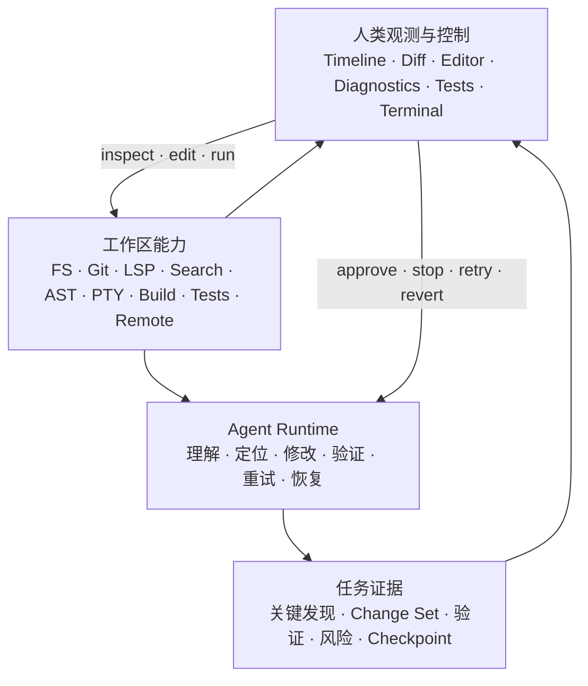

# `app`：Agent 开发能力与人类观测

> 状态：Current product direction。本文中的 Agent 只表示 Zeta。本文定义 Zeta Agent 的产品原则、能力选择、机器反馈、人类观测和工作区闭环，是这些产品决策的 canonical owner。主窗口 Tab/Pane 布局见 [`LAYOUT.md`](../LAYOUT.md)；当前源码接线见 [`app` README](../README.md)；外部 AI CLI 与终端边界见 [`TERMINAL.md`](../TERMINAL.md)；Session、Thread、Turn 与 ThreadItem 的权威语义见 [`protocol.md`](../../docs/protocol.md)。

## 快速理解

`app` 是为 Coding Agent 提供完整开发环境能力、同时让人类按结果观察和介入工作的原生开发环境。它不按照“传统 IDE 有什么”选择功能，而按照一项能力能否提高 Agent 完成代码变更闭环的成功率选择功能；底层拥有某项能力不意味着必须为它实现完整 GUI。

| 用户场景 | Agent 获得什么 | 用户默认看到什么 | 是否需要独立 GUI |
| --- | --- | --- | --- |
| 理解代码 | 文件、搜索、语法、符号、定义、引用和类型信息 | 当前目标、关键发现和相关文件摘要 | 通常不需要；需要检查时进入 Editor 或符号导航 |
| 修改代码 | 条件写入、Patch、Rename、Code Action 和格式化 | Changed Files、Diff 和冲突状态 | 需要结果界面，不需要暴露每个内部编辑步骤 |
| 验证修改 | 编译诊断、测试结果、构建状态和运行时反馈 | 通过/失败、剩余问题和失败位置 | 需要结构化结果；原始输出按需展开 |
| 恢复或介入 | Git baseline、checkpoint、restore 和重试边界 | Accept、Revert、Retry、Stop 和需要批准的风险动作 | 需要明确控制入口 |
| 纯只读内部查询 | 可供下一步推理使用的结构化机器反馈 | 默认不单独显示；最终只呈现影响结论的发现 | 不需要 |

产品原则是：**Make agents more capable. Make their work more observable.** 这里的“可观测”分为机器可观测和人类可观测：Agent 必须获得足够精确的结构化反馈继续闭环；用户默认只看结果、影响、风险和介入点，不需要阅读每次查询、每个 token 或完整工具日志。

## 产品原则与功能准入

`app` 优化的是“完成代码变更闭环”，不是孤立的文本修改。一次闭环包含理解代码、定位修改点、执行修改、发现错误、验证、重试和确认最终 Diff。LSP、Git、搜索、语法、测试、构建、PTY、文件系统和 Remote 都是 Agent 的开发环境感官或执行能力；Editor、Diff、Diagnostics、Test Result、Terminal 和 Timeline 是人类按需检查和接管工作的观察窗。

新增产品能力必须回答下面三个问题：

1. 它是否显著提高 Agent 正确完成代码变更闭环的概率？
2. 它产生的反馈、修改、风险和恢复边界由谁拥有，是否能结构化表达？
3. 用户是否需要知道结果、检查影响或介入；如果需要，最小用户界面是什么？

| 判断结果 | 产品处理 |
| --- | --- |
| 只提高 Agent 的只读理解能力 | 加入工作区能力层；提供机器可读结果，不自动新增用户界面 |
| 改变文件、Git、进程或任务结论 | 记录可追溯证据，并在人类观测层显示结果摘要和影响范围 |
| 需要用户授权或可能产生难以恢复的影响 | 在执行前提供批准、停止或缩小范围的入口 |
| 用户需要深入检查或直接接管 | 复用 Editor、Diff、Diagnostics、Tests 或 Terminal，不为每项能力创建专属面板 |
| 既不提高 Agent 闭环能力，也不改善用户检查或控制 | 不进入 `app` 产品范围 |

因此，拥有 LSP 能力不推出一套完整 IDE，拥有 Git 能力也不推出一套完整 Git 客户端。Minimap、复杂 Editor Group、装饰性 SCM 面板或与任务闭环无关的 Marketplace 不能仅因其他 IDE 已有而获得优先级。

## 能力、证据与用户界面分离

| 概念 | 负责什么 | 不负责什么 |
| --- | --- | --- |
| 工作区能力（workspace capability） | 提供文件、Git、LSP、搜索、语法、PTY、构建、测试和 Remote 的查询或动作 | 决定如何向用户展示一次任务 |
| Agent Runtime | 规划、调用能力、解释结构化反馈、验证、重试和停止 | 复制文件、Git、LSP 或 Terminal 的权威状态 |
| 证据（evidence） | 绑定一次任务中的输入事实、修改、验证结果、风险和恢复点 | 保存不可重建的第二份工作区状态 |
| 人类观测与控制界面（Human Surface） | 呈现结果、影响、风险和操作入口 | 为每个底层 API 暴露一套 GUI，或默认倾倒原始工具日志 |



人类观测与控制界面不必经过 Agent Runtime 才能读取工作区。用户可以直接打开文件、跳转定义、查看 Diff 或进入 Terminal；Agent 也消费同一份 canonical capability。两者不得建立第二套 diagnostics、Git status、文件内容或终端状态。

Human Takeover 需要完整的单文件编辑闭环，但不推出完整传统 IDE。`Files` 视图使用 CodeEditor 完成文件阅读、定位、编辑、保存和冲突处理；`Changes` 视图使用 MultiDiffEditor 和 DiffEditor 审查 Change Set。具体布局边界由 [`LAYOUT.md`](../LAYOUT.md) 拥有。

## 机器反馈与人类观测

机器反馈必须足够精确，让 Agent 能判断下一步动作是否有效。例如 LSP diagnostic 应保留文件、范围、severity、code、message 和 revision；Git diff 应绑定 repository、baseline 和文件变更；测试结果应区分发现、执行、通过、失败、取消和原始输出引用。纯文本摘要不能取代 Agent 继续执行所需的结构化事实。

人类观测采用结果优先、过程按需展开：

```text
Investigating
Authentication timeout

Found
Duration conversion is incorrect in auth/session.rs:142

Changed
auth/session.rs        +8 -3
auth/session_test.rs  +14

Diagnostics
0 new errors

Tests
auth/session_test · 18 passed

Workspace
2 files modified

[Review Diff] [Accept] [Revert]
```

默认观测回答以下问题：

- Agent 当前在做什么？
- 哪个关键发现解释了这次修改？
- 它修改了什么，修改范围是否仍与任务相关？
- 验证得到什么结果，是否还有已知失败？
- 用户现在是否需要批准、纠正或接管？
- 当前结果是否可以安全撤销？

查询明细、ToolCall 参数、完整命令、原始输出、完整 Diff 和推理摘要只在用户展开时显示。系统不要求展示私有思维链（chain-of-thought）；“为什么”由计划、引用的代码事实、动作摘要和验证证据回答。只读搜索、AST 遍历、tokenization 或候选排序如果没有独立影响任务结论，不创建 Timeline 项，也不要求用户观测。

## 当前产品结构

当前产品仍以 Zeta ThreadTimeline 为中央区域，普通用户消息、Zeta 消息、ToolCall 和用户直接发起的 Shell Turn 进入同一 durable Thread；Terminal、Files 和 Changes 仍通过独立区域接入。目标布局把 `Agent`、`Terminal`、`Files`、`Changes` 和 `Settings` 统一为当前 PanePart 中的视图输入；外部 AI CLI 只进入 Terminal Pane，不进入 Zeta Thread。具体结构与当前差距由 [`LAYOUT.md`](../LAYOUT.md) 拥有。

```text
AgentWorkspace
├─ ThreadTimeline
│  ├─ UserMessage
│  ├─ AgentMessage
│  ├─ CommandCard
│  └─ Plan
├─ zeta-composer::Composer
│  ├─ Interaction Pane
│  ├─ Compact CodeEditor
│  ├─ Context Toolbar
│  └─ 分类器选择的 Agent | Shell 路由
├─ Workspace Views
│  ├─ Files → file tree / search / editor content
│  └─ Changes → change list / Diff content
└─ Terminal Surface
```

Terminal 不拥有 Zeta Session、Thread 或 transcript。Zeta 发起的普通非交互式 shell execution 仍作为 typed ToolCall/ToolResult 或 direct Shell Turn 进入 Zeta Thread；外部 AI CLI 与其他交互式程序进入独立 Terminal Pane，其输入和输出只属于绑定的外部进程。Terminal 不从屏幕文字推断 Zeta ToolCall、Approval 或任务完成状态。

## 当前能力与计划方向

| 能力 | 当前实现 | Agent 原生能力方向 | 人类观测方向 |
| --- | --- | --- | --- |
| 文件系统 | Agent 已有 read/write/edit/grep/glob；Native Files 和 Editor 通过 App Server 读写 | 保持条件写入、revision 和 Workspace 边界 | Changed Files、文件预览、冲突和 Diff |
| 搜索 | Agent 已有 grep/glob；Native 有文件模糊搜索 | 计划增加索引结果、符号和语义查询的统一机器契约 | 默认只显示关键发现；需要时打开 Search/Editor |
| LSP | Native 已有 diagnostics、hover、completion 和位置跳转；Agent local tool suite 尚未直接消费 LSP | 计划把 definition、references、symbols、diagnostics、rename 和 code actions 作为 code intelligence substrate | Diagnostics、跳转、引用和修改后错误变化；不建设完整 IDE 工作台 |
| Git | App Server 已有 repository、status、diff 和 branch typed contract；Agent 目前主要通过受控 Shell 使用 Git | 计划提供 baseline、diff、history、blame、restore 和 Agent-made change attribution | Files Changed、Diff、Untracked、Accept 和 Revert；不复制 GitKraken |
| 语法与 AST | Editor 已消费 syntax projection；Agent 没有通用 typed AST query | 计划只暴露能提高定位、结构化修改和验证的查询 | 通常不单独呈现；最终关键发现可进入结果摘要 |
| 构建与测试 | Agent 可通过 shell-command 执行；结果当前主要是 Tool output | 计划增加 test discovery、structured result、diagnostic binding 和 retry scope | Passed/Failed、失败位置、耗时和原始输出展开 |
| Terminal 与 PTY | Local/Remote Terminal、direct Shell Turn 和交互式 Terminal Surface 已接入 | Zeta 继续使用结构化执行能力；外部 AI CLI 通过独立 adapter 启动 | Zeta CommandCard 与外部 CLI Terminal 分开显示 |
| Remote | Remote Workspace、Agent、Language、Terminal 和 Tunnel 基础路径已接入 | 保持能力在远端 Workspace authority 内执行 | 连接状态、失败、重试和执行位置 |

上表中的“计划”是 Proposed，不表示对应 Agent tool 或人类 Surface 已经存在。实现时先扩展 canonical capability 和结构化结果，再选择是否需要持久证据与用户 Surface；不得先画完整面板再反推底层 contract。

## 所有权

| 状态或能力 | Owner | `app` 义务 |
| --- | --- | --- |
| Session、Thread、Turn 与 durable ThreadItem | Core / App Server | 订阅 snapshot/update，不复制 reducer |
| 文件、Git、LSP、搜索、PTY 与 Remote authority | 对应 `zeta-rs` domain / App Server | 复用 typed contract，不从 UI 或 terminal output 反推状态 |
| Agent capability selection 与 Tool execution | Core Tool registry / scheduler | 投影动作、结果、批准和失败，不在 Native 建第二套 Agent runtime |
| transient Agent/Tool delta | App Server update stream | 检测 stream cursor gap；gap 后重新订阅 |
| 任务证据的权威事实 | Core / App Server Thread facts + Workspace domain revision | 保留动作、修改、验证、风险和恢复所需的 identity，不保存平行工作区状态 |
| 结果摘要 | Proposed Native Thread projection | 从权威事实重建，默认呈现结果并按需展开过程 |
| Timeline scroll、展开、选择和布局 | Native presentation | 可丢弃、可从 snapshot 重建 |
| Composer text、routing、IME 与 caret | `zeta-composer::Composer` + `zeta-editor::CodeEditorDocument` | 输入变化时重新分类；提交时产生确定的 Agent 或 Shell operation |
| Files、Changes 与 Terminal Pane | 对应 domain presentation owner | 让用户检查和接管 canonical state；Editor 和 Diff 作为视图内部内容组合 |
| Approval、Stop 与 Retry | Core authority + Native command adapter | 明确作用范围、失败语义和恢复边界 |
| Accept 与 Revert | Proposed domain authority + Native command adapter | 绑定明确的 Change Set 或 Checkpoint identity，不按当前屏幕内容猜测目标 |

## Composer 与执行语义

同一 Composer 最终只产生两种明确提交：Agent message 或 Shell command。`zeta-input-classifier` 在输入变化时使用当前路由、历史、Shell evidence 和本地模型重新分类，不提供手动路由覆盖。Slash command 始终进入 Agent 路径。分类只选择提交类型，不授权执行，也不替代 policy、approval 或 sandbox。

Agent message 通过 `session/request::StartTurn` 提交。Shell command 通过 `StartShellTurn` 提交，不调用模型；Core 原子记录 Turn acceptance、精确 shell-command ToolCall 与 Turn start，随后复用 Tool scheduler 的 policy、Workspace sandbox、one-time approval、unknown-outcome recovery 和 durable ToolResult。结束后 Agent 可以从 Thread context 看见这些事实。

Composer 使用 compact CodeEditor，保留多行文档、selection、undo/redo 和 IME。CodeEditor 不参与
Agent/Shell 判断；分类器决定整段 submission route 后，Composer 才为整段选择 PlainText 或 Shell
syntax。命令前缀后接用户问题并分类为 Agent message 时不局部高亮前缀；只有整段会作为 Shell command
提交时才启用 Shell 高亮。`Enter` 提交当前路由，`Shift+Enter` 插入换行；分类为 Shell 路由时在边界
使用 Up/Down 浏览已提交命令。Interaction Pane 当前承载 Slash Command 和 Model Picker；新增底层
capability 不自动成为新的 Pane。

## 投影、恢复与结果可信度

Native 首次选择 Session 时调用 `session/subscribe`。App Server 返回 Session snapshot、durable gap、child Thread projection 和 connection-local live update；Native 只选择 active Thread 并应用 projection，不直接访问数据库，也不实现第二份 Thread reducer。

- durable update 到达后，以 canonical snapshot/gap 推进 projection；
- transient `ItemStarted`、`ItemDelta` 和 Tool output 只改善低延迟展示；
- `streamInstanceId` 改变或 sequence 出现空洞时，立即丢弃 transient buffer 并重新订阅；
- UI 不从 Markdown、当前可见文字或 terminal transcript 推断 Turn、diagnostic、Git 或 test terminal state；
- 最终“完成”必须引用实际 change set 和 verification evidence；没有验证时明确显示未验证，不能从 Agent 文本推断成功。

用户默认看到的结果摘要必须可追溯到 canonical Thread fact、Workspace revision、Git baseline、diagnostic snapshot 或 execution result。Presentation 可以丢弃和重建；用户接受或回滚使用明确绑定的 change/checkpoint identity，不能按当前屏幕内容猜测目标。

## Roadmap 筛选器

| 候选能力 | Agent 闭环提升 | 人类检查或介入价值 | 产品判断 |
| --- | --- | --- | --- |
| LSP code intelligence | 很高 | 高 | 优先；先完成 Agent typed consumer，再复用 Diagnostics/Editor 界面 |
| Git baseline、diff 和 restore | 很高 | 很高 | 优先；与 change attribution、Accept/Revert 一起设计 |
| structured tests/build | 很高 | 很高 | 优先；命令输出之外建立 result contract |
| Workspace index/search | 很高 | 中 | 优先；大部分查询无需默认用户观测 |
| AST/tree-sitter queries | 高 | 低 | 主要作为内部能力；不做独立 AST GUI |
| Terminal/PTY/runtime logs | 很高 | 很高 | 核心；区分有界 CommandCard 与交互 Terminal |
| Remote Workspace | 很高 | 中 | 核心；用户只需看到执行位置、状态和恢复动作 |
| Files 与 Changes 视图 | 高 | 很高 | 分别承载文件编辑与 Diff 审查 |
| DAP debugger | Potentially high | 高 | Potential；先验证可复现问题、结构化状态和 Agent consumer |
| CI、browser/dev-server feedback | Potentially high | 高 | Potential；需要可信身份、取消、revision 和结果绑定 |
| Minimap、复杂 Editor Group | 低 | 低到中 | Non-goal，除非真实 Agent workflow 证明必要 |
| 为每项 capability 建独立面板 | 无 | 低 | Non-goal |

## 当前限制与下一阶段

| 项目 | 当前边界 | 下一阶段 |
| --- | --- | --- |
| Agent code intelligence | 主要依赖 read/grep/glob/shell，LSP 尚未进入 Agent tool suite | 定义 revision-bound LSP query/result contract，并接入 Agent Tool registry |
| Change attribution | 有 Workspace Git projection 和 durable ToolCall，但未形成每 Turn 的 change set | 绑定 Turn baseline、修改文件、Diff 和 Agent-made attribution |
| Verification | shell ToolResult 可见，但测试、构建和 diagnostics 尚未汇聚成 outcome | 建立结构化 verification evidence 和未验证状态 |
| Outcome-first Timeline | 当前呈现基本 ThreadItem、Plan 和 Tool output | 增加 Found、Changed、Diagnostics、Tests 和 intervention summary；原始过程默认折叠 |
| Recovery | Git 和文件写入有底层保护，用户级 Accept/Revert 尚未形成统一闭环 | 定义 checkpoint identity、作用范围和安全失败语义 |
| Tool output latency | stdout/stderr 类型已贯通；local adapter 仍可能在进程完成后发布捕获结果 | 从 executor pipe reader 实时发布有界 chunk |
| Terminal layout | 当前为独立全主区域 Surface | Proposed：与 Agent conversation 组成 Session Flow；交互协议在原位进入全格网格，不改变 Agent/Workspace authority |

## 长期不变量

- Agent 和 Human 消费同一份 Workspace authority；不得复制文件、Git、LSP、diagnostic、test 或 terminal state。
- Agent 必须获得继续闭环所需的结构化机器反馈，但用户不必观察每次内部查询。
- 修改、验证、风险和恢复必须可追溯；只读且不影响任务结论的内部步骤不要求独立 UI。
- 默认用户界面显示结果和状态，过程按需展开；不得把无限 Tool log 当作 observability。
- 新能力不自动产生新 Pane；先定义 contract、evidence 和 intervention need，再选择最小用户界面。
- Editor 是按需检查与接管界面；Terminal 是会话执行基座和交互兼容界面；二者都不成为第二份 Agent transcript 或 Workspace reducer。
- `app` 不以复刻 Zed、Warp、GitKraken 或完整传统 IDE 为目标；能力范围由代码变更闭环决定。
