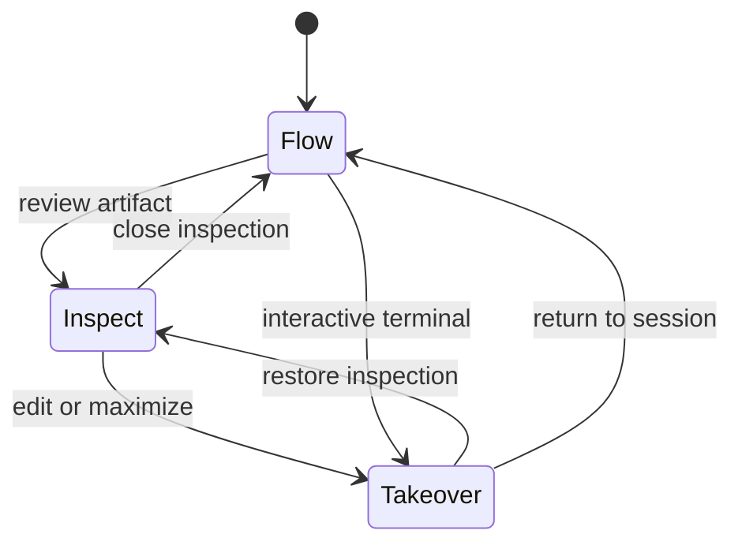

# `app`：Agent Terminal 布局

> 状态：Proposed product layout。本文是 `app` 主窗口信息架构、会话流、检查界面、响应式行为与渐进迁移的 canonical owner。Agent 能力、机器反馈和人类观测原则见 [`native-agent-console.md`](native-agent-console.md)；PTY、grid、screen mode 与 Terminal protocol 兼容性见 [`native-terminal-ui.md`](native-terminal-ui.md)；Workbench 模型、产品 Pane geometry 与组件边界见 [`zeta-workbench`](../workbench/README.md)、[`zeta-workbench-layout`](../workbench-layout/README.md)、[`zeta-workbench-ui`](../workbench-ui/README.md) 和 [`zeta-ui-components`](../ui-components/README.md)。

## 快速理解

`app` 采用 Terminal-first 的 Agent 工作区：当前 Workspace、Terminal session 和 Agent conversation 组成同一个会话上下文，Shell command、PTY 输出、用户消息、Agent 回复和可检查结果沿同一条会话流出现。用户不先进入独立工作仪表盘，也不在 Terminal、Chat 和 Editor 三个互相独立的产品之间切换；Diff、Editor、Diagnostics 和 Files 只在需要检查或接管时临时打开。

| 用户正在做什么 | 默认界面 | 与 Terminal 的关系 | 临时界面 |
| --- | --- | --- | --- |
| 输入 Shell command | 命令块、实时输出和退出状态进入当前会话流 | 绑定当前 Workspace、runtime 和 Terminal session | 无 |
| 询问 Agent 或要求修改代码 | 用户消息和 Agent 回复进入当前会话流 | Agent 继承当前 cwd、branch、runtime 和最近命令证据 | 内部只读查询默认不打开界面 |
| 查看 Agent 执行了什么 | 展开 Agent block 中的 command、tool result 或原始输出 | 只展示与当前结果相关的执行证据 | 可展开详情，不创建常驻面板 |
| 审查修改或错误 | 保留会话流位置和输入草稿 | 检查对象绑定产生它的 Agent turn、Workspace revision 或 command | 打开 Diff、Editor、Diagnostics 或 Tests |
| 运行 `vim`、`top`、`ssh` 等交互程序 | 当前 Terminal pane 进入完整 grid 或 alternate screen | 继续使用同一 Terminal session | 必要时全屏接管 |
| 切换工作上下文 | 使用 Top Bar 的 Session switcher | 一起恢复 Workspace、Thread、PTY、scroll 和输入草稿 | Session 列表按需打开 |

本文后续依次固定[布局决策](#布局决策)、[主窗口结构](#主窗口结构)、[会话流](#会话流)、[检查与接管](#检查与接管)、[响应式规则](#响应式规则)、[状态与所有权](#状态与所有权)和[迁移顺序](#当前实现与迁移顺序)。

## 布局决策

主窗口的产品根节点是当前 Agent Terminal session，而不是额外的工作容器、文件树、Editor 或独立 Chat 页面。

- **Terminal 是默认工作区**：primary screen 的命令块、输出和输入构成主界面；完整 terminal protocol 在同一位置接管，不从抽屉弹出第二个 Terminal。
- **Conversation 依附当前会话**：Agent 消息与当前 Workspace、runtime、branch、PTY 和最近执行证据关联，不形成脱离执行环境的第二套工作仪表盘。
- **一个时间顺序**：用户消息、Agent 回复、direct Shell Turn、用户 Terminal command 和重要结果按 typed identity 投影到同一会话流；视觉统一不等于复制或合并各 domain authority。
- **一个共享 Composer**：输入可以明确选择 Agent 或 Shell，也可以使用现有自动路由；切换路由不切换页面。
- **检查界面按需出现**：Diff、Editor、Diagnostics、Tests、Files 和 Search 是临时检查对象，不是常驻右栏的功能标签集合。
- **Session navigation 按需出现**：单个会话不浪费一列空间；多个会话通过 Top Bar switcher 或临时抽屉切换。
- **结果优先但不做 Dashboard**：Agent block 先显示结论、修改和验证；原始 ToolCall 与输出折叠在产生这些结果的 block 内。

这套布局借鉴 Warp 的 Terminal-first interaction，但不复制其实现或限制。`app` 的区别是 Agent 直接消费结构化 Workspace、Git、LSP、Search、Tests 和 Remote capability；这些能力增强 Agent，不要求把主窗口扩张成传统 IDE Workbench。

## 主窗口结构

默认宽屏布局没有独立工作项导航、常驻 Files tree、Changes sidebar 或 Terminal Drawer。只有用户正在检查 artifact 时，右侧才出现一个检查界面。

```text
┌────────────────────────────────────────────────────────────────────────────┐
│ Top Bar  Session · Workspace · Branch · Runtime        Stop · Inspect · ⋯ │
├────────────────────────────────────────────────────────────────────────────┤
│ Session Flow                                                               │
│                                                                            │
│ $ cargo test -p auth                                                       │
│   running 18 tests ...                                      exit 0 · 2.1s │
│                                                                            │
│ You  Fix the timeout conversion and verify it                              │
│                                                                            │
│ Agent  Found the milliseconds/seconds mismatch                             │
│        Changed 2 files · +22 -3 · Tests 18 passed          Review Diff     │
│        ▸ 9 internal operations · 2 commands · raw output                    │
│                                                                            │
├────────────────────────────────────────────────────────────────────────────┤
│ Composer  Agent / Shell     Ask, run, or continue…                         │
└────────────────────────────────────────────────────────────────────────────┘
```

打开检查对象后的宽屏布局：

```text
┌────────────────────────────────────────────────────────────────────────────┐
│ Top Bar  Session · Workspace · Branch · Runtime        Stop · Close · ⋯   │
├────────────────────────────────────────┬───────────────────────────────────┤
│ Session Flow                           │ Inspection Surface                │
│                                        │                                   │
│ command blocks                         │ Diff / File / Diagnostics / Tests │
│ user + Agent conversation              │                                   │
│ result and approval blocks             │ one active inspection target      │
│                                        │                                   │
├────────────────────────────────────────┤                                   │
│ Composer                               │                                   │
└────────────────────────────────────────┴───────────────────────────────────┘
```

检查界面关闭后恢复此前会话流的 scroll、selection、展开状态、Composer draft 和输入路由。用户明确最大化 Editor 或交互式 Terminal 时，Top Bar 保留 Session、Workspace 和返回入口。

## 三种工作状态

| 状态 | 可见区域 | 进入方式 | 离开方式 |
| --- | --- | --- | --- |
| Flow | 会话流 + Composer | 打开 Session、关闭检查对象或退出接管 | 打开 artifact 或交互程序 |
| Inspect | 会话流 + 单一检查对象 + Composer | 打开 Diff、文件、diagnostic、test result 或 search result | 关闭检查对象或最大化 |
| Takeover | 最大化 Editor 或完整 Terminal grid | 用户明确编辑、解决冲突、运行交互程序或最大化 | 返回后恢复此前 Flow/Inspect 状态 |



Agent 更新当前 block 和 canonical evidence，但不能因为一次只读搜索、LSP query、AST traversal 或后台 command 自动打开检查界面、改变当前 Session 或抢占输入焦点。

## 区域职责

### Top Bar

Top Bar 提供稳定执行上下文：当前 Session、Workspace、Git branch、Local/Remote runtime、Agent 状态、Stop 和少量全局动作。Session switcher 从这里临时展开；单个 Session 时不保留独立导航列。

Top Bar 不展示完整 Git status、Agent transcript、文件树或持续变化的 Tool log。Takeover 状态必须保留当前 Session identity 和返回入口。

### 会话流

会话流（Session Flow）是主窗口的主要内容。它把 Terminal block 与 Agent conversation 放入一个可滚动的时间序列，让用户能够从一次请求追到实际 command、结果、修改和验证，但不把 Terminal transcript 当作 Thread authority。

会话流至少包含以下 typed block：

| Block | 默认内容 | 展开内容 | Canonical source |
| --- | --- | --- | --- |
| Command | command、cwd、状态、duration、exit status、关键输出 | 完整有界 stdout/stderr 或 Terminal block range | Shell Turn、Terminal integration 或 execution result |
| User | 用户输入和分类器选择的 Agent/Shell 路由 | attachment 与提交 context | Thread input / Composer submission |
| Agent | 当前回复、状态、关键发现和 intervention | ToolCall、command、raw output 与 reasoning summary | Thread projection |
| Change | changed files、增删行、冲突和 Review Diff | MultiDiff 或单文件 Diff | Git baseline + Workspace revision |
| Verification | diagnostics、tests、build 或运行结果 | 失败位置、完整结果和相关输出 | Language / execution domain |
| Approval | 动作、风险、作用范围和允许的决策 | policy evidence 与恢复边界 | Core approval authority |

同一次 Agent turn 的 Found、Changed 和 Verification 应组合在相关 Agent block 内，不在页面顶端维护固定的 Current/Found/Changed/Verified Dashboard。会话较长时可按 command 或 turn 折叠，但用户必须能够沿时间顺序理解“提出了什么、执行了什么、结果是什么”。

### Agent 与 Terminal 的关系

每个可见 Session 绑定明确的 Workspace context、active Thread 和 Terminal session。Agent 默认继承这个 session 的 Workspace root、Local/Remote runtime、branch projection 和用户选择的 Terminal evidence，因此“在这里修复”“解释上一个命令失败”“继续运行测试”具有可追溯上下文。

视觉上的同一会话流不意味着所有 Agent tool 都在用户可见 PTY 中执行：

- direct Shell Turn、tool executor 和交互式 PTY 保留各自的执行、取消、批准和恢复 authority；
- 只有显式绑定到可见 Terminal session 的 command 才能投影为该 PTY 的 command block；
- Agent 后台 command 可以作为 Agent block 的折叠证据，不得伪造成用户 Terminal history；
- Terminal output 不能反向推断 Thread、Change Set、diagnostic、test result 或 Agent 完成状态。

用户得到的是统一且可追溯的工作流，不是把不同 domain 的原始文本简单拼接在一起。

### Composer

Composer 固定在会话流底部，只产生明确的 Agent message 或 Shell command。Agent/Shell 路由由输入分类器持续识别，不提供手动路由覆盖；Slash command、history、IME、selection 和 draft contract 保持不变。提交后的输入在同一会话流创建对应 typed block。

Agent 路由可以引用当前 selection、最近 command、active inspection target 或 Terminal range；UI 必须明确显示实际附带的 context，不能把整个不可见 transcript 静默发送给模型。Shell 路由默认绑定当前 session runtime 和 Workspace context；需要完整 terminal protocol 时进入同一 Terminal session 的交互状态。

### Session switcher

Session 代表一组可恢复的工作上下文，也是用户切换工作的唯一顶层单位。切换 Session 必须一起恢复 active Thread、Workspace、Terminal session、会话流 scroll、Composer draft 和当前检查对象。

Session switcher 默认收在 Top Bar；只有用户主动打开或会话状态需要介入时才出现列表。列表行显示标题、Workspace、Local/Remote、运行或等待状态以及未检查修改，不混入 Files、Git tree 或 Agent 内部步骤。

## 检查与接管

### 检查界面

检查界面（Inspection Surface）用于查看 Diff、文件、diagnostic、test result、Files 和 Search。它只有一个 active target，可以在宽屏下临时侧开，也可以在窄屏下覆盖主区域；它不是永久 Workbench sidebar，也不提供 Changes/Files/Tests 等常驻 tab strip。

| 用户意图 | 使用的界面 | 是否可编辑 | 与会话流的关系 |
| --- | --- | --- | --- |
| 审查一次 Change Set | MultiDiffEditor | 否 | 绑定产生修改的 turn、baseline 和 Workspace revision |
| 深入检查单文件修改 | DiffEditor | 否 | 返回时定位原 Change block |
| 阅读文件或跳转位置 | CodeEditor | 由权限和状态决定 | 绑定 file identity、range 和来源 block |
| 用户亲自修复或解决冲突 | CodeEditor + FileEditorHost | 是 | 保存后刷新原 Change/Verification block |
| 查看 diagnostics、tests 或 search | 对应结构化结果视图 | 通常只读 | 绑定触发检查的 result identity |

DiffEditor 与 MultiDiffEditor 不拥有可编辑 working copy、保存 baseline 或文件冲突状态。用户明确 Open File 或开始接管后进入 CodeEditor；保存成功后由 canonical Workspace 与 Git authority 更新 Diff。

Files tree 和 Search 是寻找检查对象的临时入口，不是默认产品导航。第一阶段不引入任意方向分屏、复杂 Editor Group、Activity Bar 或完整 SCM client。

### Terminal 接管

Terminal 不是底部 Drawer。primary screen 的 command blocks 本来就是默认会话流的一部分；当程序需要完整 terminal protocol、持续输入、mouse report 或 alternate screen 时，当前 Terminal pane 在原位置进入完整 grid。

用户可以显式最大化 Terminal，但这只是 presentation takeover，不创建第二个 Terminal world，也不改变 Session、PTY、Thread 或 Agent execution authority。退出 TUI 或返回后恢复会话流、Composer draft 和之前的检查对象。

## 典型交互

### 从失败命令询问 Agent

1. 用户输入 command，分类器选择 Shell 路由，Command block 显示实时输出和失败状态。
2. 用户在同一 Composer 询问失败原因，分类器选择 Agent 路由，并引用相关 Command block。
3. Agent 读取绑定的 command evidence，并使用 Workspace、Search、LSP 或 Git capability 调查；只读内部操作保持折叠。
4. Agent 回复、Change 和 Verification 更新在同一会话流中。
5. 用户点击 Review Diff 临时打开检查界面；关闭后回到原 Agent block。

### Agent 修改后用户接管

1. Agent block 显示 changed files、验证结果和风险，不切换页面。
2. 用户从 Change summary 打开只读 MultiDiff。
3. 用户选择 Open File 后进入 CodeEditor，并保留返回来源 block 的入口。
4. 保存后 Workspace revision、Diff 和 diagnostics 重新读取 canonical state。
5. 关闭检查界面后恢复会话流 scroll 和 Composer draft。

### 运行交互式程序

1. command 启动需要完整 terminal protocol 的程序。
2. 当前 Terminal pane 原地进入 grid 或 alternate screen，输入直接交给绑定的 PTY。
3. Agent 后台 activity 不抢占 Terminal focus，也不替换当前 grid。
4. 程序退出后回到同一 Session Flow，并保留对应 command 的结果和退出状态。

## 响应式规则

| 可用宽度 | 布局行为 | 约束 |
| --- | --- | --- |
| 1200px 及以上 | 会话流 + 可选检查界面 | 会话流保留可阅读 command/output 的宽度；检查界面约占 40–50% |
| 800–1199px | 会话流单列；检查对象覆盖或临时替换主区域 | Top Bar 提供明确返回入口；Session list 不常驻 |
| 低于 800px | 单一 active surface | 优先保证 Composer、Terminal grid 或 Editor 的可操作性 |
| 高度不足 | Composer 保留最低编辑高度；详情和检查对象改为覆盖 | 不把会话流和 Terminal 压缩成两个不可用的垂直 Pane |

约束冲突时，优先级依次为：active input/interactive target、Session 与 Workspace identity、Composer draft、当前结果和返回入口、Session switcher 与辅助 metadata。自动响应式变化不得停止 PTY、丢弃 draft、改变 Agent routing 或释放未保存文件。

## 状态与所有权

Proposed 布局使用正交 presentation state，不再让 Agent、Editor 和 Terminal 成为单一互斥产品枚举。下面是概念模型，不是已经存在的 Rust API：

```rust
struct SessionLayoutState {
    session_switcher: OverlayVisibility,
    inspection: InspectionState,
    terminal_presentation: TerminalPresentation,
    focus: SessionFocus,
}

enum InspectionState {
    Closed,
    Docked(InspectionTarget),
    Takeover(InspectionTarget),
}

enum TerminalPresentation {
    Flow,
    Interactive,
    Maximized,
}
```

| 状态 | Canonical owner | 布局层保存什么 |
| --- | --- | --- |
| Session、Thread、Turn 和 typed items | Core / App Server | active identity、block 展开与会话流 scroll |
| Terminal session、grid、title 和 PTY lifecycle | Terminal domain | Flow/Grid presentation、selection、scroll 和 focus |
| 文件内容和 revision | Workspace FS authority | active file identity、selection 和 viewport |
| Git baseline 和 Diff | Git domain / App Server | active Change Set、fold 和 Diff scroll |
| diagnostics、tests 和 build result | Language / execution domain | active result identity、filter 和展开 |
| Composer text、routing 和 IME | Native Composer + editor document | draft、selection、history 和 composition |
| Pane visibility、尺寸和 return target | `app` presentation | 可丢弃的窗口布局状态 |

恢复布局时先恢复 canonical identity，再读取内容。identity 已失效时关闭对应 block detail 或检查对象，并在原来源位置显示可恢复说明；布局不得保存第二份文件、Git、Thread、diagnostic 或 Terminal state。

## 当前实现与迁移顺序

Current implementation 仍使用 `WorkspaceSurfaceKind::Agent | Editor | Terminal` 兼容路由：Agent ThreadTimeline 与 fixed Composer、独立 Terminal Surface、Tab Container，以及 Files/Changes/File Editor 右侧区域已经存在。当前代码中的固定 Session Header 和右侧 Inspector 只是过渡实现，不代表本文目标布局；Terminal 仍未成为承载 Agent conversation 与 command blocks 的统一会话流。

迁移按以下顺序进行：

1. 定义 typed Session Flow projection，把 Thread item、direct Shell Turn、Terminal command block 和 canonical evidence 映射到一个时间序列，不从 Markdown 或 terminal text 猜测状态。
2. 让 primary Terminal block flow 成为默认主区域，把 Agent message 和 result block 插入同一 Session Flow；移除重复展示当前会话的固定 Header 与 Outcome Dashboard 方向。
3. 让共享 Composer 的 Agent/Shell submission 在同一会话流创建对应 block，并明确 context attachment、runtime 和 command authority。
4. 将 Tab Container 收敛为 Top Bar switcher/临时列表；保留多 Session identity、PTY binding 和恢复状态，不保留默认占宽的导航列。
5. 将 Files、Changes、Editor、Diagnostics 和 Tests 收敛为单 active Inspection Surface；删除常驻功能 tab strip 和默认右栏假设。
6. 把 Terminal Surface 兼容路由映射为 Flow/Interactive/Maximized presentation，保留 alternate screen、IME、selection、mouse mode、resize 和 PTY identity contract。
7. 接入 responsive takeover、return stack、布局持久化和跨尺寸测试后，再移除 `WorkspaceSurfaceKind` 兼容枚举。

每个阶段继续使用 `zui` 的单一 frame、interaction、focus、retained lifecycle 和 inspection contract，使用 `zeta-workbench-layout` 或共享 UI 组件表达产品几何；`app` 只拥有产品布局状态和 scene composition。

## 验收标准

- 启动单 Session 时，主窗口主要显示 Terminal/Agent 会话流，不显示空白工作仪表盘或常驻 Session 列。
- Shell command、用户消息、Agent 回复、修改和验证沿同一时间顺序可追溯，但各自仍引用 canonical identity。
- Agent 可以引用当前 Workspace、runtime、recent command 和显式 Terminal range；UI 显示实际附带的 context。
- Agent 内部只读查询和后台 command 不自动打开面板，也不伪造成用户 Terminal history。
- 用户从 Command、Change 或 Verification block 一步打开对应检查对象，关闭后恢复来源位置和 Composer draft。
- DiffEditor/MultiDiffEditor 保持只读；CodeEditor 保存后由 Workspace/Git/Language authority 刷新结果。
- `vim`、`top`、`ssh` 等程序在当前 Terminal pane 原地接管，退出后恢复会话流。
- 切换 Session 一起恢复 Thread、Workspace、PTY、scroll、draft 和 inspection identity。
- 窄窗口只保留一个可操作 active surface，不同时挤压 Chat、Terminal、Editor 和导航。

## 不包含的目标

- 不实现独立工作项导航、固定 Session 状态 Header、Current/Found/Changed/Verified Dashboard 或 Terminal Drawer。
- 不把 Agent Chat 做成脱离当前 Workspace、runtime 和 Terminal evidence 的独立页面。
- 不把不同 domain 的原始文本拼成一份新的 canonical transcript。
- 不建立常驻 Files、Changes、Tests、Diagnostics sidebar 或 VS Code 风格 Activity Bar。
- 不实现任意数量、任意方向的复杂 Editor Group tree。
- 不为 LSP、AST、Search、Git、Tests 和每类 Tool 分别创建 Pane。
- 不把 Minimap、Theme marketplace、完整 SCM client 或装饰性状态面板作为布局完成条件。

## 长期不变量

- 当前 Agent Terminal session 是产品主线；Conversation、Command 和 Terminal protocol 必须共享明确执行上下文。
- Agent 和 Human 消费相同的 canonical Workspace authority，但不要求用户观察 Agent 的每次内部查询。
- 默认显示 command、回复、结果、风险和介入点；原始过程在来源 block 内按需展开。
- 视觉统一不得合并 Thread、PTY、Workspace、Git、Language 或 execution authority。
- 后台 Agent activity 不得抢占用户当前 Terminal、Editor、selection 或输入焦点。
- 布局状态可以丢弃和重建；会话事实、工作区状态、执行结果和 PTY lifecycle 不能由布局拥有。
