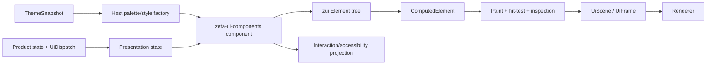

# Native UI：编写与样式契约

> 状态：Current contract。本文是 `zui`、`zeta-ui-components`、`zeta-workbench` 与 `app` product host 之间的 UI 编写和样式边界；具体 crate API 由 [`zui` README](../zui/README.md)、[`zeta-ui-components` README](../ui-components/README.md) 和 [`zeta-workbench` README](../workbench/README.md) 维护。

## 快速理解

Native UI 使用 Rust 声明组件结构和布局，使用 typed style struct 表达组件视觉，使用共享主题快照提供颜色和尺寸值；它不使用 DOM、CSS selector、stylesheet parser 或 cascade。

| 想表达什么 | 当前写法 | 谁拥有含义 | 是否允许调用方穿透覆盖 |
| --- | --- | --- | --- |
| 组件树与基础布局 | `Element::leaf`、`Element::row`、`Element::column` 及其 builder | `zui::ui::presentation` | 否；通过公开的 Element API 表达 |
| Button、Tab、InputBox 等组件外观 | `ButtonStyle`、`TabStyle`、`InputBoxStyle` 等 typed style | `zeta-ui-components` 组件 | 否；通过 style、state 或 named variant 传入 |
| 主题颜色和标准尺寸 | `ThemeSnapshot` 到 product palette，再到组件 style | `zeta-theme` 与各宿主投影 | 否；不在组件中复制主题值 |
| hover、focus、selected、disabled | host 投影的 typed state | 交互/产品 host 判定，组件解释视觉 | 否；组件不自行猜测业务状态 |
| view-local / projected state 与订阅 | `ViewState<T>`、`ComponentRuntime`、`ComponentContext::{local_state,observe_state,retain_resource}` | `zui` 管理 presentation 生命周期；host 仍拥有产品权威状态与副作用 | 否；只能通过 typed state 和稳定 component identity 连接 |
| 任意后代 selector、继承和 cascade | 无 | 无 | 不适用；当前 Native contract 不支持 |

一次 Native UI 帧的边界如下：



如果一个新 UI 能用现有 `Element`、组件 style 和 host state 完成，就不新增 CSS 方言或通用 widget 状态。只有跨多个真实组件重复出现、且无法由现有 typed contract 表达的语义，才进入下一层公共 API 设计。

## 1. 适用范围与非目标

本文适用于 `app/zui` 的 backend-neutral UI contract、`app/ui-components` 的可复用 Native 组件，以及 `app` 和领域 crate 的产品 presentation adapter。

本文不定义浏览器 Renderer 的 CSS；浏览器 DOM、CSS selector 和 Workbench Part 样式仍由 [`ui-styling-ownership.md`](../../docs/ui-styling-ownership.md) 拥有。共享 design token 的跨宿主规则由 [`design-tokens.md`](../../docs/design-tokens.md) 拥有。

Native UI 当前明确不提供以下能力：

- 外部 `.css`、JSON stylesheet 或运行时 style parser；
- 类 DOM 的 descendant selector、属性 selector、继承、cascade、specificity 或 `!important`；
- 通过组件名称、`ElementId` 或 product action ID 在运行时查找并改写任意节点；
- 由组件内部读取产品 reducer、窗口事件或平台 GPU 对象来决定视觉状态；
- 与 Chromium DevTools DOM/CSS/JavaScript debugger 兼容的调试模型。

这不是禁止未来增加样式编译能力；它要求未来能力先形成稳定的 Native semantic contract，不把 CSS 的开放后代覆盖模型直接引入组件树。

## 2. 四层所有权

| 层 | 负责什么 | 当前入口 | 明确不负责什么 |
| --- | --- | --- | --- |
| `zui` presentation | Element 树、基础 flow、computed geometry、paint primitive、scene、inspection，以及 view-local state/subscription 和 component mount resource | `zui::ui::{Element,Component,ComputedElement,UiScene,ViewState,ComponentRuntime}` | Button 语义、主题选择、产品 reducer、GPU 和业务 action/副作用 |
| `zeta-ui-components` component | Button、TabList、ScrollView、InputBox 等组件的内部几何、视觉状态解释和 scene composition | `zeta_ui_components::{ButtonStyle,TabStyle,ScrollViewStyle,...}` | 产品 identity、业务 state、pointer capture、command、副作用 |
| `zeta-workbench` | Workbench Titlebar、TabContainer、Toolbar、interaction identity、layout 与 presentation state | `zeta_workbench::{Titlebar,TabContainer,TabContainerState,...}` | Session、Terminal、Editor 等具体内容生命周期与 UI |
| Theme / palette projection | 将共享主题 token 解析为 immutable snapshot，再映射为宿主 palette 或组件 style | `zeta_theme::ThemeSnapshot`、`zeta_ui_theme::UiTheme` 及其 typed style factory | 判断组件是否 hover、selected 或 visible；创建 selector |
| Product host | 选择组件、保存权威状态、投影交互状态、提供 bounds、组合 scene 和执行 action | `app`、`features/workspace`、`zeta-editor` 等 | 复制组件内部布局、从 primitive 反推语义、穿透修改共享组件内部状态 |

这里的“组件拥有样式”表示组件拥有 style 字段的语义、状态到视觉的解释和内部绘制几何；不表示产品不能传入 palette-derived style。产品可以创建 `ButtonStyle` 的值，但不能假定 `Button` 内部的 icon、label、padding 和 state background 如何组合。

## 3. UI 的标准写法

新增一个有 box geometry 的组件时，按以下顺序实现：

1. 让 host 决定产品状态、稳定 `ElementId`、外部 bounds 和需要传入的 presentation state。
2. 在 `Component::element` 中返回一个 `ComponentElement`，用 `Element` 描述根节点和组件拥有的子节点 flow。
3. 让组件 style struct 表达外观参数，例如背景状态、文字、边框、圆角、padding、icon size 和 content gap。
4. 在 `Component::paint_element` 或 `Component::compose` 中消费同一次计算得到的 `ComputedElement`，不要重新计算根 bounds。
5. 用 `UiScene::draw_component` 或 `ComponentContext::draw_component` 组合子组件，使 paint、inspection、interaction 和 accessibility 共享同一棵组合树。
6. 需要跨帧 presentation state 时，让 host 持有 `ComponentRuntime`，通过 `UiFrame::with_component_runtime` 组合；组件根必须有稳定 identity，并使用有名称的 `ComponentSlot` 保存 local state、订阅外部 `ViewState` 或保留 RAII resource。
7. 为新增的布局、状态和视觉语义补充 component test，至少验证 computed geometry、状态绘制、hit-test、invalidation 和 unmount cleanup 使用相同边界。

最小结构示例：

```rust
fn element(&self) -> ComponentElement {
    Element::column("SearchPanel")
        .padding(Edges::uniform(12.0))
        .gap(8.0)
        .child(Element::row("Header").height(ElementLength::px(32.0)))
        .in_bounds(self.bounds)
        .with_identity(SEARCH_PANEL)
}
```

最小组件 style 示例：

```rust
let button_style = ButtonStyle::new(
    ButtonBackgrounds::new(palette.surface)
        .with_hovered(palette.surface_hovered)
        .with_pressed(palette.border),
    TextStyle::new(13.0, palette.text),
)
.with_corner_radii(CornerRadii::uniform(4.0))
.with_padding(Edges::new(6.0, 10.0, 6.0, 10.0));
```

上面的两个例子表达不同层次：`Element` 说明节点如何排列，`ButtonStyle` 说明 Button 如何解释自身的 visual state。不要把 Button 的内部文字偏移、icon bounds 或 hover background 再复制到 product host。

## 4. 布局契约

### 4.1 `Element` 负责基础流程

当前 `ElementStyle` 只表达以下属性：

| 属性 | 当前语义 | 当前 API |
| --- | --- | --- |
| 方向 | 直接子节点沿横轴或纵轴排列 | `Element::row` / `Element::column` |
| 宽度和高度 | `Fill` 或固定 logical pixels | `.width(...)` / `.height(...)`、`ElementLength::px(...)` |
| 内边距 | 内容区域的 top/right/bottom/left inset | `.padding(Edges)` |
| 子节点间距 | 相邻直接子节点之间的 gap | `.gap(f32)` |
| 圆角 | 当前节点的 rounded-rect presentation metadata | `.corner_radii(CornerRadii)` |
| 子树 | 直接子节点顺序 | `.child(...)` / `.children(...)` |

布局使用 logical UI pixels；DPI 转换只属于 renderer。`ComponentElement::compute` 产生的 `ComputedElement` 是 paint、hit-test 和 inspection 的共同几何来源。`ElementStyle` 的实现和当前字段以 [`element.rs`](../zui/src/ui/presentation/element.rs:39) 为准。

### 4.2 外部布局与组件内部布局分开

`zeta-workbench` 负责 Workbench/Pane 的外部结构几何，并使用 `zui::ui::{SplitViewLayout,GridLayout}` 计算通用约束；它不替代 `Element`，也不持有具体内容的 Pane state。`zeta-ui-components` 只负责组件内部的 Button、Tab、scrollbar、input chrome 和浮层布局。

组件内部的 Button content、Tab item、scrollbar、input chrome 和浮层 content 由对应 `zeta-ui-components` 组件 style 与 Element tree 负责。产品 host 只提供外部 bounds、数据投影和 interaction identity。

如果组件需要当前 contract 尚未表达的 min/max size、cross-axis alignment、intrinsic measurement、margin 或 wrapping，应先提出一个 typed layout contract；不能通过 host 手工计算一套平行 geometry，也不能用未定义的 CSS-like 字符串逃避类型设计。

### 4.3 当前不变量

- 组件不能在 paint、hit-test 和 inspection 中分别解释同一份 authored style；
- product host 不能从 scene primitive 反推组件树或重新注册第二份 geometry；
- `ElementId` 是交互和 retained presentation 的稳定身份，不是视觉 selector；
- `ComputedElement` 的 bounds、resolved padding、gap region 和 radius 必须来自同一次计算；
- renderer 只消费 immutable `UiScene`，不重新解释产品 layout 或组件 state。

## 5. 样式、变体与交互状态

### 5.1 类型化样式是 Native 的样式表

Native 中的 style struct 是组件公开的样式 contract。它可以包含颜色、文字、边框、圆角、padding、尺寸、间距、滚动条 presentation 或状态颜色，但每个字段必须有组件语义，不能成为任意 property bag。

新增视觉差异时按以下优先级处理：

1. 如果只是主题值不同，从现有 `ThemeSnapshot` 或 palette 投影不同值。
2. 如果是同一组件的稳定语义差异，增加有名称的 typed variant 或 selection，例如 `ButtonSelection`。
3. 如果多个组件共享同一套 geometry 或状态解释，扩展 `zeta-ui-components` 的公共组件 contract。
4. 只有结构、交互语义或生命周期确实不同，才新增组件类型。

不要为单个 product host 增加无语义的布尔开关、任意 CSS class、深层 selector 或公共组件继承层。

### 5.2 状态由 host 判定，组件负责视觉解释

| 状态 | 判定来源 | 组件能做什么 | 组件不能做什么 |
| --- | --- | --- | --- |
| hover | `UiDispatch` / pointer projection | 读取 `ButtonState::Hovered` 等 typed state 并选择背景 | 自己监听平台 pointer 或猜测业务 hover |
| focus | `UiDispatch` / focus model | 绘制 focused presentation | 自己抢 focus 或创建第二套 focus tree |
| pressed | 当前交互 dispatch | 绘制 pressed presentation | 直接执行 command 或修改产品 reducer |
| selected / checked | 产品 host 投影 | 使用 `ButtonSelection`、`TabSelection` 等 presentation | 把 selected 当作通用 hover 或从 `ElementId` 推断 |
| disabled | 产品/交互 host 投影 | 禁止或弱化视觉，并让 host 决定是否注册 action | 读取业务状态、自动禁用其他节点 |
| theme scheme | `ThemeSnapshot` | 消费 palette-derived style | 在组件中维护第二套 light/dark token 表 |

同一视觉状态只能有一个判定来源。组件可以组合多个状态，但不能让 `:hover`、focus flag、产品 selected flag 和本地临时布尔值各自画一套冲突的背景。

### 5.3 样式值与样式语义分开

组件定义“这个字段代表什么”，主题和宿主决定“这个字段当前取什么值”。例如 `ButtonStyle::with_pressed` 的意义由 Button 定义，`palette.border` 是否适合作为 pressed color 由产品 style factory 决定。

共享快照到绘制颜色和 typed style 的转换由 `zeta-ui-theme` 统一拥有。组件实现不应直接依赖 `zeta_theme`、产品 profile、workspace 或业务 domain，也不应自行混合主题颜色。

### 5.4 Retained view state 与组件生命周期

产品 reducer、session 和业务 store 仍是权威状态来源。`ViewState<T>` 只用于 view-local state 或 host 已经投影出的 typed presentation state；它提供稳定 identity、单调 revision、snapshot/update 和 RAII subscription，并允许 worker 更新后请求对应组件重绘，但不执行产品 action。

需要跨帧状态时，窗口或测试 host 为一帧调用 `UiFrame::with_component_runtime`。带 identity 的组件可以通过 `ComponentContext::local_state` 保存 typed local state，通过 `observe_state` 订阅外部 `ViewState`，或通过 `retain_resource` 创建一个只在挂载期存在的 RAII resource。某个 identity 未出现在下一帧时，runtime 会在该帧结束前卸载它并释放 subscription/resource；同一 identity 与 slot 的类型变化会显式报错。

这套 contract 不提供 virtual DOM、通用 effect scheduler 或组件内业务副作用。平台 listener、command、网络任务和 reducer mutation 仍由 host/runtime 的明确 owner 管理；只有生命周期必须与 presentation identity 一致的资源才进入 `retain_resource`。

## 6. 主题令牌投影

主题系统回答视觉值是什么，组件 style 回答这些值何时使用，host state 回答当前是否使用它们：

```text
zeta-theme token
  → immutable ThemeSnapshot
  → host palette / domain style factory
  → typed zeta-ui-components style
  → component state selection
  → UiScene primitives
```

Native 组件新增颜色或标准尺寸时，先检查共享 token 是否已有准确语义；没有时在实际消费语义的 domain 注册 token，再让 Native host 投影到 palette 或 style。不要在 component paint 中复制十六进制颜色，也不要把组件状态判断塞进 token resolver。

当前 Rust UI 主题投影由 `zeta-ui-theme` 将 `ThemeSnapshot` 原子转换成 `UiTheme`；Workbench、Session、Settings、Files、SCM 等能力 crate 再把它转换为自己拥有的 typed style。基础输入框、搜索框和滚动条样式由 `zeta-ui-theme` 提供；实现证据见 [`app/theme`](../theme/README.md) 和 [`design-tokens.md`](../../docs/design-tokens.md)。

如果现有组件仍包含历史 fallback 常量，它们属于迁移限制，不构成新组件的样式先例；修改相关区域时应优先移到共享 token 或明确的宿主 fallback。

## 7. 帧、检查与无障碍

Native UI 的 authoring contract 不只决定颜色和布局，还决定一帧的语义一致性：

1. host 把平台事件和产品状态投影为 `UiDispatch`、typed state、bounds 和稳定 identity；
2. component 返回 `ComponentElement`，并通过 `UiScene::draw_component` 或 `ComponentContext` 组合；
3. zui 只计算一次 `ComputedElement`；
4. paint 使用 computed bounds 写入 `UiScene`，interaction 使用同一 bounds 注册节点，inspection 使用同一 authored/computed style；
5. accessibility 从同一 interaction projection 生成，不另建 DOM 或 widget tree；
6. renderer 只消费 scene，不拥有 focus、command、accessibility 或产品 state。

因此，新增组件时只实现 paint 而绕过 `Component::element`，或为 inspector/accessibility 单独手工构造一棵树，都属于 contract violation。

## 8. 当前状态与扩展点

### 当前状态 / 已实现

- `zui` 已提供 `Element`、`ComputedElement`、`Component`、`UiScene`、inspection 和 backend-neutral primitive contract；
- `zui` 已提供 `ViewState` revision/subscription，以及由稳定 `ElementId` 驱动 local state、external observation、RAII resource 和 unmount cleanup 的 `ComponentRuntime`；
- `zeta-ui-components` 已提供 Button、Switch、ActionBar、TabList、ScrollView、InputBox、ContextView 等 typed component/style contract；
- Native host 已通过主题快照、palette 和领域 style factory 向组件投影颜色与标准尺寸；
- 组件的 paint、interaction、inspection 和 accessibility 已沿同一 frame/Element contract 组合；
- DevTools 展示 scene inspection 和 computed layout，但不模拟 DOM/CSS debugger。

### 当前状态 / 当前限制

- `Element` 目前没有通用 margin、min/max、alignment、intrinsic measurement 或完整 flex/grid property vocabulary；
- Native 没有 style inheritance、selector、cascade、stylesheet 文件或运行时热更新；
- 主题 token 已跨 Desktop、Native 和 TUI 共享，但各宿主仍需要自己的 palette/style projection；
- 样式 ownership 主要由 API 和 review 约束，尚未有覆盖所有 Native component 的自动 deep-override lint；
- 组件 custom content、状态组合和产品响应式规则仍由对应组件/host contract 明确表达，不能由通用 style engine 猜测。

### 扩展点

未来扩展必须先回答：

- 新属性是结构布局、组件内部几何、主题值还是产品状态？
- 是否有至少两个真实 caller，足以证明它应进入 `zui` 或 `zeta-ui-components` 公共 contract？
- 它如何同时驱动 paint、hit-test、inspection 和 accessibility？
- 它是否需要 retained state、animation 或 frame invalidation？如果需要，能否接入 `ComponentRuntime`、`ViewState`、`AnimationRegistry` 或现有 `zui::runtime`，并由稳定 identity 管理生命周期？
- 它是否会让 host 通过字符串 selector 穿透组件内部？如果会，应改成 typed variant 或新的组件 owner。

只有在出现用户可编辑 Native skin、多个外部 component author 或跨进程 UI schema 等真实需求后，才评估受限的 declarative style format。即使引入，也应优先采用 semantic component slots 和 typed values，不直接复制浏览器 CSS 的开放 cascade。

## 9. 新 UI 的审查清单

- [ ] 产品状态、交互状态、稳定 identity 和外部 bounds 仍由 host 拥有。
- [ ] 组件通过 `Component::element` 声明根 Element，并使用 `ComputedElement` 作为唯一 box geometry 来源。
- [ ] retained local state、subscription 或 resource 使用稳定 component identity 和有名称的 `ComponentSlot`；测试覆盖 invalidation、重绑定与 unmount cleanup。
- [ ] 可复用视觉属性进入 typed style 或 named variant，而不是散落的魔法数和字符串键。
- [ ] 主题颜色和标准尺寸来自 snapshot/palette；没有新增第二套主题表。
- [ ] hover、focus、pressed、selected、disabled 的判定来源唯一，且没有把 `ElementId` 或 action ID 当 selector。
- [ ] 子组件通过统一 composition context 绘制，inspection、interaction 和 accessibility 没有平行树。
- [ ] 组件不依赖 `wgpu`、`winit`、product reducer、App Server 或平台 timer。
- [ ] 测试验证 computed geometry、状态 presentation、hit-test 和必要的 accessibility projection。
- [ ] 修改了 public API、owner、token 或限制时，同步更新 `zui`/`zeta-ui-components` README 和本契约的状态表。

## 10. 实现入口

实现者先读本文确定 ownership，再按修改面进入对应 README：

| 修改内容 | 入口 |
| --- | --- |
| Element、computed layout、scene、inspection、renderer-neutral primitive | [`zui` README](../zui/README.md) |
| Button、List、Tab、ScrollView、InputBox 等通用组件 | [`zeta-ui-components` README](../ui-components/README.md) |
| 主题 token、alias、snapshot 和跨宿主值 | [`Design Token 文档`](../../docs/design-tokens.md) |
| Native host 的 pane/product composition | [`app` 文档导航](README.md) 与对应 domain crate README |
| GPU、surface、atlas、shader 和 present | [`rendering-architecture.md`](rendering-architecture.md) |

本契约固定的是 Native UI 的 authoring boundary；具体字段、默认值、测试入口和失败语义仍以代码与对应 crate README 为准。
