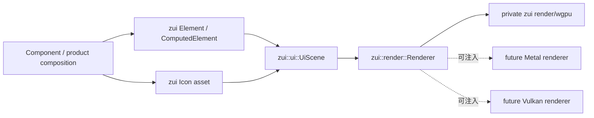

# UI 渲染架构

> 状态：当前实现。本文拥有组件到图形后端之间的替换边界；`zui` 内部开发规则见
> [`zui` 开发文档](../zui/README.md)，组件边界见 [`zeta-ui`](../ui/README.md)，产品 icon
> catalog 见 [`zeta-icons`](../icons/README.md)。

## 快速理解

应用和组件只接触单一 public `zui` crate。组件声明“如何布局、画什么”，`Renderer` 决定“如何
执行一帧”，私有 wgpu 模块才知道 device、queue、shader、surface 和 present。单 crate 收拢的是
发布和接入边界，不是取消内部分层。

| 常见问题 | 当前行为 | 替换后端时是否改组件 |
| --- | --- | --- |
| 组件如何绘制矩形、文字、图标和图片？ | 向 `zui::ui::UiScene` 写入 backend-neutral primitive | ❌ |
| 谁执行一帧？ | `zui::app::WindowContext` 调用 `dyn zui::render::Renderer` | ❌ |
| 谁接触 GPU 对象？ | 仅 `zui` 私有 `render/wgpu` 或注入的替代 backend | 不适用 |
| 当前默认后端是什么？ | `zui::render::WgpuRendererFactory` 选择私有 wgpu 实现 | 不适用 |
| 可以增加 raw Metal/Vulkan backend 吗？ | ✅，实现 public `Renderer` 与 `RendererFactory` 后注入 | ❌ |

## 边界与所有权

| 层 | 决定什么 | 明确禁止 |
| --- | --- | --- |
| Component / product | 状态、声明式 Element、primitive 顺序、clip 与 overlay | GPU handle、shader、backend feature、手写检查元数据 |
| `zui::ui` / `zui::runtime` | logical UI contract、scene、interaction 与 retained runtime | window、具体 GPU API、产品状态 |
| `zui::render::Renderer` contract | target size、frame outcome、统一 backend error 与 frame execution | surface、window、pipeline、atlas |
| private `zui::render/wgpu` | physical conversion、batch execution、resource cache、shader、submit、present | 产品 layout、identity、input、accessibility |
| `zui::window` / `zui::input` private native integration | native window、keyboard/IME、chrome capability | scene、GPU pipeline、产品 reducer |
| `zui::app` | event loop、backend 选择、window/renderer registry、resize/scale 与 retry orchestration | 产品领域状态、具体组件 |
| `zeta-ui` | Button、ActionBar、TabList、ContextView 与产品 pane geometry | scene/backend ownership、产品状态 |
| Product | Session、PTY、App Server、command 与 authoritative state transition | 直接依赖内部 platform/GPU 实现 |

布局检查器消费 `UiScene` 同步生成的 `InspectionFrame`。所有 `Component` 和产品 composition
surface 都先声明 `Element`；computed layout 自动生成尺寸、padding、gap、radius、实际 gap region、
authored style 与声明位置。采集发生在 renderer 之前，因此切换 GPU API 不会改变检查结果。

`ShellPresentation` 以 `zui::ui::UiFrame<InteractionFrame>` 作为单一 frame owner，再保存
accessibility projection；只有 `UiScene` 交给 `Renderer`。命中、焦点、cursor、command dispatch
和 accessibility 不属于 GPU 协议。

## 当前执行流程

1. Component 通过 `UiScene::draw_component` 组合子组件；`Component::element` 只解析一次
   `ComputedElement`，同源驱动 inspection 与 paint。
2. `UiScene` 按 composition layer 与 primitive 插入顺序产生连续 `SceneBatch`，跨 primitive
   类型的覆盖顺序不得被 renderer 重排。
3. Product 保存同一 frame 派生的 scene、inspection、interaction 与 accessibility snapshot，不获得
   任何 GPU 对象。
4. `WindowContext::render_scene` 把 scene 交给 framework registry 中的 `Box<dyn Renderer>`。
5. 默认 `WgpuRendererFactory` 创建私有 wgpu renderer；替代 backend 通过同一 factory contract 注入。
6. wgpu 模块把 logical primitive range 转为 physical instances/glyph buffers，按 scene 顺序切换
   pipeline、提交并 present。

wgpu 在 macOS、Linux 和 Windows 上本身可选择 Metal、Vulkan 或 DX12。这里的 backend 替换是更高一层
的 renderer implementation 替换，例如绕过 wgpu 编写专用 Metal renderer。

## 长期不变量

- backend-neutral 模块不依赖组件 crate、窗口系统或具体 GPU API；
- public `zui` 可以组合内部 window/GPU 实现，但不在应用 API 暴露具体 backend 类型；
- 通用 `Icon` contract 归 `zui`，`zui` 不依赖 `zeta-icons` 产品 catalog；
- `zeta-ui` 只依赖 `zui`，不拥有 scene/backend contract；
- Component 只能产生 scene primitive，不能接受 backend context；
- backend 不重新解释产品 layout、component identity 或 interaction state；
- interaction/accessibility frame 不进入 `Renderer` 或 GPU 模块；
- product 和 component crate 不依赖 wgpu/winit，也不存在可绕过 `zui` 的内部 sibling crate；
- backend-specific 优化不能污染 scene API，除非能定义稳定的跨后端语义。

`zui::architecture_tests` 固定内部 layer direction、同名 capability owner、native dependency 归属和
500 行模块上限；product 的 `component_composition_tests` 固定 `zeta-ui → zui`、旧 sibling crate
不可恢复，以及 GPU 不拥有 interaction/accessibility。

## 当前状态与演进

当前已完成 scene/backend 分离、ordered scene batching、single-frame presentation/interaction、
`Renderer` trait、wgpu implementation、application/window runtime、renderer type erasure、通用 icon
contract 与单一 public `zui` crate 收拢。`zui-demo` 提供无产品状态的 recording backend 和 native
smoke host。

尚未实现 backend capability negotiation、运行时热切换、raw Metal/Vulkan renderer 或跨 backend
golden-image 一致性测试。新增 backend 时可放在独立第三方 crate，但只能依赖 public `zui` contract，
实现 `Renderer` / `RendererFactory` 并在 composition root 注入；不得要求组件或产品读取 backend
类型。随后应对 primitive、色彩空间、clip、layer、字体 fallback 与 surface recovery 建立一致性测试。
