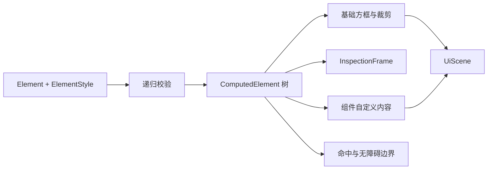

# ZUI 声明式节点与样式

> 状态：Current。本文拥有 ZUI 节点样式语言、校验边界和自动绘制流程；主题值归属见 [`Design Token：图形界面主题系统边界`](../../docs/design-tokens.md)，组件编写边界见 [`UI 编写与样式契约`](native-ui-authoring.md)，底层布局与渲染边界见 [`UI 渲染架构`](rendering-architecture.md)。

## 快速理解

ZUI 提供类型化的声明式节点和样式语法，让调用方在一个位置描述结构、布局和基础外观；同一份声明生成布局、基础绘制和检查信息。ZUI 不保存产品主题、不解释用户配置，也不通过选择器修改组件内部节点。

| 编写场景 | 标准入口 | 写错时发生什么 |
| --- | --- | --- |
| 复用一组节点样式 | `style!` 生成 `ElementStyle` | 未知字段或错误值类型无法编译 |
| 声明静态节点树 | `ui!` 生成 `Element` | 不支持的节点结构无法编译 |
| 使用运行期尺寸 | 普通 `ElementStyle` builder | `ComponentElement::try_compute` 在写入 scene 前返回带节点路径和源码位置的错误 |
| 绘制背景、边框、圆角和阴影 | `ElementStyle` 的基础外观字段 | 一次节点计算同时驱动绘制与检查，不允许第二套 bounds |
| 绘制复杂文本、编辑器或终端内容 | 组件在计算后的节点内自定义绘制 | 自定义绘制仍使用同一 `ComputedElement`、clip、layer 和检查父级 |

## 1. 所有权

| 层 | 负责 | 禁止 |
| --- | --- | --- |
| ZUI | 节点语法、样式属性类型、值校验、布局、基础方框绘制、裁剪、源码位置和检查树 | 产品颜色名称、主题默认值、用户偏好、Button 业务状态 |
| `app/theme` | 把主题快照与图形界面偏好转换成颜色、排版、尺寸和动画值 | 节点树、交互状态、任意后代覆盖 |
| 组件 crate | 组件公开样式、具名外观、状态到视觉的选择和内部节点结构 | 从配置读取主题值、用字符串选择器暴露内部节点 |
| 产品功能 | 在自己的 `style.rs` 组合主题值，在界面文件声明节点、内容和交互 | 复制组件内部布局、绕过节点计算另建命中几何 |

ZUI 拥有“怎样表达和值是否合法”，但不拥有“产品现在选择什么值”。持久字体、字号、密度和减少动画等偏好仍由 `[gui]` 解释；颜色、标准尺寸、圆角、阴影和视觉动画仍来自主题 token；命中、拖拽和状态判定仍由组件负责。

## 2. 标准写法

功能样式文件保存可复用规则：

```rust
let panel = zui::style! {
    column {
        width: fill;
        height: fill;
        padding: [16, 24];
        gap: 12;
        background: colors.surface;
        border: Border::uniform(1.0, colors.border);
        radius: 10;
        overflow: clip;
    }
};
```

界面文件声明节点树：

```rust
let root = zui::ui! {
    column("Settings") {
        style: panel;

        child row("Header") {
            style {
                height: 48;
                align: center;
                gap: 8;
            }
        }

        children: section_elements;
    }
};
```

宏只把字段转换为普通 `ElementStyle` 与 `Element` 调用。删除宏后，类型、校验、布局和绘制能力仍然完整存在；宏不能形成另一套运行时样式引擎。

## 3. 支持的节点样式

| 类别 | 属性 | 规则 |
| --- | --- | --- |
| 方向 | row、column、leaf | 方向属于节点自身；leaf 不能在 `ui!` 中声明子节点 |
| 尺寸 | width、height、content size | 支持 fill、content 和非负有限逻辑像素 |
| 排列 | justify、align、padding、gap | padding 和 gap 必须是非负有限值 |
| 方框 | background、border、radius、radii、shadow | `radius` 接受统一数值，`radii` 接受 `CornerRadii`；边框宽度、圆角和 blur 必须非负且有限 |
| 溢出 | visible、clip | clip 使用节点当前圆角，并约束自动绘制与组件自定义内容 |
| 结构 | child、children | 静态 child 与运行期集合进入同一父子树和检查树 |

文字内容、图标、图片和业务组件不是任意样式字段。它们通过对应的类型化节点或组件 API 进入树；编辑器、终端和虚拟列表保留自定义测量与批量绘制入口。

## 4. 错误边界

样式错误不得依赖 GPU backend、截图或肉眼发现。一次节点进入 scene 前按以下顺序处理：

1. 宏拒绝未知属性、非法语法和不匹配的字段类型。
2. `ComponentElement::try_compute` 验证根 bounds、全部节点样式和内容尺寸。
3. 错误包含从根到错误节点的路径、属性、原因以及声明节点的文件和行号。
4. `ComponentElement::compute` 和正式绘制入口对同一错误立即失败，不裁剪成零、不替换默认值，也不把非法值交给 renderer。
5. 合法但超出可用空间的尺寸由布局约束裁剪；这是布局结果，不是非法样式恢复。

错误至少区分非有限值、负值和无效根 bounds。组件更严格的规则，例如 Sash track 必须为零宽或零高，继续由组件构造函数验证。

## 5. 统一计算和绘制



父节点背景先绘制，随后按节点顺序绘制子节点基础外观，组件内容最后在同一根节点上下文中绘制。`overflow: clip` 同时约束子节点基础外观和组件内容。浮层继续通过 `ComponentElement::in_overlay` 创建新的 scene layer；普通父子关系不隐式创建浮层。

## 6. 明确不做

- 不解析 `.css`、JSON 样式表或运行期字符串属性。
- 不提供 descendant selector、specificity、`!important` 或任意 cascade。
- 不通过 `ElementId`、action ID 或节点名字查找并修改其他组件内部节点。
- 不让普通布局节点拥有 hover、pressed、selected 等组件状态。
- 不因为宏缺少一个高级能力就复制一套手工布局、检查或命中树。

## 7. 扩展规则

新增属性前必须回答它是否同时影响布局、绘制、检查、命中或无障碍，以及它是否至少有两个真实调用方。通用方框或布局属性进入 `ElementStyle`；组件状态和内部结构进入对应组件样式；产品只使用一次的布局值留在该功能的 `style.rs`。

宏只接受底层普通 Rust API 已经稳定支持的属性。先扩展类型和校验，再扩展宏；禁止先增加宏关键字、随后在展开代码中私自解释行为。
