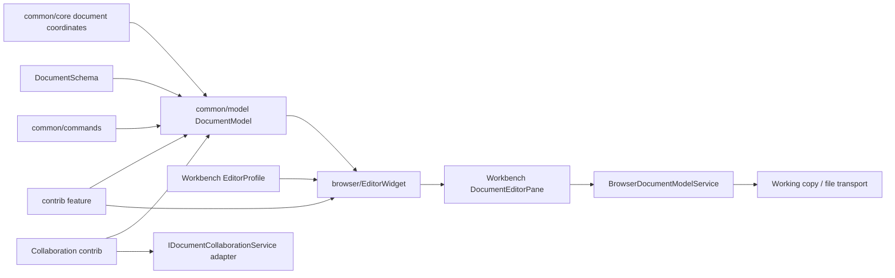

# Aster Document Engine

> 本文是结构化文档编辑器的 canonical 设计规范，拥有 schema、document model、transaction、selection、history、browser projection、profile、collaboration、当前状态和修改契约。Editor 总体目录与产品装配见 [`README.md`](./README.md)，跨 Workbench、持久化与服务端的系统边界见 [`docs/editor-architecture.md`](../../../../docs/editor-architecture.md)，浏览器实现细节见 [`browser/README.md`](./browser/README.md)。
>
> 状态：Current。潜在演进会单独标记，不能被解释为已实现能力。

## 快速理解

Aster Document Engine 是 Zeta 唯一的结构化文档同步权威。`DocumentModel` 保存 schema-validated tree、selection、transaction、history 和 plugin state；`EditorWidget` 只负责浏览器投影；Workbench 负责 pane、resource reference、working copy 和产品 profile。

| 场景 | Canonical owner | 关键保证 |
| --- | --- | --- |
| 修改节点、文本、mark 或表格 | `DocumentTransaction` → `DocumentModel` | 整个事务先验证再原子提交 |
| selection、undo/redo 和 stored marks | `DocumentModel` | 与 document version 一起映射，不依赖 DOM lifetime |
| 结构化 DOM 和输入 | `EditorWidget` | DOM 只是 projection，不是文档权威 |
| Academic schema、citation 和 toolbar | `EditorProfile` + matching contrib | 产品语义不进入通用 document core |
| 打开、保存、revert 和 conflict | `BrowserDocumentModelService` + `DocumentWorkingCopy` | Workbench transport 不拥有 document mutation |
| 本地或远程 collaboration | collaboration contrib + `IDocumentCollaborationService` | server 排序；client 不伪装成完整 CRDT authority |
| `textBlock` 内嵌行编辑 | `IEmbeddedTextEditorFactory` | Document owns block identity；Text Engine 不依赖 document types |

## 设计不变量

- `DocumentModel` 是 document tree、selection、stored marks、version、history 和 plugin state 的唯一同步 mutation authority。
- `DocumentSchema` 决定 node/mark vocabulary、child order、group、cardinality 和 attributes；browser node view 不能绕过 schema。
- Document Engine 与 Text Engine 共享 editor 目录和基础设施，但不共享 model、selection 或 transaction authority。
- `DocumentPoint` 和 node identity 是 durable mapping anchor；DOM offset 和 DOM node lifetime 不能成为 model coordinate。
- Transaction、selection mapping、plugin apply 和 final schema validation 要么全部成功，要么不改变 model/history/version。
- Profile-specific schema、node views、toolbar 和 collaboration schema identity 留在 profile/contrib owner，不进入通用 `common/model`。
- Workbench 拥有 pane/input、working copy、resource transport 和 product composition；Editor common 不依赖 Workbench。
- Collaboration transport、room authorization 和 server ordering 不进入 `DocumentModel`。

## 分层与依赖方向

| 层 | 拥有 | 不得拥有 |
| --- | --- | --- |
| `common/core` | `DocumentPoint`、`DocumentSelection`、absolute position value | schema、DOM、profile |
| `common/model` | node tree、schema、transaction、mapping、history、plugin、decoration、serialization | browser focus、Workbench、transport DTO |
| `common/commands` | DOM-free structural/text command plan | toolbar、keyboard listener、pane state |
| `browser/editorWidget.ts` | node/mark DOM、input、selection projection、node-view lifecycle | resource save、profile matching、second model |
| `contrib/<feature>/common` | feature schema、command、state、rebase data | DOM、Workbench composition |
| `contrib/<feature>/browser` | node view、toolbar、transient UI | transaction authority、pane registration |
| Workbench document services | model reference、working copy、persistence、profile materialization | document edit semantics、browser internals |
| Collaboration adapters | App Server/HTTP DTO、authentication、polling/retry | profile schema、optimistic editor state |

依赖保持 `Workbench → editor/contrib/browser → editor/common → base`。`DocumentModel` 不依赖 `TextModel`；Text Engine 也不 import document schema 或 document node types。

## Schema 与 Document Model

### Document tree

`DocumentNode` 是 immutable tree value，block 和 inline structure 使用稳定 node identity。`DocumentSchema` 支持 node kind、group、attribute、mark、ordered content terms 和 `min`/`max` cardinality。Custom top node 与默认 `doc` 走同一验证路径，transaction 不假设 root name。

`createNode` 和 transaction builder 可以在一次原子组装期间创建 incomplete composite fragment；child type 与 order 始终验证，只有 content minimum 可以通过显式 `allowIncompleteContent` 暂时放宽。Commit 前必须执行 strict final validation。

### Transaction 与 mapping

`DocumentTransaction` 包含 replace text、insert/delete/move node、set attributes、set marks 和 set node type 等 steps。所有 steps 都对同一个 pre-transaction document 解释，生成一份 `DocumentTransactionMapping`，供 selection、decoration、plugin 和 history 共用。

Transaction metadata 通过 `withMeta`/`getMeta` 保持 immutable。Typing、paste、IME、command 和 remote origin 可以携带明确语义，但 inverse history 不继承只描述原始用户动作的 metadata。

`serializeDocumentTransaction` 和 `deserializeDocumentTransaction` 是 transport-neutral replay contract。Deserializer 验证 step、selection、stored marks 和 JSON-safe metadata，不能把 transport payload 直接提交给 model。

### Selection、history 和 stored marks

`DocumentSelection` 是 closed union：

- `TextSelection`：同一或跨相邻 block 的文本范围；
- `NodeSelection`：image 等 atomic node；
- `AllSelection`：整个 document。

Selection 使用 identity-based `DocumentPoint` 映射。`DocumentTransaction.withSelection(undefined)` 表示显式清除 selection，区别于让 model 自动 mapping。

`DocumentHistory` 保存 transaction 与 selection snapshot。Undo/redo 通过同一 schema 和 mapping contract 重放。Collapsed selection 的 stored marks 是 editor insertion state，后续 typing、paste 和 IME 使用它们，但它们不是 DOM selection 属性。

### Plugin 与 decoration

`DocumentPlugin` 是 common-layer state extension。Plugin state 在 user、remote、undo、redo、reset 和显式 selection change 时原子更新；`filterTransaction` 可以在 mutation 前拒绝 transaction。Plugin failure 不能留下部分 document、selection、history 或 version。

`DocumentDecorationSet` 保存 immutable identity-based ranges。每个 plugin/source 保持独立集合；view 可以合并投影，但不能丢失 source identity。Transaction mapping 只计算一次，range 无法映射时明确 drop。

## Browser projection

`EditorWidget` 是 canonical structured browser surface。它消费 caller-owned `DocumentModel`，创建 node/mark DOM、映射 browser input 与 selection，并拥有 node-view handle 的 `update`/`dispose` 生命周期。Disposing widget 不 dispose caller-owned model。

Browser surface 采用两种 text projection：

- 简单的无 mark 单一 text run 可以使用 lightweight textarea；
- 多 run、mark、hard break、inline atom 或 decoration 使用 run-based `contenteditable` surface。

`beforeinput`、paste、selection delete、split/join 和 IME 最终都转换为 common command/transaction。IME provisional DOM 在 commit 时形成一个 metadata-bearing history transaction；cancel 恢复最后的 model snapshot。

Browser HTML 永远不是 trusted document state。Structured clipboard 使用 versioned custom MIME envelope；外部 HTML 只通过 restricted vocabulary converter 进入 schema-validated fragment，script、event attribute、unsafe URL、style 和 unknown state 被拒绝。Plain text 始终是 fallback。

## Text Engine 嵌入边界

`textBlock` 是 Document Engine 的普通结构化文本块；`codeBlock` 表达 Text Engine 的代码语义。二者不能因为都显示文本而共享 model identity。

Document browser 通过 `IEmbeddedTextEditorFactory` 请求一个嵌入式行编辑 surface：

- Document Engine 拥有 block identity、document transaction 和 schema；
- `EmbeddedTextEditorFactory` 可以用 `CodeEditorWidget` 提供实现；
- Text Engine 不知道 document node、profile 或 document persistence；
- 没有 factory 时，Document Widget 可以使用自己的 text surface，不建立隐藏 `TextModel`。

## Profile 与 Contribution

Workbench `EditorProfile` 将以下产品选择稳定组合：

- resource matcher 和稳定 `editorId`；
- schema factory 和 canonical empty-document factory；
- block/inline node views；
- toolbar actions；
- document plugins；
- collaboration schema identity。

Schema 在一个 pane 生命周期内固定。不同 schema 的 profile 不得共享同一个 pane instance。`createDocumentEditorPaneOptions` 在 Workbench composition root 把 profile 与 text-file、working-copy、embedded editor 和 collaboration services 组合。

通用 formatting、clipboard、collaboration 等能力属于独立 contribution。Academic title/abstract/section、citation/reference 等领域节点属于 matching profile/contrib，不得添加到默认 `DocumentSchema`。

## Collaboration

Collaboration 使用 server-ordered transaction stream，而不是让 `DocumentModel` 自己选择分布式顺序。

```mermaid
flowchart LR
    Local[Local transaction] --> Sync[DocumentCollaborationSynchronizer]
    Sync --> Submit[Exact in-flight envelope]
    Submit --> Authority[App Server or remote room authority]
    Authority --> Ordered[Ordered versioned update]
    Ordered --> Controller[DocumentCollaborationController]
    Controller --> Rebase[Rebase pending local/history]
    Rebase --> Model[DocumentModel]
```

- `DocumentCollaborationSynchronizer` 分开保存 canonical、exact in-flight 和 later optimistic buffer。较晚 typing 不能泄漏到较早 submit snapshot。
- `DocumentCollaborationController` 把一个 `DocumentModel` 绑定到 `IDocumentCollaborationService` connection，应用 ordered remote updates 和 rebase。
- `rebaseDocumentTransaction` 只处理共享 base 上的一侧 pending-local transformation；它不是完整 OT/CRDT session。
- `rebaseDocumentHistory` 重写 local undo/redo branch；无法安全 replay 的 branch 被 drop，而不是覆盖 remote content。
- Snapshot resync 如果会丢弃 local intent，controller 停止并报告 `resyncRequired`，不静默 reset。
- App Server local room 与 remote collaboration server 共享 ordering、bounded replay、snapshot resync 和 exact-submit-retry contract。
- Remote room 使用 owner/editor/viewer role。Viewer 在 widget 创建 optimistic edit 前就被投影为 read-only；只有 owner 可以管理 members。
- Presence 和 remote selection 是带 lease 的 ephemeral stream，不进入 durable document history。

`IDocumentCollaborationService` 是 editor-owned transport seam。Workbench adapter 持有 endpoint、credential、HTTP/App Server DTO 和 retry policy；这些信息不进入 document model 或 document serialization。

## 持久化与 Workbench

`BrowserDocumentModelService` 解析一个 resource 为 caller-owned `DocumentModelReference`。`DocumentWorkingCopy` 适配 serialization、dirty/revert/conflict、expected-revision save 和 untitled Save As。`DocumentEditorPane` 负责 host layout、visibility、focus 和 working-copy exposure，不实现 document command。

Empty resource reload/revert 使用 profile 的 canonical empty-document factory；非空 plain text migration 使用通用 paragraph path。Persistence 反序列化必须使用当前 profile schema，不能先创建 generic document 再由 browser 修补。

## 失败与生命周期

- Invalid node、attribute、mark、selection、step 或 final schema 在 commit 前失败。
- Transaction mapping、plugin apply、selection mapping、history update 和 version advance 是一个原子 boundary。
- Node view 创建失败不能改变 model；已创建 handle 由 widget dispose。
- Clipboard/custom MIME/remote envelope 在 schema 与 protocol validation 前不能进入 model。
- Model reference、widget、pane、working copy 和 collaboration connection 分别释放自己创建的资源，不跨 owner dispose。
- Remote retry 只重试可证明没有改变 exact submit identity 的请求；unknown outcome 通过 server version/replay contract 恢复。
- Profile schema 或 `collaborationSchemaId` 变化是持久兼容边界，需要 serialization migration 和 collaboration compatibility review。

## 当前状态与限制

| Area | Status | Boundary |
| --- | --- | --- |
| Schema、immutable tree、transaction、selection、history、serialization | ✅ Current | `editor/common` 同步权威 |
| Text/mark/list/table/link/image/hard-break editing | ✅ Current | common command + `EditorWidget` projection |
| Structured clipboard 和 restricted external HTML | ✅ Current | schema validation 后进入 model |
| Academic profile、outline、citation 和 formatting | ✅ Current | profile/contrib owned |
| Local/remote collaboration、membership、presence | ✅ Current | server ordered；transport 在 Workbench adapter |
| Selective author undo through unsafe remote replacement | 部分具备 | 安全 branch 保留；不安全 branch drop |
| Arbitrary profile-defined schema validation on server | Intentional boundary | profile 是 canonical validator；backend 不复制 browser profile schema |
| Off-thread synchronous document mutation | Non-goal | dedicated worker entrypoint 不改变 Renderer mutation authority |

## 关键实现入口

| Symbol/file | Responsibility | 修改时同步检查 |
| --- | --- | --- |
| `common/model/documentSchema.ts` | node/mark/content contract | profile schema、serialization、fixtures |
| `common/model/documentModel.ts` | document/selection/plugin/version authority | transaction、history、widget、collaboration tests |
| `common/model/documentTransaction.ts` | steps、mapping、metadata | selection、decoration、rebase、serialization |
| `common/model/documentHistory.ts` | undo/redo branches | remote rebase、selection restore |
| `common/model/documentPlugin.ts` | plugin lifecycle 和 filter/apply | atomicity、decoration projection |
| `browser/editorWidget.ts` | browser projection 和 input | DOM selection、IME、clipboard、node views |
| `contrib/collaboration/common/synchronizer.ts` | canonical/in-flight/buffered state | retry、ack、resync tests |
| `contrib/collaboration/common/controller.ts` | connection ↔ model binding | remote apply、presence、read-only state |
| Workbench `editorProfile.ts` | product schema/composition | pane identity、empty document、collaboration schema |

## 验证与修改影响

- 修改 schema、transaction、selection、history、plugin 或 serialization：运行 `corepack pnpm --dir desktop run test:editor:unit`。
- 修改 `EditorWidget`、clipboard、IME、node view 或 pane integration：运行 unit suite 和 `corepack pnpm --dir desktop run test:editor:browser`。
- 修改 collaboration protocol、rebase、membership 或 persistence：同步运行对应 Rust/service tests、architecture tests 和 Renderer typecheck。
- 所有改动运行 `git diff --check`。

修改 schema 时检查 profile、empty document、serialization 和 collaboration compatibility；修改 transaction/mapping 时检查 selection、history、decoration、plugin 和 rebase；修改 browser projection 时检查 DOM ownership、input atomicity、accessibility 和 disposal；修改 Workbench adapter 时检查 reference、dirty/conflict、expected revision 和 caller-owned model lifecycle。
