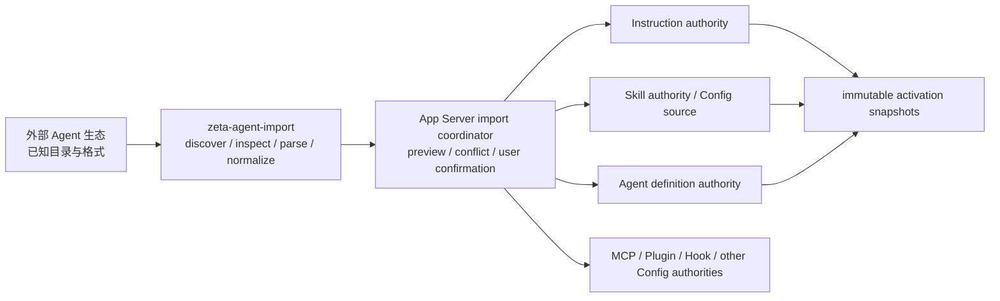

# Agent 自定义系统

> 本文是 Zeta 原生 Agent 自定义对象、物理命名空间、加载语义和外部生态导入边界的跨系统
> canonical owner。
>
> 状态：架构边界已接受（2026-08-12）；Workspace 原生 catalog slice 已实现：Global
> Instructions 会进入后续 model invocation，Skills 已有 metadata catalog、显式 activation 和通用
> context injection，可信 built-in Skill 自动 selector 与 Agent delegation definition 选择已经接通。
> Contextual/OnDemand Instruction 的通用选择、Agent definition list/picker API 和完整 import apply
> 仍未实现。
>
> Skill 的格式、来源与激活细节见 [`skills.md`](skills.md)；外部格式发现和转换实现契约见
> [`zeta-agent-import` README](../zeta-rs/agent-import/README.md)；配置与事务边界见
> [`config.md`](config.md)；最终模型输入由 [`core-context.md`](core-context.md) 定义。

## 快速理解

Zeta 只把 Instructions、Skills 和 Agents 作为 Agent 自定义领域对象。Prompt 是运行时送入模型的
信息形式，Slash Command 是调用入口；两者都不是第四种可持久化自定义对象。项目级原生对象统一
位于小写 `.zeta/`，其他产品的目录和格式必须经过 `zeta-agent-import`，不能由原生 loader
顺便扫描。

| 用户想表达什么 | Zeta 对象 | 何时进入运行时 | 典型入口 |
| --- | --- | --- | --- |
| “在这个环境里应长期遵循什么” | Instructions | 全局、上下文匹配或显式按需加载 | 自动解析或用户选择 |
| “这类工作应该怎样完成” | Skills | 被用户选择或模型匹配后渐进加载 | picker、Slash Command 或模型选择 |
| “由哪种执行配置来工作” | Agents | 启动主执行者或委托执行者时冻结配置引用 | Agent picker 或 delegation |
| “现在请完成这件事” | 当前 Turn 的用户输入 | 构造本次 `ModelRequest` 时 | 普通消息 |
| “快速调用某个能力” | 不是新对象 | `$name` 选择已有 Skill，`/name` 调用产品命令 | `$review`、`/status` |
| “把别的 Agent 配置带进来” | Import workflow | 用户确认并由目标 authority 发布后 | Desktop import |

## 1. 领域对象只有三类

| 对象 | 回答的问题 | 拥有 | 明确不拥有 |
| --- | --- | --- | --- |
| Instructions | Agent 应遵循什么长期或作用域指导？ | 指令正文、作用范围、加载策略、优先级来源和内容摘要 | 可执行脚本、工具授权、模型调用本身 |
| Skills | Agent 如何完成一类可复用工作？ | `SKILL.md`、渐进加载、引用资源、选择策略和来源身份 | 工具实现、脚本执行权限、当前任务实例 |
| Agents | 使用什么执行配置？ | 模型/工具/Skill/Instruction 的类型化引用、执行角色和委托约束 | Thread 运行时身份、凭据、批准或工具实现 |

三类对象不能按文件扩展名区分语义，也不能合并成一个泛化的 `PromptArtifact`。它们会以不同方式
参与上下文和执行，因此需要独立 authority、校验与 snapshot。

以下概念不进入 artifact type：

- **Prompt**：模型输入的底层信息形式。Zeta 的 provider-neutral 运行时输出是 `ModelRequest`，
  不建立 `Prompt` 领域对象或 `prompts/` 原生目录。
- **Task**：当前工作由 `Turn` 的用户输入和 durable Thread history 表达。重复工作流使用 Skill；
  需要只允许用户主动调用时，使用 `UserOnly` Skill，而不是新增 Task/Preset 类型。
- **Slash Command**：调用已有对象或产品命令的 UI 投影，不是持久化定义格式。
- **Agent runtime identity**：Agent definition 是配置对象；执行分支仍由 Thread 标识，不能仅因
  新增定义文件就在协议中发明第二套运行时身份。

## 2. 类型、来源和加载策略是三条独立轴

一个 artifact 的类型不能同时承担“从哪里来”和“何时加载”。目标模型必须分别表达：

| 轴 | 典型取值 | 决定什么 |
| --- | --- | --- |
| Artifact kind | Instructions / Skills / Agents | 对象结构、authority 与 runtime contribution |
| Scope/source | Built-in / User / Workspace / Plugin | 生命周期、优先级、可写位置与失效方式 |
| Provenance | Zeta native / imported from external ecosystem | 审计、冲突解释和重新导入来源 |
| Activation policy | 按对象类型定义的 named enum | 自动加载、上下文匹配、用户调用或模型选择 |

“Imported”不是 User/Workspace 的替代 scope。导入后的对象仍属于明确的 User 或 Workspace
authority，同时保留外部生态、来源位置 identity 和 digest 等 provenance。Plugin 贡献继续由
Plugin package 拥有，不能复制成普通 Workspace 文件后丢失 package/version 身份。

### 2.1 Instruction 加载策略

Instruction authority 的 canonical policy 使用穷尽枚举，不通过 `applyTo` 是否存在或
`alwaysApply: bool` 间接猜测：

```rust
pub enum InstructionLoadPolicy {
    Global,
    Contextual { patterns: Vec<GlobPattern> },
    OnDemand,
}
```

- `Global`：在对应 scope 的每次 Agent interaction 中加载。
- `Contextual`：只有当前资源或工作上下文命中 pattern 时加载。
- `OnDemand`：只在用户或上层已验证引用显式选择时加载。

外部格式中的 `applyTo`、`globs`、`alwaysApply` 等字段由 `zeta-agent-import` adapter 转换成这三种
语义。`applyTo: "**"` 仍是“恰好匹配所有文件的上下文规则”，不能偷偷改写成 Global；真正的
Global 必须由来源格式中明确等价的语义产生。

### 2.2 Skill 调用策略

Skill 的可发现性与调用方也使用 named policy，而不是两个容易产生非法组合的布尔字段：

```rust
pub enum SkillInvocationPolicy {
    UserOrModel,
    UserOnly,
    ModelOnly,
}
```

保存的 review、fix-tests、create-component 等重复任务属于 `UserOnly` 或 `UserOrModel` Skill。
当 `UserOnly` Skill 被投影为 `/review` 时，Skill 仍是领域对象，`/review` 只是调用它的入口。

## 3. `.zeta` 是 Workspace 原生命名空间

项目级 Zeta 原生对象统一规划到小写 `.zeta/`。大写 `.ZETA` 不作为第二个兼容名称，避免在
大小写敏感文件系统上形成两个 authority。

```text
<workspace_root>/.zeta/
├── config.toml       # Current：严格只读 Workspace intent
├── instructions/     # Current：有界发现；Global 自动注入
├── skills/           # Current：metadata-only Workspace Skill source
└── agents/           # Current：有界 definition catalog；尚不执行
```

三个 artifact root 都使用固定原生布局：Instructions 和 Agents 是直接 `.md` 文件，Skills 是
`<name>/SKILL.md` 目录。Workspace 激活时，App Server 只把可信 root 交给对应 runtime；
`zeta-skills-extension` 拥有 Skill catalog 与 watcher refresh。模型调用不在 Core context assembly
中扫描 catalog：Global Instructions 使用冻结的 `HarnessInstructions` snapshot；已激活 Skill 由
extension 按 durable digest 精确加载正文。读取 catalog 本身仍不会激活 Skill 或执行 Agent definition。

| Scope/source | 物理 owner | 是否经过 `zeta-agent-import` |
| --- | --- | --- |
| Built-in | release/package resources | ❌ 原生 authority 直接加载 |
| User | `<profile_root>` 下的 Zeta-owned artifact root（Proposed） | ❌ 原生 authority 直接加载 |
| Workspace | `<workspace_root>/.zeta/{instructions,skills,agents}`（Current catalog slice） | ❌ 原生 authority 直接加载 |
| Plugin | Plugin package contribution | ❌ 由 Plugin snapshot 交给目标 authority |
| External ecosystem | `.codex`、`.agents`、`.claude` 等已知布局 | ✅ 只经 `zeta-agent-import` |

`<profile_root>` 本身已经是 Zeta 的用户级命名空间，因此不再嵌套一个 `~/.zeta` 兼容目录。
Workspace `.zeta` 继续作为受保护 metadata；普通文件搜索、Agent 工具写入和外部 source
registration 不能把它当作任意内容目录。

原生 loader 只读取自己的 canonical roots。它不得自动扫描 `AGENTS.md`、`.codex/`、`.agents/`、
`.claude/`、`.github/` 或其他产品目录；否则 compatibility policy 会散落到三个 authority 中，
外部格式也会反向定义 Zeta schema。

## 4. `zeta-agent-import` 是外部反腐化层

`zeta-agent-import` 的“Agent”表示外部 Agent 生态，不表示它只导入 Agents artifact。它统一处理
Codex、Claude 以及未来明确支持的其他生态中的 Instructions、Skills、Agents 和设置类内容。



| 责任 | `zeta-agent-import` | App Server coordinator | 目标 authority |
| --- | --- | --- | --- |
| 已知外部路径与敏感排除 | ✅ | ❌ | ❌ |
| source-specific bounded parser | ✅（Proposed） | ❌ | ❌ |
| normalized preview fragment 与 provenance | ✅（Proposed） | 组合 | 最终复核 |
| 用户选择、冲突预览与 apply orchestration | ❌ | ✅（Proposed） | 提供 prepare/publish contract |
| Zeta canonical schema 与领域校验 | ❌ | ❌ | ✅ |
| `.zeta` 原生发现与加载 | ❌ | 协调 snapshot | ✅ |
| 持久化、enablement 与 runtime activation | ❌ | 调用 | ✅ |

parser 输出必须是目标明确、可审查的 typed fragment，例如 Instruction、Skill source、Agent
definition 或 Config mutation fragment；不能输出一段“以后再解释”的原始 JSON/Markdown。外部字段
无法确定性映射时必须标记 unsupported，不能 raw passthrough，也不能让 `zeta-agent-import` 依赖
`zeta-config`、Core 或具体产品 UI。

当前 `zeta-agent-import` 只完成 metadata-only `AgentPathInspection`，尚未读取正文或生成 normalized
fragment。上图除 inspection 之外的 import apply 路径均为 Proposed。

## 5. Import 与来源注册不等价

| 操作 | 权威正文在哪里 | 外部变化是否自动影响 Zeta | 撤销语义 | 适合对象 |
| --- | --- | --- | --- | --- |
| Import | Zeta 原生 authority | ❌，再次导入需显式触发 | 删除/回滚 Zeta artifact 或 import receipt | Instructions、Agents、需要独立管理的 Skills |
| Register source | 外部只读 root | ✅，刷新后产生新 catalog generation | 禁用或移除 source | 当前已支持的 standalone Skill source |

两条路径可以复用相同的外部 discovery、containment 和 parser，但不能共享生命周期决定：

- Import 不授予来源目录的持续文件访问；apply 前必须重读并校验 identity/digest。
- Source registration 只保存窄 root 与 provenance，不复制整个外部配置目录。
- 注册 Skill source 不允许顺便激活其中的 Instructions、Agents、Hooks、MCP 或执行规则。
- `zeta-workspace-access` 是第三条独立路径：它管理目录访问生命周期，不等于 Import 或持久 source registration。

首个完整 apply 可以只支持 Config 内部的原子 batch，但不能假装同时原子提交尚不存在的
Instruction/Agent authority。在跨 authority prepare/publish 可用前，对应条目必须保持 unsupported。

## 6. 运行时只消费冻结快照

```text
原生与已导入来源
→ 各 artifact authority 发现、校验、解析
→ Config/enablement 与作用域解析
→ Instruction / Skill / Agent immutable snapshots
→ ContextPlan / ContextAssembler
→ ModelRequest
```

Core 不读取 customization 文件，也不在组装模型请求时扫描目录。每次 model invocation 消费已经
冻结的 snapshot 或由 extension 根据 durable provenance 贡献的精确 fragment；文件或配置变化只在
下一个安全点生效，且不能替换 in-flight Skill 的 digest。最终输入可以包含系统内置指令、作用域
Instructions、Agent references、已激活 Skill 内容、用户消息和 Tool results，但它仍是
`ModelRequest`，不是一个需要持久化的 Prompt artifact。

Slash Command catalog 只包含产品和服务命令；独立 `$name` Skill selector 把用户选择绑定到稳定 `SkillRef`。两种入口的名称、补全和展示状态都不能代替目标对象的 identity、权限或 activation validation。文件和 Plugin 提供的上下文继续使用 `@`，不进入 Skill selector。

## 7. 当前状态与实施顺序

| 能力 | 状态 | 实现证据或前置条件 |
| --- | --- | --- |
| `.zeta/config.toml` Workspace intent | 已实现 | `zeta-config` / App Server local composition |
| Skill built-in/user/Workspace catalog 与 enablement | 已实现 | `zeta-skills`、`SkillRuntime::compose_sources` 与 [`skills.md`](skills.md) |
| Skill activation snapshot 与通用 context injection | 已实现 | validated `SkillRef`、正文加载、safe-point freezing 与 extension contributors |
| Skill metadata 自动 selector | 已实现 | 仅 `BuiltInVerified`、唯一高置信、pinned `SkillRef` 后加载正文 |
| Codex/Claude known-path inspection | 已实现 | `zeta-agent-import::inspect_agent_paths` |
| Workspace Instructions authority | 部分具备 | `zeta-instructions` + `WorkspaceCustomizations`；Global 注入已实现，其他选择策略未实现 |
| Workspace Agents authority | 部分具备 | catalog/refresh、spawn 显式/自动选择、reference/capability freezing 已实现；list/picker API 未实现 |
| `.zeta/{instructions,skills,agents}` loader | 已实现 | 固定原生 roots、有界校验、Workspace activation 与 watcher refresh |
| External parser、preview 与 apply | 尚未完成 | typed fragments、digest、wire contract、transaction/receipt |
| `$name` Skill selector | 已实现 | TUI/Desktop `$name` 绑定 stable `SkillRef`；`/skills` 只管理，`@` 留给文件和 Plugin 上下文 |

实施顺序：

1. 固定本文的三类对象、命名空间和 import boundary，代码与文档不再新增 Prompt/Task artifact。
2. 已完成 Workspace 三类 catalog、Global Instruction safe-point injection 与 watcher refresh。
3. 已完成 Skill 显式 activation、可信 built-in 自动 selector、Workspace source、用户可调用投影
   和通用 context injection；下一步是通用 Contextual/OnDemand Instruction 解析。
4. Agent definition catalog 已开放给 multi-agent delegation 的受限选择；下一步补 list/picker API，
   cross-authority reference 在具备明确 authority contract 前继续拒绝。
5. 为 `zeta-agent-import` 增加 source-specific bounded parsers 和 typed preview fragments；App
   Server 只对已经具备 target authority 的条目开放 apply。

## 8. 长期不变量

- Zeta 原生 Agent customization 只有 Instructions、Skills、Agents 三类领域对象。
- Prompt、Task、Preset 和 Slash Command 不成为第四种 artifact；重复任务使用 Skill。
- Workspace 原生目录只使用小写 `.zeta`，不维护 `.ZETA` alias。
- 外部生态格式只由 `zeta-agent-import` 理解；原生 authority 不扫描兼容目录。
- 类型、scope/source、provenance 与 activation policy 分开建模。
- 导入成功不授予工具、脚本、网络、凭据、沙箱绕过或长期执行批准。
- Preview 不是 authorization；apply 前必须重读并验证 source identity/digest。
- 原生 loader、Import、source registration 与 `add-dir` 保持四条不同生命周期路径。
- ContextAssembler 只消费冻结 snapshot 并产生 `ModelRequest`，不拥有 artifact discovery。
