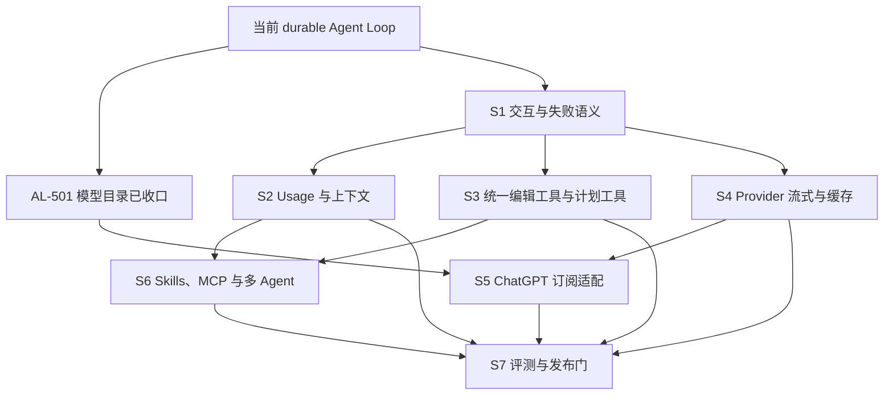

# Agent Loop 收口实施计划

> 状态：Active build plan（2026-08-23）。
> 目标：在现有 durable Agent Loop 基础上完成交互、失败恢复、成本治理、模型工具适配、Provider 一致性和产品验收，使本地 Provider 与 ChatGPT 订阅路径都能稳定执行真实 coding 任务。
> 文档所有权：本文拥有后续构建顺序、工作项状态和完成标准；行为策略由 [`agent-harness-design.md`](agent-harness-design.md) 拥有，运行时边界由 [`zeta-agent-runtime-architecture.md`](zeta-agent-runtime-architecture.md) 拥有，工具 schema 与错误文案由 [`agent-tools-spec.md`](agent-tools-spec.md) 拥有。

## 快速理解

Zeta 已经具备可持续运行、调用工具、等待批准、运行中追问、自动与手动压缩上下文、恢复执行、usage/Goal 治理、按模型校准未来预算、模型输入逐项限幅、冻结的统一代码编辑工具面、durable 计划，以及使用 native OAuth target 的 ChatGPT 订阅本地 Agent Loop。Core、App Server 和 Desktop 的确定性行为由现有测试与 smoke 入口覆盖；后续重点是 ChatGPT 订阅兼容收口，真实模型 benchmark 与 production telemetry 仅在产品确有需要时再建设。

| 用户场景 | 当前表现 | 本计划完成后的结果 | 对应阶段 |
| --- | --- | --- | --- |
| 让 Agent 修复代码并运行测试 | 已能完成模型→工具→模型循环，并支持冻结工具 profile、durable 计划、批准、取消和恢复 | 用现有行为测试验证确定性闭环；真实模型成功率后置 | S3、S7 |
| Agent 运行中追加要求 | 消息 durable 追加到当前 Turn；所有模型都由本地执行器在模型安全点重规划 | 增加完整故障矩阵和恢复验证 | S1、S5 |
| 供应商报上下文溢出或认证失败 | 认证直接成为当前 Turn 错误；上下文溢出会先持久化压缩并以新快照重试一次 | 错误 UI 提供与类别匹配的下一步 | S1 |
| 长会话消耗大量 token | 有 ContextPlan、逐项输入限幅、自动与 `/compact` 手动压缩、durable usage、跨 Turn 累计的 Thread Goal token 预算，以及按模型和估算 revision 恢复的未来预算校准 | 由现有压缩、usage 和 Goal 测试验证；质量/成本 benchmark 后置 | S2、S7 |
| 切换 OpenAI、Anthropic 或 Google 模型 | Turn 接受时已冻结同一套 coding ToolProfile；`apply_patch` 默认承担通用变更，`edit` 只承担唯一字符串微编辑和降级 | 由 provider conformance 与行为测试保持统一 profile；模型对比 benchmark 后置 | S3、S7 |
| 使用 ChatGPT 订阅模型 | native device OAuth、SecretStore、refresh、Responses target 与本地 Agent Loop 已接通 | 增加兼容探测、secret、rate-limit 与故障矩阵 | S5 |
| 使用 Skills、MCP 和子 Agent | 显式 Skill、动态工具发现和多 Agent durable 协调已具备 | 自动选择受控、MCP 暴露策略固定、多 Agent 有完整故障验证 | S6、S7 |

## 1. 当前实现基线

以下状态以源码和测试为准；设计文档中的旧状态表不能覆盖已经验证的实现事实。

| 能力 | 状态 | 当前边界 | 实现证据 |
| --- | --- | --- | --- |
| Turn 内循环 | 已实现 | 无固定模型调用轮数；每轮从 durable snapshot 重建输入 | `zeta-rs/core/src/turn/executor.rs` |
| 运行中 steering | 已实现 | Running、批准等待和用户输入等待可追加；模型输出与 steer 原子仲裁；所有 provider 路径共用本地 retry-safe delivery | `zeta-rs/core/src/thread_controller/steering.rs` |
| 模型基础弹性 | 已实现 | 429、过载、传输错误最多四次尝试；上下文溢出持久化压缩后只重试一次；认证与无效请求不重试；无效响应和空响应各只重试一次；Refusal 正常完成 | `zeta-rs/zeta-api/src/requests/mod.rs`、`zeta-rs/model-provider/src/error.rs`、`zeta-rs/core/src/turn/executor.rs` |
| 工具安全与恢复 | 已实现 | 工具绑定、策略版本、批准、sandbox escalation、未知结果不重放 | `zeta-rs/core/src/turn/tool_scheduler.rs` |
| ContextPlan 与上下文压缩 | 已实现 | 自动、手动和供应商溢出恢复都只吸收完整 terminal 前缀，并在 durable checkpoint 提交后重规划 | `zeta-rs/core/src/context/`、`zeta-rs/core/src/thread_controller/context.rs` |
| Durable usage | 已实现 | 每个实际返回的模型调用在消费输出前独立写入，包括模型驱动的 compaction；Thread/Turn reducer 聚合已报告下限和完整性，恢复 replay 不变 | `zeta-rs/core/src/turn/executor.rs`、`zeta-rs/core/src/context/compaction.rs`、`zeta-rs/core/src/thread_reducer.rs` |
| Thread Goal 预算 | 已实现 | 每个 Thread 最多一个 Goal；可选 token budget 跨 Turn 累计，缺失 usage 不伪造精确值，达到预算后收口当前 Turn 并停止自动继续 | `zeta-rs/protocol/src/thread/goal.rs`、`zeta-rs/core/src/thread_reducer.rs`、`zeta-rs/core/src/thread_controller.rs` |
| 流式传输与 Desktop gap 恢复 | 已实现 | Core transient cursor、App Server 独立 writer、Desktop 去重和 canonical read | `zeta-rs/app-server/src/server.rs`、`zeta-ts/src/zeta/workbench/contrib/chat/browser/pane/chatPaneModel.ts` |
| 本地 coding 工具闭环 | 已实现 | `coding-v1` 在 Turn 接受时冻结 exact 工具名、顺序、schema digest 与并行调用设置；canonical `read_file`/`write_file`/`edit`/`grep`/`glob`、`apply_patch`、`shell-command` 与 `update_plan` 已接线 | `zeta-rs/core/src/tool_profile.rs`、`zeta-rs/app-server/src/local_tools.rs` |
| Skills 与 MCP | 已具备 S6 基线 | slash、显式 SkillRef、可信 metadata 自动 selector、`skills-read`、registry snapshot，以及 MCP direct/meta 阈值切换已接通 | `zeta-rs/skills`、`zeta-rs/ext/skills`、`zeta-rs/app-server` |
| ChatGPT 订阅执行 | 基础具备 | native device OAuth、SecretStore、refresh、固定 Responses target 与本地 Agent Loop 已接通；API key 与订阅凭据严格分离 | `zeta-rs/chatgpt/`、`zeta-rs/model-provider/src/providers/openai.rs` |
| Kimi 订阅执行 | 基础具备 | native device OAuth、SecretStore、refresh、Kimi Coding Chat Completions 与本地 Agent Loop 已接通；`access` 与 execution runtime 已解耦 | `zeta-rs/kimi/`、`zeta-rs/model-provider/src/providers/kimi.rs` |
| 多 Agent | 部分具备 | spawn/message/wait、Fresh/ForkedPrefix、all/any/quorum、取消树和恢复已实现 | `zeta-rs/core/src/multi_agent/`、`zeta-rs/app-server/src/server/multi_agent_tools.rs` |
| 模型目录与选择 | 已实现 | 静态模型、access badge、隐藏设置和刷新已接通；目录不探活，运行错误归属对话 Turn | `zeta-rs/app-server/src/model_catalog.rs`、`zeta-ts/src/zeta/workbench/services/chat/` |

2026-08-23 基线验证：协议、App Server、native ChatGPT/Kimi adapter 与订阅成功/失败路径的相关 Rust 测试通过；Desktop Renderer 类型检查及模型目录、Chat、Settings 和分层边界定向测试通过。Desktop 全量单测仍有两个既有失败，位于 Editor design token 与目录架构检查，不属于 Agent Loop 变更的直接覆盖路径。后续工作项不得把该基线描述为全仓全绿。

## 2. 状态和完成纪律

| 状态 | 含义 |
| --- | --- |
| 已实现 | production path 已接线，关键成功、失败、取消和恢复语义有测试 |
| 进行中 | 当前工作树已有实现，但验收门或文档同步尚未完成 |
| 待构建 | 已纳入顺序和验收，不代表 public API 已存在 |
| 延后 | 不阻塞 Agent Loop v1，只有前置数据或需求满足后才启动 |

每个工作项只有同时满足以下条件才能改成“已实现”：

- production path 接线完成，不能只存在 fixture、decoder 或未使用的类型；
- 成功、拒绝、取消、重试、进程恢复和边界输入按适用性有测试；
- protocol 变更同步 Rust schema、生成的 TypeScript、fixture、App Server 文档和 Desktop consumer；
- 修改到的 crate README 与系统文档更新当前能力和当前限制；
- 该工作项的最小验证命令成功，不能用无关测试通过替代；
- durable 行为必须有 restart/replay 测试，并证明不会重复产生外部副作用。

## 3. S1：交互与失败语义（P0）

S1 是下一阶段的 release blocker。完成前不把 Agent Loop 标记为产品完整。

| ID | 状态 | 工作项 | 构建内容 | 验收标准 |
| --- | --- | --- | --- | --- |
| AL-101 | 已实现 | 运行中 steering | durable `ThreadCommand::SteerTurn`、`TurnSteered`/delivery facts、App Server `session/request::SteerTurn`、Desktop 运行中发送与本地 executor 重规划 | Running、WaitingForApproval、WaitingForUserInput 可追加；Cancelling 和终态稳定拒绝；多条 steer 保序；重启后不丢失、不重复提交 |
| AL-102 | 已实现 | Provider 错误分类 | 增加 `ContextOverflow`、`AuthFailed`、`InvalidRequest`、`InvalidResponse` 和对应 stable Turn error；各 Provider 从状态码和错误体映射 | 401/403 不重试；无效响应只重试一次；错误码跨 App Server 和 Desktop 保持稳定；原始错误只进入受控日志 |
| AL-103 | 已实现 | 溢出恢复 | Provider 返回 `ContextOverflow` 时触发一次 durable compaction，再以新 snapshot 重试一次 | checkpoint 与本 Turn 的恢复标记原子提交后才发重试调用；再次溢出稳定失败；取消立即生效；恢复过程不重复 checkpoint 或模型副作用 |
| AL-104 | 已实现 | 重复失败工具熔断 | 从 durable Tool Call/Result 按“工具名 + canonical arguments digest”重建 Turn 内连续失败窗口 | 第 3 次附加 durable reminder；第 5 次以 `toolRepetition` 失败；成功、参数变化或工具变化清零；恢复保持相同错误；不增加固定 loop 次数上限 |
| AL-105 | 已实现 | 交互错误 UI | Desktop 从 canonical `StableTurnErrorCode` 投影对话内错误卡片；可重试失败开始新 Turn，认证错误打开模型选择，上下文或预算耗尽创建新对话，无效请求与工具重复失败聚焦输入以修改方案 | UI 只按稳定错误码分流；仅最新失败 Turn 暴露动作；刷新和重连从 canonical Thread 重建相同卡片 |

S1、S2 与 S3 已完成；确定性行为由现有测试覆盖，下一阶段继续 S5 能力协商。真实模型 baseline 和 production telemetry 属于后置工作，不作为当前闭环的隐含前置条件。

## 4. S2：Usage、预算与上下文质量（P1）

| ID | 状态 | 工作项 | 构建内容 | 验收标准 |
| --- | --- | --- | --- | --- |
| AL-201 | 已实现 | Durable usage 账本 | 每次实际返回的模型调用写入 `ModelUsageRecorded`，模型驱动的 compaction 通过强制 recorder 回调进入同一账本；provider-reported input、cached input、output 和 reasoning usage 聚合到 Thread，并在 Turn 内保留预算所需投影 | crash/restart 前后聚合一致；空响应、compaction 等调用分别记账；缺失或部分 usage 用 `reported + complete` 表达，不伪造为精确值；分叉只导入对话内容，不重复计算源 Thread 成本 |
| AL-202 | 已实现 | Thread Goal 预算 | 每个 Thread 最多一个可选 Goal；Goal 状态、token budget 与累计用量通过同一条 Thread event log 持久化；统计已知的未缓存输入与输出 token，不伪造缺失 usage；App Server 与 Desktop 保留 canonical projection | 预算跨 Turn 累计；达到上限后 Goal 变为 `BudgetLimited`，当前 final answer 可完成但不再自动续跑；普通错误为 `Blocked`，provider usage limit 为 `UsageLimited`；重启/replay 保持状态和用量一致 |
| AL-203 | 已实现 | 模型输入逐项限幅 | ContextPlan 选入时对 shell、文件读取、搜索和 MCP 生成带 continuation 诊断的 bounded clone；图片保留 durable 原图并在 provider-bound materialization 时按模型策略降采样 | 普通调用和 compaction 共用 bounded clone；structured content 按实际内容计量；durable Tool Result 和附件对象不被静默改写 |
| AL-204 | 已实现 | 手动压缩 | `/compact` 以独立、不可 steering 的 Turn 执行；可选保留提示冻结在 typed command receipt；本地路径复用 durable checkpoint/usage，订阅路径把无提示请求委托给 upstream `thread/compact/start` | 只覆盖完整 terminal durable 前缀；压缩 Turn 和未完成工具组不被吸收；超长 Core-managed 前缀分批提交；失败不提交半成品 checkpoint；command replay 不重复外部调用 |
| AL-205 | 已实现 | 预算校准 | 普通调用和模型驱动的 compaction 把带 estimator/calibration revision 的调用前估算写入 `ModelUsageRecorded`；reducer 按冻结模型与 estimator revision 从 provider input usage 重建只收紧未来容量的非对称 EMA；现有 OpenAI exact preflight、其他声明式 remote preflight 与本地 tokenizer 降级路径继续作用于最终 request | 重启后校准一致；缺失 input usage 不生成样本；上调立即生效、下调渐进衰减；未知窗口仍为 provider-managed；历史 durable usage 聚合保持原值 |

AL-201 至 AL-205 已完成，S2 收口；统一工具面与 durable 计划由 S3 接续完成。

## 5. S3：统一编辑工具面与计划工具（P1）

| ID | 状态 | 工作项 | 构建内容 | 验收标准 |
| --- | --- | --- | --- | --- |
| AL-301 | 已实现 | ToolProfile contract | `coding-v1` 在 Turn 接受安全点冻结 exact 工具名、顺序、definition digest、profile revision 与并行调用设置；每次模型调用前复核冻结定义 | 默认 profile 同时暴露 `apply_patch` 与 `edit`；Core-managed 本地 Provider 复用同一 snapshot，不按模型或 Provider 名称推断工具面；定义漂移在调用模型前 fail closed |
| AL-302 | 已实现 | 统一文件工具 ownership | Agent 文件工具统一由 direct `LocalToolSuite` 提供，shell 与 patch 各由单一 canonical executor 提供；legacy operation-enum 不进入 Agent 工具面 | 模型不可见重复或同名不同义工具；审批 provenance 和路径 capability 保持精确；`edit` 保持 Thread scoped 读后编辑、唯一命中、磁盘 revision 复核与原子单文件写入 |
| AL-303 | 已实现 | `update_plan` | 模型可见工具提交 durable `PlanUpdated`，Turn 保存 canonical plan，Desktop 只投影该状态 | 更新幂等、replay/restart 不丢失；同一时刻最多一个 `in_progress`；计划状态不依赖 transient stream |
| AL-304 | 已实现 | 工具 schema 与提示词回归 | 固定统一 profile 的工具顺序、schema、描述和 digest fixture；system prompt 升至 `system-v4` 并固定编辑选择 guidance | 同一 snapshot 组装稳定；两个不同 Provider/model 使用相同 canonical schema；提示词明确 `apply_patch` 默认、`edit` 微编辑/降级；definition 变化要求新 revision/digest |
| AL-305 | 已实现 | 多工具调用顺序 | 保持 `parallel_tool_calls: true`，执行侧继续按 durable 调用顺序串行 | 一次模型响应中的多个调用先完整持久化，再依次批准和执行；取消后未开始调用不得执行；不引入并行写副作用 |

S3 已完成；模型行为指标和发布门属于 S7 的后置可选工作，不要求 PR 或 S3 依赖真实模型 API。

## 6. S4：供应商流式与 Prompt 缓存（P1）

| ID | 状态 | 工作项 | 构建内容 | 验收标准 |
| --- | --- | --- | --- | --- |
| AL-401 | 已实现 | Anthropic 真流式接线 | Anthropic SSE decoder 已接入 production `ModelProvider` stream path | 文本、reasoning、工具调用、usage、取消和截断已有 adapter 测试；stream fixture 会拒绝 unary fallback |
| AL-402 | 已实现 | 其余主力 Provider 流式 | OpenAI Responses、OpenAI-compatible Chat、Google 与 Anthropic 显式声明 native streaming；其余内置 Provider 声明 unary | capability 经 model catalog 可查询并由 Desktop 直接消费；Core retry 新建 incarnation，Desktop 对 sequence gap 刷新且拒绝 retired incarnation |
| AL-403 | 已实现 | Anthropic Prompt Cache | adapter 在 tools/system/最新 user 历史末尾注入三个滚动 `cache_control` 断点，不污染 canonical `ModelRequest` | 稳定序列化、滚动断点、cached usage，以及换模型、换 profile、压缩后的 cache scope 变化均有测试 |
| AL-404 | 已实现 | Provider conformance matrix | OpenAI Responses、OpenAI Chat Completions、Anthropic Messages 与兼容 Chat profile 共用 canonical fixture | instructions、tool call/result、refusal、usage、图片、错误分类和流式终止语义已有覆盖；未物化附件与 unsupported output 明确失败 |
| AL-405 | 已实现 | 多模态输入收口 | 图片进入 durable attachment authority 后才按模型限制生成 provider-bound clone；所有 provider 路径共用同一约束 | MIME/字节/像素边界在调用前验证；provider 只接收受控内容，不接收或持久化未授权本地路径 |

S4 已完成；新增 Provider 必须先声明 `ModelOutputTransport` 并加入 conformance fixture，不能由 Desktop 按协议名称猜测。

## 7. S5：ChatGPT 订阅 native OAuth 与兼容性收口（P1）

| ID | 状态 | 工作项 | 构建内容 | 验收标准 |
| --- | --- | --- | --- | --- |
| AL-501 | 已实现 | 模型目录收口 | 静态 curated catalog、access badge、隐藏模型设置和刷新；目录不探活、不阻止发送 | 选择、持久化和 `thread/start` 使用同一精确模型 ID；`model/list` 不调用账户或远端模型目录；真实调用失败成为当前对话的 durable Turn error，且不静默 fallback |
| AL-502 | 进行中 | OAuth/target 兼容验证 | native device flow、refresh、account routing headers 和 Responses target 已接通；补充真实服务的版本漂移探测 | OAuth 或 Responses contract 不兼容时 fail closed，并给出可行动错误；不得降级到 Platform API key |
| AL-503 | 待构建 | 丰富 item 投影 | 将 subscription Responses 支持的丰富 output item 映射到 canonical durable/notification contract | 重连后可从 canonical state 重建；Desktop 不直接依赖 provider DTO |
| AL-504 | 进行中 | 图片与 secret input | 图片输入已由 S4 接通；仍需为 `isSecret` 用户输入建立不进日志、不进普通 transcript 的安全响应路径 | secret 在 Debug、错误、Thread item 和 telemetry 中保持 redacted；图片受 workspace attachment authority 约束 |
| AL-505 | 待构建 | Account 与 rate-limit 状态 | 将本机 OAuth account metadata、额度和 rate-limit observation 投影到独立账户/对话状态，并丰富 Turn 错误上下文 | 状态不得改写或门禁静态模型目录；状态过期后显示未知，不把缓存值当永久事实；执行失败仍由 exact Turn 承载 |
| AL-506 | 待构建 | OAuth 与 stream 故障矩阵 | 覆盖 device poll、refresh rotation、401、429、stream truncation、取消和恢复 | token 不泄露；不确定 inference 不重放；所有等待交互有终止结果 |

AL-501 和 native OAuth/target vertical slice 已完成；S4 capability contract 已稳定，S5 可继续推进兼容验证、丰富 item、secret、账户状态与故障矩阵。

## 8. S6：Skills、MCP 与多 Agent 收口（P2）

| ID | 状态 | 工作项 | 构建内容 | 验收标准 |
| --- | --- | --- | --- | --- |
| AL-601 | 已实现 | Skill 自动 selector | metadata-only、唯一高置信匹配只允许自动选择 `BuiltInVerified` Skill；先冻结 pinned `SkillRef`，再加载 exact `SKILL.md` | selector 输入有界且不注入 catalog 正文；reason、digest、generation 持久化；歧义或非可信来源不自动激活 |
| AL-602 | 已实现 | MCP 暴露阈值 | 聚合定义不超过 15 个工具且估算不超过 5k tokens 时平铺；任一超限时整个 MCP port 只暴露 `search_tools`/`call_mcp_tool` | Turn 内冻结 catalog/definition digest；边界、排序和同名热更新 fail-closed 已测试 |
| AL-603 | 已实现 | Agent 定义与自动选择 | `spawn_agent` 支持显式或唯一 metadata 匹配，冻结 definition generation/digest/reason、role、model、Instructions、Skill 与 Tool ceiling | child model input 和 nested tool facts 都受 frozen ceiling 约束；未选 parent history 不进入 Fresh child；缺失/越权引用拒绝 |
| AL-604 | 已实现 | 多 Agent 故障矩阵 | child failure、parent cancel、join timeout、any/quorum、恢复、Turn/结构预算耗尽进入确定性测试 | terminal child reconciliation 幂等；取消树可恢复；mailbox 绑定 exact delegation，不能投递到 sibling |
| AL-605 | 已实现 | Desktop 多 Agent 可观测性 | App Server `session/subscribe` 返回 canonical nested tree；Desktop 展示状态、预算、等待原因、join 和结果，并可中断单个节点 | UI 不再从 lineage 自行构树；刷新使用同一投影；interrupt 使用节点冻结的 Thread/Turn/sequence 精确目标 |

S6 的选择与投影都冻结在当前 catalog/Session snapshot 上：Skill、MCP 或 Agent definition 的后续
刷新只影响新 Turn/新 delegation；Desktop 只展示 App Server 从 durable Session/Thread facts 生成的
projection。仍未纳入本阶段的是跨机器 Agent transport、Agent definition list/picker API 与
Agent-tree 累计 token/cost scheduler；这些不能反向削弱本表已经冻结的执行 ceiling。

## 9. S7：评测、观测与发布门（横向）

S3 已为 S7 冻结工具 contract；现有 Rust/TS 测试与项目 smoke 入口提供确定性回归覆盖。Agent Loop v1 不依赖独立 `evals/` 目录；真实模型 baseline、production telemetry 和发布检查表按产品需要后置。

| ID | 状态 | 工作项 | 构建内容 | 验收标准 |
| --- | --- | --- | --- | --- |
| AL-701 | 暂缓 | 封闭任务集 | 当前不维护独立 fixture corpus；需要模型对比时再按版本化 benchmark 任务集建立 | 任务集的维护有明确产品目标、受控模型预算和去内容化结果策略后再启动 |
| AL-702 | 已实现 | Deterministic smoke | Core、App Server 和 Desktop 现有测试覆盖 retry、steering、overflow、approval、repetition、budget、stream gap 与恢复；通过项目标准测试入口运行 | 不依赖网络或真实凭据；事件序列、canonical 状态和副作用由对应单测/集成测试断言 |
| AL-703 | 后置 | 模型行为评测数据 | 需要时按 provider/model/profile 记录成功率、token、cache、工具选择、失败次数和墙钟时间的去内容化结果；当前无受控 baseline | 启动前必须有版本化任务集、受控凭据或明确启用的隐私受控聚合；没有证据时继续使用统一 profile |
| AL-704 | 待构建 | 运行时观测 | 为模型调用、重试、压缩、usage、批准等待、工具 terminal outcome、编辑工具选择、验证结果和委托恢复提供结构化指标 | telemetry 不含 prompt、secret、工具参数、diff 或文件内容；用户聚合数据必须明确启用且去内容化；可按 Thread/Turn 关联但不能恢复用户正文 |
| AL-705 | 待构建 | 发布检查表 | 在确定产品发布范围后汇总 S1–S6 capability matrix、已知限制、迁移和回滚条件 | 没有 P0 缺口；protocol/schema/docs 同步；主力路径通过故障注入；未支持能力在产品中显式隐藏或解释 |

## 10. 构建顺序

实际执行批次：

1. 以已完成的 AL-501 和可重复运行的订阅集成测试作为后续构建基线。
2. 以已完成的 AL-101 至 AL-105 作为交互与失败语义基线。
3. S2 的 AL-201 至 AL-205、S3 的 AL-301 至 AL-305 与 S4 的 AL-401 至 AL-405 已完成；下一批从 S5 的 AL-502 能力协商继续，模型 benchmark 和 production telemetry 仅在确有产品需求时启动。
4. S4 capability contract 与 S3 ToolProfile contract 已稳定；在此基础上完成 S6。
5. S7 的确定性回归使用现有项目测试入口；真实模型行为数据只在有受控凭据或明确启用、去内容化的用户聚合指标时收集。AL-705 在确定发布范围后再建立。

## 11. 验证矩阵

| 变更面 | 最小验证 | 阶段完成验证 |
| --- | --- | --- |
| Core loop、Context、多 Agent | `cargo test --manifest-path Cargo.toml -p zeta-core` | Core 故障恢复测试 + 对应 deterministic eval |
| Provider 与 wire adapter | `cargo test --manifest-path Cargo.toml -p zeta-api -p zeta-model-provider` | Provider conformance matrix |
| App Server 与 ChatGPT 订阅适配 | `cargo test --manifest-path Cargo.toml -p zeta-app-server --lib -p zeta-chatgpt -p zeta-model-provider` | OAuth/refresh/stream/reconnect/fault matrix |
| Protocol | `corepack pnpm run verify:protocol` | schema hash、fixtures、生成 TypeScript 和 Desktop consumer 同批通过 |
| Desktop | `corepack pnpm --dir zeta-ts run typecheck:renderer` | `corepack pnpm --dir zeta-ts run test:unit`，已知范围外失败必须单独登记，不能静默忽略 |
| 文档 | `corepack pnpm --dir docs-site run check:docs` | 链接、状态、生成文档和 capability matrix 一致 |
| Rust 全阶段 | 受影响 crate 的 `cargo fmt --check`、`cargo clippy` 和测试 | `cargo fmt --manifest-path Cargo.toml --all -- --check`；`cargo clippy --manifest-path Cargo.toml --workspace --all-targets -- -D warnings`；`cargo test --manifest-path Cargo.toml --workspace` |

## 12. Agent Loop v1 完成标准

以下条件全部满足后，状态才从 Active build plan 改为 Completed：

- S1 全部完成，运行中消息、错误恢复和失控防护形成稳定 contract；
- S2 全部完成，Thread 可以解释实际 usage、终止原因和只影响未来规划的预算校准；
- S3 全部完成，主力模型使用冻结的统一 coding profile，并遵守 `apply_patch` 默认、`edit` 微编辑/降级的选择规则；
- S4 完成所有已声明主力 Provider 的流式、错误、usage 和 cache capability；
- S5 全部完成，ChatGPT 订阅 OAuth、模型调用与错误映射没有静默丢弃受支持的响应事件；
- S6 完成受信任自动选择、MCP 阈值和多 Agent 故障矩阵；
- S7 的现有 deterministic 测试通过；如产品需要模型评测或隐私受控聚合，再单独建立版本化任务集、隐私边界和发布门；
- 所有 durable side effect 在 crash/restart 测试中保持 once-only 或明确的 unknown outcome，绝不静默重放。

## 13. 明确不做

- 不增加固定模型调用次数上限；资源约束使用可取消的 token、成本、时间和重复失败策略表达。
- 不并行执行可能写入或产生外部副作用的工具调用；`parallel_tool_calls` 只允许模型一次返回多个调用。
- 不在 Turn 运行中替换工具 registry、ToolProfile、模型、policy revision 或预算 snapshot。
- 不依据模型名或 Provider 名猜测编辑工具偏好；没有版本化评测或明确启用、去内容化的聚合证据，就不增加按模型分流。
- 不把 `apply_patch` 的多文件表达能力当成存储事务保证；提交结果不确定时保持 unknown outcome 且绝不自动重放，事务提交或回滚能力另行设计。
- 不把整个 Skill catalog 正文或全部 MCP 定义无条件塞入 prompt。
- 不让 Desktop、CLI、OAuth driver 或模型供应商 adapter 成为 Thread durability、approval authority 或 canonical Agent 状态的第二 owner。
