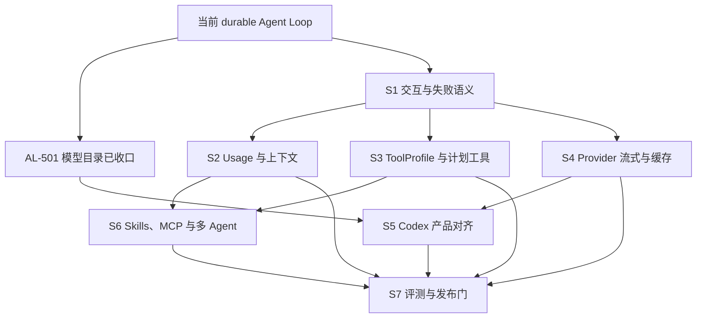

# Agent Loop 收口实施计划

> 状态：Active build plan（2026-08-23）。
> 目标：在现有 durable Agent Loop 基础上完成交互、失败恢复、成本治理、模型工具适配、Provider 一致性和产品验收，使本地 Provider 与 Codex 订阅路径都能稳定执行真实 coding 任务。
> 文档所有权：本文拥有后续构建顺序、工作项状态和完成标准；行为策略由 [`agent-harness-design.md`](agent-harness-design.md) 拥有，运行时边界由 [`zeta-agent-runtime-architecture.md`](zeta-agent-runtime-architecture.md) 拥有，工具 schema 与错误文案由 [`agent-tools-spec.md`](agent-tools-spec.md) 拥有。

## 快速理解

Zeta 已经具备可持续运行、调用工具、等待批准、运行中追问、压缩上下文、恢复执行和委托 Codex 的 Agent Loop。后续建设不再以“搭出第一轮模型调用”为目标，而是优先补齐工具失控防护、交互错误 UI、usage 记账、模型家族工具面和端到端评测，再扩展 Provider、Codex、Skills、MCP 与多 Agent 的产品完整性。

| 用户场景 | 当前表现 | 本计划完成后的结果 | 对应阶段 |
| --- | --- | --- | --- |
| 让 Agent 修复代码并运行测试 | 已能完成模型→工具→模型循环，并支持批准、取消和恢复 | 有稳定工具 profile、计划工具、输出限幅和可量化成功率 | S3、S7 |
| Agent 运行中追加要求 | 消息 durable 追加到当前 Turn；本地执行器在模型安全点重规划，Codex 委托转发 exact `turn/steer` | 增加后续评测与完整故障矩阵 | S1、S5 |
| 供应商报上下文溢出或认证失败 | 认证直接成为当前 Turn 错误；上下文溢出会先持久化压缩并以新快照重试一次 | 错误 UI 提供与类别匹配的下一步 | S1 |
| 长会话消耗大量 token | 有 ContextPlan 和自动压缩，但没有 Thread 级 usage/cost 账本 | usage durable、预算可配置、超限在安全点终止 | S2 |
| 切换 OpenAI、Anthropic 或 Google 模型 | 模型选择已冻结，但模型可见工具面未按家族完整区分 | Turn 接受时冻结 ToolProfile，使用匹配训练分布的编辑工具 | S3 |
| 使用 Codex 订阅模型 | 基础委托、流式、批准、用户输入和恢复已接通 | 增加能力协商、diff、图片、secret、rate-limit 与故障矩阵 | S5 |
| 使用 Skills、MCP 和子 Agent | 显式 Skill、动态工具发现和多 Agent durable 协调已具备 | 自动选择受控、MCP 暴露策略固定、多 Agent 有完整评测和故障验证 | S6、S7 |

## 1. 当前实现基线

以下状态以源码和测试为准；设计文档中的旧状态表不能覆盖已经验证的实现事实。

| 能力 | 状态 | 当前边界 | 实现证据 |
| --- | --- | --- | --- |
| Turn 内循环 | 已实现 | 无固定模型调用轮数；每轮从 durable snapshot 重建输入 | `zeta-rs/core/src/turn/executor.rs` |
| 运行中 steering | 已实现 | Running、批准等待和用户输入等待可追加；模型输出与 steer 原子仲裁；本地和 Codex 路径均有 retry-safe delivery | `zeta-rs/core/src/thread_controller/steering.rs`、`zeta-rs/codex-app-server/src/turn_backend.rs` |
| 模型基础弹性 | 已实现 | 429、过载、传输错误最多四次尝试；上下文溢出持久化压缩后只重试一次；认证与无效请求不重试；无效响应和空响应各只重试一次；Refusal 正常完成 | `zeta-rs/zeta-api/src/requests/mod.rs`、`zeta-rs/model-provider/src/error.rs`、`zeta-rs/core/src/turn/executor.rs` |
| 工具安全与恢复 | 已实现 | 工具绑定、策略版本、批准、sandbox escalation、未知结果不重放 | `zeta-rs/core/src/turn/tool_scheduler.rs` |
| ContextPlan 与自动压缩 | 已实现 | durable checkpoint、source digest、预算压缩和供应商溢出恢复均在提交后重规划；手动压缩尚缺 | `zeta-rs/core/src/context/` |
| 流式传输与 Desktop gap 恢复 | 已实现 | Core transient cursor、App Server 独立 writer、Desktop 去重和 canonical read | `zeta-rs/app-server/src/server.rs`、`zeta-ts/src/zeta/workbench/contrib/chat/browser/pane/chatPaneModel.ts` |
| 本地 coding 工具闭环 | 部分具备 | `shell-command`、`file-system`、`apply-patch`、`grep`、`glob` 可见；家族 profile、`update_plan` 和统一直接文件工具仍缺 | `zeta-rs/app-server/src/local_tools.rs` |
| Skills 与 MCP | 部分具备 | slash、显式 SkillRef、`skills-read`、registry snapshot、deferred tool search 已有；自动 selector 和阈值策略仍缺 | `zeta-rs/skills`、`zeta-rs/tools` |
| Codex 订阅执行 | 部分具备 | 整个远端 Agent Loop 委托、恢复、流式、运行中 steering、命令/文件批准和结构化输入已接通 | `zeta-rs/codex-app-server/src/turn_backend.rs` |
| 多 Agent | 部分具备 | spawn/message/wait、Fresh/ForkedPrefix、all/any/quorum、取消树和恢复已实现 | `zeta-rs/core/src/multi_agent/`、`zeta-rs/app-server/src/server/multi_agent_tools.rs` |
| 模型目录与选择 | 已实现 | 静态模型、access badge、隐藏设置和刷新已接通；目录不探活，运行错误归属对话 Turn | `zeta-rs/app-server/src/model_catalog.rs`、`zeta-ts/src/zeta/workbench/services/chat/` |

2026-08-23 基线验证：协议、App Server、Codex adapter 与订阅成功/失败路径的相关 Rust 测试通过；Desktop Renderer 类型检查及模型目录、Chat、Settings 和分层边界定向测试通过。Desktop 全量单测仍有三个既有失败，位于 Editor design token、组件 document contract 和目录架构检查，不属于 Agent Loop 变更的直接覆盖路径。后续工作项不得把该基线描述为全仓全绿。

## 2. 状态和完成纪律

| 状态 | 含义 |
| --- | --- |
| 已实现 | production path 已接线，关键成功、失败、取消和恢复语义有测试 |
| 进行中 | 当前工作树已有实现，但验收门或文档同步尚未完成 |
| 待构建 | 已纳入顺序和验收，不代表 public API 已存在 |
| 延后 | 不阻塞 Agent Loop v1，只有前置数据或需求满足后才启动 |

每个工作项只有同时满足以下条件才能改成“已实现”：

- production path 接线完成，不能只存在 fixture、decoder 或未使用的类型；
- 成功、拒绝、取消、重试、进程恢复和边界输入按适用性有测试；
- protocol 变更同步 Rust schema、生成的 TypeScript、fixture、App Server 文档和 Desktop consumer；
- 修改到的 crate README 与系统文档更新当前能力和当前限制；
- 该工作项的最小验证命令成功，不能用无关测试通过替代；
- durable 行为必须有 restart/replay 测试，并证明不会重复产生外部副作用。

## 3. S1：交互与失败语义（P0）

S1 是下一阶段的 release blocker。完成前不把 Agent Loop 标记为产品完整。

| ID | 状态 | 工作项 | 构建内容 | 验收标准 |
| --- | --- | --- | --- | --- |
| AL-101 | 已实现 | 运行中 steering | durable `ThreadCommand::SteerTurn`、`TurnSteered`/delivery facts、App Server `session/request::SteerTurn`、Desktop 运行中发送，以及 Codex exact `turn/steer` 转发 | Running、WaitingForApproval、WaitingForUserInput 可追加；Cancelling 和终态稳定拒绝；多条 steer 保序；重启后不丢失、不重复；未知委托结果不重放 |
| AL-102 | 已实现 | Provider 错误分类 | 增加 `ContextOverflow`、`AuthFailed`、`InvalidRequest`、`InvalidResponse` 和对应 stable Turn error；各 Provider 从状态码和错误体映射 | 401/403 不重试；无效响应只重试一次；错误码跨 App Server 和 Desktop 保持稳定；原始错误只进入受控日志 |
| AL-103 | 已实现 | 溢出恢复 | Provider 返回 `ContextOverflow` 时触发一次 durable compaction，再以新 snapshot 重试一次 | checkpoint 与本 Turn 的恢复标记原子提交后才发重试调用；再次溢出稳定失败；取消立即生效；恢复过程不重复 checkpoint 或模型副作用 |
| AL-104 | 已实现 | 重复失败工具熔断 | 从 durable Tool Call/Result 按“工具名 + canonical arguments digest”重建 Turn 内连续失败窗口 | 第 3 次附加 durable reminder；第 5 次以 `toolRepetition` 失败；成功、参数变化或工具变化清零；恢复保持相同错误；不增加固定 loop 次数上限 |
| AL-105 | 已实现 | 交互错误 UI | Desktop 从 canonical `StableTurnErrorCode` 投影对话内错误卡片；可重试失败开始新 Turn，认证错误打开模型选择，上下文或预算耗尽创建新对话，无效请求与工具重复失败聚焦输入以修改方案 | UI 只按稳定错误码分流；仅最新失败 Turn 暴露动作；刷新和重连从 canonical Thread 重建相同卡片；预算错误的运行时生产者仍由 AL-202 构建 |

S1 已完成；接下来从 AL-201 开始构建 durable usage 账本，再以该账本作为 AL-202 资源预算的前置。

## 4. S2：Usage、预算与上下文质量（P1）

| ID | 状态 | 工作项 | 构建内容 | 验收标准 |
| --- | --- | --- | --- | --- |
| AL-201 | 待构建 | Durable usage 账本 | 将 provider-reported input、cached input、output 和可用的 reasoning usage 作为 durable fact 记录并聚合到 Thread | crash/restart 前后聚合一致；重试调用分别记账；缺失或部分 usage 不伪造为精确值 |
| AL-202 | 待构建 | Turn 资源预算 | 在 AL-201 上增加可选 token 与成本上限；成本使用带版本的模型价格 snapshot，不读取运行中漂移的目录值 | 默认只记账不设限；超限在下一个模型/工具安全点终止；稳定错误为 `turnBudgetExhausted`；恢复后继续使用冻结预算 |
| AL-203 | 待构建 | 模型输入逐项限幅 | 在 ContextPlan 选入时统一限制 shell、文件读取、搜索、MCP 和图片内容，并保留截断诊断 | 任何单条工具结果不能独占窗口；截断标记说明原始大小和继续读取方式；durable 原始结果不被静默改写 |
| AL-204 | 待构建 | 手动压缩 | 增加 `/compact` 与可选保留提示，复用现有 durable checkpoint contract | 只覆盖完整 durable 前缀；当前 Turn 和未完成工具组不被吸收；失败不提交半成品 checkpoint |
| AL-205 | 待构建 | 预算校准 | 使用已记录 usage 校准估算误差，并为可用模型接入精确 tokenizer/preflight | 估算 revision 可追踪；未知窗口继续使用 provider-managed，不猜测固定窗口；校准不能改变历史 durable usage |

AL-201 是 S2 的前置；AL-202 和 AL-205 依赖它。AL-203、AL-204 可与 AL-201 并行，但 AL-204 不重复实现 AL-103 的 overflow retry。

## 5. S3：模型家族工具面与计划工具（P1）

| ID | 状态 | 工作项 | 构建内容 | 验收标准 |
| --- | --- | --- | --- | --- |
| AL-301 | 待构建 | ToolProfile contract | 在声明层建立模型家族→profile 映射，并在 Turn 接受安全点冻结当前可调用工具面 | OpenAI profile 使用 `apply_patch`；Anthropic、Google 和默认 profile 使用唯一匹配 `edit`；切模型只影响新 Turn；Core 不硬编码模型家族 |
| AL-302 | 待构建 | 统一文件工具 ownership | 消除 legacy local suite 与 executor contribution 的重复定义，确定一个 canonical read/write/edit/search 实现 | 模型不可见重复或同名不同义工具；审批 provenance 和路径 capability 保持精确；旧 operation-enum 只服务明确的非 Agent consumer |
| AL-303 | 待构建 | `update_plan` | 增加模型可见计划工具和 durable plan projection，Desktop 只投影 canonical plan | 更新幂等、重连不丢失；同一时刻最多一个 `in_progress`；计划状态不依赖 transient stream |
| AL-304 | 待构建 | 工具 schema 与提示词回归 | 按 profile 固定工具顺序、schema、描述与 system guidance，并建立字节稳定 fixture | 同一 snapshot 两次组装逐字节一致；Provider adapter 接受相同 canonical schema；profile 变化产生预期 cache boundary |
| AL-305 | 已实现 | 多工具调用顺序 | 保持 `parallel_tool_calls: true`，执行侧继续按 durable 调用顺序串行 | 一次模型响应中的多个调用先完整持久化，再依次批准和执行；取消后未开始调用不得执行；不引入并行写副作用 |

S3 完成后建立 T1/T2 首批 fixture，但正式指标和 nightly gate 由 S7 拥有。

## 6. S4：供应商流式与 Prompt 缓存（P1）

| ID | 状态 | 工作项 | 构建内容 | 验收标准 |
| --- | --- | --- | --- | --- |
| AL-401 | 待构建 | Anthropic 真流式接线 | 将已有 Anthropic SSE decoder 接入 production `ModelProvider` stream path | 文本、reasoning、工具调用、usage、取消和截断有 adapter 测试；不得通过 unary fallback 冒充流式 |
| AL-402 | 待构建 | 其余主力 Provider 流式 | 按已配置主力顺序接 Google 和其他 Provider；不支持者显式声明 unary capability | capability 可查询；Desktop 不猜测；所有 stream 使用 incarnation + sequence 处理 retry 和 gap |
| AL-403 | 待构建 | Anthropic Prompt Cache | 在 adapter 注入 tools/system/滚动历史 `cache_control` 断点，不污染 canonical `ModelRequest` | 连续 Turn 的稳定前缀命中；cached input usage 可观测；换模型、换 profile、压缩后的预期 miss 有测试 |
| AL-404 | 待构建 | Provider conformance matrix | 为 OpenAI Responses、OpenAI Chat Completions、Anthropic Messages 与主力兼容 Provider 建统一 fixture | instructions、tool call/result、refusal、usage、图片、错误分类和流式终止语义逐项通过；unsupported 明确失败 |
| AL-405 | 待构建 | 多模态输入收口 | 统一图片大小、媒体类型、降采样和 Provider mapping，并接本地与 Codex 两条路径 | canonical attachment authority 不被绕过；超限在调用前失败；不把本地路径或 secret 写入模型 transcript |

## 7. S5：Codex 订阅路径产品对齐（P1）

| ID | 状态 | 工作项 | 构建内容 | 验收标准 |
| --- | --- | --- | --- | --- |
| AL-501 | 已实现 | 模型目录收口 | 静态 curated catalog、access badge、隐藏模型设置和刷新；目录不探活、不阻止发送 | 选择、持久化和 `thread/start` 使用同一精确模型 ID；`model/list` 不调用账户或远端模型目录；真实调用失败成为当前对话的 durable Turn error，且不静默 fallback |
| AL-502 | 待构建 | 能力与版本协商 | 启动时验证支持的 Codex App Server 版本和所需方法/事件能力 | 不支持版本 fail closed，并给出可行动错误；不得在执行中靠“未知方法”探测关键能力 |
| AL-503 | 待构建 | Diff 与丰富 item 投影 | 将 upstream diff、命令、文件变更及支持的完成 item 映射到 canonical durable/notification contract | `DiffUpdated` 不再被静默丢弃；重连后可从 canonical state 重建；Desktop 不直接依赖 upstream DTO |
| AL-504 | 待构建 | 图片与 secret input | 支持 Codex 图片输入，并为 `isSecret` 用户输入建立不进日志、不进普通 transcript 的安全响应路径 | secret 在 Debug、错误、Thread item 和 telemetry 中保持 redacted；图片受 workspace attachment authority 约束 |
| AL-505 | 待构建 | Account 与 rate-limit 状态 | 将 upstream 账户、额度和 rate-limit 状态投影到独立账户/对话状态，并丰富 Turn 错误上下文 | 状态不得改写或门禁静态模型目录；状态过期后显示未知，不把缓存值当永久事实；执行失败仍由 exact Turn 承载 |
| AL-506 | 待构建 | 委托恢复故障矩阵 | 覆盖 upstream 启动失败、执行中退出、批准期间退出、绑定写入失败和重连 | 已记录 attempted 的不确定副作用不重放；remote thread binding 只在成功条件下推进；所有等待交互有终止结果 |

AL-501 已完成；S5 其余工作在 S1 错误 contract 和 S4 capability contract 稳定后开始。

## 8. S6：Skills、MCP 与多 Agent 收口（P2）

| ID | 状态 | 工作项 | 构建内容 | 验收标准 |
| --- | --- | --- | --- | --- |
| AL-601 | 待构建 | Skill 自动 selector | 只基于 metadata 召回候选，经过明确 selector 后冻结 exact SkillRef，再加载完整 `SKILL.md` | catalog 大小不线性增加 prompt；选择原因、digest 和 generation durable；不自动激活不可信 Skill |
| AL-602 | 待构建 | MCP 暴露阈值 | 聚合定义不超过 15 个工具且不超过 5k tokens 时平铺，超阈值整体切换 search/call 元工具 | Turn 内工具面冻结；server 变化只影响新 Turn；阈值边界、排序和缓存稳定有测试 |
| AL-603 | 待构建 | Agent 定义与自动选择 | 建立 agent role/profile catalog、允许工具和继承策略的 frozen selection | 子 Agent 只收到冻结角色、任务、Skill 和允许工具；父 Thread 不泄露未选择历史；选择结果可解释 |
| AL-604 | 待构建 | 多 Agent 故障矩阵 | 覆盖 child crash、parent cancel、join timeout、any/quorum 提前满足、恢复和预算耗尽 | 每个 delegation 只有一个 terminal outcome；取消树可恢复；mailbox 消息不丢失、不跨 delegation |
| AL-605 | 待构建 | Desktop 多 Agent 可观测性 | 在现有树投影上补充状态、预算、等待原因和结果入口 | UI 只消费 canonical projection；刷新后树结构与 join 状态一致；用户可中断明确目标而非整棵树 |

## 9. S7：评测、观测与发布门（横向）

S7 的 fixture 可以从 S3 开始建设，但 Agent Loop v1 只有在本阶段门禁启用后才算完成。

| ID | 状态 | 工作项 | 构建内容 | 验收标准 |
| --- | --- | --- | --- | --- |
| AL-701 | 待构建 | 封闭任务集 | 在 `evals/harness/` 建立 T1 单文件修复、T2 跨文件功能、T3 长循环和 T4 强制压缩夹具 | 每题有冻结仓库、任务、确定性 `verify.sh` 和允许能力；失败保留可重放 artifact |
| AL-702 | 待构建 | Deterministic smoke | 使用 fake `ModelService` 覆盖 retry、steering、overflow、approval、repetition、budget、stream gap 和恢复 | PR gate 100% 通过；不依赖网络或真实凭据；事件序列和副作用断言稳定 |
| AL-703 | 待构建 | Nightly 模型评测 | 按主力 provider × profile 运行 T1–T4，记录成功率、token、cache、工具次数和墙钟时间 | 阈值与 pinned baseline 存在版本控制配置；连续回归阻止发布；模型不可用与任务失败分开统计 |
| AL-704 | 待构建 | 运行时观测 | 为模型调用、重试、压缩、usage、批准等待、工具结果和委托恢复提供结构化指标 | telemetry 不含 prompt、secret 或未经授权文件内容；可按 Thread/Turn 关联但不能恢复用户正文 |
| AL-705 | 待构建 | 发布检查表 | 汇总 S1–S6 capability matrix、已知限制、迁移和回滚条件 | 没有 P0 缺口；protocol/schema/docs 同步；主力路径通过故障注入；未支持能力在产品中显式隐藏或解释 |

## 10. 构建顺序

实际执行批次：

1. 以已完成的 AL-501 和可重复运行的订阅集成测试作为后续构建基线。
2. 以已完成的 AL-101 至 AL-105 作为交互与失败语义基线。
3. 下一批先构建 AL-201 durable usage 账本；随后可并行推进 S2 的其余工作和 S3、S4，每个阶段独立维护 protocol 和测试门。
4. S4 capability contract 稳定后完成 S5；S2/S3 稳定后完成 S6。
5. S3 开始时建立 S7 fixture；所有阶段完成后启用 AL-705 发布门。

## 11. 验证矩阵

| 变更面 | 最小验证 | 阶段完成验证 |
| --- | --- | --- |
| Core loop、Context、多 Agent | `cargo test --manifest-path zeta-rs/Cargo.toml -p zeta-core` | Core 故障恢复测试 + 对应 deterministic eval |
| Provider 与 wire adapter | `cargo test --manifest-path zeta-rs/Cargo.toml -p zeta-api -p zeta-model-provider` | Provider conformance matrix |
| App Server 与 Codex | `cargo test --manifest-path zeta-rs/Cargo.toml -p zeta-app-server --lib -p zeta-codex-app-server` | 订阅集成测试 + JSONL/reconnect/fault matrix |
| Protocol | `corepack pnpm run verify:protocol` | schema hash、fixtures、生成 TypeScript 和 Desktop consumer 同批通过 |
| Desktop | `corepack pnpm --dir zeta-ts run typecheck:renderer` | `corepack pnpm --dir zeta-ts run test:unit`，已知范围外失败必须单独登记，不能静默忽略 |
| 文档 | `corepack pnpm --dir docs-site run check:docs` | 链接、状态、生成文档和 capability matrix 一致 |
| Rust 全阶段 | 受影响 crate 的 `cargo fmt --check`、`cargo clippy` 和测试 | `cargo fmt --manifest-path zeta-rs/Cargo.toml --all -- --check`；`cargo clippy --manifest-path zeta-rs/Cargo.toml --workspace --all-targets -- -D warnings`；`cargo test --manifest-path zeta-rs/Cargo.toml --workspace` |

## 12. Agent Loop v1 完成标准

以下条件全部满足后，状态才从 Active build plan 改为 Completed：

- S1 全部完成，运行中消息、错误恢复和失控防护形成稳定 contract；
- S2 至少完成 AL-201、AL-202、AL-203，Thread 可以解释实际 usage 和终止原因；
- S3 全部完成，主力模型使用冻结且匹配家族的工具 profile；
- S4 完成所有已声明主力 Provider 的流式、错误、usage 和 cache capability；
- S5 全部完成，Codex 委托路径没有被静默丢弃的受支持交互或事件；
- S6 完成受信任自动选择、MCP 阈值和多 Agent 故障矩阵；
- S7 的 deterministic smoke、nightly baseline、隐私边界和发布门实际启用；
- 所有 durable side effect 在 crash/restart 测试中保持 once-only 或明确的 unknown outcome，绝不静默重放。

## 13. 明确不做

- 不增加固定模型调用次数上限；资源约束使用可取消的 token、成本、时间和重复失败策略表达。
- 不并行执行可能写入或产生外部副作用的工具调用；`parallel_tool_calls` 只允许模型一次返回多个调用。
- 不在 Turn 运行中替换工具 registry、ToolProfile、模型、policy revision 或预算 snapshot。
- 不把整个 Skill catalog 正文或全部 MCP 定义无条件塞入 prompt。
- 不让 Desktop、CLI 或 Codex adapter 成为 Thread durability、approval authority 或 canonical Agent 状态的第二 owner。
