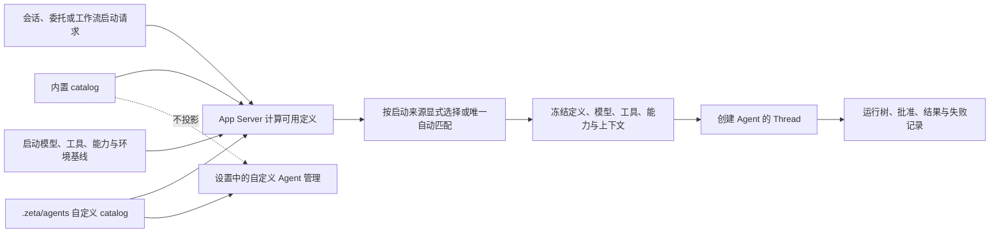

# Agent：统一定义、专化职责与启动关系

> 状态：Proposed。本文件拥有 Zeta Agent 定义的产品边界、统一契约、内置清单和维护规则；当前目录定义实现见 [`zeta-agents`](../zeta-rs/agents/README.md)，委托运行与 Agent 树见 [`core-multi-agent.md`](core-multi-agent.md)，自定义对象和 `.zeta` 边界见 [`agent-customizations.md`](agent-customizations.md)，`/develop` 的阶段、产物和失效流程见 [`develop.md`](develop.md)。

Zeta 只有一种 Agent 定义。内置 Agent 与 `.zeta/agents` 自定义 Agent 的差别是来源、可编辑性和发布周期；“根 Agent”“子 Agent”不是两种定义，只是某次运行在 Agent 树中的相对位置。代码和协议使用“会话入口运行”与“委托运行”表达关系，界面可以在树中把被委托节点简称为“子 Agent”。

## 快速理解

Agent 定义回答“使用什么职责、提示词、模型策略、工具和能力工作”；启动关系回答“这次运行从哪里开始、结果交给谁”。同一份定义可以在它允许的范围内作为会话入口、被其他 Agent 委托，或由确定性工作流启动。内置定义由后端打包，自定义定义从 `.zeta/agents/*.md` 读取；内置定义不进入设置，但实际运行始终可观察。

| 常见问题 | 决定 |
| --- | --- |
| 自定义 Agent 是主 Agent 还是子 Agent？ | 都不是。它是一份可复用定义；本次启动来源决定它处于会话入口还是委托位置。 |
| 系统是否保留主 Agent 与子 Agent 两种类型？ | 不保留。领域中只有 Agent；运行时保留根节点、委托关系和父子拓扑。 |
| 内置专化 Agent 放在哪里？ | 作为 `zeta-agents` 的只读产品资源随版本发布，不能写入、生成到或同步到 `.zeta`。 |
| `.zeta/agents` 放什么？ | 只放用户或项目自定义 Agent definition。 |
| 设置里能看到内置专化 Agent 吗？ | 看不到，也不能在设置中编辑或覆盖；设置只管理可编辑的自定义来源。会话选择器和运行树不是设置页，按启动策略显示可用项。 |
| 根 Agent 一定可以调用其他 Agent 吗？ | 不一定。只有实际工具集中包含委托工具、目标定义允许被它调用，并且预算与权限都满足时才能委托。 |
| 被委托的 Agent 能继续委托吗？ | 可以，但不是默认权利；仍按相同工具、目标范围、深度、预算和权限规则继续收窄。 |
| `/develop` 的阶段 Agent 也在这里维护吗？ | 是。定义、提示词、工具和启动范围在本文维护；`develop.md` 只维护阶段流程、输入产物和验收门。 |
| 会继承发起者的全部对话吗？ | 默认不会。定义始终使用自己的提示词；委托运行只接收创建时明确物化并冻结的上下文。 |
| 会继承主模型吗？ | 没有“主模型”这一特殊概念。默认使用当前 Session 的模型与推理配置；没有 Session 的工作流使用自己的模型基线。定义或本次启动可以显式请求其他模型，委托不会自动继续传播中间调用者的临时模型覆盖。 |
| 会继承发起者的全部工具和权限吗？ | 不会。会话入口受系统、会话和环境上限约束；委托运行还要与调用方上限求交集。任何启动来源都不能扩大权限。 |
| 内置定义不可见是否意味着执行也隐藏？ | 不是。Thread、所用定义、工具调用、批准、结果、失败和取消仍须出现在运行记录与 Agent 树中。 |

## 1. 对象与边界

| 对象 | 回答的问题 | 身份与生命周期 |
| --- | --- | --- |
| `AgentDefinition` | 这个 Agent 的职责、提示词、模型策略、工具、Skill、能力和启动限制是什么？ | 可复用配置；身份包含来源和定义 ID，内容以版本或摘要冻结 |
| Agent 运行实例 | 这一次 Agent 正在执行什么？ | 当前由一个 Thread 表达，不新增与 Thread 一一对应的第二套身份 |
| 启动来源 | 这次运行从会话、委托还是工作流进入？ | 每次运行冻结；不改变定义本身的类型 |
| 委托关系 | 谁交付任务、结果返回给谁、取消和预算如何传播？ | 由 `DelegationId` 和 Thread 来源持久化，只存在于具体运行之间 |

定义不是正在运行的 Agent。会话入口和每次委托都使用同一种定义解析流程，并冻结角色提示词、专长、工具、能力、模型策略和上下文策略；委托另外创建拥有独立 `ThreadId`、Turn、上下文和取消域的 Thread。

内置与自定义定义必须使用带来源的稳定身份，例如 `BuiltIn(explorer)` 与 `Directory(dir_id, explorer)`。内部不能再只用裸 `name` 标识定义；自定义同名项不能覆盖或伪装成内置定义，显式选择出现歧义时必须要求准确来源。默认 `general` 也应是一份普通内置定义，而不是被当作所谓“本体”的特殊运行时。

## 2. `zeta-agents` 统一拥有定义能力

不新增 `zeta-subagents`。现有 `zeta-agents` 已经拥有目录 Agent 定义，长期继续扩展为全部 Agent 定义的唯一 owner，用一个 crate 隔离定义、内置资源、来源加载和校验依赖；它不接管 Agent 运行时。

```text
zeta-rs/agents/
├── Cargo.toml
├── README.md
├── assets/
│   ├── general/
│   │   ├── agent.toml
│   │   └── prompt.md
│   └── <agent>/
│       ├── agent.toml
│       └── prompt.md
└── src/
    ├── catalog.rs
    ├── model.rs
    └── lib.rs
```

| Owner | 长期职责 | 明确不负责 |
| --- | --- | --- |
| `zeta-agents` | 拥有统一 `AgentDefinition`、来源身份和启动策略；打包内置定义；扫描并归一化 `.zeta/agents/*.md`；校验并发布不可变 catalog | Thread、模型调用、工具执行、设置 UI、权限授予 |
| `zeta-prompts` | 提供共享提示词 artifact 与冻结机制 | 集中保存每个内置角色的专用提示词 |
| App Server | 合并 catalog；按会话、委托或工作流筛选定义；把 Agent 模型策略和启动请求交给 `zeta-models-manager`；解析工具与能力；创建冻结运行快照 | 自己维护模型候选排序、维护来源专属选择分支、把内置定义变成设置项、保存前端状态 |
| `zeta-models-manager` | 维护 provider 无关的模型事实、可用性、能力筛选和确定性模型选择；按策略生成请求模型、实际模型与替换原因 | 解释 Agent 职责、读取 Agent 定义、调用模型、保存 Thread |
| `zeta-core` | Thread 生命周期、委托上下文物化、消息、等待、取消和执行时能力收窄 | 扫描定义、选择产品角色 |
| `zeta-protocol` | 定义来源身份、冻结快照、启动来源、上下文模式和能力上限的跨边界结构 | 角色内容和选择策略 |
| Desktop、TUI | 展示运行中的 Agent 树、状态、批准和结果；自定义设置只投影自定义 catalog | 解析或修改内置定义 |

不能把定义、调度、Thread、模型和 UI 装进同一个 crate。`zeta-agents` 的边界止于“Agent 是什么、来自哪里、允许从哪里启动、声明了什么上限”；“当前能否启动”由 App Server 结合本次来源和环境解析，“如何运行”由 Core 负责。

## 3. 统一定义契约与内置格式

每个内置 Agent 必须有独立目录、独立清单和独立 `prompt.md`。提示词与定义同版本发布，不拼进一个所有角色共享的大提示词，也不允许通过设置修改。

统一领域类型至少包含带来源的 `AgentDefinitionId`、选择 metadata、提示词、模型策略、工具与 Skill 上限、上下文策略、启动策略和带作用范围的执行能力上限。来源由 catalog loader 注入，不能由 `agent.toml` 或 `.zeta/agents/*.md` 自报。当前 `zeta-agents::AgentDefinition` 的扁平 `model/tools/skills/instructions/body` 只是目录格式解析结果；接入内置 catalog 和会话入口选择前必须扩展为统一类型，App Server 不再直接消费来源专属结构。

下面是计划格式，用于固定字段语义，不表示当前已经存在该 API：

```toml
schema_version = 1
id = "explorer"
version = 1
description = "定位代码、调用链和实现证据，不修改文件。"
prompt = "prompt.md"
specialties = ["code.explore", "code.trace"]

[tools]
allowed = ["read_file", "grep", "glob", "search_code"]
required = ["read_file", "grep", "glob"]

[skills]
allowed = []
required = []

[model]
default = "session"
allow_override = true
replacement = "any-compatible"
required_capabilities = ["tools"]

[context]
default = "selected"
allowed = ["fresh", "selected"]

[launch]
allowed = ["session", "delegation"]
allowed_callers = []
workflows = []

[[capabilities]]
kind = "file_read"
scope = "thread_dirs"
```

字段边界如下：

- `description` 只用于选择，必须短、具体，并写清何时使用；完整行为规则放在 `prompt.md`。
- 内置格式的 `version` 是定义内容版本；提示词、工具、Skill、模型、上下文、启动范围或能力上限变化都必须提升，并与完整内容摘要一起冻结。自定义来源继续使用 catalog generation 与内容摘要表达版本身份。
- `specialties` 描述角色擅长解决的问题，用于路由和评测，不产生执行权限。
- `tools.allowed` 是该角色的精确工具上限，`tools.required` 是每次创建都必须存在的最小集合；工作契约可以从上限中声明本次额外必需工具，缺少任何必需项时不创建。
- `skills.allowed` 与 `skills.required` 对 Skill 做同样的上限和必需项约束；调用方已激活不代表被委托方自动继承。
- `capabilities` 是带作用范围的执行能力上限，使用现有 `CapabilityKind` 语义；它不能因为提示词或工具引用而扩大。
- `model.default` 使用 `session` 或准确 `provider/model`。`session` 表示当前 Session 的模型与推理配置；没有 Session 的工作流改用自己的模型基线。委托不从中间调用者继承临时模型覆盖。
- `model.allow_override` 独立决定本次启动能否请求其他模型；被禁止的覆盖是无效启动请求，不能被静默忽略。
- `model.replacement` 使用 `none`、`same-provider` 或 `any-compatible`。它只控制启动前的模型替换，不授权在一次模型调用失败后换模型重放请求。
- `model.required_capabilities` 与上下文、推理等级等约束共同描述候选模型必须满足的事实；`zeta-agents` 只校验声明结构，实际筛选统一由 `zeta-models-manager` 完成。
- 不增加混合多种含义的 `fixed` 策略。需要准确模型时使用“准确 `default` + `allow_override = false` + `replacement = "none"`”表达。
- `context` 同时限制默认上下文和调用方可请求的模式；调用方不能越过角色允许范围。
- `launch.allowed` 明确一份定义能否从会话、委托或工作流启动；它限制使用位置，不把 Agent 分成不同类型。
- `launch.allowed_callers` 只约束委托来源，使用准确的定义来源身份；空列表表示不额外限制调用方，非空列表表示只允许列出的来源。调用方可见的目标集合由目标定义反向计算，不在两端重复保存同一条边。
- `launch.workflows` 只约束工作流来源，绑定准确的工作流和阶段；只有 `launch.allowed` 包含 `workflow` 时才允许非空，普通 Agent 不能伪造工作流身份。

| 启动来源 | 谁能创建 | 额外绑定 |
| --- | --- | --- |
| `session` | 用户或产品创建会话入口时的 Agent 选择器 | 没有父 Agent；使用会话的模型、目录和权限基线。 |
| `delegation` | 当前工具与目标策略允许的任意 Agent 运行 | 记录调用方 Thread 与 `DelegationId`；`allowed_callers` 非空时只允许准确来源身份。 |
| `workflow` | 指定的确定性工作流 | 必须绑定工作流 ID 和阶段；用户或普通 Agent 不能伪造该来源。 |

创建会话入口或委托 Thread 前，App Server 必须冻结启动来源、定义来源、定义版本、内容摘要、提示词摘要、请求模型、实际模型、模型替换原因、推理与服务等级、工具集合、Skill 集合、能力上限、上下文输入和选择原因。恢复旧 Thread 时继续使用冻结值，不能因应用升级、定义变化或模型目录刷新改写历史执行身份。

## 4. 启动与继承规则

Agent 定义本身不继承另一个 Agent。会话入口从会话已经解析的模型、目录、Instructions 和权限基线启动；委托运行拥有独立模型会话，只消费创建时明确物化的输入，调用方之后发生的变化只能通过有来源的 Agent 消息传递；工作流运行只消费该阶段绑定的上下文包。

| 内容 | 委托运行的默认行为 | 例外与限制 |
| --- | --- | --- |
| 委托任务 | 始终传递 | 必须是完整、可独立执行的任务，不能只传一句角色名。 |
| 专用提示词 | 始终使用该定义自己的 `prompt.md` | 不能由调用方对话或设置替换；系统安全规则优先级更高。 |
| 产品安全与基础规则 | 重新应用并冻结适用于委托 Thread 的规则 | 不是复制调用方整段系统提示词，定义提示词不能覆盖它们。当前协调器仍复制调用方 Turn 的 `TurnInstructions`，接入内置定义前必须改正。 |
| 工作区 Instructions | 按委托 Thread 的准确目录和作用范围重新解析后冻结 | 同一环境且目录作用范围完全一致时可以复用已冻结基线；环境或目录变化时必须重新解析，不能复制无关调用方规则。 |
| 调用方完整对话 | 默认不传递 | `full` 只允许显式请求，且定义必须声明允许；初始内置定义均不默认允许。 |
| 选定消息、检查点和产物 | 按角色默认策略传递 | 创建时复制为不可变种子；不建立实时共享上下文。 |
| 隐藏推理过程 | 不传递 | 传递结论、证据、计划或检查点，不依赖另一 Agent 的未公开推理。 |
| 模型 | 默认使用当前 Session 已解析的模型作为启动基线 | 本次启动覆盖获准时优先于定义偏好；准确模型不可用时按定义策略选择兼容模型并警告。没有兼容候选或策略禁止替换时不创建。 |
| 推理等级与服务等级 | 默认使用 Session 的模型调用配置作为启动基线 | 显式模型没有显式推理等级时使用该模型的默认值；最终配置仍受预算和产品策略限制并随运行冻结。 |
| 工具 | 不整体继承 | 取定义白名单、调用方可见集合和环境可用集合的交集；缺少必需项就不创建。 |
| Skills | 只加载定义明确声明且当前已授权的 Skill | 不自动复制调用方全部已激活 Skill。 |
| 能力与批准 | 只继承更窄的上限 | 调用方批准不是被委托方的永久批准；具体动作仍按策略审查。 |
| Environment 与目录 | 默认使用调用方 Thread 的执行环境和已授权目录快照 | 切换环境必须显式选择并重新授权，不能通过定义暗中切换。 |
| 预算与取消 | 使用独立委托预算和取消域，同时受调用方总上限约束 | 取消调用方时按既定树策略处理后代；被委托方不能增加总预算。 |

现有上下文模式继续作为委托执行契约：`fresh` 只包含任务、角色和基础规则；`selected` 只物化明确来源；`lastTurns`、`checkpointAndTail` 与 `full` 只在定义允许并由调用方明确请求时使用。所有模式都在创建时冻结，不共享调用方 Thread 的可变历史。会话入口和工作流分别使用自己的输入契约，不能伪装成一次父子继承。

### 4.1 模型选择与替换

Agent 只声明默认值、覆盖权限、替换范围和能力要求。App Server 组合本次启动上下文后调用 `zeta-models-manager`，后者是模型候选筛选与排序的唯一 owner；`zeta-model-provider` 只执行已经选定的准确模型。

| 场景 | 请求模型来源 | 结果 |
| --- | --- | --- |
| 没有任何覆盖 | 当前 Session；无 Session 的工作流使用工作流基线 | 使用基线模型；委托不自动继承中间调用者的临时覆盖 |
| 本次启动显式指定且允许覆盖 | 启动参数 | 该模型成为请求模型 |
| 没有启动参数但定义指定准确模型 | `model.default` | 定义模型成为请求模型 |
| 请求模型可用且满足要求 | 准确目录条目 | 直接使用，不产生替换警告 |
| 请求模型不可用，允许同 provider 替换 | 兼容候选 | 先选同 provider 的兼容模型，记录并展示警告 |
| 同 provider 没有候选，允许跨 provider 替换 | 兼容候选 | 再按允许的 provider 顺序选择，记录更醒目的跨 provider 警告 |
| 没有兼容候选或 `replacement = "none"` | 无 | 不创建 Agent，返回类型化原因 |

候选解析顺序固定为：

1. 请求的准确模型。
2. 同一配置、endpoint、账号或订阅 scope 内，目录明确属于同一模型族的兼容模型。
3. 同一 scope 内的其他兼容模型。
4. 同 provider 的其他已允许 scope 中的兼容模型。
5. 其他已允许 provider 的兼容模型。

模型族、能力、生命周期和候选顺序必须来自带来源的模型目录事实，不能根据模型 ID、价格或“看起来更新”猜测。候选至少要满足工具调用、输入类型、上下文长度、推理等级、结构化输出、执行 runtime、账号可用性、组织策略、费用限制和区域限制；事实未知时按本次选择策略明确排除或携带警告，不能把未知当作支持。同 provider 不代表同 endpoint、凭据、订阅或计费来源；跨 scope 也必须记录并警告，策略不允许改变访问来源时直接排除。

替换是启动前的一次确定性选择，不是模型调用重试。选择结果必须包含请求模型、实际模型、替换原因、是否跨 provider、使用的目录 generation 和最终推理配置；客户端在 Agent 开始工作前显示非阻塞警告，运行记录和 Agent 树继续显示实际模型。运行开始后目录刷新、Session 换模型或上级 Agent 改配置都不能切换该运行的模型；真实调用失败按原模型返回错误，不能跨 provider 重放可能已经产生副作用的请求。

## 5. 内置 Agent 清单

默认 `general` 是 `zeta-agents` 打包的普通内置定义，可用于会话入口和委托运行；它不是特殊“本体”。以下清单维护专化定义。所有内置定义默认使用本次启动已经解析的模型调用配置；表格只列不同于通用规则的任务、上下文、工具和能力边界。

### 5.1 普通可选 Agent

这些定义允许用于会话入口和 Agent 委托，可以被用户显式选择或参与对应来源的自动选择，但仍不进入设置页。

| ID | 允许启动来源 | 专长与自己的提示词重点 | 默认上下文 | 工具白名单 | 执行能力上限 | 明确不做 |
| --- | --- | --- | --- | --- | --- | --- |
| `explorer` | 会话、委托 | 回答范围明确的代码问题；沿真实符号和调用链给出文件、行号、测试与不确定点 | 会话输入或 `selected` | `read_file`、`grep`、`glob`、`search_code` | 授权目录只读 | 修改文件、运行长任务、泛泛设计 |
| `implementer` | 会话、委托 | 在明确文件或模块责任内完成代码修改；保留他人改动，运行最小验证并报告改动与测试 | 会话输入或 `checkpointAndTail` | `read_file`、`grep`、`glob`、`search_code`、`process_start`、`process_wait`、`process_terminate`、`apply_patch`、`edit`、`write_file` | 授权目录读写、受沙箱约束的进程 | 外部服务修改、凭据使用、超出分配范围的重构 |
| `reviewer` | 会话、委托 | 独立审查目标、最终 diff 与验证证据；先报可操作问题、严重度和证据，再给摘要 | 会话输入或 `fresh` 加显式目标与证据 | `read_file`、`grep`、`glob`、`search_code`、`process_start`、`process_wait`、`process_terminate` | 源码只读、只读进程检查 | 修改代码、接受工作 Agent 的总结代替证据 |
| `test-runner` | 会话、委托 | 运行指定测试或检查；区分首个根因与连带失败，返回命令、退出状态和关键输出 | 会话输入或 `selected` | `read_file`、`grep`、`glob`、`search_code`、`process_start`、`process_wait`、`process_terminate` | 源码只读、受沙箱约束的进程、仅构建产物目录可写 | 修复代码、无界运行、把失败误报为完成 |
| `researcher` | 会话、委托 | 优先使用官方一手资料；核对发布日期、版本和适用范围，区分来源事实与推断 | 会话输入或 `fresh` | `read_file`、`grep`、`glob`、`web_search`、`browser_open`、`browser_observe`、`browser_navigate`、`browser_close` | 授权目录只读、网络读取、浏览器只读交互 | 修改本地文件、登录账户、提交表单、把本地文档当最终事实 |
| `ui-validator` | 会话、委托 | 用真实浏览器或 Electron 流程复现并验证 UI；记录步骤、语义状态和可复查证据 | 会话输入或 `selected` | `read_file`、`grep`、`glob`、`process_start`、`process_wait`、`process_terminate`、`browser_open`、`browser_observe`、`browser_navigate`、`browser_click`、`browser_type`、`browser_scroll`、`browser_back`、`browser_reload`、`browser_screenshot`、`browser_close` | 源码只读、受沙箱约束的进程、网络与 UI 交互 | 修改源码、使用截图代替调试结论、执行不可逆外部操作 |

每个表格行都必须对应一个真实 `assets/<id>/prompt.md`，文档只维护提示词契约，不复制完整正文。这样提示词只有一个可执行 owner，修改时不会出现文档与实际资源两份正文漂移。

`process_start`、`process_wait` 与 `process_terminate` 表示计划中的显式进程资源契约。当前 App Server 的 `shell-command` 默认 30 秒超时，不能可靠承载长测试，也不能单靠工具名证明“只读”。专化角色上线前必须让进程动作产生准确的文件、进程和网络能力需求，以角色能力上限执行检查，并支持等待、取消、超时和未知结果；不能用反复调用短时 shell 维持长任务。

### 5.2 `/develop` 阶段角色

`/develop` 的阶段状态机根据已接受产物创建这些角色。它们不参与普通任务的自动选择，也不能由用户绕过流程直接调用。阶段角色只消费该阶段不可变上下文包，不继承当前聊天的实时完整历史。

| ID | 自己的提示词重点 | 默认上下文 | 自己的工具集 | 执行能力上限 | 产物与停止条件 |
| --- | --- | --- | --- | --- | --- |
| `develop-intent` | 从用户原话和有来源证据中提炼问题、期望、约束、非目标与未决判断，不把方案伪装成意图 | `selected`：命令锚点、用户决定和调查证据 | `write_intent_candidate`、`spawn_agent`、`send_agent_message`、`wait_agent` | 只能写当前工作 Intent 候选并调用三个私有角色 | 产出可追溯候选；缺产品判断时返回 `NeedsUserDecision` 并停止，由工作流向用户提问 |
| `develop-spec` | 把已接受 Intent 转换成可观察行为、系统边界、失败语义、风险和验收标准 | `selected`：已接受 Intent、项目事实和领域文档 | `read_file`、`grep`、`glob`、`search_code`、`write_spec_candidate` | 项目只读，只能写当前工作 Spec 候选 | 产出 Spec 候选；不能改变 Intent 或实施代码 |
| `develop-plan` | 根据已接受 Spec 和固定代码基线形成有顺序、可验证的工作契约与执行方式 | `selected`：已接受 Intent/Spec、代码基线、测试入口 | `read_file`、`grep`、`glob`、`search_code`、`process_start`、`process_wait`、`process_terminate`、`write_plan_candidate` | 源码只读、只读进程检查，只能写当前工作 Plan 候选 | 产出 Plan 候选；不能降低验收标准 |
| `develop-implementer` | 严格按已接受工作契约修改分配范围，保留他人改动并产生可封存 ChangeSet | `selected`：已接受 Intent/Spec/Plan、工作契约和代码检查点 | `read_file`、`grep`、`glob`、`search_code`、`process_start`、`process_wait`、`process_terminate`、`apply_patch`、`edit`、`write_file` | 只读写分配的代码范围并运行获准验证 | 工作完成、失败或工作契约失效时停止；不能改写上游产物和验收规则 |
| `develop-acceptance` | 独立对照原始意图、固定 Spec、最终差异和真实证据判断是否满足验收标准 | `fresh` 加显式选择的固定验收包 | `read_file`、`grep`、`glob`、`search_code`、`process_start`、`process_wait`、`process_terminate`、获准的 `browser_*` 验证工具、`write_acceptance_candidate` | 源码与控制资源只读，只能运行已定义验证并写验收候选 | 返回逐项证据和未满足项；不能修改候选代码或接受自己的工作 |

`write_intent_candidate`、`write_spec_candidate`、`write_plan_candidate` 与 `write_acceptance_candidate` 是计划中的开发流程领域工具。它们只能操作当前开发工作的对应候选对象，不能用通用 `write_file` 代替，否则无法保证单写者、版本绑定和上游失效语义。

`develop-acceptance` 的浏览器工具不是每次全部加载。工作流从已接受 Spec 的验证方法推导本次必需工具，并在创建时冻结实际子集；任何必需工具不可用时验收阻塞，不能删掉该验收项继续通过。

表格中的 `browser_*` 是阅读缩写，实际 `agent.toml` 必须逐项列出允许的浏览器工具。当前 `ToolDefinition` 没有来源可信、可签名的“只读/修改”动作 metadata，因此初始角色不动态接入 Connector；只有工具来源能够发布权威动作能力、并在创建时解析成准确工具名、定义摘要与能力集合后，才可为具体角色开放。

### 5.3 Intent 私有角色

以下角色只注册到 `develop-intent` 的私有能力面：不进入设置、不进入普通协调层 catalog、不接受用户直接选择，也不能被其他阶段 Agent 调用。每次委托只回答一个可验证问题并返回有来源的证据，不写任何阶段产物。

| ID | 自己的提示词重点 | 默认上下文 | 自己的工具集 | 执行能力上限 | 唯一允许的调用方 |
| --- | --- | --- | --- | --- | --- |
| `intent-project-investigator` | 调查一个明确的本地事实，返回源码、Git、测试证据、代码基线与不确定性 | `fresh` 或 `selected` | `read_file`、`grep`、`glob`、`search_code`、`process_start`、`process_wait`、`process_terminate` | 项目只读、只读 Git/构建/测试进程、仅构建产物目录可写 | `develop-intent` |
| `intent-researcher` | 调查一个明确的外部事实，优先一手来源并说明时间、版本、适用范围和不确定性 | `fresh` 或 `selected` | `web_search`、`browser_open`、`browser_observe`、`browser_navigate`、`browser_close` | 网络和外部来源只读；不得登录、提交或修改外部状态 | `develop-intent` |
| `intent-conflict-reviewer` | 比较指定的用户原话、项目事实、外部来源和候选产物，列出冲突双方、影响与可确定优先级 | `selected` | `read_file`、`grep` | 只读明确提供的来源 | `develop-intent` |

三个私有角色的 `launch.allowed` 都只包含 `delegation`，`launch.allowed_callers` 只包含内置 `develop-intent` 的来源身份。App Server 为 `develop-intent` 计算可用定义时反向得到这三个目标，并把 `spawn_agent` 的可选范围冻结到该集合；仅靠提示词要求“不要调用其他 Agent”不构成隔离。

### 5.4 与 `/develop` 的责任联动

| 契约 | Canonical owner |
| --- | --- |
| 角色 ID、提示词、工具、能力、模型与启动范围 | 本文件和 `zeta-agents` |
| 阶段顺序、接受门、产物版本、上游失效、恢复与用户等待 | [`develop.md`](develop.md) |
| 委托 Thread、上下文种子、消息、取消、等待和持久结果 | [`core-multi-agent.md`](core-multi-agent.md) |
| Team 的工作拆分、隔离、证据和集成门 | [`multi-agent-development.md`](multi-agent-development.md) |

阶段协调必须由确定性工作流完成，不能把 `develop.md` 整篇作为提示词交给会话入口 Agent。工作流创建阶段 Agent 时提交固定阶段身份、已接受上游版本、代码基线、工具范围、预算、时间和停止条件；阶段 Agent 只返回候选或证据，不能自行推进、接受或重写工作流状态。

## 6. 选择、可见性与执行流程



选择规则：

1. 先按 `launch` 筛选本次会话、委托或工作流允许的定义，再按所需工具、能力、模型和上下文模式计算可用集合；不可执行的定义不能参与匹配。
2. 委托来源继续检查准确调用方身份、Agent 树深度和预算；工作流来源继续检查工作流与阶段身份。
3. 显式选择必须解析到唯一的来源身份；显式名称也不能绕过调用范围，内置名称不能被自定义定义覆盖。
4. 自动选择只使用简短 `description` 和 `specialties` 做候选匹配；分数并列或证据不足时，会话入口要求用户明确选择，委托调用方重新给出明确目标，工作流按自身确定性规则停止。
5. 选择成功后冻结全部输入，再创建 Thread；不能先创建再补工具、权限或提示词。
6. 内置 catalog 只投影给本次启动来源允许的选择器和运行观测，不进入设置服务、设置 schema 或自定义 Agent 管理页。

“不进入设置”只限制编辑和配置。运行时必须展示内置定义 ID、来源、启动关系、状态、工具调用、批准请求、结果和失败原因，用户可以停止正在运行的 Agent。

## 7. 安全与失败语义

- **失败即关闭**：提示词缺失、摘要不一致、模型策略无法解析出兼容候选、必需工具缺失、能力越权、上下文来源无效或定义版本未知时，不启动 Agent。
- **权限只收窄**：定义清单不是授权凭证；即使清单声明某项能力，也必须处于启动基线和系统授权之内。
- **无同名覆盖**：自定义定义不能替换内置定义；迁移旧的裸名称前必须先增加来源身份。
- **无身份特权**：位于根节点不会自动获得委托能力，被委托节点也不会自动失去委托能力；是否可以继续委托完全由冻结工具、允许目标、深度、预算和权限决定。
- **无隐式递归**：初始专化定义没有 `spawn_agent`、`send_agent_message` 或 `wait_agent`；只有 `develop-intent` 获得这三个工具，且目标被结构化限制为它的三个私有角色。
- **控制资源隔离**：Intent、Spec、Plan、验收记录、测试入口、项目指令、权限和验证配置不能通过普通文件写工具越权修改；修改控制资源的角色不能用修改后的规则批准自己的结果。
- **无实时上下文共享**：委托运行只读冻结种子和有来源的后续消息；不能读取调用方实时草稿、未提交推理或其他 Agent 的内存。
- **批准保持可见**：内置定义不可配置不代表可以绕过批准、沙箱、网络规则、凭据边界或外部修改审查。
- **本地文档不是最终事实**：设计与实现状态必须由源码、测试和一手外部文档交叉验证；发现冲突时在文档中明确 Current 与 Proposed，不能选择更方便的一份作为事实。

## 8. 当前实现与缺口

| 能力 | 状态 | 证据或缺口 |
| --- | --- | --- |
| `.zeta/agents/*.md` 自定义定义 catalog | 已实现 | `zeta-agents` 扫描、校验并发布不可变 snapshot。 |
| 委托时显式/唯一 metadata 自动选择 | 已实现 | App Server 的 `agent_selection.rs` 当前只在 `spawn_agent` 路径消费目录 catalog。 |
| 独立委托 Thread、消息、等待、取消与持久结果 | 已实现 | `zeta-core` 多代理运行时。 |
| `fresh`、`selected`、`lastTurns`、`checkpointAndTail`、`full` | 已实现 | `spawn_agent` 当前默认 `fresh`，其他模式显式传入。 |
| 委托工具只能从调用方当前集合中收窄 | 已实现 | `DelegatedCapabilityScope` 当前冻结工具与 Skill。 |
| 委托运行使用完整模型调用基线 | 尚未完成 | 当前 Agent definition 选择明确冻结 `ModelRef`；推理等级和服务等级还需要作为同一模型策略核对并冻结。 |
| Agent 模型继承、覆盖和兼容替换 | 尚未完成 | 当前委托只使用调用方当前 `ModelRef` 或定义中的准确模型；`zeta-models-manager` 目前只解析指定模型，没有跨 provider 候选选择、替换决定和用户警告。 |
| 会话入口选择 Agent 定义 | 尚未完成 | 当前 `ThreadOrigin::Root` 创建路径不接收或冻结 `AgentDefinition`；需要与委托共用同一解析流程。 |
| 统一定义契约 | 尚未完成 | 需要扩展 `zeta-agents::AgentDefinition`，让内置资源和自定义解析结果统一产出同一领域类型；App Server 不能继续直接消费来源专属结构。 |
| 内置专化 catalog 与本文角色资源 | 尚未完成 | 需要加入清单、逐角色提示词、稳定摘要、路由评测和发布校验。 |
| 启动来源与 `/develop` 私有范围 | 尚未完成 | 需要统一启动来源、调用方身份、允许调用方、工作流阶段、候选领域工具和上下文包绑定，不能依赖提示词隔离。 |
| 带来源的定义身份 | 尚未完成 | 当前 `FrozenAgentDefinitionRef` 只有裸 `name`、catalog generation 和 digest，合并 catalog 前必须补齐。 |
| 每个角色的带作用范围执行能力上限 | 尚未完成 | 当前 `DelegatedCapabilityScope` 只有工具和 Skill，需要冻结并执行检查 `Capability` 上限。 |
| 委托 Thread Instructions 解析 | 尚未完成 | 当前协调器把调用方 Turn 的 `TurnInstructions` 直接带入委托 Turn；目标是按委托运行的准确目录和作用范围解析并冻结，只有作用范围完全一致时才能复用调用方基线。 |
| 长时进程资源 | 尚未完成 | 当前 `shell-command` 默认 30 秒超时；需要可等待、可取消、可终止并能表达结果未知的进程资源，以及准确的构建产物写入范围。 |
| 动态外部工具的动作 metadata | 尚未完成 | 当前 `ToolDefinition` 没有权威只读/修改分类；在来源签名、动作能力和摘要冻结完成前，专化角色不动态接入 Connector。 |
| `/develop` 用户判断交互 | 尚未完成 | 阶段 Agent 应返回 `NeedsUserDecision`，由确定性工作流发起 server request 并恢复下一阶段运行；`request_user_input` 不是当前模型工具。 |
| 内置不进设置、运行时仍可观察 | 尚未完成 | 需要分别测试设置投影和 Agent 树投影，不能共用一个“是否可见”字段代替两个行为。 |
| 内置角色选择与评测 | 尚未完成 | 需要在 App Server 合并 catalog，并建立正例、反例和权限不足用例。 |

当前代码里“委托定义未声明模型时使用调用方当前模型”和“未传上下文时使用 `fresh`”已经存在，但前者不是目标继承语义：目标是从 Session 基线、定义偏好和获准的本次启动请求生成一个请求模型，再由统一模型目录选择并冻结实际模型。会话入口还不能选择并冻结 Agent 定义，内置 catalog 也尚未实现。后续应让会话、委托和工作流复用同一 `AgentDefinition` 解析契约；委托继续复用既有子 Thread、上下文种子和工具/Skill 冻结机制，不建立第二套运行时。

## 9. 维护与验收

每次新增或修改内置 Agent，必须同时完成：

1. 更新唯一的 `agent.toml` 与 `prompt.md`，提升定义版本并生成稳定摘要。
2. 校验 ID、提示词非空与大小上限、工具引用、能力作用范围、模型策略、上下文策略和禁止递归规则。
3. 增加路由正例与反例，证明该角色在该用时被选、不该用时不会抢任务。
4. 增加行为评测，覆盖结果格式、证据质量、禁止动作和工具最小化；只读角色必须有“不能修改”的执行测试。
5. 增加权限交集、缺工具、准确模型、同 provider 替换、跨 provider 替换、无兼容候选、替换警告、上下文泄漏、恢复后摘要一致和取消传播测试。
6. 验证设置页不出现内置定义，同时 Agent 树和运行记录能够显示真实执行身份。
7. 工作流或私有定义还要验证普通选择器和错误调用方无法发现、选择或调用它们。
8. 对照源码与测试更新本文件的状态表；不能只依据其他本地 Markdown 宣布完成。

## 10. 长期不变量

- Zeta 只有一种 `AgentDefinition`，不建立主 Agent、子 Agent 或工作流 Agent 的并列类型。
- 会话入口、委托和工作流是运行时启动来源；父子只表示具体运行之间的委托拓扑。
- Agent 能否委托由冻结工具、允许目标、深度、预算和权限共同决定，不从它位于根节点还是委托节点推断。
- 每个 Agent 定义独立拥有提示词、模型策略、工具、Skill、上下文策略和能力上限；职责描述不产生权限。
- Agent 默认使用 Session 模型基线；默认值、启动覆盖权限和替换范围分别表达，不建立 `fixed` 混合策略，也不自动传播中间调用者的临时模型覆盖。
- 模型替换只发生在运行创建前，确定性地先检查同 provider 再检查其他允许 provider；请求模型、实际模型、原因和跨 provider 状态必须可见并随运行冻结。
- 内置与自定义定义共用契约，但保留不可伪造的来源身份；自定义定义不能覆盖内置定义。
- 内置定义随 `zeta-agents` 发布，不写入 `.zeta`，不进入设置；允许选择的定义和实际运行仍按来源完整展示。
- 当前一个 Agent 运行由一个 Thread 表达；没有跨多个 Thread 延续的真实身份需求前，不增加第二套 Agent 运行聚合。

## 11. 外部参考与取舍

- [OpenAI 模型指南](https://developers.openai.com/api/docs/guides/latest-model) 使用“多 Agent / 子 Agent”描述一个 Agent 协调多个执行者，说明该词首先表达运行时协作关系。Zeta 不从该术语推导独立定义类型。
- [Claude Code 自定义子代理文档](https://code.claude.com/docs/en/sub-agents) 同时描述独立提示词、工具、模型与上下文，并明确同一 Agent 文件也可通过 `--agent` 或设置作为主会话 Agent 运行。Zeta 采用“定义与运行位置分离”的结论，但不复制其文件优先级和同名覆盖规则。

外部产品的文件格式和优先级只作为设计输入，不是 Zeta 的兼容契约。Zeta 的最终行为以本文件明确的长期不变量、实际源码和通过的测试为准。
