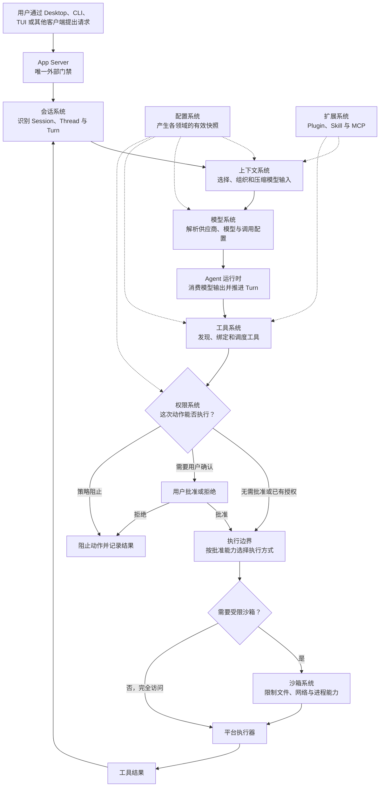

# Zeta 系统地图

Zeta 的架构应从用户请求如何进入系统、经过哪些决定、最终如何执行和保存来理解，而不是从
crate 名称开始倒推。本文是面向开发者的总入口：先建立产品的整体心智模型，再把每个系统映射
到权威文档和实现。

> 本文描述用于审计架构的系统边界，不预设现有边界已经正确。当前实现、计划演进和潜在方向
> 必须在各系统文档中分别说明；crate README 只负责提供实现证据，不能反过来定义产品语义。

## 快速理解

| 你正在解决的问题 | 首先从哪里看 | 接下来验证什么 |
| --- | --- | --- |
| 用户为什么会看到某种行为 | 对应的系统文档 | 行为表、规则和例外 |
| 两个组件为什么都在做相似决定 | 系统边界与端到端流程 | 谁决定、谁执行、谁保存 |
| 一次请求为什么在某个阶段失败 | 请求执行流程 | 输入、状态、失败语义和恢复点 |
| 修改一个 crate 会影响哪些地方 | crate README | 它所属的系统、调用方和权威契约 |
| 一个计划功能是否已经可用 | 系统文档的当前状态 | 代码、测试和对外接口证据 |

阅读顺序应当始终是“用户问题 → 系统行为 → 责任边界 → 执行流程 → 实现符号”。如果必须先理解
大量 crate、类型和函数名才能知道系统在做什么，说明文档的信息顺序需要调整。

对于 `Session`、`Thread`、`Turn`、`ThreadItem` 产品能力，App Server 是唯一的外部入口和出口。
Desktop、CLI、TUI 以及其他客户端只能通过版本化 App Server 契约读写产品状态和订阅更新；Core、
Store、Provider 与私有运行时接口不对客户端开放。进程内嵌只改变传输成本，不改变这条门禁规则。

## 2. 一次请求如何穿过 Zeta

下面是用于理解和审计的产品级流程，不是某个进程内部的函数调用图：



这张图表达三个不同层次：

- **产品流程**：用户请求从哪里进入，最终在哪里形成结果；
- **决定链**：模型选择、工具选择和动作授权分别由哪个系统决定；
- **执行链**：授权结果如何变成可被操作系统强制执行的能力边界。

其中任意一个箭头如果无法说明输入、输出、失败语义和责任归属，就是需要优先审计的架构接缝。

## 3. 系统边界

### 3.1 对话、上下文与运行时

| 系统 | 回答的核心问题 | 应当拥有 | 重点审计边界 | 权威文档 |
| --- | --- | --- | --- | --- |
| Project 与工作组织系统 | 哪些本地/远程根、Session 和共同工作需要长期组织在一起？ | Project metadata、长期根目录表以及对 Session/WorkRun 的弱关联 | Project、Workspace、Environment、Grant 和 WorkRun 是否被误建成同一对象 | [`domain-model.md`](domain-model.md)、[`multi-agent-development.md`](multi-agent-development.md) |
| 会话系统 | 一次工作如何被识别、恢复和持续保存？ | Session、Thread、Turn、事件顺序与持久化事务 | Session、Thread、Store 与 rollout 是否存在重复权威 | [`core.md`](core.md)、[`protocol.md`](protocol.md) |
| 上下文系统 | 当前模型究竟能看到什么？ | 上下文选择、预算、压缩、恢复和每个 Thread 的上下文状态 | 持久事实、模型输入和 UI 展示状态是否混为一体 | [`core-context.md`](core-context.md) |
| Agent 运行时 | 模型输出如何推进一次 Turn？ | Agent 生命周期、模型回合、工具回合、取消与同 Session Agent tree 协调 | 单 Agent 执行、子 Agent tree、跨 Session 工作和持久化是否混为一个协调器 | [`agent-harness-design.md`](agent-harness-design.md)、[`core-multi-agent.md`](core-multi-agent.md)、[`zeta-agent-runtime-architecture.md`](zeta-agent-runtime-architecture.md) |
| 多 Agent 开发系统 | Team 子 Agent 与多个独立 Session 的代码结果凭什么可以共同发布？ | WorkRun、两种协作拓扑、工作契约、Project 多根 checkpoint、跨 Agent 依赖与冲突、验证证据和集成门禁 | Agent tree 生命周期、跨 Session 等待/移交、工作协调、动作授权、验证和目标更新是否互相越权 | [`multi-agent-development.md`](multi-agent-development.md) |
| Agent 自定义系统 | Agent 长期遵循什么、如何复用工作方法、使用哪种执行配置？ | Instructions、Skills、Agents、`.zeta` 原生命名空间与外部导入边界 | Prompt/Task/Slash Command 是否被误建模为 artifact，外部格式是否污染原生 authority | [`agent-customizations.md`](agent-customizations.md) |

### 3.2 能力、决策与执行

| 系统 | 回答的核心问题 | 应当拥有 | 重点审计边界 | 权威文档 |
| --- | --- | --- | --- | --- |
| 模型系统 | 最终使用哪个供应商、模型和调用配置？ | 模型目录、能力、配置解析和运行时选择 | 目录、配置、凭据、供应商适配、传输和重试是否分层 | [`models-manager.md`](models-manager.md)、[`model-provider.md`](model-provider.md)、[`model-provider-config.md`](model-provider-config.md) |
| 工具系统 | Agent 能看到和调用哪些能力？ | 工具定义、发现、绑定、参数验证、调用和结果契约 | 工具定义、调度、授权、执行与结果持久化是否互相越界 | [`tools.md`](tools.md) |
| 权限系统 | 某个具体动作能否执行？ | 授权规则、批准范围、批准有效期与最终授权决定 | 权限、Auto Review、工具调度和沙箱是否都在做最终决定 | [`permissions.md`](permissions.md)、[`auto-review.md`](auto-review.md) |
| 沙箱系统 | 已获准动作实际能触及什么？ | 文件、网络、进程能力和平台强制执行 | 策略选择、用户批准与操作系统强制执行是否分开 | [`sandboxing.md`](sandboxing.md) |
| 配置系统 | 当前作用域下哪个值最终生效？ | 配置来源、优先级、作用域、合并和不可变领域快照 | 通用合并与各领域验证是否有清楚交接 | [`config.md`](config.md) |
| 身份与秘密系统 | 用户如何登录，敏感凭据保存在哪里？ | 登录流程、账户状态和秘密的安全存取 | 身份、账户展示、供应商凭据和网络调用是否解耦 | [`login.md`](login.md)、[`secrets.md`](secrets.md)、[`chatgpt-subscription.md`](chatgpt-subscription.md) |

### 3.3 扩展、接口与产品入口

| 系统 | 回答的核心问题 | 应当拥有 | 重点审计边界 | 权威文档 |
| --- | --- | --- | --- | --- |
| 扩展系统 | 外部能力如何被发现、激活和撤销？ | Marketplace Manager 管 package lifecycle，各领域消费 capability；Plugin 只是 bundle，Connector 管账号，MCP 管协议，Skill 管指令 | 安装、领域授权、运行时和 Agent 消费是否分层 | [`marketplace-integration.md`](marketplace-integration.md)、[`plugins.md`](plugins.md)、[`connectors.md`](connectors.md)、[`skills.md`](skills.md)、[`mcp.md`](mcp.md) |
| App Server 与协议 | 产品入口如何调用同一套权威能力？ | 唯一外部进入/输出边界、对外方法、DTO、事件、订阅、版本和客户端契约 | 客户端是否绕过门禁，或协议层是否偷偷拥有产品决定或持久化规则 | [`zeta-app-server-api.md`](zeta-app-server-api.md)、[`app-server-client.md`](app-server-client.md)、[`protocol.md`](protocol.md) |
| 产品界面 | 用户如何观察和控制这些系统？ | Desktop、CLI、TUI 的交互、呈现和平台适配 | 界面是否复制 Core 状态或在本地发明业务规则 | [`zeta-desktop-architecture.md`](zeta-desktop-architecture.md)、[`zeta-cli-architecture.md`](zeta-cli-architecture.md)、[`tui.md`](tui.md) |

系统名称不是按照 crate 数量划分的。一个系统可以由多个 crate 实现，一个 crate 也可能只是某个
系统的适配器。真正的边界由权威状态、最终决定、执行责任和失败语义决定。

## 4. 怎样判断边界是否清楚

审计每个系统时，必须能够连续回答下面的问题：

| 审计问题 | 清楚边界应当给出的答案 |
| --- | --- |
| 它为谁解决什么问题？ | 一个用户或调用方能够识别的问题 |
| 它接收什么？ | 明确输入、信任级别和前置条件 |
| 谁拥有权威状态？ | 唯一来源、作用范围和生命周期 |
| 谁作最终决定？ | 一个可以命名的 owner，而不是“多个组件共同决定” |
| 谁执行或强制落实？ | 与作决定者区分开的执行责任 |
| 谁保存结果？ | 持久化位置、恢复方式和失效条件 |
| 失败意味着什么？ | 失败分类、是否重试、是否回滚和用户能看到什么 |
| 它明确不负责什么？ | 相邻系统拥有的责任和禁止依赖 |

如果“作决定”“执行”和“保存”三个答案落在多个位置，且没有明确的协调关系，通常不是文档写得
不够详细，而是架构本身存在重复权威或责任泄漏。

## 5. 优先审计的三条流程

### 5.1 用户请求到工具结果

```text
请求 → Session/Thread → 上下文 → 模型 → Agent → 工具 → 权限 → 执行边界 → 结果 → 持久化
```

这条流程优先检查：

- Turn 的唯一协调者在哪里；
- 模型输出什么时候成为工具调用；
- 权限决定和风险建议是否分开；
- 沙箱是否只执行批准后的能力；
- 工具结果由谁排序、关联并持久化。

### 5.2 配置变化到运行时生效

```text
配置来源 → 作用域解析 → 合并 → 领域验证 → 不可变快照 → 运行时消费者
```

这条流程优先检查：

- 通用配置层是否知道了过多领域规则；
- 模型、工具、权限和扩展是否各自重新解析配置；
- 配置变化在什么安全点生效；
- 失败的配置是否会污染当前可用快照。

### 5.3 扩展安装到能力可用

```text
发现 → 安装 → 信任判断 → 激活 → 能力贡献 → Agent 可见 → 调用 → 撤销
```

这条流程优先检查：

- Plugin、Skill 和 MCP 是否共享清楚的身份与来源模型；
- 安装权限和运行时工具权限是否被混为一谈；
- 能力在配置变化或扩展移除后如何失效；
- 外部能力是否能绕过工具、权限或上下文边界。

## 6. 当前实现基础

当前已经具备用于继续审计和演进的基础，但“存在实现”不等于“边界已经验证清楚”。Agent 执行
面的逐组件状态总账（已实现 / 部分 / 仅设计 / 推迟）与分阶段实施计划由
[`zeta-agent-runtime-architecture.md`](zeta-agent-runtime-architecture.md#2-组件状态总账)
权威维护：

- **对话与持久化**：Session/Thread 归约器、Store、逻辑序列、写入租约、恢复事务和 rollout；
- **协议与接口**：Rust 权威类型、JSON Schema、TypeScript、模式哈希、App Server 分发与订阅；
- **工具与 MCP**：外部工具客户端、MCP Server、批准和持久化结果的纵向切片；
- **产品入口**：CLI/TUI 进程内客户端、Desktop JSONL 客户端和 Electron 可信 IPC；
- **产品资源**：统一图标来源、Desktop 注册表和 Rust 类型化目录；
- **领域基础**：配置、供应商注册表、秘密存储、资源发现和跨平台沙箱。

计划文档不能覆盖当前 API 或已经实现的领域边界。当前行为与计划发生冲突时，应先修正权威契约
和调用方，再更新文档；不能仅通过修改说明文字掩盖实现分歧。

## 7. 从系统进入实现

需要理解产品行为时，从本文和对应系统文档开始；需要修改代码时，再进入 crate README：

1. 在系统文档中确认用户行为、owner、状态和执行流程；
2. 沿文档链接找到承载责任的 crate；
3. 在 crate README 中确认公共接口、关键私有符号、失败语义和测试；
4. 用真实调用关系检查实现是否仍符合系统边界；
5. 如果实现无法映射回唯一系统，先记录并解决架构问题，不为现状补一个模糊名称。

完整的文档分层、语言和图表规则见
[`documentation-guidelines.md`](documentation-guidelines.md)。长期目标与 staged evolution 见
[`zeta-code-architecture-codex-style-v2.md`](zeta-code-architecture-codex-style-v2.md)，
Rust 产品内核和对外层的总体边界见
[`zeta-rs-architecture.md`](zeta-rs-architecture.md)。
