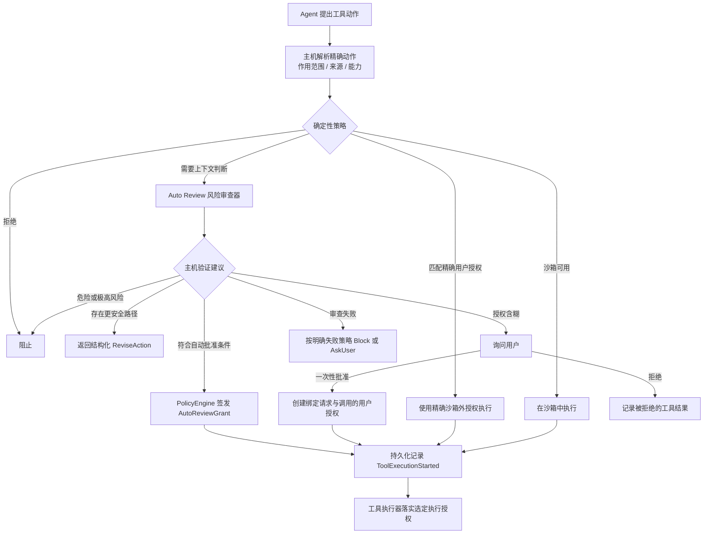

# Auto 审查：产品语义、系统边界与演进

> 文档所有权：本文件是 Auto Review 跨 crate 风险判断语义和演进方向的权威文档。
>
> 文档状态：当前架构 + 明确的未来演进。

## 快速理解

Auto Review 只在确定性规则无法独立判断时提供风险建议；它不能覆盖安全规则，也不能自行签发
执行授权。

| 用户或开发者会遇到的情况 | 系统行为 | 最终责任方 |
| --- | --- | --- |
| 动作明确安全且沙箱足够 | 直接选择受限执行，不调用风险审查器 | 权限策略 |
| 动作命中确定性禁止规则 | 直接阻止，模型不能覆盖 | 权限策略 |
| 风险依赖用户意图和目标范围 | 请求 Auto Review 给出批准、修改、询问或拒绝建议 | 风险审查器给建议，策略引擎作决定 |
| 建议不完整、越权或解析失败 | 失败即关闭，转为阻止或询问用户 | 策略引擎 |
| 沙箱报告结构化能力不足 | 只有确认未产生副作用且可安全重试时才重新审查 | Core 与权限策略 |
| 动作已开始但结果未知 | 不自动重放或提权重试 | Core 恢复逻辑 |

## 1. 决策摘要

Zeta 把 Auto Review 定义为“受确定性策略约束的风险审查建议层”，而不是第二套权限系统。

核心决策：

- 主机先解析精确动作、来源、最小能力和沙箱兼容性；
- 内置安全策略 `BuiltInSafetyPolicy` 的确定性拒绝和强制沙箱规则优先于用户授权列表
  `UserAllowlist`，两者都优先于 LLM；
- `UserAllowlist` 只接受绑定动作摘要、完整能力集合与策略版本的精确沙箱外授权，不接受工具名称
  或命令前缀；
- 风险审查器只给出批准 `Approve`、修改动作 `ReviseAction`、询问用户 `AskUser` 或拒绝 `Deny`
  四种建议；
- 策略引擎 `PolicyEngine` 是唯一把建议转成执行决定并签发授权的责任方；
- 自动授权绑定审查结论、动作摘要、完整能力集合和策略版本；
- 用户意图与证据必须带有明确的信任边界，仓库、工具和 Agent 内容默认不可信；
- 审查失败必须失败即关闭；
- 工具跨过副作用边界前必须持久化记录执行授权；
- 已开始但结果未知的动作不得由风险审查器自动重放；
- 确认且可安全重放的沙箱拒绝可以携带结构化执行证据回到风险审查器；普通命令失败、
  部分副作用可能发生或结果未知时不得自动提权重跑。

这套设计追求的不是“尽量少弹窗”，而是在危险自动批准率接近零的前提下，减少可确定安全场景的
无效打断。

## 2. 产品问题

纯沙箱模式无法覆盖所有真实 Agent 动作：

- 某些工作需要网络访问、外部服务修改、凭证或 UI 能力；
- 某些工具本身不适用本地进程沙箱；
- 用户经常明确请求一个有副作用但合理的动作；
- 动作的安全性依赖用户意图、目标作用范围、来源和上下文，而不只依赖工具名称。

只使用静态授权列表会过度阻塞；把权限直接交给 LLM 又不可接受。Auto Review 位于两者之间：
用模型理解上下文和风险，用确定性策略保留最终授权权。

Auto Review 不解决：

- 工具是否正确实现操作系统强制执行；
- 凭证是否可用；
- 外部服务是否接受请求；
- 动作执行后的业务成功与否；
- 已开始动作的严格单次执行保证；
- 用户组织的完整策略语言。

## 3. 系统所有权

| 组件 | 拥有 | 不拥有 |
| --- | --- | --- |
| 工具主机 | 精确解析动作、来源、最小能力和审查证据 | 最终策略决定 |
| `zeta-policy` | 规则、授权、风险审查接口、风险与授权门槛和最终决定 | LLM 提示词与模型提供方 |
| `zeta-auto-review` | 审查提示词、严格响应和审查结论绑定 | 签发授权、执行工具、批准界面 |
| App Server | 配置安全点、审查模型解析和模型提供方适配器 | 审查建议的授权语义 |
| Core | 工具调度、类型化批准、持久化执行起点与提权、安全重试门槛、恢复和拒绝断路器 | 模型风险判断、操作系统沙箱 |
| 工具执行器与沙箱 | 执行选定授权、返回结构化结果、分类平台拒绝和隔离资源 | 放宽能力或重新解释用户意图 |
| Desktop、CLI 与 TUI | 展示批准和风险信息、收集用户决定 | 自行创建授权 |

关键依赖方向：

```text
工具主机 ──准备完成的动作与证据──► Core
Core ──审查请求──► zeta-policy
zeta-policy ──建议调用──► zeta-auto-review
zeta-auto-review ──模型请求──► App Server 审查适配器
zeta-policy ──最终决定──► Core
Core ──精确执行授权──► 工具执行器与沙箱
```

`zeta-policy` 不能依赖 `zeta-auto-review`。它依赖自己定义的风险审查接口
`ActionClassifier`，因此未来可以替换模型实现、关闭 Auto Review 或增加确定性审查器，而不改变
权限系统的最终授权责任。

## 4. 端到端决策模型

### 4.1 当前：执行前决策



顺序本身是安全契约：

1. 精确确定性规则不得被模型覆盖；
2. 内置强制沙箱规则不得被用户授权列表覆盖；
3. 用户授权必须显式表示沙箱外执行权，不能由普通命令授权列表静默生成；
4. 沙箱能够满足动作时，不需要风险审查器扩权；
5. 风险审查建议必须重新经过主机不变量验证；
6. 授权必须绑定当前动作，而不是绑定工具名称或自然语言摘要；
7. 持久化执行起点必须先于副作用。

### 4.2 当前：沙箱拒绝回流

为了减少沙箱权限不足造成的人工中断，执行前决策后有一条严格受限的失败回流：

```text
沙箱内执行
├─ 成功 → 完成
├─ 普通命令失败 → 返回 Agent
├─ 超时或信号终止 → 返回 Agent
└─ 已确认的沙箱拒绝
   ├─ 可安全重放 → 带拒绝证据重新审查
   └─ 可能已有部分副作用或结果未知 → 不自动重放

重新审查
└─ 风险审查建议 → PolicyEngine 校验
   ├─ 符合 Approve 条件 → 使用精确授权重试
   ├─ ReviseAction → Agent 提出更安全的动作
   ├─ AskUser → 请求用户批准
   └─ Deny → Block
```

这条回流只适用于平台后端能够结构化确认的沙箱强制拒绝。Core 和风险审查器不能从任意标准错误
输出、非零退出码或自然语言猜测沙箱拒绝；Seatbelt 与 Bubblewrap 后端只对各自认识的强制执行或
设置特征产生类型化分类。回流请求必须继续绑定原动作摘要、能力集合、策略版本与工具调用，并携带
长度受限且不含密钥的拒绝证据。

是否自动重试是 Core 的持久化执行决定，不是风险审查建议的隐含效果。如果第一次尝试可能已写入
文件、发出请求或产生其他副作用，即使风险审查器返回批准 `Approve`，Core 也不得自动重放原调用；
它只能记录终止或未知结果，并让 Agent 修改动作或请求用户决定。

`zeta-protocol::SandboxDenialOutput` 保存原因、退出状态、标准输出、标准错误输出、聚合输出和
重放安全性。Core 从中截取最多 500 字符的原因和 2,000 字符的聚合输出给风险审查器；原结构化
拒绝与第二次执行授权一起持久化写入 `ThreadEvent::ToolExecutionEscalated`。第二次执行只允许
一次，不形成循环。

## 5. 风险与用户授权矩阵

风险审查器对批准 `Approve` 同时输出风险等级和用户授权状态。策略引擎 `PolicyEngine` 使用固定
矩阵：

| 风险 | 明确授权 | 隐含授权 | 缺少或含糊 |
| --- | --- | --- | --- |
| 低 | 自动批准 | 自动批准 | 询问用户 `AskUser` |
| 中 | 自动批准 | 自动批准 | 询问用户 `AskUser` |
| 高 | 自动批准 | 询问用户 `AskUser` | 询问用户 `AskUser` |
| 极高 | 阻止 `Block` | 阻止 `Block` | 阻止 `Block` |

这里的“自动批准”仍然要求：

- 建议的能力集合与已解析动作完全一致；
- 审查结论的动作摘要与策略版本精确匹配；
- 策略没有确定性拒绝或强制沙箱冲突；
- Core 在执行前验证授权与当前工具调用的绑定。

矩阵是当前策略，不是永恒产品规则。调整它需要安全评测、用户交互影响分析和策略回归测试，不能
只修改提示词措辞。

## 6. 四种用户可见结果

### `Approve`

表示风险审查器认为精确动作与用户意图相符。它不会直接执行；只有符合上一节矩阵时，策略引擎
`PolicyEngine` 才签发自动审查授权 `AutoReviewGrant`。

用户体验目标：明确、低到可控风险的动作不产生重复确认。

### `ReviseAction`

表示目标可以继续，但当前动作的能力或作用范围过宽。返回值携带最大能力集合
`maximum_capabilities`，父 Agent 必须选择实质上更安全的动作，而不是换一种命令重试同一危险
动作。

用户体验目标：优先产生安全进展，而不是简单拒绝或把所有判断推给用户。

### `AskUser`

用于授权缺失、目标含糊或高风险动作没有明确用户授权。批准请求绑定动作摘要、能力集合和策略
版本；批准只对当前工具调用生效。

用户体验目标：问题应描述具体副作用与作用范围，而不是只显示“需要权限”。

### `Deny`

用于极高风险、破坏性操作、数据外泄、凭证探测或规避策略。拒绝 `Deny` 作为结构化工具失败返回，
要求 Agent 不得通过间接命令或替代工具绕过。

用户体验目标：停止危险路径，同时在可能时允许选择不同的安全目标。

## 7. 上下文、信任与隐私

风险审查器需要理解用户意图，但“更多上下文”并不天然更安全。Zeta 使用证据代理，而不是复制
完整对话记录：

- 用户直接指令标记为可信用户意图；
- 主机解析的动作与来源标记为可信主机元数据；
- Agent 消息、计划、仓库文件和工具结果标记为不可信内容；
- 证据限制条目数和字符数；
- 凭证、密钥和无关工具输出必须在进入风险审查器前移除。

信任标签只说明来源，不能证明内容真实。例如通过可信文件系统适配器读取的 README，内容仍属于
不可信仓库内容。

当前边界：

- Core 选择当前 Turn 最近的用户直接消息；
- 工具主机可提供动作专用、只读且不含密钥的证据；
- 风险审查器没有工具、凭证、修改能力或可变 Agent 记忆；
- 动作与上下文中的提示词注入只能作为数据，不能改变风险审查策略。

未来若引入记忆、组织策略或外部信誉证据，必须定义独立来源和优先级，不能把它们拼成无类型
提示词。

## 8. 失败、重试与恢复原则

Auto Review 的失败模式必须显式：

- 模型不可用、超时、取消、JSON 格式错误和能力不匹配都不能产生授权；
- 主机使用 `ReviewFailurePolicy::Block` 或 `AskUser`，不存在失败即放行；
- 沙箱内进程返回非零退出码，不代表应该自动进行沙箱外重试；
- 只有执行器结构化确认且标记为可安全重试 `SafeToRetry` 的沙箱强制拒绝才能进入二次审查；
- 沙箱拒绝前可能已经完成部分副作用；不能证明可安全重放时，即使获得新授权也不得自动重放原
  工具调用；
- 动作、能力集合、工作目录、环境、来源或策略版本改变后必须重新审查；
- 工具已持久化记录执行开始但没有终止结果时，结果视为未知，不自动重放。

风险审查拒绝会作为结构化反馈返回 Agent。单个 Turn 连续 3 次，或最近 50 个工具结果中累计
10 次审查拒绝，会触发断路器并中断该 Turn。这是为了防止模型通过不断改写命令试探策略边界，
不是限制用户重新发起一个明确的新请求。

## 9. 审计与可观测性

一次可审计的执行至少关联：

- 动作摘要与工具调用标识；
- 策略版本、审查协议版本和审查结论 ID；
- 审查建议与最终决定；
- 匹配的确定性规则、现有授权或用户批准标识；
- 持久化执行授权；
- 沙箱拒绝的原始结构化输出、重放安全性与持久化提权授权；
- 执行是否已开始，以及终止或未知结果。

审查结论 ID 对规范化建议建立稳定身份，因此模型 JSON 的空格变化不会制造新结论；审查协议或
策略语义变化必须使用新版本。

安全指标按优先级排序：

1. 危险动作错误自动批准率；
2. 提示词注入与规避策略通过率；
3. 不必要的询问用户比例；
4. 建议、风险与授权准确率；
5. `ReviseAction` 后安全完成目标的比例；
6. 不同模型与审查协议版本的一致性和漂移。

## 10. 当前实现状态

已经实现：

- 确定性策略优先的 `PolicyEngine` 决策顺序；
- 四种风险审查建议；
- 建议与能力集合两层严格 JSON 解析，以及策略拥有的精确或子集验证；
- 64 KiB 序列化输入上限，以及适配器和风险审查器两层 16 KiB 响应上限；
- 提示词、响应模式与审查协议版本的原子绑定；
- 风险 × 用户授权自动批准矩阵；
- 绑定审查结论的 `AutoReviewGrant` 与绑定工具调用的执行授权；
- 长度受限的用户意图和带信任标签的证据；
- 类型化持久化批准、执行起点标记和未知结果不重放；
- 协议拥有的结构化进程与沙箱结果；
- Seatbelt 与 Bubblewrap 后端专用的拒绝分类；
- 可安全重试的沙箱拒绝二次审查、精确授权、持久化提权与单次重试；
- 可能已有副作用时禁止重放；
- 结构化的安全动作建议、拒绝反馈与单 Turn 断路器；
- App Server 不可变且不带工具的审查模型适配器；
- 合成种子样本集和 Cargo、Bazel 离线契约测试。

当前仍有限：

- 风险审查器是单次模型调用，没有分层审查或多审查器协作；
- 沙箱拒绝分类器覆盖 macOS Seatbelt、Linux Bubblewrap 的已知特征，以及 Windows AppContainer
  辅助程序可信的启动前强制执行标记；真实平台拒绝样本集
  仍不足；
- 沙箱拒绝后的询问用户 `AskUser` 当前终止原工具调用，由 Agent 发起新的批准路径，不在同一个
  已开始调用上建立可恢复的批准等待；
- 提示词策略是编译期常量；
- 没有真实模型基准运行器、影子模式遥测或人工标注流水线；
- 没有组织策略引导；
- 样本集规模小，主要用于证明契约与建立回归入口，不能代表生产分布；
- 没有足够数据支持微调决策。

## 11. 演进方向

### 近期：建立可测量性

- 实现显式模型评测运行器，不进入默认 CI；
- 按模型和审查协议版本输出安全指标；
- 扩充真实缺陷、人工改判和策略回归的匿名合成复现；
- 为错误自动批准设置发布门槛；
- 先运行影子模式，再讨论扩大自动批准覆盖率；
- 用真实平台拒绝样本评估分类器的误报与漏报，并扩展 Windows 后端。

### 中期：提高可控性

- 将私有版本化响应模式导出为评测和工具可消费的产物；
- 增加组织策略引导，并与不可信上下文分层；
- 改善询问原因和 `ReviseAction` 的可执行性评测；
- 增加风险审查器校准与高风险二次检查，但保持确定性授权责任。

### 潜在方向：专用模型

只有在积累足够高质量、经过隐私审查的标签后，才评估：

- 小型专用风险分类器；
- 模型微调；
- 分层模型路由；
- 多风险审查器意见不一致时的升级处理。

训练模型不是评测的前置条件。没有可靠评测集时训练只会把未知错误固化进模型。

## 12. 长期不变量

无论未来使用何种模型或数据，以下边界不变：

- 风险审查器不成为能力授权方；
- 模型输出不能覆盖主机解析的动作标识；
- 不可信内容不能改变风险审查策略；
- 审查失败不产生授权；
- 高风险或极高风险的放宽必须经过确定性策略和可审计版本；
- 未知执行结果不由风险审查器自动重放；
- 凭证和密钥不进入评测样本集或普通审查上下文。

Auto Review 的实现细节、错误语义和修改指南见
[`zeta-auto-review` README](../zeta-rs/auto-review/README.md)；确定性决策引擎与授权实现见
[`zeta-policy` README](../zeta-rs/policy/README.md)。
