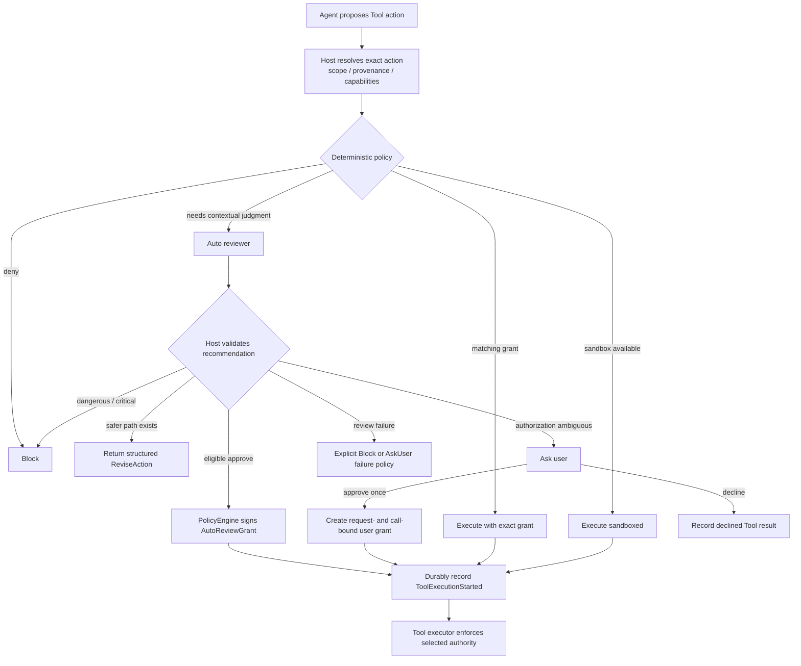

# Zeta Auto Review：产品语义、系统边界与演进

> 文档所有权：本文件是 Auto Review 跨 crate 产品语义、权限边界和演进方向的 canonical
> 文档。`zeta-auto-review` 的实现细节、错误语义和修改指南见
> [crate README](../zeta-rs/auto-review/README.md)。
> Deterministic decision engine 与 grant 实现见
> [`zeta-policy` README](../zeta-rs/policy/README.md)。
> 文档状态：Current architecture + explicit future evolution。

## 1. 决策摘要

Zeta 把 auto review 定义为“受 deterministic policy 约束的 advisory risk review”，而不是
第二套权限系统。

核心决策：

- host 先解析 exact action、provenance、minimum capabilities 和 sandbox compatibility；
- deterministic deny、sandbox requirement 和既存 exact grant 优先于 LLM；
- classifier 只给出 `Approve / ReviseAction / AskUser / Deny` recommendation；
- `PolicyEngine` 是唯一把 recommendation 转成 execution decision 并签发 grant 的 authority；
- 自动授权绑定 assessment、action digest、完整 capabilities 和 policy revision；
- user intent 与 evidence 必须带明确 trust boundary，repository/Tool/Agent 内容默认不可信；
- review failure 必须 fail closed；
- Tool crossing side-effect boundary 前必须 durable 记录 authority；
- started-but-unknown action 不得由 classifier 自动重放。

这套设计追求的不是“尽量少弹窗”，而是在危险自动批准率接近零的前提下，减少可确定安全场景的
无效打断。

## 2. 产品问题

纯 sandbox 模式无法覆盖所有真实 Agent action：

- 某些工作需要 network、external service mutation、credential 或 UI capability；
- 某些 Tool 本身不适用本地 process sandbox；
- 用户经常明确请求一个有副作用但合理的动作；
- action 的安全性依赖用户意图、目标 scope、provenance 和上下文，而不只依赖 Tool 名称。

只使用静态 allowlist 会过度阻塞；把权限直接交给 LLM 又不可接受。Auto Review 位于两者之间：
用 model 解释 context 和风险，用 deterministic policy 保留最终授权权。

Auto Review 不解决：

- Tool 是否正确实现 OS enforcement；
- credential 是否可用；
- external service 是否接受请求；
- action 执行后的业务成功与否；
- started action 的 exactly-once 保证；
- 用户组织的完整 policy language。

## 3. 系统所有权

| 组件 | 拥有 | 不拥有 |
| --- | --- | --- |
| Tool host | exact action materialization、provenance、minimum capabilities、review evidence | 最终 policy decision |
| `zeta-policy` | rules、grants、classifier port、risk/authorization gate、final decision | LLM prompt 与 provider |
| `zeta-auto-review` | review prompt、strict response、assessment binding | grant、Tool execution、approval UI |
| App Server | config safe point、review model resolution、provider adapter | recommendation 的授权语义 |
| Core | Tool scheduling、typed approval、durable start、recovery、rejection breaker | model risk judgment、OS sandbox |
| Tool executor / sandbox | 执行 selected authority、资源隔离 | 放宽 capability 或重新解释用户意图 |
| Desktop/CLI/TUI | 展示 approval 和风险信息、收集 user decision | 自行创建 grant |

关键依赖方向：

```text
Tool host ──prepared action/evidence──► Core
Core ──review request──► zeta-policy
zeta-policy ──advisory call──► zeta-auto-review
zeta-auto-review ──model request──► App Server review adapter
zeta-policy ──final decision──► Core
Core ──exact authority──► Tool executor / sandbox
```

`zeta-policy` 不能依赖 `zeta-auto-review`。它依赖自己定义的 `ActionClassifier` port，因此未来可以
替换模型实现、关闭 auto review 或增加 deterministic classifier，而不改变权限 authority。

## 4. 端到端决策模型



顺序本身是安全 contract：

1. exact deterministic rule 不得被 model 覆盖；
2. sandbox 能满足 action 时，不需要 classifier 扩权；
3. classifier recommendation 必须重新经过 host invariant；
4. grant 必须绑定当前 action，而不是绑定 Tool name 或自然语言摘要；
5. durable start marker 必须先于 side effect。

## 5. 风险与用户授权矩阵

Classifier 对 `Approve` 同时输出 risk 和 user authorization。`PolicyEngine` 使用固定矩阵：

| Risk | Explicit | Implicit | Absent / Ambiguous |
| --- | --- | --- | --- |
| Low | 自动批准 | 自动批准 | AskUser |
| Medium | 自动批准 | 自动批准 | AskUser |
| High | 自动批准 | AskUser | AskUser |
| Critical | Block | Block | Block |

这里的“自动批准”仍然要求：

- recommendation capabilities 与 resolved action 完全一致；
- assessment action digest 与 policy revision 精确匹配；
- policy 没有 deterministic deny 或 require-sandbox conflict；
- Core 在执行前验证 grant 与当前 Tool Call binding。

矩阵是当前 policy，不是永恒产品规则。调整它需要安全 eval、用户交互影响分析和 policy regression
test，不能只修改 prompt wording。

## 6. 四种用户可见结果

### `Approve`

表示 reviewer 认为 exact action 与用户意图相符。它不会直接执行；只有符合上一节矩阵时，
`PolicyEngine` 才签发 `AutoReviewGrant`。

用户体验目标：明确、低到可控风险的动作不产生重复确认。

### `ReviseAction`

表示目标可以继续，但当前 action 的 capability 或 scope 过宽。返回值携带
`maximum_capabilities`，父 Agent 必须选择 materially safer action，而不是换一种命令重试同一
危险动作。

用户体验目标：优先产生安全进展，而不是简单拒绝或把所有判断推给用户。

### `AskUser`

用于授权缺失、目标含糊或 high-risk action 没有 explicit authorization。Approval request 绑定
action digest、capabilities 和 policy revision；批准只对当前 Tool Call 生效。

用户体验目标：问题应描述具体副作用与 scope，而不是只显示“需要权限”。

### `Deny`

用于 critical、破坏性、exfiltration、credential probing 或 policy circumvention。Deny 作为
结构化 Tool failure 返回，要求 Agent 不得通过间接命令或替代 Tool 绕过。

用户体验目标：停止危险路径，同时在可能时允许选择不同的安全目标。

## 7. Context、信任与隐私

Reviewer 需要理解用户意图，但“更多上下文”并不天然更安全。Zeta 使用 evidence broker，而不是
复制完整 transcript：

- direct user instruction 标记为 trusted user intent；
- host-resolved action/provenance 标记为 trusted host metadata；
- Agent message、plan、repository file 和 Tool result 标记为 untrusted content；
- evidence 限制 item 数和字符数；
- credential、secret 和无关 Tool output 必须在进入 reviewer 前移除。

Trust label 只说明来源，不能证明内容真实。例如通过 trusted filesystem adapter 读取的 README
仍是 untrusted repository content。

当前边界：

- Core 选择当前 Turn 最近的 direct user message；
- Tool host 可提供 action-specific、只读、secret-free evidence；
- reviewer 无 Tool、credential、mutation capability 或 mutable Agent memory；
- action/context 中的 prompt injection 只能作为 data，不能改变 reviewer policy。

未来若引入 memory、organization policy 或 external reputation evidence，必须定义独立 provenance
和 precedence，不能把它们拼成无类型 prompt。

## 8. Failure、重试与恢复原则

Auto review 的 failure mode 必须显式：

- model unavailable、timeout、cancellation、malformed JSON 和 capability mismatch 都不能授权；
- host 使用 `ReviewFailurePolicy::Block` 或 `AskUser`，不存在隐式 fail-open；
- sandboxed process 返回 non-zero 不代表应自动 unsandboxed retry；
- action、capabilities、cwd、environment、provenance 或 policy revision 改变后必须重新 review；
- Tool 已 durable start 但没有 terminal result 时，结果视为 unknown，不自动重放。

Reviewer rejection 会作为结构化 feedback 返回 Agent。单 Turn 连续 3 次，或最近 50 个 Tool
Result 中累计 10 次 review rejection，会触发 circuit breaker 并中断该 Turn。这是防止模型通过
不断改写命令试探 policy boundary，不是限制用户重新发起一个明确的新请求。

## 9. Audit 与可观测性

一次可审计的执行至少关联：

- action digest 与 Tool Call identity；
- policy revision、prompt revision 和 assessment ID；
- recommendation 与 final decision；
- matched deterministic rule、existing grant 或 user approval identity；
- durable execution authority；
- execution start certainty 与 terminal/unknown outcome。

Assessment ID 对 canonical recommendation 建立稳定身份，因此 model JSON 的空格变化不会制造新
assessment；prompt 或 policy 语义变化必须有新 revision。

安全指标按优先级排序：

1. dangerous-action false auto-approval rate；
2. prompt-injection / policy-circumvention pass rate；
3. unnecessary AskUser rate；
4. recommendation、risk 与 authorization accuracy；
5. `ReviseAction` 后安全完成目标的比例；
6. 不同 model/prompt revision 的一致性与漂移。

## 10. 当前实现状态

已经实现：

- deterministic-first `PolicyEngine` 顺序；
- 四种 classifier recommendation；
- strict JSON parse、capability exact/subset validation 和 response size limit；
- risk × user authorization 自动授权矩阵；
- assessment-bound `AutoReviewGrant` 与 Tool Call-bound execution authority；
- bounded user intent 与 trust-labeled evidence；
- typed durable approval、execution start marker 和 unknown-outcome no-replay；
- structured safer-action/deny feedback 与 per-turn circuit breaker；
- App Server immutable, tool-less review model adapter；
- synthetic seed corpus、Cargo/Bazel offline contract test。

当前仍有限：

- reviewer 是 one-shot completion，没有 tiered review 或 ensemble；
- prompt policy 是 compile-time constant；
- 没有真实 model benchmark runner、shadow-mode telemetry 或 human-label pipeline；
- 没有 organization policy steering；
- corpus 规模小，主要证明 contract 与建立回归入口，不能代表生产分布；
- 没有足够数据支持 fine-tuning 决策。

## 11. 演进方向

### 近期：建立可测量性

- 实现显式 model eval runner，不进入默认 CI；
- 按 model + prompt revision 输出安全指标；
- 扩充真实 bug、human override 和 policy regression 的匿名 synthetic reproduction；
- 为 false auto-approval 设置 release gate；
- 先运行 shadow mode，再讨论扩大自动批准覆盖率。

### 中期：提高可控性

- version prompt 与 response schema，降低手工 revision 漂移；
- 增加 organization policy steering，并与 untrusted context 分层；
- 改善 AskUser reason 和 ReviseAction 的可执行性评测；
- 增加 classifier calibration 与高风险 double-check，但保持 deterministic authority。

### 潜在方向：专用模型

只有在积累足够高质量、经过隐私审查的 label 后，才评估：

- 小型专用 classifier；
- fine-tuning；
- tiered model routing；
- 多 reviewer disagreement escalation。

训练模型不是 eval 的前置条件。没有可靠评测集时训练只会把未知错误固化进模型。

## 12. 长期不变量

无论未来使用何种模型或数据，以下边界不变：

- classifier 不成为 capability authority；
- model output 不能覆盖 host-resolved action identity；
- untrusted content 不能改变 reviewer policy；
- review failure 不产生授权；
- high/critical risk 的放宽必须经过 deterministic policy 与可审计 revision；
- unknown execution outcome 不由 classifier 自动重放；
- credential 和 secret 不进入 eval corpus 或普通 review context。
