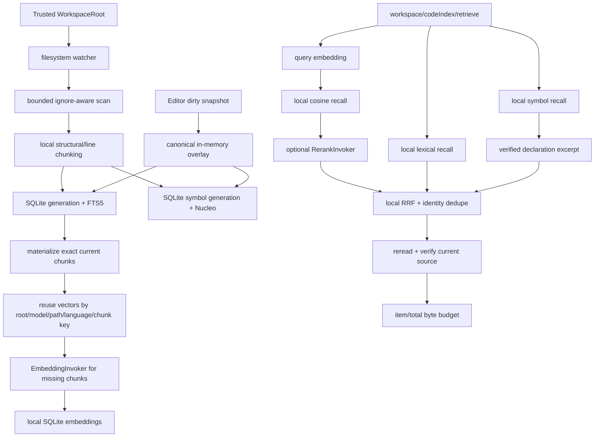

# 工作区代码索引

> 状态：Current。本文 canonical 拥有 CodeIndex 的跨 crate 架构、数据位置、隐私边界与实施状态。
> 具体实现见 [`zeta-code-index`](../zeta-rs/code-index/README.md)、
> [`zeta-code-index-semantic`](../zeta-rs/code-index-semantic/README.md)、
> [`zeta-code-retrieval`](../zeta-rs/code-retrieval/README.md)；可选远端 provider 控制面见
> [`zeta-code-index-cloud`](../zeta-rs/code-index-cloud/README.md)。编辑器语法、Language Server、本地符号
> 索引与未来代码图的跨系统边界和开发顺序由 [`code-intelligence.md`](code-intelligence.md) canonical
> 维护。

## 快速理解

Zeta 采用 local-first：本地扫描与切块、本地 SQLite/FTS、本地向量存储、本地 recall/fusion/final
ordering。`zeta-model-provider` 只接入 embedding/rerank 模型；它不决定 chunks、候选、排序或存储。

| 环节 | 执行位置 | 当前状态 |
| --- | --- | --- |
| scan、ignore、chunk、revision identity | Workspace 本地 | ✅ |
| lexical SQLite/FTS | 本地 | ✅ |
| syntax symbol projection + fuzzy search | 本地 `zeta-symbol-index` | ✅；持久磁盘 projection + ephemeral dirty overlay |
| embedding/rerank API 调用 | model adapter；模型可本地或远程 | ✅ OpenAI-compatible embedding/rerank；OpenAI/Ollama embedding |
| embedding persistence、vector recall、rerank 分数解释与来源内排序 | 本地 `zeta-code-index-semantic` | ✅；自适应 exact/SimHash ANN |
| symbol/lexical/semantic/optional remote fusion、复核与预算 | 本地 `zeta-code-retrieval` | ✅ |
| 远端托管 code-index | 独立 provider | 可选 contract ✅；concrete provider 尚未完成 |
| Agent 检索消费 | App Server + Core consumer | ✅ `search_code`；可选 first-invocation 自动 evidence |

因此，Zeta 当前不是“把源码上传给自建服务器再让服务器完成整个 RAG”。默认 semantic selection 为
disabled，只运行 local symbol + lexical。用户配置 exact provider/model 并授权当前 Workspace 后，Zeta 才把模型当作
计算 API 调用；向量数据库和检索编排仍在本地。若 endpoint 位于远端，相应 chunk/query/candidate 文本
会外发给模型。

## 为什么这样分

| 方案 | 优点 | 代价 | Zeta 选择 |
| --- | --- | --- | --- |
| 全本地模型 + 本地检索 | 最强隐私、离线 | 模型质量和硬件受限 | ✅ Ollama embedding；rerank 需兼容 endpoint |
| 远程模型 + 本地检索 | 模型效果好；索引、召回与排序规则仍可控 | embedding/rerank 文本会外发 | ✅ 主要目标形态，需 consent |
| 托管远端 code-index | 多设备复用、服务端可上 ANN | 需上传 chunks、租户与删除控制面 | 可选 provider，不是默认 |
| 整文件上传后云端重新切块 | 服务端自主 | 外发面大，复制 Workspace authority，stale 难验证 | ❌ |
| PostgreSQL 作为本地统一数据库 | 与服务器技术栈统一 | 要求 daemon/账号/端口，桌面生命周期复杂 | ❌；本地用 SQLite |

SQLite 是嵌入式本地 projection；PostgreSQL/pgvector 只可能属于未来独立远端服务仓库。Zeta 仓库保留
typed provider port、consent 和 exact chunk identity，不拥有某个云部署的数据库、migration 或运维。

## 本地端到端路径

App Server 先注册 watcher，再把 scan/reconcile 投递给独立 refresh worker。lexical generation 成功更新后，
worker 同步 symbol 与 semantic projection。新 generation 采用 transaction 发布；同步完成前查询不会
把旧 semantic generation 冒充当前结果，而是明确降级为 symbol/lexical。Editor dirty snapshot 由同一
CodeIndex overlay 作为 current text authority；同路径磁盘 symbol/chunk 及 semantic/cloud candidate
全部被抑制，直到磁盘 content hash 对齐后 handoff。

重建并不等于重新调用所有 embedding。semantic store 使用 root、model ID、relative path、language 与
稳定 chunk key 匹配可复用向量；只计算新增或变化的 chunks，再原子替换当前 generation。模型 ID 变化会
使全部旧向量失效。

## 职责边界

| 能力 | Owner | 判断 |
| --- | --- | --- |
| filesystem scan、ignore、chunk、source revision 与 lexical FTS | `zeta-code-index` | ✅ 本地 authority |
| verified declaration projection 与 fuzzy symbol ranking | `zeta-symbol-index` | ✅；不自主扫描 Workspace |
| embedding/rerank 请求与响应 transport | `zeta-model-provider` | ✅ adapter contract；不排序 |
| 模型输入准备、embedding cache、vector recall、rerank 时机/分数解释/排序 | `zeta-code-index-semantic` | ✅ 本地 orchestration |
| 多来源 RRF、dedupe、current-source verification、content budget | `zeta-code-retrieval` | ✅ |
| root trust、watcher、model/provider injection、profile paths、RPC | App Server | ✅ |
| remote publication grant/query/delete lifecycle | `zeta-code-index-cloud` | 可选 |
| remote vector DB、tenant auth、endpoint 与 retention | 独立服务/provider 项目 | ❌ 不属于 Zeta |
| settings endpoint/model 与 Workspace consent/revoke | 产品 UI + App Server policy | ✅；含本地 progress/cancel/retry；远端 retention audit 仍属 cloud provider |

关键不变量：model provider 只“调用模型并返回有序向量/分数”。把文本变成哪些 model documents、向量
如何持久化、候选如何召回、rerank 分数如何解释以及最终如何排序，都由 code-index domain owner 决定。

## 数据与 consent

| 模式 | 可能离开设备的数据 | 必须满足 |
| --- | --- | --- |
| lexical only | 无 | 默认可用 |
| local model semantic | 无 | host 安装本地 invoker |
| remote embedding | exact chunk 文本、query 文本 | 明示源码外发 consent、destination/model、scope、删除/retention 说明 |
| remote rerank | query + recalled candidate 文本 | 同上；UI 需单独说明 rerank 外发 |
| remote code-index provider | grant scope 内的 verified chunks | durable `CloudCodeIndexGrant`、byte ceiling、幂等 grant deletion |

Desktop Settings 可以保存 Ollama 或 unauthenticated OpenAI-compatible endpoint、选择 embedding/optional
rerank 模型，并对 active Workspace 单独授权或撤销。授权精确绑定 Workspace、模型和对应 provider
配置；模型或 base URL 变化后旧授权立即失效，语义 runtime 被卸载。普通聊天模型配置不会自动授权
后台索引源码。当前 UI 尚未提供 chunk/byte 预览、同步进度或远端 retention 证明。

远端托管 code-index 使用另一套 durable grant：`provider/tenant/collection`、path selection、最大 source
bytes 与稳定 grant ID。`authorize` 只持久化 permission；`sync` 才 materialize 并发送。`revoke` 先保存
`Revoking`，provider 完成 grant 级幂等删除后才清除本地 pending state。该 provider 的实际数据库与
endpoint 不在本仓库。

## App Server 与持久化

canonical 本地协议：

- `workspace/codeIndex/status {}`；
- `workspace/codeIndex/search { query, maxResults }`：纯 lexical 诊断；
- `workspace/codeIndex/retrieve { query, maxResults }`：symbol + lexical + 可用 semantic/remote sources；
- `workspace/codeIndex/rebuild {}`；
- `workspace/symbolIndex/status {}` 与 `workspace/symbolIndex/search { query, maxResults }`；
- `workspace/codeIntelligence/document/synchronize|close`：同步/释放 ephemeral dirty overlay。

`retrieve` origin 明确区分 `localSymbol`、`localLexical`、`localSemantic` 和 `cloudSemantic`。symbol、
local semantic 或 remote source 失败不会吞掉 FTS，而会返回独立的
`localSymbolQueryFailed`、`localSemanticQueryFailed` 或 `cloudQueryFailed` degradation。

| projection | 默认路径 | 内容 |
| --- | --- | --- |
| lexical | `<profile>/cache/workspaces/<root-digest>/indexes/lexical/index.sqlite3` | chunks、generation、FTS |
| symbols | `<profile>/cache/workspaces/<root-digest>/indexes/symbols/index.sqlite3` | source revisions、syntax declarations、generation；dirty overlay 不持久化 |
| local semantic | `<profile>/cache/workspaces/<root-digest>/indexes/semantic/index.sqlite3` | chunks、model ID、embeddings |
| remote control state | `<profile>/code-index-cloud/<root-digest>.sqlite3` | grant/phase/generation metadata；不保存源码/secret |

Unix persistent files 固定为普通文件和 `0600`。lexical/semantic 都是可重建 projection，不提升为源码
authority。restricted Workspace 可继续 lexical；当前 semantic invoker 和 remote controller 只在 Trusted
Workspace 安装。

四类本地索引以项目摘要为单位长期保存，不记录最近使用时间，也不做 TTL、LRU 或容量驱动的后台删除。
项目路径消失或信任记录变化不会自动删除索引；调用方需要显式调用单项目或全局清理入口。跨进程生命周期锁位于
`<profile>/cache/locks`，不放进可删除的索引目录；云端授权与删除状态仍留在 durable profile state。

## 一致性与安全

- SQLite publication 使用 transaction；读者只看到完整 generation。
- symbol、lexical、semantic 和 remote candidates 都只是 references；返回前必须从 Workspace 重读并验证
  root、revision、chunk key、range、line span 与 content hash。
- dirty overlay 是 Editor-authorized current source projection；同 revision 不同内容会被拒绝，close、
  Workspace replacement 或 content-hash handoff 会清理它，且它不会触发每次按键 remote embedding。
- full scan 默认排除 hidden files，读取 Git ignore，并硬排除 `.git`、`.zeta`、`node_modules`、`target`。
- 文件读取权限不等于网络 egress consent；默认 provider/model registry 为空。
- OpenAI API-key semantic 调用要求 host 注入 `SecretStore`；Desktop 尚无持久化 API-key 管理 UI，因此
  当前产品闭环面向 Ollama 或 unauthenticated OpenAI-compatible endpoint。
- semantic model 或 chunker 语义变化必须换 model/chunker identity，使不兼容 cache 显式失效。

## 当前状态与下一步

| 阶段 | 状态 | 内容 |
| --- | --- | --- |
| 本地 lexical | ✅ Current | scan、chunk、stable identity、SQLite generation、FTS5、watcher |
| 本地 semantic domain | ✅ Current | SQLite vectors、增量复用、embedding batches、cosine recall、optional rerank |
| local symbol index | ✅ Current | syntax extraction、SQLite reuse、Nucleo fuzzy、App Server RPC、Desktop staged provider |
| retrieval RPC | ✅ Current | 四来源 origin、RRF、dedupe、fallback、verification、byte budget |
| App Server composition | ✅ Current | durable selection/consent、trusted-only runtime、config rebind、background sync |
| concrete embedding/rerank adapter | 部分具备 | OpenAI-compatible embedding/rerank、OpenAI/Ollama embedding；调用支持 cancellation/retry；持久化 credential UI 仍待补 |
| semantic consent UI | 部分具备 | endpoint/model disclosure、exact Workspace scope、authorize/revoke、progress/cancel/retry；远端 retention audit 仍待 cloud provider |
| scalable local ANN | ✅ Current | ≥2,048 chunks 使用 rebuildable SimHash candidates + exact cosine；异常自动 brute-force |
| optional hosted provider | 尚未完成 | concrete endpoint、tenant auth、server DB、retention/deletion receipt |
| Agent consumer | ✅ Current | 显式只读 `search_code`；可选 first-invocation 自动 evidence，默认关闭、预算受限且标记 untrusted |
| Editor unsaved overlay | ✅ Current | canonical in-memory lexical/symbol projection、dirty suppression、save handoff |

接下来的优先级是 secure credential 产品接入、ANN 召回/延迟实测与远端 retention audit。远端托管 provider
与 PostgreSQL/pgvector 不应阻塞本地主路径。
