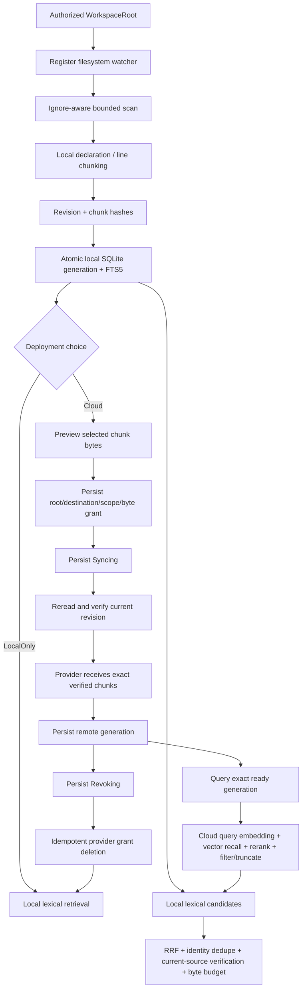

# 工作区代码索引

> 状态：Current。本文 canonical 拥有代码索引的跨 crate 架构、两种部署选择、隐私边界与产品状态。
> 本地实现见 [`zeta-code-index` README](../zeta-rs/code-index/README.md)，云 grant/provider contract
> 见 [`zeta-code-index-cloud` README](../zeta-rs/code-index-cloud/README.md)，召回编排见
> [`zeta-code-retrieval` README](../zeta-rs/code-retrieval/README.md)，App Server 适配见
> [`zeta-rs/app-server/README.md`](../zeta-rs/app-server/README.md)，云端语义管线见
> [`zeta-code-index-service` README](../zeta-rs/code-index-service/README.md)。

## 快速理解

Zeta 只有两种部署选择，默认始终是 `LocalOnly`。启用 `Cloud` 只把 Workspace 已切好、已复核的
chunks 发布给远端；文件扫描、ignore、读取、切块、revision 与 chunk identity 始终留在 Workspace
authority。云能力不会从文件权限自动推导，必须通过独立、持久、可撤销的 source-egress grant 启用。

| 用户选择 | 切块位置 | 外发内容 | 当前状态 |
| --- | --- | --- | --- |
| `LocalOnly` | Workspace host 本地 | 无 | ✅ 默认；本地 SQLite/FTS 已接入 App Server |
| `Cloud` | Workspace host 本地 | revision-verified exact chunks | publish/query/retrieval contract 已实现；concrete provider 尚未接入 |

这个边界保留“文件事实与切块靠近 Workspace”的隐私和一致性优势，同时允许远端独立演进
embedding、向量索引、rerank 与服务端排序。远端服务管理的是语义索引，不是 Workspace 源码生命周期。

默认 local composition 的 provider registry 为空，因此 `initialize.capabilities.cloudCodeIndex` 为
`false`，不会创建任何云网络请求。只有 host 注入满足删除保证的 concrete provider 后，云 RPC 才
可用；当前仓库实现的是安全控制面和适配边界，不是已上线的云服务。

## 为什么只允许 Workspace 切块

| 方案 | 优点 | 成本 / 风险 | Zeta 判断 |
| --- | --- | --- | --- |
| 本地切块 + 本地 lexical | 离线、最小外发、易验证 stale | 没有 dense semantic recall | ✅ 默认基线 |
| Workspace 切块 + 云 embedding/vector | 外发粒度小，复用稳定 chunk identity，云结果可精确复核 | chunker version 与远端 vector schema 需要显式协同升级 | ✅ 唯一云路径 |
| 整文件 + 云端重新切块 | provider 可独立改 chunk boundary | 复制 Workspace 操作、扩大外发面、云候选难以证明来自当前 generation | ❌ |
| Renderer / Native 自行切块 | 接 UI 快 | 复制 ignore/watcher/runtime，破坏共享 backend ownership | ❌ |

一个 Workspace 同时只能存在一个 grant；切换 provider、tenant、collection、path scope 或 byte ceiling
时必须先 revoke 再重新 authorize，不能静默扩大原 consent。

## 端到端流程

初始本地顺序不能交换：host 先注册 watcher，再把 full scan 投递到独立 refresh worker。Watcher event
只是“可能变化”的 invalidation hint；runtime 会重新读取路径，并在 ignore、目录或容量语义不确定时
完整重建。云 preview 和 sync 都消费一份原子 local generation；publication 前再次读取 source 并
验证 revision/range/hash，旧 manifest 不会被当作当前源码上传。

## Egress consent 怎么做

客户端先调用无副作用 `preview`，展示文件数、chunk 数、上传单元数、当前 generation 的精确
source-content bytes，以及 proposed byte ceiling 是否足够。该数字不包含 provider serialization
或 transport metadata overhead；provider adapter 还必须独立限制实际 request size。preview 不保存
consent，也不触网。

用户确认后保存 `CloudCodeIndexGrant`：

| Grant 字段 | 约束 | 目的 |
| --- | --- | --- |
| `grantId` | 稳定、非空 | 远端 object 与删除边界 |
| `rootId` | server 从 active controller 绑定，客户端不能选择 | 防止授权跨 Workspace 复用 |
| `provider/tenant/collection` | 每次 grant 固定 | 防止静默换租户或远端 namespace |
| `selection` | `entireIndex` 或规范化相对 path prefixes | 明确哪些源码可外发 |
| `maxEgressBytes` | 非零；限制 source-content bytes；authorize 和每次 sync 重检 | source 变化后也不能突破用户上限 |

`authorize` 只建立 durable permission，不上传；`sync` 才 materialize 并调用 provider。若新 generation
超出上限、source revision 改变，或 provider 不承诺幂等删除，operation fail
closed。local generation 尚未首次发布时返回 `CodeIndexNotReady`，不会创建“空但 ready”的远端
index。完全相同的 grant 可幂等 authorize；不同 grant 返回 consent conflict。

## 删除与信任撤销怎么做

provider 必须把 grant ID 作为完整 remote deletion domain，并保证重复 `delete_grant` 安全成功；
删除范围包含该 grant 创建的 files、chunks、vectors 和 metadata。

撤销顺序是：

1. 本地先持久化 `Revoking`，防止崩溃后忘记待删除授权；
2. 调用 provider 的幂等 grant deletion；
3. 只有 provider 确认成功后，才清空 grant 并回到 `LocalOnly`；
4. 失败时保留 `Revoking`，重启后继续用同一 grant 重试，不恢复 sync；
5. Workspace 从 Trusted 降为 Restricted 时自动走同一撤销流程，并移除 cloud controller。即使远端
   删除暂时失败，受限 Workspace 也不再具备外发能力；后续受限 activation 会重试 pending deletion。

当前 durable state 是删除控制状态，不是删除审计证明。若产品需要合规 receipt、远端 retention
deadline 或管理员强制删除，需要 concrete provider contract 再增加可验证 receipt，而不是把
`delete_grant` 的返回值描述成法律层面的证明。

## 所有权

| 能力 | Owner | 当前状态 |
| --- | --- | --- |
| 文件扫描、ignore、chunk/revision identity、SQLite/FTS、materialization | `zeta-code-index` | ✅ |
| cloud grant、preview、provider port、publication/query/deletion lifecycle | `zeta-code-index-cloud` | ✅ |
| local/cloud fan-out、RRF、identity dedupe、fallback、context byte budget | `zeta-code-retrieval` | ✅ |
| query 准备、embedding、vector recall、rerank、云候选排序/过滤/截断 | `zeta-code-index-service` | ✅ provider-neutral pipeline；缺 production adapters |
| grammar、declaration ranges | `zeta-syntax` | ✅ 被索引消费，不拥有 workspace lifecycle |
| root trust、profile DB placement、watcher、provider injection、RPC state | App Server workspace runtime | ✅ |
| local/cloud DTO、schema、TypeScript binding | `zeta-app-server-protocol` | ✅ |
| embedding/rerank 模型 API 适配与调用 | `zeta-model-provider` | 部分具备：canonical invoker 已完成；concrete codec/runtime 尚未接入 |
| concrete vector cloud transport adapter | App Server integration + `zeta-api` / `zeta-client` | 尚未完成 |
| Agent Tool/context 自动消费 retrieval RPC | Core/App Server Agent integration | 尚未完成 |
| Editor 未保存 buffer overlay | Editor vertical | 尚未完成 |

`zeta-code-index` 和 `zeta-code-index-cloud` 位于共享 Rust backend。Native 已进入迁移期，不能新增
另一套 index registry、network client、timer、chunker 或 consent owner。

## App Server 协议与持久化

本地能力：

- `workspace/codeIndex/status {}`；
- `workspace/codeIndex/search { query, maxResults }`；
- `workspace/codeIndex/retrieve { query, maxResults }`；
- `workspace/codeIndex/rebuild {}`。

`search` 保持纯本地 lexical 诊断接口；`retrieve` 才是 canonical 召回接口。后者在未启用云能力时
只查本地；在已授权云 generation 可用时纳入云端已排序 candidates，用 RRF 做跨来源合并、按 revision-bound
chunk identity 去重，再从 Workspace 重读并复核完整 chunk identity。云查询失败不会丢掉本地结果，
而是返回显式 degradation；单条与总 content bytes 都受预算限制。

host 注入 provider 后额外广告 `capabilities.cloudCodeIndex` 并提供下列协议；实际 controller 仍只在
Trusted Workspace 安装：

- `workspace/codeIndex/cloud/status {}`；
- `workspace/codeIndex/cloud/preview { selection, maxEgressBytes }`；
- `workspace/codeIndex/cloud/authorize { grant }`；
- `workspace/codeIndex/cloud/sync {}`；
- `workspace/codeIndex/cloud/revoke {}`。

local index 位于 `<profile>/code-index/<root-digest>.sqlite3`；cloud grant/state 位于
`<profile>/code-index-cloud/<root-digest>.sqlite3`。两者 Unix 权限都是 `0600`。local projection
保存可重建原文 chunks；cloud state 只保存 consent、phase 和 generation metadata，不保存源码或
credential。restricted Workspace 可以继续本地索引，但不会安装 cloud controller。

默认 local scan 最多 50,000 files、单文件 4 MiB、总 source 512 MiB；chunk 目标 8 KiB、hard
limit 12 KiB、单文件最多 2,048 chunks。grant byte ceiling 是附加上限，不替代这些读取上限。

## 一致性、失败与安全边界

- SQLite publication 使用 transaction；读者只看到完整旧 generation 或完整新 generation。
- local FTS hit、cloud manifest 与 cloud query candidate 都不是直接 content authority；消费前重读并
  验证 source revision、byte/line range、content hash、chunk key 与 chunker version。云端返回不在当前
  Workspace manifest 中的 reference 时拒绝整个 provider result。
- full scan 默认排除 hidden files，读取 Git ignore，并硬排除 `.git`、`.zeta`、`node_modules`、
  `target`；云 selection 只能缩小这份集合，不能把被 ignore 文件加回来。
- local file permission 不等于 network egress consent；provider registry 为空时 cloud capability 为
  false。
- provider adapter 必须拥有 credential、proxy/TLS、tenant isolation、request limit 与日志脱敏；
  grant/state 不记录正文、secret 或 provider response body。
- local generation 变化后 remote status 为 `Stale`；显式 sync 成功前不得把旧 remote generation
  描述为 current。

## 当前实现、计划与长期不变量

| 阶段 | 状态 | 内容 |
| --- | --- | --- |
| 本地索引基础 | ✅ Current | scan、chunks、stable hashes、SQLite generation、FTS5 |
| Workspace lifecycle | ✅ Current | initial build、watcher reconcile、root switch、persistent reopen |
| 云安全控制面 | ✅ Current | chunk-only preview、durable grant、byte/scope gate、revoke recovery |
| App Server contract | ✅ Current | local + cloud capabilities/RPC、schema/types、trust-revocation hook |
| 召回编排 | ✅ Current | local/cloud candidate fan-out、RRF、dedupe、fallback、verification、byte budget |
| 云端语义 pipeline | ✅ Current | Workspace chunks → embedding → vector recall → optional rerank → final order |
| concrete 云 provider | 尚未完成 | credential/network adapter、production vector store、embedding/rerank codec/runtime、remote endpoint |
| 产品设置与 consent UI | 尚未完成 | cloud toggle、preview copy、progress、deletion retry/audit |
| Agent context consumer | 尚未完成 | retrieval RPC → Agent Tool/context assembly；不再做云候选 rerank |

当前 cloud sync 是同步显式 operation，没有 background debounce、progress、cancellation 或 retry
scheduler；没有 provider 时不可调用。local full rebuild 也尚无 cancellation checkpoint，workspace
retirement 会等待正在运行的 scan 完成。

单纯切换到另一个 Workspace 不等于撤销原 root 的 durable grant；远端数据保留到显式 revoke。
inactive root 的 trust 变化目前没有全局后台 grant catalog，下一次以 Restricted 状态 activation 时才
重试删除；要求立即删除时，产品必须在离开 root 前调用 cloud revoke。这是 concrete provider 上线前
仍需补齐的后台控制面。

长期不变量：

- 默认 `LocalOnly`，文件权限不隐式授予网络外发；
- 扫描、ignore、读取、切块、revision verification 与 chunk identity 始终在 Workspace authority 一侧执行；
- 云端只接收 Workspace 当前 generation 中 grant 范围内的复核 chunks，不能接收整文件后重新切块；
- 云端 CodeIndex 拥有 embedding/vector recall/rerank 编排与云候选最终排序；
- `zeta-code-retrieval` 只保留来源内顺序并执行跨来源融合，不解释模型原始分数；
- destination、scope 或 byte ceiling 变化必须建立新 grant；
- remote object 必须按 grant 可幂等删除，删除成功前不丢弃 pending state；
- 产品 host 不复制共享 index/consent runtime，Native 不成为新 owner。
