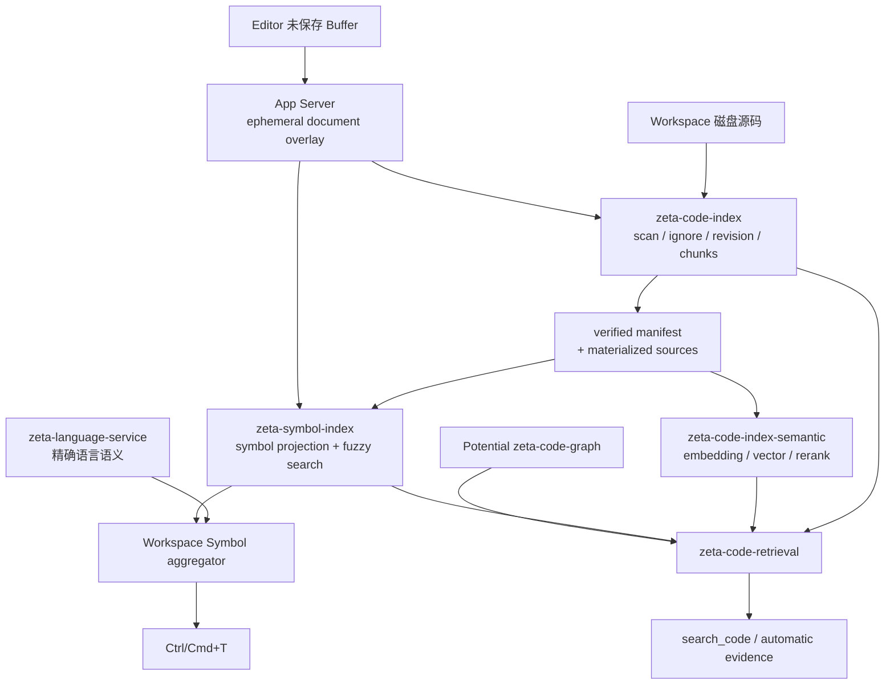

# 代码知识系统：边界、现状与演进

> 类型：设计。状态：Current implementation + gated roadmap。本文 canonical 拥有编辑器语法事实、
> Language Server、工作区符号索引、代码检索与未来代码图之间的跨系统边界，以及已完成纵向链路
> 和仍需证据才能启动的阶段。
> 当前检索实现见 [`code-index.md`](code-index.md)，编辑器语法能力见
> [`syntax-analysis.md`](syntax-analysis.md)，精确语言语义见 [`lsp.md`](lsp.md)。各 crate 的内部接口
> 继续由对应 README 拥有；本文不复制其实现细节。

## 快速理解

Zeta 不用一个巨型数据库同时冒充语法树、语言服务器、搜索索引和 AI 上下文。当前系统已经具备
增量语法事实、完整 LSP 请求链路、本地持久化符号索引、未保存 Buffer 覆盖层、本地优先的代码
检索，以及符号感知的精确声明候选。它们共享 Workspace source identity，但分别拥有 freshness、
失败与排序语义。跨语言代码图和 navigation cache 仍未建立：前者缺少 compiler/SCIP/resolver
事实来源，后者要先由已安装的请求指标证明收益。

| 用户场景 | 当前行为 | 目标行为 | 状态 |
| --- | --- | --- | --- |
| 在工作区按名称找符号 | 本地索引先返回；Language Server 并发补充；结果分阶段、确定性融合 | 维持并测量现有行为 | Current |
| Language Server 未启动时找符号 | 支持 grammar 的语言仍可搜索语法声明 | 扩展语言只需增加可信 syntax facts | Current |
| AI 搜索相关代码 | 本地 symbol + FTS + 可选 vector/remote，融合后由 Workspace 复核正文 | 有强证据图来源后再增加有界 graph expansion | Current + gated |
| 搜索未保存代码 | 同一路径的磁盘 symbol、lexical、semantic、cloud 候选被 overlay 抑制 | 维持 save handoff 与 current-text invariant | Current |
| 查定义、引用和层级 | revision-bound LSP 请求，记录冷暖延迟、结果数、取消与 stale outcome | 指标证明重复成本后才评审会话缓存 | Current + gated |
| 跨语言导航 | 没有统一语义图或 resolver | 先接入有精确证据的 schema/generated-code 边，再评审启发式边 | Potential |
| 结构化编辑 | Smart Select 按当前 revision/selection 请求有限 parser scopes，并保留 lexical fallback/shrink history | 继续增加 select declaration，之后才评审原子 mutation plan | 部分 Current |

继续阅读：[当前基线](#1-当前基线)、[目标架构](#2-目标架构)、[数据与失效](#4-数据身份与失效)、
[阶段计划](#8-阶段计划)、[验收门](#9-测试性能与验收门)。

## 1. 当前基线

截至本文建立时，仓库中的真实能力如下。未来阶段不得写成当前事实。

| 能力 | 当前 owner | 当前状态 |
| --- | --- | --- |
| 单文档增量 parse、token、fold、document symbol、parse diagnostic | `zeta-syntax` | Current |
| 打开文档的文本、selection、undo/redo 与 Editor revision | Aster / `zeta-editor` | Current |
| completion、definition、references、hierarchy、workspace symbol 等精确语义 | `zeta-language-service` + `zeta-lsp` | Current |
| Workspace scan、ignore、结构辅助切块、source/chunk identity、SQLite FTS | `zeta-code-index` | Current |
| embedding cache、vector recall、optional rerank | `zeta-code-index-semantic` | Current |
| lexical/semantic/optional remote 融合、源码复核与 byte budget | `zeta-code-retrieval` | Current |
| `search_code` 与可选 first-invocation evidence | App Server + Core | Current |
| 持久化本地 symbol projection、overlay symbol 与 fuzzy matcher | `zeta-symbol-index` | Current |
| CodeIndex 未保存 Buffer overlay、dirty suppression 与 save handoff | `zeta-code-index` + App Server | Current |
| Workspace Symbol staged aggregation、取消、dedupe 与 accept-time hash verification | Desktop | Current |
| 语言请求取消与隐私安全指标 | `zeta-language-service` + App Server sink | Current |
| references/navigation semantic cache | 无 | 未安装；等待指标门禁 |
| SCIP、occurrence/edge graph 与跨语言 resolver | 无 | 尚未完成 |
| revision-bound structural selection scopes + Smart Select | `zeta-syntax` + Aster | Current；mutation 尚未完成 |

当前 `zeta-code-index` 的 `ChunkReference` 仍只表达 root、path、source revision、chunk key、content
hash 和范围；`zeta-symbol-index` 单独保存 name、kind 与声明/选择范围。两者通过 source identity 与
verified excerpt 交汇，而不是共享存储。当前系统仍不保存 occurrence 或 edge，因此“代码索引/RAG”、
“符号索引”和“代码图”是相邻能力，不是一个数据库的不同表名。

### 1.1 与统一 Code Intelligence Store / FileShard 方案的差异

外部方案对能力分类是对的，但其“一份 `FileShard` 写入一个 Store，再由所有功能读取”的实现不适合
当前 Zeta。这里采用共享 authority/identity、分离 projection/runtime：

| 设计点 | 统一 Store / FileShard 方案 | Zeta 当前选择 | 结论 |
| --- | --- | --- | --- |
| 持久化 | files/symbols/occurrences/edges/chunks/cache 共用一个 SQLite | lexical、symbol、semantic、cloud control 各自持有可删除 projection | failure、schema、retention 与权限不同，不合库 |
| 文件事实 | parser/LSP/SCIP 合成一个 immutable shard | `CodeIndexManifest` 只发布 Workspace-authorized sources/chunks；LSP 结果仍由 service incarnation 管理 | 不把不同 freshness 压成一个 revision |
| dirty Buffer | overlay 覆盖单一 persistent shard | CodeIndex 拥有 canonical text/chunks；SymbolIndex 投影 declarations；retrieval 统一抑制同路径持久候选 | 共享当前文本 authority，不共享存储 |
| symbol identity | structural fingerprint 尝试跨 edit 稳定 | `SymbolReference` 明确绑定 source revision；暂无 stable semantic `SymbolId` | 没有 compiler identity 时不作虚假稳定承诺 |
| occurrence/edge | Tree-sitter 先写 unresolved occurrences，后由 LSP/SCIP 增强 | 当前不持久化 occurrence/edge；只有真实 compiler/SCIP/resolver consumer 后才建 graph | syntax-only 同名关系不能成为精确导航 |
| references/navigation cache | 作为第一阶段热点能力 | 先安装 content-free cold/warm/cancel/stale metrics；收益显著后才设计 session cache | 避免复制 LSP 内部索引和 stale complexity |
| 结构化编辑 API | 暴露 node/parent/sibling/field primitives 与长期 anchor | 按真实 command 暴露 revision-bound ranges/plans；第一条为按需 selection scopes | 不把 Tree-sitter node model 泄漏给 Editor |
| 坐标转换 | 全系统共用一个 LineIndex | 每个 authority 内部使用 canonical coordinate，协议边界显式转换并验证 Unicode | 避免把 Editor/LSP/source revision 生命周期绑成共享 mutable service |
| AI retrieval | graph/semantic/context store 统一读取 | retrieval 独立融合 symbol/FTS/vector/cloud，并在发给模型前由 CodeIndex 复核 exact excerpt | candidate provider 不拥有最终上下文 |

实现顺序也不同。Zeta 在本计划前已经具备 LSP、SQLite lexical、semantic vector/rerank 和 Agent
retrieval，因此没有按“先 FileShard、再 LSP、最后 semantic search”重建已有系统；本轮补的是实际缺口：
本轮落地顺序是 symbol index → dirty overlay → symbol-aware retrieval → metrics/cancellation → on-demand Smart Select。Graph、
resolver 和 cache 继续由证据门控制。

## 2. 目标架构



目标系统有四类知识平面：

- **编辑器语法平面**：服务当前打开文档的输入热路径，随 Editor revision 更新。
- **语言语义平面**：Language Server 或编译器对 definition、reference、type 和 hierarchy 给出精确事实。
- **工作区检索平面**：CodeIndex 对授权源码维护可重建的 lexical/semantic chunk projection。
- **符号与图平面**：本地声明索引提供低延迟候选；未来 semantic facts 和 resolver 形成有证据的边。

这些平面可以共享 source identity 和查询编排，但不能共享一个模糊的“最新 revision”。

## 3. 所有权与依赖方向

| 组件 | 拥有 | 明确不拥有 |
| --- | --- | --- |
| `zeta-syntax` | grammar/query、增量 tree、revision-bound syntax facts | 文件扫描、SQLite、LSP semantic identity |
| `zeta-code-index` | Workspace scan、ignore、读取、source/chunk identity、磁盘与未来 overlay chunk authority | symbol graph、模型选择、最终 AI 排名 |
| `zeta-symbol-index` | verified source 与 dirty overlay 的声明 projection、持久化复用、本地 exact/fuzzy symbol search | 自主扫描文件、LSP request、跨语言猜测 |
| `zeta-language-service` | server route/incarnation、document freshness、精确 LSP 请求 | 本地 symbol database、AI retrieval |
| `zeta-code-index-semantic` | 模型输入、embedding persistence、vector recall、rerank 与来源内排序 | scan、chunk、跨来源融合 |
| `zeta-code-retrieval` | 多来源候选融合、identity dedupe、current-source verification 与内容预算 | 模型 transport、Workspace grant、Editor state |
| Potential `zeta-code-graph` | semantic symbol、occurrence、typed edge、evidence/confidence | filesystem authority、UI、模型调用 |
| App Server | trust、watcher、projection 调度、ephemeral overlay、RPC、metrics sink 与 fallback composition | parser、fuzzy 算法、Renderer 展示 |
| Desktop | frontend service、provider 聚合、取消、渐进结果和导航展示 | 索引存储、semantic cache authority |

固定依赖方向：

```text
zeta-symbol-index → zeta-code-index + zeta-syntax
zeta-code-retrieval → zeta-code-index + optional semantic/symbol/graph sources
App Server → 上述 backend-neutral crates
Desktop → generated protocol + frontend-owned service contracts
```

禁止 `zeta-symbol-index` 直接遍历 Workspace。它必须比较 `CodeIndexManifest.sources` 与自身 projection，
并通过 `CodeIndex::materialize_sources` 只读取经过当前 source revision 复核的文件。这样 scan、ignore、
权限、symlink 和资源限制不会出现第二套实现。

## 4. 数据、身份与失效

### 4.1 当前符号契约

当前 public contract 把每个语法声明绑定到一个精确 Workspace source revision：

```rust
pub struct SymbolReference {
    pub root_id: IndexRootId,
    pub relative_path: PathBuf,
    pub source_revision: SourceRevision,
    pub language: IndexedLanguage,
    pub source_bytes: usize,
    pub ordinal: usize,
    pub declaration_range: SymbolRange,
    pub selection_range: SymbolRange,
}

pub struct IndexedSymbol {
    pub reference: SymbolReference,
    pub name: String,
    pub kind: SymbolKind,
    pub container_name: Option<String>,
}

pub struct SymbolSearchHit {
    pub symbol: IndexedSymbol,
    pub score: u32,
    pub matched_indices: Vec<u32>,
}
```

第一版不定义跨 revision 稳定的 `SymbolId`。仅凭路径、位置、名称或 structural fingerprint 无法可靠
表达 rename/move 后仍是同一语义对象。当前引用只保证绑定到一个精确 source revision；真正稳定的
semantic key 必须等 SCIP/compiler/LSP facts 出现真实消费者后再定义。

### 4.2 投影代次

符号 projection 保存自己的 generation，并记录对应的 CodeIndex source generation：

```text
SymbolIndexSnapshot
  generation
  source_generation
  source_count
  symbol_count
  limit flags
```

一次 reconcile：

1. 读取当前 `CodeIndexManifest`。
2. 按 `relative_path + source_revision + language` 复用未变化文件的 symbol rows。
3. 批量 materialize 新增或变化 sources。
4. 用 `zeta-syntax` 提取有界 document symbols。
5. 删除 manifest 已不存在的文件。
6. 在一个 SQLite transaction 中发布新 generation。
7. 由新 generation 构造只读内存 fuzzy candidate snapshot。

`zeta-syntax` 必须提供能使持久化消费者失效的 syntax-facts identity。grammar 或 tags query 改变但
identity 不变会静默复用不兼容 projection，属于 correctness bug。

### 4.3 不同 revision 不得混用

| 事实 | freshness identity |
| --- | --- |
| Editor syntax | document identity + Editor revision |
| 磁盘 symbol/chunk | root + path + source revision + projection generation |
| LSP result | service generation + server incarnation + Editor revision |
| semantic vector | source/chunk identity + chunker identity + model identity |
| remote candidate | durable grant + published chunk identity + provider generation |
| future graph edge | source fact identities + resolver/indexer identity |

静态优先级如“SCIP > LSP > Tree-sitter”不是正确合并规则。来源、事实种类和 freshness 必须一起判断；
例如 Language Server 对未保存 Buffer 的结果通常比磁盘 SCIP index 更新。

## 5. Workspace Symbol 用户语义

本地 symbol provider 与 Language Server provider 是互补关系：

| 来源 | 优势 | 限制 | UI 语义 |
| --- | --- | --- | --- |
| 本地 syntax symbol index | 启动快、无需 server、跨已支持 grammar 统一搜索 | 只有声明与语法 container，没有类型解析 | 可直接打开声明位置，不宣称 semantic reference |
| Language Server `workspace/symbol` | 语言/项目语义精确，可包含 server 独有符号 | 受启动、索引、配置和语言覆盖影响 | 异步补充或替换相同 location |
| Future extension provider | 扩展语言或专用来源 | 受 extension trust/lifecycle 约束 | 通过统一 provider contract 合并 |

一次 `Ctrl/Cmd+T` 查询应执行：

1. query revision 增加并取消上一轮请求。
2. 同时请求本地 symbol index 和全部适用 provider。
3. 任一来源返回后发布阶段性结果，不等待最慢 provider 才首次展示。
4. 按来源内 rank 做 deterministic fusion，并对 exact/prefix/camel/subsequence match 加权。
5. 按 `resource + name + selection start` 去重。
6. 只接受当前 query revision 的更新。
7. 接受结果时由当前文件内容验证 selection text；失配则触发 document-symbol reanchor 或刷新，而不盲跳旧 range。

本地 fuzzy matcher 第一版直接使用已有 workspace dependency `nucleo`，但不把文件搜索 crate 扩成
泛化 symbol owner。共享抽象必须等第二个相同领域 consumer 出现后再提取。

## 6. 未保存 Buffer 浮层

当前 Editor 与 LSP 已有打开文档 revision，App Server 同时持有 Workspace-scoped 临时 projection：

```text
WorkspaceTrustId
+ relative path
+ editor revision
+ language
+ content hash
+ full text
```

规则：

- Editor 仍是未保存文本 authority；App Server 只持有最新 immutable snapshot。
- 同一 open/change/close 事实由 host 分别投影给 LSP 和 code-intelligence overlay，两者不互相依赖。
- overlay 不写入 SQLite，不随进程恢复，不自动外发。
- symbol query 中 overlay 完全抑制同路径磁盘 symbols。
- code retrieval 中 dirty path 的磁盘 lexical、semantic 和 cloud candidates 全部被抑制。
- 第一版 dirty buffer 只建立内存 lexical/symbol projection；不在每次按键后发送 embedding。
- 保存后保留 overlay，直到磁盘 CodeIndex 出现相同 content hash，再无缝交回持久化 generation。
- close/discard、Workspace replacement 或 App Server host teardown 时清理对应 overlay。

AI consumer 读取正文时必须先查询 overlay，缺失时才读取磁盘。不能先取磁盘 candidate，再把其旧
range 用到新 Buffer 上。

## 7. 可靠性、安全与隐私

| 条件 | 必须发生的结果 |
| --- | --- |
| 本地 symbol index 未 ready/失败 | LSP workspace symbol 保持可用；状态不伪装 ready |
| Language Server 未安装或 crash | 本地 syntax symbol search 保持可用 |
| watcher event 合并或 overflow | CodeIndex 先发布 canonical generation，再调度下游 reconcile |
| symbol projection schema/query identity 变化 | 丢弃可重建 projection，不静默复用 |
| query 被取消 | worker 在可用 checkpoint 停止；旧 query revision 不发布 UI |
| unsupported language | CodeIndex 仍可按 plaintext chunk；symbol projection 跳过该文件 |
| syntax 含 recoverable error | 返回有界可证明的 partial declarations，不提升为 semantic fact |
| Workspace restricted | 本地只读 projection 可用；不启动 executable，不增加网络外发 |
| remote model configured | 沿用 CodeIndex 明示 consent；symbol index 本身不获得网络能力 |

本地 symbol database 与 lexical/semantic CodeIndex 一样只是可重建 projection，不提升为源码 authority。
Unix persistent file 使用普通文件和 `0600`。路径、错误和日志不得输出源码正文或 embedding payload。

## 8. 阶段计划

### P0：冻结文档与基线（已完成）

- 建立本文并加入文档导航与文档站。
- 从 `code-index.md`、`syntax-analysis.md` 和 `lsp.md` 链回本文。
- 固定当前状态、owner、non-goal、测试和性能验收口径。

完成状态：已建立 canonical 边界、文档导航和 owner/non-goal；产品 Workbench 只安装 contribution。

### P1：本地 Symbol 索引纵向链路（已完成）

- 新增 `zeta-symbol-index` crate、README、Cargo/Bazel target。
- 定义 revision-bound symbol types、limits、error 和 storage。
- 实现 manifest reconcile、syntax extraction、SQLite publication、persistent reuse。
- 实现内存 Nucleo matcher、exact/fuzzy Top K 和 query cancellation。
- 在 App Server 中随 CodeIndex generation 调度 symbol reconcile。
- 增加 `workspace/symbolIndex/status` 与 `workspace/symbolIndex/search`。
- Desktop 增加 `ISymbolIndexService`、App Server implementation 和本地 workspace-symbol provider。
- Workspace Symbol service 支持并发 provider 和阶段性结果。

完成状态：`zeta-symbol-index`、App Server status/search RPC、Desktop service/provider 和 staged
Workspace Symbol fusion 已接通。Language Server 缺席或单个 provider 失败时本地结果仍可用；旧 query
generation 不会发布，接受结果前以 SHA-256 对当前文件进行复核。

### P2：未保存 Buffer 浮层（已完成）

- 建立 App Server ephemeral `WorkspaceDocumentOverlay`。
- host 把 open/change/close snapshot 同步投影给 overlay 与 LSP。
- `zeta-symbol-index` 查询合并 overlay symbols 并抑制同路径磁盘 rows。
- `zeta-code-index` 增加 canonical in-memory chunk overlay。
- `zeta-code-retrieval` 对 dirty paths 抑制全部持久化/remote candidates，并从 overlay 复核正文。
- 实现 save handoff：content hash 相同的磁盘 generation ready 后才删除 overlay。

完成状态：Editor snapshot 通过 `workspace/codeIntelligence/document/synchronize|close` 同步；CodeIndex
拥有 canonical text overlay，SymbolIndex 投影其声明；retrieval 对 dirty path 抑制所有磁盘与远端候选，
只物化当前 overlay。相同 content hash 的磁盘 generation 发布后才 handoff。

### P3：Symbol-aware AI retrieval（已完成）

- 为 retrieval 增加 exact path/name 和 symbol fuzzy candidate source。
- 将 declaration span 投影为可由 Workspace authority 复核的 excerpt reference。
- 对 symbol、FTS、vector 和 remote 同范围命中执行 identity dedupe。
- 在 Core evidence 中保留 source/path/range/revision/provenance，不泄漏内部 store ID。
- 明确当前选择、显式文件/符号线索与普通 semantic match 的预算优先级。

完成状态：local symbol 已成为独立 retrieval origin；声明范围通过
`CodeIndex::materialize_verified_excerpt` 变成 content-addressed `SourceExcerptReference` 后参与融合。
所有模型输入仍经过 overlay/disk current-source verification。

### P4：导航指标与可选会话缓存（指标已完成；缓存 gated）

- 记录 request kind、server incarnation、cold/warm latency、结果数、取消率与配置 generation。
- 只有指标证明重复请求成本显著时，增加 `zeta-language-service` 内存 cache。
- cache key 至少绑定 server incarnation、semantic config generation、request kind、source revision、
  position 和请求选项。
- server replacement、配置变化或相关 document revision 变化时失效。

当前状态：已记录 request kind、server incarnation、configuration/service generation、cold/warm、elapsed、
result count，以及 delivered/empty/failed/cancelled/stale-discarded/rejected outcome；指标不含路径、query、
位置和文本。显式取消、server disable 与 stale task 都会中止 in-flight request。

缓存结论：当前不安装 cache。先收集重复请求与冷暖延迟；只有收益显著且 key/失效测试可证明不会跨
server incarnation、configuration generation 或 document revision 时，才进入独立设计评审。

### P5：Semantic graph 与 SCIP（gated）

- 在第一个真实 indexer/resolver 与消费场景同时出现时建立 `zeta-code-graph`。
- 定义 semantic symbol、occurrence、typed edge、origin、evidence、confidence 和 freshness identity。
- 第一批只接入 compiler/SCIP、generator source map、Protobuf/OpenAPI/GraphQL 等强证据关系。
- 同名和路径启发式只产生候选，不产生精确跳转。

仓库审计结论：当前没有 SCIP/compiler occurrence 数据源，也没有能提供 current fact identity 的 graph
consumer。因此本阶段不创建空壳 crate，不用 Tree-sitter 同名关系伪造语义图。启动门仍是：真实
indexer/resolver、真实 consumer、可追溯 freshness 和 failure tests 同时存在。

### P6：跨语言解析器与图感知上下文（gated）

- 按真实项目需求逐个增加 schema/generated-code、FFI、route 或 ORM resolver。
- 为 traversal 设置 hop、edge-per-node、confidence、文件和内容预算。
- retrieval 消费 graph candidates 并继续拥有跨来源融合、去重、复核和最终预算。
- Context evidence 增加 `DefinitionOf`、`CallerOf`、`GeneratedFrom` 等可解释 reason。

仓库审计结论：未发现当前 Protobuf/OpenAPI/GraphQL/source-map 等 concrete resolver consumer。待具体
项目关系进入产品需求后逐个接入；没有图时现有 symbol/lexical/semantic retrieval 保持完整。

### P7：Syntax-aware editing（第一条只读纵向链路已完成）

- 不暴露原始 Tree-sitter `Node`，先按真实命令增加 revision-bound operation。
- 已实现 `syntax/selectionRanges`：只按当前最多 1,024 个 selection 请求，每个 selection 最多返回
  64 个 innermost-first named parser scopes；普通 `syntax/analyze` 不批量携带整棵树节点。
- Aster Smart Select 已按 snapshot revision 和选区绑定异步结果，支持取消与 stale gate；parser 失败时
  回退 word/pair/line/document，shrink 使用 Editor-owned history。
- 后续顺序实现 select declaration、argument/expression/statement selection，之后
  才实现 delete/move/wrap 等编辑。
- `zeta-syntax` 返回 range 或 `StructuralEditPlan`；Editor 拥有 undo transaction、edit application、
  reparse validation 和 formatting。
- 连续输入热路径不触发结构范围请求；当前 App Server round trip 只发生在离散 Smart Select command。
  若未来操作进入 typing hot path，必须迁移到 editor-owned worker/in-process parser。

当前完成条件：expand/shrink 在同 revision 应用，stale 结果无副作用。未来 mutation 操作仍必须在同
revision 原子执行、进入一个 undo transaction，并在 invalid syntax plan 时无副作用失败。

## 9. 测试、性能与验收门

### Rust 单元与集成测试

- 所有支持语言的 symbol extraction、嵌套声明、Unicode byte range 与 recoverable parse error。
- SQLite 首次构建、增量 add/change/delete、reopen、schema/query identity reset。
- exact、prefix、camel-case、subsequence、container/path boost 与 bounded Top K。
- stale manifest/source revision、transaction publication、取消和资源限制。
- overlay dirty override、save handoff、close/discard、Workspace replacement。
- symbol/FTS/vector/remote dedupe、current-source verification 与 byte budget。

新 Rust test module 必须使用 sibling `*_tests.rs` 和显式 `#[path = "..."]`，新增 trait 必须有 doc
comment，public module 保持 private implementation + named exports。

### App Server 与协议测试

- watcher generation 只对真实 source generation 变化调度一次 reconcile。
- local-only、LSP-only、combined 和各来源独立失败。
- initial indexing、last-ready/stale、rebuild failure 与 persistent reopen。
- Workspace replacement 释放旧 runtime；App Server host teardown 不持久化 overlay。
- App Server schema、fixtures 与 generated TypeScript 同步。

### Desktop 测试

- query revision、AbortSignal 与 staged provider updates。
- deterministic fusion、dedupe 和 local/LSP failure fallback。
- Quick Pick 打开 selection range，并处理接受时内容失配。
- contribution 只在选择它的产品 bundle 安装；Workbench bootstrap 不包含索引逻辑。

### 性能基线

对 10 万、50 万和 100 万 symbol 记录：

- 首次构建时间与峰值内存；
- 单文件增量 refresh；
- persistent reopen/hydrate；
- 空 query、exact、camel-case 和一般 fuzzy query 的 p50/p95；
- 快速连续输入时的取消收敛；
- watcher refresh 对 Renderer 和 App Server request latency 的影响。

在建立基线前不承诺未经测量的绝对毫秒数。交互查询必须满足三个结构性门：不重新扫描 Workspace、
不完整排序全部候选、不会因最慢 Language Server 阻止本地首批结果。

## 10. 实现落点与修改影响

| 变更 | 主要落点 | 必须同步检查 |
| --- | --- | --- |
| 新 symbol kind/language | `zeta-syntax` + `zeta-symbol-index` mapping | extractor identity、fixtures、DTO mapping |
| symbol identity/range | `zeta-symbol-index` | SQLite schema、dedupe、accept-time validation、AI excerpt |
| CodeIndex generation/materialization | `zeta-code-index` | semantic、symbol、cloud consumers 与 stale tests |
| watcher scheduling | App Server refresh worker | semantic/symbol jobs、coalescing、shutdown |
| Workspace Symbol aggregation | Desktop language service | extension/LSP/local providers、query cancellation、Quick Pick |
| overlay lifecycle | Editor host + App Server + CodeIndex/SymbolIndex | save、close、host teardown、Workspace replacement |
| new retrieval source | `zeta-code-retrieval` | RRF、origin/degradation、materialization、Core evidence |
| semantic edge | future graph owner | source freshness、resolver identity、navigation/AI consumers |

`desktop/src/zeta/code/*/workbench/workbench-code.ts` 只允许导入产品 contribution；
`workbenchServiceContributions.ts` 只拥有静态安装机制；`workbench.ts` 只组合所有产品共同的服务。
`extensionHost.contribution.ts` 在 Extension Host 明确支持 workspace-symbol operation 前不参与内置
symbol index。`zeta-tools` 保持通用 Tool contract，不拥有 `search_code` 的候选或排名。

## 11. 拒绝的替代方案

| 方案 | 判断 | 原因 |
| --- | --- | --- |
| 把 symbol、occurrence、edge、vector 和 LSP cache 全放入现有 CodeIndex SQLite | ❌ | authority、freshness、失败和资源生命周期不同 |
| Symbol Index 再做一遍 filesystem scan/ignore | ❌ | 复制 Workspace authority，产生隐私和 stale 分叉 |
| 每次 fuzzy query 调用全部 Language Server 后才展示 | ❌ | 本地低延迟能力无法改善首批结果 |
| Tree-sitter 同名 reference 作为精确 references | ❌ | 无法可靠解析 import、overload、scope 和类型 |
| 第一版就设计跨 edit 稳定 SymbolId | ❌ | 没有 compiler/indexer identity，稳定性是虚假承诺 |
| 每次 dirty buffer 变化都远程 embedding | ❌ | 延迟、成本和源码外发面不可接受 |
| 先实现持久化 navigation cache | ❌ | LSP 已有内部索引，缺乏稳定 key 和收益证据 |
| 在 Native 或 Workbench bootstrap 中实现索引 | ❌ | 违反 backend-neutral owner 与产品组合边界 |

## 12. 长期不变量

- Workspace authority 决定哪些源码可见、如何 ignore、如何读取、如何切块以及 revision/chunk identity。
- Editor authority 决定未保存文本；磁盘 projection 不得覆盖同路径 dirty Buffer。
- `zeta-syntax` 提供 syntax facts，不声称 compiler/LSP semantic truth。
- Language Server restart、配置变化和 document revision 必须使旧精确语义结果失效。
- model provider 只执行 embedding/rerank 调用，不决定 candidates、graph traversal 或最终排序。
- 云端只能消费 Workspace 已授权并复核的 exact chunks，不能读取整文件后重新切块。
- 跨来源融合属于 retrieval 或明确的产品 aggregator，不属于任一事实 provider。
- 任何 exact navigation/AI evidence 都必须能追溯到 source revision 和事实来源。
- 新 graph/resolver/cache 只有在真实 consumer、failure semantics 和测试门同时存在时才建立。
