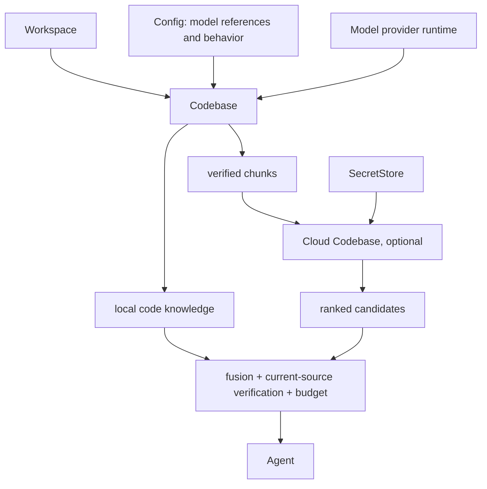

# Codebase 与 Cloud Codebase

> 状态：Current。本文定义工作区代码知识的产品边界、配置归属、持久化位置和云端增强契约。crate 内部接口见 [`zeta-codebase`](../zeta-rs/codebase/README.md) 与 [`zeta-cloud-codebase`](../zeta-rs/cloud-codebase/README.md)。

## 结论

Codebase 是完整主流程：它读取当前 Workspace，建立并维护本地代码知识，完成检索、融合、源码复核和结果预算。Cloud Codebase 是可选增强：它只消费 Codebase 已切分、已复核的代码片段，在云端完成语义索引与语义查询，再把候选交回 Codebase。

Cloud Codebase 不是第二个 Workspace 权威。它不能扫描目录、解释 ignore、重新切分文件，也不能绕过 Codebase 读取源码。

| 产品能力 | Codebase | Cloud Codebase |
| --- | --- | --- |
| 默认可用 | 是 | 否 |
| Workspace 扫描、切分、revision、identity | 拥有 | 不拥有 |
| 本地全文与符号数据 | 拥有 | 不拥有 |
| 语义索引与语义查询 | 可选，在设备内执行 | 在云端执行 |
| 候选融合、当前源码复核、byte budget | 拥有 | 不拥有 |
| 源码外发授权、同步、远端删除 | 不拥有 | 拥有 |

产品层只看到 `Codebase` 和 `Cloud Codebase`。全文、符号、向量等只是 `zeta-codebase` 内部的数据结构和候选来源，不出现在检索结果协议中。

## 调用关系



设备内模型只能通过回环地址运行。配置为网络地址的 embedding 或 rerank endpoint 不会启用本地 Codebase 模型路径；需要网络语义能力时使用 Cloud Codebase。

## 四个持久化责任

| 数据 | Owner | 是否可删除重建 |
| --- | --- | --- |
| 用户选择的 embedding/rerank `ModelRef`、自动上下文行为、非敏感 provider 配置 | Config | 否，属于用户意图 |
| API key、OAuth token、provider secret | SecretStore | 否，属于凭据 |
| 文件片段、全文数据、符号数据、向量、generation、`EmbeddingIndexKey` | Codebase storage | 是 |
| Cloud grant、`CloudCodebaseId`、同步 generation、撤销与待删除状态 | Cloud Codebase state | 否，删除任务完成前必须保留 |

Config 不保存索引路径、文件片段、向量、generation、同步进度或云端删除状态。模型权重由模型运行时管理；Ollama 等运行时下载的模型不进入 Config，也不进入 Codebase 数据库。

当前 Codebase 配置只有两类意图：可选的设备内模型引用，以及是否在一次 Agent 调用中自动加入已复核的代码证据。没有模型配置时，Codebase 仍以本地基础能力完整工作。

## 持久化键

| 键 | 含义 | 变化后果 |
| --- | --- | --- |
| `WorkspaceTrustId` | 当前规范化 Workspace 的本地身份 | 选择独立的本地数据目录 |
| chunk key + source revision + content hash | 一段当前源码的稳定身份 | 不匹配时拒绝返回旧内容 |
| `EmbeddingIndexKey` | document encoder 版本、embedding model 与非敏感运行配置的摘要 | 不匹配时重建向量数据 |
| `CloudCodebaseGrantId` | 本机一次明确授权和删除边界 | 撤销时按该授权幂等删除 |
| `CloudCodebaseId` | 服务端长期存在的 Codebase 身份 | 路径变化、重启或多设备仍指向同一远端对象 |
| remote generation | 云端实际发布并用于查询的版本 | 与当前本地 generation 不一致时标记 stale |

`EmbeddingIndexKey` 不包含 secret，也不包含 rerank model；rerank 不改变已经生成的向量。当前 key 输入包含 document encoder 版本、embedding `ModelRef` 和 provider 的非敏感配置。

## 文件位置

```text
<profile>/
├─ config.toml
├─ secrets/...
├─ state/
│  └─ cloud-codebase/
│     └─ <root-digest>.sqlite3
└─ cache/
   ├─ locks/...
   └─ workspaces/
      └─ <root-digest>/
         └─ indexes/
            ├─ codebase/
            │  ├─ sources.sqlite3
            │  ├─ symbols.sqlite3
            │  └─ semantic.sqlite3
            └─ agent-grep/...
```

Codebase 的三个 SQLite 文件共享一个生命周期锁和一个显式清理入口。它们是可重建数据，不会进入 Config。Cloud Codebase 的数据库位于 `state`，因为其中的授权和待删除任务不能作为缓存随意丢弃。

Unix 上的持久化数据库必须是普通文件并使用 `0600`。索引目录按 Workspace 摘要隔离；跨进程锁放在独立的 `cache/locks` 下，清理索引时不会把正在使用的数据删除。

## 运行状态与协议

Codebase 对外提供统一的 `status`、`search`、`retrieve` 和 `rebuild`。`retrieve` 不暴露候选来自全文、符号、设备内模型还是云端模型；非致命问题只报告 `codebaseIncomplete`、`cloudCodebaseUnavailable`、候选复核失败或结果超出 byte budget。

Cloud Codebase 自己维护以下状态：

```text
LocalOnly → Granted → Syncing → Ready
                         │         │
                         └→ Failed └→ Stale
Granted / Ready / Stale / Failed → Revoking → LocalOnly
```

`authorize` 只保存授权，`sync` 才读取并发送当前已复核片段。`revoke` 必须先持久化 `Revoking`，云端确认按 grant 幂等删除后才能清空本地状态。进程中断或删除失败时，下一次打开同一 Workspace 会继续删除，不能恢复外发能力。

## 不变量

- Codebase 返回结果前必须重新读取当前磁盘或编辑器未保存内容，并校验 root、revision、range、chunk key 与 content hash。
- Cloud Codebase 只能收到授权范围内的 `MaterializedChunk`，只能返回当前授权和准确 remote generation 下的 `ChunkReference`。
- Config 变化会重新建立模型运行时；`EmbeddingIndexKey` 变化会使旧向量不可复用。凭据变化不写入 key，也不复制到任何索引数据库。
- 默认模式不联网。安装 Cloud provider、完成明确授权并调用同步之前，不产生源码外发。

## 当前完成度

| 范围 | 状态 |
| --- | --- |
| Codebase 扫描、切分、全文与符号数据、设备内模型向量、检索融合、源码复核、预算 | Current |
| 统一 Codebase 配置、统一本地数据目录、`EmbeddingIndexKey` | Current |
| Cloud grant、预览、同步、查询、generation 校验、撤销恢复、`CloudCodebaseId` | Current |
| 具体生产云服务、租户认证、远端向量数据库、retention receipt | 尚未完成 |
