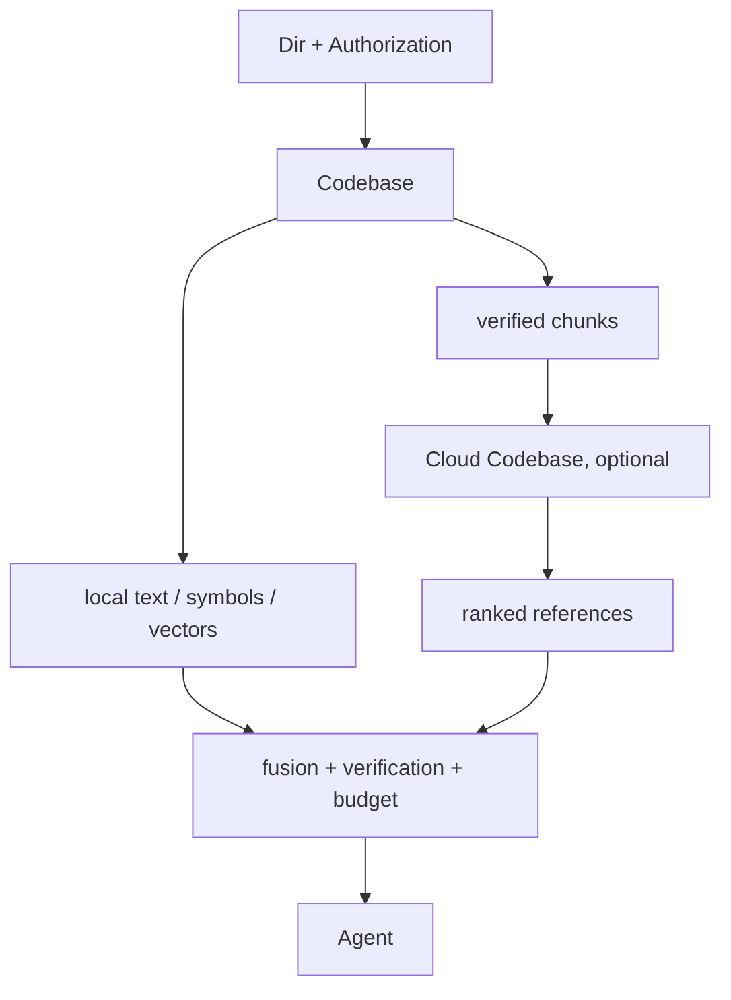

# Codebase

> 本文拥有代码知识的产品边界。实现见 [`zeta-codebase`](../zeta-rs/codebase/README.md)、
> [`zeta-codebase-store`](../zeta-rs/codebase-store/README.md) 和
> [`zeta-cloud-codebase`](../zeta-rs/cloud-codebase/README.md)。

## 结论

一个 Codebase 绑定一个已获权的 `Dir`。它扫描、切分并复核该目录中的当前源码；`DirId` 决定
本地索引身份，目录能力决定调用方能否读取、检查或向云端同步。Codebase 不创建 Workspace，
也不从 `cwd` 推断身份。

Cloud Codebase 是可选增强。它只消费本地 Codebase 已切分、已复核且在授权范围内的代码片段，
不能扫描目录、解释 ignore 或绕过本地源码复核。



## 所有权

| 能力 | Codebase | Cloud Codebase |
| --- | --- | --- |
| 目录扫描、ignore、切分和源码 revision | 拥有 | 不拥有 |
| 全文、符号和设备内向量数据 | 拥有 | 不拥有 |
| 云端语义索引与查询 | 不拥有 | 拥有 |
| 当前源码复核、融合和 byte budget | 拥有 | 不拥有 |
| 外发授权、同步 generation 和远端删除 | 不拥有 | 拥有 |

Config 只保存模型引用和行为意图。Secret Store 保存凭据。可重建索引由 Codebase Store 保存；
Cloud grant、同步 generation、撤销和待删除状态由 Cloud Codebase state 保存。

## 身份与持久化

| 键 | 含义 |
| --- | --- |
| `DirId` | 环境内规范化目录的稳定身份 |
| chunk key + source revision + content hash | 当前代码片段身份 |
| `EmbeddingIndexKey` | encoder、embedding model 与非敏感配置摘要 |
| `CloudCodebaseGrantId` | 一次明确外发授权和删除边界 |
| `CloudCodebaseId` | 服务端长期 Codebase 身份 |

```text
<profile>/
├─ state/cloud-codebase/<dir-digest>.sqlite3
└─ cache/
   ├─ locks/...
   └─ dirs/<dir-digest>/indexes/codebase/codebase.sqlite3
```

`cache/dirs` 中的数据可以删除重建；Cloud Codebase 的撤销与待删除任务不能作为缓存丢弃。
索引租约和清理入口按 `DirId` 隔离，不能用显示路径或窗口身份代替。

## 运行语义

Codebase 对外提供 `status`、`search`、`retrieve` 和 `rebuild`。结果不暴露候选来自全文、符号、
设备内模型还是云端模型；所有候选在返回前统一重新读取当前源码并校验 revision、range、key 与
content hash。

未保存文档通过 Document Overlay 替代同路径磁盘内容。关闭或保存后，索引按 content hash 与
磁盘 generation 重新汇合。Overlay 是文档状态，不是新的目录或授权边界。

Cloud Codebase 状态如下：

```text
LocalOnly → Granted → Syncing → Ready
                         │         │
                         └→ Failed └→ Stale
Granted / Ready / Stale / Failed → Revoking → LocalOnly
```

`authorize` 只保存授权，`sync` 才读取并发送片段。`revoke` 必须先持久化 `Revoking`，远端确认幂等
删除后才能清空本地状态；失败或中断后继续删除，不能恢复外发能力。

## 不变量

- Codebase 只在一个明确的 `Dir` 内读取事实。
- 索引身份使用 `DirId`，不使用 Workspace、裸路径或 `cwd`。
- Cloud Codebase 只能收到当前 grant 允许且已复核的 `MaterializedChunk`。
- 返回 Agent 前始终执行当前源码复核和统一结果预算。
- 默认模式不联网；安装 provider、明确授权并调用同步前不外发源码。
