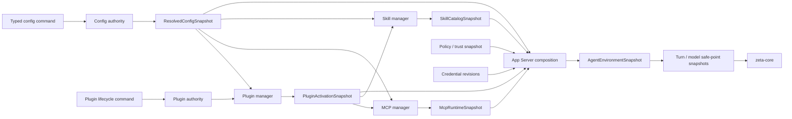

# `zeta-config` 架构与 Plugin/MCP/Skill 接入方案

> 物理位置：`zeta-rs/config/`  
> Rust crate：`zeta_config`  
> 当前状态：User Config authority、revision、Provider map、standalone MCP declaration、Skill
> source/per-Skill enablement、Workspace read-only document 和 scoped resolution 已实现。Local
> App Server 会在 model safe point 应用合法的 Workspace model default，并已组合 built-in/user
> metadata-only Skill catalog；Plugin contribution、Skill activation、grant 和完整环境组合仍是
> 后续 vertical slice。本文定义完整长期边界。
> Core 边界：[`core.md`](core.md)  
> Plugin 控制面：[`plugins.md`](plugins.md)  
> MCP runtime：[`mcp.md`](mcp.md)  
> Skill runtime：[`skills.md`](skills.md)  
> Direct-provider credential：[`model-provider.md`](model-provider.md#6-provider-credential-与-subscription-backend)  
> Interactive login：[`login.md`](login.md)
> Secret persistence：[`secrets.md`](secrets.md)

## 1. 结论

Zeta 对外提供统一配置体验，但不建立一个拥有所有产品状态的巨型 Config 数据库。

长期固定三层语义：

```text
Desired configuration
    用户、Workspace 和领域 authority 声明“想要什么”

Operational state
    Plugin/MCP/Skill manager 维护“当前实际是什么状态”

Runtime snapshot
    App Server 在 safe point 冻结“本次执行能使用什么”
```

`zeta-config` 是普通配置 authority 和 typed resolution 层。Plugin package、MCP connection、
Skill catalog、credential 和 action policy 继续由各自领域拥有。App Server 是唯一组合层：
它把各领域不可变 snapshot 汇合为 Agent 可消费的环境，而不把 live manager 或文件读取能力
注入 Core。

最重要的不变量是：

- 一个 scope 内同一份期望状态只有一个 authority；
- 配置提交成功不等于 Plugin 已激活、MCP 已连接或 Skill 已可用；
- runtime reconcile 失败只更新 health/diagnostics，不静默改写用户期望；
- Workspace 声明可以请求能力，但不能自行安装、授权、绑定 credential 或扩大 sandbox；
- 运行中的 Turn 或 model request 只使用开始时冻结的 snapshot。

## 2. Authority 分布

统一配置体验不等于统一物理 authority。长期 authority 分布如下：

| Authority | 拥有 | 不拥有 |
| --- | --- | --- |
| User Config authority | UI 偏好、Agent 默认值、Provider 配置、独立 MCP server 定义、用户 Skill source | Plugin package、live connection、secret、runtime health |
| Workspace config document | Workspace Agent 默认值、独立 MCP 声明、Plugin 请求、Workspace Skill source | 自动安装、grant、credential value、运行时状态 |
| Plugin authority | installed exact package、enablement、version pin、activation grant、credential-slot binding、rollback | MCP session、Skill catalog、per-call approval |
| Domain auth authority | credential type、refresh、scope、credential revision | 普通配置、Plugin manifest、Thread history |
| Secret store | opaque secret bytes 的 load/store/delete | credential type、OAuth、scope、refresh |
| Session authority | durable `SessionSettings` 和产品级共享默认值 | 完整 Core/runtime 配置快照 |
| Host policy authority | system/organization requirements、action approval 和 sandbox decision | 用户偏好、package content、secret |

`zeta-config` 可以解析 Workspace 中的 Plugin 请求，但请求进入 Plugin manager 后仍需与已安装
package、grant、trust 和 credential binding 一起解析。Workspace 文件本身永远不能成为
Plugin installed/active authority。

Direct-provider credential lifecycle 由 [`model-provider.md`](model-provider.md) 规定，interactive
login 由 [`login.md`](login.md) 规定，storage policy 由 [`secrets.md`](secrets.md) 规定。Config 只
保存 opaque `CredentialId`/account reference；不保存 credential kind 对应的 raw secret、OAuth token
bundle、authorization header 或 refresh 状态。

当前 Workspace document 由 host 提供 `WorkspaceId` 和 content revision；文件本身不能选择自己
的 namespace 或 generation。它 strict-parse 为 JSON document，MCP/Skill ID 必须落在
`workspace:<workspace-id>:` namespace，且 MCP declaration 不包含 credential binding。

## 3. 配置 source 与 scope

配置 source 按以下顺序参与解析：

```text
BuiltInDefaults
    + UserConfig
    + WorkspaceConfig
    + SessionSettings
    + LaunchOverrides
    constrained by SystemRequirements
    =
ResolvedConfigSnapshot
```

这不是无条件的递归 TOML/JSON merge。每个字段必须声明：

- 可以出现在哪些 scope；
- merge、replace、append 或 clear 语义；
- Workspace 是否只能收紧；
- 是否必须产生 provenance；
- 更新影响下一个 Turn、下一次 model invocation，还是仅影响 UI；
- 缺失、显式清除和继承的区别。

典型规则：

| 配置 | 允许的 source | 规则 |
| --- | --- | --- |
| Theme/UI preference | User/device | Workspace、Session 和 launch 不能覆盖 |
| Preferred model | User、Workspace、Session、launch | 只影响下一个 model safe point |
| Provider endpoint/profile | User、host | Workspace 不能静默替换认证或网络边界 |
| Standalone MCP server | User、Workspace | Workspace declaration 需要 trust/grant 后才能启动 |
| Plugin request | Workspace | 只能请求 exact package/version，不能自动安装或授权 |
| Skill source | User、Workspace | 必须经过 source containment、trust 和 compatibility 校验 |
| Sandbox/approval intent | User、Workspace、Session | 低信任 source 只能保持或收紧安全性 |
| System requirements | System/organization | 是约束，不是“最高优先级普通配置” |

## 4. Typed 配置模型

配置 document 按领域分 section，但保持一个稳定的顶层 schema：

```rust
pub struct UserConfigDocument {
    pub ui: UiConfig,
    pub agent: AgentConfig,
    pub providers: ProvidersConfig,
    pub mcp: McpConfig,
    pub skills: SkillsConfig,
}

pub struct WorkspaceConfigDocument {
    pub agent: WorkspaceAgentConfig,
    pub mcp: WorkspaceMcpConfig,
    pub plugin_requests: WorkspacePluginRequests,
    pub skills: WorkspaceSkillsConfig,
}
```

Plugin installed state、enablement、grant 和 rollback 不复制进普通 Config document；这些值属于
Plugin authority。普通 Config 只携带独立声明和 Workspace 请求。

所有 section 必须是 typed schema。禁止使用以下通用逃生口：

```rust
pub options: serde_json::Value
pub extra: HashMap<String, serde_json::Value>
```

Provider 配置继续由 `zeta-model-provider-config` 定义。`zeta-config` 可以保存
`BTreeMap<ProviderId, ModelProviderConfig>`，但不重新定义 Provider normalization 或 runtime。

自动审批模型是独立于主 Agent 模型的 User 配置：

```rust
pub enum ApprovalReviewModelSelection {
    Automatic,
    Explicit { model: ModelRef },
}
```

`Automatic` 跟随当前主 Agent 模型的 provider，再由该 provider 的声明选择适合审批的默认
review model；没有专用默认值的自定义或本地 provider 才复用当前模型。它不是一个全局固定
模型。`Explicit` 允许用户锁定一个已经配置、且满足 review capability gate 的 provider/model。
显式模型的 provider 不能在仍被引用时删除。配置层能够验证 provider、静态 catalog 与 endpoint；
credential、订阅 entitlement 和远端模型是否实际可调用，由创建 review runtime 时再次验证。
Workspace 配置不能覆盖审批模型，避免仓库内容自行降低 reviewer 强度。模型不可用或不兼容时
fail closed，不得静默换成其他审批模型。

## 5. Resolved config snapshot

解析结果是不可变、带 generation 和来源信息的值：

```rust
pub struct ResolvedConfigSnapshot {
    pub generation: ConfigGeneration,
    pub values: ResolvedConfig,
    pub provenance: ConfigProvenance,
    pub diagnostics: Vec<ConfigDiagnostic>,
}
```

当前代码区分 User authority snapshot 与 `ScopedConfigSnapshot`：后者额外携带 host-observed
`WorkspaceConfigRevision`、provenance 和 diagnostics。它保留 Workspace MCP、Skill 与 Plugin
内容为 pending intent；只有 Workspace preferred model 在 provider 已由 User 配置时才覆盖 user
default。审批模型始终来自 User/managed configuration，Workspace 无权覆盖。未配置的 provider
产生 diagnostic，不会暗中选择或创建 endpoint。

`ConfigGeneration` 只在 consumer-visible resolved value 或 diagnostics gate 发生变化时递增。
snapshot 不包含：

- API key、OAuth token、cookie 或 private key；
- Plugin package mutable path；
- MCP PID、request ID、SSE cursor 或 live session；
- Skill 正文或任意未限制的文件 handle；
- 当前 Tool Call 或 Thread execution state。

同一组 source revision、built-in definition 和 requirements 必须确定性地产生同一 resolved
snapshot。provenance 至少能回答：

- 最终值来自哪个 scope/source；
- 哪个更低优先级值被覆盖；
- 哪个 Workspace 请求因为 trust、grant 或 compatibility 未生效；
- 哪个 requirement 拒绝或收紧了配置；
- 哪个 generation 被 Turn/model invocation 使用。

## 6. Plugin、MCP 与 Skill 接入流程

完整接入流程如下：



一次普通配置更新的状态推进是：

```text
validate typed command against ConfigRevision
→ commit desired config
→ publish ResolvedConfigSnapshot generation
→ affected managers reconcile off to the side
→ publish Plugin/MCP/Skill generations
→ App Server builds a new AgentEnvironmentSnapshot
→ future safe point starts using the new environment generation
```

任何中间 runtime failure 都不能让 Config authority 回退到另一个用户未请求的值。失败以
`Blocked`、`Broken`、`Degraded` 或 `Unavailable` 等 typed state 和 diagnostic 表达。

## 7. Plugin contribution 规则

Plugin manifest 可以贡献 Skill、MCP server declaration 和静态资源。配置只保存 Plugin
identity、用户请求或与 Plugin authority 关联的稳定 reference，不复制 manifest 内容。

Plugin contribution identity 固定包含 namespace：

```text
plugin:<plugin-id>:skill:<local-id>
plugin:<plugin-id>:mcp:<local-id>
```

禁止把以下内容从 package 复制回普通配置：

- executable 或 package-relative path；
- Skill 相对路径；
- requested permissions；
- contribution definition；
- package digest 派生 metadata。

否则 Plugin package 与 Config 会成为两个互相漂移的 authority。

Workspace 可以声明：

```text
PluginRequest {
    plugin_id,
    version_requirement,
    requested_scope,
}
```

解析流程必须是：

```text
Workspace request
→ resolve exact package candidate
→ display origin/digest/permissions/credential slots
→ explicit install or enable command
→ activation grant
→ PluginActivationSnapshot
```

Workspace request 不能隐含任何后续步骤。

## 8. MCP 配置与 runtime

MCP 有两类定义来源：

```text
Standalone MCP
    User/Workspace Config 中的 typed server definition

Plugin MCP
    PluginActivationSnapshot 中的 normalized contribution
```

二者进入 MCP manager 前都必须拥有 namespaced `McpServerId`，不能按字符串优先级静默覆盖：

```text
user:mcp:<id>
workspace:<workspace-id>:mcp:<id>
plugin:<plugin-id>:mcp:<id>
```

当前 User Config 的 MCP section 已保存：

- server definition；
- explicit enablement；
- transport declaration；
- `CredentialRef`；

`requested workspace/root access`、runtime permission 和 local tool policy 只有在 MCP manager 与
policy authority 一起实现时才会加入 typed declaration，不能先用松散 JSON 字段占位。

MCP runtime snapshot 可以保存：

- resolved server generation；
- negotiated capabilities；
- tools/resources/prompts catalog；
- connection health；
- redacted diagnostics。

PID、OAuth verifier、access token、request ID、SSE cursor 和 live session ID 既不进入普通 Config，
也不进入 Thread event。

## 9. Skill 配置与 catalog

普通 Config 只定义显式 user/workspace Skill source。Built-in Skill 来自 Zeta release，
Plugin Skill 来自 `PluginActivationSnapshot`。

当前 User Config 还保存 source-qualified per-Skill disabled override。Enabled 是默认值，因此
重新启用会删除 override，不为每个已发现 Skill 写冗余记录。App Server 读取该 overlay 并投影
effective enablement；catalog entry 消失时 desired override 可以保留，重新出现后仍按同一
`SkillId` 生效。

Skill manager 负责：

```text
resolved sources
→ containment/trust validation
→ metadata discovery
→ compatibility and conflict resolution
→ SkillCatalogSnapshot
→ selected SkillActivationSnapshot
```

`ResolvedConfigSnapshot` 不携带 Skill 正文。Core `ContextAssembler` 只接收已经冻结的 activation
内容和 provenance，不在 model request 组装期间重新扫描文件系统。

## 10. App Server surface

外部 API 提供统一产品体验，但 mutation 按领域保持 typed：

| 类别 | 方法示例 | Authority/语义 |
| --- | --- | --- |
| Ordinary Config | `config/read`、`config/update` | Config authority |
| Provider Config | `provider/configure`、`provider/remove` | Config authority 的 Provider section |
| Standalone MCP Config | `mcp/server/upsert`、`mcp/server/remove`、`mcp/server/enablement/set` | Config authority 的 MCP section（已实现 desired config） |
| MCP Runtime | `mcp/server/connect`、`mcp/server/disconnect` | process-local lifecycle intent（Proposed） |
| Plugin Package | `plugin/install`、`plugin/update`、`plugin/uninstall` | Plugin authority（Proposed） |
| Plugin Activation | `plugin/enable`、`plugin/disable`、`plugin/version/pin` | Plugin authority（Proposed） |
| Skill Source | `skill/source/add`、`skill/source/remove`、`skill/source/enablement/set` | Config authority 的 Skill section（已实现 desired config） |
| Skill Catalog | `skills/list`、`skill/enablement/set` | App Server metadata projection + Config authority per-Skill overlay（已实现 built-in/user） |

所有 durable mutation 使用 `CommandId`、对应 authority 的 expected revision、payload conflict
检查和 exact typed response replay。Runtime connect/disconnect 不占用 Config、Session 或 Thread
revision。

不要把所有领域重新塞回一个无限增长的通用 `config/update` JSON patch。

## 11. Runtime snapshot 与 safe point

App Server 根据多个 generation 构造不可变环境：

```rust
pub struct AgentEnvironmentSnapshot {
    pub config_generation: ConfigGeneration,
    pub plugin_generation: PluginGeneration,
    pub mcp_generation: McpGeneration,
    pub skill_generation: SkillGeneration,
    pub policy_revision: PolicyRevision,
}
```

这个类型表达语义，不要求所有 generation 同步递增。App Server 必须保证发布的组合在内部一致：

- Plugin MCP contribution 引用的 package generation 仍可用；
- Skill activation 引用的 source/digest 与 catalog generation 一致；
- MCP credential binding revision 与 materialization 输入一致；
- requirements 不允许的能力不会进入 Tool snapshot；
- consumer-visible snapshot 切换是原子的。

Core 不依赖 `zeta-config`、Plugin/MCP/Skill live manager 或 credential store。Core 只接收自己需要的
窄值：

```text
TurnPolicySnapshot
    生命周期：整个 Turn

ModelInvocationSnapshot
    生命周期：一次 provider request

ToolRegistrySnapshot
    生命周期：一个明确的执行 safe point
```

普通配置变化只影响下一个 safe point。安全要求在运行中不能静默放宽；需要立即生效的收紧由
明确的 interrupt/cancel policy 处理。

## 12. `zeta-config` 内部结构

近期保持一个 crate，先按领域划分私有模块：

```text
zeta-rs/config/src/
├── lib.rs
├── schema/
│   ├── mod.rs
│   ├── user.rs
│   ├── workspace.rs
│   ├── ui.rs
│   ├── agent.rs
│   ├── providers.rs
│   ├── mcp.rs
│   └── skills.rs
├── authority/
│   ├── mod.rs
│   ├── command.rs
│   ├── event.rs
│   ├── reducer.rs
│   └── state.rs
├── resolve/
│   ├── mod.rs
│   ├── scope.rs
│   ├── merge.rs
│   ├── requirements.rs
│   ├── provenance.rs
│   └── snapshot.rs
├── store/
│   ├── mod.rs
│   └── authority.rs
├── diagnostics.rs
└── test_support.rs
```

目录只随可测试的 vertical slice 创建，不预先生成空模块。模块默认 private，`lib.rs` 精确导出
稳定 API。

当前不拆 `config-types`、`config-layers`、`config-policy` 或 `config-edit` crate。只有出现第二个
真实 storage/remote consumer、独立依赖边界和可单独测试的 vertical slice 后才提取。

## 13. 依赖方向

允许：

```text
zeta-config → zeta-protocol
zeta-config → zeta-model-provider-config

zeta-plugins / zeta-mcp / zeta-skills
    → zeta-config 中与自己消费语义一致的纯配置值

App Server
    → zeta-config + zeta-plugins + zeta-mcp + zeta-skills + credentials + policy
```

禁止：

```text
zeta-config → Plugin/MCP/Skill live runtime
zeta-config → credential materialization
zeta-config → zeta-core
zeta-core → Config authority or config files
Plugin/MCP/Skill manager → ThreadStore mutation
Workspace Config → grant or secret authority
```

如果某个 MCP/Plugin 配置类型增长到需要被多个 crate 独立消费，并且让 `zeta-config` 与 runtime
形成不合理依赖，再提取纯声明 crate；不能先按名称拆出一组没有独立消费者的小 crate。

## 14. 验收不变量

- 每个配置 scope 和领域状态只有一个 authority；
- Config、Plugin、MCP 和 Skill generation 可以独立恢复和推进；
- 相同 source/revision 确定性地产生相同 resolved snapshot；
- Workspace 配置不能扩大 grant、policy、sandbox 或 credential scope；
- Plugin contribution 不复制回普通 Config；
- standalone、Workspace 和 Plugin MCP 使用 namespaced identity；
- runtime reconcile 失败保留 desired config，并产生 typed diagnostic；
- secret 不进入 Config、Plugin snapshot、Thread event、schema fixture 或日志；
- App Server 原子发布内部一致的 `AgentEnvironmentSnapshot`；
- 已开始的 Turn/model invocation 不被后续配置变化静默修改；
- 所有新 test module 使用 sibling `*_tests.rs`。

## 15. 实施顺序

1. ✅ 消除普通配置的双 authority，建立 `ConfigRevision` 和唯一 Config authority；
2. ✅ 区分 User Config authority 与 Workspace read-only config document；
3. ◐ 引入 typed `ResolvedConfigSnapshot`、Workspace scoped resolution、provenance 和
   diagnostics；Session/launch/System requirements 的 merge rule 仍待实现；
4. ✅ 将 Provider 配置改为 `ProviderId` keyed map；
5. ✅ 实现 standalone MCP 和 Skill source 的 desired-config section；
6. ✅ 实现 built-in/user Skill catalog、watcher refresh 与 durable per-Skill enablement overlay；
7. 实现 Plugin authority 与 `PluginActivationSnapshot`；
8. 接通 Plugin contribution 到 MCP/Skill manager；
9. 由 App Server 原子发布 `AgentEnvironmentSnapshot`；
10. Core 在 Turn/model/tool safe point 消费窄 snapshot；
11. 增加 crash、replay、scope conflict、permission monotonicity 和 generation consistency 测试。

开发期直接修改现有 JSON、RPC 和存储模型，不保留旧格式兼容层或 upcast。
