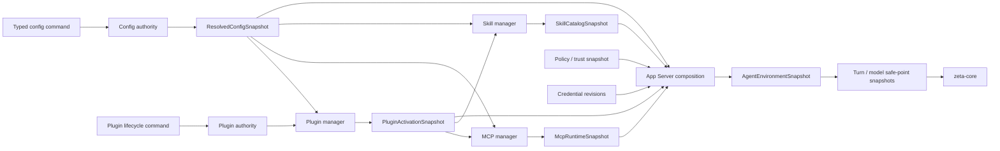

# 配置系统

> 物理位置：`zeta-rs/config/`  
> Rust crate：`zeta_config`  
> 当前状态：TOML User Config authority、SQLite revision/generation 与 exact command receipt、
> Provider map、standalone MCP declaration、Skill source/per-Skill enablement、Workspace TOML
> read-only document、exact Plugin request、declarative Hook、User Workspace trust decision 和
> scoped resolution、Tool Search 词法/混合 embedding 模式选择、User execution-policy rule
> persistence 与 Workspace restrictive rule intent 已实现。
> Local App Server 在 profile 下使用
> `config.toml` 与 `state.sqlite3`，并在提交后原子切换未来的 model、Skill 与 MCP Tool safe point；
> 已 prepare 的 Tool Call 保留旧 generation。Plugin contribution、grant 和完整环境组合仍是后续
> vertical slice。
> Core 边界：[`core.md`](core.md)  
> Plugin 控制面：[`plugins.md`](plugins.md)  
> MCP runtime：[`mcp.md`](mcp.md)  
> Skill runtime：[`skills.md`](skills.md)  
> Agent 自定义对象与外部导入边界：[`agent-customizations.md`](agent-customizations.md)
> Direct-provider credential：[`model-provider.md`](model-provider.md#6-供应商凭据与-codex-边界)
> Interactive login：[`login.md`](login.md)
> Secret persistence：[`secrets.md`](secrets.md)
> Hook runtime 实现：[`zeta-hooks`](../zeta-rs/hooks/README.md)

## 快速理解

配置系统回答“在当前作用域下，用户想要什么值”；领域管理器回答“现在实际可用什么”，App Server
只在安全点把两者组合成运行时快照。

| 用户或调用方的动作 | 直接结果 | 不代表什么 |
| --- | --- | --- |
| 修改用户配置 | 产生新的用户配置 revision | 不代表正在运行的 Turn 立即改变 |
| Workspace 声明模型或 MCP | 进入作用域解析和信任校验 | 不会自动安装、授权或连接 |
| Session 覆盖默认模型 | 影响后续模型安全点生成的快照 | 不改写用户或 Workspace 配置 |
| Plugin、MCP 或 Skill 协调失败 | 保留期望配置并更新健康诊断 | 不会静默回滚用户想要的状态 |
| 配置引用凭据 | 只保存不敏感的凭据引用 | 不保存 token、API key 或 OAuth 状态 |
| 系统或组织设置安全要求 | 对解析结果施加约束 | 不是可以被低优先级配置覆盖的普通字段 |

## 1. 结论

Zeta 对外提供统一配置体验，但不建立一个拥有所有产品状态的巨型 Config 数据库。

长期固定三层语义：

```text
Desired configuration
    用户、Workspace 和领域 authority 声明“想要什么”

Operational state
    Plugin/MCP/Skill manager 维护“当前实际是什么状态”

Runtime snapshot
    App Server 在 safe point 冻结“本次执行能使用什么”
```

`zeta-config` 是普通配置 authority 和 typed resolution 层。Plugin package、MCP connection、
Skill catalog、credential 和 action policy 继续由各自领域拥有。App Server 是唯一组合层：
它把各领域不可变 snapshot 汇合为 Agent 可消费的环境，而不把 live manager 或文件读取能力
注入 Core。

最重要的不变量是：

- 一个 scope 内同一份期望状态只有一个 authority；
- 配置提交成功不等于 Plugin 已激活、MCP 已连接、Skill 已可用或 Hook 已执行；
- runtime reconcile 失败只更新 health/diagnostics，不静默改写用户期望；
- Workspace 声明可以请求能力，但不能自行安装、授权、绑定 credential 或扩大 sandbox；
- 运行中的 Turn 或 model request 只使用开始时冻结的 snapshot。

## 2. 权威分布

统一配置体验不等于统一物理 authority。长期 authority 分布如下：

| Authority | 拥有 | 不拥有 |
| --- | --- | --- |
| User Config authority | Agent 默认值、Provider 配置、独立 MCP server、Skill source、Plugin request、Hook declaration、execution-policy rules、按 canonical root identity 的 Workspace trust decision | UI/device 偏好、installed Plugin package、live connection、Hook execution、secret、runtime health |
| Desktop device preference authority | theme、zoom、window/device UI 偏好 | Agent/Provider/MCP/Skill desired config、Session/Thread |
| Workspace config document | Workspace Agent 默认值、独立 MCP 声明、Plugin 请求、Workspace Skill source、Hook 请求、只收紧的 execution-policy rules | 自动安装、扩权 grant、Hook 执行、credential value、运行时状态 |
| Plugin authority | installed exact package、effective activation、activation grant、credential-slot binding、rollback | TOML request、MCP session、Skill catalog、per-call approval |
| Domain auth authority | credential type、refresh、scope、credential revision | 普通配置、Plugin manifest、Thread history |
| Secret store | opaque secret bytes 的 load/store/delete | credential type、OAuth、scope、refresh |
| Session authority | durable `SessionSettings` 和产品级共享默认值 | 完整 Core/runtime 配置快照 |
| Host policy authority | system/organization requirements、action approval 和 sandbox decision | 用户偏好、package content、secret |

`zeta-config` 可以解析 Workspace 中的 Plugin 请求，但请求进入 Plugin manager 后仍需与已安装
package、grant、trust 和 credential binding 一起解析。Workspace 文件本身永远不能成为
Plugin installed/active authority。

Direct-provider credential lifecycle 由 [`model-provider.md`](model-provider.md) 规定，interactive
login 由 [`login.md`](login.md) 规定，storage policy 由 [`secrets.md`](secrets.md) 规定。Config 只
保存 opaque `CredentialId`/account reference；不保存 credential kind 对应的 raw secret、OAuth token
bundle、authorization header 或 refresh 状态。

当前 Workspace document 由 host 提供 `WorkspaceId` 和 content revision；文件本身不能选择自己
的 namespace 或 generation。它 strict-parse 为 TOML document，MCP/Skill/Hook ID 必须落在
`workspace:<workspace-id>:` namespace，且 MCP declaration 不包含 credential binding。Workspace
Hook 只是 pending trust 的 process request，不能因为文件存在就执行。

## 3. 配置来源与范围

配置 source 按以下顺序参与解析：

```text
BuiltInDefaults
    + UserConfig
    + WorkspaceConfig
    + SessionSettings
    + LaunchOverrides
    constrained by SystemRequirements
    =
ResolvedConfigSnapshot
```

这不是无条件的递归 TOML/JSON merge。每个字段必须声明：

- 可以出现在哪些 scope；
- merge、replace、append 或 clear 语义；
- Workspace 是否只能收紧；
- 是否必须产生 provenance；
- 更新影响下一个 Turn、下一次 model invocation，还是仅影响 UI；
- 缺失、显式清除和继承的区别。

典型规则：

| 配置 | 允许的 source | 规则 |
| --- | --- | --- |
| Theme/UI preference | Desktop device authority | 不进入 Rust `UserConfigDocument`，Workspace、Session 和 launch 不能覆盖 |
| Preferred model | User、Workspace、Session、launch | 只影响下一个 model safe point |
| Provider endpoint/profile | User、host | Workspace 不能静默替换认证或网络边界 |
| Standalone MCP server | User、Workspace | Workspace declaration 需要 trust/grant 后才能启动 |
| Plugin request | User、Workspace | 只能请求 exact package/version 与 desired enablement，不能证明已安装、激活或授权 |
| Skill source | User、Workspace | 必须经过 source containment、trust 和 compatibility 校验 |
| Hook declaration | User、Workspace | 只声明 safe-point、tool matcher 与 process argv；执行仍需 trust、policy、approval 和 sandbox |
| Tool Search mode/model | User | 默认纯本地 BM25/Regex；混合模式独立选择 exact embedding `ModelRef`，由 App Server 探活后启用 |
| Sandbox/approval intent | User、Workspace、Session | 低信任 source 只能保持或收紧安全性 |
| Execution-policy rules | Host、Organization、User、Workspace | User 可显式授权；Workspace 只能拒绝、强制沙箱/审批或 Continue，不能 `AllowUnsandboxed` |
| Workspace trust | User、organization policy、trusted host composition | Workspace document 无权自授信；User 缺失决策默认 Restricted |
| System requirements | System/organization | 是约束，不是“最高优先级普通配置” |

## 4. Typed 配置模型

配置 document 按领域分 section，但保持一个稳定的顶层 schema：

```rust
pub struct UserConfigDocument {
    pub agent: AgentConfig,
    pub providers: ProvidersConfig,
    pub mcp: McpConfig,
    pub skills: SkillsConfig,
    pub plugins: PluginsConfig,
    pub hooks: HooksConfig,
    pub tool_search: ToolSearchConfig,
    pub exec_policy: UserExecPolicyConfig,
    pub workspace_trust: WorkspaceTrustConfig,
}

pub struct WorkspaceConfigDocument {
    pub agent: WorkspaceAgentConfig,
    pub mcp: WorkspaceMcpConfig,
    pub plugin_requests: WorkspacePluginRequests,
    pub skills: WorkspaceSkillsConfig,
    pub hooks: HooksConfig,
    pub exec_policy: WorkspaceExecPolicyConfig,
}
```

`UserExecPolicyConfig` 持久化 typed `ExecPolicyRule`；`UserConfigCommand::UpsertExecPolicyRule` 和
`RemoveExecPolicyRule` 走同一 expected-revision、receipt 与 atomic TOML replacement 路径。
`WorkspaceExecPolicyConfig` 是 strict-read intent，validation 禁止 `AllowUnsandboxed`。
`compose_exec_policy` 把它们与 trusted Host/Organization layers 组合为 immutable
`ExecPolicySnapshot`；规则求值和 semantic revision 属于 `zeta-execpolicy`，最终 grant 属于
`zeta-action-policy`，不属于 Config。

User Config 的 `PluginsConfig` 保存 exact package request 与 desired enablement；Workspace 保存
scoped request。Plugin installed state、effective activation、grant、digest 和 rollback 不复制进
普通 Config document，这些值属于 Plugin authority。

`HooksConfig` 保存 namespaced Hook ID、`beforeTool`/`afterTool`/`turnCompleted` safe-point、
exact tool-name matcher、process `program + args` 与 desired enablement。它不保存 PID、环境、
执行队列、结果或 retry。`zeta-hooks` 在 App Server 已确认可信的 Workspace 中按 immutable 配置
快照匹配事件，经 Host Policy 评估后使用统一 sandbox executor；Restricted Workspace 不安装
process runner。App Server 只负责 Config reconcile、信任 gate 与 runtime composition。
`TurnCompleted` 在 durable completion 后 best-effort 执行，`beforeTool`/`afterTool` 遵守
cancellation，并在配置变更后热替换未来 safe point。

Theme 已从 Rust Config schema、command 和 App Server Config DTO 中移除。Desktop device
配置只拥有 device/UI preference；它不能再作为 Agent、Provider、MCP、Skill、
Session 或 Thread 的第二 authority。

所有 section 必须是 typed schema。禁止使用以下通用逃生口：

```rust
pub options: serde_json::Value
pub extra: HashMap<String, serde_json::Value>
```

Provider 配置继续由 `zeta-model-provider-config` 定义。`zeta-config` 可以保存
`BTreeMap<ProviderId, ModelProviderConfig>`，但不重新定义 Provider normalization 或 runtime。
`ModelProviderConfig.model_context` 以 `ModelId` 为 key 保存可选的 `context_window` 与
`auto_compact_token_limit`。这些值只决定 Core 是否能使用确定性预算和 durable compaction，不
改变 provider endpoint 或模型选择；窗口或阈值为零会在静态配置校验时被拒绝。目录和配置都无
已知窗口时，Core 明确退回 provider-managed，不猜测默认窗口。

Deferred Agent 工具检索只有两档 User intent：`toolSearch.mode = "lexical"`（默认）和
`toolSearch.mode = "hybridEmbedding"`。混合模式还必须配置 `toolSearch.embeddingModel`；该
`ModelRef` 与 CodeIndex 的 embedding/rerank 选择彼此独立，只共享 provider runtime 和 credential
materialization。配置本身不保存模型实例、向量或 provider credential。

`toolSearch/configure` 会在 durable commit 前解析模型并用固定文本完成 readiness probe。未配置
provider、credential/runtime 或 probe 失败时返回 `ToolSearchUnavailable`，不会打开门禁。外部 TOML
或启动恢复出的不可用 hybrid 配置不会拖垮 App Server；`config/read` 通过
`toolSearch.embeddingStatus = unavailable` 暴露原因，但自然语言 Tool Search 会明确失败，不会
偷偷切到 BM25。显式 Regex 仍在本地运行；用户显式改回 `lexical` 后，BM25 才重新成为自然语言
检索路径。门禁通过后，实际 embedding 调用失败同样使该次 Tool Search 明确失败。

Semantic CodeIndex 使用独立的 `semanticCodeIndex.selection` 和按 Workspace trust ID 保存的 source-egress
grant。授权会冻结 embedding/rerank `ModelRef` 以及它们实际使用的 provider config；模型或 endpoint
变化后 `activeWorkspaceAuthorized` 立即变为 false，App Server 卸载旧 semantic runtime。Desktop 的
Indexing 设置页可保存 Ollama/unauthenticated OpenAI-compatible endpoint、模型选择并 authorize/revoke；
普通聊天模型配置和 Workspace 文件读取权限都不会自动授予源码外发。

自动审批模型是独立于主 Agent 模型的 User 配置：

```rust
pub enum ApprovalReviewModelSelection {
    Automatic,
    Explicit { model: ModelRef },
}
```

`Automatic` 跟随当前主 Agent 模型的 provider，再由该 provider 的声明选择适合审批的默认
review model；没有专用默认值的自定义或本地 provider 才复用当前模型。它不是一个全局固定
模型。`Explicit` 允许用户锁定一个已经配置、且满足 review capability gate 的 provider/model。
显式模型的 provider 不能在仍被引用时删除。配置层能够验证 provider、静态 catalog 与 endpoint；
credential、订阅 entitlement 和远端模型是否实际可调用，由创建 review runtime 时再次验证。
Workspace 配置不能覆盖审批模型，避免仓库内容自行降低 reviewer 强度。模型不可用或不兼容时
fail closed，不得静默换成其他审批模型。

`WorkspaceTrustConfig` 使用 `WorkspaceTrustId` 作为 key。该 ID 由 `zeta-workspace` 对 canonical
root 的平台原生 path bytes 做 SHA-256 得到，因此不把本机路径写入 User TOML，symlink/平台别名
共享决定，移动根目录后必须重新决定。它目前仍是 path-bound identity：同一路径被其他目录内容
替换时不会自动失效，identity-change detection 属于后续 host 持久化阶段。

Local App Server 把 User trust `ConfigChange` 同时作为撤销信号：Trusted → Restricted 会使当前
root-bound capability lease 永久失效，拆除 local Tool/Git/search/terminal runtime、终止相关
进程并中断活跃 Turn；filesystem 与 watcher 作为 Restricted runtime 保留。普通 Workspace
document 不进入这条 mutation 或撤销 authority。

## 5. Resolved config 快照

解析结果是不可变、带 generation 和来源信息的值：

```rust
pub struct ResolvedConfigSnapshot {
    pub generation: ConfigGeneration,
    pub values: ResolvedConfig,
    pub provenance: ConfigProvenance,
    pub diagnostics: Vec<ConfigDiagnostic>,
}
```

当前代码区分 User authority snapshot 与 `ScopedConfigSnapshot`：后者额外携带 host-observed
`WorkspaceConfigRevision`、provenance 和 diagnostics。它保留 Workspace MCP、Skill 与 Plugin
内容为 pending intent；只有 Workspace preferred model 在 provider 已由 User 配置时才覆盖 user
default。审批模型始终来自 User/managed configuration，Workspace 无权覆盖。未配置的 provider
产生 diagnostic，不会暗中选择或创建 endpoint。

`ConfigGeneration` 只在 consumer-visible resolved value 或 diagnostics gate 发生变化时递增。
snapshot 不包含：

- API key、OAuth token、cookie 或 private key；
- Plugin package mutable path；
- MCP PID、request ID、SSE cursor 或 live session；
- Skill 正文或任意未限制的文件 handle；
- 当前 Tool Call 或 Thread execution state。

同一组 source revision、built-in definition 和 requirements 必须确定性地产生同一 resolved
snapshot。provenance 至少能回答：

- 最终值来自哪个 scope/source；
- 哪个更低优先级值被覆盖；
- 哪个 Workspace 请求因为 trust、grant 或 compatibility 未生效；
- 哪个 requirement 拒绝或收紧了配置；
- 哪个 generation 被 Turn/model invocation 使用。

## 6. Plugin、MCP 与 Skill 接入流程

完整接入流程如下：



一次普通配置更新的状态推进是：

```text
validate typed command against ConfigRevision
→ commit desired config
→ publish ResolvedConfigSnapshot generation
→ affected managers reconcile off to the side
→ publish Plugin/MCP/Skill generations
→ App Server builds a new AgentEnvironmentSnapshot
→ future safe point starts using the new environment generation
```

任何中间 runtime failure 都不能让 Config authority 回退到另一个用户未请求的值。失败以
`Blocked`、`Broken`、`Degraded` 或 `Unavailable` 等 typed state 和 diagnostic 表达。

当前本地实现同时监听 TOML semantic digest 与 SQLite `data_version`。因此手工编辑文件或同一
profile 的另一个进程提交 Config 后，本进程都会发布新的
`ConfigChange { revision, generation }`；不是只有发起 RPC 的进程能刷新 Skill/MCP runtime。

## 7. Plugin 贡献规则

Plugin manifest 可以贡献 Skill、MCP server declaration 和静态资源。配置只保存 Plugin
identity、用户请求或与 Plugin authority 关联的稳定 reference，不复制 manifest 内容。

Plugin contribution identity 固定包含 namespace：

```text
plugin:<plugin-id>:skill:<local-id>
plugin:<plugin-id>:mcp:<local-id>
```

禁止把以下内容从 package 复制回普通配置：

- executable 或 package-relative path；
- Skill 相对路径；
- requested permissions；
- contribution definition；
- package digest 派生 metadata。

否则 Plugin package 与 Config 会成为两个互相漂移的 authority。

Workspace 可以声明：

```text
PluginRequest {
    plugin_id,
    version_requirement,
    requested_scope,
}
```

解析流程必须是：

```text
Workspace request
→ resolve exact package candidate
→ display origin/digest/permissions/credential slots
→ explicit install or enable command
→ activation grant
→ PluginActivationSnapshot
```

Workspace request 不能隐含任何后续步骤。

## 8. MCP 配置与运行时

MCP 有两类定义来源：

```text
Standalone MCP
    User/Workspace Config 中的 typed server definition

Plugin MCP
    PluginActivationSnapshot 中的 normalized contribution
```

二者进入 MCP manager 前都必须拥有 namespaced `McpServerId`，不能按字符串优先级静默覆盖：

```text
user:mcp:<id>
workspace:<workspace-id>:mcp:<id>
plugin:<plugin-id>:mcp:<id>
```

当前 User Config 的 MCP section 已保存：

- server definition；
- explicit enablement；
- transport declaration；
- `CredentialRef`；

`requested workspace/root access`、runtime permission 和 local tool policy 只有在 MCP manager 与
policy authority 一起实现时才会加入 typed declaration，不能先用松散 JSON 字段占位。

MCP runtime snapshot 可以保存：

- resolved server generation；
- negotiated capabilities；
- tools/resources/prompts catalog；
- connection health；
- redacted diagnostics。

PID、OAuth verifier、access token、request ID、SSE cursor 和 live session ID 既不进入普通 Config，
也不进入 Thread event。

Local App Server 当前在 Config commit 后重新 materialize standalone MCP definitions，并原子替换
未来 Tool catalog。新的 prepare 使用新 generation；已经 prepare、正在 review 或执行的调用仍
绑定旧 Tool/Policy generation，直到该调用结束。新配置无法 materialize 或产生重复 Tool 名时，
desired Config 保持已提交，runtime 保留上一份可用 generation 并记录 reconcile diagnostic。

## 9. Skill 配置与目录

普通 Config 只定义显式 user/workspace Skill source。Built-in Skill 来自 Zeta release，
Plugin Skill 来自 `PluginActivationSnapshot`。

当前 User Config 还保存 source-qualified per-Skill disabled override。Enabled 是默认值，因此
重新启用会删除 override，不为每个已发现 Skill 写冗余记录。App Server 读取该 overlay 并投影
effective enablement；catalog entry 消失时 desired override 可以保留，重新出现后仍按同一
`SkillId` 生效。

Skill manager 负责：

```text
resolved sources
→ containment/trust validation
→ metadata discovery
→ compatibility and conflict resolution
→ SkillCatalogSnapshot
→ selected SkillActivationSnapshot
```

`ResolvedConfigSnapshot` 不携带 Skill 正文。Core `ContextAssembler` 只接收已经冻结的 activation
内容和 provenance，不在 model request 组装期间重新扫描文件系统。

## 10. App Server 接口面

外部 API 提供统一产品体验，但 mutation 按领域保持 typed：

| 类别 | 方法示例 | Authority/语义 |
| --- | --- | --- |
| Ordinary Config | `config/read`、`config/update`、`config/changed` | Config authority；commit notification 携带 revision/generation，不包含 theme/UI device preference |
| Provider Config | `provider/configure`、`provider/remove` | Config authority 的 Provider section |
| Standalone MCP Config | `mcp/server/upsert`、`mcp/server/remove`、`mcp/server/enablement/set` | Config authority 的 MCP section（已实现 desired config） |
| MCP Runtime | `mcp/server/connect`、`mcp/server/disconnect`、`mcp/server/status` | process-local lifecycle intent 与 active runtime 的 redacted projection（已实现）；不改变 Config revision |
| MCP OAuth | `mcp/oauth/start`、`mcp/oauth/complete`、`mcp/oauth/refresh`、`mcp/oauth/revoke` | exact Config target + SecretStore lifecycle；Config 只保存 credential reference |
| Plugin Package | `plugin/list`、`plugin/uninstall` | legacy exact package Plugin authority；新安装由 `marketplace/*` API 与 Marketplace Manager 拥有 |
| Plugin Activation | `plugin/enable`、`plugin/disable`、`plugin/grant`、`plugin/revokeGrant` | exact-package Plugin authority（已实现） |
| Plugin Request Config | `plugin/request/upsert`、`plugin/request/remove`、`plugin/request/enablement/set` | Config authority 的 exact package request（已实现；不安装或激活） |
| Skill Source | `skill/source/add`、`skill/source/remove`、`skill/source/enablement/set` | Config authority 的 Skill section（已实现 desired config） |
| Skill Catalog | `skills/list`、`skill/enablement/set` | App Server metadata projection + Config authority per-Skill overlay（已实现 built-in/user） |
| Hook Config/Runtime | `hook/upsert`、`hook/remove`、`hook/enablement/set` | Config authority 保存 declaration；`zeta-hooks` 运行匹配的 sandbox process；App Server 负责 trusted Workspace 组合 |
| Agent Import Apply | `agent/import/preview`、`agent/import/apply` | App Server 将用户选择的 normalized fragments 路由到 Config 与目标 artifact authorities（Proposed） |

所有 durable mutation 使用 `CommandId`、对应 authority 的 expected revision、payload conflict
检查和 exact typed response replay。Runtime connect/disconnect 不占用 Config、Session 或 Thread
revision。

不要把所有领域重新塞回一个无限增长的通用 `config/update` JSON patch。

### 10.1 外部 Agent Import 与 Config

Agent 自定义对象与导入/source registration 的 canonical 边界见
[`agent-customizations.md`](agent-customizations.md)。[`zeta-agent-import`](../zeta-rs/agent-import/README.md)
当前只做 metadata-only inspection；它不依赖 `zeta-config`。未来 App Server import adapter 同时
消费 inspection/parser output 与目标领域 typed command，把用户确认的外部内容转换为 Zeta
desired state：

| 外部内容 | Config 或目标 authority | Apply 约束 |
| --- | --- | --- |
| Skill source | `AddSkillSource` | 保存 source-qualified identity 与 digest，不复制不受限目录 |
| MCP declaration | `UpsertMcpServer` | credential 不进入 Config；初始连接与 approval 分离 |
| Plugin request | `UpsertPluginRequest` | 必须解析成 exact package/version；不表示 installed/active |
| Hook declaration | `UpsertHook` | 默认 disabled；执行 authority 不属于 Import 或 Config |
| Instructions | Instruction authority | canonical target 尚未完成前不得 raw passthrough |
| Agents | Agent definition authority | 不属于普通 Config document |
| Execution rules | Policy review | 不生成 durable approval，不自动改写成 Hook |

Import apply 不能循环调用多个独立 RPC 后接受 partial success。Config 部分的目标 contract 是一个
带 `expected_config_revision`、source digest 和 selected item identity 的原子 batch：App Server
重新读取并校验 source，构造全部 typed mutations，Config authority 对整批 validation 后一次提交
并生成 exact import receipt。Conflict、unsupported field 或任一 Config mutation failure 都使
Config 子批次不提交。

Instructions 与 Agents 等非 Config artifact 必须交给各自 authority；canonical target 尚未完成
前，Import 必须将其标记为 unsupported，而不是强塞进 Config transaction。

Config 保存 normalized desired state 与必要 provenance reference，不保存外部原始文件、secret、
preview content 或目录访问 grant。Import source 的文件访问由一次性 host authorization 或
`zeta-add-dir` 分别拥有，不能通过 Config mutation 反向扩大。

## 11. 运行时快照与安全点

App Server 根据多个 generation 构造不可变环境：

```rust
pub struct AgentEnvironmentSnapshot {
    pub config_generation: ConfigGeneration,
    pub plugin_generation: PluginGeneration,
    pub mcp_generation: McpGeneration,
    pub skill_generation: SkillGeneration,
    pub policy_revision: ActionPolicyRevision,
}
```

这个类型表达语义，不要求所有 generation 同步递增。App Server 必须保证发布的组合在内部一致：

- Plugin MCP contribution 引用的 package generation 仍可用；
- Skill activation 引用的 source/digest 与 catalog generation 一致；
- MCP credential binding revision 与 materialization 输入一致；
- requirements 不允许的能力不会进入 Tool snapshot；
- consumer-visible snapshot 切换是原子的。

Core 不依赖 `zeta-config`、Plugin/MCP/Skill live manager 或 credential store。Core 只接收自己需要的
窄值：

```text
TurnPolicySnapshot
    生命周期：整个 Turn

ModelInvocationSnapshot
    生命周期：一次 provider request

ToolRegistrySnapshot
    生命周期：一个明确的执行 safe point
```

普通配置变化只影响下一个 safe point。安全要求在运行中不能静默放宽；需要立即生效的收紧由
明确的 interrupt/cancel policy 处理。

## 12. `zeta-config` 内部结构

当前保持一个 crate，私有模块按已存在的 vertical slice 划分：

```text
zeta-rs/config/src/
├── lib.rs
├── command.rs          # typed mutation 与 receipt payload
├── document.rs         # user document、revision/generation、resolved values
├── mcp.rs              # standalone MCP declaration
├── skills.rs           # source 与 per-Skill enablement
├── plugins.rs          # exact package request（不拥有 install/activation）
├── hooks.rs            # safe-point/matcher/process declaration（runtime 在 zeta-hooks）
├── mutation.rs         # typed command reducer
├── workspace.rs        # strict read-only Workspace document
├── resolution.rs       # scoped merge、provenance、diagnostic
├── store.rs            # TOML authority + SQLite transaction coordination
├── store_file.rs       # strict TOML read、semantic digest 与 atomic replace
├── store_schema.rs     # schema installation/version gate
└── store_monitor.rs    # cross-connection commit observation
```

目录只随可测试的 vertical slice 创建，不预先生成空模块。模块默认 private，`lib.rs` 精确导出
稳定 API。

当前不拆 `config-types`、`config-layers`、`config-policy` 或 `config-edit` crate。只有出现第二个
真实 storage/remote consumer、独立依赖边界和可单独测试的 vertical slice 后才提取。

## 13. 依赖方向

允许：

```text
zeta-config → zeta-protocol
zeta-config → zeta-model-provider-config

zeta-plugins / zeta-mcp / zeta-skills / zeta-hooks
    → zeta-config 中与自己消费语义一致的纯配置值

App Server
    → zeta-config + zeta-plugins + zeta-mcp + zeta-skills + zeta-hooks + credentials + policy
```

禁止：

```text
zeta-config → Plugin/MCP/Skill/Hook live runtime
zeta-config → credential materialization
zeta-config → zeta-core
zeta-core → Config authority or config files
Plugin/MCP/Skill manager → ThreadStore mutation
Workspace Config → grant or secret authority
```

如果某个 MCP/Plugin 配置类型增长到需要被多个 crate 独立消费，并且让 `zeta-config` 与 runtime
形成不合理依赖，再提取纯声明 crate；不能先按名称拆出一组没有独立消费者的小 crate。

## 14. 验收不变量

- 每个配置 scope 和领域状态只有一个 authority；
- Config、Plugin、MCP 和 Skill generation 可以独立恢复和推进；
- 相同 source/revision 确定性地产生相同 resolved snapshot；
- Workspace 配置不能扩大 grant、policy、sandbox 或 credential scope；
- Plugin contribution 不复制回普通 Config；
- standalone、Workspace 和 Plugin MCP 使用 namespaced identity；
- runtime reconcile 失败保留 desired config，并产生 typed diagnostic；
- secret 不进入 Config、Plugin snapshot、Thread event、schema fixture 或日志；
- App Server 原子发布内部一致的 `AgentEnvironmentSnapshot`；
- 已开始的 Turn/model invocation 不被后续配置变化静默修改；
- 所有新 test module 使用 sibling `*_tests.rs`。

## 15. TOML 权威、SQLite 状态与配置档案边界

本地 host 解析一个用户级 `profile_root`。`ZETA_PROFILE_ROOT` 显式覆盖；未设置时使用操作系统
的用户 state 目录。切换 workspace 不会切换用户 Config/Session/Thread authority。

```text
<profile_root>/
├── config.toml         # human-authored User desired configuration
├── state.sqlite3       # transaction metadata + Session/Thread machine state
├── state.sqlite3-wal   # SQLite WAL（运行时）
├── state.sqlite3-shm   # SQLite shared memory（运行时）
└── leases/             # writer lease

<workspace_root>/
└── .zeta/config.toml   # strict read-only Workspace intent
```

`state.sqlite3` 当前包含：

| Component | Tables | 事务不变量 |
| --- | --- | --- |
| Config metadata | `config_metadata`、`config_command_receipts` | SQLite 串行化 API writer，只保存 semantic digest、revision/generation 与 exact receipt，不保存 desired document |
| Session | `session_streams`、`session_batches`、`session_events` | sequence CAS、batch/event identity 与完整 typed envelope 原子提交 |
| Thread | `thread_streams`、`thread_batches`、`thread_events` | sequence CAS、batch/event identity 与完整 typed envelope 原子提交 |
| MCP server adapter | `mcp_invocation_receipts`、`mcp_thread_bindings` | principal-scoped invocation replay 与 Thread authorization；不拥有 Agent state |
| Schema | `zeta_schema_migrations` | component 独立 version gate；不支持的版本 fail closed |

| 数据类别 | TOML | SQLite |
| --- | --- | --- |
| User/Workspace 声明式配置正文 | ✅ 唯一 authority | ❌ 不保存副本 |
| revision、generation、semantic digest | ❌ | ✅ |
| command / MCP invocation receipt | ❌ | ✅ |
| Session、Thread event 与恢复状态 | ❌ | ✅ |
| secret bytes | ❌ | ❌，由 Secret Store 拥有 |

Config command 先在 `BEGIN IMMEDIATE` 下校验 expected revision，再以 temp-file + rename 原子替换
`config.toml`，最后提交 metadata 与 receipt。TOML 与 SQLite 无法组成单个跨文件 ACID 事务；
若进程在两次提交之间退出，下次读取会根据 semantic digest 恢复并推进 revision，不会从 DB
覆盖 TOML。外部编辑只有在整份 TOML strict parse 和 typed validation 成功后才进入新 generation；
注释或格式变化不会推进 generation。

SQLite 连接统一启用 foreign keys、WAL、`synchronous=FULL` 与 bounded busy timeout。Session、
Thread 和 receipt 是 machine state；`config.toml` 是可读、可审查、可手工编辑的唯一 User Config
authority。旧版 `config_authority.document_json` 会在首次打开时一次性迁出到 TOML，随后删除正文列。

## 16. 实施顺序

1. ✅ 消除普通配置的双 authority，建立 `ConfigRevision` 和唯一 Config authority；
2. ✅ 区分 User Config authority 与 Workspace read-only config document；
3. 部分具备：引入 typed `ResolvedConfigSnapshot`、Workspace scoped resolution、provenance 和
   diagnostics；Session/launch/System requirements 的 merge rule 仍待实现；
4. ✅ 将 Provider 配置改为 `ProviderId` keyed map；
5. ✅ 实现 standalone MCP 和 Skill source 的 desired-config section；
6. ✅ 实现 built-in/user Skill catalog、watcher refresh 与 durable per-Skill enablement overlay；
7. ✅ 将 Session/Thread 与 Config transaction metadata 迁到 profile SQLite，User desired config
   保持 TOML authority；
8. ✅ 用本地与跨 connection commit signal 驱动 Skill/MCP reconcile；
9. ✅ MCP Tool registry 对未来调用原子切换，并保持 prepared call generation；
10. ✅ 实现分层 Plugin authority 与 `PluginActivationSnapshot`；
11. 部分具备：Plugin Connector/MCP contribution 已接通 live manager；Skill contribution 与
    workspace-profile resolver 尚未接入；
12. 发布完整跨领域 `AgentEnvironmentSnapshot`；
13. 增加 process-kill crash、permission monotonicity 和完整 generation consistency 测试。
14. 增加 Agent Import 的 normalized fragment、原子 Config batch、receipt 与 rollback contract。

Workspace 配置使用 TOML；RPC 仍使用 typed JSON DTO。旧 DB 内嵌 Config document 只做一次性迁出，
不继续作为 fallback 或第二 writer。
