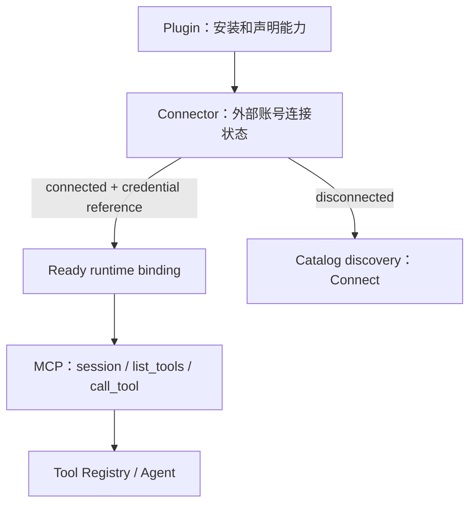

# 外部服务连接系统

> 领域实现：[`zeta-rs/connectors/`](../zeta-rs/connectors/README.md)，Rust crate：
> `zeta_connectors`。
> Plugin/discovery 集成：[`zeta-rs/ext/connectors/`](../zeta-rs/ext/connectors/README.md)。
> Plugin 分发边界：[`plugins.md`](plugins.md)。MCP 调用边界：[`mcp.md`](mcp.md)。
> 当前状态：Connector domain 与 Plugin catalog projection 已实现；认证、持久化 authority、App Server
> API 和 ready binding runtime composition 尚未完成。

## 快速理解

Connector 管理“外部服务是否已经连接以及连接对应哪个账号”；它位于 Plugin declaration 与 MCP
runtime 之间。Connector 不要求用户登录 Zeta，连接的账号是 GitHub、Slack、Google Drive 等外部
产品账号。

| 用户场景 | 系统发生什么 | 不会自动发生什么 |
| --- | --- | --- |
| 安装 GitHub Plugin | Plugin contribution 提供 GitHub Connector declaration | 不连接 GitHub、不启动 MCP |
| 查看未连接的 GitHub | Connector 以 `Connect` candidate 出现在 discovery | 不向 Agent 暴露 GitHub tools |
| 完成 GitHub OAuth | 认证 owner 保存 secret，并向 Connector 发布 non-secret account/reference | Connector 不读取 token bytes |
| Connector 成为 connected | ready MCP binding 可以由 host materialize | 不绕过 MCP policy 或 Tool approval |
| 用户断开 GitHub | connection generation 前进，ready binding 立即撤销 | 不删除 Plugin package 或 Thread 历史 |

## 1. 结论

系统边界固定为：

> Plugin 管扩展，Connector 管连接，MCP 管调用，Tool 是最终能力。



Plugin 可以没有 Connector；Connector 在 disconnected 状态下仍是合法产品对象；MCP 只有获得 ready
binding 后才可启动。当前 binding 使用 MCP server declaration，但 Connector domain 不拥有 MCP
transport/session。

## 2. 所有权边界

| Owner | 拥有 | 明确不拥有 |
| --- | --- | --- |
| `zeta-plugins` | package、manifest、`ConnectorContribution`、安装/启用 provenance | 外部账号、OAuth、MCP session |
| `zeta-connectors` | identity、definition、account projection、状态机、generation-bound snapshot | Plugin、secret storage、I/O runtime |
| `zeta-connectors-extension` | Plugin 转换、Plugin provenance、discovery 与 ready-binding projection | 领域状态机、live authentication/MCP |
| Connector auth adapter | connect/revoke、OAuth callback、credential refresh/materialization | Plugin package、Tool execution |
| `zeta-mcp-extension` | ready declaration 到 live MCP tools runtime 的 host integration | Connector account authority |
| `zeta-tools` / Core | Tool registry、approval、durable execution | Connect/OAuth lifecycle |

Connector account 不是 Zeta account。Zeta login 只能作为云端 directory、同步或 managed policy 的可选
adapter；不得成为 `ConnectorId`、connection generation 或本地 runtime readiness 的前置条件。

## 3. 当前执行路径

当前已经实现的路径是：

1. `PluginManifest` 校验 Connector 引用同包的 MCP contribution。
2. `ConnectorCatalog::from_manifests` 转换为 backend-neutral `ConnectorDefinition`。
3. `ConnectorSnapshot` 以独立 snapshot/connection generation 校验状态迁移。
4. disconnected entry 投影为 catalog-only `Connect` candidate。
5. connected entry 投影为 ready MCP server ID，不直接产生 tool binding。

尚未完成的生产路径是：

```text
App Server connect command
  -> user confirmation / browser or API-key interaction
  -> authentication adapter
  -> zeta-secrets stores opaque bytes
  -> durable Connector authority commits account + credential reference
  -> ConnectorSnapshot publishes connected generation
  -> host materializes ready declaration through zeta-mcp-extension
  -> Tool Registry safe-point replacement
```

上述未完成路径是 Proposed，不能从现有 catalog tests 推断为产品可用。

## 4. 身份、凭据与 generation

| 值 | 含义 | 不能替代 |
| --- | --- | --- |
| `ConnectorId` | 一个 connectable product declaration | Plugin ID、account ID |
| `ConnectorAccountId` | provider 返回的外部 account/tenant identity | Zeta user ID |
| `ConnectorCredentialRef` | auth owner 可解释的 non-secret reference | access/refresh token bytes |
| `ConnectorConnectionGeneration` | connect/revoke attempt 的单调身份 | MCP catalog generation |
| `ConnectorSnapshotGeneration` | 一次 immutable Connector catalog projection | config revision、Tool registry generation |

连接完成必须引用当前 `Connecting` attempt 的 exact connection generation；disconnect 必须推进
connection generation；任何状态变化都必须同时推进 snapshot generation。这样晚到的 OAuth callback、
旧 refresh result 或旧 UI command 不能重新激活已撤销的 binding。

## 5. 安全与失败语义

- Connector snapshot 只持有 credential reference，不持有 secret bytes。
- disconnected、connecting 和 unavailable entry 都不能输出 ready runtime binding。
- connect/revoke command 必须由 durable authority 按 expected generation 复核，不能信任客户端 snapshot。
- MCP tool 仍经过普通 registry collision、policy、approval、durable Tool Call/Result 和 recovery。
- Plugin 验证只证明 declaration/package 合法，不证明外部服务可信或未来调用已批准。

## 6. 当前状态与后续阶段

| 能力 | 状态 |
| --- | --- |
| 纯 Connector identity/definition/binding | ✅ 已实现 |
| connection transition 与双 generation 防 stale | ✅ 已实现 |
| Plugin manifest → Connector domain projection | ✅ 已实现 |
| disconnected discovery / connected ready binding projection | ✅ 已实现 |
| durable installed/connection authority | 尚未完成 |
| OAuth/API-key connect、refresh、revoke | 尚未完成 |
| `zeta-secrets` credential materialization | 尚未完成 |
| App Server protocol、UI 与 interaction | 尚未完成 |
| ready binding → `zeta-mcp-extension` live composition | 尚未完成 |

下一阶段应先实现 durable Connector authority 和 typed connect/revoke App Server contract，再接认证
adapter；只有 authority 能稳定发布 ready snapshot 后，才把它接入 MCP safe-point composition。
