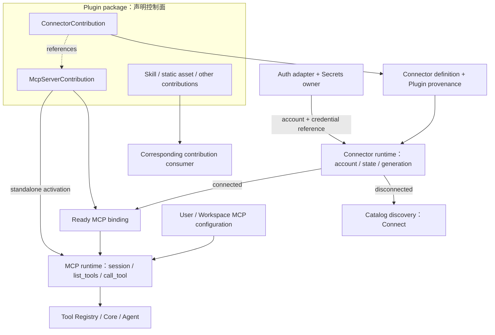
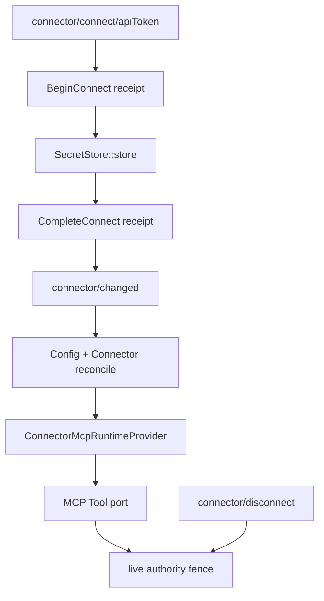

# 外部服务连接系统

> 领域实现：[`zeta-rs/connectors/`](../zeta-rs/connectors/README.md)，Rust crate：
> `zeta_connectors`。
> Plugin/discovery 集成：[`zeta-rs/ext/connectors/`](../zeta-rs/ext/connectors/README.md)。
> Plugin 分发边界：[`plugins.md`](plugins.md)。MCP 调用边界：[`mcp.md`](mcp.md)。
> 当前状态：Connector domain、SQLite authority、API-token connect/disconnect、App Server 协议、
> package-rooted Plugin activation、ready/standalone MCP composition、模型安全点 registry replacement、
> in-flight dispatch drain、OS keyring 与显式文件 `SecretStore`、OAuth PKCE 状态机和产品连接入口已实现。
> Desktop loopback 浏览器回调、通用 device poll、OAuth App Server 控制面、refresh/revoke、GitHub
> brokered PKCE 与 public-client device adapters 已接通；正式 package 已内置官方 Plugin Marketplace
> endpoint 与固定 TUF root，Connector 产品发行仍需注入真实 broker URL/client ID。

## 快速理解

Connector 管理“外部服务是否已经连接以及连接对应哪个账号”。在 Plugin 提供外部服务的
常见路径中，Plugin 声明 Connector 和 MCP server，Connector 在认证成功后发布就绪的 MCP 绑定。
这是 declaration 和 runtime 之间的数据流，不是 Plugin 在运行时包含 Connector、MCP session 或 Tool。
Connector 不要求用户登录 Zeta，连接的账号是 GitHub、Slack、Google Drive 等外部产品账号。

| 用户场景 | 系统发生什么 | 不会自动发生什么 |
| --- | --- | --- |
| 安装 GitHub Plugin | Plugin contribution 提供 GitHub Connector declaration | 不连接 GitHub、不启动 MCP |
| 查看未连接的 GitHub | Connector 以 `Connect` candidate 出现在 discovery | 不向 Agent 暴露 GitHub tools |
| 完成 GitHub OAuth | 认证 owner 保存 secret，并向 Connector 发布 non-secret account/reference | Connector 不读取 token bytes |
| Connector 成为 connected | ready MCP binding 可以由 host materialize | 不绕过 MCP policy 或 Tool approval |
| 用户断开 GitHub | connection generation 前进，ready binding 立即撤销 | 不删除 Plugin package 或 Thread 历史 |
| 用户直接配置 MCP server | 经过配置、凭据和策略解析后直接进入 MCP runtime | 不必须伪造 Plugin 或 Connector |

## 1. 结论

系统边界固定为：

> Plugin 管扩展分发，Connector 管外部账号连接，MCP 管协议会话与能力调用，Tool 是 Agent 最终消费的能力。

| 对象 | 回答的核心问题 | 产出 | 不拥有 |
| --- | --- | --- | --- |
| Plugin | “要给 Zeta 分发和启用哪些扩展贡献？” | 带版本、摘要和来源的 contribution declaration | 外部账号、OAuth 状态、MCP session |
| Connector | “这个外部产品连上了吗，连的是哪个账号？” | generation-bound connection state 和 ready runtime binding | Plugin package、secret bytes、MCP transport |
| MCP | “如何与 capability server 建立会话并发现、调用能力？” | session、capability catalog、绑定和调用结果 | Plugin/Connector authority、每次 Tool approval |
| Tool Registry / Core | “Agent 当前可以调用什么，这次调用是否允许？” | provider-independent Tool definition、approval 和 durable result | Plugin 安装、connect/OAuth lifecycle |



图中的连线表示合法的声明与运行时组合，不表示安装 Plugin 后会自动执行后续阶段。Plugin 可以没有
Connector；Plugin 或 User/Workspace 也可以独立声明 MCP server。只有“该 MCP server 需要一个已连接的
外部账号”时，才经过 Connector 路径；该路径只有在 connected 状态下才能发布 ready binding。
当前 binding 使用 MCP server declaration，但 Connector domain 不拥有 MCP transport/session。

### 1.1 关系是组合，不是运行时包含

- Plugin 包可以同时声明 `ConnectorContribution` 和被它引用的 `McpServerContribution`，但 Plugin manager 只负责验证、分发和激活这些声明。
- Connector runtime 消费 Connector declaration 并发布连接状态；OAuth/API-key 交互由认证 adapter 执行，secret bytes 由 Secrets owner 保存。
- Ready binding 只是“已可以 materialize 哪个 runtime”的 generation-bound 描述，不是 live MCP session 或 Tool binding。
- MCP runtime 消费 ready binding 或独立 MCP declaration，建立 session 并向统一 Tool Registry 贡献能力；Tool 不回归 Connector 或 Plugin 所有。

## 2. 所有权边界

| Owner | 拥有 | 明确不拥有 |
| --- | --- | --- |
| `zeta-plugins` | package、manifest、`ConnectorContribution`、安装/启用 provenance | 外部账号、OAuth、MCP session |
| `zeta-connectors` | identity、definition、account projection、状态机、generation-bound snapshot | Plugin、secret storage、I/O runtime |
| `zeta-connectors-extension` | Plugin 转换、Plugin provenance、discovery 与 ready-binding projection | 领域状态机、live authentication/MCP |
| Connector auth adapter | connect/revoke、OAuth callback、credential refresh/materialization | Plugin package、Tool execution |
| `zeta-mcp-extension` | ready declaration 到 live MCP tools runtime 的 host integration | Connector account authority |
| `zeta-tools` / Core | Tool registry、approval、durable execution | Connect/OAuth lifecycle |

Connector account 不是 Zeta account。Zeta login 只能作为云端 directory、同步或 managed policy 的可选
adapter；不得成为 `ConnectorId`、connection generation 或本地 runtime readiness 的前置条件。

## 3. 当前执行路径

当前 API-token 路径为：

1. `PluginActivationSnapshot::resolve` 将 exact installed package 固定为不可变激活快照；`ConnectorCatalog::from_activation` 从该快照投影带 package digest 的 `ConnectorDefinition`。
2. App Server 通过 `connector/list` 返回不含 credential reference 的状态；`connector/connect/apiToken` 接收一次性 secret DTO。
3. `ConnectorCredentialService` 先提交 `Connecting`，再把 token 写入 `SecretStore`，最后向 `ConnectorAuthority` 提交只含 account 与 opaque reference 的 `Connected`。
4. SQLite authority 在一个事务中追加状态事件与 retry receipt；重复 command ID 只重放完全相同的请求。
5. 本地 composition root 从激活快照自动构造 package-rooted MCP provider，并订阅 Config、Connector generation 与 MCP `tools/list_changed`；完整启动下一代 runtime 后替换 MCP tool port。
6. 每个 Connector MCP call 在 prepare 和真正 dispatch 前复核 connector ID、connection generation 与 definition digest；disconnect 提交和 dispatch 使用同一 authority lock 线性化，已开始调用先排空，后续调用被拒绝。



当前 `ConnectorOAuthService` 已实现随机 state、PKCE S256、exact redirect、一次性 callback、超时、
refresh/revoke 与 stale-generation 防护。`ConnectorDeviceOAuthService` 拥有通用 device-code 生命周期、
provider poll interval、`slow_down + 5s`、expiry/cancel 与同一 Connector authority transition；provider adapter
只负责 wire protocol。OAuth credential 在 SecretStore 中以 runtime access token + provider lifecycle bundle
封装，MCP materialization 只得到 access token，refresh/revoke adapter 只得到 lifecycle bundle。

GitHub 有三种产品 adapter：confidential direct adapter（host 注入 secret）、推荐的 brokered PKCE adapter
（client 不持有 GitHub App secret）和 public-client device adapter（无 client secret；GitHub 不提供对应
public-client remote revoke，因此 UI 只显示 local disconnect）。Desktop 按 `oauthMethods` 优先 browser、否则
device；browser host 与 TUI 可执行 device flow，user code 复制到 clipboard，且不进入 composer/history。

## 4. 身份、凭据与 generation

| 值 | 含义 | 不能替代 |
| --- | --- | --- |
| `ConnectorId` | 一个 connectable product declaration | Plugin ID、account ID |
| `ConnectorAccountId` | provider 返回的外部 account/tenant identity | Zeta user ID |
| `ConnectorCredentialRef` | auth owner 可解释的 non-secret reference | access/refresh token bytes |
| `ConnectorConnectionGeneration` | connect/revoke attempt 的单调身份 | MCP catalog generation |
| `ConnectorSnapshotGeneration` | 一次 immutable Connector catalog projection | config revision、Tool registry generation |

连接完成必须引用当前 `Connecting` attempt 的 exact connection generation；disconnect 必须推进
connection generation；任何状态变化都必须同时推进 snapshot generation。这样晚到的 OAuth callback、
旧 refresh result 或旧 UI command 不能重新激活已撤销的 binding。

## 5. 安全与失败语义

- Connector snapshot 只持有 credential reference，不持有 secret bytes。
- disconnected、connecting 和 unavailable entry 都不能输出 ready runtime binding。
- connect/revoke command 必须由 durable authority 按 expected generation 复核，不能信任客户端 snapshot。
- MCP tool 仍经过普通 registry collision、policy、approval、durable Tool Call/Result 和 recovery。
- Plugin 验证只证明 declaration/package 合法，不证明外部服务可信或未来调用已批准。

## 6. 当前状态与后续阶段

| 能力 | 状态 |
| --- | --- |
| 纯 Connector identity/definition/binding | ✅ 已实现 |
| connection transition 与双 generation 防 stale | ✅ 已实现 |
| Plugin manifest → Connector domain projection | ✅ 已实现 |
| disconnected discovery / connected ready binding projection | ✅ 已实现 |
| SQLite connection authority + exact retry receipts | ✅ 已实现 |
| definition/package digest 变化触发 reauthorization | ✅ 重启恢复与 live Plugin activation 更新均已实现 |
| API-token connect/disconnect + local secret cleanup | ✅ 已实现 |
| OAuth state/PKCE/exchange 编排 | ✅ 已实现 provider port、App Server RPC 与 Desktop loopback callback |
| refresh、远端 revoke | ✅ 已实现通用 lifecycle 与 GitHub adapter；远端失败保留本地连接供重试 |
| `zeta-secrets` memory/unavailable backend | ✅ 已实现 |
| OS keyring backend | ✅ 已实现并作为本地默认 Connector persistence |
| 显式文件 backend | ✅ 已实现，保持 explicit opt-in，不作为自动 fallback |
| App Server list/connect/disconnect + changed notification | ✅ 已实现 |
| Desktop API-token UI；TUI 列表/断开/通知刷新 | ✅ 已实现 |
| OAuth browser/device interaction | ✅ Desktop browser+device、browser host device、TUI device 已实现 |
| ready binding → `zeta-mcp-extension` composition + dispatch fence | ✅ 已实现（host-injected provider） |
| exact Plugin activation → Connector/MCP runtime provider | ✅ 已实现，支持 live install/enable/disable authority reconcile |
| MCP `tools/list_changed` → safe-point rebuild | ✅ 已实现 |

产品部署入口为 `LocalProductServicesConfig` / `--product-services PATH` /
`ZETA_PRODUCT_SERVICES_PATH`。该只读 JSON 可声明 TUF Marketplace roots、broker URL 和 public client ID，不允许
client secret；`trustedRoot` 必须是配置文件目录内的普通相对路径，distribution/broker base URL 必须是无
credential/query/fragment 且以 `/` 结尾的 HTTPS URL。普通 Plugin manifest 和 user config 不能提供这些发行信任材料。官方 Marketplace 的配置和 root 已由
package 从 `resources/product-services/` 携带，远端签名 metadata 与 package 由独立 registry 发布。下一阶段
是部署真实 broker 并增加其他服务 adapter；它们必须复用现有 authority、SecretStore、App
Server safe point 和 MCP dispatch fence，不得创建第二套 Connector 状态机。

```json
{
  "schemaVersion": 1,
  "marketplaces": [{
    "id": "zeta-official",
    "trust": "productManaged",
    "metadataBaseUrl": "https://marketplace.zeta.example/metadata/",
    "targetsBaseUrl": "https://marketplace.zeta.example/targets/",
    "trustedRoot": "marketplace-root.json"
  }],
  "connectorOauth": [{
    "type": "githubDevice",
    "connectorId": "openai/github:connector:account",
    "clientId": "PUBLIC_GITHUB_APP_CLIENT_ID",
    "scopes": ["read:user", "repo"]
  }]
}
```

第三方源使用 `"trust": "verifiedExternal"`，并必须同时提供 non-empty、无重复的
`"allowedPublishers": ["community-a"]`；签名 catalog 出现 scope 外 publisher 或两个远端源实际占用
同一 publisher namespace 时，App Server 启动失败。默认省略 `trust` 只为兼容旧产品文件，语义仍是
`productManaged`，不能同时填写 `allowedPublishers`。

使用 broker 时把 `type` 改为 `githubBrokered`，并增加 `brokerBaseUrl`；broker API 固定为
`v1/oauth/github/{authorize,token,revoke}`，response 必须带 provider-validated account identity。OAuth adapter
可先于对应 Plugin 安装而注册；它保持 dormant，直到 exact Connector contribution 进入 activation snapshot。
