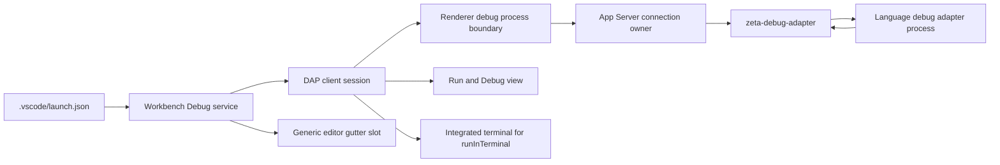

# 调试系统

> 状态：Code 产品已具备通用 DAP 调试闭环；Academic 不组装 Tasks、Testing 或 Debug。后端实现细节由 [`zeta-debug-adapter` README](../zeta-rs/debug-adapter/README.md) 拥有，Renderer 实现细节由 [Workbench Debug README](../desktop/src/zeta/workbench/services/debug/README.md) 拥有。

## 快速理解

Code 现在可以从 `.vscode/launch.json` 启动任意显式配置的 stdio 调试适配器，在编辑器 gutter 添加断点，并执行继续、暂停和单步；停住后可查看调用栈、作用域变量和适配器输出。它是“通用 DAP 客户端”，还不是 VS Code 那种带语言扩展生态的完整调试平台。

| 使用场景 | 当前结果 | 用户需要提供什么 |
| --- | --- | --- |
| 启动调试 | ✅ 支持 `launch` 与 `attach`，F5 启动/继续 | 显式 `debugAdapter.program` 和适配器参数 |
| 断点 | ✅ 编辑器 gutter 点击切换，启动后同步并显示确认状态 | 文件工作区 |
| 运行控制 | ✅ 继续、暂停、步过、步入、步出、停止 | 适配器支持相应请求 |
| 停住后检查 | ✅ 调用栈、作用域的变量、嵌套变量、输出 | 适配器返回对应 DAP 数据 |
| 适配器要求终端启动 | ✅ `runInTerminal` 委托给集成终端 | 可用终端 profile |
| 自动发现语言调试器 | ❌ 尚未实现 | 当前需要手工指定适配器程序 |
| Watch、表达式求值、调试控制台 | 尚未完成 | 后续增加 `evaluate` 与持久 Watch 模型 |
| 多会话、复合配置、异常断点 | 尚未完成 | 后续按真实消费场景扩展 |

## 一次调试

1. Code 产品入口静态导入 Tasks、Testing 与 Debug contrib，并分别向 browser、Electron renderer 与 Electron main 贡献调试传输；Academic 不导入这些 UI、服务、传输或 IPC 能力。
2. Debug service 读取并验证 `.vscode/launch.json`，展开工作区变量，然后要求 App Server 启动适配器。
3. App Server 同时校验可信工作区的可执行配置和进程执行能力，并把会话绑定到发起连接。
4. DAP client 执行 `initialize`、`launch`/`attach`、断点配置和 `configurationDone`；适配器要求 `runInTerminal` 时委托现有终端服务。
5. 停住事件驱动调用栈和变量视图；断点响应更新 gutter 的确认状态；断开连接、工作区切换、撤销信任或连接关闭都会清理进程。

## 所有权边界

| 能力 | Editor | Workbench Debug | Platform/App Server | `zeta-debug-adapter` |
| --- | --- | --- | --- | --- |
| 可组合 gutter 槽 | ✅ | 使用 | ❌ | ❌ |
| 断点语义与 UI | ❌ | ✅ | 传输 | ❌ |
| launch 配置与 DAP 客户端 | ❌ | ✅ | 传输 | ❌ |
| `runInTerminal` 产品组合 | ❌ | ✅，委托 TerminalService | 终端传输 | ❌ |
| 连接权限与可信工作区 | ❌ | 请求 | ✅ | 消费能力 |
| 进程、framing、缓冲与回收 | ❌ | 消费 | 连接包装 | ✅ |

Editor 不得 import Debug service；它只提供无领域语义的 gutter decoration contract。共享 Workbench 不得通过 `product.id` 枚举 Code 功能，产品入口通过 contrib 安装服务和视图。共享 Renderer Host 与 Electron Main 也不得默认注册调试传输，必须由 Code 产品入口显式贡献。后端 runtime 不得解析 launch 配置或拥有连接 ID。

## 当前实现与后续演进

当前已实现：显式 stdio adapter、可信工作区 gate、连接级会话归属、DAP 有界 framing/分页、初始化与请求配对、断点、运行控制、调用栈、变量、输出、`runInTerminal`、Code-only 组装和断点 gutter。

近期应补：断点持久化、Watch/`evaluate`、异常断点、source reference、线程选择器和更完整的变量树。中期才考虑多会话、compound configuration、调试器扩展贡献点和 socket adapter。没有真实消费方之前，不应把语言专属 adapter discovery 或 VS Code 全量 Debug API 预先复制进来。

长期不变量是：Editor 只提供可复用显示与交互能力；Debug 产品语义归 Workbench contrib；进程与 framing 归后端通用 runtime；Academic 是否获得某项能力由静态组装决定，而不是运行时隐藏。
