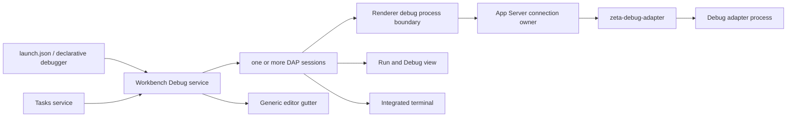

# 调试系统

> 状态：Code 产品已具备通用 DAP 调试平台；Academic 不组装 Tasks、Testing 或 Debug。后端实现细节由 [`zeta-debug-adapter` README](../zeta-rs/debug-adapter/README.md) 拥有，Renderer 实现细节由 [Workbench Debug README](../desktop/src/zeta/workbench/services/debug/README.md) 拥有。

## 快速理解

Code 可以从 `.vscode/launch.json` 启动或附加到一个调试目标，并同时运行多个 DAP 会话。用户可以设置持久化行断点、选择线程和栈帧、递归展开变量、维护 Watch、在调试控制台求值、启用异常断点、读取适配器提供的虚拟源码，以及启动 compound 配置。调试前后的 Tasks 由 Workbench 编排；后端只负责受信任的适配器进程和 DAP framing。

| 使用场景 | 当前结果 | 关键边界 |
| --- | --- | --- |
| 启动或附加 | ✅ `launch`、`attach`、重启、停止和 `runInTerminal` | Workbench 解释配置；后端启动适配器 |
| 断点 | ✅ 工作区持久化行断点、适配器确认状态、异常断点 | Editor 只提供通用 gutter |
| 停住后检查 | ✅ 线程选择、调用栈、作用域、递归变量树和 `sourceReference` | DAP Session 拥有请求语义 |
| Watch 与控制台 | ✅ 持久 Watch、`evaluate` 和 REPL 输出 | Watch 持久；求值结果与输出临时 |
| 多目标调试 | ✅ 多会话、会话切换、compound 和 `stopAll` | 后端会话仍按连接隔离 |
| 调试任务 | ✅ `preLaunchTask`、`postDebugTask` | Tasks 负责执行和退出状态 |
| 适配器发现 | ✅ 声明式 `contributes.debuggers`，仍可显式写 `debugAdapter` | 不执行扩展 JavaScript |
| 完整 VS Code Debug 扩展 API | 非目标 | Zeta Host RPC v1 不是 VS Code/Node Extension API；兼容层需独立立项 |

## 一次调试如何执行

1. `DebugService` 读取并验证 `.vscode/launch.json`。配置可显式声明适配器命令，也可按 `type` 从声明式扩展注册表解析；compound 只在 Workbench 中展开。
2. 如果存在 `preLaunchTask`，Tasks 必须先返回成功；缺失、歧义、失败或取消都会阻止调试启动。
3. App Server 校验同一工作区的可执行配置与进程执行能力，启动 stdio 适配器，并把会话归属绑定到发起连接。
4. DAP Session 完成 `initialize`、`launch`/`attach`、行断点、异常断点和 `configurationDone`。反向 `runInTerminal` 请求委托给现有 Terminal service。
5. `stopped` 事件驱动线程、栈帧、作用域、变量、Watch 和源码请求。多个会话独立保存运行状态，视图只选择其中一个作为当前检查对象。
6. 适配器退出、用户停止、工作区切换、信任撤销或连接关闭都会回收进程。Workbench 随后运行对应的 `postDebugTask`。

## 所有权边界

| 能力 | Editor | Workbench Debug | Platform / App Server | `zeta-debug-adapter` |
| --- | --- | --- | --- | --- |
| 通用 gutter 槽位 | ✅ 拥有 | 投影断点 | ❌ | ❌ |
| 断点、Watch、会话和 DAP 客户端语义 | ❌ | ✅ 拥有 | 传输 | ❌ |
| launch、compound 与 Tasks 编排 | ❌ | ✅ 拥有 | ❌ | ❌ |
| `runInTerminal` 产品组合 | ❌ | ✅ 委托 Terminal | 终端传输 | ❌ |
| 连接权限与可信工作区 | ❌ | 请求 | ✅ 拥有 | 消费能力 |
| 进程、framing、缓冲与回收 | ❌ | 消费 | 连接包装 | ✅ 拥有 |

Editor 不得 import Debug service；它只提供无领域语义的 gutter decoration contract。后端 runtime 不得解析 launch 配置、持久化断点、决定当前线程或拥有 Workbench 会话选择。声明式扩展服务只贡献经过验证的适配器命令元数据；Zeta-native executable Host v1 是另一条逐扩展进程、Plugin + Workspace authority 与 brokered provider 边界，当前产品接入状态见 [`editor-extensions.md`](editor-extensions.md)。

## 持久性与失败语义

工作区存储保留行断点、Watch 表达式和按适配器类型划分的异常过滤器。适配器确认状态、调用栈、变量、控制台输出和活跃会话不会持久化。切换工作区时先保存旧状态，再恢复新工作区状态并停止旧会话。

compound 启动中任一配置失败时，已经启动的会话会回滚。自然退出和主动停止都只执行一次 `postDebugTask`。声明式适配器被卸载后，Workbench 会先清空旧 launch 候选再重新解析，避免继续执行已经失效的命令。

## 当前实现与后续演进

当前已实现：可信 stdio adapter、连接级归属、有界 framing/分页、显式和声明式适配器解析、初始化与请求配对、持久行断点、异常断点、线程/栈/递归变量、Watch/`evaluate`、调试控制台、虚拟源码、多会话、compound、restart、Tasks 生命周期、`runInTerminal`、Code-only 组装和断点 gutter。

仍属于后续扩展：条件/日志/函数/数据/指令断点，socket/server adapter，跨进程会话恢复，以及 VS Code Debug Extension API 兼容层。Zeta Host v1 的 runtime core 已存在，但 production enforcing launcher 和跨层 Debug factory bridge 未完成验证前，不能把声明式适配器发现描述成可执行第三方扩展运行时。
