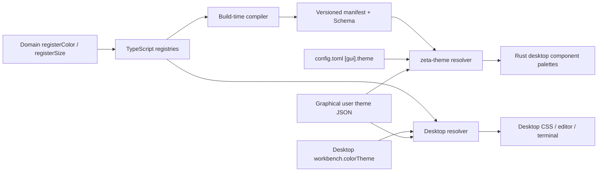

# Design Token：图形界面主题系统边界

> 本文是 Desktop 与 Rust 桌面端主题、design token 和用户主题格式的 canonical 文档。完整 token 清单由构建器生成在 [`resources/design-tokens/design-tokens.md`](../resources/design-tokens/design-tokens.md)，用户主题写法见 [`theme-authoring-template.md`](theme-authoring-template.md)。Zeta Code 终端主题由 [`zeta-code/tui/README.md`](../zeta-code/tui/README.md) 独立说明，不属于本文的共享契约。

## 快速理解

Desktop TypeScript registry 是图形界面 token 的唯一声明目录。构建器把保留别名和默认值依赖的 manifest、Schema 与模板生成到 `resources/design-tokens/`；Desktop 与 `zeta-theme` 分别读取同一契约，生成不可变主题快照并交给各自的图形组件。Zeta Code TUI 不读取 TypeScript registry、生成物或 `zeta-theme`。

| 想改变什么 | 应该修改哪里 | 不应该怎么做 |
| --- | --- | --- |
| Desktop 或 Rust 桌面端组件的语义颜色 | 修改组件所有者注册的 token | 在组件中复制十六进制颜色 |
| 图形界面的整套主题外观 | 切换主题入口或覆盖公开 token | 重写组件选择器 |
| 编辑器语法颜色 | 覆盖 `editor.token.*Foreground` | 让解析器携带固定 RGB |
| 编辑器折叠状态 | 覆盖 `editor.foldBackground`、`editor.foldPlaceholderForeground`、`editorGutter.foldingControlForeground` | 在组件或 `[gui]` 中硬编码折叠颜色 |
| Zeta Code TUI 外观 | 修改 `zeta-code/tui/src/render/palette.rs` 或 TUI 用户主题 JSON | 在 `zeta-ts` 注册 `tui.*` token |
| 跟随操作系统明暗模式 | 选择 `system` | 维护第四套 system 主题值 |

## 所有权

| 边界 | Owner | 职责 |
| --- | --- | --- |
| 通用 RGBA 运算 | `src/zeta/base/common/color.ts` | 解析、混合、透明度和字符串化；不感知主题或 Workbench |
| token 定义与依赖解析 | `zeta-ts/src/zeta/platform/theme/common` | 注册颜色和尺寸，拒绝重复 ID，解析别名与变换 |
| 语言中立契约 | `resources/design-tokens/` | 保存版本化 manifest、图形界面主题入口、用户主题 Schema、模板和跨运行时 fixture |
| Desktop 快照 | `colorTheme.ts` | 将明暗方案、覆盖值和注册目录编译为只读颜色与尺寸表 |
| Rust 桌面端快照与加载 | `zeta-rs/theme` | 嵌入同一 manifest，严格解析图形界面用户主题，并解析 GUI 交给它的主题选择 |
| GUI 主题偏好 | profile `config.toml` 的 `[gui].theme` | GUI 负责默认值与校验；配置后端只保存 `[gui]` 键值表 |
| 图形界面用户主题 | profile root 的 `themes/*.json` | 保存符合共享 Schema 的主题文档 |
| Zeta Code TUI 主题 | `zeta-code/tui/src/theme`、`zeta-code/tui/src/render/palette.rs` | 拥有内置调色板、终端色彩降级、TUI 用户主题及 `[tui].theme` 的解释与校验 |
| 离线治理 | `tokenCompiler.ts` 与 `build/desktop/compileDesignTokens.ts` | 校验所有明暗方案并生成共享图形界面契约 |

`src/zeta/base` 不引用主题平台或 Workbench。TUI 也不反向引用 TypeScript 前端或图形界面主题 crate。

## 端到端模型

注册表保留声明顺序，因此生成物稳定。颜色引用可以指向另一颜色 token，也可以使用透明、明暗、混合和不透明化变换。未知引用、未知覆盖、重复 ID、循环依赖或透明度契约不满足都会失败，不做猜测。

Zeta Code 走完全独立的主题内容路径：配置后端原样保存 `<profile>/config.toml` 的 `[tui]` 表，TUI 解释其中的 `theme`；`ThemeResource` 只读取 `<profile>/zeta-code/themes/*.json`，`ThemePalette` 形成完整 TUI 调色板，`RenderTheme` 再按 TrueColor、ANSI-256、ANSI-16 或 Monochrome 能力转换为终端颜色。这条路径不共享图形界面 manifest、主题文件或外观字段。

## 调用方契约

- 图形界面新语义必须注册新 ID；组件不能通过复制某个十六进制值表达“看起来一样”。
- 一个 token 只有一个 owner。owner 负责默认值、描述、弃用路径和视觉回归。
- 图形界面主题是已解析快照，消费层不能修改快照或自行解释别名与变换。
- 编辑器解析器只发布 `CodeEditorTokenRole`；颜色在绘制时由当前 `CodeEditorStyle` 决定。
- 图形界面注册或默认值变更后运行 `pnpm tokens:generate`，提交 `resources/design-tokens/` 生成物。
- TUI 语义颜色只在 TUI 调色板和 TUI 用户主题字段中增加，不进入 `ColorId`、共享 Schema、`zeta-theme::tokens` 或 `theme-entries.json`。

## 当前状态

- 图形界面支持 `light`、`dark` 与跟随操作系统的 `system` 偏好；`theme-entries.json` 只包含 `zeta` 和 `app` 图形界面入口。
- Desktop 从 profile `configuration.json` 读取 `workbench.colorTheme`；Rust GUI 解释 `config.toml` 的 `[gui].theme`。两者都从 profile root 的 `themes/*.json` 加载图形界面用户主题。
- 不可变颜色对象、注册贡献、主题快照、生成产物和跨运行时 conformance fixture 已实现。
- Zeta Code 的内置 dark、light、colorblind、ANSI 调色板及用户主题由 TUI 自己维护；TUI 的 `/theme` 更新 `config.toml` 根级 `[tui]` 表中的 `theme`。

## 当前限制

- 图形界面的高对比度默认值仍继承对应明暗方案。
- Desktop 保存和预览可即时更新；Rust 桌面端在进程启动时加载外部用户主题文件。
- Rust GUI 的界面字体族与基础字号、编辑器字体族、字号和行高由 `[gui]` 管理；主题 token 定义界面字体角色之间的字号比例与 regular、medium、semiBold 强调层级。
- 图形界面用户主题只能覆盖已注册 token，不能在 JSON 中注册新的产品语义。
- TUI 用户主题使用独立、较小且严格的字段集合，不兼容图形界面主题 JSON；需要分别安装。

## 长期不变量

- base 层保持领域无关且不存在反向依赖。
- 图形界面的 token ID、CSS 名称和 owner 变更属于兼容性变更。
- TypeScript registry 是图形界面声明 authority，生成 manifest 是 Desktop 与 Rust 桌面端之间的契约。
- Zeta Code TUI 的主题是产品自有能力；不得从 TS registry、`resources/design-tokens`、`zeta-theme` 或 `configuration.json` 恢复依赖。
- 未知、循环或不完整数据必须快速失败；不存在“缺失时猜一个颜色”的恢复语义。
