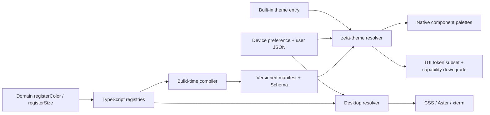

# Design Token：主题系统边界与演进

> 本文是 Zeta 主题与 design token 跨模块架构的 canonical 文档。完整 token 清单由构建器生成在 [`resources/design-tokens/design-tokens.md`](../resources/design-tokens/design-tokens.md)。
> 新增具体主题请使用 [`theme-authoring-template.md`](theme-authoring-template.md)。
> selector、交互状态与组件/Part CSS 的 canonical 所有权见 [`ui-styling-ownership.md`](ui-styling-ownership.md)。

## 快速理解

Zeta 采用“单一声明目录、共享版本化 contract、各宿主独立投影”的模型。Desktop TypeScript registry 是 token 声明的 authoring authority；构建器把保留 alias/default graph 的 manifest、Schema 和模板生成到 `resources/design-tokens/`。Desktop resolver 与 Rust `zeta-theme` 都读取这份 contract，分别产生不可变快照，再投影给 CSS、Aster CodeEditor、Native UI 或 Ratatui。`system` 只选择具体明暗方案，不是第四套主题数据。

| 想改变什么 | 应该修改哪里 | 不应该怎么做 |
| --- | --- | --- |
| 一个组件的语义颜色 | 修改或新增该组件所有者注册的 token | 在组件 CSS 中复制十六进制颜色 |
| 整套主题外观 | 切换主题入口或覆盖公开 token | 重写组件 selector |
| Native/CodeEditor 语法颜色 | 覆盖 `editor.token.*Foreground` | 让 parser 或 CodeEditor token 携带固定 RGB |
| TUI 外观 | 覆盖 TUI 消费的共享子集；必要时设置 `tui.colorTheme` | 要求终端实现全部 Desktop 视觉能力 |
| 跟随操作系统明暗模式 | 选择 `system` | 维护第四套 system 主题值 |
| 增加新的视觉值类型 | 有真实跨组件消费者后增加独立注册表 | 把阴影、字体或动效伪装成颜色 |

## 所有权

| 边界 | Owner | 职责 |
| --- | --- | --- |
| 通用 RGBA 运算 | `src/zeta/base/common/color.ts` | 解析、混合、透明度和字符串化；不感知主题或 workbench |
| token 定义与依赖解析 | `platform/theme/common` | 注册颜色/尺寸、拒绝重复 ID、解析别名与变换、检测循环和无效引用 |
| token domain | `platform/theme/common/colors`、`sizes` | 按消费语义声明 token、默认值、owner 和说明 |
| 语言中立 contract | `resources/design-tokens/` | 保存版本化 manifest、主题入口、用户主题 Schema/模板和跨运行时 conformance fixture |
| Desktop 快照 | `colorTheme.ts` | 将 scheme、覆盖值和注册目录编译为只读颜色/尺寸表 |
| Rust 快照与加载 | `zeta-rs/theme` | 嵌入同一 manifest，严格解析用户 JSON，选择 Graphical/Terminal 偏好并产生 RGBA snapshot |
| 宿主投影 | Desktop theme binding、Native `shell_style`、TUI `ui/theme` | 把 snapshot 转成宿主组件公开的 palette/style；不注册新的产品语义 |
| device-local 偏好 | `configuration.json` 与 `themes/*.json` | `workbench.colorTheme` 供图形宿主，`tui.colorTheme` 可选且回退到前者；不进入 Agent config/store |
| 离线治理 | `tokenCompiler.ts` 与 `scripts/compile-design-tokens.mjs` | 校验所有 scheme，生成 manifest、Schema、模板和目录 |

`src/zeta/base` 不引用主题平台或 workbench。颜色数学保持通用，注册、用户偏好和产品语义都位于更高层。

## 端到端模型

注册表保留声明顺序，因此生成物与 CSS 投影稳定。颜色引用可以指向另一颜色 token，也可以使用透明、明暗、混合和不透明化变换。解析采用带路径的深度优先遍历；未知引用、未知覆盖、重复 ID、循环依赖或透明度契约不满足都会失败，而不是静默回退。

## 调用方契约

- 新语义必须注册新 ID；组件不能通过复制某个十六进制值表达“看起来一样”。
- 一个 token 只有一个 owner。owner 负责默认值、描述、弃用路径和视觉回归。
- ID 采用点分语义命名，CSS 名称由系统稳定生成，例如 `button.primaryBackground` 对应 `--zeta-button-primary-background`。
- CSS 消费颜色与标准标量尺寸，包括布局尺寸、字体大小和字重；需要颜色值的 JavaScript 消费者使用 `IColorTheme.getColor()` 或 `getColorCss()`。
- 主题是已解析快照。消费层不能修改快照，也不能自行解释别名或变换。
- parser/highlighter 只发布 `CodeEditorTokenRole`；颜色在绘制时由当前 `CodeEditorStyle` 解析，因此换主题不要求重新分析文本。
- 新注册或默认值变更后运行 `pnpm tokens:generate`，提交 `resources/design-tokens/` 生成物。

## 当前状态/已实现

- `light`、`dark` 与跟随操作系统的 `system` 偏好。
- 语言中立的 `theme-entries.json` 为 Rust `ThemeLoader` 提供 `zeta`（Electron Desktop）、
  `zeta-code`（TUI）与 `zeterm`（纯 Rust Desktop）默认入口；入口只覆盖统一 token，不创建产品
  token 或组件分支。Zeta Code 另有 `zeta-code-colorblind` 与 `zeta-code-ansi` 入口；前者把 diff
  成功/失败从红绿对改成蓝橙对，后者由 TUI 强制投影为 ANSI 16 色。标准与 colorblind syntax/diff
  角色取值跟随 [GitHub VS Code theme](https://github.com/primer/github-vscode-theme) 和
  [Primer functional color](https://www.primer.style/product/primitives/color/) 的经典语义，但值已固化在
  Zeta 自己的 token entry 中，不形成运行时主题依赖。`zeta-code` 保留蓝紫 highlight；TUI 的
  `system` 默认必须通过 `with_default_entry("zeta-code")` 选择它。
- Desktop、Native 和 TUI 使用同一 device root 下的 `configuration.json` 与 `themes/*.json`；每个错误文件独立隔离，内置主题始终可回退。Native `zeterm` 在没有显式用户主题时选择 `zeterm` 入口。
- 127 个语义颜色 token 与 23 个标准标量尺寸 token；四种 `ColorScheme` 均在编译期解析，高对比度当前继承对应明暗默认值。
- 不可变颜色对象、注册贡献、主题快照和生成产物。
- Aster/Native CodeEditor 使用 source-neutral `editor.token.*` 角色；旧 `editor.semanticToken.*` 仅作为兼容覆盖入口。
- Native shell、composer、terminal ANSI、scrollbar 和 multi-diff editor 已由共享 snapshot 构造组件 palette；没有宿主 selector 或 parser 固定色。
- TUI chrome 只消费 accent、chrome、error/success/warning、muted 和 highlight；Theme Pane preview
  额外消费有限的 syntax/diff 子集，并按 TrueColor、ANSI-256、ANSI-16、Monochrome 确定性降级。
- Desktop Terminal 使用完整 terminal 前景、背景、光标和 ANSI 16 色 token；legacy editor runtime 仅保留迁移期兼容同步，Aster Text Engine 是默认文本编辑器。
- Electron renderer 通过受校验的 window-theme IPC 将标题栏背景和按钮颜色投影到主进程；Terminal canvas 使用当前编辑器背景，不依赖 xterm 黑色回退。
- Desktop 与 Rust resolver 共同执行 `theme-conformance.json`，防止 alias、变换、量化或兼容映射发生跨语言漂移。

## 当前状态 limitation /当前限制

- 高对比度使用明暗默认值回退，尚未提供独立视觉设计；类型、解析路径和 manifest 已保留独立 scheme。
- Desktop 的保存/预览可即时更新；Native 与 TUI 当前在进程启动时加载一次，外部文件修改需要重启对应宿主。
  这是当前宿主生命周期边界；`zeta code` 产品文档未要求外部主题热重载，因此不构成 TUI backlog。
- `tui.colorTheme` 当前有 typed configuration contract，但尚无 Settings UI；TUI 可用 `/theme` 打开
  不带搜索的八项 Zeta Code Theme Pane，用 Enter 原子保存、即时切换并返回主界面，也可用 `/theme <id>` 快速
  切换；Theme Pane 的 syntax/diff preview 读取同一 resolved snapshot，切换不追加 transcript notice；
  缺失时回退到 `workbench.colorTheme`。
- 字体族和行高仍由平台或组件 CSS 管理；字体大小与字重作为 `fontSize.*`、`fontWeight.*` 标量尺寸注册。
- 颜色和标量尺寸是当前已实现 token kind；阴影和动效应在出现真实跨组件消费者后增加独立注册表，不能伪装成颜色或尺寸。
- 用户主题只能覆盖已封存 catalog 中的 token，不能在 JSON 中注册新的产品语义。运行期动态插件如果需要新增 token，应先引入显式 catalog revision 与快照重编译，不应直接让旧快照变为可变对象。

## 长期不变量

- base 层保持领域无关且不存在反向依赖。
- token ID、CSS 投影名称和 owner 变更属于兼容性变更。
- 同一宿主内所有组件必须消费同一主题快照；不同语言 runtime 必须消费同一版本化 manifest 并通过共享 fixture 验证一致性。
- TS registry 是声明 authority，生成 manifest 是跨语言 runtime contract；Rust 不维护第二份默认颜色表，宿主中的常量只能作为 manifest 无法加载时的安全 fallback。
- TUI 部分接入是明确 contract，不是未完成的 Desktop 复制：新增 TUI token 消费必须有真实终端语义并定义能力降级。
- 未知、循环或不完整数据必须快速失败；不存在“缺失时猜一个颜色”的恢复语义。
