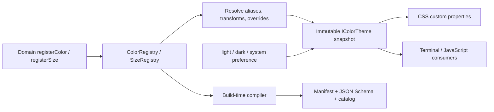

# Design Token：主题系统边界与演进

> 本文是 Zeta 主题与 design token 跨模块架构的 canonical 文档。完整 token 清单由构建器生成在 [`desktop/generated/design-tokens/design-tokens.md`](../desktop/generated/design-tokens/design-tokens.md)。
> 新增具体主题请使用 [`theme-authoring-template.md`](theme-authoring-template.md)。
> selector、交互状态与组件/Part CSS 的 canonical 所有权见 [`ui-styling-ownership.md`](ui-styling-ownership.md)。

## 快速理解

Zeta 采用“注册表优先、编译器兜底”的两阶段模型。功能模块注册有稳定 ID、owner、描述和默认值的语义 token；主题创建时将 token 引用图与主题覆盖编译为不可变快照；浏览器层再把同一快照投影给 CSS、Terminal 等消费者。用户选择 `light`、`dark` 或 `system`，其中 `system` 只负责跟随操作系统并选择一个具体快照，不是第四套主题数据。

| 想改变什么 | 应该修改哪里 | 不应该怎么做 |
| --- | --- | --- |
| 一个组件的语义颜色 | 修改或新增该组件所有者注册的 token | 在组件 CSS 中复制十六进制颜色 |
| 整套主题外观 | 覆盖公开 token | 重写组件 selector |
| 跟随操作系统明暗模式 | 选择 `system` | 维护第四套 system 主题值 |
| 增加新的视觉值类型 | 有真实跨组件消费者后增加独立注册表 | 把阴影、字体或动效伪装成颜色 |

## 所有权

| 边界 | Owner | 职责 |
| --- | --- | --- |
| 通用 RGBA 运算 | `src/zeta/base/common/color.ts` | 解析、混合、透明度和字符串化；不感知主题或 workbench |
| token 定义与依赖解析 | `platform/theme/common` | 注册颜色/尺寸、拒绝重复 ID、解析别名与变换、检测循环和无效引用 |
| token domain | `platform/theme/common/colors`、`sizes` | 按消费语义声明 token、默认值、owner 和说明 |
| 主题快照 | `colorTheme.ts` | 将 scheme、覆盖值和注册目录编译为只读颜色/尺寸表 |
| 浏览器与原生投影 | `themeStyles.ts`、`windowTheme.contribution.ts` | 把当前快照映射为 `--zeta-*`、`color-scheme` 和 Electron 标题栏按钮区 |
| 用户偏好 | `workbench/browser/theme.ts` | 持久化并解析 `light`、`dark`、`system`，监听系统变化 |
| 离线治理 | `tokenCompiler.ts` 与 `scripts/compile-design-tokens.mjs` | 校验所有 scheme，生成 manifest、schema 和目录 |

`src/zeta/base` 不引用主题平台或 workbench。颜色数学保持通用，注册、用户偏好和产品语义都位于更高层。

## 端到端模型

注册表保留声明顺序，因此生成物与 CSS 投影稳定。颜色引用可以指向另一颜色 token，也可以使用透明、明暗、混合和不透明化变换。解析采用带路径的深度优先遍历；未知引用、未知覆盖、重复 ID、循环依赖或透明度契约不满足都会失败，而不是静默回退。

## 调用方契约

- 新语义必须注册新 ID；组件不能通过复制某个十六进制值表达“看起来一样”。
- 一个 token 只有一个 owner。owner 负责默认值、描述、弃用路径和视觉回归。
- ID 采用点分语义命名，CSS 名称由系统稳定生成，例如 `button.primaryBackground` 对应 `--zeta-button-primary-background`。
- CSS 消费颜色和标准布局尺寸；需要颜色值的 JavaScript 消费者使用 `IColorTheme.getColor()` 或 `getColorCss()`。
- 主题是已解析快照。消费层不能修改快照，也不能自行解释别名或变换。
- 新注册或默认值变更后运行 `pnpm tokens:generate`，提交生成的 manifest、schema 和目录。

## 当前状态/已实现

- `light`、`dark` 与跟随操作系统的 `system` 偏好。
- 启动时发现并隔离加载 `userData/themes/*.json` 用户主题；用户主题无需重新构建 App。
- 61 个语义颜色 token，包含别名依赖；四种 `ColorScheme` 均在编译期解析，高对比度当前继承对应明暗默认值。
- 6 个标准布局尺寸 token，通过同一主题绑定投影到 CSS。
- 不可变颜色对象、注册贡献、主题快照和生成产物。
- Monaco 按当前 scheme 同步；Terminal 从主题查询 API 读取颜色。
- Electron renderer 通过受校验的 window-theme IPC 将标题栏背景和按钮颜色投影到主进程；Terminal canvas 使用当前编辑器背景，不依赖 xterm 黑色回退。
- 单元测试覆盖颜色运算、重复注册、依赖循环、未知引用、覆盖校验、尺寸序列化、快照和 DOM 恢复。

## 当前状态 limitation /当前限制

- 高对比度使用明暗默认值回退，尚未提供独立视觉设计；类型、解析路径和 manifest 已保留独立 scheme。
- 字体族仍由平台 CSS 按操作系统选择，不属于当前尺寸注册表。
- 颜色和尺寸是当前已实现 token kind；阴影、排版和动效应在出现真实跨组件消费者后增加独立注册表，不能伪装成颜色或尺寸。
- 用户主题只能覆盖已封存 catalog 中的 token，不能在 JSON 中注册新的产品语义。运行期动态插件如果需要新增 token，应先引入显式 catalog revision 与快照重编译，不应直接让旧快照变为可变对象。

## 长期不变量

- base 层保持领域无关且不存在反向依赖。
- token ID、CSS 投影名称和 owner 变更属于兼容性变更。
- CSS 与 JavaScript 必须消费同一主题快照。
- 运行期解析与构建期编译共享同一注册数据和解析器，不能维护第二份手写主题表。
- 未知、循环或不完整数据必须快速失败；不存在“缺失时猜一个颜色”的恢复语义。
