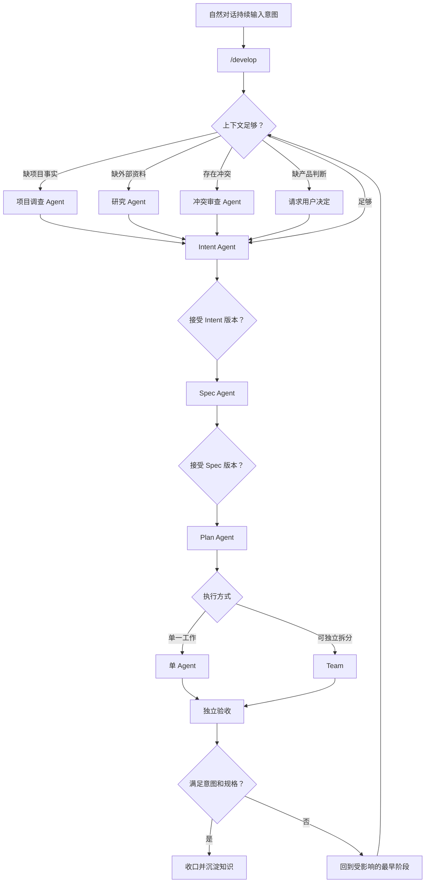

# Zeta 意图驱动的 Agent 开发系统

> 状态：Proposed（2026-09-02）。本文是 `/develop` 流程、产物和状态机的唯一开发设计文档；内置角色定义由 `agents.md` 维护。
> 文档所有权：本文拥有从自然对话到意图、规格、计划、实施、验收和收口的完整产品流程，以及阶段 Agent、上下文交付、版本失效、Slash Command 和 Team 的关系。内置阶段 Agent 与私有 Agent 的 ID、提示词、工具、能力和启动范围由 [`agents.md`](agents.md#52-develop-阶段角色) 维护；Slash Command 通用边界见 [`slash-commands.md`](slash-commands.md)，Agent 树见 [`core-multi-agent.md`](core-multi-agent.md)，可靠多 Agent 开发见 [`multi-agent-development.md`](multi-agent-development.md)，上下文选择与压缩见 [`core-context.md`](core-context.md)。

本文正在设计一个系统。`zeta.md`、`intent.md`、`spec.md` 和 `plan.md` 是该系统未来读取或产生的开发产物，不用于把当前系统设计拆成四份自我描述的文档。

本文不作为运行时提示词直接载入 Team。`/develop` 是用户启动或恢复开发流程的入口，持久化流程拥有阶段、产物版本和验收状态；只有具体阶段适合多个 Agent 独立协作时，流程才建立 Team，并向其交付已经固定的上游产物与工作契约。

## 快速理解

用户先通过自然对话表达问题、痛点和期望结果，再用 `/develop` 把截至当前对话位置的内容交给一个可暂停、可恢复的开发流程。系统先确认上下文是否足够，由专门的 Intent Agent 提炼意图；随后按已接受版本形成规格和计划，选择单 Agent 或 Team 实施，并由独立验收判断结果是否满足原始意图。

| 用户遇到的情况 | 系统行为 | 谁作最终判断 |
| --- | --- | --- |
| 用户仍在探索问题 | 对话继续输入意图，不强迫用户填写格式化文档 | 用户 |
| 用户输入 `/develop` | 固定当前对话位置，创建或恢复一次开发工作 | 系统确认命令和目标工作 |
| 缺少代码事实 | Intent Agent 调用私有项目调查 Agent 收集证据 | Intent Agent 判断证据是否足够 |
| 缺少外部资料 | Intent Agent 调用私有研究 Agent 返回来源和不确定性 | Intent Agent 判断资料是否相关 |
| 多个来源互相矛盾 | Intent Agent 调用私有冲突审查 Agent 列出冲突及影响 | 用户处理产品判断；既有规则处理可确定优先级 |
| 缺少产品取舍 | 系统向用户提出具体问题，不允许 Agent 自行补全 | 用户 |
| 意图已经明确 | Intent Agent 形成 `intent.md` 候选并请求接受 | 用户或明确的既有决定 |
| 工作简单且不可独立拆分 | 单 Agent 按工作契约实施 | 验收门 |
| 调查、实现或验证能够独立拆分 | 进入 Team，由多个 Agent 消费同一组固定上游版本 | 验收门 |
| 上游意图或规格发生变化 | 使受影响的计划、执行尝试和验收结论失效 | 流程状态机按依赖确定 |
| 进程、对话或设备中断 | 从已保存阶段、产物版本和代码基线恢复 | 系统依据持久事实恢复 |



本文先固定产品语义和责任边界，再定义上下文、Agent 专业化、Team、恢复和实施顺序。当前全部内容均为计划设计，不代表 Zeta 已经具备该产品流程。

## 1. 要解决的问题

Agent 显著提高了实现速度，但长期开发仍依赖人和当前执行 Agent 记住最初方向、关键取舍以及计划为什么这样安排。开发持续时间变长、对话增多或多个 Agent 并行后，局部实现容易覆盖原始目标，被否定的方案也可能重新进入当前上下文。

传统做法要求用户先填写需求文档，再把文档交给不同角色。这里采用相反入口：自然对话是意图的原始来源，Agent 负责把已经表达的痛点和期望结果提炼成后续阶段能够执行的产物。文件是阶段结果，不是要求用户预先准备的输入表格。

### 1.1 目标

- 用户可以先自由表达问题，不需要掌握需求、架构或项目管理术语；
- 长期工作能够从当前有效意图继续，不依赖重新阅读全部历史；
- 每个阶段只消费已经接受的上游版本，不把草稿当成执行授权；
- 缺少可调查事实时由 Agent 调查，缺少产品判断时由用户决定；
- Agent 按阶段获得专门上下文和工具，不要求一个 Agent 同时承担所有角色；
- 简单工作保持单 Agent，只有真实独立性或独立验证需要时才建立 Team；
- 实施结果始终根据原始意图和预先接受的规格验收；
- 中断、上下文压缩和重新进入对话后能够从持久事实恢复。

### 1.2 明确不做

- 不要求每个小修改都走完整流程；
- 不把 Slash Command 实现成一段会随模型解释变化的大提示词；
- 不允许 Intent Agent、Spec Agent、Plan Agent 或协调 Agent 替用户作产品判断；
- 不为了使用 Team 而拆分不可独立的工作；
- 不让多个 Agent 共同编辑同一份阶段产物；
- 不让实施 Agent 修改验收标准后批准自己的结果；
- 不预先建立没有真实任务需要的 Agent 职责、工具档案或任意 Agent 图；
- 不从 Zeta 当前的 Session、Thread 或其他实现结构反向定义开发方法。

## 2. 决策摘要

1. 整个系统由本文统一设计，不拆成分别描述 intent、spec 和 plan 的系统设计文档。
2. 对话是意图输入，`intent.md` 是 Intent Agent 从已确认对话和证据中形成的阶段产物。
3. `/develop` 是进入受管理开发流程的显式命令，可以在自然讨论之后调用；它不垄断意图输入。
4. 流程状态、产物版本、依赖和恢复点由确定性的协调内核保存，不能由某个 Agent 靠上下文记忆。
5. Intent、Spec、Plan、实施和验收使用阶段专属 Agent；每个 Agent 只拥有完成本阶段需要的上下文和工具。
6. 项目调查、外部研究和冲突审查是 Intent Agent 的私有 Agent，只能由 Intent Agent 按明确缺口调用。
7. 用户是产品意图与关键取舍的最终决定者；Agent 可以归纳、调查、提出选项和指出冲突。
8. 阶段草稿可以迭代，但只有接受后的不可变版本能够触发下一阶段。
9. 上游版本变化会使依赖它的下游产物、工作尝试和验收结论显式失效。
10. Team 是某个阶段的执行方式，不是整个开发流程，也不是意图或正确性的来源。
11. 阶段之间交付选择后的上下文和有来源的产物，不共享任意可变上下文。
12. 验收必须读取原始意图、接受的规格、最终差异和真实验证证据，并独立于实施 Agent 的自报结论。

## 3. 开发产物

系统区分项目级知识、单次开发产物和实现证据。固定的是产物语义和生命周期，不是让整个项目永远共用一个会被并行工作覆盖的 `intent.md`、`spec.md` 或 `plan.md`。

| 产物 | 作用范围 | 谁形成 | 谁接受 | 回答什么 |
| --- | --- | --- | --- | --- |
| `zeta.md` | 项目或目录 | 人与 Agent 共同维护 | 项目负责人 | 每次进入项目必须知道什么 |
| `intent.md` | 一次开发工作 | Intent Agent | 用户或已有明确决定 | 为什么做、要改善什么、不能牺牲什么 |
| `spec.md` | 一个已接受 Intent 版本 | Spec Agent | 用户或相应决定者 | 什么结果才正确 |
| `plan.md` | 一个已接受 Spec 版本 | Plan Agent | 用户或相应决定者 | 当前按什么顺序实施和验证 |
| ChangeSet | 一次工作尝试 | 执行系统记录 | 不由 Agent 接受 | 实际改变了什么 |
| 验收记录 | 固定上游版本和候选结果 | 验收门 | 用户或集成门 | 候选结果是否满足目标 |
| 收口记录 | 一次开发工作 | 流程协调内核 | 用户 | 完成、拒绝、取消或需要继续的原因 |

### 3.1 `zeta.md`

`zeta.md` 对应项目级 Agent 开发上下文，包含构建与验证入口、长期约束、架构入口以及 Agent 容易重复犯下的错误。它不是某一次开发工作的意图，也不复制全部系统文档。

### 3.2 `intent.md`

`intent.md` 捕捉来源中的痛点和期望结果，至少包含问题、受影响对象、期望结果、约束、非目标、未决问题和来源引用。它不提前规定具体文件、实现顺序或为了适配现有代码而改变目标。

### 3.3 `spec.md`

`spec.md` 把已接受意图转换成可观察行为、系统边界、成功与失败语义、风险和验收标准。已有领域文档拥有详细契约时，Spec 引用固定版本的结论，不复制另一份长期说明。

### 3.4 `plan.md`

`plan.md` 根据已接受规格和当前代码基线制定有限、有顺序、可验证的实施步骤。它记录工作拆分假设和验证方法，但不能改变上层目标或验收标准。

## 4. `/develop` 产品流程

`/develop` 把截至命令锚点的自然对话转换成一次受管理开发工作。它必须绑定当前对话位置、用户选择的项目与目录、项目知识版本和代码基线，不能把不确定的“最近上下文”当成输入身份。

Slash Command 只是稳定入口。实际执行必须绑定专用领域命令并创建持久化流程状态，不能仅把 `/develop` 文本作为普通用户消息交给模型。该原则与 [`slash-commands.md`](slash-commands.md#所有权与执行) 中“命令必须有真实执行语义”的现有边界一致。

计划提供的命令面为：

| 命令 | 行为 |
| --- | --- |
| `/develop` | 从当前对话锚点创建新开发工作，或进入当前工作的下一步 |
| `/develop status` | 显示当前阶段、已接受版本、正在等待的事实或决定 |
| `/develop resume` | 从最后一个完整持久化阶段恢复 |
| `/develop cancel` | 取消活动尝试并保留已接受产物和取消原因 |

如果一个请求清楚、范围小且不改变行为或系统边界，用户仍可直接要求 Agent 执行；`/develop` 不是所有代码修改的强制入口。

## 5. Intent Agent

Intent Agent 是意图识别和提炼 Agent。它从用户原话、对话上下文、项目知识和有来源的调查结果中提炼痛点，把当前有效结论捕捉为 `intent.md` 候选。它拥有候选文档的单写者职责，不拥有用户的产品判断。

Intent Agent 必须回答：

- 谁遇到了什么问题；
- 为什么当前状态不能接受；
- 用户希望得到什么结果；
- 哪些人、流程和系统受到影响；
- 已经明确的约束和非目标；
- 哪些事实仍需调查；
- 哪些冲突或产品取舍仍需用户决定。

### 5.1 私有 Agent

以下 Agent 只注册到 Intent Agent 的私有能力面，不进入普通 Agent、Spec Agent、Plan Agent 或用户可直接选择的公共目录：

它们对应 `intent-project-investigator`、`intent-researcher` 与 `intent-conflict-reviewer`。本节拥有其工作流输入、输出和使用时机；准确提示词、工具上限、上下文策略和允许调用方由 [`agents.md`](agents.md#53-intent-私有角色) 统一维护。

| 私有 Agent | 输入 | 工具 | 输出 | 禁止行为 |
| --- | --- | --- | --- | --- |
| 项目调查 Agent | 一个明确的本地事实问题和选择后的项目上下文 | 文件读取、搜索、Git 查询、只读构建与测试 | 事实、来源、代码基线和不确定性 | 修改代码、决定产品方向、写 `intent.md` |
| 研究 Agent | 一个明确的外部事实问题和允许访问的来源范围 | Web 与外部文档读取 | 来源、事实、适用范围和不确定性 | 把外部做法直接写成用户需求 |
| 冲突审查 Agent | 指定的对话片段、产物和证据 | 只读比较与来源检查 | 冲突双方、来源、影响和可确定的优先级 | 自行处理产品取舍、改写任一来源 |

Intent Agent 根据具体缺口决定是否调用这些 Agent，不为每次开发机械启动完整集合。每次委托只回答一个可验证问题，并绑定选择后的上下文、工具范围、时间和预算。私有 Agent 只返回有来源的证据，不能直接修改阶段产物。

### 5.2 用户判断

缺少产品判断时不存在能够替代用户的私有 Agent。Intent Agent 必须返回结构化的 `NeedsUserDecision`，包含用户能够判断的选项、影响和未决信息，然后停止本次阶段执行；确定性工作流负责向用户提问、等待回答并创建下一次 Intent 候选。用户的新决定进入新的候选版本，不作为自然语言旁注绕过版本关系。

### 5.3 完成条件

Intent 候选只有满足以下条件才能请求接受：

- 问题、期望结果、约束和非目标足以区分正确与错误方向；
- 可从项目或外部来源调查的关键事实已经有引用，或明确标为未知；
- 会改变结果的来源冲突已经处理，或明确等待用户决定；
- 文档没有把实现方案伪装成用户意图；
- 每个结论都能追溯到用户输入、项目事实或外部来源。

## 6. 其他阶段 Agent

阶段 Agent 是按需创建的短生命周期工作者，不是长期保存整个开发历史的角色。每个阶段从已接受的上游产物和选择后的项目上下文开始，完成后返回候选产物或证据。

本流程分别使用 `develop-intent`、`develop-spec`、`develop-plan`、`develop-implementer` 与 `develop-acceptance`。本文拥有阶段顺序、产物和完成门；角色自身的提示词、工具、能力、模型策略和启动范围由 [`agents.md`](agents.md#52-develop-阶段角色) 统一维护。

| Agent | 主要职责 | 主要工具 | 不能做什么 |
| --- | --- | --- | --- |
| Spec Agent | 把 Intent 版本转换成行为、边界、风险和验收标准 | 读取 Intent、项目事实和领域文档；只写 Spec 候选 | 改变意图、实施产品代码 |
| Plan Agent | 形成步骤、依赖、工作契约、执行方式和验证方法 | 读取 Spec、代码和测试；只写 Plan 候选 | 为减少工作量降低验收标准 |
| 实施 Agent | 在一个固定工作契约内修改代码并产生实际变化 | 获准的代码工具、构建和定向测试 | 改写 Intent、Spec、授权或验证程序 |
| 验收 Agent | 根据固定输入审查最终差异并运行验收 | 读取原始目标、Spec、最终差异和证据；验证工具 | 修改候选代码、修改验收标准、接受自己的工作 |

Spec Agent 和 Plan Agent 可以在真实任务证明需要后增加自己的私有领域审查 Agent，但不能复用 Intent Agent 的私有调查目录来绕过阶段边界。新增专业 Agent 必须先有明确输入、工具、输出、停止条件和至少一个真实消费者。

## 7. 上下文充足门

“上下文不足”不能只表现为模型回答质量下降。每个阶段开始前由流程协调内核检查必要引用和版本是否存在，再由阶段 Agent 判断内容是否暴露了新的事实缺口。

| 缺口 | 处理方式 | 是否允许推进 |
| --- | --- | --- |
| 缺少可调查的项目事实 | 创建项目调查任务 | 调查结束前不接受 Intent |
| 缺少外部事实 | 在权限允许时创建研究任务 | 取得来源或明确未知前不接受相关结论 |
| 缺少产品判断 | 向用户提出具体问题 | 用户决定前等待 |
| 来源矛盾且既有规则可裁决 | 记录冲突、规则和裁决结果 | 裁决进入候选版本后可以 |
| 来源矛盾且需要产品取舍 | 向用户展示双方及影响 | 用户决定前等待 |
| 信息存在但超出模型容量 | 按阶段选择必要来源，并保留未选内容的引用 | 选择结果通过完整性检查后可以 |
| 引用缺失、摘要与来源摘要不符 | 标记上下文无效 | 不允许静默启动 |

### 7.1 阶段上下文包

每个阶段获得一个不可变的上下文包，至少绑定：

- 当前开发工作与阶段身份；
- 对话锚点和用户决定版本；
- `zeta.md` 或其他项目知识的适用版本；
- 已接受的上游产物身份和内容摘要；
- 代码根、提交或工作树检查点；
- 选择的代码、文档和外部来源引用；
- 工具、目录、网络、预算和时间范围；
- 已知缺口、冲突与等待条件。

Agent 不共享一份持续变化的完整上下文。Intent Agent 的私有 Agent 使用 Fresh 或 Selected 上下文，只读取完成委托需要的来源；现有 Agent 种子和上下文隔离语义由 [`core-multi-agent.md`](core-multi-agent.md#5-agentcontextseed) 拥有。

## 8. 版本、交付与失效

草稿可以持续更新，但阶段交付必须引用已经接受的不可变版本：

```text
Intent v1 accepted
  → Spec v1 accepted
    → Plan v1 accepted
      → Work Attempt v1 sealed
        → Verification v1
```

阶段 Agent 只能提出候选版本。用户或具备相应责任的确定性规则接受候选后，下游才能开始。自然语言消息、Agent 自报完成和部分草稿都不能隐式替换已经接受的版本。

上游变化按依赖传播失效：

- Intent 变化使依赖旧 Intent 的 Spec、Plan、工作尝试和验收失效；
- Spec 变化使依赖旧 Spec 的 Plan、工作尝试和验收失效；
- Plan 的步骤变化不自动改变 Intent 或 Spec，但改变代码基线、工作契约或验证输入时使对应尝试和验收失效；
- 代码基线、权限策略、项目知识或验证环境变化时，只使实际依赖它们的结论失效；
- 失效保留旧版本和原因，不通过覆盖文件隐藏历史。

## 9. Team 的位置

Team 是阶段的执行方式，不是这套开发流程本身。`/develop` 创建和管理开发工作；流程协调内核判断当前处于哪个阶段；Plan 决定工作是否具备可独立拆分的证据；Team 执行被接受的工作图。

适合进入 Team 的情况包括：

- 根因未知，需要并行调查互斥假设；
- 多个实现工作拥有稳定接口和独立写入范围；
- 最终结果需要独立于实施者的审查或验证；
- 某项外部长时间工作可以独立等待而不阻塞主流程。

以下情况保持单 Agent 或明确顺序：

- 多个任务必须共同修改同一接口或控制资源；
- 工作范围尚未通过调查稳定；
- Agent 之间必须读取彼此的实时可变目录才能继续；
- 验收标准尚未确定；
- 并行只会重复同一上下文和同一错误前提。

Team 只消费固定的 Intent、Spec、Plan、工作契约和代码基线，不拥有第二份目标或验收事实。具体冲突、证据、隔离与集成语义继续由 [`multi-agent-development.md`](multi-agent-development.md) 拥有。

## 10. 工具与权限

专业化必须同时体现在任务、上下文和工具上，不能只靠角色提示词。工具能力遵循最小范围并逐层收窄：

具体工具清单和启动限制由 [`agents.md`](agents.md#5-内置-agent-清单) 维护；本节只规定 `/develop` 工作流施加的进一步收窄。

- Intent Agent 能读取对话和私有 Agent 证据、形成 `NeedsUserDecision` 并写 Intent 候选，不能直接持有用户交互端口或修改产品代码；
- 私有调查和研究 Agent 只有各自来源所需的只读工具，不能写阶段产物；
- Spec Agent 和 Plan Agent 只能写各自候选产物，不能修改上层产物；
- 实施 Agent 只获得工作契约允许的写入与执行能力；
- 验收 Agent 默认不能写产品代码、测试、项目指令、权限或验证配置；
- 被委托 Agent 的实际能力是系统上限、调用方工作契约、委托任务范围和当前策略的交集。

阶段产物、测试、项目指令、权限和验证程序都属于控制资源。修改控制资源的 Agent 不能使用修改后的规则批准自己。

## 11. 持久化、取消与恢复

流程必须持久化开发工作身份、当前阶段、候选和已接受产物、上下文包、Agent 委托、用户等待、代码基线、工作尝试、验收输入和失效原因。

取消只停止仍在运行或等待的工作，不删除已经接受的 Intent、Spec 和 Plan。恢复不是重新提示模型“继续”，而是从最后一个完整阶段和精确输入身份重建状态：

- 未接受的候选可以放弃或从原输入重新生成；
- 已接受版本保持不可变；
- 已开始但结果未知的外部副作用不能自动重放；
- 引用来源或代码基线变化时，相关上下文和下游结论先失效；
- 用户等待在恢复后仍显示原问题、来源和影响。

## 12. 未来 `.zeta` 产物

当前只有本文作为系统开发文档。以下目录只表达计划中的职责关系，不是已经接受的最终路径：

```text
.zeta/
├── zeta.md                 # 项目级 Agent 开发上下文
└── work/
    └── <work-id>/
        ├── intent.md       # 已接受意图及历史版本入口
        ├── spec.md         # 已接受规格及历史版本入口
        └── plan.md         # 当前计划及历史版本入口
```

正式确定文件布局前必须设计发现范围、目录继承、工作身份、版本保存、冲突优先级、写入权限和清理策略。文件可供人与 Agent 阅读，但文件路径本身不能替代持久化工作身份和版本关系。

## 13. 验收与评测

系统必须通过真实开发任务和专门评测证明以下行为：

- 从包含探索、否定和后续纠正的对话中提炼当前有效意图；
- 不把已有实现、外部文章或 Agent 偏好伪装成用户意图；
- 能区分项目事实、外部事实、产品判断和来源冲突；
- 上下文不完整时进入明确调查或等待，不静默猜测；
- 新 Intent 或 Spec 版本会使正确的下游工作失效；
- 单 Agent 与 Team 对同一固定目标保持相同验收语义；
- 实施 Agent 无法通过修改测试或验收标准证明自己正确；
- 中断和上下文压缩后能够恢复相同阶段、输入和等待条件；
- 整个流程产生的维护成本低于重新梳理长对话和修复方向漂移的成本。

模型评测不能只检查最终文字相似度。每个案例还要检查来源引用、用户问题、工具调用、阶段转换、版本依赖、权限和验收结果。

## 14. 实施顺序

| 阶段 | 状态 | 目标 | 完成条件 |
| --- | --- | --- | --- |
| D0 系统设计 | 进行中 | 用本文固定产品语义、阶段、Agent 边界和未决问题 | 用户接受设计，未决问题不阻塞首个纵向切片 |
| D1 产物与评测规格 | 待开始 | 定义 Intent、Spec、Plan、上下文包和版本依赖的最小契约 | 对话提炼、冲突、缺口和失效案例可独立执行 |
| D2 单 Agent 纵向切片 | 待开始 | `/develop` 完成对话锚定、Intent、Spec、Plan、单 Agent 实施和验收 | 中断恢复、用户等待和上游失效通过测试 |
| D3 Intent 私有 Agent | 待开始 | 接入项目调查、研究和冲突审查 | 私有目录、工具收窄、证据来源和停止条件通过评测 |
| D4 Team 执行 | 待开始 | Plan 可选择可靠多 Agent 工作图并进入现有协调与验证门 | 与单 Agent 使用相同固定目标和验收输入 |
| D5 `.zeta` 固定产物 | 待开始 | 根据真实使用结果确定项目知识和工作产物的文件契约 | 发现、版本、权限、迁移和多工作并存通过端到端验证 |

首个实现必须是完整但窄的单 Agent 纵向切片。不能先只建立多个角色定义或界面，再让流程状态、版本失效和恢复以后补齐。

## 15. 当前未决问题

- `/develop` 默认创建新工作还是优先继续当前活动工作；
- 同一对话存在多个独立问题时，用户如何选择命令锚点和目标范围；
- 哪些清楚的小型任务可以自动跳过单独的 Spec 或 Plan 产物，同时仍保留验收依据；
- Intent、Spec 和 Plan 的接受权限如何映射个人项目与多人项目；
- 项目级 `zeta.md` 与现有 AGENTS、instructions、skills 和领域文档如何保持单一权威；
- 工作产物最终使用普通文件、持久化领域对象还是两者绑定；
- 私有 Agent 的最大深度、并发、预算和超时由什么策略决定；
- 什么真实使用证据足以把 `.zeta` 文件格式从计划设计改为稳定契约。

## 16. 长期不变量

- 对话是意图的原始输入，文件是经过提炼的阶段结果；
- 用户拥有产品意图和关键取舍，Agent 不替用户决定；
- 流程状态和版本关系由系统持久化，不依赖单个 Agent 的上下文；
- 每个阶段只有一个产物写者，其他 Agent 只提交有来源的候选或证据；
- 缺少事实时调查，缺少产品判断时等待用户，存在冲突时显式呈现；
- 下游只消费接受后的固定上游版本；
- 上游变化使受影响的下游结论失效，不静默沿用旧结果；
- Team 是按需执行方式，不是事实、意图、授权或正确性的来源；
- 专业化同时约束任务、上下文和工具；
- 验收独立于实施者自报，并绑定原始目标、固定规格、最终差异和真实证据；
- 简单工作保持简单，复杂度只在真实任务证明需要时增加；
- Zeta 服务于已经存在的开发活动，不能反过来让开发适应当前实现。
