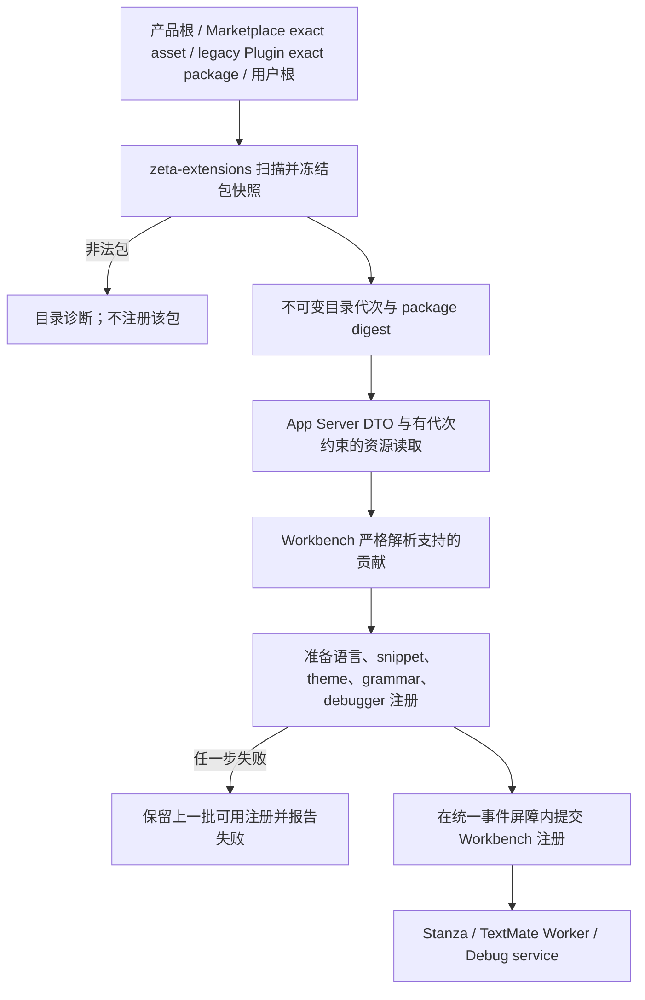
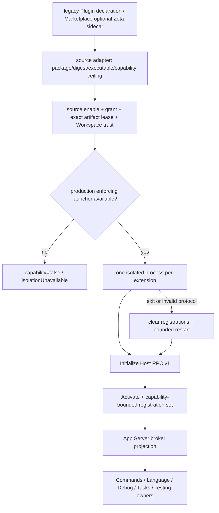

# 编辑器扩展系统

> 本文是 Zeta 编辑器扩展的跨层架构权威文档，明确区分两条当前边界：声明式静态 Editor
> Extension 与 Zeta 原生可执行 Editor Extension Host v1。静态目录实现见
> [`zeta-rs/extensions/README.md`](../zeta-rs/extensions/README.md)，声明式 Workbench 投影见
> [`zeta-ts/src/zeta/workbench/services/extensions/README.md`](../zeta-ts/src/zeta/workbench/services/extensions/README.md)，
> 可执行进程与 RPC 实现见
> [`zeta-rs/editor-extension-host/README.md`](../zeta-rs/editor-extension-host/README.md)。统一 Marketplace
> artifact/capability 入口由 [`marketplace-integration.md`](marketplace-integration.md) 维护；legacy
> Plugin 本地来源 authority 由 [`plugins.md`](plugins.md) 维护。

## 快速理解

Zeta 有两种不能互相冒充的 Editor Extension。声明式扩展读取主机限定目录中的
`package.json`、language/TextMate/snippet/theme/debugger 资源，不执行包内代码；可执行扩展则必须先
绑定一个 immutable package/executable 与独立 enable/grant authority，再由每扩展独立进程通过 Zeta
Host RPC v1 注册窄 provider。来源可以是 legacy Plugin authority，也可以是 Marketplace Manager；
两类扩展可以最终服务同一个 Workbench，但 manifest、身份、信任、刷新和失败语义始终分开。
这里的声明式 `Extension` 是领域 consumer，不是独立 Marketplace 或 package family；当前远端
Theme/Language package 通过 typed adapter 进入它；Theme 的 portable manifest 由 host 规范化为声明式
manifest，同时 package 原始 bytes/digest 保持不变。通用 `asset` 不会被自动解释为编辑器扩展。

| 用户或产品场景 | 当前行为 | 明确不会发生 |
| --- | --- | --- |
| 打开受支持的源码文件 | 使用内置声明式扩展提供的语言关联、配置、grammar 和 snippet | 不下载扩展，不执行 manifest 中的脚本 |
| 主机配置静态用户扩展目录 | 扫描该目录的直接子包，非法包产生诊断 | Workspace 或 Renderer 不能提交任意扩展根 |
| Marketplace Theme / Language | Manager 验证同一 package 后，将声明式 assets 投影进共享 Extension catalog | 不建立 `extension-marketplace`，不执行静态资源 |
| Legacy Plugin 声明 `declarativeExtensions[]` | 仅 effective exact package 的静态目录进入 catalog | 本地兼容来源不成为远端 Marketplace 旁路 |
| 用户静态包与内置包使用同一扩展 ID | 内置包优先，用户包被报告为重复项 | 可变用户文件不能静默替换产品资源 |
| Plugin 声明可执行 Editor Extension | 校验 exact entrypoint、process permission、Host API v1、activation event 和 capability ceiling | 安装或 manifest 校验本身不会启动进程 |
| Marketplace package 带可选 `zeta/editor-extensions.json` | 产品 adapter 绑定同 package 的 exact executable；独立 admission 与 Manager lease 都通过后才进入 Host | sidecar 不成为通用 Marketplace 必需 manifest；安装不自动 grant |
| 已授权可执行扩展启动 | Runtime core 为它创建独立进程，完成版本握手和整批 registration validation | 不把它加载进 App Server 进程，不继承主机环境 |
| 可执行扩展崩溃 | 清除旧 incarnation 注册，按有界预算重新握手和激活；超限进入 crash loop | 不无限重启，不把旧请求重绑定到新进程 |
| 调用超时或取消后没有 terminal response | 结果标为 unknown outcome，终止旧 incarnation 后恢复 | 不声称副作用没有发生 |
| 需要 VS Code Extension API 或 Marketplace compatibility | 当前不支持 | Host RPC v1 不是 Node Extension Host，也不是 VS Code API 子集 |
| 生产环境没有可实施 hard limits 的 launcher | executable Host capability 必须为 false，失败关闭 | 不允许退化到无 sandbox 的第三方执行 |

当前声明式装载链已接入 App Server 与 Workbench。Legacy Plugin 与 Marketplace executable source 都会
先规范化为 Host deployment，Host runtime 不解析任何 package manifest。App Server broker 以及
Workbench 的 Commands/Language/Tasks/task-backed Testing 窄桥已实现；由于生产
launcher 尚未实现，默认产品仍以 capability=false 失败关闭，不能描述为可启用第三方代码的生产路径。
后续章节分别说明两条流程、所有权、信任与失败边界、完成度及演进。

## 1. 两条装载与激活路径

### 1.1 声明式静态扩展



产品构建把仓库根目录 `extensions/` 复制到包内 `zeta-resources/extensions/`。App Server 同时把当前
Plugin activation snapshot 中的 `declarativeExtensions[]` 与 Manager 的 Theme/Language capabilities
解析为 exact immutable package directories。`zeta-extensions` 按 built-in → dynamic authority sources
→ profile user 顺序扫描，每个扩展 ID 的第一个有效包获胜。每次 `Refresh` 或任一动态 source
generation 改变都产生单调递增的目录代次，并把包内 regular-file bytes 冻结为当前
内存快照。资源读取必须携带该代次，只能读取当前快照；刷新后请求旧代次会得到 generation
conflict，而不是从已变化的磁盘路径读取内容。

Renderer 不接收主机路径。它先取得目录描述，再以“目录代次 + 扩展 ID + 包内相对路径”请求资源。
App Server 把有界 bytes 放入 connection-owned `ResourceStore`，前端通过分块 API 读取并释放临时
资源。Workbench 最后把声明式贡献投影到各自领域 registry。

Workbench 启动会保留初次 `AppServerExtensionService.start()` 的 Promise，在扩展激活完成或失败后
才恢复 working-copy backup 并推进 `AfterRestored`。App Server 连接状态从任一非 `ready` 状态回到
`ready` 时，组合根调用 `reload()`；该请求复用 single-runner 合并规则。

### 1.2 来源授权的可执行 Host v1



Legacy Plugin v1 的 `editorExtensions[]` 仍可作为本地兼容来源。Marketplace 来源则由可选
`zeta/editor-extensions.json` consumer sidecar 把声明绑定到同 digest 内的 exact `executable`
capability；没有独立 `MarketplaceEditorExtensionAdmission` grant 时 deployment 不会被接纳或启动。
Admission authority 必须为 policy commit 推进 generation，并在可变时发布变更；Host 据此撤销旧
fleet 并重新评估 grant。两条来源都只发布规范化 deployment 与 live authority，不启动进程。Host adapter 还必须绑定 active Workspace
trust，随后把绝对 executable 交给能够实施 sandbox 与 hard limits 的平台 launcher。默认安全策略缺少
该 launcher 时失败关闭，不能自动改用可信开发 launcher。

一个 `ExtensionHostSupervisor` 只监管一个扩展程序。它先取得 live activation lease，再 spawn、执行
Initialize/Activate，最后一次发布整批 registrations。每次 provider invocation 重新取得 lease，并绑定
request ID、process incarnation 和 activation generation。崩溃后的新进程会重新握手和激活；旧
registration、pending request 和 lease 不会迁移。

Manifest activation events 当前是经过验证并传给 runtime 的 facts；`zeta-editor-extension-host` 不自行
监听 Workbench 事件或决定何时 lazy start。activation-event matching 必须由 App Server composition
明确实现并测试，不能因为协议携带该字段就宣称按事件激活已经可用。

## 2. 所有权

| 能力 | 权威所有者 | 不负责 |
| --- | --- | --- |
| 内置静态资源源码与上游 provenance | 根目录 `extensions/` | 运行时扫描、Extension API |
| 静态包扫描、路径/文件类型校验、快照、摘要与目录代次 | `zeta-extensions` | Editor 贡献语义、任意代码执行 |
| 静态可信根选择和顺序 | App Server 产品组合根 | 由 Renderer 提交任意主机路径 |
| Plugin 静态目录选择 | `zeta-plugins` activation authority + App Server provider | 解析静态 `package.json`、授予代码执行 |
| Marketplace Theme/Language 静态目录选择 | `MarketplaceManager` + App Server provider | 解析 Workbench 贡献、主题选择或 LSP lifecycle |
| 静态 DTO、connection resource 与错误映射 | App Server / `platform/extensions` adapter | Workbench 领域注册 |
| 声明式 catalog 与生命周期 | `IExtensionService` / `AppServerExtensionService` | transport DTO、Plugin enable/grant |
| Marketplace package artifact/install/update/uninstall 与 capability lease | `zeta-marketplace-manager` | Editor Extension enable/grant、启动进程 |
| Marketplace Editor Extension enable/grant generation、通知与 lease | 产品注入的 `MarketplaceEditorExtensionAdmission` | package 安装、Workspace trust、进程隔离 |
| Legacy Plugin 本地 package 与 enable/grant generation | `zeta-plugins` compatibility authority | 远端 Marketplace 安装、启动进程 |
| 可执行进程、Host RPC、incarnation、取消和 crash recovery | `zeta-editor-extension-host` | package discovery、Workspace trust decision、领域 payload |
| source normalization + Workspace live authority adapter、Host fleet 与客户端 RPC | App Server composition | OS sandbox implementation、Workbench UI |
| 生产 sandbox、hard resources 与 killable process tree | 注入的 platform `ExtensionHostLauncher` | package enable/grant 或 provider semantics |
| Host snapshot normalization 与 transport | `platform/extensionHost` adapter | 领域 provider ownership |
| Host fleet 生命周期和原子 provider 编排 | `IExtensionHostService` implementation | generated DTO 作为 domain API |
| Renderer Host service 安装与启动阻塞 | Code 产品入口选择的 `workbench/contrib/extensionHost` | 通用 Workbench 或 Academic 产品隐式安装 |
| Commands、Language、Debug、Tasks、Testing 注册与调用 shape | 各自 Workbench domain owner | package 安装、进程监管 |

Frontend common contract 使用 Workbench 自己的 snapshot/descriptor/failure 类型；generated DTO 和
资源传输 shape 只存在于运行时 adapter。`src/zeta/base` 不认识扩展、语言、grammar 或 Host RPC。

静态 `package.json` catalog 与 executable consumer manifest 之间没有隐式转换。未来即使共享安装
UI，也必须保留两种 package identity、authority、generation 和 failure semantics；不能把“静态资源目录可读”转换成
“允许执行包内程序”。

## 3. 当前支持的声明式贡献

| `package.json` 贡献 | 当前状态 | 当前边界 |
| --- | --- | --- |
| `languages` | ✅ | ID、aliases、extensions、filenames、filename patterns、MIME type、first-line pattern |
| language `configuration` | ✅ | 读取 JSONC 并注册 comments、brackets、indentation、on-enter 等语言配置 |
| `grammars` | ✅ | root/injection grammar、embedded languages、token types、balanced/unbalanced bracket scopes |
| `snippets` | ✅ | 有 prefix 的 snippet 投影为 completion provider；file template 进入可查询 template catalog |
| `themes` | ✅ | 严格解析并注册可选择 Workbench color theme，同时投影活动主题的 TextMate token scope rules |
| `debuggers` | ✅（窄契约） | 唯一 debugger type 映射到显式 adapter program/args；不提供 VS Code Debug Extension API |
| `configurationDefaults`、`semanticTokenScopes` | 尚未完成 | 内置 manifest 可包含，但当前 loader 不投影 |
| JavaScript、LSP server declaration、动态 UI | ❌ | 不执行、不隐式信任 |

内置包当前覆盖 CSS、HTML、JavaScript、JSON/JSONC、Markdown、Python、Rust、Shell、SQL、
TypeScript、XML、YAML 和四个默认主题文档。Manifest 中的 `%...%` 本地化占位符当前没有 NLS
解析；未解析占位符使用 theme document 自身的 name 或稳定 manifest ID 回退。

Theme document 当前必须是自包含资源：`include` 会被拒绝，`uiTheme` 只接受 `vs`、`vs-dark`、
`hc-black` 或 `hc-light`，颜色必须是合法十六进制值，token settings 只允许
`foreground`、`background` 和受支持的 `fontStyle`。未知 Workbench color token ID 可以保留在
catalog 中，但投影为产品主题时会被忽略。

## 4. 可执行 Host v1 的窄契约

### 4.1 清单与激活上限

每个 legacy Plugin `editorExtensions[]` item 或 Marketplace Zeta sidecar item 必须有唯一
manifest-local ID、唯一 exact executable binding、数值 `runtimeApiVersion: 1`、非空且有界的
activation events 和 capabilities。Legacy entrypoint 必须有对应 `process` permission；Marketplace
entrypoint 必须引用同一 Manager package 中声明为 `runtime: direct` 的 executable capability。
regular-file 校验不证明当前 OS、CPU、ABI 或代码签名可运行；launcher 仍需在目标平台失败关闭。

v1 activation event 为 `startup`、`onCommand`、`onLanguage`、`onDemand`、`onDebugType`、
`onTaskType` 和 `onTestProfile`。`workspaceContains` 当前没有 Workspace-owned bounded scanner，因而
明确不在 schema 中；扩展程序不得自行扫描工作区来模拟这一 trigger。

### 4.2 RPC 与注册

Host RPC v1 是 newline-delimited strict JSON 协议，不是 JSON-RPC。请求与响应都绑定 protocol version、
request ID、incarnation 和 activation generation；扩展主动发送的命名 Output event 没有 request ID，但
仍绑定其余三个 stale-process fence。未知 request、response kind 不匹配、correlation 不一致、重复/未知
request ID、无效 Output 操作、超限 frame/Output 队列或未声明 capability 均使当前 incarnation 失败关闭。

| Registration kind | Runtime v1 ceiling | 产品接入状态 |
| --- | --- | --- |
| Command | command ID、title 与 brokered invocation | 已接入；按 registration、incarnation 与 activation generation 调用 |
| Language Provider | language IDs + operation set | Runtime vocabulary 已实现；Frontend v1 已投影 completion、Parameter Hints、hover、formatting、Inlay Hints、Linked Editing；其余 operation 仍部分接入 |
| Debug Adapter | debugger type | Runtime contract 已实现；Frontend 当前只保留 snapshot 并报告 unsupported bridge，不启动 DAP session |
| Task Provider | task type | 已接入；只发布用户可选择的 canonical Task，不自动执行命令 |
| Test Profile Provider | provider ID、label | 已接入 task-backed profile；不冒充完整 test tree/controller API |

扩展命名 Output 是带背压的事件流，不是静态 registration kind，也不扩大 manifest capability ceiling。
扩展必须先 `create` channel，随后才可 `append`、`replace`、`clear`、`show` 或 `dispose`。Supervisor 分配
单调 sequence 并保留有界历史；App Server 通过 fleet generation 投影，Workbench 按 sequence 去重，
恢复内容时不重放旧 `show` 事件。它提供与 VS Code OutputChannel 相近的用户语义，但不是 VS Code Node
Extension API 的二进制或源码兼容实现。

`capabilities` 是注册种类的最大集合，不代表 extension 已注册 provider，也不批准某次调用的副作用。
App Server 必须对每个 registration 建立 owner-bound identity，并让领域 owner 定义 operation/payload；
Renderer 不能把任意 Host RPC method 直接透传给扩展进程。

Language Provider 调用会把当前 immutable editor snapshot 的完整 normalized text、version、language ID、
可选 resource URI 及本次 position/range/options 交给扩展程序；因此 grant 该 capability 必须被产品明确
解释为“允许 broker 披露当前参与调用的文档内容”，但不等于任意工作区文件读取。传输仍受 512 KiB
payload ceiling、Workspace/source live authority、activation generation 和 incarnation fence 约束，超限
请求拒绝。
Frontend v1 当前只投影 completion、Parameter Hints、hover、formatting、Inlay Hints 和 Linked Editing；
Host vocabulary 中虽有 definition、references、rename、code action 等 operation，尚无严格 Workbench
codec 的 operation 会发布 `unsupportedRegistrationBridge` 并使 aggregate state 降级；同一 registration
中已有严格 codec 的子集继续保持 active。Parameter Hints 已进入 v1；它不是完整 VS Code Signature
Help API。Task Provider
只能提出用户可选择的任务，实际命令仍由 canonical Task/Terminal 安全边界执行；Test
Profile Provider 只能引用同一扩展当前 Task Provider 贡献的任务。Debug Adapter 也必须经专用 DAP
session seam，不能把任意 executable descriptor 从扩展进程直接交给通用 process API。若这些 broker
规则不存在，对应 registration 应保持不可用，不能因为 runtime capability 已声明就直接透传。

## 5. 信任、完整性和资源限制

### 5.1 声明式静态资源

主机选择的 built-in root、Manager dynamic source 与 legacy Plugin activation authority 是静态来源的
唯一入口。内置根固定优先于 dynamic exact packages，后者又优先于用户 profile 根；Workspace、
Renderer、静态 manifest 和网页内容均不能提交任意绝对路径。目录扫描拒绝 symlink、hard link、special file、越界相对路径和不
满足 manifest 身份的包。当前限制为：manifest 最大 4 MiB，单文件最大 16 MiB，每包最多 4096 个
regular files、8192 个 filesystem entries，总 bytes 最大 64 MiB。

目录代次解决“目录描述与资源 bytes 属于同一快照”，package SHA-256 解决“一个完整包快照的内容
身份”。`manifestSha256` 只校验 transport 暴露的 canonical `manifestJson` bytes；它不能代替完整
package digest，原始 `package.json` bytes 已包含在 `packageSha256` 的整包身份中。当前快照只保留
最新代，旧代资源请求明确失败，不做隐式重绑定。

静态 profile 根当前没有独立 Editor Extension registry、signature、revocation 或 grant authority。
Marketplace Theme/Language 静态目录继承 Manager 的 TUF/digest/revocation 与 exact installation
identity，但声明式消费不等于 executable grant；所有来源都只能贡献第 3 节列出的声明式数据。

### 5.2 可执行进程

可执行扩展必须同时满足三层 gate：来源的 exact package/digest + enable/grant lease、active Workspace
trust，以及平台 launcher 对 sandbox/hard limits 的实际实施。Marketplace 来源额外同时持有 Manager
capability lease 与产品 admission lease；admission generation/notification 负责使 grant/revoke 触发
fleet replacement。任一 gate 失效都拒绝新 activation
和 invocation；App Server 还须取消 connection-owned invocation，并在 disable/update/uninstall 或
Workspace 切换时停止旧进程。

默认 process/protocol limits 为 1 MiB frame、512 KiB payload、256 registrations、32 个普通和 8 个
control in-flight requests、256 KiB stderr、4096 个 / 512 KiB queued/retained Output events、10 秒
startup、30 秒 request、2 秒 cancel grace、5 秒 shutdown。默认 hard limits 请求 512 MiB memory、
300 秒 CPU 和单进程。restart policy 在 60 秒窗口内
最多允许 5 次，以 100 ms 起步、最高 5 秒指数退避。确切实现和修改义务见 Host crate README。

`TrustedDevelopmentLauncher` 只允许显式可信本地开发。生产第三方执行必须注入能实施所请求隔离的
launcher；当前没有这样的 product launcher 时，App Server 对外能力必须为 false，而不是放宽 policy。

## 6. 失败、刷新和恢复语义

### 6.1 声明式刷新

Rust 扫描以包为单位失败关闭：一个无效包产生结构化诊断且不进入目录，其他有效包仍可发布。请求
不安全、缺失、过大或旧代资源分别返回 typed error，不回退到工作区文件系统或磁盘最新内容。

Workbench 刷新采用 single-runner 队列。同一时间只有一次装载；装载期间的多个刷新请求合并为恰好
一次 follow-up refresh，所有等待者等待队列 drain。服务销毁后不再提交 in-flight 结果、启动后续刷新
或发送普通失败事件。

Manifest、配置、snippet、theme 和 debugger 解析及注册组成一条失败安全的激活序列；失败时释放
候选注册并尝试恢复上一批可用状态。提交阶段使用同步事件屏障：各领域 registry 先更新状态，全部
成功后才依次投递已缓冲事件，因此监听者查询其他 registry 时会看到同一扩展代次。同步提交失败会
丢弃候选事件并恢复上一批可用状态。TextMate grammar 的 bytes 解析和 catalog materialization 仍由
`TextMateGrammarService` 拥有；Worker 运行期的后续故障属于 TextMate 自身生命周期。

### 6.2 可执行调用与故障恢复

启动和每次 invocation 都持有 live authority lease。caller cancellation 与 absolute UTC deadline 会发送
独立 control request；cancel grace 内没有 terminal response 时返回 unknown outcome，终止旧进程并进入
recovery。不能把 timeout 映射为“未执行”。connection 断开时 App Server 必须取消该 connection 拥有的
invocation，防止后台结果泄漏或孤儿 lease。

Host exit、invalid protocol 或 unknown outcome 会清空旧 registration，终止 process tree，并在 authority
仍有效且 restart budget 未耗尽时重新 Initialize/Activate。空闲 crash 由 App Server health loop 调用
`reconcile()` 检测；Runtime core 不自带后台 poller。进入 crash loop 后只发布 terminal failure，不无限
重启。客户端 snapshot 和 registration replace 必须是整批原子操作，不能让旧/new incarnation provider
混用。

## 7. 当前实现状态与明确限制

| 子系统 | 状态 | 实现证据或缺口 |
| --- | --- | --- |
| 静态 package discovery、snapshot、digest、资源读取 | 已实现 | `zeta-extensions` + App Server extension operations |
| Plugin 声明式 Extension 分发与 live activation | 已实现 | `declarativeExtensions[]`、dynamic source provider、Workbench Plugin generation refresh |
| 声明式语言、grammar、snippet、theme、debugger 投影 | 已实现 | `AppServerExtensionService` 与领域 registry tests |
| Plugin executable declaration、exact process permission、authority | 已实现 | `zeta-plugins` manifest/package/authority tests |
| Marketplace executable consumer adapter 与独立 admission | 已实现 | exact sidecar/executable binding、双 lease 与 deferred uninstall tests |
| Host RPC v1、独立进程监管、取消、配额、restart | 已实现 | `zeta-editor-extension-host` standalone tests |
| 扩展命名 Output event stream | 已实现 | process-fenced create/append/replace/clear/show/dispose、bounded retention 与 Workbench sequence projection tests |
| App Server Host fleet、Workspace gate、async invoke/cancel/read | 已实现 | exact operation broker、连接配额/TTL、退役取消与 changed notification |
| Workbench Commands/Language/Tasks/Testing bridge | 已实现（窄契约） | 原子投影、取消、stale fence 与 last-good 测试；Testing 仅 task-backed profile |
| Workbench executable Debug bridge | 尚未完成 | registration 可见并产生诊断，但没有异步 Host-broker DAP session seam |
| 生产第三方 platform launcher | 尚未完成 | 无 launcher 时 capability=false；可信开发 launcher 不计生产支持 |
| Activation-event-driven lazy start | 尚未完成 | Manifest/协议携带 facts；尚无完整事件匹配调度证据 |
| VS Code Node Extension API / Marketplace compatibility | 非目标 | Host RPC v1 是独立 Zeta 协议 |

当前不支持 generic Node/WASM loader、命名 Output 之外的扩展主动 event stream、publisher signature/revocation feed、
per-platform artifact selector、跨重启 invocation 恢复或多个扩展共享一个 Host process。完整 test tree、
任意 Webview/UI contribution、任意 App Server method registration 和扩展直接 filesystem/network access
也不属于 v1 provider bridge。

## 8. 计划演进

### 近期

- 为 executable Debug Adapter 建立专用异步 DAP session seam；补齐 definition、references、rename、
  code action 等尚无严格 codec 的 Language Provider operation；
- 让 activation events 真正驱动按需启动，避免当前 App Server fleet 的 eager activation；
- 在安装/更新授权 UI 中展示 Editor Extension capabilities、文档内容披露与 task command 提议权限；
- 在至少一个产品平台实现并验收 production `ExtensionHostLauncher`，覆盖 sandbox、memory/CPU/process
  limits、空环境和 process-tree termination；在此之前保持 capability=false。

### 潜在方向

只有真实生态需求与独立 threat model 成立后，才分别评审 extension-originated diagnostics/event、
WASM component、remote Host、更多 provider kind 或 activation-event lazy scheduling。任何新 wire 行为都
必须版本化，先有 App Server/domain owner 和背压/权限语义，不能借 v1 unknown field 静默扩展。

Node/VS Code compatibility 若未来立项，仍是独立产品项目：需要 Node runtime、版本化 VS Code API、
兼容矩阵、Marketplace/package migration 和独立安全模型，不能宣称为 Host RPC v1 的增量开关。

## 9. 长期不变量

- Renderer 永不直接读取主机扩展路径，也不直接访问扩展进程 stdio。
- 静态扩展资源读取绑定精确目录代次；刷新不能使旧描述读取到新 bytes。
- 内置静态产品包不能被可变 profile 包以同 ID 静默覆盖。
- 安装、启用或 manifest validation 都不等于 execution authority；每次 activation/invocation 复核 live
  source admission/artifact lease + Workspace gate。
- 生产第三方扩展必须逐进程隔离并实施 hard limits；缺失实施者时失败关闭。
- 请求、响应和 registration 同时绑定 extension、incarnation 与 activation generation；恢复不重用旧
  identity 或 lease。
- Workbench 消费领域类型；transport DTO 不进入 frontend common service contract。
- 各 contribution 由语言、TextMate、Debug、Tasks、Testing 等领域 registry 拥有；extension service 只
  负责编排和生命周期。
- 声明式 catalog 与 executable authority 保持概念分离；共享产品 UI 不能合并二者的 manifest
  或运行时语义。

## 10. 实现证据与验证

静态链与 Host runtime 的实现细节、private symbols 和 modification checklist 分别见三份关联 README。
跨层修改至少运行：

```text
cargo test --manifest-path Cargo.toml -p zeta-extensions
cargo test --manifest-path Cargo.toml -p zeta-plugins
powershell -NoProfile -ExecutionPolicy Bypass -File zeta-rs/editor-extension-host/check-standalone.ps1
corepack pnpm --dir zeta-ts test:extensions
corepack pnpm --dir zeta-ts typecheck:extensions
corepack pnpm --dir zeta-ts test:unit
corepack pnpm --dir zeta-ts test:build-tools
```

`test:extensions` 与 `typecheck:extensions` 覆盖静态链、Host transport/domain projection 与 Workbench provider seams。App Server runtime 当前由 sibling Rust tests 和 Host standalone suite 封住；根 workspace 仍需在缺失的本地 crate 恢复后补跑完整 `zeta-app-server` package test。
