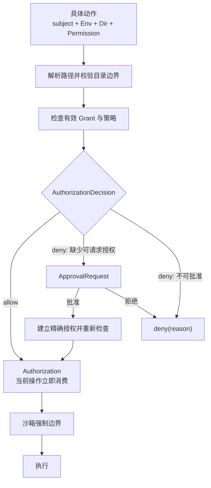

# 环境与目录访问

> 本文拥有 Environment、`cwd`、目录范围和目录授权的跨组件语义。对话与产品组织边界见
> [`domain-model.md`](domain-model.md)，动作审批与执行策略见 [`permissions.md`](permissions.md)。

## 快速理解

| 问题 | 使用的概念 | 不使用 |
| --- | --- | --- |
| 在哪里执行？ | `Environment` / `Env` | Workspace、Project |
| 相对路径从哪里解析？ | `cwd` | 主工作区 |
| 目录属于哪个运行位置？ | `Dir = EnvId + canonical path` | 裸路径身份 |
| 主体可以对目录做什么？ | `Permission + Grant` | Trusted / Untrusted |
| 当前动作是否允许？ | `AuthorizationDecision` | 持久 Permit |
| 缺少授权时怎么办？ | `ApprovalRequest` | 自动把目录设为 trusted |

Workspace 可以继续表示编辑器窗口、多根 folder 集合或 workspace 配置作用域，但不是 Agent 执行、
Session 身份或目录安全边界。

## 1. 执行结构

```text
Thread defaults
└── execution context
    ├── EnvironmentRef
    ├── cwd
    ├── dirs
    └── grants

Turn overrides?
└── environment / cwd / dirs / grants
```

运行时从 Thread 默认值与 Turn 覆盖计算有效上下文。这组值可以跨接口包装成 `ExecutionContext`，但
不建立独立生命周期、数据库表或全局 manager。

`Environment` 拥有执行和文件系统连接所需的事实：环境 ID、平台、Shell、文件系统入口、临时
目录、连接状态与生命周期。它不拥有 Project、Session tree 或某个用户的全部目录授权。

## 2. 路径、目录与 cwd

裸路径不能跨环境定位资源。`Dir` 至少冻结：

```rust
struct Dir {
    env: EnvId,
    requested_path: AbsolutePathBuf,
    canonical_path: PathBuf,
}
```

路径相同但环境不同，必须是不同目录。同一环境内的路径重新绑定到另一个文件系统对象时，旧 Grant
不得自动沿用。

`cwd` 只决定相对路径如何解析。改变 `cwd` 不会：

- 改变 Project 或 Session tree 身份；
- 把该目录变成“主目录”；
- 增加 Permission；
- 允许加载配置、指令或自动化。

目录集合没有“主目录”和“附加目录”的安全差异。UI 可以突出 `cwd`，但每个目录都必须独立获得
所需 Grant。

## 3. Permission、Grant 与单次决定

```text
Permission
  = 动作种类

Grant
  = subject + scope + permissions + source + revocation lifetime

AuthorizationDecision
  = allow(Authorization) | deny(PermissionDenied)
```

当前 Rust 表达为：

```rust
type AuthorizationDecision = Result<Authorization, PermissionDenied>;
```

`GrantSubject` 明确区分：

- `Environment(EnvId)`：环境级主机授权；
- `SessionTree(SessionId)`：共享一个 `session_id` 的执行范围；
- `Thread(ThreadId)`：只属于具体分支的授权。

`SessionTree` 只是主体作用域，不代表存在 Session store 或 Session event log。

允许分支携带的 `Authorization` 只在当前操作入口与执行之间传递。它绑定主体、目录、Permission、
来源和撤销租约；撤销 Grant 后，已有 Authorization 立即失效。它不持久化，也不升级成新的领域
对象。

`ApprovalRequest` 是缺少 Grant 时的交互。批准可以只覆盖当前动作，也可以由明确的配置入口创建
长期规则；不能把一次批准历史模糊匹配成长期授权。

## 4. 授权流程



批准、Grant、AuthorizationDecision 和沙箱互相独立：

- 批准交互取得用户决定；
- Grant 保存主体在范围内获得的 Permission；
- AuthorizationDecision 判断当前动作；
- 沙箱在操作系统层强制边界。

任何一层都不能替代另外三层。

## 5. 来源权限取代目录 Trust

目录能否贡献行为，由明确 Permission 决定：

| 行为 | Permission | 含义 |
| --- | --- | --- |
| 读取项目指令 | `LoadInstructions` | 允许读取并加入当前 Turn 上下文 |
| 读取配置 | `LoadConfig` | 允许读取该目录的配置贡献 |
| 发现 Hook | `DiscoverHooks` | 只允许发现；运行还需执行授权 |
| 发现 Skill | `DiscoverSkills` | 允许发现并按 Skill 生命周期加载 |
| 发现 MCP | `DiscoverMcp` | 只允许发现声明，不自动连接 |
| 发现 Plugin | `DiscoverPlugins` | 只允许发现声明，不自动安装或激活 |

一个 `Trusted / Untrusted` 布尔值无法表达只读、可写但不可执行、允许指令但禁止 Hook 等组合，
因此不进入目录模型。签名、证书与发布者验证仍可使用各自的 trust 语义。

## 6. 命令与命名

用户命令使用环境、目录和动作组成的短词：

```text
env list
env use <env-id>
env dir list <env-id>
env dir add <env-id> <path> --allow read,search
env dir allow <env-id> <dir-id> write
env dir deny <env-id> <dir-id> exec
env dir remove <env-id> <dir-id>
```

在目录领域内使用 `dirs`、`add_dir`、`remove_dir`；不要写
`additional_directories` 或 `add_additional_directory`。跨模块公开类型使用完整且无歧义的
`AuthorizationDecision`、`DirPermissionsService`；局部变量使用 `dir`、`grant`、`permission`、
`authorization`。

## 7. 所有权与不变量

| 所有者 | 负责什么 |
| --- | --- |
| `zeta-environment` | 环境身份与执行位置 |
| `zeta-file-access` | `Dir`、`Permission`、`Grant`、撤销、快照与授权决定 |
| 权限策略 | 判断动作应允许、询问还是拒绝 |
| 批准交互 | 收集用户决定 |
| 沙箱 | 强制文件、网络和进程边界 |
| Git | `Repo / Worktree` 身份与 Git 操作 |

长期不变量：

- 路径、`cwd`、Workspace、Project 和 Repo 都不会自动授予 Permission；
- 每个 Grant 都有明确主体、目录范围、Permission、来源和撤销生命周期；
- `AuthorizationDecision` 是一次检查结果，不保存为 Grant；
- 来源配置不能给自身扩权；
- Workspace 只表示编辑器窗口、多根 folder 集合、配置作用域、Cargo 或外部标准中的同名概念；
- 后端执行位置使用 Environment，执行范围使用 `cwd`、`dirs` 和 `grants`，不能再借用 Workspace 表达。
