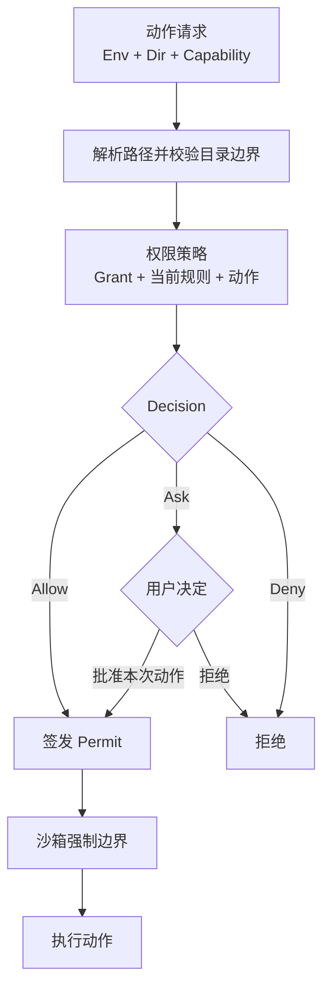

# 环境与目录访问

> 文档所有权：本文拥有 Zeta 长期架构中环境选择、目录定位、目录能力授权和操作凭证的跨组件语义。
>
> 文档状态：Proposed。当前实现仍使用 Workspace、主目录、附加目录和目录级 Trust；现状与精确实现证据见 [`workspace-security.md`](workspace-security.md)、[`zeta-workspace`](../zeta-rs/workspace/README.md) 和 [`zeta-workspace-access`](../zeta-rs/workspace-access/README.md)。权限判断与沙箱执行分别由 [`permissions.md`](permissions.md) 和 [`sandboxing.md`](sandboxing.md) 维护。

## 快速理解

Zeta 的长期模型只强调两件事：动作在哪个环境执行，以及当前 Turn 被允许对哪些目录做什么。路径只负责定位；`cwd` 只负责解析相对路径；Workspace 和目录级 Trust 不再作为身份、权限或 Session 边界。

| 用户问题 | 系统使用的概念 | 明确不使用 |
| --- | --- | --- |
| 这次操作在哪里运行？ | 环境 `Env` | Workspace |
| 相对路径从哪里开始？ | 当前工作目录 `cwd` | 主工作区 |
| 这个路径属于哪个运行位置？ | 环境目录 `Dir` | 裸路径身份 |
| 可以读、写、搜索或执行吗？ | 能力 `Capability` 与授权 `Grant` | Trusted / Untrusted |
| 这次操作已经通过检查了吗？ | 操作凭证 `Permit` | 泛化的“有权限”布尔值 |
| 需要询问用户吗？ | 决定 `Allow / Ask / Deny` | Trust 等级 |
| 可以加载目录提供的配置或自动化吗？ | 对应的来源能力 | “信任整个目录” |

本文后续依次说明[目标结构](#1-目标结构)、[术语边界](#2-术语边界)、[动作授权流程](#4-动作授权流程)、[当前差距](#8-当前实现与目标差距)和[整改完成标准](#9-整改完成标准)。

## 1. 目标结构

一个 Turn 可以选择一个或多个环境。每个环境连接独立保存 `cwd` 和访问快照；同一个环境被不同 Thread 或 Turn 使用时，可以拥有不同目录授权。

```text
Thread
└── Turn
    └── TurnEnv*
        ├── Env
        ├── cwd
        └── AccessSnapshot
            ├── Dir*
            └── Grant*
```

目录、仓库和配置来源是不同对象：

```text
Dir ──定位──> Env + path
Dir ──发现──> Repo
Dir ──提供──> Instructions / Config / Hooks / Skills / MCP / Plugins
```

`Repo` 只拥有 Git 身份与 Git 操作。配置和自动化消费方只在获得对应来源能力后读取贡献。两者都不创建 Workspace，也不改变 `cwd`。

### 1.1 Workspace 没有独立职责

Workspace 当前把运行位置、默认路径、目录权限、仓库身份、配置来源和 Session 绑定成一个对象。拆开以后，每个消费者都有更准确的依赖，Workspace 不再拥有任何不可替代的事实。

| 消费方 | 实际需要 |
| --- | --- |
| Terminal 与进程工具 | 环境、`cwd`、执行能力和操作凭证 |
| 文件工具与搜索 | 环境目录、目标路径和读写或搜索能力 |
| Git | 仓库身份和查询或修改能力 |
| Instructions、Hooks、Skills、MCP、Plugins | 来源目录和对应的来源能力 |
| 模型环境 | 环境事实、`cwd` 和可访问目录 |
| Thread 与 Turn | 环境连接和冻结访问快照 |

因此目标不是把 Workspace 改成另一个总括名称，而是直接删除这个领域对象。产品界面仍可使用“项目”“文件夹”或“仓库”等用户能识别的名称，但这些名称不进入核心身份和权限协议。

### 1.2 目录级 Trust 只是多个决定的混合

目录级 Trust 通常同时表示“允许读取”“允许执行”“允许加载配置”和“减少批准询问”，但这些决定的风险、生命周期和撤销后果不同。一个 `Trusted / Untrusted` 状态无法准确表达只读、可写但不可执行、允许指令但禁止 Hook 等常见组合。

目标模型不把 Trust 改名成一个 `authorized` 布尔值。每项能力都由 `Allow / Ask / Deny` 明确决定；持久结果保存为授权，操作入口检查后签发操作凭证。

## 2. 术语边界

| 中文概念 | 代码命名 | 负责什么 | 不负责什么 |
| --- | --- | --- | --- |
| 环境 | `Env`、`EnvId` | 标识执行位置、文件系统入口、平台能力和生命周期 | 不全局拥有某个 Session 的目录授权 |
| Turn 环境 | `TurnEnv` | 把 Turn 与环境、`cwd` 和冻结访问快照绑定 | 不保存项目身份 |
| 目录 | `Dir`、`DirId` | 用稳定 ID 表示一个环境内的规范化目录 | 不表示已经获权或可信 |
| 路径 | `PathUri` | 在一个环境中定位文件或目录 | 不单独作为跨环境身份 |
| 能力 | `Capability` | 描述读取、写入、搜索、执行或加载来源贡献等动作类别 | 不表示谁已经获权 |
| 权限 | `Permissions` | 描述各项能力当前允许、询问或拒绝 | 不作为工具入口凭证 |
| 授权 | `Grant` | 记录某个目录已经获得的能力、版本和撤销生命周期 | 不证明某次调用已经完成检查 |
| 操作凭证 | `Permit<C>` | 证明精确目录和能力已经在当前版本下通过检查 | 不持久保存用户策略 |
| 决定 | `Decision` | 返回 `Allow`、`Ask` 或 `Deny` | 不执行动作 |
| 沙箱 | `Sandbox` | 强制文件、网络和进程边界 | 不签发授权或推断用户意图 |

`Permission` 和 `Permit` 不能互换。权限描述“可以做什么”，操作凭证证明“这一次调用已经检查通过”。

## 3. 环境、目录与路径

### 3.1 环境是运行位置

环境拥有执行和文件系统连接所需的事实：环境 ID、平台、Shell、文件系统接口、临时目录、可用能力、连接状态和生命周期。环境不保存全局目录白名单；目录授权属于具体的 Turn 环境连接。

### 3.2 目录必须带环境身份

裸路径不能跨环境定位资源。目录至少包含稳定 ID、环境 ID 和该环境内的规范化路径：

```rust
// Proposed shape，不是当前 public API。
struct Dir {
    id: DirId,
    env: EnvId,
    path: PathUri,
}
```

目录身份不授予能力。路径相同但环境不同，必须是不同目录；同一环境中的路径重新绑定到不同文件系统对象时，旧授权不得自动沿用。

### 3.3 `cwd` 只是执行参数

`cwd` 决定相对路径如何解析，不决定目录优先级、项目身份、文件权限或来源贡献。改变 `cwd` 不增加或撤销授权；目标目录没有所需能力时，动作仍然拒绝或询问。

### 3.4 所有目录平等

目标模型没有“主工作目录”和“附加目录”。一个 Turn 环境连接拥有零个或多个目录；每个目录独立配置能力。UI 可以突出当前 `cwd`，但不能因此赋予它更高权限或配置优先级。

## 4. 动作授权流程

策略对一个已经解析清楚的动作返回 `Allow`、`Ask` 或 `Deny`。`Allow` 可以来自有效授权，也可以来自用户对本次动作的批准；两条路径最终都签发精确的操作凭证，再由沙箱执行。



操作凭证至少绑定环境、目录、能力、授权版本和撤销租约。需要绑定动作摘要或策略版本的高风险操作继续遵守 [`permissions.md`](permissions.md) 的精确授权规则。

## 5. 来源能力取代目录级 Trust

目录级 `Trusted / Untrusted` 直接删除。目录能否提供配置和行为，由明确能力决定：

| 来源行为 | 建议能力 | 授权含义 |
| --- | --- | --- |
| 提供项目指令 | `Instructions` | 允许读取并加入当前 Turn 的项目指令 |
| 提供配置 | `Config` | 允许读取该来源的配置贡献 |
| 发现 Hook | `Hooks` | 允许发现 Hook；运行仍要求执行能力 |
| 发现 Skill | `Skills` | 允许发现并按 Skill 生命周期加载 |
| 发现 MCP 声明 | `Mcp` | 只允许发现声明，不自动建立连接 |
| 发现 Plugin 声明 | `Plugins` | 只允许发现声明，不自动安装或激活 |

来源提供的配置不得给自身增加能力、放宽组织策略或绕过批准。签名、发布者身份和证书验证继续使用各自的身份验证概念，不复用目录授权，也不重新引入一个全局 Trust 状态。

## 6. 用户操作

命令使用环境、目录和动作组成的短词，不暴露 Workspace 或 Trust：

```text
env list
env use <env-id>
env dir list <env-id>
env dir add <env-id> <path> --allow read,search
env dir allow <env-id> <dir-id> write
env dir ask <env-id> <dir-id> exec
env dir deny <env-id> <dir-id> hooks,config
env dir remove <env-id> <dir-id>
```

新增目录必须显式携带初始能力，不能暗中附带“可信目录”或“完全访问”默认值。产品可以提供只读、开发和完全控制等选择，但保存结果必须展开成具体能力决定。

## 7. 所有权

| 所有者 | 唯一职责 |
| --- | --- |
| 环境能力 | 环境身份、执行与文件系统连接、平台事实和生命周期 |
| 目录访问能力 | `Dir`、`Grant`、撤销、版本、`Snapshot` 和 `Permit` |
| 权限系统 | 根据动作、授权、用户规则和组织规则返回 `Allow / Ask / Deny` |
| 批准交互 | 收集用户对单次动作或明确规则的决定 |
| 沙箱系统 | 把已获准能力转换成技术边界并强制执行 |
| Git 能力 | 从目录发现仓库并执行 Git 查询或修改 |
| 配置与 Agent 自定义能力 | 在对应来源能力存在时加载贡献，禁止来源自行扩权 |

crate 用于隔离这些能力和依赖，不要求每个名词拥有独立 crate。只在依赖方向或安全验证需要独立边界时拆分。

## 8. 当前实现与目标差距

当前实现仍以 Workspace 为中心，以下映射只说明整改结果，不构成兼容层设计：

| 当前概念 | 目标结果 | 状态 |
| --- | --- | --- |
| `WorkspaceRoot` | `Dir` | 尚未完成 |
| `WorkspaceCapability` | `Capability` | 尚未完成 |
| `WorkspaceAuthorization` | `Grant` | 尚未完成 |
| `TrustedWorkspace` | `Permit` | 尚未完成 |
| `WorkspaceTrustDecision` / `WorkspaceTrustId` | 删除 | 尚未完成 |
| `WorkspaceAccessAuthority` | 目录访问的唯一可变所有者 | 部分具备，仍包含 Workspace 语义 |
| `WorkspaceAccessSnapshot` | `Snapshot` | 部分具备，仍返回 `TrustedWorkspace` |
| 主工作目录与附加目录 | 平等的 `Dir` 集合与独立 `cwd` | 尚未完成 |
| Session Workspace binding 和 route | Turn 环境连接 | 尚未完成 |
| `<workspace_roots>` 模型描述 | 按环境描述 `cwd` 与可访问目录 | 尚未完成 |
| Workspace Trust 配置与管理 RPC | 明确能力规则和批准入口 | 尚未完成 |

当前代码中的 Workspace 和 Trust 仍是实际安全边界，在整改完成前不能绕过或提前删除检查。当前行为、撤销语义和测试入口继续由 [`workspace-security.md`](workspace-security.md) 及两个 crate README 记录。

## 9. 整改完成标准

- 核心领域、协议、Session、模型环境和工具入口不再包含 Workspace 身份或目录级 Trust 状态。
- 每个目录都由环境 ID 和目录 ID 定位，裸路径不能跨环境复用授权。
- `cwd` 与目录授权独立，修改 `cwd` 不改变能力集合。
- 所有目录平等，不存在主目录自动获权或附加目录降级语义。
- 每个文件、进程、Git 和来源贡献入口都要求对应 `Permit<C>` 或执行等价的权威检查。
- 用户和组织规则只产生明确能力的 `Allow / Ask / Deny`，不存在 `Trusted / Untrusted` 预设状态。
- 撤销授权会推进版本、失效旧凭证并停止仍依赖该凭证的运行资源。
- 沙箱只消费已获准能力，不能根据路径、`cwd` 或历史 Trust 状态扩大边界。
- UI 可以使用“文件夹”“项目”或“仓库”等用户可识别名称，但不得把这些展示概念写回核心身份和权限协议。

## 10. 长期不变量

- 环境 `Env` 回答“在哪里执行”，能力 `Capability` 与授权 `Grant` 回答“允许做什么”。
- 路径只定位资源，不代表身份、授权或信任。
- 权限 `Permission` 描述规则，操作凭证 `Permit` 证明单次入口已经检查通过。
- `Allow` 是明确决定，不是对目录的总体评价。
- 读取文件不自动允许写入、执行、加载配置或激活自动化。
- 来源配置不能给自身授予能力。
- 批准、授权和沙箱互相独立，任何一层都不能代替另外两层。
- Workspace 和目录级 Trust 不重新进入核心模型。
