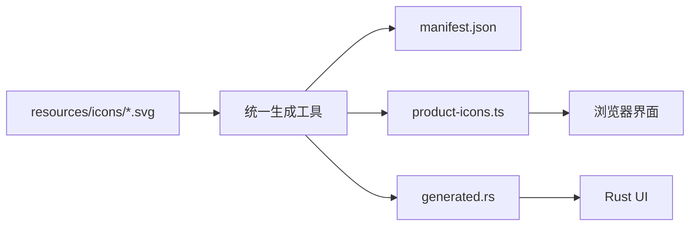

# 产品图标系统：SVG 输入与多端生成

> 状态：Current。
> 本文拥有产品图标的跨客户端资源规范和生成边界。SVG 文件操作见 [`resources/README.md`](../resources/README.md)，Rust API 见 [`zeta-icons`](../app/icons/README.md)。

## 快速理解

维护者只需要把符合命名规范的 SVG 放进 `resources/icons`，然后运行 `pnpm icons:generate`。生成工具会规范化 SVG，并同时生成 manifest、TypeScript 图标库和 Rust 图标库；不需要手写图标 ID、文件映射或渲染模式。

| 想做什么 | 需要修改什么 | 需要运行什么 |
| --- | --- | --- |
| 新增图标 | 添加 `resources/icons/<id>.svg` | `pnpm icons:generate` |
| 替换图稿 | 修改同名 SVG | `pnpm icons:generate` |
| 删除图标 | 删除 SVG，并迁移仍在使用该 ID 的调用方 | `pnpm icons:generate` |
| 检查生成状态 | 不修改文件 | `pnpm icons:check` |



## 1. 唯一输入

`resources/icons/*.svg` 是产品图标的唯一人工输入。文件名必须使用小写 kebab-case，去掉 `.svg` 后就是稳定图标 ID，例如 `chevron-down.svg` 生成 ID `chevron-down`、TypeScript 属性 `chevronDown` 和 Rust 常量 `CHEVRON_DOWN`。

图标 ID 与 SVG 文件一一对应。需要箭头的控件直接使用 `chevron-down`，需要终端图标的控件直接使用 `terminal`；不得再创建只为指向另一张画稿的手写别名。

## 2. 生成产物

| 产物 | 用途 | 是否允许手改 |
| --- | --- | --- |
| `resources/icons/manifest.json` | 记录 ID、文件名和推导出的渲染模式 | 否 |
| `zeta-ts/generated/product-icons.ts` | 提供全部浏览器 SVG 工厂和自动注册函数 | 否 |
| `app/icons/src/generated.rs` | 提供全部 Rust 图标常量、资源绑定和排序目录 | 否 |

`build/resources/icons/generate.ts` 是统一入口：它扫描并校验 SVG、生成 manifest，再分别调用 `generate-to-ts.ts` 和 `generate-to-rs.ts`。两个目标生成器不再各自扫描资源，因此两个客户端不会分别决定 ID 对应哪张图稿。

## 3. 渲染模式

渲染模式由生成器读取优化后的 SVG 自动推导。只含黑、白、`currentColor`、`none` 或默认黑色的图标生成 `symbolic`；出现其他固定颜色时生成 `multicolor`。维护者不得在 manifest 或客户端代码中覆盖这个结果。

浏览器渲染器把黑色区域替换为当前文字颜色。Rust 渲染器把单色覆盖写入可着色遮罩，把固定颜色写入 sRGB 图集。渲染器只执行 manifest 已确定的模式，不重新分类画稿。

## 4. 使用边界

- 产品代码只使用 `Icon`、生成的 TypeScript 属性或 `zeta_icons::icons` 常量。
- 产品代码不得传递 SVG 路径、文件名、原始 SVG 文本或生成器内部定义。
- TypeScript 不读取 Rust 产物，Rust 不读取 TypeScript 产物；两端只共享 SVG 输入和同一次生成结果。
- Seti 文件类型图标继续由 `zeta-file-icons` 独立拥有，其 WOFF 字体不属于产品图标系统。
- 应用品牌图和 `zui` 开发工具私有图标不进入产品图标目录，因为它们不属于产品语义图标库。

## 5. 修改与验证

在仓库根目录运行：

```bash
pnpm icons:generate
pnpm icons:check
pnpm test:icons
cargo test --manifest-path Cargo.toml -p zeta-icons
```

`icons:generate` 是维护者唯一需要调用的写入命令。Vite 开发服务复用同一生成入口更新 TypeScript 产物；`icons:check` 只比较规范化 SVG 与三份生成产物，不修改文件。检查时统一换行语义，因此 Windows 的 CRLF 不会造成误报。Desktop 的生成资源检查会调用同一检查入口，缺失或过期产物会让构建失败。

## 6. 长期不变量

- 人只维护 SVG，机器维护 manifest 和语言绑定。
- 一个 SVG 文件产生一个同名语义 ID，不存在客户端私有画稿映射。
- 一次生成同时决定所有客户端可见的 ID 和渲染模式。
- 编译过程只读取已生成产物，不在 Cargo 或 Bazel 编译动作中运行生成器。
