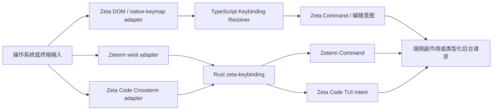

# 三端快捷键系统

> 文档所有权：本文是 Zeta、Zeterm 与 Zeta Code 共享快捷键语义、端侧输入边界和演进顺序的 canonical 架构文档。
> 实现细节分别由 [`zeta-keybinding`](../zeta-rs/keybinding/README.md)、[`zeta-keybindings-host`](../zeterm/native-keybindings/README.md)、[`zeta-code` TUI](../zeta-code/tui/README.md) 和 [Zeta 浏览器基础](../zeta-ts/docs/browser-foundation.md)维护。
> 状态：共享 Rust 核心、Zeta Code 根级 Keymap、Zeterm、Zeta TypeScript 输入链路和跨语言 conformance 向量均为 Current。

## 快速理解

三端共享“按键序列如何匹配命令”的规则，但各自在本地把平台事件转换成标准按键；原始按键不发送给 App Server，也不要求三个产品共享同一份命令表。

| 用户场景 | Zeta | Zeterm | Zeta Code |
| --- | --- | --- | --- |
| 输入普通文字 | 浏览器、IME 与编辑器处理 | 窗口输入法或终端面板处理 | 终端与 Crossterm 处理 |
| 触发快捷键 | TypeScript Resolver 根据焦点和 ContextKey 解析 | Rust Resolver 根据 Native context 解析 | 精简 Rust Keymap 根据 TUI 焦点解析 |
| 系统键盘布局变化 | 重新加载系统布局和 Mapper | `winit` 提供标准化逻辑键与物理键 | 不检测；终端已经完成布局转换 |
| 修改快捷键 | profile `keybindings.json` | profile `keybindings.json` 和设置浮层 | 首版使用固定 Keymap；用户配置是独立产品决策 |
| 执行命令 | Renderer 内执行命令或产生编辑意图 | Native host 执行 `ZetermCommandId` | TUI 主循环执行 `AppCommand` 或局部 component intent |

后续章节依次说明[一次按键的流程](#2-端到端流程)、[所有权](#3-所有权与依赖方向)、[一致性边界](#5-跨语言一致性)和[当前状态与演进](#8-当前状态与演进)。

## 1. 决策

快捷键系统固定区分三个概念：

- **键盘布局（keyboard layout）**：把物理位置、系统布局和修饰键转换成逻辑键，只由拥有原始窗口事件的宿主处理。
- **快捷键绑定（keybinding）**：一个按键序列、条件、来源、优先级和目标命令组成的规则。
- **键位表（keymap）**：某个产品注册的完整快捷键集合及其当前上下文，不跨产品共享命令身份。

`zeta-keybinding` 是没有 UI、I/O、平台事件和产品命令依赖的 Rust 语义核心。Zeterm 与 Zeta Code 直接依赖它；Zeta 的 Renderer 保留同步 TypeScript 实现，并通过共享规范和测试向量保持行为一致。

不把 Rust Resolver 放入 App Server，也不让 Zeta Renderer 经 IPC、N-API 或 WASM 解析每个按键。`preventDefault()`、焦点、IME 和 Chord 状态都要求端侧同步决定。

## 2. 端到端流程



一次按键按以下顺序处理：

1. 宿主接收 DOM、`winit` 或 `crossterm::KeyEvent`。
2. 宿主适配器生成逻辑键、可用时的物理键和精确修饰键；输入法组合文字不伪装成快捷键。
3. 当前产品提供焦点、模式和可用性上下文，Resolver 选择命令、阻止规则、等待后续 Chord 或不匹配。
4. 产品 Keymap 把匹配结果转换成自己的命令或局部意图。
5. 只有命令产生的类型化业务请求、编辑操作或终端字节可以进入后台；原始按键和用户输入内容不进入 App Server 日志。

## 3. 所有权与依赖方向

| 组件 | 拥有 | 明确不拥有 |
| --- | --- | --- |
| `zeta-keybinding` | `KeyStroke`、Chord、Parser、Context expression、优先级、冲突和 Resolver | `winit`、Crossterm、DOM、UI、定时器、文件、产品命令 |
| Zeta Keyboard Layout | ScanCode、KeyCode、AltGr、死键、系统布局、浏览器映射 | Rust Keymap、后台命令执行 |
| Zeta Keybinding Service | ContextKey、Chord lifecycle、浏览器事件阻止和命令执行 | 系统布局采集、App Server 状态 |
| `zeta-keybindings-host` | `winit` 适配、Native Chord timeout、用户资源校验和热更新 | Zeterm UI、产品命令副作用 |
| Zeterm Keymap | `ZetermCommandId`、内建规则和 Native context | 通用 Parser、设置组件绘制 |
| Zeterm 快捷键 UI | 录制生命周期、设置浮层、诊断展示 | Resolver、用户文件 authority、命令执行 |
| Zeta Code Keymap | Crossterm 适配、固定 TUI action 和局部 context | 键盘布局、物理 ScanCode、App Server authority |
| App Server | 快捷键触发后的类型化产品请求 | 原始按键、焦点、IME、Chord 和快捷键配置 |

依赖方向固定为：

```text
Zeterm product ──→ zeta-keybindings-host ──→ zeta-keybinding
Zeta Code TUI ─────────────────────────────→ zeta-keybinding
Zeta Renderer ──→ TypeScript keybinding implementation

all clients ── semantic command only ──→ App Server
```

如果 `zeta-keybinding` 开始依赖 `zui`、`zeta-ui`、`winit`、Crossterm、profile 路径或产品命令，说明共享边界已经漂移。若 Zeta Renderer 需要 IPC 才能决定是否阻止浏览器按键，也说明执行边界已经漂移。

## 4. 共享语义与产品差异

三端共享以下语义：

- 一至四段有序 Chord；
- 逻辑键和可选物理键身份；
- Control、Shift、Alt、Meta 和 portable `primary`；
- Builtin/User 来源、显式优先级和后注册覆盖；
- 条件过滤、阻止规则和 Chord prefix；
- `NoMatch`、`PendingChord`、`Command` 和 `Blocked` 四类解析结果。

三端不共享以下产品事实：

- 命令 ID、默认 Keymap 和命令参数；
- 焦点树、ContextKey catalog 和局部输入传播；
- Chord timeout、IME、窗口失焦和事件阻止副作用；
- 设置 UI、快捷键提示样式和诊断展示；
- 是否开放用户自定义快捷键。

Zeta Code 首版只接入全局固定 Keymap。Composer 的字符编辑、Selection 的方向键和 Transcript 的滚动继续由各 component 拥有；只有跨 component、产生 `AppCommand` 或需要统一提示的按键进入全局 Resolver。

## 5. 跨语言一致性

Rust crate 与 TypeScript 实现共享 JSON conformance fixtures，而不是共享运行时二进制。当前 fixture 固定共同子集中的：

- 有效和无效字符串；
- canonical 序列化；
- portable modifier 别名的 canonical 归一化；
- Chord 数量上限；
- 规则来源、显式优先级和注册顺序；
- condition filter、blocker、Chord prefix 与 no-match 结果。

TypeScript 的单一 `weight` 是 Rust `source + priority` 的产品侧编码；共同 fixture 要求 User 来源先于 Builtin，再在同一来源内比较 priority，最后由后注册规则打破平局。

展示标签、浏览器 ScanCode 白名单和单修饰键 keyup 行为属于宿主能力，不进入强制跨语言相等断言。新增共享语法必须同时修改 Rust、TypeScript、fixtures 和本文；产品专属扩展必须在对应实现文档中标出，不得悄悄改变共享 grammar。

## 6. 配置与持久化

Zeta 与 Zeterm 当前读取 active profile 下的 `keybindings.json`，但各自拥有资源 authority、命令 catalog 和完整校验。共享 Rust core 不读取文件，也不定义 profile 路径。

Zeta Code 首版不读取 `keybindings.json`。在产品接受用户自定义需求之前，它只使用编译期 Keymap；未来若接入配置，必须复用同一字符串语法，但仍由 TUI/CLI profile owner 读取并原子替换完整规则集。

配置更新遵守“先完整校验，后原子替换”。坏更新保留上一份有效规则；Resolver 永远不观察部分注册的新旧混合状态。

## 7. 可靠性、隐私和兼容性

- 快捷键解析必须同步且在端侧完成，不能等待网络或后台进程。
- Troubleshooting 默认关闭；开启时只能记录按键元数据、匹配阶段和命令 ID，不能记录 composer 文本、密码或剪贴板内容。
- 终端通常只能提供逻辑键和修饰键；Zeta Code 不伪造不存在的 ScanCode，也不承诺区分终端无法区分的组合。
- AltGr、死键和 IME 由拥有原始图形窗口事件的 Zeta/Zeterm adapter 处理；TUI 消费终端已经解释后的结果。
- Ctrl-C、Ctrl-D、Ctrl-Z 等终端保留语义由 Zeta Code 产品 Keymap 明确注册，不能由共享 core 隐式决定。

## 8. 当前状态与演进

| 阶段 | 状态 | 退出条件 |
| --- | --- | --- |
| Zeta TypeScript layout、Mapper、Resolver 和 profile resource | Current | 浏览器与 Electron 测试持续覆盖布局和快捷键 |
| Zeterm Rust Resolver、Native adapter、用户资源与设置 UI | Current | 迁移共享 core 后行为和资源测试不变 |
| 提升无 UI 的 `zeta-keybinding` 到 `zeta-rs/keybinding` | Current | crate 不含产品/UI/platform 依赖，Zeterm 继续通过测试 |
| Zeta Code 全局固定 Keymap | Current | 现有 Ctrl/BackTab/Esc 行为由共享 Resolver 驱动，局部 component key 不上移 |
| TS/Rust parser conformance fixtures | Current | 两个实现读取同一 fixture 并通过 |
| TS/Rust Resolver precedence fixtures | Current | 来源、优先级、后注册覆盖、condition、blocker 和 prefix 读取同一 fixture |
| Zeta Code 用户可配置 Keymap | Potential | 先有明确产品需求、配置 owner 和冲突/恢复交互 |

迁移已经按一个 source of truth 原则完成首个纵切：纯 core 已移动，Zeterm UI 已拆出，Zeta Code 根级 Keymap 已接入，旧 `zeterm/keybinding` 模块已删除。adapter 只能单向转换，不保留两套 Resolver。

## 9. 长期不变量

- 原始键盘事件不离开当前客户端。
- App Server 不解析快捷键，也不拥有客户端焦点和 Keymap。
- Rust 共享 core 没有 UI、I/O、平台事件和产品命令依赖。
- 三端共享语法和冲突语义，但各自拥有命令 catalog 与默认 Keymap。
- Zeta Renderer 的按键决定保持同步，不因跨语言复用引入 IPC/WASM 热路径。
- 局部文本编辑和导航留在拥有状态的 component，不为形式统一全部提升到全局命令总线。
