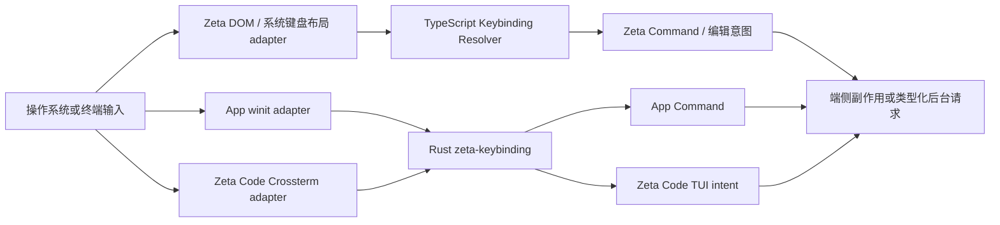

# 三端快捷键系统

> 文档所有权：本文是 Zeta、App 与 Zeta Code 共享快捷键语义、端侧输入边界和演进顺序的 canonical 架构文档。
> 实现细节分别由 [`zeta-keybinding`](../zeta-rs/keybinding/README.md)、[`zeta-keybindings-host`](../app/keybindings/README.md)、[`zeta-code` TUI](../zeta-code/tui/README.md) 和 [Zeta 浏览器基础](../zeta-ts/docs/browser-foundation.md)维护。
> 状态：共享 Rust 核心与用户配置编译器、Zeta Code `AppKeymap`/Keymap 设置界面（入口为 `/shortcuts`）、App、Zeta TypeScript 输入链路和跨语言 conformance 向量均为 Current。

## 快速理解

三端共享“按键序列如何匹配命令”的规则，但各自在本地把平台事件转换成标准按键；原始按键不发送给 App Server，也不要求三个产品共享同一份命令表。

| 用户场景 | Zeta | App | Zeta Code |
| --- | --- | --- | --- |
| 输入普通文字 | 浏览器、IME 与编辑器处理 | 窗口输入法或终端面板处理 | 终端与 Crossterm 处理 |
| 触发快捷键 | TypeScript Resolver 根据焦点和 ContextKey 解析 | Rust Resolver 根据窗口 context 解析 | 精简 Rust Keymap 根据 TUI 焦点解析 |
| 系统键盘布局变化 | 重新加载系统布局和 Mapper | `winit` 提供标准化逻辑键与物理键 | 不检测；终端已经完成布局转换 |
| 修改快捷键 | profile `keybindings.json` | 设置浮层写入 `config.toml` 的 `[gui].keybindings`；配置变化后重读 `[gui]` | `/shortcuts` 写入 `config.toml` 的 `[tui].keybindings`；配置变化后重读 `[tui]` |
| 执行命令 | Renderer 内执行命令或产生编辑意图 | App host 执行 `AppCommandId` | TUI 主循环执行 `AppCommand` 或局部 component intent |

后续章节依次说明[一次按键的流程](#2-端到端流程)、[所有权](#3-所有权与依赖方向)、[一致性边界](#5-跨语言一致性)和[当前状态与演进](#8-当前状态与演进)。

## 1. 决策

快捷键系统固定区分三个概念：

- **键盘布局（keyboard layout）**：把物理位置、系统布局和修饰键转换成逻辑键，只由拥有原始窗口事件的宿主处理。
- **快捷键绑定（keybinding）**：一个按键序列、条件、来源、优先级和目标命令组成的规则。
- **键位表（keymap）**：某个产品注册的完整快捷键集合及其当前上下文，不跨产品共享命令身份。

`zeta-keybinding` 是没有 UI、I/O、平台事件和产品命令依赖的 Rust 语义核心。App 与 Zeta Code 直接依赖它；Zeta 的 Renderer 保留 TypeScript 实现，并通过共享规范和测试向量保持行为一致。

不把 Rust Resolver 放入 App Server，也不让 Zeta Renderer 经 IPC、N-API 或 WASM 解析每个按键。`preventDefault()`、焦点、IME 和 Chord 状态都要求端侧即时决定。

## 2. 端到端流程



一次按键按以下顺序处理：

1. 宿主接收 DOM、`winit` 或 `crossterm::KeyEvent`。
2. 宿主适配器生成逻辑键、可用时的物理键和精确修饰键；输入法组合文字不伪装成快捷键。
3. 当前产品提供焦点、模式和可用性上下文，Resolver 选择命令、阻止规则、等待后续 Chord 或不匹配。
4. 产品 Keymap 把匹配结果转换成自己的命令或局部意图。
5. 只有命令产生的类型化业务请求、编辑操作或终端字节可以进入后台；原始按键和用户输入内容不进入 App Server 日志。

## 3. 所有权与依赖方向

| 组件 | 拥有 | 明确不拥有 |
| --- | --- | --- |
| `zeta-keybinding` | `KeyStroke`、Chord、Parser、Context expression、来源、优先级、冲突和 Resolver | `winit`、Crossterm、DOM、UI、定时器、文件、产品命令 |
| `zeta-keybinding::user` | 严格配置 shape、平台覆盖、命令/条件回调编译和重复规则诊断 | profile 路径、文件轮询、产品命令 catalog、设置 UI |
| Zeta Keyboard Layout | ScanCode、KeyCode、AltGr、死键、系统布局、浏览器映射 | Rust Keymap、后台命令执行 |
| Zeta Keybinding Service | ContextKey、Chord lifecycle、浏览器事件阻止和命令执行 | 系统布局采集、App Server 状态 |
| `zeta-keybindings-host` | `zui` 输入适配、Chord timeout、用户配置校验 | App UI、配置读写、产品命令副作用 |
| App Keymap | `AppCommandId`、内建规则和窗口 context | 通用 Parser、设置组件绘制 |
| App 快捷键 UI | 录制生命周期、设置浮层、诊断展示、`[gui].keybindings` 解释与写入 | Resolver、App Server 持久化实现、命令执行 |
| Zeta Code `AppKeymap` | Crossterm 适配、应用级 action、Chord lifecycle 和局部 context | component 编辑/导航、键盘布局、物理 ScanCode、App Server authority |
| App Server | 按 revision 持久化前端传入的 `[gui]`、`[tui]` 值，发送配置变化通知 | 快捷键字段含义、命令表、原始按键、焦点、IME 和 Chord |

依赖方向固定为：

```text
App product ──→ zeta-keybindings-host ──→ zeta-keybinding
Zeta Code TUI ─────────────────────────────→ zeta-keybinding
Zeta Renderer ──→ TypeScript keybinding implementation

all clients ── semantic command only ──→ App Server
```

如果 `zeta-keybinding` 开始依赖 `zui`、`zeta-ui-components`、`winit`、Crossterm、profile 路径或产品命令，说明共享边界已经漂移。若 Zeta Renderer 需要 IPC 才能决定是否阻止浏览器按键，也说明执行边界已经漂移。

## 4. 共享语义与产品差异

三端共享以下语义：

- 一至四段有序 Chord；
- 逻辑键和可选物理键身份；
- Control、Shift、Alt、Meta 和 portable `primary`；
- Builtin/Workbench/User 来源、显式优先级和后注册覆盖；
- 条件过滤、阻止规则和 Chord prefix；
- `NoMatch`、`PendingChord`、`Command` 和 `Blocked` 四类解析结果。

三端不共享以下产品事实：

- 命令 ID、默认 Keymap 和命令参数；
- 焦点树、ContextKey catalog 和局部输入传播；
- Chord timeout、IME、窗口失焦和事件阻止副作用；
- 设置 UI、快捷键提示样式和诊断展示；
- 用户配置的产品命令 catalog、资源路径和设置 UI。

Zeta Code 把根级运行时结构称为 `AppKeymap`，不称为 `GlobalKeymap`。用户规则没有 `when` 时表示“在本产品所有上下文中适用”，这是规则作用域，不是另一个运行时对象。Composer 的字符编辑、Selection 的方向键和 Transcript 的滚动继续由各 component 拥有。单键先交给当前 component，只有未消费事件进入应用级 fallback；多段 Chord prefix 则先经过应用级 matcher，避免首段被文本组件吞掉。应用级 default 声明同时生成 Resolver 注册和 `/shortcuts` 可配置项；少量有产品语义的固定操作由该 feature 汇总展示，通用方向键不作为快捷键条目；附加 Shift、Alt、Meta 或 Hyper 不会匹配只声明 Control 的组合。

`AppKeymap` 已拥有一至四段 Chord 的 pending sequence、1 秒超时、上下文变化取消、Esc 取消、错误后续键透传和 footer 提示。当前内建应用级绑定仍都是单段；以后增加多段声明不再需要建立第二套状态机。`Esc Esc` rewind 保留为根界面的专用交互：普通 Esc 在 Chord pending 时只负责取消，不同时推进 rewind。

## 5. 跨语言一致性

Rust crate 与 TypeScript 实现共享 JSON conformance fixtures，而不是共享运行时二进制。当前 fixture 固定共同子集中的：

- 有效和无效字符串，以及 Unicode 空白分隔的规范化；
- canonical 序列化；
- portable modifier 别名的 canonical 归一化；
- Chord 数量上限；
- 规则来源、显式优先级和注册顺序；
- condition filter、blocker、Chord prefix 与 no-match 结果。

Rust 与 TypeScript 都显式按“来源、同来源内优先级、注册顺序”比较；任何数值优先级都不能跨越来源层级。共同 fixture 要求 User 先于 Workbench、Workbench 先于 Builtin，再在同一来源内比较 priority，最后由后注册规则打破平局。

展示标签、浏览器 ScanCode 白名单和单修饰键 keyup 行为属于宿主能力，不进入强制跨语言相等断言。Rust 物理键只保存宿主已经标准化的非空标识，浏览器端额外使用 ScanCode catalog 校验；这是 adapter 能力差异，不改变共享 Resolver 语义。新增共享语法必须同时修改 Rust、TypeScript、fixtures 和本文；产品专属扩展必须在对应实现文档中标出，不得悄悄改变共享 grammar。

## 6. 配置与持久化

用户自定义快捷键是三端的正式产品能力。每个产品拥有自己的命令规则和字段解释，也不把原始按键发送到后台。App Server 只按不透明值持久化 `[gui]` 与 `[tui]`，具体结构分别由 App 和 Zeta Code 解释。

### 6.1 资源位置

| 产品 | Current 资源 | 原因 |
| --- | --- | --- |
| Zeta | `<profile>/keybindings.json` | Workbench command catalog 与 Renderer settings UI 的 authority |
| App | 当前连接对应 `config.toml` 的 `[gui].keybindings` | App 拥有命令表和设置浮层；App Server 只保存 `[gui]` |
| Zeta Code | 当前连接对应 `config.toml` 的 `[tui].keybindings` | TUI 拥有命令表和 `/shortcuts`；App Server 只保存 `[tui]` |

`ZETA_PROFILE_ROOT` 是 Zeta 自己的 profile authority。App 和 Zeta Code 都通过 `config/read`、`config/update` 与 `config/changed` 访问当前连接对应的配置；连接远端时读写远端 `config.toml`，不会回头读取本机的 App/TUI 键位文件。

`[gui]` 与 `[tui]` 是独立产品配置。它们可以采用同一套 Rust 规则格式，但不能互相解释、复制或改写；两端 command catalog 不兼容也不构成问题。

### 6.2 规则契约

App 与 Zeta Code 的 Rust 规则是最多 1024 项的严格数组，分别写成 TOML 数组表。下面以 TUI 为例；App 只需把前缀换成 `gui`：

```toml
[[tui.keybindings]]
key = "primary+k primary+c"
command = "zetaCode.action.copyLastResponse"
when = "inputFocus && !selectionVisible"
mac = "cmd+k cmd+c"
linux = "ctrl+k ctrl+c"
win = "ctrl+k ctrl+c"

[[tui.keybindings]]
key = "ctrl+o"
block = true # 阻止这个默认规则
```

- `key` 必填，使用共享的一至四段 portable 语法。
- 每项必须二选一：`command` 字符串绑定本端稳定命令，`block = true` 阻止同一按键的默认规则。
- `when` 可选；省略表示本产品所有上下文，不能称为 `GlobalKeymap`。
- `mac`、`linux`、`win` 可选；字符串覆盖该平台键位，`false` 表示该平台不注册此项。
- User 高于 Workbench/Builtin；同来源比较显式 priority，最后由后声明规则获胜。
- Rust App/TUI 当前不支持命令 `args`；Zeta Renderer 的 `keybindings.json` 保留自己的 JSON 契约和 `args` 扩展。

Zeta Code 当前可配置 command ID：

| Command ID | 行为 |
| --- | --- |
| `zetaCode.action.cycleApprovalMode` | 切换下一次提交的权限模式 |
| `zetaCode.action.openRewind` | 直接打开 Rewind picker；不模拟 `Esc Esc` |
| `zetaCode.action.attachClipboardImage` | 从本机剪贴板附加图片 |
| `zetaCode.action.interruptOrQuit` | 工作时中断，空闲时退出 |
| `zetaCode.action.copyLastResponse` | 复制最近一条 Agent response |
| `zetaCode.action.suspend` | Unix suspend/resume 流程 |

Zeta Code 当前 ContextKey 为 `inputFocus`、`composerEmpty`、`selectionVisible` 和 `keyEventPress`。未知 command、字段或 ContextKey 会拒绝整个新快照，避免用户以为规则已生效。

### 6.3 生命周期与故障处理

App 和 TUI 连接 App Server 后分别读取 `[gui].keybindings` 与 `[tui].keybindings`，收到 `config/changed` 后重新读取自己负责的表。编译发生在临时规则集：完整数组、command、condition 和产品 Chord 约束全部通过后，才以一次替换安装 User rules 并取消旧 pending Chord。坏更新保留上一份有效规则并产生可见诊断；缺少该键时恢复纯内建规则。

共享 `zeta-keybinding` 只编译规则，不读配置、不知道 profile 路径；App 与 TUI 分别拥有字段解释、诊断呈现和编辑，App Server 只校验配置 revision 并持久化前端传入的完整表。

`/shortcuts` 只新增、替换或清除目标 command 的 User 字符串规则；固定操作项只读。“替换 User 项”不会删除 default 键位，也不会改写 `block = true` 规则。需要禁用 default 键位、添加 `when` 或设置平台覆盖时直接编辑 TOML。录制结果写入 portable `key`，因此适用于所有平台；单键和两段 Chord 可在 Keymap editor 中录制，三至四段 Chord 继续直接配置。App 设置浮层同样只编辑 `[gui].keybindings` 中目标 command 的规则。

### 6.4 设置界面与后续边界

| 阶段 | 状态 | 退出条件 |
| --- | --- | --- |
| 严格规则 schema、User 覆盖/blocker、平台覆盖、`when`、Chord 与配置刷新 | Current | Zeta Code、App 和共享 core 测试持续覆盖完整替换 |
| Zeta Code 可搜索的 Keymap editor | Current | `/shortcuts` 打开 Keymap 设置界面，以“快捷键、职责、default/user 来源”三列汇总 default 与 User 键位，不展示内部 command ID；诊断和配置位置可见，可配置项只消费 `AppKeymap` snapshot |
| Zeta Code 录制与保存 | Current | 单键/两段 Chord 录制只在 Keymap editor 的 `KeyCapture` 中截获输入；配置 revision 过期时拒绝保存，完整编译成功后才更新配置和运行时规则 |
| 目录提供的键位 | Not accepted | `DirConfigDocument` 不接受键位声明；如需支持必须先定义独立来源 capability 与显式启用 |
| OS `systemWide` 热键 | Not accepted | 只可能由拥有窗口快捷键能力的 Zeta/App 实现；TUI 不支持 |

## 7. 可靠性、隐私和兼容性

- 快捷键解析必须在端侧立即完成，不能等待网络或后台进程。
- Troubleshooting 默认关闭；开启时只能记录按键元数据、匹配阶段和命令 ID，不能记录 composer 文本、密码或剪贴板内容。
- 终端通常只能提供逻辑键和修饰键；Zeta Code 不伪造不存在的 ScanCode，也不承诺区分终端无法区分的组合。
- AltGr、死键和 IME 由拥有原始图形窗口事件的 Zeta/App adapter 处理；TUI 消费终端已经解释后的结果。
- Ctrl-C、Ctrl-D、Ctrl-Z 等终端保留语义由 Zeta Code 产品 Keymap 明确注册，不能由共享 core 隐式决定。

## 8. 当前状态与演进

| 阶段 | 状态 | 退出条件 |
| --- | --- | --- |
| Zeta TypeScript layout、Mapper、Resolver 和 profile resource | Current | 浏览器与 Electron 测试持续覆盖布局和快捷键 |
| App Rust Resolver、输入 adapter、`[gui].keybindings` 与设置 UI | Current | 配置通知、完整替换、坏更新保留旧规则和录制写入持续通过测试 |
| 提升无 UI 的 `zeta-keybinding` 到 `zeta-rs/keybinding` | Current | crate 不含产品/UI/platform 依赖，App 继续通过测试 |
| Zeta Code 应用级固定 Keymap 与 Chord lifecycle | Current | 现有 Ctrl/BackTab/Esc 行为由共享 Resolver 驱动；pending/超时/取消/提示完整，局部 component key 不上移 |
| TS/Rust parser conformance fixtures | Current | 两个实现读取同一 fixture 并通过 |
| TS/Rust Resolver precedence fixtures | Current | Builtin/Workbench/User 来源、极值优先级、后注册覆盖、condition、blocker 和 prefix 读取同一 fixture |
| Zeta Code 用户可配置 Keymap | Current | `[tui].keybindings`、User precedence/blocker、`when`、平台覆盖、Chord、配置刷新和坏更新恢复持续通过测试 |
| Zeta Code Keymap editor 与录制保存 | Current | 可搜索、来源/诊断可见；保存后直接安装同一份已校验规则，不建立第二套 Resolver |

当前 Rust 路径只有一套纯 core：App 的快捷键设置页面由 `zeta-settings` 管，工作界面的组合键提示由 `zeta-workbench` 管，Zeta Code 根级 Keymap 直接接入共享 Resolver。adapter 只做单向转换，不保留第二套 Resolver。

共享 core 可用 `bazel test //zeta-rs/keybinding:keybinding-unit-tests` 在三端平台验证。App 的运行时规则、设置页面和工作界面提示分别由 `//app/keybindings:keybindings-unit-tests`、`//app/settings:settings-unit-tests` 和 `//app/workbench:workbench-unit-tests` 验证。Windows Bazel 通过仓库拥有的 `rules_rs` 兼容补丁使用 gnullvm-hosted Rust tools，使 `rustc`、过程宏 DLL 和 hermetic LLVM/MinGW linker 使用同一 ABI；这些目标在 Windows、Linux 与 macOS 都实际运行，不再使用平台跳过。

## 9. 长期不变量

- 原始键盘事件不离开当前客户端。
- App Server 不解析快捷键，也不拥有客户端焦点和 Keymap。
- Rust 共享 core 没有 UI、I/O、平台事件和产品命令依赖。
- App 与 TUI 共享 Rust 规则格式；Zeta 保留自己的 JSON 契约。三端各自拥有命令 catalog 与默认 Keymap。
- Zeta Renderer 的按键决定保持即时，不因跨语言复用引入 IPC/WASM 热路径。
- 局部文本编辑和导航留在拥有状态的 component，不为形式统一全部提升到全局命令总线。
