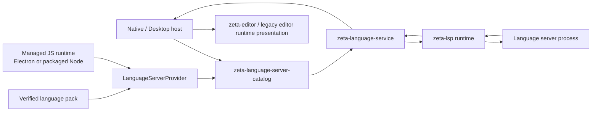

# 语言服务器系统

> 状态：catalog/provider、托管 Node、低层 LSP runtime 与产品级 language-service supervisor 已实现；Desktop/App Server
> 已接入 revision-bound 语言请求与编辑器 provider，Native 仍保留既有 Rust、JSON/JSONC、Shell
> 设置和 diagnostics presentation。
> 本文拥有跨 crate 的语言能力语义、所有权和演进阶段；当前实现接口与修改路径由
> [`zeta-lsp` README](../zeta-rs/lsp/README.md) 和
> [`zeta-language-server-catalog` README](../zeta-rs/language-server-catalog/README.md)、
> [`zeta-language-service` README](../zeta-rs/language-service/README.md) 分别拥有。本地符号索引与
> Language Server 结果如何组合、以及未来代码图的边界见
> [`code-intelligence.md`](code-intelligence.md)。跨 package family 的 Marketplace source、共享验证、
> 领域投影与失败隔离见 [`marketplace-integration.md`](marketplace-integration.md)。

## 快速理解

Zeta 通过独立的 catalog、语言服务协调层和 LSP 运行时连接现有语言服务器，而不是把语言分析逻辑
写进编辑器。Native 已接入文档生命周期和事件循环；App Server Config authority 持久化
三个内置服务器的 Disabled/Automatic/Enabled 与可选绝对 executable path。Settings 中每个 server
都有独立的 Enable switch，默认关闭；开启时默认选择 Automatic，仍可用 Launch mode 选择
Automatic 或 Enabled。未配置的 PATH server 默认 Disabled，不会自动拉起；用户显式开启后才从进程
启动时冻结的 PATH 解析。Marketplace package 的安装确认同时写入 activation receipt，因此其 packaged
route 默认启用；显式 Config `Disabled` 仍可关闭。缺失或不可执行时保持无语言服务器。

| 使用场景 | 当前结果 | 谁负责下一步 |
| --- | --- | --- |
| 启动一个已解析的语言服务器命令 | ✅ 完成 initialize/initialized，冻结能力和位置编码 | `zeta-lsp` |
| 打开、修改、保存和关闭文档 | ✅ Native 发送 editor revision/full text；协调层绑定 LSP version | `zeta-language-service` + `zeta-lsp` |
| hover、completion、definition 等请求 | ✅ 产品 facade、capability/freshness gate、Desktop 编辑器 provider；completion resolve/command 和多目标 Peek 已接通 | `zeta-language-service` + Desktop |
| 请求取消与冷暖延迟观测 | ✅ in-flight task cancellation；按 request kind/server incarnation/config/service generation 记录 content-free outcome | `zeta-language-service` + App Server metrics sink |
| Semantic Tokens 与文档特性 | ✅ Semantic Tokens、Document Symbols、CodeLens、Document Links、Document Colors、Folding 已适配现有 Editor contract | `zeta-language-service` + Desktop |
| push / document pull diagnostics | ✅ 共用 freshness 校验和 Problems 数据入口；pull full report 替换当前快照，unchanged report 保留已有结果 | `zeta-language-service` + App Server + Desktop |
| workspace diagnostics | ✅ 调用 `workspace/diagnostic`，App Server 通过 Workspace authority 读取未打开文件并转换范围，Desktop 将完整结果写入同一 Problems repository | `zeta-language-service` + App Server + Desktop |
| 日志、show message 与 work-done progress | ✅ Desktop 将日志投影到 Output/Language Servers，showMessage 使用 Workbench Dialog，活动进度显示在状态栏与 Output | App Server + Desktop Workbench |
| 显式替换服务器并恢复文档 | ✅ 新实例重放成功后切换 route/incarnation | 宿主需暂存 replacement 早期事件 |
| 配置与发现 Rust/JSON/Shell server | ✅ 独立 Settings draft、revision-safe mode/path、catalog 校验与热重配 | 扩展安装 provider/UI |
| 用共享 Node-compatible runtime 运行已验证 CSS package | ✅ Desktop 复用 Electron run-as-Node；Rust 同步 TUF catalog、校验兼容性，并从 activation receipt 自动重建 provider | 用户在 Settings/Languages 确认 exact signed package |
| 意外退出、退避重启和 crash-loop | ✅ 断连 retirement、有限指数退避、状态展示和全文重放 | `zeta-language-service` + Native |
| 安装、更新和选择其他 server | 部分具备；CSS 的 TUF download、确认、activation 与热 registry 已完成；其他 server 仍需 catalog adapter | Marketplace / catalog |
| 动态注册与 work-done progress | ✅ 按 server incarnation 隔离，静态与动态 capability 共同参与请求 gate | `zeta-lsp` + `zeta-language-service` |
| workspace edit | ✅ Language Service ordered edit、Desktop transaction 与 Workbench preview 已接通 | `zeta-language-service` + Desktop Workbench |
| LSP 3.18 新能力 | 尚未完成 | 后续按真实消费者逐项加入 |

继续阅读：[一次操作](#1-一次操作)、[所有权](#2-所有权边界)、
[失败语义](#3-可靠性与失败语义)、[当前状态](#4-当前实现与演进)。

## 1. 一次操作

1. Native 通过 `config/read` 获得持久化 server preference；Settings UI 通过 revision-safe typed
   command 更新，`config/changed` 只作为重新读取权威 snapshot 的失效提示。
2. 产品宿主把 preference、冻结的 executable candidates 和 execution policy 交给 catalog；catalog 只在候选
   可 canonicalize、为普通可执行文件时产生 resolved definition。对 package-backed CSS，宿主先把
   distribution activation authority 返回的 `InstalledLanguageServer` 和宿主选择的共享 Node-compatible runtime 注入
   `CssLanguageServerProvider`；provider 产生同样的 definition，不直接启动 child。
3. 产品宿主把 definitions 交给 `zeta-language-service`；无 definition 时禁用，不启动进程。
4. 协调层把 resolved command 委托给 `zeta-lsp`；后者启动或接入 transport、发送 initialize，
   并校验 server 选定的位置编码。
5. 运行时发送 initialized，只有此后才向调用方返回 ready client。
6. 宿主发送带 editor revision 的 full snapshot；协调层拒绝 stale revision，运行时从版本 1 开始，
   按协商策略发送后续 change/save/close。
7. hover、completion 或 definition 先经过 routed revision 与 capability gate，再转换协商位置编码并
   发送 typed request。结果必须再次通过 service generation、server epoch 和 editor revision；Native
   用鼠标请求 hover、用 Ctrl/Cmd+Space 打开 completion popup，只接受可安全投影为精确 UTF-8
   `textEdit` 的候选，F12 definition 通过 App Server 文件 authority 打开目标。
   请求 task 绑定 service generation、server incarnation 与 editor revision；显式取消、disable、重配或
   shutdown 都会中止 task。完成后只记录 kind、代次、cold/warm、elapsed、result count 和 terminal
   outcome，不记录路径、文本、query 或 position。
8. Server push diagnostics 时，协调层按 URI、document version 和当前 position encoding 拒绝
   stale result、转换为 UTF-8 byte range，再交给产品 event loop；Native adapter 转换为
   `CodeEditorDiagnostic`，CodeEditor 按 source row/soft-wrap geometry 绘制并执行 hover hit-test。
9. 关闭时依次执行 shutdown request、exit notification、driver stop 和 child reap。

文档内容仍由 EditorHost 拥有。LSP version 只是 open document 的协议顺序，不是磁盘 revision、
Git object identity 或 durable product sequence。

## 2. 所有权边界

| 能力 | `zeta-lsp` | Catalog / Provider | Language Service | Distribution | Native / Editor | App Server |
| --- | --- | --- | --- | --- | --- | --- |
| framing、initialize、request pairing、shutdown | ✅ | ❌ | 委托 | ❌ | ❌ | ❌ |
| PATH discovery、canonical executable、server identity | ❌ | ✅ | ❌ | ❌ | 提供候选/policy | ❌ |
| managed Node 与 package/native 启动命令 | 只执行冻结 command | ✅ | ❌ | 只返回入口路径 | 注入 package/provider | 组合 registry |
| process enablement、language route、generation | ❌ | 提供 definition | ✅ | ❌ | 组合 | 配置与组合 |
| restart backoff、预算和 crash-loop | 只上报断连事实 | ❌ | ✅ | ❌ | 展示运行态 | 事件转发 |
| server 包 TUF/digest 校验与 side-by-side 安装 | ❌ | 只消费已安装 receipt | ❌ | ✅ 安装/activation | 展示确认 | ✅ 组合 Marketplace consumer |
| 当前 document text / editor revision | ❌ | ❌ | 借用 snapshot | ❌ | ✅ | 文件 I/O authority |
| diagnostics freshness 与 position conversion | 提供协议事实 | ❌ | ✅ | ❌ | ✅ Editor 绘制，Native hover | 协议投影 |
| mode/path durable preference | ❌ | 只消费 preference | ❌ | ❌ | Settings UI / adapter | ✅ authority |
| workspace trust / executable policy | ❌ | 只消费结果 | 只消费 definition | ❌ | 协调 | authority |

`zeta-editor` 保持纯 presentation，不依赖 catalog、`zeta-lsp` 或协调层。Native host 组合 catalog、
editor 和 `zeta-language-service`，只在 adapter 中转换文档与事件；
Desktop 的 legacy editor runtime host 可以消费相同系统语义，但不需要复用 Native paint types。
App Server 已经是 Desktop 的 workspace/document authority 与 LSP IPC boundary；它只组合 provider、配置、
`zeta-language-service` 和协议 DTO，不复制 LSP framing、process supervisor 或 Editor presentation。

## 3. 可靠性与失败语义

- **有界 transport**：header 上限为 16 KiB，单消息上限为 4 MiB；非法 framing 或 envelope
  明确终止 connection。
- **初始化 gate**：initialize 失败、超时或选择不支持的位置编码时，不返回部分 ready client。
- **请求隔离**：每个 request 使用唯一整数 ID 和独立 completion；普通请求超时后发送协议取消。
- **文档顺序**：同一 URI 的 open/change/save/close 在 document lock 下排序；change 版本只在
  notification 成功写入 transport 后提交。
- **宿主回调**：事件 callback 必须快速返回；阻塞 callback 会阻塞该 server 的协议进展。
- **进程回收**：规范关闭失败仍继续 exit 和 cleanup；直接 drop 只作为 fail-safe kill。
- **替换恢复**：新服务器先按 URI 排序重放当前全文；任一 open 失败就清理 replacement 并保留
  原 route。成功后 server incarnation 递增、LSP document version 从 1 重新开始。
- **请求观测**：`Delivered`、`Empty`、`Failed`、`Cancelled`、`StaleDiscarded` 与 `Rejected` 显式
  区分；cold/warm 以 `(server, incarnation, request kind)` 计算，避免把重启后的首次请求算作 warm。

意外 EOF、framing failure 或 transport channel 关闭会产生 `TransportClosed`。Supervisor 只接受
当前 service generation 和 server epoch 的断连事件：Starting 阶段直接进入失败决策，Ready 阶段
先清空该 route 的 diagnostics、标记文档 unrouted、退休旧 route/bindings，再按有限指数退避启动
新进程。默认最多重启五次，延迟从 250 ms 增长到 4 s 上限；Ready 持续 60 s 后连续失败预算重置，
预算耗尽则进入可见 `CrashLoop`。禁用或热重配会使旧 launch、timer 和协议事件失效。新实例 Ready
后从协调层保留的 authoritative editor snapshots 重放，不从已退休 router 复用旧文本。

## 4. 当前实现与演进

### 当前状态

- 独立 `zeta-lsp` crate、Cargo/Bazel target 和 typed `lsp-types` public surface；
- stdio child 与 caller-provided async transport；
- initialize/initialized、workspace configuration、动态 capability registration、work-done progress、push/document-pull diagnostics、日志和消息事件；
- full/incremental document synchronization、save policy 和单调 version；
- generic typed requests、deadline cancellation、shutdown/exit；
- 唯一 language route、EditorHost revision binding、显式 server replacement 和全文 replay；
- 独立 `zeta-language-server-catalog`、Rust built-in identity、frozen PATH resolution 和 policy gate；
- `LanguageServerProviderRegistry`、`ManagedNodeRuntime` 和 verified CSS package provider；
- Desktop 通过 allowlisted `ZETA_ELECTRON_RUN_AS_NODE_PATH` 复用 exact Electron executable，且只在
  language-server child 的 clean environment 中设置 `ELECTRON_RUN_AS_NODE=1`；
- standalone/headless package 保留锁定 Node.js runtime 与 license 作为非 Electron 回退；
- App Server 将 activation-confirmed provider definition 与显式启用的 built-in catalog definition 合并后交给同一 supervisor；
- 独立 `zeta-language-service` supervisor、显式 enablement、resolved definition 校验、generation gate；
- Native 文档 open/change/save/close、workspace replacement 与 event-loop adapter；
- `zeta-config` mode/path schema、App Server typed mutation/config notification，以及三个内置 server 的
  Native Settings selector 与独立 draft；
- config generation gate、server replacement 与全部打开文档 replay；
- diagnostics freshness 校验、UTF-8/UTF-16 position conversion 和 product-neutral event；
- Native revision gate、CodeEditor severity squiggle/soft-wrap projection 与 hover detail；
- transport-close detection、断连 route retirement、server epoch gate、有限指数退避与 crash-loop state；
- Native Settings 的 Starting/Ready/BackingOff/CrashLoop/Failed/Stopped runtime projection；
- hover/completion/resolve/command/navigation/hierarchy/rename/code-action/formatting/signature-help/inlay-hints/linked-editing product facade、
  capability gate、三重 freshness gate、Renderer latest-request gate 与可见交互；
- 语言请求 in-flight task registry、显式 cancellation，以及 content-free cold/warm latency/result-count/
  terminal-outcome metrics sink；
- Semantic Tokens、Document Symbols、CodeLens、Document Links、Document Colors、Folding 的 revision-bound facade 与 Desktop Editor provider；
- document/workspace pull diagnostics 的 capability gate、report projection、App Server route 与 Desktop Problems 数据接入；
- 多 definition target 使用现有 Peek 列表选择，单目标直接导航；
- Rust、JSON/JSONC、Shell 三项 built-in catalog definitions；
- 通用 Marketplace Manager 的 TUF verified download、整包 digest 复核、immutable install/update/uninstall；
- Marketplace Language asset 投影到共享 Extension catalog，Executable 按 signed language route 和
  `node`/`direct` runtime 组合 provider；
- Desktop Settings/Languages 复用通用 Marketplace API 的 `packageType=language` 发现与安装，并在
  install/update/uninstall 后热重建 provider registry；
- in-memory protocol vertical tests。

### 计划

1. 把 workspace trust 的明确结果映射为 catalog execution policy。
2. 增加 pull diagnostics 的 result-id cache、partial-result progress 与 `workspace/diagnostic/refresh`。
3. 为更多 language-server family 增加领域初始化参数 adapter，并为未引用 artifact 增加独立
   garbage collection policy。
4. 先评估已记录的重复请求、冷暖延迟和取消率；只有收益显著时才设计 session navigation cache。
   cache 必须绑定 server incarnation、configuration/service generation、request shape 和 document
   revision；当前没有安装或持久化 navigation cache。

### 潜在方向

远程 workspace 或共享 daemon 出现后，可以把 server execution 放到 App Server 后方；前置条件是
定义 workspace authority、document content transport、cancellation、incarnation、privacy 和
disconnect recovery。当前本地 editor request 不承担这套远程成本。

长期不变量是：协议运行时不拥有编辑器文档，编辑器组件不解析 LSP，宿主不把旧文档版本的结果
应用到当前 revision，未实现的 server capability 不对外宣称。
