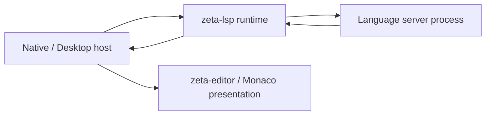

# 语言服务器系统

> 状态：低层 LSP client runtime 已实现；产品宿主接入为 Proposed。
> 本文拥有跨 crate 的语言能力语义、所有权和演进阶段；当前实现接口与修改路径由
> [`zeta-lsp` README](../zeta-rs/lsp/README.md) 拥有。

## 快速理解

Zeta 通过独立的 LSP 运行时连接现有语言服务器，而不是把语言分析逻辑写进编辑器。当前已经具备
可测试的协议纵切；用户可见的诊断、补全和跳转仍需 Native 或 Desktop 宿主接线。

| 使用场景 | 当前结果 | 谁负责下一步 |
| --- | --- | --- |
| 启动一个已解析的语言服务器命令 | ✅ 完成 initialize/initialized，冻结能力和位置编码 | `zeta-lsp` |
| 打开、修改、保存和关闭文档 | ✅ 按 server capability 同步，并维护单调文档版本 | `zeta-lsp` + 产品宿主 |
| hover、completion、definition 等请求 | ✅ 可通过标准类型发送，具备配对、deadline 和取消 | 产品宿主决定何时请求和如何展示 |
| push diagnostics、日志和 show message | ✅ 作为宿主事件交付 | 产品宿主尚未投影到 UI |
| 显式替换服务器并恢复文档 | ✅ 新实例重放成功后切换 route/incarnation | 宿主需暂存 replacement 早期事件 |
| 自动发现、安装、选择和退避重启服务器 | 尚未完成 | 计划中的 product host / supervisor |
| 动态注册、workspace edit、pull diagnostics、LSP 3.18 新能力 | 尚未完成 | 后续按真实消费者逐项加入 |

继续阅读：[一次操作](#1-一次操作)、[所有权](#2-所有权边界)、
[失败语义](#3-可靠性与失败语义)、[当前状态](#4-当前实现与演进)。

## 1. 一次操作

1. 产品宿主根据 workspace、language ID 和用户配置解析可信的 server command。
2. `zeta-lsp` 启动或接入 transport，发送 initialize，并校验 server 选定的位置编码。
3. 运行时发送 initialized，只有此后才向调用方返回 ready client。
4. 宿主打开文档；运行时从版本 1 开始，按协商策略发送后续 change/save/close。
5. hover、completion 或 definition 等请求通过 typed protocol method 发送。超时会发送
   `$/cancelRequest`，迟到 response 只完成原 pending ID，不修改文档 authority。
6. Server push diagnostics 时，运行时解析并交给宿主；宿主按 URI、document version 和当前
   position encoding 决定是否展示。
7. 关闭时依次执行 shutdown request、exit notification、driver stop 和 child reap。

文档内容仍由 EditorHost 拥有。LSP version 只是 open document 的协议顺序，不是磁盘 revision、
Git object identity 或 durable product sequence。

## 2. 所有权边界

| 能力 | `zeta-lsp` | 产品宿主 | `zeta-editor` / Monaco | App Server |
| --- | --- | --- | --- | --- |
| framing、initialize、request pairing、cancel、shutdown | ✅ | ❌ | ❌ | ❌ |
| document sync version 与 server capability snapshot | ✅ | 协调 | ❌ | ❌ |
| server discovery、安装、可信 command 与 restart policy | ❌ | Proposed | ❌ | ❌ |
| file URI、language ID、当前 document/revision | ❌ | ✅ | 协调 | 文件 I/O authority |
| diagnostics freshness 与 position conversion | 提供事实 | ✅ | 展示 | ❌ |
| underline、hover widget、completion list、navigation | ❌ | 协调 | ✅ | ❌ |
| workspace configuration policy | transport callback | ✅ | ❌ | Potential shared config |

`zeta-editor` 保持纯 presentation，不依赖 `zeta-lsp`。Native host 可以同时依赖二者并完成 projection；
Desktop 的 Monaco host 可以消费相同系统语义，但不需要复用 Native paint types。App Server 只有
在出现远程语言服务器、共享 workspace authority 或第二个进程消费者后才应增加 LSP method；
当前不能为了形式统一把高频 editor-local request 绕进 App Server。

## 3. 可靠性与失败语义

- **有界 transport**：header 上限为 16 KiB，单消息上限为 4 MiB；非法 framing 或 envelope
  明确终止 connection。
- **初始化 gate**：initialize 失败、超时或选择不支持的位置编码时，不返回部分 ready client。
- **请求隔离**：每个 request 使用唯一整数 ID 和独立 completion；普通请求超时后发送协议取消。
- **文档顺序**：同一 URI 的 open/change/save/close 在 document lock 下排序；change 版本只在
  notification 成功写入 transport 后提交。
- **宿主回调**：事件 callback 必须快速返回；阻塞 callback 会阻塞该 server 的协议进展。
- **进程回收**：规范关闭失败仍继续 exit 和 cleanup；直接 drop 只作为 fail-safe kill。
- **替换恢复**：新服务器先按 URI 排序重放当前全文；任一 open 失败就清理 replacement 并保留
  原 route。成功后 server incarnation 递增、LSP document version 从 1 重新开始。

当前 runtime 不自动检测或重启。产品 supervisor 创建 replacement 后可委托 router 重放，但必须
在 `replace_server` 成功前暂存 replacement host 事件。旧 incarnation 的 diagnostics、completion
和 hover 不能应用到新文档 revision。

## 4. 当前实现与演进

### 当前状态

- 独立 `zeta-lsp` crate、Cargo/Bazel target 和 typed `lsp-types` public surface；
- stdio child 与 caller-provided async transport；
- initialize/initialized、workspace configuration、push diagnostics、日志和消息事件；
- full/incremental document synchronization、save policy 和单调 version；
- generic typed requests、deadline cancellation、shutdown/exit；
- 唯一 language route、EditorHost revision binding、显式 server replacement 和全文 replay；
- in-memory protocol vertical tests。

### 计划

1. 在真实 EditorHost 中建立 `URI + language ID + editor revision → server document version`
   binding，并投影 diagnostics。
2. 以 resolved configuration 建立 server catalog 和 crash/restart supervisor，复用现有 route
   replacement/replay，并拒绝旧 incarnation result。
3. 接入 hover、completion、definition/reference 和 workspace symbols，并为每项建立 capability
   gate、stale-result rule 与 UI ownership。
4. 有真实消费者后再增加 dynamic registration、workspace edit、progress、semantic tokens 和
   pull diagnostics。

### 潜在方向

远程 workspace 或共享 daemon 出现后，可以把 server execution 放到 App Server 后方；前置条件是
定义 workspace authority、document content transport、cancellation、incarnation、privacy 和
disconnect recovery。当前本地 editor request 不承担这套远程成本。

长期不变量是：协议运行时不拥有编辑器文档，编辑器组件不解析 LSP，宿主不把旧文档版本的结果
应用到当前 revision，未实现的 server capability 不对外宣称。
