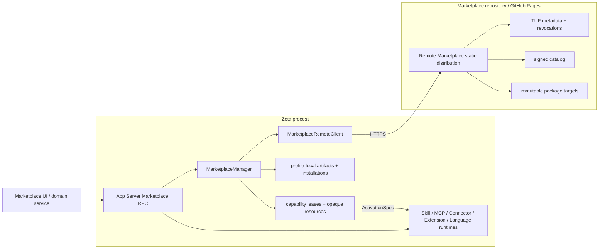

# Marketplace 接入架构

> 类型：canonical 跨仓架构文档。
> 当前状态：Zeta 内置本地 Marketplace Manager，并直接消费远端 Marketplace 的 HTTPS/TUF
> 静态分发；旧 JSONL compatibility adapter、独立 Manager binary 和 Desktop packaging 已删除。
> App Server Marketplace RPC 与 Settings service 已接通。Skill、MCP、Connector、Theme、Language
> 和可选 executable Editor Extension 都从同一个 Manager artifact/installation 入口进入各自领域；
> 旧 Plugin/Language 专用远端分发与安装链路均已删除。
> Embedded/stdio client 的发行配置发现细节见
> [`zeta-app-server-client` README](../zeta-rs/app-server-client/README.md)。

## 快速理解

`marketplace` 是远端签名 registry，`MarketplaceManager` 是 Zeta 本地库。两者不是 client/server
进程对，也不通过 JSONL 相连。

| 组件 | 位置 | 职责 |
| --- | --- | --- |
| Remote Marketplace | `../marketplace` + GitHub Pages | catalog、publisher、签名、撤销、TUF metadata 和 package targets |
| Marketplace client | `zeta-rs/marketplace-client` | HTTPS/TUF、远端发现和 verified download 的私有适配 |
| Marketplace Manager | `zeta-rs/marketplace-manager` | 本地 artifact、安装、更新、卸载、lease 和 opaque resource |
| App Server | `zeta-rs/app-server` | 稳定 RPC、connection-owned lease 和 error mapping |
| capability consumers | Skill/MCP/Connector/Theme/Language/Editor Extension 各领域 | enable/grant、认证、配置、激活、执行、停用 |

Zeta 产品层依赖 Marketplace 的业务能力，不依赖 Marketplace 的远端存储表现。当前静态分发没有
远程业务服务器，因此这些实现细节由一个专门的 private adapter 封装在
`zeta-marketplace-client` 内。App Server、Renderer、Manager 公共 DTO 和 capability runtime 都看不到
catalog manifest、TUF role、ZIP、target URL、cache path 或 extracted path。

## 端到端链路



真实请求链是：

```text
Renderer
→ App Server RPC
→ Zeta MarketplaceManager
→ zeta-marketplace-client
→ HTTPS/TUF Marketplace
→ verified opaque payload
→ Manager-owned local store
→ InstalledPackage / CapabilityRef
```

没有 `marketplace-manager` 子进程，没有 Marketplace 仓库的 Rust path dependency，也没有 Desktop
携带的 compatibility adapter。

## 两层 API

Zeta 内部有两个刻意分开的接口。

### 产品业务接口

`MarketplaceServiceClient` 由本地 `MarketplaceManager` 实现，供 App Server 使用：

```text
search / get / download
install / update / uninstall / listInstalled
acquireCapability / releaseCapability / openResource
```

这些方法表达产品意图。`ArtifactHandle`、`CapabilityRef`、`ResourceRef` 和 lease 都是 opaque
identity，不是路径或 URL。

### 远端注册表接口

`MarketplaceRegistryClient` 只供本地 Manager 使用：

```text
search / get / download
```

`download` 返回 `MarketplacePackagePayload`。该对象只允许 Manager 把已经验证的内容复制到一个空的
Manager-owned staging directory；没有 source-path getter。远端 Marketplace 不拥有 install、update、
uninstall、lease 或 activation API，因为这些都是本地状态。

## 所有权

| 能力 | Remote Marketplace | Zeta client | Zeta Manager | 产品 runtime |
| --- | --- | --- | --- | --- |
| catalog、publisher、版本发布 | ✅ | consume | ❌ | ❌ |
| TUF、revocation、target download | 发布 | ✅ verify | ❌ | ❌ |
| remote cache / temporary extraction | ❌ | ✅ private | ❌ | ❌ |
| local artifact store / digest recheck | ❌ | handoff | ✅ | ❌ |
| install/update/uninstall/list | ❌ | ❌ | ✅ | ❌ |
| capability ref / lease / resource | ❌ | ❌ | ✅ | consume |
| permission/authentication | ❌ | ❌ | ❌ | ✅ |
| activation/execution/deactivation | ❌ | ❌ | ❌ | ✅ |

Marketplace package lifecycle：

```text
Available → Verified download → Installed → PendingRemoval/Removed
```

Capability lifecycle：

```text
Installed → Acquired → Authorized → Activated → Deactivated → Released
```

`install()` 不授权、不登录、不启动进程。`acquireCapability()` 只返回 lease 和 path-free
`ActivationSpec`，也不等于激活。

## 一个包入口，多个领域消费方

Package 是下载、安装、更新和卸载单位；capability 才是领域发现与激活单位。`packageType=plugin`
只是一个可同时携带 Connector、MCP、Skill 与 executable 的集成 bundle，不是第二个安装器、第二个
Marketplace 或必须常驻的 Plugin runtime。

| Marketplace capability | Zeta consumer | 进入方式 | Manager 不拥有 |
| --- | --- | --- | --- |
| `skill` | `zeta-skills-extension` / Skill catalog | verified exact Skill root | 选择、完整 `SKILL.md` 加载与执行 |
| `mcp` | MCP composition | HTTPS 或 package-relative stdio transport；调用持有 capability lease | OAuth、审批、Tool policy |
| `connector` | Connector authority | 绑定同 digest 内 exact MCP，credential 由 Connector domain 注入 | 登录、SecretStore、连接状态 |
| Theme package 的 `asset` | `zeta-extensions` → Workbench Theme | 规范化为 Theme capability，并把 portable theme manifest 转成 host declarative manifest 后进入共享 Extension catalog | Theme 选择与应用 |
| Language package 的 `asset` + `executable` | `zeta-extensions` + language provider registry | editor assets 与 LSP route 分别消费同一安装 | 文档路由、LSP lifecycle |
| `executable` + 可选 `zeta/editor-extensions.json` | Editor Extension source/admission → Host | Zeta consumer sidecar 绑定 exact executable；admission generation/lease 与 Manager lease 同时成立 | enable/grant、Workspace trust、进程隔离 |

`zeta/editor-extensions.json` 是可选的产品 consumer adapter，并非 Marketplace schema、Plugin package
或通用发布工具的必需结构。没有 sidecar 的 executable 可以继续被 Language 等其他 consumer 使用；
有 sidecar 但没有产品 admission grant 时也不会执行。`zeta-editor-extension-host` 只消费已经规范化并
授权的 deployment，不解析 Marketplace 或 Plugin manifest。

内置内容不需要伪装成已下载 package：它保留 `BuiltIn` provenance，但进入相同的 Skill、声明式
Extension、Language 等领域校验和注册路径。来源统一的是 consumer contract，不是把 product-shipped
bytes 复制进 Manager store。

`Extension` 当前不是第六种 Marketplace package family，也不是安装器名称；它是 Zeta 对
`package.json` 静态 editor assets 的声明式 consumer contract。Theme 与 Language family 先由各自
portable adapter 规范化，再进入该 contract。只有出现真实的跨 Theme/Language 静态贡献发布需求时，
才应新增有明确 schema 的 `editorAssets` capability；不能把通用 `asset` 自动当成 Extension。可执行
Editor Extension 则始终走 sidecar + admission + Host 路径，不能与声明式 catalog 合并。

官方 MCP Registry 是上游发现源，不是 Zeta 的安装信任根。Marketplace publisher 将选中的
Registry record 转换成固定版本 package，经审核后写入 signed catalog；Zeta 只安装经过 TUF 与
digest 验证的 Marketplace target。catalog 中可选的 `upstream` 字段保留精确 Registry record 和
repository 链接用于展示与审计，但不会让 Renderer 绕过 Manager 直接下载或执行上游内容。

## 配置与启动

产品资源 `resources/product-services/product-services.json` 只 pin 远端 registry：

```json
{
  "schemaVersion": 1,
  "marketplaceManager": {
    "metadataBaseUrl": "https://chogng.github.io/marketplace/metadata/",
    "targetsBaseUrl": "https://chogng.github.io/marketplace/targets/",
    "trustedRoot": "marketplace-root.json",
    "catalogRefreshIntervalSeconds": 300
  }
}
```

App Server 启动时：

1. `LocalProductServicesConfig` 读取 HTTPS endpoints 和 product-pinned trusted root；
2. `MarketplaceRemoteClient::open` 以 network-free 方式创建 lazy remote registry adapter；
3. `MarketplaceManager::open(<profile>/marketplace-manager, registry)` 打开本地状态；
4. App Server 注入 `Arc<dyn MarketplaceServiceClient>`；首次 Marketplace 请求才刷新 TUF/catalog。

`catalogRefreshIntervalSeconds` 是产品选择的进程内已验签 catalog snapshot 复用时间，允许范围为
60–86400 秒，默认 300 秒。它只控制何时再次尝试远端刷新，不改变 TUF expiry、rollback、revocation
或签名校验；磁盘 cache 继续由 `MarketplaceRemoteClient` 私有持有。Renderer 的 Marketplace service
只保留 path-free、Renderer-ready 的内存展示快照，因此 Settings 重开可以同步绘制；它不保存 catalog
manifest、TUF metadata 或 package bytes。用户显式 Browse/Search 时才要求 service 重新读取目录。

Desktop 只打包 `product-services.json` 和 `marketplace-root.json`，不编译、不复制、不监督任何
Marketplace Manager executable。`zeta-app-server-client` 统一发现该发行资源，但产品宿主仍显式选择
是否注入：Desktop/独立 `zeta-server`、`zeta code`/TUI 和 zeterm 本地 embedded session 都注入同一
typed `LocalProductServicesConfig`；远端 zeterm session 由远端 `zeta-server` 注入。各客户端读取
Marketplace 的方式始终是 App Server `marketplace/search`（空 query 即 list）等业务 RPC，而不是读取
cache 文件。

## 安全和失败语义

| 失败 | 稳定结果 | 行为 |
| --- | --- | --- |
| package/version 不存在 | `packageNotFound` / `versionNotFound` | 展示业务错误，可重新查询 |
| trust、expiry、rollback、digest、revocation、archive 失败 | `packageUntrusted` | fail closed，不落盘、不激活 |
| local artifact/state I/O 失败 | `storageUnavailable` | Marketplace 调用失败，不泄露路径 |
| capability 无 path-free handoff | `capabilityUnsupported` | package 可保持 installed，不走路径 fallback |
| installation 有 lease | `installationInUse` 或 `pendingRemoval` | 等待 release 后删除 |
| remote 网络不可用 | `serviceUnavailable` | Marketplace 功能不可用，其他 App Server 能力继续工作 |

Manager 在复制远端 verified payload 后再次计算 `marketplace-package-v1` normalized digest，并核对
签名的 file count/total bytes。所有 package resource 读取都受 lease、capability identity、safe
relative path 和 size limits 约束。

## 当前实现与后续迁移

| 项目 | 状态 |
| --- | --- |
| 远端 HTTPS/TUF catalog + verified download | ✅ |
| Zeta 本地 artifact/install/update/uninstall state | ✅ |
| immutable installation、lease、deferred removal | ✅ |
| App Server Marketplace RPC 与 connection cleanup | ✅ |
| Desktop 无独立 Manager binary / adapter | ✅ |
| Marketplace Skill | ✅ 安装后进入共享 Skill catalog；完整内容仍按需加载 |
| Marketplace MCP / Connector | ✅ HTTP/packaged stdio materialization、Connector credential binding、热重建与调用 lease |
| Language、Executable activation spec | ✅ opaque manifest/entrypoint resource；本地 adapter 另用 verified host handle |
| Marketplace Language editor assets | ✅ 进入共享 declarative Extension catalog，来源标记为 Marketplace |
| Marketplace Language server | ✅ 按 signed language route 组合 `node`/`direct` provider，并在 install/update/uninstall 后热重建 |
| Marketplace Theme | ✅ Theme activation spec + portable-to-host manifest normalization + 共享 declarative Extension catalog；来源标记为 Marketplace |
| Marketplace executable Editor Extension | ✅ 可选产品 sidecar、独立 admission + Workspace trust、Manager lease 与 Host deployment seam；生产 launcher 仍按 Host 文档失败关闭 |
| Plugin bundle 语义 | ✅ Manager 只安装一次，运行时按 capability 分解；legacy `zeta-plugins` 仅保留本地/兼容来源 authority |
| 旧 Plugin distribution consumer 迁移 | ✅ 专用 catalog、install/update RPC 与远端 crate 已删除 |
| 旧 Language distribution consumer 迁移 | ✅ 专用 crate、RPC、Desktop service 与 duplicate storage 已删除 |

如果未来 Marketplace 从静态 TUF 分发改成真正的 HTTPS business API，替换
`MarketplaceRegistryClient` 的实现即可；本地 Manager、App Server RPC、Renderer service 和 capability
runtime contract 不应改变。

## 修改影响与验证

| 修改 | 必须联动检查 |
| --- | --- |
| remote catalog/TUF contract | Marketplace build/verify、Zeta client tests、trusted-root rollout |
| public Marketplace DTO/service | App Server protocol/schema、frontend service、Manager tests |
| artifact/install state | digest、atomic persistence、restart、update/uninstall tests |
| ActivationSpec | 对应 runtime、permission/auth policy、无路径泄漏测试 |
| Desktop product services | packaging tests、trusted-root resource、App Server startup |

最低验证集：

```bash
cargo test -p zeta-marketplace-client -p zeta-marketplace-manager -p zeta-app-server
cargo clippy -p zeta-marketplace-client -p zeta-marketplace-manager --all-targets -- -D warnings
node --test desktop/scripts/prepare-dev-package.test.mjs

cd ../marketplace
cargo test --locked --workspace
cargo clippy --locked --workspace --all-targets -- -D warnings
cargo run --locked -p marketplace-tool -- validate .
```
