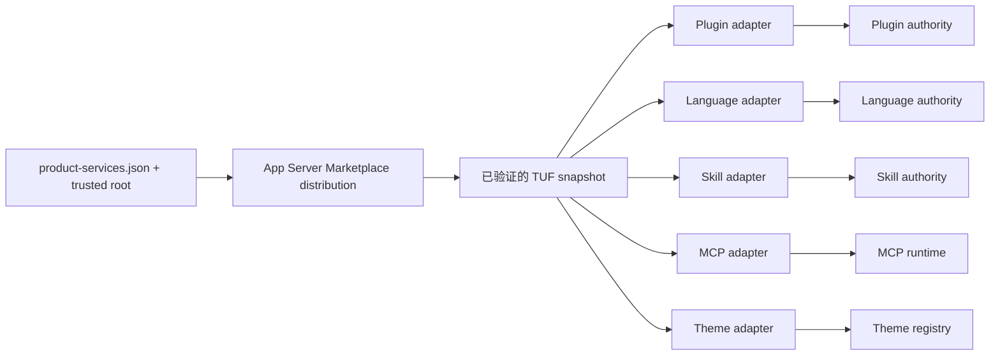
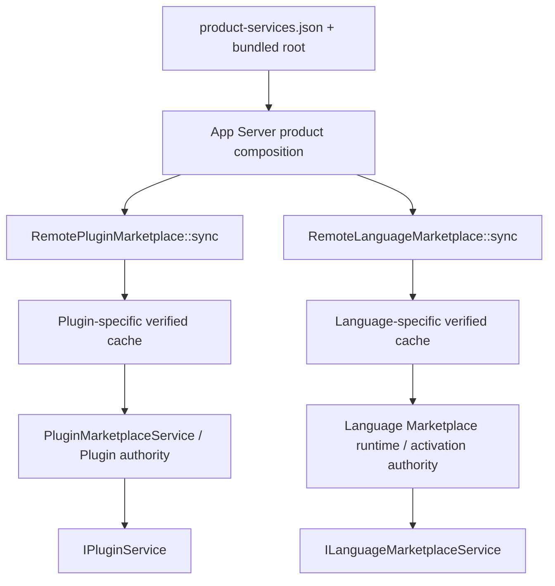

# Marketplace 接入架构

> 类型：设计。
> 状态：来源注册、固定信任根、Plugin 与 Language 的签名消费链已实现；共享发行快照以及
> Skill、MCP、Theme 的独立消费链属于 Proposed。
> 本文是 Zeta 跨 package family Marketplace 接入、验证、领域投影与失败隔离的 canonical 文档。
> Marketplace 仓库自己的发布格式与 CI 由
> [独立 Marketplace 仓库](https://github.com/chogng/marketplace) 维护；Plugin、Language、Skill、MCP
> 和 Theme 的领域生命周期仍由各自系统文档维护。

## 快速理解

结论：Zeta 应当接入 Marketplace 的**签名发行面**，而不是抓取给人浏览的网页，也不应建立一个能
安装所有 package 类型的万能安装器。App Server 先从产品配置和固定信任根获得 Marketplace
authority，校验并缓存 TUF metadata，再把同一个已验证快照投影给各领域 adapter；安装、授权、激活、
撤销和运行仍由 Plugin、Language、Skill、MCP、Theme 各自的 authority 拥有。

| 场景 | 当前行为 | 目标边界 |
| --- | --- | --- |
| 人在 Marketplace 首页搜索 package | 浏览生成的静态 catalog | 首页只服务人类发现，产品不解析 HTML |
| 正式产品启动 | 从 bundled `product-services.json` 读取 HTTPS endpoints 和固定 root | 产品配置决定消费哪些 package family，远端 metadata 不能扩大范围 |
| 浏览 Plugin | 校验独立 TUF repository 视图，只展示含 `consumerMetadata.zeta` adapter 的 package | 从共享 verified snapshot 投影 Plugin discovery view |
| 安装 Language package | 校验 language index、exact target、兼容性和 ZIP，再写入 activation authority | 从共享 verified snapshot 投影 Language view，确认与激活仍归 Language |
| 消费 Skill / MCP / Theme | 尚未完成独立消费链 | 各领域 adapter 读取同一 verified snapshot，再交给各自 authority |
| 网络不可用 | Plugin/Language 可在规则允许时使用各自仍有效的缓存 | Marketplace feature 可降级，不能拖垮整个 App Server |
| metadata、签名或撤销校验失败 | fail-closed | 继续 fail-closed，不把未验证数据传给任何领域 |

下面是计划目标链路（**Proposed，不代表当前已经全部实现**）：

继续阅读：[VS Code 的接法](#1-vs-code-的接法)、[Zeta 当前实现](#2-zeta-当前实现)、
[目标所有权](#3-目标所有权)、[失败语义](#5-信任缓存与失败语义)、
[分阶段演进](#7-分阶段演进)。

## 1. VS Code 的接法

VS Code 的关键经验不是某个具体 Gallery 协议，而是把“服务发现、目录查询、package 下载、安装管理、
运行激活”拆成不同责任。

| VS Code 层 | 本工作区参考实现 | 职责 | Zeta 应吸收什么 |
| --- | --- | --- | --- |
| 产品配置 | `product.json` 的 `extensionsGallery` | 提供服务 URL、资源模板和产品策略 | endpoint 与信任锚必须来自产品 composition，不来自 Renderer 或远端 catalog |
| Gallery manifest | `ExtensionGalleryManifestService` | 把产品配置转换为 query/resource endpoints | 建立受信 source descriptor，不让 UI 拼 URL |
| Gallery 查询 | `IExtensionGalleryService` | 查询、版本选择、兼容性和资源定位 | 领域拥有 typed discovery contract |
| 下载与校验 | `ExtensionDownloader` | 下载 VSIX、签名并执行完整性检查 | 下载边界必须在可信 backend，并绑定 exact package |
| 安装管理 | `ExtensionManagementService` | 安装、更新、卸载和本地存储 | 每个 package family 自己拥有 install lifecycle |
| 运行时 | Extension Host | 在安装之后按产品规则激活 | “可发现 / 已安装 / 已启用 / 已授权 / 已激活”不能合并 |

现代 VS Code 源码还为 MCP 提供独立的 `McpGalleryManifestService` 与 `McpGalleryService`，并没有让
Extension Gallery 直接拥有 MCP 的完整生命周期。这进一步说明：可以共享产品配置和分发基础设施，
但查询模型、兼容性、安装命令与 runtime 必须按领域拆分。

Zeta 不应照搬 VSIX Gallery wire protocol。独立 Marketplace 已经选择 TUF、delegated publisher、
不可变 target 和可选 consumer adapter；Zeta 应复用这些安全语义，再采用 VS Code 的分层方式组织
产品代码。

## 2. Zeta 当前实现

### 2.1 已实现链路（当前状态）

正式产品在 [`resources/product-services/product-services.json`](../resources/product-services/product-services.json)
中声明 Marketplace ID、`productManaged` trust、metadata/targets HTTPS base URL 和 bundled trusted root。
[`product_services.rs`](../zeta-rs/app-server/src/product_services.rs) 只从产品资源读取这些值，并为每个
source 构造 Plugin 与 Language 两份远端配置；不接受 Renderer 临时提供 root、URL、target path 或
trust label。

当前执行路径是：

Plugin 与 Language 当前会分别刷新和打开同一发行源，因此信任验证是正确的，但下载、缓存、revision
和启动失败仍有重复。Plugin adapter 先按 `packageType: plugin` 投影，再读取
`consumerMetadata.zeta`；其他 package family 以及没有该可选 adapter 的 Plugin 会被忽略，而不是被
当成无条件可安装的 Zeta Plugin。Language 则通过自己的 signed language index、compatibility 和
exact install 流程消费带 server route 的 package；只有静态 language asset 的 package 不会冒充
Language Server 安装项。

### 2.2 实现状态总账

| 能力 | 状态 | 当前 owner / 限制 |
| --- | --- | --- |
| 产品内固定 source、HTTPS endpoints 与 trusted root | ✅ | App Server product composition |
| TUF threshold、expiry、rollback、delegation、target hash/length | ✅ | `zeta-plugin-marketplace`、`zeta-language-marketplace` |
| exact package digest、ZIP 安全校验与撤销 | ✅ | Plugin / Language 各自远端 distribution crate |
| Plugin discovery/install | 部分具备 | 仅消费包含 Zeta consumer adapter 的 generic package；保持旧格式只读兼容 |
| Language discovery/install/activation | ✅ | 已有 signed index、兼容性确认、安装与 activation receipt |
| Skill 独立 discovery/install | ❌ | 目前没有 `packageType: skill` 的独立 adapter 与 authority handoff |
| MCP 独立 discovery/install | ❌ | MCP runtime 已存在，但未消费 Marketplace `packageType: mcp` |
| Theme 独立 discovery/install | ❌ | Theme registry 未消费 Marketplace `packageType: theme` |
| 单次同步、共享 immutable verified snapshot | ❌ | Plugin 与 Language 分别同步和缓存 |
| Marketplace 故障与 App Server 启动隔离 | ❌ | 当前远端同步错误可使 local composition 失败 |

当前实现的精确 crate contract 见
[`zeta-plugin-marketplace`](../zeta-rs/plugin-marketplace/README.md) 与
[`zeta-language-marketplace`](../zeta-rs/language-marketplace/README.md)。Plugin 安装、启用、授权、
激活和撤销语义以 [`plugins.md`](plugins.md) 为准；Language provider、process 与编辑器协议以
[`lsp.md`](lsp.md) 为准。

## 3. 目标所有权

目标架构共享的是**分发事实**，不是各领域的业务模型。`Marketplace distribution` 和
`VerifiedMarketplaceSnapshot` 是本文使用的概念名，不承诺最终 Rust symbol 或 crate 名称。

| 层 | 长期 owner | 输入 | 输出 | 明确不拥有 |
| --- | --- | --- | --- | --- |
| Marketplace publisher | 独立 Marketplace 仓库 | package、publisher policy、consumer adapters | 已签名 metadata 和不可变 targets | Zeta 用户状态、安装记录、授权 |
| 产品 source 配置 | App Server composition | bundled config、trusted root、profile cache root | 受信 source descriptors + package-family policy | 远端可修改的 trust、UI 临时 URL |
| 通用 distribution | `zeta-rs` backend-neutral 基础设施 | source descriptor、HTTP client、cache policy | immutable verified snapshot、exact target materializer | Plugin/Skill/MCP 等 manifest 业务语义 |
| 领域 adapter | 对应领域 crate | verified metadata、consumer adapter、consumer version | typed discovery item、compatibility、exact install request | 其他领域的安装或 runtime |
| 领域 authority | Plugin / Language / Skill / MCP / Theme | verified exact package + 用户确认 | durable installed/enabled/granted/active state | TUF root rotation、通用网络缓存 |
| Renderer service | 对应 `common/*Service.ts` contract | frontend-owned view、typed command | 浏览、确认、状态展示 | 签名判断、路径拼接、解压、信任决策 |

产品配置还应显式声明每个 source 允许消费的 package families。例如正式 Zeta 可以逐步从
`plugin + language` 扩展到 `skill + mcp + theme`。这是 **Proposed schema requirement**，不是当前
`product-services.json` 已支持的字段。默认不应因 Marketplace 新增一种 package type 就自动获得该
类型的安装能力。

## 4. 端到端行为

### 4.1 启动与发现

1. App Server 从只读产品资源加载 source descriptor 和 bundled root；配置无效属于产品构建错误。
2. 通用 distribution 刷新 TUF metadata，校验 threshold、expiry、rollback、delegation 与目标摘要。
3. 成功结果作为 immutable snapshot 发布；领域 adapter 只能读该 snapshot，不能再次把未验证远端
   JSON 混入其中。
4. 各 adapter 只投影产品配置允许的 package family，并执行 consumer ID/version、平台和 capability
   兼容性判断。
5. Renderer 通过各领域 service 读取 typed view。统一 Marketplace 页面可以聚合这些 view，但不能
   取代领域 service。

人类浏览用的 `index.html`、搜索索引或卡片数据不是产品 API。它们可以链接到 package 文档，但不能
成为安装 target、版本、digest、权限或信任的权威来源。

### 4.2 安装与激活

1. 用户从领域 view 选择一个 exact package；Renderer 提交稳定 ID、version、digest 和观察到的
   snapshot revision，不提交 URL、文件路径或 manifest 正文。
2. backend 在当前 verified snapshot 中重新解析 exact entry；revision 已变化时要求重新确认。
3. distribution 通过 TUF 读取 exact target，复核 hash/length、撤销和 package digest，并执行有界
   archive 校验。
4. 领域 authority 接收 verified package，再执行自己的兼容性、存储、安装、授权和 activation 规则。
5. 安装成功不代表自动启用、授权或启动。是否可以合并步骤由对应领域 canonical 文档定义。

### 4.3 各领域投影

| Package family | Adapter 至少校验 | Handoff | 用户入口 |
| --- | --- | --- | --- |
| Plugin | Zeta consumer adapter、Plugin manifest、consumer version、权限声明 | Plugin authority | Plugin Marketplace / Settings |
| Language | language index、server route、runtime compatibility、consumer version | Language installation + activation authority | Settings / Languages |
| Skill | Skill manifest、调用名、资源边界、来源冲突 | Skill authority | `/commit` 等动态斜杠命令；`/skills` 只管理、启用和诊断 |
| MCP | server declaration、transport、credential/approval requirements、平台兼容性 | MCP manager/runtime | MCP / Connector 管理面 |
| Theme | declarative theme manifest、资源路径与 token schema | Theme / Extension registry | Theme picker / Extensions |

Skill、MCP 和 Theme 行是 Proposed。它们不能通过伪装成 Plugin 才获得 Marketplace 能力；如果某个
Plugin 明确贡献 Skill/MCP/Theme，则仍走 [`plugins.md`](plugins.md) 定义的 Plugin activation
projection，这是另一条合法但不等价的链路。

## 5. 信任、缓存与失败语义

### 5.1 长期不变量

- root、source URL、trust label、允许的 publisher 和 package-family policy 只能由产品或经用户明确
  批准的 host authority 提供，不能由远端 metadata 或 Renderer 扩大。
- 签名、threshold、expiry、rollback、delegation、target hash/length、package digest 或 archive
  校验失败必须 fail-closed。
- 只有完整、仍有效并重新通过 TUF 打开的缓存可以作为 transport failure 的降级来源。
- metadata 不可信、parse 不兼容与 transport unavailable 是不同错误类别；前两者不能伪装成离线。
- exact install 必须重新绑定当前 snapshot 和撤销状态，不能只相信浏览时的卡片或旧 download URL。
- 已安装 package 的撤销与 activation enforcement 归领域 authority，不能仅靠 catalog 中隐藏条目。
- 日志和 UI 错误不得泄漏响应正文、URL credential、trusted root bytes 或宿主绝对 cache path。

### 5.2 失败矩阵

| 失败 | Current | Proposed |
| --- | --- | --- |
| bundled 产品配置或 trusted root 无效 | App Server composition 失败 | 保持失败；这是产品完整性错误 |
| 网络失败且存在仍有效的完整缓存 | Plugin/Language 各自尝试缓存 | 通用 distribution 发布该 verified cached snapshot，并标记 stale/offline provenance |
| 网络失败且没有可用缓存 | 当前可阻断 local composition | Marketplace capability unavailable；App Server、已安装 package 和非 Marketplace 能力继续可用 |
| metadata 签名、rollback、expiry 或 schema 无效 | fail-closed，不能降级到刚收到的数据 | 保持 fail-closed；若策略允许，只能回到此前独立保存且重新验证成功的完整 snapshot |
| exact target 被撤销或摘要变化 | 安装拒绝；Plugin 撤销形成 durable tombstone | 所有领域拒绝新安装，并由领域 authority 执行既有安装的禁用/隔离策略 |
| 单个领域 adapter 不认识 package | 忽略不适用 package 或报告领域错误 | 只使该领域条目不可用，不污染共享 verified snapshot 与其他领域 |

“Marketplace 故障不拖垮 App Server”不等于“忽略安全错误”。隔离的是可选 feature availability；
进入任何领域 authority 的数据仍必须完整验证。

## 6. 前端与协议边界

Renderer 继续按领域暴露小而完整的 contract：Plugin 使用
[`IPluginService`](../desktop/src/zeta/platform/plugins/common/pluginService.ts)，Language 使用
[`ILanguageMarketplaceService`](../desktop/src/zeta/platform/language/common/languageMarketplaceService.ts)。
新增 Skill、MCP、Theme 消费链时，也应在各自 `common/*Service.ts` 中定义 frontend-owned domain
types 与 `I<Capability>Service`，transport DTO 只存在于 runtime implementation。

一个统一 Marketplace Workbench 页面可以负责：

- 聚合搜索、filter、publisher 与来源展示；
- 展示签名来源、兼容性、权限摘要、installed/update/revoked 状态；
- 把用户动作委托给对应领域 service。

它不能负责：

- 解析 TUF 或 consumer adapter；
- 拼接 metadata/target URL；
- 直接写 package cache 或安装目录；
- 用一个通用 `install(package)` 绕过领域确认、授权和 activation；
- 因 package 卡片显示正常就判断本地 package 可以运行。

## 7. 分阶段演进

### 阶段 A：共享发行权威

- 从 Plugin/Language 两条同步链提取 backend-neutral TUF refresh、verified cache、source revision 和
  exact target materialization contract。
- 产出不可变 verified snapshot，保留来源、签名角色、revision、target hash/length、consumer metadata
  和撤销事实。
- 保持现有 Plugin/Language API 行为，通过 adapter 迁移而不是一次性改 UI。

### 阶段 B：迁移现有消费者并隔离故障

- Plugin 与 Language 改为读取同一 snapshot，删除重复 metadata refresh 和 cache owner。
- 把可选远端 source unavailable 从 App Server composition fatal error 降为 typed capability state；
  bundled 配置/root 错误仍 fatal。
- 增加 source health、snapshot revision、cache provenance、adapter rejection 的 content-safe 观测。

### 阶段 C：增加独立包系列适配器

- Skill 先接通 discovery、exact install、authority reconcile 和动态 slash command projection。
- MCP 接通声明校验、用户确认、credential/approval 以及 runtime reconcile。
- Theme 接通 declarative resource validation 与 Theme/Extension registry，不引入任意代码执行。

### 阶段 D：统一浏览体验

- Workbench 聚合领域 views，提供一致的搜索和来源展示。
- 安装按钮仍 dispatch 到领域 command；统一页面不成为第二套 authority。
- 对 offline、incompatible、revoked、update available 和 approval required 使用稳定 typed state。

## 8. 修改影响与验证

| 修改 | 必须联动检查 |
| --- | --- |
| Marketplace source schema / root policy | App Server product resources、config parser、构建打包、配置错误测试 |
| TUF snapshot / cache contract | Plugin 与 Language adapter、offline/rollback/expiry 测试、cache migration |
| generic package metadata | 独立 Marketplace schema、delegated publisher fixtures、所有已启用 consumer adapters |
| Plugin adapter | [`plugins.md`](plugins.md)、Plugin authority、Desktop `IPluginService`、revocation reconciliation |
| Language adapter | [`lsp.md`](lsp.md)、language distribution/catalog、Desktop language service |
| Skill / MCP / Theme adapter | 对应领域 canonical 文档、authority、typed frontend service 与用户确认流程 |
| 启动失败隔离 | App Server local composition、capability status、重试、有效缓存与无缓存测试 |

最低验证集应覆盖：真实签名 TUF repository、delegated publisher isolation、过期与 rollback、transport-only
cache fallback、exact target 摘要、撤销、跨 package-family 投影隔离、单 adapter 失败不污染其他 adapter，
以及 Marketplace unavailable 时 App Server 其他能力仍可初始化。

## 9. 非目标与潜在方向

### 非目标

- 不把独立 Marketplace 仓库变成 Zeta 专属发布服务或要求其依赖 Zeta 源码。
- 不让 Zeta 解析 Marketplace 人类首页作为安装协议。
- 不建立跨 Plugin、Language、Skill、MCP、Theme 的万能 manifest、安装器或 runtime。
- 不因 package 已签名就自动授予进程、网络、目录、credential 或工具调用权限。
- 不要求所有 package 都携带 Zeta consumer adapter；无 adapter 可以对其他产品保持有效。

### 潜在方向（尚未承诺）

- 多个 product-managed 或用户批准的 verified-external sources 的并行 snapshot 与来源优先级。
- 发布透明度日志、publisher key rotation UX 和可审计 provenance history。
- 跨 source 的搜索排序与去重，但仍保留 exact source identity 和领域安装边界。
- 在不削弱 fail-closed 规则的前提下，对仍有效快照提供后台刷新和渐进式 UI 更新。
