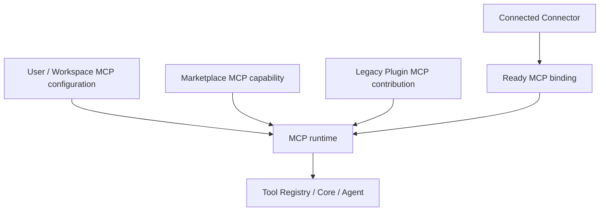
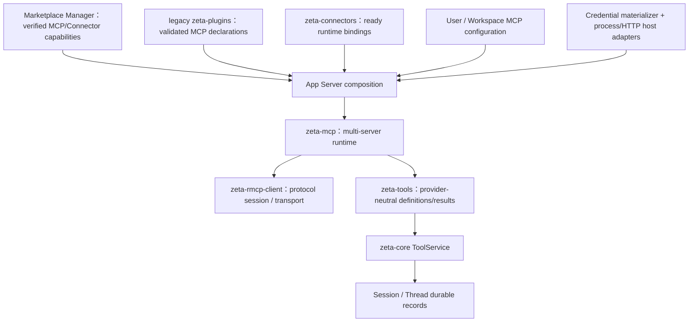

# MCP 集成系统

> Product runtime 当前实现：[`zeta-rs/mcp/`](../zeta-rs/mcp/README.md)，
> Rust crate：`zeta_mcp`
> Low-level client 当前实现：[`zeta-rs/rmcp-client/`](../zeta-rs/rmcp-client/README.md)，
> Rust crate：`zeta_rmcp_client`
> 当前状态：low-level client、tools-only product runtime、Config/Connector/Marketplace/legacy Plugin hot composition、
> `tools/list_changed` rebuild、App Server/Core tools vertical slice、Connector disconnect dispatch fence、
> 独立 Config MCP OAuth 编排、form elicitation 与只读 lifecycle projection 已实现
> Core architecture：[`core.md`](core.md)
> Agent runtime：[`zeta-agent-runtime-architecture.md`](zeta-agent-runtime-architecture.md)
> Tool shared contract 与纯转换：[`tools.md`](tools.md)
> Config authority 与 runtime snapshot 接入：[`config.md`](config.md)
> Marketplace package 入口：[`marketplace-integration.md`](marketplace-integration.md)
> Legacy Plugin 兼容来源：[`plugins.md`](plugins.md)
> Connector account 与 ready binding：[`connectors.md`](connectors.md)
> Skill 指令边界：[`skills.md`](skills.md)
> 将 Zeta Agent 暴露为 MCP server：[`mcp-server.md`](mcp-server.md)

> 官方规范核对日期：2026-07-25。第一版以 MCP `2025-11-25` protocol revision 为实现目标。
> MCP 仍会演进；wire schema、授权流程和 experimental capability 必须以实现时的
> [官方规范](https://modelcontextprotocol.io/specification/2025-11-25/architecture/index) 与
> schema fixture 为准。

## 快速理解

MCP 客户端把外部 Server 的工具转换成 Zeta 的工具目录；方向相反的 MCP Server 把 Zeta Agent
暴露给外部 Host。两条路径共享协议概念，但不共享运行时所有权。

| 场景 | 使用的边界 | 当前状态 |
| --- | --- | --- |
| Zeta 连接外部 MCP Server | `zeta-rmcp-client` 建立单连接，`zeta-mcp` 管理多 Server 和工具目录 | 工具纵向切片已实现 |
| 外部 Host 调用 Zeta Agent | 独立的 `zeta-mcp-server` 通过 App Server 启动和继续 Agent | 见 MCP Server 文档 |
| MCP 暴露工具 | 转成带来源、绑定和失效 generation 的统一工具 | 已实现基础目录与调用路由 |
| MCP 暴露资源或提示词 | 进入各自的上下文和产品契约 | 仍属计划设计 |
| Server 需要 bearer 或 OAuth | 凭据保存在 SecretStore；具体 provider adapter 决定 discovery、scope 与 token wire | 独立 Config 与 Connector 路径均已具备窄实现 |
| MCP 工具运行中请求表单输入 | 转成 Core durable 用户交互并唤醒同一次工具执行 | 基础类型已实现；URL、多选和跨重启恢复不支持 |
| Marketplace 独立 MCP package | Manager 验证 HTTP 或 package-relative stdio transport；MCP consumer 持 lease 启动 | 安装不等于启动或授权 |
| Marketplace Plugin bundle 携带 MCP/Connector | 同一次安装按 capability 分给 MCP 与 Connector consumer | 不进入第二套 Plugin runtime |
| Legacy Plugin 独立声明 MCP Server | 兼容 authority 只贡献声明，经激活和策略解析后由 MCP runtime 启动 | Plugin 启用不等于连接或授权 |
| Connector 需要外部账号 | Connector connected 后发布 ready MCP binding | Connector 不启动 MCP session |
| 用户或 Workspace 直接配置 MCP Server | 配置经凭据、grant 和 policy 解析后直接进入 MCP runtime | 不必须先安装 Plugin 或创建 Connector |

## 1. 结论

MCP client 分成两个边界：Current `zeta-rmcp-client` 负责官方 RMCP SDK、单 server session、
initialize、原始 tools API 和 stdio/Streamable HTTP transport；Current `zeta-mcp` tools-only
runtime 负责多 server 启动、provider-neutral tool catalog/binding、分页/大小限制、调用路由、
取消与失效标记。Current App Server adapter 将 user config 与 ready Connector snapshot 接入 Core
`ToolService`、逐次用户 approval 和 durable result，并在两类 generation 变化时重建 tool port。
Connector API-token materialization、Marketplace HTTP/packaged-stdio MCP、package-rooted legacy Plugin MCP、通用 Connector OAuth PKCE 编排与 Desktop
browser callback 已实现。独立 Config credential reference materialization、provider-injected OAuth
PKCE/callback/refresh/revoke、process-local connect/disconnect/status，以及 MCP form elicitation 到 Core
durable interaction 的同调用恢复也已实现。通用自动 OAuth discovery、内建具体 provider、resources、
prompts、reconnect/health 和更完整的 interaction surface 仍是 Proposed。

方向相反的 `zeta-mcp-server` 通过 App Server 将 Zeta Agent 暴露给外部 MCP Host。两者不共享
runtime ownership，也不互相依赖；具体边界见 [`mcp-server.md`](mcp-server.md)。

它不是：

- Plugin 的安装器、包管理器或信任根；
- Skill 的发现器、选择器或指令加载器；
- 绕过 Zeta tool approval、sandbox 和 durable Tool Call/Result 的执行捷径；
- MCP server 输出、tool annotation 或 prompt 内容的信任背书；
- Zeta Session、Thread、Turn 或 App Server connection 的替代品。

Marketplace、Plugin、Connector 与 MCP 的 canonical 关系由 [`marketplace-integration.md`](marketplace-integration.md)
和 [`connectors.md`](connectors.md) 共同维护。从 MCP runtime 视角看，
边界可压缩为：

> Marketplace Manager 管 package lifecycle，Connector 管外部账号连接，MCP 管协议会话与能力调用，Tool 是 Agent 最终消费的能力。



这些是并列的 declaration/readiness source，不是必须逐层包装的类型层次。Marketplace Plugin
只是同时携带 MCP、Connector、Skill 等 capability 的 bundle；Manager 只安装一次，各 consumer
独立授权和激活。Legacy Plugin authority 保留为本地兼容来源。安装 package 不等于允许其 MCP
server 启动，Connector connected 也不等于自动批准每次 Tool call。

## 2. 当前仓库审计

当前仓库已有低层 client、tools-only product runtime、配置面与启动时 tools vertical slice：

- [`core.md`](core.md) 与
  [`zeta-agent-runtime-architecture.md`](zeta-agent-runtime-architecture.md) 已将 MCP adapter
  放在 Core tool port 之外，并要求 HTTP/MCP cancellation 贯穿工具执行；
- `zeta-rmcp-client` 已用官方 RMCP SDK 实现单连接 initialize、tools list/call、
  progress/list-changed/elicitation host callback、caller cancellation、request deadline、有界
  shutdown，以及 local stdio 与 reqwest Streamable HTTP connector；其实现契约见
  [`zeta-rs/rmcp-client/README.md`](../zeta-rs/rmcp-client/README.md)；
- `zeta-mcp` 已实现多 server `RequireAll` / `AllowPartial` 启动、分页和 byte/tool limits、
  deterministic alias、exact remote identity、connection/catalog generation、不可变
  catalog/binding、list-changed stale 标记、可取消 tools/call、结果大小限制和有界 shutdown；
  其实现契约见 [`zeta-rs/mcp/README.md`](../zeta-rs/mcp/README.md)；
- `zeta-config` 与 App Server config operations 已有 MCP server declaration CRUD；配置存在不
  等于 runtime 已启用；
- `zeta-protocol` 已有 provider-independent `ToolDefinition`、`ToolCall`、`ToolResult`、
  `ToolName` 和 durable Thread tool item；
- `zeta-core` 已有 approval policy 基础，`zeta-tool-executor` / `zeta-sandboxing` 已形成独立
  本地进程执行边界；产品层 `zeta-exec` 不参与单个 MCP tool process 的执行；
- App Server 已把 enabled user declaration materialize 为 `McpServerDefinition`，通过持续运行
  的 Tokio worker 桥接同步 Core `ToolService`，合并 local/MCP definitions，并为每次 MCP call
  生成 exact `ActionSource::McpServer` review、durable one-time approval 与 unknown outcome；
- `McpRuntimeOwner::prepare_call` 会把 exact `McpToolBinding` 与 JSON-object arguments 收敛为
  一个 `McpPreparedCall`；worker 在进入 remote session 前仍以自己的 immutable catalog 复核
  binding。App Server 的 generation-bound `BoundToolCall` 继续负责跨 prepare/execute 的保留，
  因而 runtime replacement 不会把旧 Tool Call 重绑定到同名新工具；
- `compose_mcp_tools_with_connectors` 已通过 host-injected `ConnectorMcpRuntimeProvider` 读取 ready
  Connector credential，并用 exact connector ID / connection generation / definition digest 在 prepare
  与 dispatch 前 fail closed；本地 reconcile loop 同时订阅 Config 与 Connector authority；
- `MarketplaceConnectorProjection` 已把 Manager 的 exact MCP/Connector capabilities 转成独立或
  Connector-bound server，严格限制 credential-free HTTPS 和 package-contained executable，并让每次
  invocation 持有 Manager capability lease；installation generation 变化会触发热重建；
- 直接 Config MCP 的 HTTPS bearer credential 已在连接启动前由 host SecretStore materialize；
  `McpOAuthService` 已为 host 注入的 exact provider 提供 S256 PKCE、state、redirect/resource/target
  复核、一次性 callback、私有 runtime/lifecycle credential envelope、refresh/revoke 和 App Server RPC；
- MCP form elicitation 已通过 task-local exact Tool-call binding 转成 Core durable
  `AgentRequest::UserInput`，解决或取消后唤醒同一次 live execution；URL elicitation、数组/多选、完整
  JSON Schema format 校验和跨重启 remote request 恢复仍不支持；
- 自动 reconnect/health state machine、resource/prompt product adapter 和 progress 产品投影仍未实现。

因此 low-level protocol/transport、独立 tools-only runtime、窄 App Server/Core tools slice、
process-local connect/disconnect/status、provider-injected 独立 OAuth lifecycle 和基础 form interaction
是 Current；自动 provider discovery、完整 interaction surface 与其他 MCP capability 仍是 Proposed。

## 3. 标准基线

MCP 是 host-client-server 架构：host 为每个 server 创建隔离 client，一个 client 与一个 server
维持一个 stateful session。初始化阶段先协商 protocol version 和 capabilities，之后才能进入正常
operation。[官方架构](https://modelcontextprotocol.io/specification/2025-11-25/architecture/index)
同时要求 host 控制权限、用户授权、模型集成和跨 server 隔离。

支持矩阵明确区分低层代码与产品可用性：

| MCP surface | Low-level client | Product runtime 策略 |
| --- | --- | --- |
| Base JSON-RPC lifecycle | Current | Current 多 session startup/shutdown；reconnect/health Proposed |
| stdio | Current direct-local + injectable transport | Current absolute executable startup；sandboxed launcher Proposed |
| Streamable HTTP | Current unauthenticated/bearer transport | Current unauthenticated/SecretStore bearer；provider-injected OAuth lifecycle Current；自动 discovery/reconnect Proposed |
| Tools | Current 原始 list/call | Current catalog/binding/Core approval/durable result；Config/Connector hot rebuild Current |
| Resources | 尚未暴露 | 首发只做 list/read，显式进入 context |
| Prompts | 尚未暴露 | 首发只做 list/get，不当作 Skill |
| Roots | 尚未暴露 | 只暴露已授权 workspace root，不能替代 OS sandbox |
| Sampling | 尚未暴露 | 默认不声明；需独立预算、隐私和审批 |
| Elicitation | Current host callback | Current form → durable Core interaction；URL/array/multiselect/跨重启 remote recovery 不支持 |
| Tasks | 尚未暴露 | experimental，不等同 Zeta Turn/Task |

MCP 标准 transport 是
[stdio 与 Streamable HTTP](https://modelcontextprotocol.io/specification/2025-11-25/basic/transports)。
HTTP+SSE 是旧 revision 的兼容面，不进入 Zeta 第一版。

## 4. 职责与非职责

### 4.1 当前状态 `zeta-rmcp-client` 拥有

- MCP wire request/response/notification codec 和 protocol revision negotiation；
- 每个 configured server 的隔离 client session；
- stdio 与 Streamable HTTP transport adapter；
- initialize → operation → shutdown lifecycle；
- request ID correlation、per-request deadline 和 cancel propagation；
- 原始 tools list/call 与 progress、list-changed、elicitation host callback；
- caller-provided RMCP transport 接入点。

### 4.2 当前状态 `zeta-mcp` 拥有

- runtime-ready server set、connection/catalog generation 与原子/部分启动策略；
- tools 的分页 discovery、list-changed invalidation 和 immutable catalog；
- MCP tool schema、content 和 error 到 `McpToolProjection` / source result 的转换与大小限制；
- exact remote tool identity、catalog generation 和 host binding 所需的 source correlation；
- startup/shutdown diagnostics 和 caller cancellation 传播。

Proposed 扩展仍包括 resources/prompts、reconnect/health state machine、roots、sampling、URL 或更复杂
form elicitation，以及通用 OAuth metadata discovery 和 concrete provider adapter。

### 4.3 两个 MCP 客户端 crate 都不拥有

- Marketplace/Plugin package 下载、签名、解压、版本解析、enable/disable authority；
- API token、OAuth refresh token、client secret 的持久化；
- workspace、filesystem 或 network 的最终授权策略；
- model selection、token budget、Core ContextAssembler 或 Agent loop；
- tool approval、side-effect classification 的最终判定；
- Thread event append、reducer、unknown-outcome recovery decision；
- MCP server 自己的业务正确性、rate limit 或下游事务；
- UI 中 MCP picker、OAuth browser window、confirmation dialog 的布局；
- 把 server instructions、prompt、resource 或 tool result 提升为 system instruction。

独立 MCP declaration 的 auth adapter 拥有对应 credential/OAuth lifecycle；Connector-bound MCP 的认证和账号
lifecycle 则属于 Connector auth adapter。两者都把 opaque token persistence 委托给 `zeta-secrets`，并只向
MCP runtime 提供 materialized credential/binding。`zeta-sandboxing` / host capability 实施资源边界，
Agent runtime 决定何时调用工具，Core 负责 durable commit，App Server 是 composition root。

## 5. 目标依赖与运行时结构



规则：

- `zeta-rmcp-client` 依赖官方 `rmcp` 和通用 async/HTTP 库，不依赖 Zeta product crate；
- `zeta-mcp` 可以依赖 `zeta-rmcp-client`、`zeta-tools`、`zeta-protocol` 和通用 async/JSON 库；
- `zeta-mcp` 不依赖 `zeta-core`、stores、App Server、Desktop、CLI、Marketplace Manager 或 Plugin authority；
- `zeta-mcp` 将 revision-specific wire descriptor 转成纯 `McpToolProjection`；
  `zeta-tools` 再负责 schema normalization、model-facing definition 和 source-neutral output；
- `zeta-core` 定义 consumer-owned `ToolService` port；App Server adapter 将 MCP tool
  handle/catalog 适配到该 port，Core 不读取 MCP wire DTO；
- Marketplace Manager 只拥有 artifact/install/lease；App Server adapter 产出 server declaration；两者都不持有 live MCP session；
- legacy Plugin authority 只产出经过验证的 server declaration，不持有 live MCP session；
- Connector runtime 只产出 generation-bound ready binding，不持有 live MCP session 或 Tool registry；
- App Server 注入 credential materializer、process launcher、HTTP transport、workspace roots 和
  policy，不能让 `zeta-mcp` 自己扫描全局环境；
- RMCP wire DTO 停在 `zeta-rmcp-client` / `zeta-mcp` adapter boundary，不进入
  `zeta-protocol`、Core 或 App Server protocol。

每个 live server 运行时：

```text
McpServerDefinition
    → policy/grant resolution
    → transport connect
    → initialize + capability negotiation
    → immutable capability/catalog snapshot
    → bounded request router
    → graceful shutdown / reconnect
```

## 6. 身份、定义与快照

### 6.1 Server 身份

配置必须为每个 server 分配稳定 `McpServerId`。它标识 Zeta 配置中的逻辑 server，不使用 endpoint、
child PID、MCP session ID 或 Plugin 显示名称充当 identity。

```rust
pub struct McpServerId(String);

pub struct McpServerDefinition {
    pub id: McpServerId,
    pub display_name: String,
    pub transport: McpTransportDefinition,
    pub credential: McpCredentialBinding,
    pub policy: McpServerPolicy,
}

pub enum McpTransportDefinition {
    Stdio(StdioServerDefinition),
    StreamableHttp(StreamableHttpServerDefinition),
}

pub enum McpCredentialBinding {
    Unauthenticated,
    Reference(CredentialRef),
}
```

Plugin 贡献的 logical ID 解析为带 Plugin namespace 的 `McpServerId`；用户配置与 workspace 配置
使用各自 source namespace。不同来源不能通过同名静默覆盖。

### 6.2 远程 primitive 身份

MCP tool name 只保证在单个 server 内唯一；resource URI 和 prompt name 同样不能脱离 server
解释。Zeta identity 必须保留二元组：

```text
McpToolRef     = (McpServerId, exact remote tool name)
McpResourceRef = (McpServerId, exact resource URI)
McpPromptRef   = (McpServerId, exact prompt name)
```

不得 lowercase、重写或丢弃 exact remote identity。model-facing alias 只是一次 catalog snapshot
内的路由名，不是远端 identity。

### 6.3 工具 alias 与绑定

当前 `zeta-protocol::ToolName` 允许 1–128 个 ASCII 字母、数字、`_`、`-`，而 MCP tool name
还可能包含 `.`。不能把不兼容字符简单替换成 `_` 后假定没有冲突。

目标使用显式绑定：

```rust
pub struct McpToolBinding {
    pub exposed_name: ToolName,
    pub remote: McpToolRef,
    pub schema_digest: ContentDigest,
    pub catalog_generation: u64,
}
```

alias 由可读 server/tool slug 加短 digest 生成，生成后做全 catalog collision check。Agent 发起
tool call 时必须从冻结的 binding snapshot 解析，不得根据字符串重新猜 server。list-changed 后
新的 binding 只在下一个 model safe point 生效；旧调用不能被静默路由到另一个工具。

### 6.4 Immutable 快照

```rust
pub struct McpCatalogSnapshot {
    pub server: McpServerId,
    pub connection_generation: u64,
    pub catalog_generation: u64,
    pub negotiated: NegotiatedMcpCapabilities,
    pub tools: Vec<McpToolDescriptor>,
    pub resources: Vec<McpResourceDescriptor>,
    pub prompts: Vec<McpPromptDescriptor>,
    pub freshness: McpCatalogFreshness,
}
```

只有 consumer-visible catalog 变化才递增 `catalog_generation`。重连一定产生新的
`connection_generation`，即使 catalog 内容相同；这样 late response、旧 subscription 和旧
request ID 都不能污染新连接。

## 7. 连接生命周期

当前 runtime owner 发布 `Connected`、`Stale`、`Unavailable`；App Server 再结合 durable enablement 与
process-local intent 投影 `Disabled`、`Disconnected`。这已经避免把“已配置但启动失败”压成
`connected: bool`，但自动重连状态机尚未实现。

完整目标状态仍是 Proposed：

```text
Disabled
→ Starting
→ Initializing
→ Ready
→ Degraded / Reconnecting
→ Stopping
→ Stopped
```

另有 terminal `Blocked`/`Misconfigured` 诊断状态。状态与 health、enablement 分开，避免
“已启用但认证失败”被错误显示为未安装。

[MCP lifecycle](https://modelcontextprotocol.io/specification/2025-11-25/basic/lifecycle) 要求：

1. client 首先发送 `initialize`；
2. 双方协商 protocol revision 与 capabilities；
3. client 发送 `notifications/initialized` 后进入 operation；
4. 不支持 server 返回 revision 时断开，而不是尝试按最新 DTO 继续；
5. shutdown 停止接受新调用，取消或等待有界的 in-flight request，再关闭 transport。

当前本地 policy：

- initialize、list 和 call 使用分别配置的 deadline；
- request ID 只在一个 connection generation 内相关；
- cancellation 发送 MCP cancel notification，并停止本地等待；
- cancel 不证明远端副作用没有发生；
- server crash/EOF 使所有未完成请求进入 transport-lost 分类；
- `tools/list_changed` 将 catalog 标为 stale，并触发 host 构造完整 replacement generation。

Proposed reconnect policy 使用 backoff + jitter，并受全局启动并发限制；成功后必须重新 initialize 和
discovery，不能复用旧 server capability、request 或 binding。

## 8. 传输

### 8.1 stdio

stdio supervisor 负责：

- 通过已批准的、解析后的 executable path 启动 child；
- 使用显式 argv，不通过 shell 拼接；
- 设置最小 env allowlist 和显式 working directory；
- 将 child 放入适用的 process/sandbox boundary；
- stdout 只解码 MCP JSON-RPC，stderr 作为有界 diagnostic stream；
- 限制单帧大小、stdout/stderr buffer、并发请求和 shutdown deadline；
- 终止时处理完整 child process tree。

Plugin manifest 中的 command/args/env 只是请求；真正启动前必须经过 install trust、runtime grant
和 workspace policy。`PATH` 查找结果必须在 activation snapshot 中冻结，不能每次调用重新解析。

### 8.2 Streamable HTTP

HTTP adapter 必须实现：

- 单一 MCP endpoint 的 POST/GET 与 JSON/SSE content negotiation；
- `MCP-Protocol-Version`、可选 `MCP-Session-Id` 和 session termination；
- SSE event ID / `Last-Event-ID` resume，但不把 event ID 当 Zeta durable sequence；
- Origin、redirect、TLS、proxy 和 endpoint allowlist policy；
- 401 challenge、OAuth metadata discovery 和 credential refresh；
- response/body/SSE frame 大小及 idle/read deadline；
- 同一 MCP message 不跨多个 SSE stream 重复交付。

断开连接不等于 MCP request cancellation；client 必须显式 cancel。HTTP session ID 是远端 transport
state，不进入 Zeta Session/Thread。

第一版不实现 custom transport。新增 transport 必须先定义 threat model、framing、cancellation、
authentication 和 shutdown contract，不能只提供 `send(Value)`。

## 9. 服务端原语

### 9.1 工具

`zeta-mcp` 先将 revision-specific descriptor 转成保留 exact remote identity 的
`McpToolProjection`，再由 [`tools.md`](tools.md) 的共享 adapter 产生 host tool definition。
完整转换链必须：

- 完整处理分页，并施加 tool count/page/bytes 上限；
- 校验 name、input schema、可选 output schema 和 schema complexity；
- 保留 exact remote descriptor 与 digest；
- 将 annotation 标为 `UntrustedServerClaim`；
- 用本地 policy 计算 approval/risk，而不是采信 server 的 read-only/destructive hint；
- 对 model 不支持的 content type 给出明确降级或拒绝。

MCP `2025-11-25` 的 embedded schema 默认使用 JSON Schema 2020-12；tool output 若声明
`outputSchema`，Zeta 应校验 `structuredContent`。规范明确区分
[protocol error 与 tool execution error](https://modelcontextprotocol.io/specification/2025-11-25/server/tools)：

- unknown tool、malformed request、server protocol failure → MCP protocol error；
- API failure、业务校验失败等 `isError: true` → `ToolOutputStatus::Error`，再由 Core 映射为
  canonical error Tool Result。

### 9.2 资源

Resource 是 application-controlled context，不是可自动执行的 tool。第一版：

- 支持 `resources/list`、template list 和 `resources/read`；
- 对每个 read 施加 scheme、MIME、byte/token 和 content-part 数量上限；
- resource URI 始终与 `McpServerId` 绑定；
- resource/list-changed 只使 catalog stale；
- subscription 只为用户已选或 Core ContextAssembler 正在引用的 resource 建立；
- update notification 触发重新读取，不直接信任 notification payload；
- binary 内容通过 Resource/content store 传递，不内嵌到普通日志。

Server 返回的 `file://` URI 不授予本地文件权限。只有 MCP `resources/read` 的返回内容可作为该
server resource；Zeta 不绕过 server 去读取同名本地路径。

### 9.3 提示词

MCP Prompt 是 user-controlled、带参数的远端模板：

- 必须由用户显式选择或明确的产品 command 触发；
- `prompts/get` 返回内容按外部、不可信 instruction 处理；
- 不加入全局 developer/system instruction；
- 不持久注册成 Skill，也不因名称相同覆盖本地 Skill；
- prompt 中的 embedded resource 继续遵守 resource size、MIME 和 provenance policy。

如果用户要将稳定 MCP Prompt 保存为 Skill，应通过显式导入/复制流程生成新的本地 artifact，
记录来源与 digest；运行时不能把二者自动等同。

## 10. 客户端功能

### 10.1 根目录

Roots 只告诉 server 当前 workspace 边界。它不是 sandbox，也不证明 server process 无法读取
root 之外的文件。

- root 来自 host 授权后的 workspace snapshot；
- 只发送 canonicalized `file://` URI；
- path traversal、symlink policy 和 root 可达性由 host 校验；
- workspace 切换后发送 list-changed，并使旧 root grant 失效；
- local MCP process 仍必须使用 OS/process sandbox；
- remote MCP server 只得到 root metadata，不自动得到文件内容。

### 10.2 采样（Sampling）

Sampling 允许 MCP server 请求 host 调用模型，涉及费用、凭据、conversation disclosure 和递归
tool loop。第一版不声明 sampling capability。

后续启用必须通过独立 `McpSamplingPolicy`：

- server 不能指定或读取 provider credential；
- Core ContextAssembler 只提供请求所需最小 context；
- 每 server/session 有 token、费用、并发和递归深度预算；
- user approval 与 model choice 由 Zeta host 决定；
- sampling 不能调用发起它的同一 tool 形成无界递归；
- request/result 进入可审计 trace，但不伪装成用户 Turn。

### 10.3 询问（Elicitation）

Elicitation 依赖 Zeta 的 typed Agent request/response delivery。App Server owner selection、deadline、
disconnect re-selection 和 durable recovery 已完成。当前 MCP adapter 只在 App Server 为 Tool call
注入 `ToolInteractionService` 时声明 form capability；RMCP callback 再通过 task-local binding 关联 exact
Thread、Turn、request 与并发中的 MCP call，不能仅因共享 contract 存在就启用。

当前支持 string、number、integer、boolean 和单选 enum/oneOf，保留 required、长度和数值范围；每个
表单最多 32 个字段、100 个选项、每段 4096 个字符。数组、多选、未知 schema，以及名称或说明看似
承载 password、secret、token、credential 或 API key 的字段会失败关闭。当前声明
`schemaValidation=false`，因为尚未承诺完整 JSON Schema format 校验。URL elicitation 没有产品安全
契约，返回 `Decline`。

表单被持久化为 Core `AgentRequest::UserInput`。解决后 live waiter 唤醒同一次工具执行，App Server
不会再启动第二个 backend resume；取消映射为 MCP `Cancel`。Zeta interaction 可以 durable，但 remote
MCP connection/request 本身不能跨重启恢复；恢复后已 started 且无 terminal result 的调用保持
unknown outcome，不能向新 connection 发送旧 response。

### 10.4 实验性任务

MCP task ID 只标识 MCP 协议中的异步 request 状态，不是 Zeta 产品 Session、Thread、Turn 或
Codex 意义上的“任务”。在官方 capability 稳定且 Zeta 定义好 polling、expiry、authorization
binding、cancel 和 recovery 前不启用。

## 11. 工具 loop、取消与 unknown 结果

```text
MCP catalog snapshot
    → Agent model receives exposed ToolDefinition
    → model emits Tool Call
    → resolve frozen McpToolBinding
    → validate arguments
    → evaluate Zeta approval + policy
    → durable commit Tool Call
    → MCP tools/call outside Thread state owner
    → validate result
    → durable commit Tool Result / UnknownOutcome
```

MCP adapter 不直接写 Thread。取消和 retry 遵循 Agent Runtime 的统一工具语义：

- 尚未发送：可安全取消；
- 已发送但 server 明确返回 execution error：记录失败结果；
- 连接丢失且工具可能有副作用：`UnknownOutcome`；
- read-only 也只有本地 policy 明确认定且 retry strategy 允许时才自动重试；
- server annotation 不能单独把调用升级为 `SafeRead`；
- reconnect 后不得自动重放未完成 write；
- late result 只能关联原 connection generation 和 ToolCallId，不能完成另一个调用。

## 12. 安全与授权

### 12.1 信任边界

以下全部默认不可信：

- server instructions；
- tool name、description、annotations 和 schema；
- prompt 和 resource 内容；
- tool output、resource link 与 embedded resource；
- Plugin 声明的 command、endpoint、env 和 permission request。

MCP 内容可能包含 prompt injection。Zeta 必须带 provenance 传入 Core ContextAssembler，用边界标记其
来源，且不能允许其覆盖 system/developer policy、approval 或 sandbox。

### 12.2 HTTP 授权

远程授权遵循
[MCP authorization](https://modelcontextprotocol.io/specification/2025-11-25/basic/authorization)
与 [security best practices](https://modelcontextprotocol.io/docs/tutorials/security/security_best_practices)：

- access/refresh token 的领域 lifecycle 属于 MCP auth，opaque bytes 只存于 `zeta-secrets`；
- config、Plugin manifest、snapshot、日志和 Thread event 只保存 `CredentialRef`；
- OAuth 使用 PKCE、state 和 exact redirect URI；
- token 必须绑定目标 resource/audience；
- 禁止把发给 MCP server 的 token 原样透传给下游服务；
- redirect 和 authorization server metadata 必须经过 allowlist/consent；
- localhost callback 使用随机 state、短期 listener 和一次性 completion；
- logout/revoke 后立即停止依赖该 credential 的 session。

当前独立 Config MCP 的实现把上述责任拆为两层。`McpOAuthService` 拥有 process-local flow、S256
PKCE、state、exact redirect/resource/Config target 复核、一次性 callback 和 SecretStore envelope；
host 注入的 exact `McpOAuthProvider` 拥有 authorization-server discovery、endpoint allowlist、client
identity、scope、token response parsing、audience、refresh 和 remote revoke。Zeta 当前不提供通用自动
discovery 或内建 concrete provider；未注入 provider 时 OAuth capability 明确 unavailable。

SecretStore envelope 分离 runtime bearer 与 lifecycle secret。MCP transport 只能 materialize bearer，
refresh/revoke 只能取得 lifecycle 部分；旧 raw bearer 仍可读取以兼容已有配置。App Server callback 会
重新读取当前 Config target，防止浏览器授权期间 endpoint 或 credential reference 被替换。revoke 在
调用 provider 前先设置 disconnect intent，并等待 active Tool generation 移除该 server；remote
revoke 失败时本地 secret 不删除，但 runtime 保持断开，避免凭据仍被继续使用。

### 12.3 数据外发

每次 tool call 前，approval UI 应展示目标 server、tool、materialized arguments 和潜在数据范围。
Secret field 按 schema/policy 脱敏展示，但实际发送仍需用户已授予的 credential/egress policy。

Resource、prompt、sampling 和 roots 也是数据出站面，不能只审计 `tools/call`。

## 13. Config、App Server 与持久化

Config authority、Plugin contribution、MCP manager reconcile 与 Core safe point 的完整组合流程
见 [`config.md`](config.md#6-pluginmcp-与-skill-接入流程)。

MCP ordinary config 属于 config/plugin authority，不属于 Thread event：

```text
server definition
enabled scope
transport declaration
credential reference
workspace/root grant
requested runtime permissions
local tool policy override
```

secret、PID、request ID、OAuth verifier、SSE cursor 和 live session ID 不持久化为 ordinary config。

当前 App Server 在启动安全点读取已启用的用户声明和 ready Connector snapshot，并由后台 reconcile
同时订阅 Config 与 Connector generation。新 MCP runtime 完整启动后才原子发布到 future model safe
point；模型可见 definitions 和响应 binder 属于同一冻结 generation，旧 generation 由已绑定调用持有到
排空。Connector list/API-token connect/disconnect 与 changed notification 已有 typed RPC；MCP
`tools/list_changed` 会触发同一 reconcile 并只在完整启动成功后发布下一代。
`mcp/server/connect`、`mcp/server/disconnect` 已作为 process-local intent 接入同一 reconcile loop；
`mcp/server/status` 返回 active Config/Plugin/Connector runtime 的 redacted 连接状态、catalog/connection
generation、tool count 和启动诊断。`mcp/oauth/start|complete|refresh|revoke` 已接入独立 Config MCP
OAuth coordinator；complete/refresh 强制 reconcile 为 connect，revoke 先强制 disconnect。

当前与计划中的 App Server 接口面为：

| 类别 | 方法示例 | 语义 |
| --- | --- | --- |
| Config | `mcp/server/upsert`、`mcp/server/remove`、`mcp/server/enablement/set` | Current typed command 管理定义和 enablement；读取并入 `config/read` |
| Runtime | `mcp/server/connect`、`mcp/server/disconnect` | process-local lifecycle intent，已接入 reconcile |
| Catalog | `mcp/tool/list`、`mcp/resource/list`、`mcp/prompt/list` | Proposed 读取 snapshot |
| Auth | `mcp/oauth/start`、`mcp/oauth/complete`、`mcp/oauth/refresh`、`mcp/oauth/revoke` | Current process-local one-shot OAuth flow 与 credential lifecycle |
| Diagnostics | `mcp/server/status`、`mcp/server/log/read` | status 已实现；log/read 尚未实现 |

命名只是目标语义，实施时必须与 `zeta-app-server-protocol` 同步生成 schema/TypeScript。配置修改
继续使用 `CommandId` 和 exact typed payload replay；connect/disconnect 是 runtime intent，不占用
Session/Thread sequence。

## 14. 错误与可观测性

错误至少分为：

```text
DefinitionError
PermissionDenied
CredentialUnavailable
TransportStartFailed
TransportLost
InitializeRejected
UnsupportedProtocolVersion
CapabilityUnavailable
CatalogInvalid
SchemaInvalid
RequestTimedOut
RequestCancelled
ProtocolError
ToolExecutionError
OutputRejected
UnknownOutcome
```

不能把它们全部压成 `McpError(String)`。用户可见错误保持稳定 code 和安全 message；诊断可额外
记录 server ID、connection generation、method、duration 和 redacted upstream code。

永不记录：

- Authorization/Cookie/header；
- OAuth code/verifier/token；
- 完整 tool arguments/result 默认值；
- resource/prompt 正文；
- 可能包含秘密的 endpoint query；
- child process 完整 env。

metrics 可记录连接状态、初始化耗时、catalog generation、call latency、timeout/cancel/error count、
queue saturation 和 output rejection。

## 15. 目标目录

当前仅工具运行时保持单 crate、私有模块和显式公共导出：

```text
zeta-rs/mcp/src/
├── lib.rs
├── definition.rs
├── error.rs
├── session.rs
├── catalog.rs
├── output.rs
├── runtime.rs
└── *_tests.rs
```

不预建空模块。每个新增 trait 必须带 doc comment，说明实现方如何处理 cancellation、deadline、
security 和 identity。resources/prompts/auth/reconnect 落地时按独立 ownership 新增模块，不扩充
现有 runtime 大文件；测试使用显式 sibling `#[path = "..._tests.rs"]`。

## 16. 分阶段实施

### 阶段 M0：低层契约与样例（工具范围完成）

- ✅ RMCP SDK 固定 protocol lifecycle 与 capability negotiation；
- ✅ 使用 fake/in-process transport 覆盖 initialize、tools 与 cancellation；
- ✅ 验证 catalog page/tool/byte 和 output byte limits；
- revision mismatch、oversized frame/schema bomb 与 late response fixture 尚待补充。

完成条件：fake server 可覆盖正常、错误、late response、cancel 和 version mismatch。

### 阶段 M1：stdio +工具纵向切片（窄启动时接线完成）

- ✅ direct stdio connector 与 graceful shutdown；
- ✅ tools/list pagination、catalog snapshot 和 list-changed stale 标记；
- ✅ frozen tool binding、argument shape/output size validation 与 protocol cancellation；
- ✅ 接入 Core Turn tool loop、逐次 approval、durable Tool Call/Result 和 UnknownOutcome；
- Config/Connector hot rebuild、model-safe-point binding 与 old-generation drain 已接入；
- ✅ `tools/list_changed` 进入 host reconcile，并在模型安全点替换 catalog；
- ✅ 基础 form elicitation 进入 durable Core interaction，并恢复同一次 live Tool execution；
- sandbox/process supervisor 仍未接入。

完成条件：server crash、取消和 Thread recovery 不会静默重放有副作用调用。

### 阶段 M2：资源、提示词与根目录

- resource/prompt list/read/get；
- context provenance、size/token budget 和 Resource store；
- workspace root projection 与 list-changed；
- Desktop/CLI/TUI 的只读 catalog 与显式选择入口。

完成条件：任何 MCP 内容都不会在未选择时自动进入模型 context。

### 阶段 M3：Streamable HTTP + OAuth（基础传输部分具备）

- ✅ RMCP reqwest Streamable HTTP connector 支持 unauthenticated/bearer session；
- ✅ Connector OAuth 通用 state/PKCE/exact redirect/one-shot exchange、App Server RPC 与 Desktop callback 编排；
- ✅ 直接 Config HTTPS bearer credential 的 host SecretStore materialization；
- ✅ 独立 Config MCP 的 provider-injected PKCE/start/complete/refresh/revoke、target revalidation 与
  runtime/lifecycle secret isolation；
- session resume/reconnect、protected resource metadata、自动 discovery、内建具体 provider，以及完整
  endpoint/origin/redirect/egress policy 尚未具备。

完成条件：token 不进入 config/log/event，断线不被误判为取消或成功。

### 阶段 M4：可选客户端功能

- ✅ App Server owner-directed interaction 与基础 MCP form elicitation；
- URL、数组/多选 elicitation、sampling 和 tasks 仍需分别评审；
- 每项独立 capability gate、budget、approval 和 recovery tests；
- 未完成的 capability 不在 initialize 中声明。

## 17. 验证门

除 workspace 常规 `fmt/clippy/test` 外，MCP 必须覆盖：

- revision negotiation 和 capability misuse；
- stdio stdout 污染、oversized frame、stderr flood、child crash；
- HTTP origin、redirect、session hijack、SSE duplicate/resume；
- pagination loop、list-changed race 和 catalog generation；
- tool alias collision、schema bomb、invalid structured output；
- approval denial、cancel-before-send、cancel-after-send、late response；
- disconnect 后 read retry 与 write unknown outcome；
- root traversal/symlink、resource URI confusion 和 oversized content；
- OAuth state/PKCE/audience/token redaction；
- reconnect 时旧 request、subscription 和 binding 不污染新 generation；
- shutdown deadline 与无 orphan child/process tree。

实现必须使用 deterministic fake clock/transport/server；单元测试不能依赖公网 MCP server 或真实
OAuth provider。
