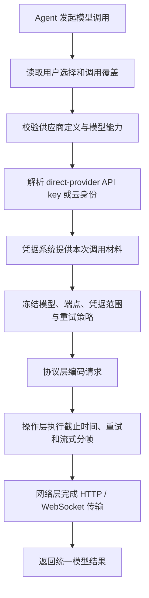

# 模型调用系统

> - 物理位置：`zeta-rs/model-provider/`
> - Rust crate：`zeta_model_provider`
> - 层次：Provider 运行时与选择层
> - 当前状态：completion runtime 已直接组合 `zeta-api` endpoint profile、`zeta-client` operation
>   retry/stream framing 与 `zeta-http-client` transport；OpenAI Responses、OpenAI-compatible Chat
>   Completions、Anthropic Messages 已使用原生 wire streaming；semantic OpenAI API-key
>   materialization 已有 host-injected `SecretStore` 路径，持久化 credential 产品闭环尚未实现
> - Crate 实现与 adapter 调用图：[`zeta-rs/model-provider/README.md`](../zeta-rs/model-provider/README.md)
> - 声明配置层：[`model-provider-config.md`](model-provider-config.md)
> - API 协议层：[`zeta-api.md`](zeta-api.md)
> - Operation client：[`zeta-client.md`](zeta-client.md)
> - 底层网络：[`zeta-http-client` README](../zeta-rs/http-client/README.md)
> - Secret persistence：[`secrets.md`](secrets.md)
> - Interactive login control plane：[`login.md`](login.md)
> - ChatGPT/Codex subscription runtime：[`codex-app-server.md`](codex-app-server.md)

## 快速理解

模型调用系统把用户选择的模型变成一次可执行调用：先确定供应商、模型、服务地址和凭据，再把
请求交给协议、重试和网络层。配置在调用开始时冻结，因此一次调用不会在执行途中悄悄换模型或
凭据。

| 常见问题 | 系统行为 | 深入阅读 |
| --- | --- | --- |
| 本次到底使用哪个模型？ | 根据供应商定义、用户选择和本次调用覆盖生成不可变绑定 | [一次调用如何形成](#1-一次调用如何形成) |
| 自定义服务地址会影响什么？ | 只在供应商配置明确允许时生效，不会把一个服务偷偷当成另一个协议 | [供应商与 API 端点](#5-供应商与-api-端点的联动) |
| 凭据由这里保存吗？ | 不保存；这里只取得本次调用所需的凭据，保存和登录属于相邻系统 | [供应商凭据](#6-供应商凭据与-codex-边界) |
| 失败后会自动重试吗？ | 只有调用类型明确允许安全重试时才会重试；模型推理默认不能仅凭“没收到输出”重跑 | [重试分工](#8-重试分工) |
| 当前已经能做什么？ | 已具备三种 endpoint 的 unary/streaming completion 与 embedding/rerank；持久化凭据闭环尚未完成 | [当前实现审计](#3-当前实现审计) |

## 1. 一次调用如何形成



这条流程中，模型调用系统只拥有“选择并冻结本次调用绑定”。协议层解释请求和响应，操作层处理
安全重试与分帧，网络层负责真实连接；任何一层都不能根据 URL 或模型名称重新猜测上层已经作出
的选择。

ChatGPT/Codex subscription 不是 raw model invocation：上游 Codex 同时拥有 Agent/tool/approval
循环，因此产品在 Core 层选择独立的 `TurnExecutionBackend`，不把它塞进本流程。

一次绑定必须明确回答：

- 使用哪个供应商和模型；
- 使用哪个 API 配置档案、服务地址和部署目标；
- 使用哪种凭据来源和作用范围；
- 哪些调用默认值与供应商规则生效；
- 这类操作能否安全重试。

## 2. 谁负责什么

| 责任 | 最终所有者 | 模型调用系统在其中做什么 |
| --- | --- | --- |
| 供应商和模型选择 | 模型调用系统 | 解析选择并生成不可变调用绑定 |
| 合法配置形态 | 模型供应商配置 | 提供定义，模型调用系统只消费 |
| 凭据保存和登录 | 凭据与登录系统 | 请求本次需要的敏感材料，不自行持久化 |
| API 请求和响应含义 | 模型 API 协议层 | 选择明确的协议配置档案 |
| 重试、截止时间和流式分帧 | 操作客户端 | 选择重试策略，不执行重试循环 |
| HTTP、代理和 TLS | 网络层 | 提供解析后的目标和标头 |
| 模型目录刷新 | 模型目录系统 | 提供目录访问适配器，不保存第二份缓存 |

### 2.1 本系统拥有

- 供应商运行时注册与适配器选择；
- 规范化配置到不可变运行时的解析；
- 供应商、模型和 API 配置档案的组合；
- 服务地址、部署、账户与区域作用范围的最终解析；
- 凭据引用到本次调用材料的绑定；
- 供应商级调用默认值与重试策略选择；
- 模型调用器 `ModelInvoker` 的生命周期；
- 协议、操作客户端和共享网络客户端的组合；
- 模型目录系统所需的运行时适配器。

### 2.2 本系统不拥有

- 可持久化配置模式和内置供应商定义；
- 供应商请求、响应和流式事件的数据结构；
- `/responses`、`/messages` 等 relative path；
- JSON、SSE 事件或 NDJSON 对象的协议解释；
- DNS/TCP/TLS/proxy/connection pool；
- 重试循环、退避等待和 `Retry-After` 处理；
- 流式分帧、字节缓冲和空闲计时；
- 模型目录刷新、缓存、合并与筛选；
- Agent 循环、工具循环和 Thread/Turn 持久状态；
- 浏览器登录、OAuth 回调、令牌刷新撤销和上游凭据保存。

## 3. 当前实现审计

当前实现已经具备正确的基本方向：

- `ModelProviderRuntime` 拥有配置 registry 和 lazy transport owner；
- `Provider` 保存 normalized config、definition 和 adapter；
- `ModelInvoker` 表达不可变 Provider/model selection；
- `src/providers/` 按外部服务组织 runtime adapter；
- `NormalizedModelProviderConfig::api_profile` 显式选择 `ApiEndpoint`；
- `SemanticRuntimeResolver` 将 OpenAI-compatible/OpenAI/Ollama 的 exact config 解析为 immutable embedding/rerank invoker；
- `model-provider → zeta-api`、`zeta-client` 和 `zeta-http-client`，没有反向依赖。

已移除的重复分派为：

```text
model-provider-config::ProviderAdapter
        ↓
model-provider::providers::instantiate
        ↓
zeta-api::Api::{OpenAi, DeepSeek, Google, ...}
```

`zeta-api::Api` 曾复制了一次 Provider registry。现在 `zeta-api` 仅公开 endpoint profile；
`model-provider::providers/` 保留唯一的 Provider runtime 选择，并把声明式 `ApiProfile` 映射为
`ApiEndpoint`。

`HttpClient` 和 `UreqHttpClient` 定义在 `zeta-http-client`。Runtime 持有共享 lazy operation client：
App Server 启动不构造 socket/TLS backend，第一次真实 operation 才 fallibly 创建 transport；API codec
构造 opaque byte request，`zeta-client` 组合 retry/framing，底层保留 status/header/body transport evidence。

## 4. 运行时解析流程

```text
ModelRuntimeRequest
  ├─ ModelRef
  ├─ ModelProviderConfig
  └─ invocation policy
        │
        ▼
ProviderConfigRegistry::normalize
        │
        ▼
Provider runtime adapter
  ├─ resolve credential
  ├─ resolve target/deployment
  ├─ choose API profile
  ├─ choose retry policy
  └─ bind zeta-api endpoint + zeta-client
        │
        ▼
Arc<dyn ModelInvoker>
```

解析结果必须不可变。配置或 credential revision 变化后创建新的 runtime，不在飞行中的调用对象
上做可变热更新。

## 5. 供应商与 API 端点的联动

Provider 名称不能等同于 API 协议。同一 Provider 可以选择多个正式 endpoint：

| Provider | 可选 API profile 示例 |
| --- | --- |
| OpenAI Platform | Responses |
| ChatGPT/Codex subscription | upstream Codex App Server 的 thread/turn 与公开 capability（独立 runtime） |
| xAI | Responses、Chat Completions |
| Google | Gemini Interactions、GenerateContent、OpenAI-compatible Chat |
| MiniMax | Anthropic Messages、OpenAI-compatible Chat |
| Ollama | native Chat NDJSON、OpenAI-compatible Chat |
| DeepSeek | OpenAI Chat、Anthropic-compatible endpoint |

### 5.1 Input-token 计量矩阵

这里的“支持”只表示调用前 budget measurement，不是调用完成后的 response usage。所有 remote
binding 都由 `ProviderDefinition.input_token_count` 明确声明 profile、target 和 model policy；未声明
时 fail closed，不能因为 Chat Completions 外形兼容就推断存在 count endpoint。

| Provider | 官方计量面 | 当前 Zeta 状态 | 边界 |
| --- | --- | --- | --- |
| OpenAI | [`POST /responses/input_tokens`](https://developers.openai.com/api/reference/resources/responses/subresources/input_tokens) | ✅ exact remote | 与 Responses request 同 codec；直接读取 `input_tokens` |
| Anthropic | [`POST /v1/messages/count_tokens`](https://docs.anthropic.com/en/api/messages-count-tokens) | 部分具备：estimated remote | provider preflight 后按 1%/至少 32 tokens 保守记账 |
| Google | [`models.countTokens`](https://ai.google.dev/api/tokens) | 部分具备：estimated remote | native `generateContentRequest`；当前 invocation 是 OpenAI-compatible，且仅声明 model 可用 |
| Kimi | [`estimate-token-count`](https://platform.kimi.ai/docs/api/estimate) | 部分具备：estimated remote | 文档 schema 只有 model/messages；带 tools/reasoning 的当前请求退回 unavailable |
| Z.AI | [`POST /tokenizer`](https://docs.z.ai/api-reference/tools/tokenizer) | 部分具备：estimated remote | 使用 `usage.total_tokens`，支持 tools；带 Tool Call/Result 历史暂退 unavailable |
| xAI | [`tokenize-text`](https://docs.x.ai/developers/rest-api-reference/inference/other) | ❌ full-request preflight unavailable | 只 tokenize 裸文本；[billing FAQ](https://docs.x.ai/developers/faq/billing) 说明 inference 还会加入预定义 tokens |
| Qwen | [text generation](https://help.aliyun.com/en/model-studio/text-generation) | ❌ preflight unavailable | chat template 会增加控制 token，不能按裸文本计数 |
| DeepSeek | [token usage / offline tokenizer](https://api-docs.deepseek.com/quick_start/token_usage) | 部分具备：local/estimated | 已接入完整 `ModelRef` binding、请求级模板渲染与 tokenizer runtime；当前仍需宿主提供固定资产清单 |
| Ollama | [API usage fields](https://github.com/ollama/ollama/blob/main/docs/api.md) | ❌ preflight unavailable | `prompt_eval_count` 是调用完成后的 usage |
| Hugging Face Router | [per-model tokenizer API](https://huggingface.co/docs/tokenizers/main/api/tokenizer) | 部分具备：local/estimated | 公共 `owner/repo` 首次使用时解析 immutable commit，按需下载并校验 `tokenizer.json`、`tokenizer_config.json` 与 standalone template；重启复用磁盘缓存 |
| MiniMax | [Chat API](https://platform.minimaxi.com/docs/api-reference/text-post) | ❌ verified preflight unavailable | 当前官方文档只确认 response usage |
| MiMo | [Responses API](https://mimo.mi.com/docs/en-US/api/chat/responses) | ❌ verified preflight unavailable | 当前官方文档只确认 response `usage.input_tokens` |
| Generic OpenAI-compatible | 无统一标准 | ❌ unavailable | 必须由具体 provider definition 显式增加 count profile |

目标调用形态：

```rust
let binding = ApiBinding::OpenAiChat {
    endpoint: zeta_api::endpoint::OpenAiChat::deepseek(),
    target: resolved_target,
};
```

以上只是语义示例。关键约束：

- Provider module 选择 endpoint/profile；
- `zeta-api` 实现 request/response/event codec；
- `zeta-client` 组织 operation attempt，并通过 `zeta-http-client` 执行；
- runtime 不根据 URL 或 model ID 猜 profile；
- profile 变化必须是显式配置或 built-in definition 变化；
- 已有配置不能静默迁移到另一正式 API。

### 5.2 OpenAI 服务接口面不是 OpenAI-compatible 配置档案

公开 OpenAI Platform API 与 ChatGPT/Codex service 都可能使用 `responses`、`models` 或 realtime
这样的相对 path，但它们的 base URL、credential、可用 operation 和 wire 差异不能由 path 推断。
上游 Codex 的 memories/search 等能力是 subscription runtime capability，不是 `zeta-api` endpoint；
详见 [`zeta-api.md`](zeta-api.md#45-openai-platform-与-chatgptcodex-endpoint-清单)。

因此 direct-provider runtime binding 包含如下事实：

```rust
pub struct OpenAiExecutionBinding {
    endpoint: zeta_api::ApiEndpoint,
    target: ResolvedApiTarget,
    credential_scope: CredentialScope,
}
```

ChatGPT/Codex subscription 不是 `OpenAiCompatibleAdapter` 的用户自定义 base URL 选项。Platform API
key、custom-compatible credential 与 ChatGPT/Codex runtime 彼此不能复用或降级转换。

ChatGPT/Codex subscription 不构造 `ResolvedApiTarget + Bearer token` binding。它只能由已认证的
[`zeta-codex-app-server`](codex-app-server.md) runtime 执行；上游 Codex 选择 allow-listed target、管理
credential refresh，并执行实际 backend request 和 Agent loop。

## 6. 供应商凭据与 Codex 边界

Provider 的共同点只到“调用前需要可用身份”为止。API key、AWS credential chain、Google ADC、
Microsoft identity 和签名请求仍由本 crate 的 direct-provider runtime materialize；它们的 secret
bytes 可以保存在 [`zeta-secrets`](secrets.md)，但浏览器 login 不属于本 crate。

ChatGPT/Codex subscription 是独立 runtime：

```text
zeta-app-server → zeta-login → zeta-codex-app-server → upstream Codex App Server
                         │
                         └─ implements Core TurnExecutionBackend
```

`TurnExecutionBackend` 是 Core 消费的窄 port。它接收已创建的 durable Turn，并把完整远端执行结果
投影回 Core；它不接受 raw access token、header map 或 arbitrary ChatGPT base URL。产品 composition
根据持久化 Turn model 在静态目录中的 access 显式选择 default `TurnExecutor` 或 Codex backend；
subscription row 的 provider 仍是 `openai`，`zeta-model-provider` 不参与远端 Agent loop。

401 recovery 也按身份所有者处理：direct-provider credential 可由其 provider runtime 做一次受限
refresh/rebuild；Codex subscription 由 upstream Codex 自己刷新，Zeta 只接收 reauthentication-required
或稳定 execution error。`zeta-client` 不读取 secrets，也不自行刷新或重试认证。

## 7. 标头和目标

| 内容 | Owner |
| --- | --- |
| Platform/default provider base URL | `model-provider-config` |
| 用户 base URL override | 仅 Platform/custom-compatible provider；由 `model-provider-config` 声明、runtime 解析 |
| ChatGPT/Codex service target | upstream Codex App Server；不接受 Zeta generic user override |
| resolved absolute target | `model-provider` |
| API key/cloud identity/tenant header | `model-provider` + direct-provider credential layer |
| relative path、method、content type | `zeta-api::endpoint` |
| API version、协议 beta header | `zeta-api::endpoint/requests` |
| trace propagation、user agent | `zeta-http-client` |
| operation attempt header | `zeta-client` |

Runtime 合并 headers 时必须使用 typed origin 和冲突规则。认证 header 不得被协议层覆盖，协议
必需 header 不得被用户任意删除；所有 secret header 的 `Debug` 必须脱敏。

## 8. 重试分工

`zeta-client` 拥有 retry 机制，但 runtime 选择 retry policy：

```text
model-provider
  选择 Never / SafeRead / ExplicitIdempotency 等策略
        ↓
zeta-client
  执行 attempt loop、backoff、jitter、Retry-After 和 telemetry
        ↓
zeta-api
  提供 provider error/status 的事实分类
```

Inference 通常是 POST，不能仅因“尚未收到 token”就假定安全重试。默认规则：

- 没有 Provider 明确 idempotency contract 时，inference 使用 `Never`；
- catalog GET 可以使用有上限的 `SafeRead`；
- 已产生 semantic output 后禁止透明 retry；
- direct-provider credential error、validation error 不重试；
- Codex subscription refresh 和 upstream process outcome 由 `zeta-codex-app-server` 与 upstream
  Codex contract 处理，不能套用 HTTP retry；
- fallback model/provider 是 Agent policy，不是 client retry；
- runtime 只选择 typed policy，不自己 sleep 或写 attempt loop。

## 9. 流式处理分工

```text
zeta-client (direct-provider path)
  从 zeta-http-client 消费 HTTP byte stream
  → SSE/NDJSON framing
  → idle deadline / cancellation / backpressure
        ↓
zeta-api::sse
  provider event decode
  → ping/comment/terminal interpretation
  → canonical ModelStreamEvent
        ↓
model-provider
  attach provider/model identity
  → ModelInvoker stream
```

DeepSeek `: keep-alive` 的 frame 边界由 client 识别，作为无 payload 的 SSE comment 交给协议层；
协议层确认它不形成 model output。Anthropic `event: ping` 同样由协议层过滤。Runtime 不解析
`data:` 行或 provider event JSON。

## 10. 目录来源

`zeta-model-provider` 是 models manager 与实际 Provider network runtime 的连接点：

```text
models-manager::ModelCatalogSource
        ▲ implemented by
model-provider
  ├─ resolved catalog target
  ├─ credential scope
  ├─ zeta-api catalog request codec
  └─ zeta-client operation → zeta-http-client HTTP execution
```

Runtime 负责 scope identity、credential revision 和 catalog API binding；manager 负责何时刷新、
缓存、merge 和发布 snapshot。Runtime 不维护第二份 catalog cache。

Codex subscription 的模型/额度 observation 只能由 `zeta-codex-app-server` 在上游公开 account 或
model operation 支持的范围内提供；它不使 models manager 直读或猜测 ChatGPT backend catalog。

## 11. 依赖方向

箭头表示“依赖”：

```text
zeta-model-provider
  ├──▶ zeta-model-provider-config
  ├──▶ zeta-api ───▶ zeta-client
  ├──▶ zeta-client
  ├──▶ zeta-http-client
  ├──▶ zeta-secrets
  └──▶ zeta-protocol

zeta-codex-app-server
  ├──▶ zeta-login
  ├──▶ zeta-core                 # implements TurnExecutionBackend
  └──▶ zeta-protocol

App Server composition
  ├──▶ zeta-model-provider
  ├──▶ zeta-login
  └──▶ zeta-codex-app-server
```

更准确地说：

- `zeta-client` 不依赖 Provider、API codec、Core 或 config；
- `zeta-http-client` 不依赖 Provider、API codec、Core、config 或 secret store；
- `zeta-api` 可依赖 `zeta-client` 的 operation/SSE value；
- `zeta-model-provider` 依赖 config、API、operation client、HTTP client、secrets 和 protocol；
  它不定义或消费完整 Agent-loop backend；
- config 不反向依赖 runtime；
- API/client 都不反向依赖 model-provider。
- `zeta-codex-app-server` 实现 interactive login 与 Core `TurnExecutionBackend`；
- Zeta App Server 只组合和映射 redacted control-plane DTO，不实现 OAuth host；
- model-provider 不依赖 App Server、Desktop、CLI 或 TUI。

## 12. 目标目录

```text
zeta-rs/model-provider/
├── BUILD.bazel
├── Cargo.toml
├── README.md
└── src/
    ├── lib.rs
    ├── runtime/
    │   ├── mod.rs
    │   ├── provider.rs
    │   ├── model_invoker.rs
    │   ├── resolution.rs
    │   └── runtime_tests.rs
    ├── binding/
    │   ├── mod.rs
    │   ├── api.rs
    │   ├── target.rs
    │   ├── headers.rs
    │   ├── retry.rs
    │   └── binding_tests.rs
    ├── credential/
    │   ├── mod.rs
    │   ├── api_key.rs
    │   ├── materialized.rs
    │   ├── recovery.rs
    │   ├── cloud/
    │   └── credential_tests.rs
    ├── providers/
    │   ├── mod.rs
    │   ├── openai.rs
    │   ├── anthropic.rs
    │   ├── google.rs
    │   ├── deepseek.rs
    │   ├── ollama.rs
    │   └── ...
    ├── catalog/
    │   ├── mod.rs
    │   ├── source.rs
    │   └── catalog_tests.rs
    └── error.rs
```

Provider module 只保留确实属于 runtime selection 的差异。Request DTO、SSE event struct 和 HTTP
client implementation 不得放入 `providers/`。

## 13. 公共接口

Public API 只暴露：

- `ModelProvider`；
- `ModelProviderRuntime` 或更窄的 runtime factory；
- immutable `ModelInvoker`；
- `ModelRuntimeRequest`；
- 安全的 `ModelProviderError`；
- models manager 所需的 source adapter。

Provider adapter trait 默认 crate-private。新 public trait 必须写 doc comment，说明配置 snapshot、
credential、cancellation、retry 和 secret redaction 责任。

Public API 不导出 ChatGPT token、PKCE verifier、通用 secret header map 或 `SecretStore`。登录账户
projection 由 [`zeta-login`](login.md) 提供；App Server 只读取该 redacted projection。

## 14. 迁移顺序

1. 建立 `zeta-http-client` 的 unary request/response/config port；
2. 将当前 `zeta-client::UreqHttpClient` 和 raw transport value 迁入底层 crate；
3. 让 `zeta-client` 通过共享 transport 执行 operation retry/framing；
4. 将 `zeta-api::Api` 改为 endpoint/profile API；
5. `model-provider/src/providers/*` 直接选择 endpoint/profile；
6. 增加 streaming binding；
7. 以 OpenAI API key 建立第一个 direct-provider credential vertical slice；
8. 建立 `zeta-login` 与 `zeta-codex-app-server`，以 upstream managed ChatGPT login 和 Core
   `TurnExecutionBackend` 接入第一个完整 Codex Turn vertical slice；
9. 实现 models manager 的 catalog source；
10. 删除旧 Provider 级双重 dispatch。

迁移期间不创建空模块，也不同时保留两套长期 public facade。

## 15. 固定决策

1. Provider registry 只存在于 `zeta-model-provider`。
2. Runtime 选择 API endpoint，但不实现 wire codec。
3. Runtime 选择 retry policy，但 retry attempt loop 属于 `zeta-client`。
4. Direct-provider runtime 解析自己的 credential；secret 不进入 config、普通 inference DTO 或
   telemetry。ChatGPT/Codex subscription credential 始终留在 upstream Codex。
5. Runtime 不解析 SSE/NDJSON framing。
6. 动态 catalog cache 属于 models manager。
7. `zeta-api` 和 `zeta-client` 不反向依赖 runtime。
8. direct-provider credential lifecycle 属于本 crate；`zeta-secrets` 只持久化 opaque secret。
9. interactive login lifecycle 属于 `zeta-login`；ChatGPT subscription 由
   `zeta-codex-app-server` 委托给 upstream Codex。
10. 不建立统一 Provider OAuth，也不接入第三方 subscription token。
11. `model-provider` 不创建或消费 ChatGPT Agent backend；产品在 Core `TurnExecutionBackend` 边界
    选择 Codex adapter。
