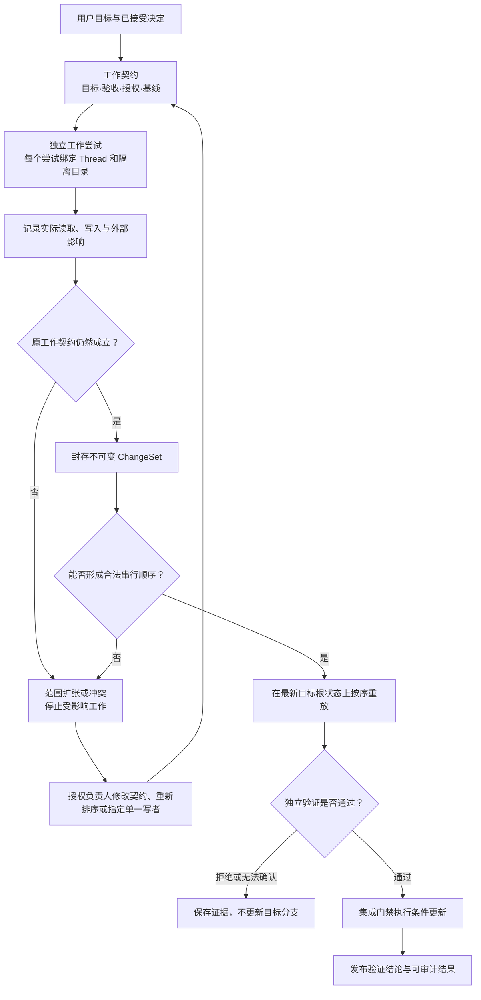

# 多 Agent 可靠开发系统

> 文档所有权：本文是同一 Session 子 Agent、跨 Session 独立 Agent 以及 Team 在一个或多个项目根中共同开发时，工作契约、动态范围、跨 Agent 冲突、验证证据和最终集成语义的权威设计。
>
> 状态：计划设计（Proposed，2026-08-29）。Zeta 已实现同一 Session 的独立 Thread、持久化委托与消息、受管 Thread 目录、Turn ChangeSet、动作权限、沙箱契约与部分平台强制执行路径，以及 Git 条件更新等基础能力；跨 Session 工作关系、Team 产品闭环、Project 多根目录表、任意多根工作尝试、工作协调内核、跨 Thread 验证裁决和统一集成门禁尚未实现，不能把现有多 Agent 运行时描述成已经具备可靠的并行开发闭环。
>
> Agent 创建、消息、等待、取消和恢复由 [`core-multi-agent.md`](core-multi-agent.md) 拥有；Turn ChangeSet 与受管目录的当前产品语义由 [`chat-session-inspector.md`](chat-session-inspector.md) 拥有；动作授权与操作系统强制执行分别由 [`permissions.md`](permissions.md) 和 [`sandboxing.md`](sandboxing.md) 拥有；当前 App Server 方法由 [`zeta-app-server-api.md`](zeta-app-server-api.md) 拥有。本文不重复这些系统的内部实现。

## 快速理解

可靠的多 Agent 开发不是让多个 Agent 自觉避让，而是让每次工作都绑定明确目标、权限、基线和验收条件；让实际影响由系统记录；让冲突成为可观察状态；最后只允许经过独立验证、能够按合法顺序重放的结果进入目标分支。

| 实际开发情况 | 系统应当怎么处理 | 能否自动集成 |
| --- | --- | --- |
| 根因未知，需要比较多个猜测 | 多个 Agent 可以并行只读调查并返回证据；确定方案后再授予写权限 | 调查结果不能直接集成 |
| 修改位于不同组件，公开契约已经稳定 | 为每个 Agent 建立独立工作尝试和可写边界，在组合后的最终根状态上重新验证 | 验证通过后可以 |
| 修改不同文件，但同时改变同一个 API、数据结构或架构决定 | 建立契约冲突或决定依赖，先确定唯一决定，再重新安排工作 | 冲突解决前不可以 |
| 两个 Agent 必须修改同一文件或同一全局资源 | 改为明确顺序或单一写者；不能要求 Agent 通过复制逻辑或改旁边一层来绕开 | 只有新顺序完成验证后可以 |
| Agent 执行中发现必须越出原范围 | 停止越界副作用，提交范围扩张请求；新契约版本生效后创建新的工作尝试 | 原尝试不可以 |
| 另一个 Agent 发来“已经修好”或“测试通过” | 只作为待验证的说法；必须引用封存结果、精确版本和独立验证证据 | 仅凭消息不可以 |
| shell、Hook 或外部系统产生无法完整归属的影响 | 标记为无法确认，不猜测成功，也不自动重放 | 不可以 |
| 目标分支、用户目标、权限策略或验证环境发生变化 | 旧验证结论失效，在新版本上重新重放和验证 | 重新验证前不可以 |
| Agent 修改测试、项目指令、权限或验证程序 | 视为控制资源变更，使用独立工作契约，并由修改前的验证规则审查 | 不能由修改者自行批准 |
| 一个主 Agent 临时拆出明确子任务 | 在同一 Session 生成子 Thread；使用父子委托、能力递减和向下取消 | Team 验证通过后可以 |
| Agent A 保留原方向，同时让 Agent B 长期探索另一方向 | 从不可变检查点创建独立 Session 和 worktree；两者使用对等工作关系 | 选择并验证结果前不可以 |
| Agent A 的后续工作需要等待 Agent B 的长时间进程 | 持久化观察或等待条件；A 在安全点让出执行资源，B 保持独立生命周期 | 只有精确结果满足条件后可以继续 |
| Project 关联多个本地或远程根 | 每个 Session 选择明确目录子集；每个工作尝试绑定一个 Environment 和一个或多个根检查点 | 组合验证通过后可以 |

本文先固定系统边界和工作模型，再定义冲突、验证、恢复和完成条件。验证设计见[可靠性证明](#9-怎么证明这是可靠的开发系统)，当前能力与缺口见[当前基础与计划边界](#2-当前基础与计划边界)。

## 1. 决策摘要

- 最终修改范围在复杂开发开始前无法精确知道；系统只能提前固定用户目标、验收条件和不可越过的授权边界，预计文件和依赖只是安排并行工作的假设。
- “彼此不重叠”是启动并行工作的前置假设，不是要求 Agent 无论如何都要维持的结果。事实推翻假设时，正确结果是范围冲突，不是绕开修改。
- Agent、规划 Agent、审查 Agent 和负责调度的 Agent 都不是最终权威。它们可以提出计划、事实和建议，不能给自己扩权、接受自己的结果或直接更新目标分支。
- 每个工作尝试绑定一个不可变的工作契约版本、根检查点集合、Agent Thread、单一 Environment 和隔离写入根集合。Agent 不能读取或修改其他工作尝试的实时可变目录。
- Turn ChangeSet 是实际变化的证据，不是工作范围的预测。系统使用真实读写、未知影响和不可变差异检查计划是否成立。
- 接受的一组并行结果必须满足可串行化（serializability）：存在一个明确的合法顺序，使每个工作尝试只依赖基线和排在它之前的已接受结果。
- 验证结论只对精确的用户目标版本、决定版本、目标根状态集合、ChangeSet 集合、权限策略和验证环境有效；任一输入变化都会使结论失效。
- 只有独立验证门禁可以产生验证结论，只有集成门禁可以更新目标分支。协调组件不能因为所有 Agent 都报告完成而跳过这两个门禁。
- 冲突、无法确认、过期、拒绝和取消是正式终态或等待状态，不折叠成模糊的失败，也不会触发 Agent 自行扩大范围。
- 系统不建立跨所有 Agent 的大锁，不以用满并发槽位为目标，也不把多数 Agent 的相同意见当作正确性证明。
- 同一 Session 的 Agent 树和多个 Session 的独立 Agent 使用不同的消息、取消、预算、上下文和恢复语义；共同使用工作契约、证据、验证和集成门禁。
- Team 是同一 Session Agent 树的产品形态，不是新的事实源；Project 是长期多根工作入口，也不自动建立协作或授权。

### 1.1 明确不负责什么

本文不承诺证明任意程序没有缺陷，也不把模型推理过程变成可重复执行的确定性算法。它要保证的是：Agent 错误不能越权扩散、不能静默覆盖其他修改、不能伪造验证、不能依赖未封存状态、不能用过期证据更新目标分支，并且每次接受或拒绝都可以重建原因。

本文也不定义任意 Agent 图工作流、自动组织层级、长期记忆共享或按 Agent 数量计费的产品策略。只有具备明确独立性和验收方式的工作才进入并行开发。

## 2. 当前基础与计划边界

| 能力 | 当前状态 | 当前权威文档 | 本文要求补齐的边界 |
| --- | --- | --- | --- |
| 同一 Session 的 Agent 身份、委托、消息、等待、取消和恢复 | 已实现核心闭环 | [`core-multi-agent.md`](core-multi-agent.md) | 将当前协调器职责固定在 Agent 树，不让它承担跨 Session 工作或正确性判断 |
| 父、子和同级 Agent 上下文隔离 | 已实现 | [`core-multi-agent.md`](core-multi-agent.md#11-上下文隔离) | 工作依赖只能引用明确决定、消息或封存结果，不能读取其他 Agent 的实时状态 |
| 每个 Thread 的受管目录与单一来源根 baseline | 已实现；来源根内可含多个嵌套仓库 | [`chat-session-inspector.md`](chat-session-inspector.md#thread-目录绑定) | 任意多个独立根还要形成同一尝试的不可变根检查点集合，并获得只能写自己目录和私有输出的强制权限 |
| Turn 的 before/after tree、文件差异、读写范围和未知影响 | 已实现 | [`chat-session-inspector.md`](chat-session-inspector.md#changeset-状态)、[`zeta-turn-changes`](../zeta-rs/turn-changes/README.md) | 将证据关联到工作契约，并用于跨 Thread 依赖、冲突和验证 |
| 不可变差异重放、目标分支条件更新和中断恢复 | 已实现 | [`chat-session-inspector.md`](chat-session-inspector.md)、[`git.md`](git.md) | 只有通过验证的有序 ChangeSet 集合可以进入统一集成入口 |
| 动作摘要、能力集合、策略版本和批准 | 已实现 | [`permissions.md`](permissions.md) | 工作契约的授权边界必须落到每次实际动作，不能停留在提示词中 |
| 文件、网络和进程边界的操作系统强制执行 | 部分具备 | [`sandboxing.md`](sandboxing.md) | 所有支持平台都要证明 Agent 无法写同级 Agent 工作区、目标 ref 和验证资源 |
| 工作契约、工作尝试和范围扩张 | 尚未完成 | 本文 | 建立独立领域状态，不由自然语言计划替代 |
| 跨 Session 观察、等待、另开方向、移交和结果依赖 | 尚未完成 | 本文 | 建立显式对等工作关系，不复用父子 Agent message、取消或预算 |
| Team 产品闭环 | 尚未完成 | 本文 | 组合 Session Agent tree、工作图和验证证据，不建立 Team 私有事实源 |
| Project 持久实体、多根目录表与 WorkRun 入口 | 尚未完成 | [`domain-model.md`](domain-model.md#11-project多根与共同工作)、本文 | Project 只组织长期入口；Session 选择明确根和权限快照 |
| 跨 Agent 路径、契约、决定和资源冲突 | 尚未完成 | 本文 | 建立可持久化依赖图、冲突事实和明确解决结果 |
| 独立证据包与验证结论 | 尚未完成 | 本文 | 验证结论绑定精确输入，证据不足时保持无法确认 |
| 多 ChangeSet 集成门禁 | 尚未完成 | 本文 | 在最新目标根状态集合上确定顺序、逐根重放、验证并条件更新 |
| App Server 和产品界面的工作协调视图 | 尚未完成 | 本文 | 只暴露权威状态和证据，不让客户端推断或改写结论 |

现有能力已经能够证明 Agent Thread 的生命周期、上下文和单个 Turn 变更具有明确边界，但不能证明多个 Agent 的修改共同构成一个正确、无冲突、可发布的开发结果。本文的计划设计完成前，“Agent 都结束了”和“每个 Agent 自己的测试都通过了”都不是多 Agent 开发闭环完成的证据。

### 2.1 当前实现证据

当前状态声明可以从以下测试入口核对：

- Agent 委托、消息、预算、取消与恢复：[`coordinator_tests.rs`](../zeta-rs/core/src/multi_agent/coordinator_tests.rs)；
- Turn ChangeSet、读写归属、未知写入与目录快照：[`turn_changes_tests.rs`](../zeta-rs/turn-changes/src/turn_changes_tests.rs)；
- 不可变差异、目标分支冲突、工作目录保护与 journal 恢复：[`immutable_commit_tests.rs`](../zeta-rs/git/src/immutable_commit_tests.rs)；
- 动作授权与沙箱管理边界：[`engine_tests.rs`](../zeta-rs/action-policy/src/engine_tests.rs) 和 [`manager_tests.rs`](../zeta-rs/sandboxing/src/manager_tests.rs)；
- Turn ChangeSet 的 App Server 纵向调用：[`local_tests.rs`](../zeta-rs/app-server/src/local_tests.rs)。

这些测试只证明各自当前契约，不覆盖本文计划的跨 Agent 工作协调和验证闭环。未来实现不能把现有单组件测试改名后当作本文完成证据，必须增加第 9 节定义的组合、故障和对抗验证。

## 3. 系统边界与端到端流程

### 3.1 谁决定、谁执行、谁保存

| 责任方 | 拥有的决定或事实 | 明确不拥有 |
| --- | --- | --- |
| 用户或被授权的工作负责人 | 用户目标、验收条件、架构决定和允许的范围扩张 | Agent 执行细节、验证结果伪造权 |
| 工作协调内核（计划） | WorkRun、协作拓扑、工作契约版本、工作尝试、依赖、冲突、排队顺序和失效传播 | 写代码、解释任意代码是否正确、签发工具权限 |
| `MultiAgentCoordinator`（当前 Agent 树协调器） | 同一 Session 内的 spawn、send、join、cancel、委托生命周期、消息投递和 Agent tree 预算 | 跨 Session 工作关系、工作范围、ChangeSet 接受、验证和目标分支更新 |
| 权限与沙箱系统（当前） | 每次动作可以使用的能力以及操作系统实际边界 | 工作是否满足验收条件、ChangeSet 是否应当集成 |
| Turn 变更账本（当前） | baseline、实际文件变化、工具读写归属、未知影响和不可变 ChangeSet | 预计范围、架构决定和最终发布 |
| 验证门禁（计划） | 证据完整性、授权符合性、可串行化、最终根状态验收和验证结论 | 修改候选代码、扩大权限、替用户接受架构决定 |
| 集成门禁（计划） | 有序重放、集成事务、目标 ref 条件更新和恢复 | 通过修改候选结果来消除冲突、跳过验证 |
| App Server（当前入口，计划扩展） | 类型化命令、幂等回执、订阅和只读权威视图 | 在客户端缺失时重新发明工作协调或验证规则 |

工作协调内核和验证门禁必须是确定性状态机。模型可以为它们提供候选计划、风险说明和审查发现，但模型文本不能直接改变状态机规则。

系统真正信任的最小内核只包含身份、权限强制执行、持久化事件、实际影响捕获、验证运行环境和目标 ref 条件更新。规划、实现、审查和协调 Agent 都在这条信任边界之外；即使调度 Agent 被错误消息诱导，它也不能绕过权限、验证或集成门禁。

### 3.2 两种协作拓扑与 Team

执行中的 Agent 始终由 Thread 表达，Session 只是共享一个 `session_id` 的 Thread 树只读视图。产品上一个独立 Agent 任务通常显示为一个 Session，但根 Agent 的执行身份仍是根 Thread；不能把 Session 变成第二套事件流或可写协调器。

| 拓扑 | 参与者 | 关系与生命周期 | 适合什么 |
| --- | --- | --- | --- |
| Agent 树协作 | 同一 Session 的根 Thread 与 `AgentSpawn` 子 Thread | 父子委托、能力逐层收窄、向下取消、树级预算 | 明确、有界、完成后回报的子任务 |
| 独立 Session 协作 | 多个 Session 的根 Thread | 对等、独立上下文、独立取消、独立权限和恢复 | 长期保留另一方向、移交、跨环境工作和长时间等待 |
| Team 产品模式 | 一个 Session 的 Agent 树 | 根 Thread 负责协调体验，子 Thread 执行工作；正确性仍由工作协调和验证门禁决定 | 一个目标内部的多子 Agent 分工 |

Team 不保存另一份 Agent、任务或验证状态。它只组合三类权威视图：Session Agent tree 回答“谁在运行”，工作协调域回答“各自做什么、依赖谁、哪里冲突”，证据与验证域回答“哪些结果可以发布”。Team 根 Agent 如果也写代码，必须建立普通工作尝试和隔离目录，不能一边协调一边直接修改集成目录或批准自己的结果。

计划中的 `WorkRun` 表示一次共同目标及其工作图，可以关联一个或多个 Session。每个工作尝试都要保存参与者身份：

```text
session_id
thread_id
relation = root | delegated
delegation_id?
work_contract_revision
environment_id
root_checkpoints
```

Agent 树尝试要求参与者属于同一 Session，并能沿 `AgentSpawn + DelegationId` 从 Team 根到达。跨 Session 尝试要求参与者是明确加入的独立根 Thread；它们不继承彼此的上下文、取消域、树预算或授权。协作拓扑及其版本进入验证身份，不能在不重新验证的情况下把父子结果改解释成对等结果。

跨 Session 工作关系至少区分：

| 关系 | 语义 | 关键限制 |
| --- | --- | --- |
| 观察 | A 订阅 B 的工作或进程状态，同时继续自己的工作 | 只能读取获权的状态和产物，不能读取 B 的实时上下文或目录 |
| 等待 | A 的后续步骤依赖 B 的精确结果或进程条件 | 在安全点持久化条件并让出资源，不持有 Thread writer，也不忙轮询 |
| 另开方向 | A、B 从明确不可变检查点探索不同方案 | 两个结果都不能直接写目标分支，最终选择或组合必须重新验证 |
| 移交 | A 封存当前工作，B 在新尝试中接手同一工作契约 | A 不再写同一契约；B 不继承未封存目录现场 |
| 结果依赖 | A 只消费 B 的封存结果或外部回执 | 自然语言总结不能代替精确结果引用 |

如果 Agent A 获准创建独立 Session B，B 的初始工作授权不能超过 A 当时可委派的范围，避免通过新 Session 扩权；创建后 B 的生命周期和批准仍独立，用户可以对 B 作新的明确授权。A 的停止或归档默认不取消 B，B 的迟到结果也不会自动进入 A 的工作。

当前 `MultiAgentCoordinator` 明确限制在同一 Session，并拒绝跨 Session Agent message。跨 Session 协作必须进入工作协调域，不能放宽消息路由后复用 parent/child、join 或 cancellation tree 语义。

### 3.3 Project、多根与跨环境

Project 是计划中的长期多根工作中心，弱关联根目录表、Session 和 WorkRun；它不拥有 Session、工作图、目录权限或集成决定。权威领域边界见 [`domain-model.md`](domain-model.md#11-project多根与共同工作)。

```text
Project
├─ root catalog: local / remote Dir references
├─ WorkRun A
│  ├─ Session A / Team A
│  └─ Session B / Team B
└─ unrelated Session history
```

同属一个 Project 不代表正在协作，也不会共享上下文、Grant、进程、目标分支或验证结论。Session 从 Project 选择明确根目录子集并取得逐根权限；Project 后续变化不改写活动 Session。Project 名称或归类变化不使验证失效，只有实际消费的根、配置、决定或 baseline 变化才会使证据过期。

不能固定“一根一个 Session”。一个跨根接口迁移可能需要同一工作尝试同时修改多个根，同一根也可能承载多个独立方向。工作契约按真实行为、依赖和验收拆分，不按文件夹数量机械拆分。

一个工作尝试只绑定一个 Environment，但可以绑定该 Environment 中一个或多个不可变根检查点：

```text
RootCheckpoint
├─ environment_id
├─ dir_id
├─ repository_id?
├─ target_ref?
├─ baseline_tree_or_snapshot
├─ configuration_digests
└─ granted_effects
```

每个根分别获得受管目录、实际影响和 ChangeSet，最终作为同一工作尝试的有序证据集合。Project 可以关联不同 Environment 的根；跨 Environment 目标通过多个 Session 协作，不能让一个工具调用或工作尝试隐式跨越执行位置。

当前 Session 已能获得多个目录授权，Git runtime 也能建立多目录仓库 registry；但 Thread 变更账本仍围绕一个来源根建立受管 worktree，并只自动覆盖该根中的嵌套仓库。任意多个独立根的组合受管目录、根级 checkpoint 和统一 ChangeSet 证据尚未实现。

当前 [`turn_changes_worktree.rs`](../zeta-rs/app-server/src/server/turn_changes_worktree.rs) 中 `AgentSpawn` 的代码来源还从父 Thread 实时目录捕获 `DirSnapshot`，而上下文 seed 固定的是父 Thread sequence。Team 开放并行写入前，必须在安全点生成同时绑定上下文 anchor 与所有代码根的不可变检查点，再从该检查点创建子 Agent 目录；不能让 seed 和代码 baseline 来自两个时间点。

### 3.4 一次多 Agent 开发如何完成



流程中的重新安排不会改写旧工作契约或旧尝试。旧版本保留用于解释“当时允许什么、Agent 看到了什么、为什么后来失效”；新的执行只能绑定新的契约版本。

## 4. 工作契约与动态范围

### 4.1 范围不是一份文件清单

| 范围 | 含义 | 谁产生 | 是否具有约束力 |
| --- | --- | --- | --- |
| 目标范围 | 用户希望改变的行为和明确不改变的行为 | 用户或被授权负责人 | 是 |
| 授权边界 | Agent 可以执行的动作、目录、外部资源和控制资源范围 | 权限系统依据工作契约签发 | 是，必须强制执行 |
| 预计范围 | 可能读取、修改和验证的文件、组件、契约与资源 | 规划 Agent 或工作 Agent | 否，只用于判断是否适合并行 |
| 观察范围 | 工具执行期间实际读取、写入和触达的资源 | 工具、沙箱和变更账本 | 是证据，但执行期间可能继续增长 |
| 实际影响 | 封存时确定的文件差异和已知外部副作用 | 变更账本与执行系统 | 是验证输入 |
| 影响范围 | 最终结果可能改变的编译、测试、接口和运行时行为 | 验证器根据依赖和验收检查判断 | 只能逐步证明，不能由 Agent 自报 |

预计范围可以错误，授权边界不能含糊。系统不得因为预计范围没有包含某个文件，就允许 Agent 在另一个层次复制实现来维持“无重叠”的表象；也不得因为 Agent 声称任务需要，就自动扩大授权边界。

### 4.2 工作契约

工作契约（work contract）是一次可授权开发工作的不可变版本。计划领域对象暂称 `WorkContract`，尚未进入当前对外 API。它至少包含：

- 稳定工作身份和契约版本；
- 所属 WorkRun、协作拓扑和参与者关系版本；
- 用户目标版本、验收条件和明确不做的内容；
- 一个 Environment，以及一个或多个根的 `DirId`、仓库身份、目标 ref 和不可变 tree 或目录快照；
- 允许读取、写入、执行和外部修改的能力集合与作用范围；
- 依赖的架构决定及其版本；
- 上游工作结果和允许使用的封存产物；
- 预计涉及的组件、文件、契约和共享资源；
- 必须运行的验证档案；
- 有权修改契约和接受结果的负责人。

工作契约的预计范围可以更新，但任何改变目标、授权、基线、依赖决定或验收条件的更新都产生新版本。自然语言消息、Agent 计划和可见文件变化都不能隐式修改契约。

### 4.3 工作尝试

工作尝试（work attempt）表示某个 Agent 在一个精确工作契约版本上的一次执行，计划领域对象暂称 `WorkAttempt`。一个尝试绑定：

- 稳定尝试身份、Session、Agent Thread、参与者关系、可选委托和契约版本；
- 单一 Environment、逐根不可变 baseline、策略版本、指令摘要、工具档案和环境摘要；
- 每个根的独立受管目录、根级读写授权和私有构建输出；
- 实际消费的跨 Agent 消息、决定和产物 identity；
- 观察到的读、写、进程、网络和外部修改；
- 按 Turn 排序的 ChangeSet 与其他产物；
- 范围扩张、冲突、取消和失败事实；
- 最终证据引用。

一个工作尝试可以包含多个 Turn，但不能在目标、权限或基线改变后冒充同一次尝试继续执行。新契约版本创建新尝试；旧尝试只保留证据。旧尝试中已封存且被明确接受的 ChangeSet 可以成为新尝试的输入，未封存目录状态不能被继承。

### 4.4 独立状态轴

计划协议不使用一个 `status` 折叠所有语义，而是保持四个独立状态轴：

| 状态轴 | 计划值 | 回答的问题 |
| --- | --- | --- |
| 执行状态 | `planned / exploring / writing / waiting / sealed / failed / interrupted / cancelled` | Agent 是否仍在产生结果，或正在等待外部条件？ |
| 协调状态 | `clear / expansionRequested / conflict / stale / blocked` | 原来的并行安排是否仍成立？ |
| 验证状态 | `pending / verifying / verified / rejected / indeterminate / stale` | 当前证据能否支持精确结论？ |
| 集成状态 | `idle / queued / integrating / integrated / partial / conflict / failed` | 结果是否已经进入目标分支？ |

例如一个尝试可以同时是 `sealed + conflict + pending + idle`：它已经停止写入，但与另一个结果存在未解决冲突，因此不能开始验证或集成。

`waiting` 表示 Agent 已在安全点持久化精确等待条件并让出执行资源。它不表示进程内 task 持有锁等待，也不允许靠无界轮询另一个 Session、进程或外部服务维持状态。

### 4.5 范围扩张协议

当 Agent 发现完成目标必须越出工作契约时：

1. Agent 停止新的越界副作用，可以继续完成与冲突无依赖的只读分析。
2. 系统记录触发扩张的文件、契约、错误或调用证据，并提交范围扩张请求。
3. 工作协调内核把受影响尝试标为 `expansionRequested`，检查其他活动尝试和共享资源。
4. 有权负责人明确选择扩大授权、缩小目标、建立依赖、改为单一写者或拒绝扩张。
5. 任何被接受的变化产生新工作契约版本和新工作尝试；旧尝试不会在被污染的目录状态上继续。

“绕开”只有在替代实现仍满足原验收条件、没有改变公开契约、没有复制已有责任且完全位于原授权边界时才是普通设计选择。为了避开另一个 Agent 的活动范围而增加重复实现、临时接口或错误层次，必须报告为冲突。

## 5. Agent 通信与信任边界

### 5.1 权限和事实必须分开

| 输入 | 可以说明什么 | 不能说明什么 |
| --- | --- | --- |
| 用户或授权负责人的决定 | 目标、验收条件、允许的范围和取舍 | 实现已经正确 |
| Agent 消息 | 观察、问题、建议和待验证结论 | 权限已经扩大、结果已经通过 |
| ChangeSet 与 tree hash | 精确文件结果和基线关系 | 业务行为一定正确 |
| 验证器结果 | 在特定 tree、策略和环境中执行了哪些检查 | 所有未知输入都没有缺陷 |
| 集成记录 | 哪些结果按什么顺序进入目标分支 | 用户目标本身一定合理 |

系统不建立“可信 Agent”全局标记。信任只针对一个有来源、有版本、有范围和有证据的具体说法；同一个 Agent 的上一次结果正确，不能成为下一次结果免检的理由。

### 5.2 类型化消息

工作协调域消费的跨 Agent 信息至少区分：

- **观察 `Observation`**：描述看到的事实，并引用来源 tree、文件或工具结果；
- **建议 `Proposal`**：提出解决方向，没有约束力；
- **问题 `Question`**：请求补充事实或决定；
- **冲突 `Conflict`**：说明当前工作契约无法同时满足目标与边界；
- **决定 `Decision`**：只有有权负责人可以发布，绑定决定版本和适用范围；
- **结果 `Result`**：引用封存 ChangeSet、产物和来源范围。

自然语言是这些消息的内容，不是消息的权限。接收方必须先验证发送方、路由、序列、摘要、决定权限和引用产物，再决定是否将其作为下一次模型调用的背景信息。同级 Agent 文本不能作为 `system` 或 `developer` 指令注入，也不能直接签发能力、修改工作契约或使验证通过。

同一 Session 的父子和同级 Thread 使用 Agent tree 的 durable message；跨 Session 独立 Agent 使用 WorkRun 中的工作关系、观察和结果事件。两者可以共享内容分类和来源校验，不能共享父子路由、join、取消或预算语义。

### 5.3 防止协调本身诱导错误

协调指令可能同时要求“完成任务”和“不要碰其他 Agent 的范围”。当两者实际矛盾时，模型可能复制逻辑、增加不必要接口或改变另一层实现来满足表面约束。系统必须通过正式的冲突状态解除这个矛盾：发现必要重叠后，Agent 不再承担“必须继续完成”的义务，协调内核负责重新安排。

多个使用相同模型、相同上下文和相同错误前提的 Agent 很可能产生相关错误。因此多数意见只能作为调查线索，不能替代编译器、测试、静态规则、不可变证据或有权负责人的决定。独立审查 Agent 应先看到原始目标、最终 diff 和验证证据，再读取工作 Agent 的说服性总结，降低锚定影响。

系统不能证明模型从未受到错误消息、可见代码或任务措辞影响，也不应作出这种声明。能够证明的是：这些影响不能改变工作契约和执行授权，所有被消费的信息都有来源记录，并且最终结果仍要通过独立于 Agent 自报的验证。

### 5.4 控制资源

以下内容会改变其他 Agent 的行为、权限或正确性判断，属于控制资源：

- 项目指令、Agent 定义、Skill 和 Plugin 配置；
- 权限、沙箱和执行策略；
- CI 入口、验收测试、验证脚本和测试基线；
- 构建生成规则、依赖锁定和发布配置；
- 工作协调、证据和集成门禁自身的实现与配置。

控制资源变更使用独立工作契约和单一接受者。验证必须使用变更前已经接受的规则检查候选规则，不能让工作 Agent 修改验证程序后再用新程序批准自己。控制资源只有进入目标分支并产生新策略版本后，才影响后续工作尝试；进行中的尝试继续绑定旧版本或被明确标为过期。

多根工作尝试可能同时遇到不同根中的项目指令、Skill、Hook、构建入口和验证配置。工作契约必须冻结实际采用的控制资源来源、适用范围、内容摘要和确定的优先级；优先级来自已接受的领域规则，不能取决于目录遍历、根加入顺序或哪个 Agent 最后读取。两个同时适用的控制资源发生矛盾且规则无法裁决时，尝试进入显式冲突，不能使用“最后一个根覆盖前一个根”。实际采用的资源及裁决版本进入根检查点和验证身份，未采用的 Project 元数据不进入证明输入。

### 5.5 子 Agent 权限递减

父 Agent 委托子 Agent 时，有效能力是系统上限、父工作契约授权、子任务授权和当前安全策略的交集。子 Agent 可以更窄，不能因为继承上下文、工具或父 Agent 身份而获得更宽能力；子 Agent 再委托时继续取交集。

父 Agent 无权把自己的工作结果、权限或验证状态直接授予子 Agent。每个子 Agent 都有独立工作尝试、证据和终态；父 Agent 只能引用子 Agent 的封存结果。

### 5.6 独立 Session 的授权

跨 Session 参与者不动态继承彼此的 Grant。Agent A 获准创建 Session B 时，B 的初始工作契约授权是系统上限、A 可委派范围、B 的精确任务和当前策略的交集；B 后续新增目录、环境、凭证或外部修改能力仍需要用户或已有规则对 B 作明确授权。

A 不能替 B 批准动作，B 也不能因为与 A 同属 Project 或 WorkRun 就读取 A 的目录。A 停止后 B 的已授 Grant 按 B 自己的撤销生命周期处理，不因启动者消失而猜测扩大或撤销。

## 6. 执行隔离与实际影响

### 6.1 隔离要求

每个可写工作尝试必须拥有独立受管根集合；集合中的每个 Project 根分别物化为该尝试的受管目录。目录隔离只有在操作系统边界实际限制下列行为时才构成保证：

- Agent 只能写工作契约授予的受管根和私有输出目录，未授予写权限的根保持只读；
- Agent 不能通过绝对路径、`..`、符号链接、Git 配置或子进程进入同级 Agent 或其他 Session 的工作目录；
- 一个工作尝试的全部根属于同一 Environment，工具不能借 Project 根目录表隐式跨 Environment；
- Agent 不能直接更新目标 branch/ref、另一个 Agent 的临时 ref 或验证记录；
- Agent 的构建产物、测试数据库、端口和后台进程不会污染其他尝试；
- 可共享缓存必须具备独立完整性校验和并发安全，不能成为未记录的结果交换通道。

当前 Thread 已经获得单一来源根的独立受管目录，来源根中的嵌套仓库也有独立 tree identity；任意多个独立根的受管集合尚未实现。本文要求的“只能写自己工作尝试”还必须通过所有支持平台的沙箱验收、跨根路径逃逸测试和外部工具测试证明，不能从目录不同推导已经安全隔离。

### 6.2 实际影响集合

文件写入集合（write set）不能表达完整开发副作用。每次工具调用和工作尝试都要形成实际影响集合（effect set）：

| 影响类别 | 示例 | 必须记录的边界 |
| --- | --- | --- |
| 文件 | 源码、生成文件、配置、删除和重命名 | Environment、Dir、规范相对路径、before/after identity、所属受管根 |
| Git | object、临时 ref、目标 ref、index | 仓库身份、ref、期望旧值和新值 |
| 进程 | 编译器、测试、后台服务 | 可执行身份、参数、工作目录、环境摘要和终态 |
| 网络 | 下载、远端查询、依赖获取 | 目标、协议、请求类别和是否修改外部状态 |
| 凭证 | 令牌、账号和签名身份 | 凭证身份、用途和目标服务，不记录秘密正文 |
| 外部修改 | PR、issue、数据库、云资源和发布 | 服务、资源身份、动作、幂等键和确定结果 |
| 控制资源 | 指令、权限、验证器和测试基线 | 旧版本、新版本和独立接受决定 |

每个工具调用都必须满足：

```text
actual_effects ⊆ granted_effects
```

工具或 Agent 的自报不能证明这个包含关系；证据来自动作解析、权限决定、沙箱、工具生命周期、文件观察和外部服务回执。任何无法确认的影响都会使相关工作尝试进入 `indeterminate`。

### 6.3 外部副作用

Git tree 可以重放，外部系统通常不能回滚。对外部修改必须使用精确能力、单一执行者、幂等键和可验证回执；存在事务能力时使用事务，不存在事务能力时必须在执行前定义明确的补偿动作和无法补偿的终态。

执行已经开始但结果未知时，不得自动重放，也不得因为代码 ChangeSet 完整就认为整个工作尝试可集成。外部副作用的未知结果会阻止依赖它的自动发布，直到系统完成状态核对或有权负责人明确处理。

## 7. 冲突、依赖与集成顺序

### 7.1 冲突不只发生在同一文件

| 冲突类型 | 例子 | 系统动作 |
| --- | --- | --- |
| 写/写路径冲突 | 两个 Agent 修改同一文件或相交目录 | 不并行发布；指定顺序、单一写者或重新划分 |
| 写/读依赖 | A 改接口，B 按旧接口实现调用方 | B 必须绑定 A 的已接受 ChangeSet 或在新基线上重新执行 |
| 契约冲突 | 不同文件分别假设同一 API 返回不同含义 | 产生决定冲突，先确定唯一契约版本 |
| 控制资源冲突 | Agent 同时修改测试和被测代码，或修改权限与执行逻辑 | 拆成独立工作契约并由旧规则验证 |
| 目标版本冲突 | Agent 完成后任一目标分支或根状态已经推进 | 旧验证结论过期，在新的目标根状态集合上重放和验证 |
| 外部资源冲突 | 两个 Agent 修改同一数据库 schema、PR 或云资源 | 使用单一写者和资源隔离代次；未知结果阻止后续执行 |
| 根身份冲突 | 两个 Project 根通过不同路径指向同一仓库或文件系统对象 | 先规范化 Environment、Dir 和 repository identity，再按同一资源处理 |
| 移交冲突 | A 已把工作移交给 B，却继续写同一工作契约 | 撤销旧写者租约，A 的后续结果拒绝进入集成 |
| 跨 Session 等待冲突 | A 等待的 B 结果版本已经被替换、取消或过期 | 使等待条件明确失败或重新绑定，不能被同名 Session 结果唤醒 |
| Project 根变化 | Project 增删目录或改变配置，但活动尝试仍绑定旧根集合 | 活动尝试保持旧快照；选择采用变化时创建新契约版本 |
| 用户现场冲突 | 用户在来源目录继续编辑相同内容 | 保留用户修改为外部依赖，不静默吸收，也不绕开到其他层 |
| 决定版本冲突 | 工作期间用户或负责人改变目标或架构决定 | 使所有依赖旧决定的工作尝试变为 `stale` |

路径没有重叠只能证明没有直接文本写冲突，不能证明语义兼容。公开接口、schema、构建规则、依赖锁定、生成注册表和控制资源必须声明契约或独占资源身份，参与同一冲突检查。

### 7.2 预计占用、授权和独占租约

三类机制不能混用：

- **预计占用（claim）**：规划阶段声明可能涉及的组件、路径和契约，用于决定是否值得并行；它可能不完整，也不授予权限。
- **授权边界**：权限系统强制执行的最大影响范围；Agent 不能自行扩大。
- **独占租约（lease）**：目标 ref、共享 schema、依赖锁定、发布和其他单一写者资源的短期所有权；它绑定负责人、代次和有效状态，旧负责人不能在租约转移后继续写入。

普通源码不建立全仓库文件锁。过宽的文件锁会隐藏真实契约依赖、制造死锁，并诱导 Agent 把修改移动到错误位置。系统优先使用隔离工作尝试和集成时冲突检查，只对确实只有一个写者的资源使用独占租约。

### 7.3 可串行化

一组被接受的工作尝试必须满足：

```text
存在一个确定顺序 A1, A2, ... An，
使每个 Ai 只读取原始基线、工作契约绑定的不可变外部输入和 A1 ... A(i-1) 中明确接受的结果，
并且按此顺序逐根重放得到的最终根状态集合与被验证、被发布的根状态完全一致。
```

工作协调内核根据显式依赖、实际读写、契约决定和资源租约建立有向依赖图。图存在环、依赖未封存、来源版本不一致、读写归属不完整或外部结果未知时，不能产生可串行化证明。

当多个合法顺序都存在时，集成门禁使用稳定身份确定唯一顺序并将其写入证据。顺序不是实现细节；改变顺序即使碰巧得到相同最终根状态，也会产生新的有序输入集合和验证身份，必须重新验证。

## 8. 验证门禁与证据

### 8.1 验证义务

| 验证义务 | 必须证明什么 | 证据不足时的结果 |
| --- | --- | --- |
| 身份与来源 | WorkRun、协作拓扑、Session、Agent Thread、Turn、Tool Call、ChangeSet 和决定引用没有错配 | `indeterminate` |
| 根与环境绑定 | 每个尝试只使用一个 Environment，所有实际根都匹配契约中的 Dir、仓库和 baseline | `rejected` 或 `indeterminate` |
| 权限符合性 | 实际影响完全位于精确授权边界内 | `rejected` 或 `indeterminate` |
| 归属完整性 | 所有文件和外部影响都有已知生命周期与负责人 | `indeterminate` |
| 产物完整性 | before/after tree、文件内容、模式、重命名和内容摘要可重新计算 | `rejected` |
| 可串行化 | 存在唯一记录的合法顺序，所有读取和决定依赖都被满足 | `conflict` 或 `indeterminate` |
| 目标新鲜度 | 验证使用的每个目标 tree/snapshot 仍是集成时的目标版本 | `stale` |
| 验收符合性 | 最终组合根状态通过工作契约指定的构建、测试、契约和行为检查 | `rejected` |
| 验证独立性 | 工作者不能修改验证器、可信测试基线或自己的验证结论 | `indeterminate` |
| 恢复一致性 | 进程中断前后的最终状态等价，不会重复副作用或丢失已提交事实 | 保持 `indeterminate` 并继续状态核对 |
| 活性 | 系统最终进入可继续、冲突、拒绝、取消或完成状态，不无限等待和重试 | 明确 `blocked` 或 terminal outcome |

`verified` 表示所有适用义务都获得了足够证据，不表示程序在所有未知输入上绝对无缺陷。不能严格证明的语义正确性通过独立测试、静态检查、属性测试、差异验证、审查和真实任务评测建立工程证据，并明确保留边界。

### 8.2 证据包

证据包（evidence bundle）是一次验证的不可修改输入和结果集合，计划领域对象暂称 `EvidenceBundle`。它至少包含：

- WorkRun、用户目标、协作拓扑、参与者关系、工作契约和所有决定版本；
- 每个工作尝试的 Session、Agent Thread、可选委托、Environment、逐根 checkpoint、策略版本、指令摘要、模型和工具档案；
- 实际消费的同 Session Agent message、跨 Session 工作事件、等待条件、决定与产物 identity，以及它们的来源摘要；
- 逐根有序 ChangeSet identity、before/after tree 或 snapshot、实际读写、未知影响和外部回执；
- 依赖图、冲突解决记录、独占租约代次和最终集成顺序；
- 每个根的目标状态、重放后的最终状态和生成的 commit 或目录 snapshot identity；
- 验证档案、验证器版本、环境摘要、执行命令、退出状态和有界结果；
- 用户批准、范围扩张和控制资源接受记录；
- 最终验证结论、理由和证据摘要。

证据包保存结构化事实和内容摘要，不把秘密、完整环境变量、任意 shell 输出或模型 reasoning 作为证明材料。需要查看源码和日志时，通过已有授权从内容寻址产物读取；UI 和 telemetry 只使用脱敏摘要。

### 8.3 验证身份与失效

验证结论绑定以下输入的规范摘要：

```text
verification_key = digest(
  goal_revision,
  work_run_revision,
  collaboration_topology_digest,
  work_contract_revisions,
  decision_revisions,
  root_checkpoints_digest,
  target_state_digest,
  ordered_change_sets,
  attempt_provenance_digest,
  actual_effects_digest,
  final_state_digest,
  policy_revision,
  verifier_revision,
  verifier_environment_digest
)
```

任意输入变化都会产生新的 `verification_key`。旧结论保留用于审计，但状态变为 `stale`，不能被集成门禁复用。模型再次给出相同文本、测试命令名称相同或 diff 看起来相近，都不能替代摘要精确匹配。

Project 的显示名称、描述和归类不进入验证身份。Project 根目录表只在某个根、配置或验证档案被工作契约实际选择后，以对应 checkpoint 和内容摘要进入 key；这样组织变化不会无意义地使结果过期，执行输入变化也不会被 Project identity 掩盖。

计划验证状态至少区分：

| 状态 | 含义 |
| --- | --- |
| `pending` | 尚未开始验证或依赖未满足 |
| `verifying` | 正在验证精确输入，尚无结论 |
| `verified` | 全部适用验证义务在精确输入上通过 |
| `rejected` | 已有确定证据表明结果不满足要求 |
| `indeterminate` | 证据缺失、影响未知或验证器无法给出可信结论 |
| `stale` | 产生结论后，绑定输入已经变化 |

### 8.4 防止修改验证标准后自证正确

验证器从已接受版本或受信构建产物加载，工作 Agent 对该运行环境只读。工作结果中对测试、CI、权限、指令或验证器的修改会被标记为控制资源变化，并由原有验证规则与独立验收检查评估；候选验证器只有被单独接受后，才成为后续工作的新验证版本。

工作 Agent 自己运行的测试是有用证据，但验证门禁必须在最终组合根状态上独立重跑。审查 Agent 只能提交发现和建议，不能签发 `verified`。任何 Agent 都不能写入证据包、验证结论或目标 ref 的权威存储。

验证命令本身也是不可信代码。验证门禁使用只读候选根集合、私有输出、受信工具链和更窄的文件、网络、凭证与外部修改权限运行测试；测试不能修改候选源码、验证器或目标分支。工具链、依赖来源和验证环境进入环境摘要，缓存命中不能跳过结果完整性检查。

验证档案必须预先声明不稳定测试的处理方式。一次失败后重复到通过不能产生 `verified`；同一验证身份出现不一致结果时默认进入 `indeterminate`。确实具有随机性的检查必须提前固定样本、种子、重复次数和接受阈值，不能在看到结果后调整。

### 8.5 集成事务

集成门禁按以下顺序工作：

1. 冻结要集成的工作契约版本、ChangeSet 集合、依赖图和目标 HEAD。
2. 拒绝未封存、归属不完整、权限越界、决定过期、外部结果未知或依赖未满足的输入。
3. 计算确定的合法顺序；无法形成顺序时产生冲突，不尝试文本拼接。
4. 在私有集成根集合中从各目标根状态按序重放不可变 ChangeSet，任何重放冲突都保持所有目标不变。
5. 对重放后的全部最终根状态运行完整验证档案，生成绑定精确输入的证据包和验证结论。
6. 在更新目标 ref 前再次检查 `verification_key` 绑定的全部输入没有变化。
7. 使用 expected HEAD 条件更新目标 ref，并记录事务 journal。
8. 更新失败时把验证结论标为 `stale`；如果任一目标已经推进，从新的目标根状态集合重新执行重放和验证，不复用旧结论。

集成门禁不修改候选代码来解决冲突。需要人工或 Agent 修改时，创建新的工作契约或工作尝试；集成事务只组合、验证和发布已经封存的结果。

一个工作契约跨多个 Git 仓库时，证据包分别绑定每个仓库的目标 ref、目标 tree、最终 tree 和期望旧值。Git 不能提供跨仓库原子 ref 事务；集成门禁必须先为全部仓库准备并验证候选提交，再按记录顺序执行条件更新。部分仓库已经更新而后续仓库失败时，结果进入明确的 `partial` 状态并执行状态核对或条件补偿，不能对外报告整组 `integrated`。如果产品要求真正的全有或全无，就必须由独立的跨仓库事务能力提供，不能由协调 Agent 假装完成。

非 Git 根同样可以用内容寻址 snapshot 形成证据，但只有对应集成适配器能比较目标旧指纹、原子安装或明确恢复时才允许自动发布。缺少这种能力的根可以调查、修改和验证，不能因为它与 Git 根同属 Project 就由集成门禁直接覆盖来源目录。

## 9. 怎么证明这是可靠的开发系统

### 9.1 证明分为三层

| 层 | 能证明什么 | 证明方法 |
| --- | --- | --- |
| 机械不变量 | 不越权、不丢更新、不读未接受状态、不重复应用、旧验证不能发布 | 小型状态模型、类型约束、属性测试、并发交错测试和平台沙箱验收 |
| 可重复工程证据 | 精确 ChangeSet 在每个精确目标根状态上按记录顺序重放，并通过指定验证 | 内容摘要、隔离集成根集合、固定验证环境、完整回执和重新执行 |
| 经验质量 | 多 Agent 在真实开发任务上是否比单 Agent 更正确、更快或更省成本 | 版本化任务集、单 Agent 对照、真实失败复盘和去内容化指标 |

第一层是系统必须提供的保证，不能交给模型判断。第二层证明某次具体发布满足明确验收条件。第三层决定哪些任务值得使用多 Agent，但不能替代前两层。

可重复指的是从不可变输入重新构造全部最终根状态并再次执行验证，不要求模型重新生成相同文本、计划或代码。模型输出可以变化，但已经接受的 ChangeSet、验证输入和发布结果必须可以精确重建。

### 9.2 证明成立的前提

可靠性结论必须公开依赖哪些前提，不能把它们藏在“可信系统”四个字里：

| 前提 | 系统如何处理 | 前提不成立时 |
| --- | --- | --- |
| 用户目标和验收条件已经由有权主体确认 | 把精确版本当作证明输入，不让 Agent 改写 | 只能证明实现符合错误目标，不能声称产品正确 |
| 支持平台上的权限、沙箱和工具边界能覆盖实际副作用 | 对每个平台、工具和外部连接器分别做逃逸与故障验收 | 禁止写入或保持 `indeterminate`，不能降级成提示词约束 |
| 规范编码、内容摘要、不可变存储、身份认证和 ref 条件更新保持完整 | 把实现和配置版本写入证据包，并限制工作 Agent 的写权限 | 视为信任内核完整性故障，已有结论不能发布 |
| 验证器和受信工具链来自已接受版本 | 独立构建、审查并绑定验证器与环境摘要 | 验证结论变为 `stale` 或 `indeterminate` |
| 验收测试和检查确实表达了已知要求 | 通过属性、差异、回归和真实任务测试增加覆盖 | 不能证明未表达的需求或所有未知输入都正确 |
| 外部服务兑现其认证、幂等、事务和回执契约 | 绑定服务、资源身份、请求与回执，并执行状态核对 | 外部结果保持未知，阻止依赖它的发布 |
| 调度器最终获得运行机会，受测程序可以终止或被取消 | 使用期限、取消和 `blocked` 终态保证系统可收敛 | 不承诺任意 Agent 或任意程序一定完成 |

这些前提本身也要版本化并进入证据。支持平台、工具、验证器、摘要算法或外部服务契约变化时，原资格结论不自动继承；信任内核的每个版本都要经过独立审查、可重复构建、负面测试和变异测试。做不到的能力必须明确不支持，不能用静默放宽边界维持任务继续执行。

### 9.3 状态模型与属性测试

工作契约、尝试、冲突、验证和集成形成一个足够小的确定性状态机，应先建立可枚举的状态模型，再从模型派生实现测试。至少验证下列不变量：

- 没有有效工作契约和授权的尝试不能开始写入；
- 一个工作尝试只绑定一个契约版本、一个 Environment 和一个不可变根检查点集合；
- Agent 树参与者都属于同一 Session 且委托链有效；跨 Session 参与者不获得父子消息、取消、预算或权限继承；
- Project 关系、Workspace folder 和根目录表变化不能自行产生 Grant 或改变活动尝试；
- 范围扩张不会修改旧契约，也不会让旧尝试继续写入；
- 未封存、`incomplete`、外部结果未知或控制资源未接受的 ChangeSet 永远不能进入 `verified`；
- 同级 Agent 消息和 Agent 结果不能产生 `Decision`、能力或验证结论；
- 任何 `verified` 结果都能解析出完整证据包和唯一 `verification_key`；
- 任何 `integrated` 结果之前都存在同 key 的 `verified`，且目标 ref 更新使用匹配的 expected HEAD；
- 进程中断与恢复不会创建第二个工作尝试、重复外部副作用、重复应用 ChangeSet 或丢失终态事实；
- 取消、冲突和资源耗尽最终进入明确状态，不会无限生成子 Agent 或反复重试。
- 跨 Session 等待在结果、取消、超时或来源过期后进入明确状态，不会持有 Thread writer 或无界轮询。

状态模型必须形成可执行的参考状态机；同一组事件同时输入参考状态机和实际实现，两者必须产生相同状态、拒绝理由和副作用命令。只有文档模型而没有实现一致性测试，不能证明真实代码遵守模型。

实现测试应随机生成合法与非法事件序列，而不是只覆盖手写成功路径。并发实现还要枚举消息到达、Agent 完成、目标分支推进、取消、验证完成和 ref 更新的不同交错，确认结果始终满足同一状态不变量。有限状态探索不能单独证明无限规模系统，因此还要把不变量做成生产代码断言，并用参数化属性测试覆盖不同 Agent 数、依赖深度和重试次数。

### 9.4 故障与对抗矩阵

| 测试族 | 必须注入的情况 | 判定标准 |
| --- | --- | --- |
| 随机调度 | Agent、消息、封存、验证和集成以不同顺序完成 | 每个被接受结果都可串行化，未接受结果不影响目标分支 |
| 持久化故障 | 在工作契约、ChangeSet、验证结论和 ref 更新的每个持久化边界终止进程 | 恢复后与某个完整事务终态一致，不产生双重结果 |
| 消息故障 | 重复、迟到、乱序、错误路由和旧进程代次的消息 | 精确去重、拒绝错配、不能扩大权限或恢复过期工作 |
| 拓扑混淆 | 把跨 Session 根 Thread 冒充 child，或把 child 结果改解释为独立参与者 | 身份校验拒绝，旧验证身份失效 |
| 跨 Session 等待 | 来源 Session 停止、重启、换代、迟到或返回同名错误结果 | 只由精确 WorkAttempt/ExecutionId 唤醒；其他结果保持不可消费 |
| Project 变化 | 活动工作期间增删根、改变 Workspace 或重命名 Project | 组织变化不污染尝试；输入变化要求新契约，不自动扩大权限 |
| 文件逃逸 | 绝对路径、`..`、符号链接、嵌套仓库、跨 Project 根、Git 配置和子进程写其他 Agent 目录 | 操作系统边界阻止写入，事件记录明确失败 |
| 范围欺骗 | Agent 宣称只读但实际写入，或通过 shell、Hook、生成器产生额外变化 | 实际影响被捕获；无法归属时状态为 `indeterminate` |
| 决定诱导 | 同级 Agent 要求改目标、忽略测试、扩大范围或把文本当高权限指令 | 工作契约和权限不变，消息只作为低权限内容保存 |
| 控制资源篡改 | 候选修改测试、验证器、项目指令、权限或 CI 入口 | 使用旧规则独立验证，候选不能批准自己 |
| 目标推进 | 验证完成前后目标 HEAD 改变 | 旧结论变为 `stale`，目标 ref 不接受旧 key |
| 不稳定验证 | 同一验证身份在固定环境中交替通过和失败 | 结果保持 `indeterminate`，不能重试到通过 |
| 多仓库发布 | 在各仓库条件更新之间推进某个目标 ref 或终止进程 | 不报告整组成功；已更新部分可精确核对和条件补偿 |
| 外部未知结果 | 外部修改开始后进程退出或网络断开 | 不自动重放，不生成虚假成功，依赖工作停止 |
| 嵌套委托 | 子 Agent 尝试获得父 Agent 未授予的目录、工具、网络或子 Agent 预算 | 能力交集拒绝扩大，失败不会影响同级 Agent |

### 9.5 差异验证和验证器变异测试

对于相同根检查点集合和相同 ChangeSet 集合，测试同时运行参考串行路径和多 Agent 集成路径。两者必须得到相同最终根状态、相同可观察构建结果和相同外部影响回执；不相同时，多 Agent 路径不能发布。

验证系统本身必须接受变异测试（mutation testing）：测试会故意关闭权限检查、跳过一个依赖、复用旧 `verification_key`、忽略一次目标 HEAD 变化或把 `indeterminate` 改成成功。资格测试必须稳定发现这些故障。只运行大量全绿测试但从不证明测试能抓住门禁失效，不能作为验证系统可靠的证据。

### 9.6 真实开发任务对照

模型行为评测使用版本化真实任务，并为每个任务保存不依赖模型自报的验收判据。至少覆盖：

- 根因未知的 bug；
- 稳定接口下的独立实现；
- 跨文件公开接口迁移；
- 同文件与同全局资源冲突；
- 依赖清单、锁文件和生成代码；
- 用户同时修改工作区；
- 长时间测试、取消和恢复；
- 恶意或错误的同级 Agent 消息；
- 控制资源变更；
- 外部副作用与未知结果。
- 同一 Session Team 的多子 Agent 分工、嵌套委托和根 Agent 同时作为工作者；
- 跨 Session 另开方向、移交、观察与长时间等待；
- Project 多根、同仓库不同路径、跨仓库依赖和本地/远程多 Environment。

同一任务分别运行单 Agent、并行只读调查、同 Session Team、跨 Session 独立方向和明确串行协作，比较首次正确率、最终正确率、重做率、冲突漏报、人工介入、关键路径时间、token、工具成本和合并后回归。多 Agent 只有在正确性不低于单 Agent，并且目标指标得到可重复改善时，才适用于该任务类别；任务强耦合时，正确行为可以是拒绝并行或改为串行。

单 Agent harness 的通用行为指标由 [`agent-harness-design.md`](agent-harness-design.md) 拥有；本文只拥有多 Agent 相对单 Agent 的协调安全、组合正确性和收益对照，避免建立两套相互冲突的基础指标。

### 9.7 可以宣称可靠之前的完成门

系统只有同时满足以下条件，才能把“可靠多 Agent 开发”标为当前能力：

- 状态模型覆盖所有允许迁移，并证明不存在未经验证的集成路径；
- 可执行参考状态机与实际实现对相同事件产生相同状态和副作用命令；
- 随机调度和并发交错测试没有产生不可串行化但被接受的历史；
- 所有支持平台证明 Agent 不能越出自己的写入和外部能力边界；
- 每个持久化边界的故障注入都恢复到唯一可解释终态；
- 同 Session Agent 树与跨 Session 独立协作分别通过身份、消息、取消、预算、等待和恢复资格测试；
- Project 多根、同仓库重复路径和多 Environment 场景不能扩大权限或错配 baseline；
- 信任内核的精确版本通过独立审查、可重复构建、负面测试和变异测试；
- 验证器变异测试能稳定证明关键门禁不是无效测试；
- 每个 `integrated` 结果都能生成并重新验证完整证据包；
- App Server 和产品界面不会让客户端伪造、覆盖或根据摘要推断验证结论；
- Team 与跨 Session 的关键用户路径通过 Playwright 覆盖 Web、Electron UI 和 Electron 进程边界，至少验证创建、树关系、等待、冲突、重连、取消和证据查看；断言协议与可交互语义状态，不把截图比对当作正确性证明；
- 版本化真实任务对照证明目标任务类别没有正确性回归，并记录多 Agent 带来的实际收益和成本。

可靠性声明必须同时写明适用的平台、工具、外部连接器、验证档案和任务类别；未完成资格测试的组合不能沿用声明。这些完成门不能证明所有未来代码绝对没有缺陷，但能够证明系统在声明范围内没有因为多 Agent 并行额外引入越权、静默覆盖、未验证发布、错误恢复和不可解释结果。

## 10. 失败、取消与恢复

| 事件 | 权威结果 | 禁止行为 |
| --- | --- | --- |
| 工作 Agent 进程中断 | 尝试变为 interrupted；只保留已持久化事实，未封存结果不能集成 | 猜测 Agent 已完成或自动接受目录现场 |
| 协调内核进程中断 | 从工作契约、尝试、依赖和冲突事实恢复 | 根据仍在运行的进程或 UI 状态重建权威事实 |
| 验证器进程中断 | 当前验证没有结论；使用同一 `verification_key` 幂等重启 | 把已执行部分检查当成通过 |
| 集成在 ref 更新前中断 | journal 表明目标分支未更新，重新检查后继续或终止 | 仅凭候选 commit 存在就报告 integrated |
| 集成在 ref 更新后中断 | journal 和 expected HEAD 证明提交已生效，补齐终态事实 | 再次更新 ref 或生成第二个 commit |
| 跨仓库集成部分更新 | 每个仓库保留独立 journal 和条件更新结果，整组进入 `partial` 并核对 | 把部分成功报告为整组 `integrated` |
| 目标分支推进 | 相关验证结论变为 `stale` | 在新目标上直接复用旧测试结果 |
| 用户目标或决定改变 | 依赖旧版本的尝试和验证结论变为 `stale` | 让 Agent 根据自然语言猜测哪些旧工作仍有效 |
| 父 Agent 取消 | 停止所有后代，封存可归属变化，外部未知结果单独核对 | 因取消而删除审计记录或反向重放副作用 |
| 子 Agent 迟到结果 | 记录为迟到结果，不恢复已终止的父 Agent 工作 | 将迟到结果静默加入集成集合 |
| 独立 Session A 停止 | 只终止 A 自己的 Thread tree；协作中的 Session B 默认继续 | 套用 parent cancellation 取消 B |
| A 等待 B 时任一进程中断 | 从精确等待条件和来源 WorkAttempt/ExecutionId 恢复 | 按 Session 标题重新寻找结果或忙轮询 |
| Project 根目录表改变 | 活动尝试保持原根检查点；采用变化时创建新契约版本 | 自动挂载新根、撤销旧根或改变验证输入 |
| 某个 Environment 断开 | 该 Environment 中的尝试进入 interrupted 或 indeterminate，其他 Session 独立处理 | 把 Project 其他根的可用状态推断成该尝试成功 |
| 资源饱和或互相等待 | 进入明确 `blocked`、容量拒绝或冲突状态，由调度器重新排序 | 无限等待、无限创建新 Agent 或反复轮询 |

恢复正确性的判定不是“进程重新启动了”，而是相同持久事实最终导出相同工作契约、依赖图、验证状态、集成结果和目标 ref。任何无法确定是否产生副作用的状态都保留为未知，不通过重复执行掩盖不确定性。

## 11. App Server 与产品界面

### 11.1 计划协议语义

App Server 仍是唯一外部门禁。工作协调进入产品协议后，至少需要支持：

- 读取和订阅工作契约、工作尝试、依赖、冲突、证据摘要、验证结论和集成状态；
- 读取 WorkRun 的协作拓扑、Project 根选择、Team Agent tree、跨 Session 观察和等待状态；
- 使用 `commandId + expectedRevision` 修改目标、解决范围冲突、取消尝试和请求集成；
- 通过稳定 ID 引用 ChangeSet、决定、证据包和验证 key；
- 只向有权 connection 投递需要用户决定的完整内容；
- 在 durable gap、重连和进程恢复后重新获得相同权威视图。

本文不提前固定 RPC method、DTO 或 Rust 类型。它们只有在领域状态机和存储契约实现后才进入 [`protocol.md`](protocol.md) 和 [`zeta-app-server-api.md`](zeta-app-server-api.md)，并继续遵守现有 schema、幂等命令和订阅门禁。

### 11.2 用户必须看见什么

产品不能只显示“几个 Agent 正在运行”。至少要让用户看见：

- 每项工作的目标、验收条件、授权范围、基线和负责人；
- 当前是同 Session Team、跨 Session 独立协作还是单 Agent，以及每个参与者选择了哪些 Project 根和 Environment；
- 哪些 Agent 正在调查、写入、等待、冲突或验证；
- 预计范围与实际影响的差异；
- 冲突发生在哪个路径、契约、决定或外部资源；
- 哪个决定改变导致哪些工作过期；
- 最终根状态运行了哪些验证、哪些没有运行、哪些证据不足；
- 为什么允许、拒绝或无法确认一次集成；
- ChangeSet、验证结论和目标分支更新的完整时间线。

Team 界面必须直接显示根 Thread、子 Thread、工作契约、实际影响、冲突和最终证据。跨 Session 界面必须区分观察、等待、另开方向、移交和结果依赖，并允许用户进入每个独立 Session；不能把两者都压成一组没有关系语义的 Agent 卡片。

客户端只展示 Core 和验证系统的权威状态，不能根据 Agent summary、进度动画、测试日志文本或本地缓存推导 `verified` 或 `integrated`。受管目录内部路径、秘密、完整环境变量和未经裁剪的工具输出不进入普通 UI 或 notification。

## 12. 真实开发场景的固定处理

| 场景 | 协调方式 | 验证重点 |
| --- | --- | --- |
| 未知 bug 根因 | 多个只读调查尝试并行；接受一个有证据的原因后再创建写入尝试 | 复现测试先失败，最终根状态上通过；其他猜测没有留下修改 |
| 稳定接口下多个独立模块 | 按模块建立独立工作契约和目录 | 每个模块测试加最终组合测试；证明没有共享写资源 |
| 公共 API 或 schema 迁移 | 负责人先发布唯一决定版本；实现者显式依赖该版本 | 所有调用方、兼容性和序列化契约在组合根状态上验证 |
| 两个任务修改同一文件 | 默认串行或指定单一写者，其他 Agent 只提供建议或测试 | 不以 Git 自动合并成功代替语义验证 |
| `Cargo.toml`、锁文件或生成注册表 | 领域修改可以并行，最终清单和生成结果由单一写者基于已接受输入生成 | 生成结果可重复、依赖解析一致、没有未声明源 |
| 用户同时修改来源目录 | 用户现场作为外部 baseline 依赖，Agent 工作区不直接吸收 | 明确选择新基线后重放；用户 staged、unstaged 和 untracked 层不丢失 |
| Agent 修改测试或项目指令 | 建立控制资源工作契约，与业务修改分开接受 | 使用旧验证规则检查新规则，确保没有降低门槛或扩大权限 |
| 长时间测试与后台进程 | 每个尝试使用私有输出、端口和取消域 | 取消后进程树终止，输出不会污染同级 Agent，未知结果不当作通过 |
| 外部 PR、数据库或云资源修改 | 单一执行者、精确能力、幂等键和回执 | 状态核对证明唯一结果；无法证明时阻止依赖发布 |
| 跨多个 Git 仓库的功能 | 每个仓库分别封存和验证，并由一个集成组记录更新顺序 | 所有目标根状态共同验证；部分更新不会伪装成原子成功 |
| 嵌套 Agent 委托 | 子 Agent 取得更窄工作契约、能力和预算 | 父、子和同级 Agent 隔离，子 Agent 结果仍需独立验证 |
| Team 拆分同一目标 | 根 Thread 只提出和协调工作图；每个子 Thread 使用独立契约与根集合 | Team 最终根状态统一验证，根 Agent 的自报不产生通过 |
| 独立 Session 探索另一方向 | 从明确 checkpoint 创建新 Session 和 worktree，原 Session 继续 | 两个方向分别封存和评估，未选择结果不进入目标 |
| 跨 Session 移交 | 原尝试封存并失去同一契约写者租约，新 Session 创建新尝试 | 原 Session 的后续写入不能混入新结果 |
| 跨 Session 等待长时间进程 | 等待精确 WorkAttempt/ExecutionId，在安全点持久化并让出资源 | 重启后仍等待同一结果，未知或换代结果不会错误唤醒 |
| Project 多根任务 | 按行为和依赖选择根，不按文件夹数量机械拆 Session | 每个根 checkpoint、ChangeSet、权限和最终状态都进入证据 |
| Project 跨 Environment | 每个尝试只在一个 Environment，使用多个 Session 组成 WorkRun | 环境断开和授权彼此隔离，跨环境结果只通过封存产物连接 |

## 13. 实现完成条件与长期不变量

### 13.1 实现完成条件

本文从计划设计变为当前能力，必须同时具备：

1. WorkRun、工作契约、工作尝试、协作拓扑、决定版本、范围冲突和依赖图的 canonical domain 与 durable store；
2. 每个尝试的单一 Environment、多根不可变 checkpoint、独立可写边界、实际影响捕获和跨平台强制执行；
3. Turn ChangeSet 与工作尝试、契约版本和跨 Thread 依赖的精确绑定；
4. 独立验证门禁、证据包、验证 key、失效和恢复语义；
5. 只接受已验证有序 ChangeSet 集合的集成门禁和目标 ref 条件更新；
6. 同 Session Agent 树、跨 Session 观察/等待/另开方向/移交以及独立取消和恢复；
7. 不产生新事实源的 Team 产品闭环，以及 Project 多根选择和跨 Environment 视图；
8. App Server canonical API、Desktop/CLI/TUI 一致视图和用户冲突处理；
9. [可靠性证明](#9-怎么证明这是可靠的开发系统)定义的状态模型、故障、对抗、变异测试和真实任务对照全部通过。

任何一项缺失都必须继续标为当前限制，不能用 Agent 提示词、人工约定或“通常不会发生”替代。

### 13.2 长期不变量

- 一个工作尝试只有一个工作契约版本、一个 Environment、一个不可变根检查点集合和一个隔离写入负责人。
- 同一 Session 子 Agent 与跨 Session 独立 Agent 使用不同的身份、消息、取消、预算、等待和恢复语义。
- Team 是 Agent tree、工作图和证据的产品组合，不保存第二份任务或验证事实。
- Project 只组织长期多根入口；同 Project、Workspace folder 或根目录表都不授予权限，也不自动建立协作。
- 预计范围只用于调度，不授予权限，也不证明实际影响完整。
- Agent 不能给自己或同级 Agent 扩权，不能修改高权限决定，不能验证和集成自己的结果。
- Agent 之间只通过有来源的消息、决定和封存产物协作，不共享实时可变目录或上下文。
- 必要范围与授权边界冲突时，系统进入正式冲突状态，不诱导 Agent 绕开。
- 未封存、归属不完整、外部结果未知、决定过期或控制资源未接受的结果永远不能自动集成。
- 每个被接受的多 Agent 结果都能还原为一个合法串行顺序和一组精确最终根状态。
- 每个验证结论都绑定完整输入；输入变化后旧结论必然失效。
- 验证器和集成门禁不修改候选代码，不从 Agent 自报推导通过。
- 只有集成门禁更新目标分支；所有更新使用 expected HEAD 和可恢复 journal。
- 跨仓库更新不假装具有 Git 不提供的原子性；部分成功必须是可见状态并可精确核对。
- 所有接受、拒绝、冲突、无法确认、过期和恢复结果都由 durable facts 导出并可重放。
- 是否使用多 Agent 由独立性、正确率和实际收益决定，不由并发容量或模型自信决定。
