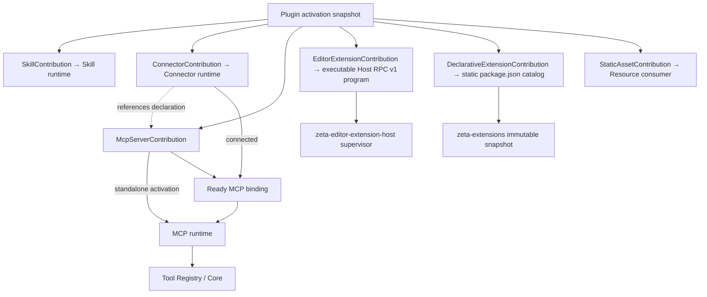

# 插件系统

> 物理位置：`zeta-rs/plugins/`
> Rust crate：`zeta_plugins`
> 当前状态：PL0 已实现并支持 `ConnectorContribution` 引用 `McpServerContribution` 的声明校验；PL1 的
> content-addressed store、Marketplace-first install/staged update/rollback、profile reconcile、durable installed/enabled/granted/effective authority、exact `PluginActivationSnapshot`、live generation publish 与 invocation drain 已实现；Connector domain 已提取到
> `zeta-rs/connectors`，Plugin projection、durable authority 与 API-token connect/revoke 位于
> `zeta-rs/ext/connectors`；App Server 已能从注入的 activation 自动接线 Connector 与 MCP，通用 OAuth
> PKCE/device 状态机、App Server control plane、Desktop/TUI 产品入口与 GitHub providers 已实现；
> TUF 远端 Marketplace、delegated publisher、离线签名目录缓存、按需安全 ZIP ingestion 与 revocation
> tombstone 已实现；PL4 的可执行 Editor Extension 安装/授权声明已实现，Host runtime 不由本 crate 拥有
> 当前 crate 实现契约：[`zeta-rs/plugins/README.md`](../zeta-rs/plugins/README.md)
> 远端分发实现契约：[`zeta-rs/plugin-marketplace/README.md`](../zeta-rs/plugin-marketplace/README.md)
> 跨 package family 的 Marketplace source、共享验证与领域投影：[`marketplace-integration.md`](marketplace-integration.md)
> Connector account/lifecycle：[`connectors.md`](connectors.md)
> MCP runtime：[`mcp.md`](mcp.md)
> Skill runtime：[`skills.md`](skills.md)
> Config authority 与 runtime snapshot 接入：[`config.md`](config.md)
> Editor Extension 双轨系统边界：[`editor-extensions.md`](editor-extensions.md)
> 可执行 Host runtime 实现：[`zeta-rs/editor-extension-host/README.md`](../zeta-rs/editor-extension-host/README.md)

## 快速理解

Plugin 是经过校验和版本管理的扩展包，不是安装后便能执行任意代码的进程内插件。安装、启用、
授权和实际调用是四个独立阶段。

| 用户动作 | 系统发生什么 | 不会自动发生什么 |
| --- | --- | --- |
| 安装 Plugin | 校验不可变包、清单、来源和内容摘要后写入本地存储 | 不启用贡献、不授予权限 |
| 在用户或 Workspace 中启用 | 允许其贡献参与解析 | 不连接 Connector、不启动 MCP、不执行脚本 |
| 批准请求的能力 | 记录精确的进程、网络、目录或凭据授权 | 不批准未来每一次工具调用 |
| 激活贡献 | 生成带来源和 generation 的不可变快照 | 不把 live manager 注入 Agent |
| 更新或回滚 | 并存校验后的版本并原子切换 | 不原地修改已安装包 |
| 卸载 | 撤销后续激活并清理可回收内容 | 不删除其他领域拥有的秘密或历史 |
| 打开正式打包的 Zeta | 从产品内固定的 root 刷新官方 HTTPS Marketplace | 不信任服务器提供的新 root，不自动安装或启用 Plugin |
| 浏览 Marketplace | 读取已签名 manifest、能力、权限与包统计；离线时可使用仍有效的目录缓存 | 不预下载所有 Plugin ZIP |
| 安装远端 Plugin | 重新检查 TUF 与撤销状态，只下载所选 exact ZIP，再校验内容摘要 | 不因已浏览或已下载而自动启用、授权 |

## 1. 结论

`zeta-plugins` 是 Zeta 的扩展分发、安装、解析、启用和版本管理控制面。Plugin 是一个不可变、
可校验的包，可以贡献 Skill、Connector declaration、MCP server declaration、可执行 Editor Extension 声明和静态资源；Plugin manager 将这些贡献
解析为带来源和 digest 的 activation snapshot，再由 App Server 注入对应 runtime。

Plugin 不是：

- 第三方 Rust dynamic library 或稳定 in-process ABI；
- 一段安装后自动获得系统权限的代码；
- Skill、MCP server、tool 或 connector 的同义词；
- Thread/Turn 执行状态或 durable transcript；
- secret container；
- 允许扩展绕过 approval、sandbox、credential 和 network policy 的信任标记。

边界固定为：



Plugin 只负责声明控制面和 package lifecycle。Skill、Connector、MCP 和 Resource consumer 分别拥有自己的运行时
语义；它们不是 Plugin manager 内部的 live 子对象。Plugin、Connector 与 MCP 的 canonical 关系由
[`connectors.md`](connectors.md) 维护。

静态 Editor Extension 保持另一套内容边界：它读取自己的 `package.json` 和声明式
language/TextMate/snippet/theme/debugger 资源。Plugin v1 现在可用 `declarativeExtensions[]` 指向包内
静态 Extension 目录；只有 effective exact Plugin package 会被 App Server 投影到 `zeta-extensions`。
这共享 install/enable/grant/revocation lifecycle，但不合并两种 manifest，也不把静态内容变成可执行
runtime。其 canonical 文档是 [`editor-extensions.md`](editor-extensions.md)。

Plugin v1 现在提供显式 `editorExtensions[]` bridge。每项指向包内一个可直接启动、自己实现 Zeta Host
RPC v1 的程序；它不是由通用 Node/WASM runtime 加载的脚本。Plugin manager 只验证并授权声明，
`zeta-editor-extension-host` supervisor 才拥有逐扩展进程隔离、RPC、crash recovery 和 provider
lifecycle。静态 `package.json` catalog 不会被隐式转换成该 executable declaration。

`declarativeExtensions[]` 是另一条显式 bridge：每项只有 manifest-local ID 和 package-relative
directory，目录必须包含 regular `package.json`。它不需要 `process` permission；安装只存储 bytes，
enable + grant 后才进入静态 catalog，disable、grant revoke、package revoke、update 或 uninstall 会使
下一次 catalog refresh 移除旧 exact package。Workbench 监听 Plugin activation generation 并自动刷新。
生产第三方执行还必须由产品注入能够实施 sandbox、memory/CPU/process hard limits 和 process-tree
termination 的 platform launcher；没有该 launcher 时 Host capability 必须为 false，不能用
`TrustedDevelopmentLauncher` 降级。该 v1 是 Zeta-native executable RPC，不是 VS Code/Node Extension
Host。

安装、启用、授权和调用是四个不同动作：

1. **Install**：包进入本地 content store；
2. **Enable**：某个 user/workspace profile 允许其贡献参与解析；
3. **Grant**：允许所需 process/network/root/credential capability；
4. **Invoke**：Agent 的某次 tool/script 操作仍经过 runtime approval 与 sandbox。

任何一个动作都不能隐含下一个动作。

## 2. 当前仓库审计

当前已创建 `zeta-plugins`，实现 strict v1 manifest、Plugin identity/SemVer、portable
package-relative path、本地 package 安全校验、确定性 digest、只读 local-development discovery，
以及 stage-copy-revalidate-atomic-promote 的 local content-addressed store。实现细节、limits 与
failure semantics 由 crate
[`README`](../zeta-rs/plugins/README.md) 维护。

User/Workspace TOML 与 App Server 已能表达 exact Plugin request 和 desired enablement。产品 host 注册
受管 Marketplace root；resolver 只按 catalog 中的 exact ID/version/digest 安装并协调 user-profile
enablement，不自动授予权限。Workspace request 只能读取 profile 中可用、待 profile 安装或版本不匹配
三种结果，不能以 Workspace trust 自动扩大 profile authority。Package store 安全保存 immutable object，
并把 exact installed package 解析为 generation-bound activation snapshot；App Server 可据此自动构造
Skill source、Connector catalog、durable authority 和 package-rooted MCP provider。Plugin authority
分别持久化 installed/enabled/granted/effective refs 和 command receipts，并驱动 live activation 切换；
App Server 已暴露 Marketplace list/install/update/rollback 及 enable/disable/grant/revokeGrant/uninstall。
`docs/tui.md` 也明确要求 Plugin domain projection 进入 canonical
App Server contract 后，TUI 才能增加管理 feature。TUI 已有可复用的 interaction view stack 与
tabs/search/selection presentation primitive，但当前没有 Plugin view model 或 `/plugins` command；
这些 UI 基础设施不改变本节的 backend gate。

已有可复用边界：

- `zeta-config` 提供 ordinary config authority、typed patch 和 `CommandId` replay；
- 各 credential domain 是生命周期 owner，`zeta-secrets` 是 opaque secret persistence owner；
- `zeta-sandboxing`、`zeta-tool-executor` 和 host capability 是已分离的本地进程执行权限边界；
  产品层 `zeta-exec` 只运行完整的无界面 Agent Turn；
- App Server 是本地 runtime 的 composition root；
- Resource store 可承载大块只读内容，但不是 Plugin package authority；
- `zeta-protocol` 已固定“共享纯语义进入 protocol，I/O 和 policy 留在执行层”的规则。

因此第一版不应从“动态加载代码”开始，而应先完成一个 declarative package：

```text
Plugin v1 contributions = Skills + Connectors + MCP server declarations
                        + executable Editor Extension declarations + static assets
```

第三方 UI、native library、hooks、model provider adapter 和任意 App Server method registration
不在 v1。

## 3. 职责与非职责

### 3.1 Plugin manager 拥有

- Plugin package layout 和 manifest schema；
- stable Plugin identity、version、digest 和 origin；
- package staging、validation、atomic install、side-by-side update 和 recoverable remove；
- user/workspace enablement 和 version pin；
- contribution discovery、path containment、compatibility 和 conflict validation；
- requested permissions、credential slots 与 user grants 的差异计算；
- immutable `PluginActivationSnapshot` 和 generation；
- package provenance、signature/trust result、revocation/blocked diagnostics；
- enabled Plugin 向 Skill/Connector/MCP runtime 的 normalized contribution projection；
- executable Editor Extension 的 exact program、Host RPC v1、activation trigger 与 capability ceiling 声明；
- install/update/enable/disable/uninstall 的 typed command replay；
- 不含秘密的 audit record 和 health projection。

### 3.2 Plugin manager 不拥有

- Skill 的自动选择、prompt layering 或 context budget；
- MCP JSON-RPC、process supervision、Connector connection/OAuth 或 tools/resources/prompts catalog；
- Editor Extension Host RPC transport、process supervision、crash recovery 或 provider registry；
- script、binary 或 MCP tool 的实际执行；
- API token、OAuth token、cookie 或 private key；
- OS sandbox、network enforcement 或 per-call approval 的最终实现；
- Thread reducer、Tool Call/Result commit 或 Agent retry；
- Marketplace 搜索和支付业务；
- 第三方 UI iframe、Renderer code execution 或 Electron preload extension；
- 任意 native ABI、WASM ABI 或 provider adapter ABI。

## 4. 目标依赖与组合

```text
                         zeta-protocol
                              ▲
                              │ shared IDs only when accepted
                              │
                         zeta-plugins
        manifest / package store / resolver / authority / snapshot
                    ▲                         ▲
                    │ package source          │ trust verifier
                    │                         │
             filesystem/registry        signature service
                    \                         /
                     \                       /
                      App Server composition
                         │          │          │
             SkillContribution  ConnectorContribution  McpServerContribution
                         │          │          │
                         ▼          ▼          ▼
                    zeta-skills  zeta-connectors   zeta-mcp
```

具体规则：

- `zeta-plugins` 不依赖 `zeta-skills`、`zeta-connectors` 或 `zeta-mcp` live runtime；
- Plugin manager 只输出 normalized descriptor 和 immutable root handle；
- App Server 将 Skill contribution 注册到 Skill source，将 Connector contribution 交给 Connector adapter，
  并将独立或 ready-bound MCP contribution 解析为 `McpServerDefinition`；
- contribution consumer 必须再次执行自己领域的校验，不能因为 package 已验证就跳过 schema、
  content 或 runtime policy；
- Plugin state 不进入 SessionStore/ThreadStore；
- App Server protocol 只暴露稳定 Plugin view 和 command DTO，不暴露内部 filesystem path、
  lock、transaction journal 或 signature library type。

## 5. 包与清单

### 5.1 v1 布局

```text
plugin-root/
├── .zeta-plugin/
│   └── plugin.json
├── skills/
│   └── code-review/
│       ├── SKILL.md
│       ├── references/
│       ├── scripts/
│       └── assets/
├── mcp/
│   └── review-server.json
├── bin/
│   └── review-server
├── assets/
└── LICENSE
```

目录可以省略，但 `.zeta-plugin/plugin.json` 必须存在。manifest 中只允许相对 package root 的
slash-separated path；绝对路径、`..`、空 segment、NUL、平台 device path 和 escape symlink
全部拒绝。

### 5.2 清单结构

以下是当前 v1 语义示例；当前 authority 是 Rust strict parser，尚未发布独立 JSON Schema：

```json
{
  "schemaVersion": 1,
  "id": "acme/code-review",
  "version": "1.2.0",
  "displayName": "Acme Code Review",
  "description": "Review workflows and an optional MCP server.",
  "license": "Apache-2.0",
  "compatibility": {
    "zeta": ">=0.1.0"
  },
  "contributions": {
    "skills": [
      { "id": "code-review", "path": "skills/code-review" }
    ],
    "mcpServers": [
      { "id": "review", "definition": "mcp/review-server.json" }
    ],
    "assets": [
      { "id": "icon", "path": "assets/icon.png" }
    ],
    "editorExtensions": [
      {
        "id": "review-runtime",
        "entrypoint": "bin/review-extension-host",
        "runtimeApiVersion": 1,
        "activationEvents": [
          { "type": "onCommand", "id": "acme.review.run" },
          { "type": "onLanguage", "id": "rust" },
          { "type": "onDemand", "capability": "testProfileProvider" }
        ],
        "capabilities": ["command", "languageProvider", "testProfileProvider"]
      }
    ]
  },
  "permissions": [
    { "type": "process", "executable": "bin/review-server" },
    { "type": "process", "executable": "bin/review-extension-host" },
    { "type": "workspace", "access": "read" },
    { "type": "network", "hosts": ["api.example.com"] }
  ],
  "credentialSlots": [
    { "name": "api-token", "kind": "secretText", "requiredFor": ["mcp:review"] }
  ]
}
```

Manifest 必须 strict-parse：

- unknown top-level/security-sensitive field 明确报错；
- 自定义展示 metadata 只能放在 namespaced `metadata`；
- `schemaVersion` 是 manifest format version，不是 Plugin version；
- Plugin version 使用一个已选择并统一实现的 version scheme；
- 同一 Plugin version 的内容 digest 必须唯一；registry 不得让相同
  `(PluginId, version)` 指向不同内容；
- manifest 只声明 credential slot，不包含 secret value；
- permission 使用 tagged enum，不使用 `network: true`、`workspace: "all"` 一类含糊开关。

`editorExtensions[]` 是 strict typed control-plane declaration：ID 与 entrypoint 各自唯一；entrypoint
必须是包内 regular file，并有完全相同路径的 `process` permission；`runtimeApiVersion` 仅接受数值
`1`；activation event 和 capability ceiling 都必须 non-empty、unique、bounded。v1 triggers 是
`startup`、`onCommand`、`onLanguage`、`onDemand`、`onDebugType`、`onTaskType` 和
`onTestProfile`。除 `startup` 外，trigger 不得请求 ceiling 中未声明的 capability。

`workspaceContains` 当前故意不在 schema 中：安全实现必须由 Workspace authority 提供 bounded scanner
与 ignore/trust 语义，不能让扩展程序自行扫描工作区，也不能让 Host 静默忽略一个看似有效的 trigger。

exact `process` permission 只给 supervisor 一条 package-relative launch ceiling；provider invocation
仍走已经启动的 RPC session，不会每次重新直接执行 entrypoint。regular-file/containment 校验不承诺该
artifact 在当前 OS、CPU 或 ABI 上可运行，也不检查 Unix executable bit、Windows PE/扩展名或代码签名。
当前 v1 没有 per-platform artifact selector；supervisor 必须在 activation 时检查 launchability 并对不兼容
artifact fail closed。

### 5.3 身份

推荐 Plugin ID 为 `publisher/name`，两段都使用 lowercase ASCII、数字和单连字符，并限制总长度。
display name 可本地化且可变化，不能充当 identity。

```rust
pub struct PluginId(String);
pub struct PluginVersion(String);
pub struct PluginPackageDigest(String);

pub struct InstalledPluginRef {
    pub id: PluginId,
    pub version: PluginVersion,
    pub digest: PluginPackageDigest,
}
```

Plugin contribution identity 是：

```text
(PluginId, contribution kind, manifest-local contribution ID)
```

升级时即使 path 改变，只要 manifest-local ID 不变，用户 grant 和配置才能被有控制地重新评估。

## 6. 包来源、来源与信任

Package source 使用显式 enum：

```text
BuiltIn
LocalDevelopment { canonicalPath }
Registry { registryId, package, version, digest }
Archive { sourceUri, digest }
```

v1 至少支持 BuiltIn 和显式 LocalDevelopment；remote registry 必须在下载、签名和更新 threat
model 完成后再启用。

每个 installed record 保存：

- exact Plugin ID/version/digest；
- manifest digest；
- source type 与 origin；
- install timestamp；
- signature verification result 与 signer identity（若有）；
- Zeta version/manifest schema compatibility；
- requested permissions 和 granted permission revision；
- package quarantine/blocked reason；
- previous active version，供原子 rollback。

信任规则：

- BuiltIn 由 Zeta release trust 继承，但仍经过 manifest/content validation；
- marketplace/registry package 必须 digest-pinned；生产 channel 还应验证受信 publisher 签名；
- LocalDevelopment 可以 unsigned，但 UI、status 和 audit 必须显著标记；
- signature 只证明来源/完整性，不证明 Skill 指令安全、MCP tool 无副作用或没有漏洞；
- publisher/release 被撤销后禁止新 activation，并停止或隔离受影响 runtime；
- trust store、revocation feed 和 signing key rotation 属于独立安全 policy，不能硬编码在 manifest。

## 7. Install store 与事务

### 7.1 内容寻址的不可变存储

Package 解包后放入 content-addressed directory：

```text
plugin-store/
├── objects/<sha256>/...
├── staging/<operation-id>/...
└── authority.json 或 typed database
```

runtime 永远从 immutable object root 读取。不能原地修改 active package，也不能让 update 覆盖
旧 version 目录。

安装流程：

```text
resolve source
→ download/copy into unique staging
→ enforce archive count/size/depth limits
→ reject traversal, special files and escaping links
→ compute digest
→ verify origin/signature
→ parse and validate manifest
→ validate all contribution paths
→ fsync + atomic promote to object store
→ commit installed authority record
```

任何一步失败都不改变 active snapshot。staging cleanup 可恢复且不得把 broad root 当删除目标。

### 7.2 权威与投影

Plugin authority 至少保存：

- installed exact package refs；
- per-profile desired enablement/version pin；
- grants 和 credential slot bindings；
- typed command receipts；
- active snapshot generation；
- rollback target。

package directory 是 immutable content，authority record 决定“已安装/已启用”；UI cache、搜索索引和
health 是可重建 projection。

不得只靠扫描目录推断 enablement，也不得只靠 config 中一个 path 宣布包已验证。

## 8. 状态模型

不要用一个巨型 enum 表达所有正交状态。至少拆分：

```text
InstallState
  NotInstalled / Staged / Installed / Quarantined

Enablement
  Disabled / Enabled

ActivationState
  Inactive / Resolving / Active / Blocked / Broken

RuntimeHealth
  Unknown / Healthy / Degraded / Unavailable
```

例子：

- Installed + Disabled + Inactive：包存在但不参与解析；
- Installed + Enabled + Blocked：缺 grant 或 Zeta version 不兼容；
- Installed + Enabled + Active + Degraded：Skill 可用，但某个 MCP server 当前认证失败；
- Quarantined：任何 contribution 都不能激活。

health 不改变 package authority，MCP crash 也不能让 Plugin 变成“未安装”。

## 9. 范围、优先级与冲突

Activation profile 至少区分：

```text
BuiltInProfile
UserProfile
WorkspaceProfile { workspaceId }
```

Workspace 声明可以请求某 Plugin/version，但不能静默下载、启用或授予权限。首次进入 workspace
时必须展示 package origin、digest、permissions 和 credential slots。

解析规则：

- exact `PluginId` 在一个 profile resolution 中只能有一个 active version；
- workspace pin 可以覆盖 user 的版本选择，但必须产生可见的 `VersionPinOverride`；
- 两个不同 Plugin 的 contribution 同名不能按 source priority 静默覆盖；
- Skill/Connector/MCP consumer 使用 namespaced identity；
- manifest-local duplicate ID 使整个 package validation 失败；
- incompatible/blocked Plugin 不提供部分“看起来能用”的 contribution，除非 manifest 明确声明
  独立 optional contribution group，且 resolver 能原子判断。

第一版不支持 Plugin 依赖其他 Plugin。长期若加入依赖，必须使用 lock snapshot、cycle detection、
exact resolved versions 和冲突解释；不能在启动时执行隐式 package-manager install。

## 10. 权限与凭据

### 10.1 两层授权

Plugin grant 与 action approval 分开：

```text
Activation grant
  允许启动哪个 executable、连接哪些 host、暴露哪些 roots、绑定哪个 CredentialRef

Invocation approval
  允许本次 materialized tool/script 操作及其具体参数
```

Grant 只限定最大能力，不能预先批准任意未来 side effect。MCP tool annotation 和 Skill
`allowed-tools` 也不能扩大 grant。

### 10.2 权限类型

目标使用 tagged values，例如：

```text
ProcessLaunch { packageRelativeExecutable }
WorkspaceRead { rootSelector }
WorkspaceWrite { rootSelector }
NetworkConnect { scheme, hostPattern, portPolicy }
CredentialUse { slot }
HostCapability { capabilityKind }
```

以下声明 v1 拒绝：

- unrestricted filesystem；
- arbitrary shell；
- 任意 host/port 网络 wildcard；
- 读取所有 process env；
- Electron/Renderer/Node raw access；
- 注册任意 App Server method；
- 把 credential 注入日志、argv 或 manifest placeholder 后回写。

Secret materialization 在启动/请求的最后时刻由 credential adapter 完成。Plugin manager 只看到
slot → `CredentialRef` binding 和 revision。

## 11. 贡献激活

Resolver 输出 immutable snapshot：

```rust
pub struct PluginActivationSnapshot {
    pub profile: PluginProfileId,
    pub generation: u64,
    pub plugins: Vec<ResolvedPlugin>,
    pub skills: Vec<ResolvedSkillContribution>,
    pub mcp_servers: Vec<ResolvedMcpServerContribution>,
    pub diagnostics: Vec<PluginDiagnostic>,
}
```

只有 consumer-visible resolution 变化才递增 generation。snapshot 中的所有 package root、path、
version、digest、grant 和 credential binding revision 都已冻结。

激活顺序：

```text
load authority
→ resolve exact packages
→ validate compatibility and grants
→ produce new snapshot off to the side
→ Skill manager validates/indexes new skill source
→ MCP manager validates definitions and prepares sessions
→ atomically publish generation
→ retire previous generation after references drain
```

如果 Skill 或 MCP consumer 校验失败，默认不发布半个 Plugin generation。optional contribution
只有在 manifest schema 明确表达隔离边界后才能独立降级。

Agent/Turn 使用自己开始时捕获的 activation/catalog snapshot。Plugin update 不改变已开始的 model
invocation；新版本只在下一个 safe point 生效。

## 12. 更新、回滚与卸载

### 12.1 更新

```text
fetch exact candidate
→ stage and verify
→ diff permissions/contributions/credentials
→ require consent for any grant expansion
→ resolve candidate generation
→ publish atomically
→ drain previous generation
→ retain rollback object
```

相同 Plugin version 出现不同 digest 必须拒绝，不能当普通 update。permission expansion、new
credential slot、new executable 或 endpoint 变化都需要重新授权。

### 12.2 回滚

Rollback 是切换 authority 的 exact package ref，不重新下载，也不修改旧 object。若旧版本已被
revoked/quarantined，则不可 rollback。

### 12.3 Disable 与卸载

Disable：

- 阻止新 Turn 捕获 contribution；
- 停止/排空对应 MCP session；
- 保留 package、配置和可解释 diagnostics；
- 不删除 historical Thread 中的 tool/skill provenance。

Uninstall：

- 必须先 disable；
- active generation 和 in-flight runtime 引用归零后才移除 installed record；
- object 只有在无任何 version/profile/rollback 引用时才进入垃圾回收；
- credential value 不随 Plugin package 删除；只解除 slot binding，是否删除 secret 由 credential
  owner 决定；
- workspace 中的声明保留为 unresolved request，不能静默重装。

## 13. Skill、Connector 与 MCP 的明确关系

| 行为 | Plugin manager | Skill manager | Connector / Auth | MCP runtime |
| --- | --- | --- | --- | --- |
| 校验 package digest/path | 负责 | 不负责 | 不负责 | 不负责 |
| 解析 `SKILL.md` | 不负责 | 负责 | 不负责 | 不负责 |
| 选择/加载 Skill | 不负责 | 负责 | 不负责 | 不负责 |
| 管理外部账号连接状态 | 只声明 Connector | 不负责 | Connector runtime 负责 | 不负责 |
| OAuth/API-key 交互和 secret bytes | 只声明 credential slot | 不负责 | Auth adapter 执行，Secrets owner 保存 | 只消费 materialized credential |
| 发布 ready runtime binding | 只提供 declaration/provenance | 不负责 | connected generation 负责 | 只消费 binding |
| 解析 MCP JSON-RPC | 不负责 | 不负责 | 不负责 | 负责 |
| 启动 MCP process/session | 只声明/grant | 不负责 | 不启动 | 负责 |
| 执行 script/tool | 不负责 | 不执行 | 不执行 Tool | MCP tool 只执行协议调用 |
| approval/sandbox | 只提供最大 grant | 不扩大权限 | 连接成功不代表调用获批 | 服从 Agent/host policy |

一个 Skill 可以指示 Agent 使用同 Plugin 的 MCP tool，但关联必须通过 stable contribution identity
解析。Skill 文本不能通过写一句“此工具已批准”跳过 grant 或 approval。

### 13.1 Connector 与 built-in 工具

`Connector` 是外部产品连接的 domain object，不是 package format。Plugin 可以贡献 Connector declaration
和它引用的 MCP declaration，但二者进入独立的 Connector/MCP runtime 后，identity 和 lifecycle 仍然不同。
Connector 当前通过 MCP binding 连接能力 runtime；未来只有出现真实的非 MCP consumer 后，才扩展其他
binding variant。

当前 v1 manifest 已允许 `contributions.connectors[]` 用 manifest-local ID 引用同包的一个
`mcpServers[]`。`zeta-connectors-extension::ConnectorCatalog` 将声明转换为
`zeta-connectors::ConnectorSnapshot`：disconnected entry 进入 discovery，只有认证 owner 通过合法
generation transition 发布 `ConnectorAccount` 后才输出 ready MCP server ID。当前 API-token adapter、
SQLite authority、exact activation 到 package-rooted MCP provider 的自动构造、独立 Plugin MCP、
Connector-bound MCP composition、通用 OAuth PKCE 状态机、Desktop browser callback 与 GitHub provider
已实现。Plugin enable/update 已能 live replacement，并通过 exact invocation lease 阻止旧 contribution
在 authority commit 后开始 dispatch。完整边界由 [`connectors.md`](connectors.md) 维护。

| 概念 | Identity/lifecycle | 例子 |
| --- | --- | --- |
| Plugin | package ID + version + digest；install/update/uninstall | 一组 GitHub 扩展贡献 |
| Connector | account/tenant + credential binding；connect/revoke | 用户的某个 GitHub organization |
| MCP server | server definition + connection generation | GitHub MCP session |
| Skill | source + name + content digest；select/activate | PR review workflow |
| Built-in tool | Zeta release 中的 compiled capability | 本地受控 command executor |

卸载 Plugin 只解除其 contribution 和 credential-slot binding，不能擅自删除对应 auth domain
中可能被其他 connector 使用的 secret。反过来，revoke connector credential 会让相关 MCP
runtime 不可用，但不会把 Plugin 标成未安装。

## 14. App Server API 与客户端

当前 App Server surface 与后续演进：

| 状态 | Method | Authority/effect |
| --- | --- | --- |
| ✅ 当前 | `plugin/list` | 读取 installed/enabled/granted/effective projection |
| ✅ 当前 | `plugin/enable` / `plugin/disable` | exact-package CAS 修改 profile enablement |
| ✅ 当前 | `plugin/grant` / `plugin/revokeGrant` | exact-package CAS 修改 explicit grants |
| ✅ 当前 | `plugin/uninstall` | 仅在 disabled + revoked 后移除 authority reference |
| ✅ 当前 | `plugin/marketplace/list` / `plugin/install` | 只接受 host 注册 catalog 中的 exact digest，不接受客户端路径 |
| ✅ 当前 | `plugin/update` / `plugin/rollback` | staged newer package；rollback 只切到已安装且已授权的旧 digest |
| 尚未完成 | operation read API | 长操作 progress/result |

已实现 mutation 使用 `CommandId + expectedRevision + exact package payload`；安装入口不会接受 Renderer
传入的任意宿主文件路径。`Managed` Marketplace root 由产品分发层注册，`LocalDevelopment` 仅在 host
显式开启时可用。读取模式不决定运营方信任：官方远端源仍为 `ProductManaged`，只有由 host 明确接入、
固定独立 root 并声明 non-empty `allowedPublishers` 的第三方源才是 `VerifiedExternal`；任一签名 target
越过该 namespace scope 会使整源 fail-closed。不同远端源实际发布同一 publisher namespace 时，组合也会
因 owner ambiguity 失败，而不是按源顺序覆盖。`RemoteManaged` Marketplace 已通过 host-pinned
TUF root 同步 HTTPS catalog：
timestamp/snapshot/targets 的 threshold、rollback 与 expiry 检查由 TUF verifier 执行；package 必须来自
`publishers/<publisher>` delegated role。远端协议是产品无关的 `marketplacePackage` exact identity 与
`marketplaceCatalog` discovery envelope；Zeta 只解释其中可选的 `consumerMetadata.zeta`，不含该 adapter
的 package 会被忽略，而不会让整个源失败。刷新只缓存签名 metadata、generic discovery metadata 与撤销
target，不预取 ZIP；安装或更新时才重新检查当前 TUF/revocation authority、读取一个 exact target，并通过
target hash/length、受限 ZIP extraction、manifest identity 与 `MarketplaceV1` normalized digest。transport 失败可打开
仍未过期的最后目录缓存；离线安装只允许此前已经 materialize 且再次通过 exact digest 的包。顶层
revocation target 会写入 durable exact-package tombstone，不因后续 feed 缺项自动恢复。可搜索的 Desktop
目录、按需 package cache quota/GC 已实现；download progress 与 permission/contribution diff 仍未实现。

正式 package 把只读配置和公开信任根放在
`zeta-resources/product-services/{product-services.json,marketplace-root.json}`。`zeta-cli` 通过
`zeta-install-context` 发现该资源，默认注册 `https://chogng.github.io/marketplace/` 的 `zeta`
Marketplace；`ZETA_PRODUCT_SERVICES_PATH` 与 App Server 的 `--product-services PATH` 仍是产品宿主的
显式覆盖入口。远端 metadata、Plugin、用户配置和 Workspace 都不能更换这份 root。发行源仓库仍为
private，Pages 只暴露经过 Marketplace 自身独立 validator 和 TUF verifier 复核的 `metadata/` 与
`targets/` 静态产物。Marketplace 不依赖 Zeta 源码或发布状态；Zeta 只是通过 pinned root 和 consumer
adapter 选择性消费它。
默认产品文件只启用官方源；第三方源只能由 host 在同一只读文件中追加，不能从 Plugin、自身远端 metadata
或普通用户设置提升为发行信任。

客户端必须展示：

- exact ID/version/digest/origin；
- signed/unsigned/revoked/quarantined 状态；
- requested 与 granted permissions diff；
- 贡献的 Skills、Connectors 和 MCP servers；
- credential slots 只显示绑定状态，不显示 secret；
- update 的 contribution/permission diff；
- blocked/broken 的稳定诊断。

CLI/TUI/Desktop 不直接扫描 Plugin 目录，不解析 manifest，也不自己启动 MCP server。

## 15. 安全

Package ingestion 必须防御：

- archive path traversal、absolute path 和 drive/device path；
- symlink/hardlink escape；
- zip bomb、文件数/单文件/总大小/嵌套深度超限；
- duplicate normalized path 和 Unicode/path normalization collision；
- special file、socket、FIFO、device node；
- executable bit/平台 artifact 欺骗；
- manifest schema bomb、超长字符串和重复 contribution；
- TOCTOU：validation 后 object 必须不可变并按 digest 打开；
- malicious update 改写相同 version；
- unsigned local package 被 UI 伪装成 trusted registry package。

Runtime 还必须假定 package 内容含 prompt injection 或恶意程序。签名、安装和启用都不能替代
sandbox、data egress control 与 per-action approval。

## 16. 错误与诊断

至少区分：

```text
SourceUnavailable
PackageDigestMismatch
SignatureInvalid
PackageUnsafe
ManifestInvalid
CompatibilityMismatch
PermissionGrantRequired
CredentialBindingRequired
ContributionConflict
ContributionInvalid
ActivationFailed
PackageRevoked
PackageInUse
CommandConflict
```

错误中不包含 secret、完整 env 或敏感 file content。diagnostic 必须能回答：

- 哪个 exact package 被选择；
- 为什么某版本被 pin/阻止；
- 哪个 permission/credential 缺失；
- 哪个 contribution/path 冲突；
- 当前 active generation 与上一个 rollback generation；
- 哪个 MCP/Skill consumer 拒绝了 contribution。

## 17. PL1+目标目录

PL1+ 继续保持单 crate，目标扩展为：

```text
zeta-rs/plugins/src/
├── lib.rs
├── identity.rs
├── manifest/
│   ├── mod.rs
│   ├── model.rs
│   └── validation.rs
├── package/
│   ├── mod.rs
│   ├── source.rs
│   ├── staging.rs
│   ├── store.rs
│   └── trust.rs
├── authority/
│   ├── mod.rs
│   ├── command.rs
│   ├── record.rs
│   └── recovery.rs
├── resolution/
│   ├── mod.rs
│   ├── grant.rs
│   ├── conflict.rs
│   └── snapshot.rs
├── contribution.rs
├── diagnostic.rs
├── error.rs
└── *_tests.rs
```

不建立通用 `extension host`、`plugin service` 或 `dynamic loader`。如果 manifest 纯值层后来确有
三个以上独立消费者，再提取 `zeta-plugin-manifest`；第一版不要先拆空 crate。

## 18. 分阶段实施

### 阶段 PL0：清单+ local validation（已完成）

- 固定 v1 schema、identity、path 和 digest；
- local development package discovery；
- filesystem path/schema 安全 fixtures；Archive source 尚未启用，因此 archive ingestion
  fixtures 随对应 source 一起加入；
- App Server `plugin/list` 与 lifecycle mutation 已接入；任意 host path install 有意不开放给 Renderer。

当前完成条件：任何 contribution path 都不能逃出已验证 local snapshot root；安装时必须复制到
content-addressed object、重新验证 exact digest，再原子 promote。mutable local root 不会被发布给 runtime。

### 阶段 PL1：权威+激活（已完成）

- ✅ local content-addressed store：unique staging、copy-time validation、digest revalidation、atomic promote；
- ✅ install/enable/disable/grant/revoke/uninstall typed authority commands；
- ✅ exact installed package resolution 与 activation snapshot generation；
- ✅ durable install/enable/disable/uninstall authority record 与 typed command replay；
- ✅ live revision/activation subscription、App Server lifecycle RPC/reconcile 与 exact invocation drain；
- ✅ Plugin Skill contribution 的 exact immutable source projection 与 live catalog refresh；
- ✅ declarative Extension contribution 的 exact immutable source projection、precedence 与 live refresh；
- ✅ Connector contribution 的 normalized projection；
- ✅ user-profile exact Marketplace reconcile；Workspace request 保持只读、不能自动 grant；
- 尚未完成：startup orphan recovery。

完成条件：失败激活不改变上一 generation，重启可恢复唯一 active package set。

### 阶段 PL2：MCP 贡献

- ✅ package-rooted strict MCP definition 与 standalone/Connector projection；
- ✅ manifest process/network/credential ceiling 校验；
- ✅ 与 `zeta-mcp` 的 prepare/publish 和 safe-point old-generation drain；
- ✅ Plugin disable/update authority 触发 live activation、safe-point replacement 与 dispatch drain。

完成条件：安装不启动进程，enable 无 grant 不启动，update 不劫持 in-flight tool binding。

### 阶段 PL3：远端目录、signature 与更新增强

- ✅ host-registered Marketplace metadata 与 digest-pinned materialized package ingestion；
- ✅ TUF 远端 signed discovery catalog、离线 metadata cache 与按需 exact package download；
- ✅ delegated publisher signature、root rotation/expiry/rollback 与顶层 revocation feed；
- permission/contribution diff；
- ✅ side-by-side staged update 与 exact rollback；
- ✅ 每 Marketplace materialized cache count/bytes budget、signed-target-aware eviction、protected
  install handoff 与 retained/evicted/excess report；installed content store 不受 cache GC 影响。

完成条件：相同 ID/version 不可换内容，grant expansion 必须重新 consent。

### 阶段 PL4：生态扩展评审

当前已完成的窄边界：

- ✅ Plugin manifest/immutable package 对可执行 Editor Extension program 的 strict declaration；
- ✅ exact process permission、Host RPC API v1、activation/capability ceiling 与 regular-file 校验；
- 委托 `zeta-editor-extension-host`：进程隔离、RPC、crash supervisor、provider lifecycle；
- ❌ generic Node/WASM loader、VS Code Extension API compatibility 与 `workspaceContains` scanner。

其余能力只有在具体需求有独立 threat model 和 stable port 后，才分别评审：

- declarative hooks；
- WASM capability component；
- provider adapter；
- 静态 UI contribution。

禁止直接加入 native dynamic library 或任意 Renderer JavaScript。

## 19. 验证门

除常规 Rust workspace 检查外，必须覆盖：

- manifest unknown field、invalid ID/version、duplicate contribution；
- Editor Extension runtime API、exact executable permission、activation/capability bound 与 entrypoint file type；
- path traversal、symlink/hardlink、normalization collision 和 archive bomb；
- declarative Extension 目录、`package.json` file type、source precedence 与 activation refresh；
- digest/signature/revocation；
- install 每个 durable boundary 的 crash recovery；
- enable/grant `CommandId` replay 和 payload conflict；
- workspace/user pin conflict；
- permission/credential diff；
- activation prepare 失败、publish race、generation drain；
- update/rollback/uninstall 的 reference safety；
- disabled/quarantined package不能贡献 Skill 或启动 MCP；
- logs/schema/App Server response 不泄露 secret 或内部 writable path。
