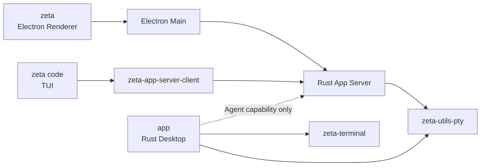

# Zeta 产品线与宿主边界

> 状态：Current product model。本文是三条公开产品线的 canonical 说明。
> Electron Desktop 的内置 Workbench 模式与窗口重载入口见 [`workbench-modes.md`](workbench-modes.md)；
> 具体实现分别见 [`zeta-cli-architecture.md`](zeta-cli-architecture.md)、
> [`zeta-desktop-architecture.md`](zeta-desktop-architecture.md)、[`tui.md`](tui.md) 和
> [`app/TERMINAL.md`](../app/TERMINAL.md)。

## 快速理解

Zeta 不是一个 UI 宿主的三种包装，而是三条产品线共享 Rust 后端契约、各自拥有 UI 宿主。凡是
`Session`、`Thread`、`Turn`、`ThreadItem` Agent 产品能力，都必须经过 App Server；`app`
当前直接组合的路径只属于终端/PTY 宿主，不是 Agent API 的例外。

| 产品线 | 产品形态 | 当前 UI/宿主 | 前后端接线 | 终端实现边界 |
| --- | --- | --- | --- | --- |
| `zeta code` | TUI 产品 | `zeta-code/cli` + `zeta-code/tui` | `zeta-app-server-client` 连接 App Server | TUI 管理自己的 `crossterm`/`ratatui` 宿主终端；不直接拥有子 PTY |
| `zeta` | Electron Desktop | Renderer + Preload + Electron Main | Electron Main 启动并桥接 Rust App Server | 当前 Renderer 用 xterm；Rust/App Server 管理 `zeta-utils-pty` |
| `app` | Zeta Agent 与外部 AI CLI 工作台 | `app/` Rust 窗口与 UI | Zeta 通过 App Server；外部 AI CLI 由 Terminal host 启动 | `zeta-terminal` 负责终端语义，`zeta-utils-pty` 负责 AI CLI 的 PTY/进程 |

产品线与 Electron 的内部 Workbench 模式不是同一个维度。Desktop 在同一个 `zeta` 安装包中提供 `code`、`academic` 两个内置模式；它们不代表 `zeta code` TUI，也不构成额外的公开产品线。用户可以在设置中选择模式，当前 Workbench 窗口在 reload 边界重新装配；开发和测试可以用 `ZETA_WORKBENCH_MODE` 覆盖初始模式。具体说明见 [`workbench-modes.md`](workbench-modes.md)。

## 当前调用关系

`Electron Main` 只属于 `zeta` 产品线。它负责 Electron 生命周期、App Server 子进程监督、
可信 IPC 和 Renderer adapter；它不是三条产品线共享的通用后端层。

`zeta code` 的 TUI 宿主终端和“运行一个子 Shell 的终端能力”必须区分：前者属于 TUI 的
`crossterm`/`ratatui` 事件循环，后者如果产品需要，应通过 App Server 的 typed contract 使用
后端 PTY。TUI 不因为运行在终端里，就自动成为 PTY owner。

## 终端分层

| 层 | 当前 owner | 负责什么 | 不负责什么 |
| --- | --- | --- | --- |
| PTY/进程层 | `zeta-utils-pty` | spawn、读写、resize、signal、exit | ANSI/VT 解析、网格、scrollback 语义 |
| 终端语义层 | `zeta-terminal` | ANSI/VT parser、cell/grid、cursor、mode、scrollback 等 | 创建 Shell 进程、Electron IPC、产品窗口 |
| 产品后端层 | Rust App Server | 连接级 Terminal session、授权、生命周期和 protocol DTO | Renderer DOM 或 TUI 绘制 |
| Electron 桥接层 | `zeta` 的 Electron Main | 进程监督、trusted IPC、Renderer adapter | 复制 Rust 终端状态机 |
| TUI 宿主层 | `zeta code` 的 `zeta-tui` | raw mode、alternate screen、输入事件和 Ratatui frame | 第二套 Agent runtime 或 PTY authority |
| Native 宿主层 | `app` 的 `app/` | 原生窗口、GPU/UI、终端输入输出组合 | Electron Main、Renderer bridge |

因此，`zeta-terminal` 不能被 `zeta-utils-pty` 替代。两者在 `app` 中已经是上下层组合；
在 `zeta` 中是否由 App Server 进一步组合 `zeta-terminal`，取决于是否把终端语义状态从
Renderer 的 xterm 投影迁移为 Rust authoritative state，这属于独立的终端演进，不影响三条
产品线的宿主划分。

## 代码入口对照

| 公开产品线 | 当前代码入口 | 当前状态 |
| --- | --- | --- |
| `zeta code` | `zeta-code/cli` 的 `zeta` binary → `zeta-tui` | TUI 产品路径已存在；TUI 通过 App Server Client 工作 |
| `zeta` | `zeta-ts` Electron client | Electron Desktop 已存在；统一 Renderer 包含 Code 与 Academic，默认模式为最近保存的选择 |
| `app` | `app/` 的 `app` binary | 终端宿主已存在，并直接组合 `zeta-terminal` 与 `zeta-utils-pty`；Agent 能力尚未作为 Native 旁路提供 |

## Canonical `just` 命令

| 命令 | 产品线 | 运行方式 |
| --- | --- | --- |
| `just zeta` | `zeta code` | 从 Rust workspace 启动 TUI，并接收 CLI 参数 |
| `just zeta-desktop` | `zeta` | 启动 Electron Desktop 开发环境 |
| `just app` | `app` | 启动纯 Rust Desktop |

产品线命令是唯一的公开 `just` 命令面；不要重新添加以 `tui` 或 `native` 为名的实现层别名。

修改产品归属、前后端接线或终端 owner 时，先以本文的产品线定义为准，再分别更新对应
宿主文档和实现 README；不要用 `code`、`zeta-tui` 或旧的 Native 迁移标识反推公开
产品线名称。
