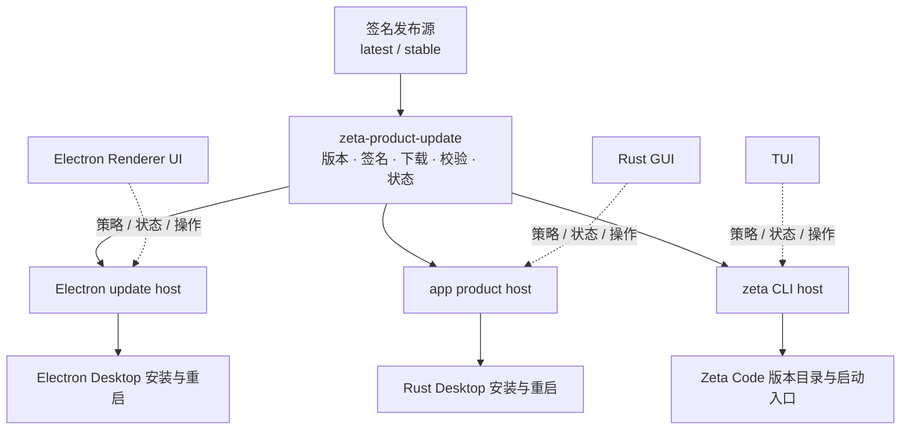

# Zeta 产品更新架构

> 状态：Target architecture 与当前实现差距。本文拥有三个产品的更新责任边界、共享契约、
> 安装交接和演进顺序；产品线定义见 [`product-lines.md`](product-lines.md)，配置系统见
> [`config.md`](config.md)。

## 结论

三个产品不各自维护一套完整更新系统，也不由 App Server 统一替换三个产品。长期结构固定为：

1. 发布系统提供同一种签名描述、版本通道和不可变产物；
2. 共享 Rust 更新领域负责检查、下载、签名与摘要校验、调度和状态；
3. 每个产品宿主负责自己的安装格式、进程退出、版本切换和重启；
4. 每个 UI 只编辑本产品策略，并展示共享领域产生的类型化状态。



这里的共享更新领域是产品发布能力，不是 Session、Thread、Turn 或 Remote 执行能力。它可以作为
Rust library 被产品宿主组合，也可以通过一个本机 update host 提供给 Electron Main；它不进入
Remote App Server，不跟随当前 Workspace 或 Environment 切换。

## 三种错误拆法

| 拆法 | 结论 | 原因 |
| --- | --- | --- |
| 三端各写完整实现 | 不采用 | 签名格式、通道语义、限流、回滚和安全修复会产生三个权威实现 |
| App Server 统一检查、下载并安装 | 不采用 | App Server 可能连接远端或脱离外层产品存活，不拥有 Electron、Rust Desktop 和 CLI 的安装生命周期 |
| 共享检查下载，Renderer 自己安装 | 不采用 | Renderer 不能获得任意文件路径或替换产品文件的权限，Electron 安装必须留在可信宿主 |

## 分层与 owner

| 层 | 唯一 owner | 负责 | 明确不负责 |
| --- | --- | --- | --- |
| 发布控制面 | CI 与 Release 工作流 | 版本、通道晋升、签名、各产品与平台产物 | 用户设置、进程退出、安装目录 |
| 更新领域 | 目标 `zeta-rs/product-update` | 描述解析、签名验证、版本比较、目标选择、有界下载、摘要校验、检查调度、状态与错误 | UI、Electron IPC、窗口、启动入口 |
| Electron update host | 目标 Rust update host + Electron Main adapter | 启动可信更新进程、接收类型化结果、调用 Desktop 安装与退出能力 | 解析发布规则、接受 Renderer 提供的路径 |
| Rust Desktop 宿主 | `app` composition root 与 distribution adapter | 选择 app 安装器、协调窗口退出和重启 | 再实现一套签名与下载协议 |
| Zeta Code 宿主 | `zeta-code/cli` | CLI 包安装、版本目录、启动入口切换、TUI 通知 | 把安装副作用放进 `zeta-tui` |
| 三端 UI | Renderer、Rust GUI、TUI | 策略编辑、进度、成功、失败、重启操作 | 下载、校验、路径选择、文件替换 |

crate 用来隔离共享更新能力和依赖，不代表所有产品必须使用同一个进程。Rust Desktop 与 CLI 可以
直接组合更新领域；Electron Main 不能复制 Rust 规则，应用一个只连接本机可信子进程的窄 adapter。
该 update host 只接收类型化命令并返回类型化事件，Renderer 不接触它的进程句柄、下载路径或密钥。

## 共享领域契约

### 发布描述

签名 payload 至少包含：

| 字段 | 含义 |
| --- | --- |
| schema version | 描述格式版本 |
| product | `zeta-desktop`、`zeta-app` 或 `zeta-code` |
| channel | `latest` 或 `stable` |
| version | 语义版本 |
| release identity | 不可变发布身份，防止指针换包 |
| target | 操作系统、CPU 和 ABI |
| package format | 该产品宿主支持的安装格式 |
| size | 下载与磁盘预算 |
| SHA-256 | 完整产物摘要 |

外层 envelope 只包含原始 payload 和签名。签名工具、发布工作流和运行时验证必须消费同一组 Rust
类型与 canonical encoding，不能分别维护结构相似的 DTO。`stable` 是签名指针，只能由显式晋升
工作流更新；它不是按发布时间猜出的“较旧版本”。

### 更新状态机

共享状态机固定为：

```text
Idle
  → Checking
  → Current | Available
  → Downloading
  → Verified
  → ReadyToInstall
  → Installing
  → RestartRequired | Completed

任一步骤 → Failed
```

每次状态变化携带 product、channel、当前版本、目标版本、attempt identity 和时间。新的 attempt
使旧下载与旧完成事件失效；取消必须停止下载或安装准备，不能只让 UI 丢弃 Promise。自动检查失败
保留最后一次成功状态，同时单独记录本次失败证据。

### 安全不变量

- 私钥只存在于发布 secret store；构建、包内容、命令参数和日志不能包含私钥。
- 安装包只携带公钥；公钥轮换必须由旧钥匙签名的版本完成信任交接。
- 先验证签名，再相信版本、URL、文件名、大小和摘要。
- 下载使用大小上限和临时文件；完整验证前不能进入可执行版本目录。
- UI 只能传 product action 或 opaque identity，不能传任意路径、URL、公钥或摘要。
- `stable` 与 `latest` 分别保存检查时间，切换通道不能复用另一个通道的缓存。
- 自动更新和手动更新都拒绝降级；回滚是显式选择已验证历史版本的独立操作。
- 发布产物不可覆盖；只有 `stable` 指针允许在通过签名验证的晋升操作中更新。

### 系统签名、公证与更新签名

这三件事解决的是不同问题，不能互相代替：

| 检查 | 用户机器相信什么 | 实现位置 |
| --- | --- | --- |
| macOS / Windows 系统签名 | “这个可执行文件确实由 Zeta 发布，且签名证书有效” | `build/release/system_signing.py` |
| macOS 公证 | “Apple 已扫描并接受这个最终发布包” | `build/release/notarize_release.py` |
| Ed25519 更新描述签名 | “更新器拿到的版本、通道、下载地址和 SHA-256 没被替换” | `zeta-product-update` 与 `zeta-update-sign` |

发布顺序固定为：构建可执行文件 → 组包 → 系统签名并验证所有可执行文件 → 重算包内摘要与
`buildId` → 生成最终安装包或压缩包 → macOS 公证或 Windows 安装包签名 → 为最终产物生成
Ed25519 更新描述 → 发布。签过名后再改一个字节，后面的摘要和签名都必须重做。

macOS 使用 Developer ID Application 证书、Hardened Runtime 和安全时间戳。最终的 `.app`、
`.pkg` 或 `.dmg` 必须提交公证；Zeta Code 的 `.zip` 提交公证但无法附加离线票据，Desktop 的
`.pkg` / `.dmg` 在公证后还必须运行 `stapler staple` 和 `stapler validate`。Windows 使用代码签名
证书、SHA-256 文件摘要和 RFC 3161 时间戳。GitHub Release 使用 Azure Artifact Signing 与 OIDC，
Windows 代码签名私钥不进入 GitHub secret，也不落到 runner 文件系统；本地或自管 runner 仍可让
`system_signing.py` 按证书指纹使用已经安装在用户证书库中的证书。

三个产品共用下列发布凭据，产品代码和安装包都不能读取它们：

| GitHub 配置 | 类型 | 用途 |
| --- | --- | --- |
| `ZETA_MACOS_SIGNING_IDENTITY` | repository variable | Developer ID 证书名称 |
| `ZETA_MACOS_CERTIFICATE_P12` | secret | base64 编码的 Developer ID 证书与私钥 |
| `ZETA_MACOS_CERTIFICATE_PASSWORD` | secret | P12 密码 |
| `ZETA_MACOS_NOTARY_KEY_P8` | secret | base64 编码的 App Store Connect API key |
| `ZETA_MACOS_NOTARY_KEY_ID` | secret | API key ID |
| `ZETA_MACOS_NOTARY_ISSUER` | secret | API issuer ID |
| `ZETA_AZURE_CLIENT_ID` | repository variable | 与 GitHub OIDC 绑定的 Entra 应用 ID |
| `ZETA_AZURE_TENANT_ID` | repository variable | Entra tenant ID |
| `ZETA_AZURE_SUBSCRIPTION_ID` | repository variable | Artifact Signing 所在订阅 |
| `ZETA_WINDOWS_SIGNING_ENDPOINT` | repository variable | Artifact Signing 区域 endpoint |
| `ZETA_WINDOWS_SIGNING_ACCOUNT` | repository variable | Artifact Signing account 名称 |
| `ZETA_WINDOWS_CERTIFICATE_PROFILE` | repository variable | 发布证书 profile 名称 |
| `ZETA_WINDOWS_SIGNING_THUMBPRINT` | 本地/自管 runner 环境变量 | 已安装证书的指纹；GitHub Release 不使用 |
| `ZETA_WINDOWS_TIMESTAMP_URL` | 本地/自管 runner 环境变量，可省略 | RFC 3161 服务；省略时使用 DigiCert |
| `ZETA_UPDATE_PUBLIC_KEY` | repository variable | 随产品分发的 Ed25519 公钥 |
| `ZETA_UPDATE_SIGNING_KEY` | secret | 只在发布工作流使用的 Ed25519 私钥种子 |

没有这些凭据时，Release 工作流应直接失败，而不是上传一个看似成功但系统不信任的包。证书到期后，
带可信时间戳的旧版本仍可验证；新版本必须换用续期后的证书。Ed25519 密钥与系统证书分别轮换，不能
把 P12/PFX 私钥当成更新描述私钥。

## 三端安装边界

### Electron Desktop

Renderer 中的领域 service 只暴露策略、状态、检查、安装和重启意图。Electron Main 启动本机 update
host，并通过私有 typed channel 接收已经验证的产物身份；Main 只把该身份交给 Electron Desktop
安装 adapter，并协调窗口关闭与重启。

禁止以下调用链：

```text
Renderer → arbitrary URL/path → Electron Main → open/replace
```

允许的调用链是：

```text
Renderer action
  → typed Main IPC
  → local update host command
  → verified update identity
  → Main-owned Desktop installer
  → typed progress/result
  → Renderer presentation
```

Main 不解析签名描述，不保存更新业务状态；update host 不拥有 BrowserWindow、Workbench reload 或
Electron 生命周期。

### Rust Desktop

`app` 直接组合共享更新领域，通过 product-specific installer 把 `ReadyToInstall` 转换成系统安装或
版本切换。`zui` 可以保留 `UpdateHandle` 这类 UI 可调用 facade，但签名解析、HTTP 下载和摘要校验
应从 `app/zui/src/services/update.rs` 迁出，避免 UI 基础设施成为发布规则 owner。

Rust GUI 负责展示下载进度、错误和重启操作；app composition root 负责生命周期。窗口组件不直接
持有 staging 路径或安装器。

### Zeta Code

CLI host 直接组合共享更新领域。`zeta-tui` 的 Config 只保存并展示一个三态策略：

```toml
[tui]
autoUpdate = "latest" # latest | stable | never
```

CLI 使用版本目录和稳定启动入口切换完整包；当前进程继续使用启动时的版本，新版本在下次启动生效。
更新成功与失败通过类型化 notice 进入 TUI 已有提示区域，不能向备用屏幕直接写 stderr。

`never` 只关闭自动检查，不禁止用户显式执行手动更新。手动更新仍执行完整签名与摘要校验。

## 设置与状态

三个产品共享 `UpdatePolicy` 的语义和值，但不共享一份可写用户配置：

| 产品 | 用户设置位置 | 作用域 |
| --- | --- | --- |
| Electron Desktop | 注册到 profile `settings.json` | 本机 Electron UI profile |
| Rust Desktop | profile `config.toml` 的 `[gui]` | 本机 Rust GUI profile |
| Zeta Code | profile `config.toml` 的 `[tui]` | 本机 CLI/TUI profile |

连接 Remote workspace 不改变本机更新策略。组织将来可以提供只读的强制策略层，但不能让三个 UI
相互改写设置。发布 URL、公钥、产品身份和平台目标属于可信包配置，不属于用户设置。

检查时间、下载进度、失败原因、已准备版本和重启要求是可重建运行状态，保存在对应产品安装根或
状态存储中，不写回 `settings.json`、`[gui]` 或 `[tui]`。

## App Server 与 Remote 边界

产品更新不是 Agent 业务 API，不加入普通 Session/Thread App Server connection。原因是：

- Electron、Rust Desktop 和 CLI 更新的是本机外层产品，不是当前 Environment；
- TUI 连接 Remote App Server 时仍应更新本机 CLI，不能更新远端 `zeta-server`；
- app-server daemon 的存活时间可能长于窗口，不能自行决定关闭和替换产品；
- Renderer connection、Remote connection 和产品安装身份不是同一个生命周期。

Remote runtime 的下载、兼容握手、安装与回滚继续由 `zeta-remote-connections` 拥有。它可以复用签名
描述与摘要验证 primitive，但不与本机产品更新共享 selected version、检查时间或安装目录。

## 当前状态

| 能力 | 当前实现 | 目标状态 |
| --- | --- | --- |
| Zeta Code 策略 UI | `Latest / Stable / Never` 已在 TUI 实现 | 保留 UI，类型迁到共享领域后由 adapter 映射 |
| Zeta Code 更新 | CLI 已改用共享策略与签名验证；调度、下载、诊断和安装仍在 `zeta-code/cli/src/update.rs` | 保留 CLI 安装 adapter，继续迁出通用调度、下载和诊断 |
| Rust Desktop 更新 | `app/zui/src/services/update.rs` 已改用共享签名描述；HTTP staging 与安装 facade 仍在 `zui` | 继续迁出通用下载，`zui` 只保留 facade |
| Electron Desktop 更新 | 尚无完整产品更新调用链 | 增加 update host、Main adapter、Renderer service 与 UI |
| 系统签名 | App 与 Zeta Code 已共用 `build/release/system_signing.py`；Zeta Code macOS/Windows 发布会签完并验证每个可执行文件，macOS 压缩包还会公证 | Electron 打包和三端最终安装器接入同一入口；Desktop `.pkg` / `.dmg` 公证后附加票据，Windows 安装器再次签名 |
| 更新描述签名 | `zeta-code/update-sign` 已直接消费共享发布描述与 canonical encoding | 保留密钥输入和 release artifact adapter |
| 发布工作流 | Zeta Code 已有系统签名、macOS 公证、最新版本描述签名和稳定版本晋升工作流 | 扩展为按 product/target 发布 Electron 与 Rust Desktop 产物 |
| 共享更新 crate | `zeta-rs/product-update` 已拥有策略、product/target/package 描述、签名与验证 | 继续迁入通用下载、调度、状态与错误 |

“已有代码”不代表共享架构已经完成。当前 Zeta Code 和 `zui` 仍各自拥有下载与调度代码，这些逻辑
需要继续迁到共享领域，不能被 Electron 复制为第三套实现。

## 演进顺序

1. 已固定共享发布描述、签名 envelope、`UpdatePolicy`、product/target/package identity 和测试
   fixture；签名工具、Zeta Code 与 `zui` 已消费同一契约。
2. 继续向 `zeta-rs/product-update` 迁入通用下载、摘要、调度和诊断；保持 Zeta Code 与 Rust
   Desktop 的用户行为不变。
3. 把 `zeta-code/cli` 收缩为版本目录、启动入口和 TUI notice adapter，删除本地重复逻辑。
4. 把 `app/zui` 的签名和下载实现替换为共享领域；在 `app` composition root 接入安装生命周期。
5. 为 Electron Desktop 增加本机 update host、Main typed adapter、Renderer service 和 UI；验证
   Renderer 无路径权限且 Remote workspace 不改变更新目标。
6. 三端全部接入后删除旧 DTO、解析器、检查缓存和签名测试副本，只保留共享 conformance fixture
   与每端安装/呈现测试。

## 验证要求

### 共享领域

- 正确签名、错误签名、错误公钥、错误 product/channel/target 和重放旧版本；
- 下载大小、摘要、文件名、路径逃逸、截断和取消；
- `latest`、显式晋升的 `stable`、`never`、独立检查缓存和不降级；
- 并发检查、进程中断、staging 恢复、状态持久化和公钥轮换。

### 产品宿主

- Electron：Renderer 无路径权限、Main/update host 关闭顺序、安装器失败、窗口退出与重启；
- Rust Desktop：真实 product composition、安装交接、重启和失败恢复；
- Zeta Code：真实 PTY 配置持久化、当前会话不中断、下次启动选中新版本；
- Remote：连接远端时只更新本机产品，Remote runtime 继续走独立兼容与安装流程。

### 发布系统

- 六个平台目标完整、版本与 tag 一致、产物不可覆盖；
- macOS 可执行文件通过 `codesign --verify --strict`，最终产物通过公证；可附加票据的 Desktop
  产物还必须通过 `stapler validate`；
- Windows 每个 Zeta 可执行文件和最终安装器通过 `signtool verify /pa /all /v`，且签名包含
  SHA-256 RFC 3161 时间戳；
- 私钥缺失或公私钥不匹配时停止发布；
- 签名 payload 与运行时 decoder 使用同一 schema fixture；
- `stable` 只能由显式晋升工作流改变，并且不能成为 GitHub Latest release。
