# 远程开发

> 状态：Desktop 与 `zeterm` 都已有 SSH 单文件夹基础路径；远端已有按 Workspace 复用的 durable
> Remote Server broker；`zeta code` CLI 已可通过命名连接或直接 target 打开 SSH TUI，并在 managed
> runtime 缺失或 schema 不兼容时从产品绑定或显式认证 catalog 自动准备 runtime；`zeta code` SSH
> TUI 与 `zeterm` Agent 都已有 30 秒有界重连，`zeterm` 与 Desktop Remote Terminal
> 都已有短租约恢复；Rust
> host layer 已有平台/runtime/compatibility probe、认证本地/网络 catalog、内容寻址下载缓存、不可变完整包安装和 loopback
> Tunnel primitive；zeterm 发布包可把 catalog URL 与摘要绑定进签名 binary，Desktop 可从签名应用包
> metadata 读取本地 catalog 或网络 URL + 摘要，两者都能下载、验证并自动安装缺失或协议不兼容的 runtime；共享安装器还提供有界
> JSON Lines 进度；zeterm 和 Desktop Main 都会按 host/Workspace 持久化已验证的 active/previous runtime；
> zeterm 已有无凭据命名连接 CLI、Native 连接选择器与图形管理面板；从现有 Native 窗口发起连接时，
> 面板会展示有界的 runtime 准备进度，并支持启动前取消、失败保留与重试；zeterm 也已有显式安全回滚，
> 前台 loopback Tunnel CLI 和 Remote 窗口内的 Native Tunnel 管理面板；zeterm Native Host 与 Desktop Main Tunnel coordinator 都会在 SSH 短暂断开后于 30 秒窗口内复用同一本机端口恢复；Desktop Browser 与 Browser Automation 已把 Remote 窗口中的 loopback 顶层导航自动映射到窗口级 Tunnel；zeterm 已把编辑器语言请求投影到 Remote App Server；Desktop Main 已接入缺失/协议不兼容 runtime 安装协调、可信回滚重连与 Tunnel
> coordinator，并在自动 crash retry 耗尽后提供 Main-owned 手动重连。Desktop 也已通过共享 catalog
> 的本机 `zeta remote connections` 边界提供命令面板
> 连接选择和图形管理；Main 负责校验新增、原子编辑/改名和删除请求，并在连接时按名称重新读取权威
> host/Workspace，再为目标创建独立 Workbench 窗口及 supervisor。需要安装或替换 runtime 时，Desktop 会在
> Workbench 打开前显示 Main-owned 准备窗口，投影校验、平台探测、上传和提交进度，并允许取消本次
> Remote 启动。正式生产发布 feed/publisher 自动化、缓存 GC、远程多根 Workspace 和跨重启 Terminal 持久化尚未实现。
> 本文是 Desktop Remote 开发行为、进程边界和演进状态的 canonical 系统文档。

开发态在同一路径重新编译 `zeta` 时，Remote Server broker identity 会包含新的 Unix executable
generation；新连接不会误复用仍在 idle window 内运行的旧 daemon。旧 daemon 只继续服务已经绑定的
连接，并在空闲超时后退出。

## 快速理解

Zeta Desktop 通过 OpenSSH 在目标主机启动同一套 App Server，并继续使用已有的 Files、Git、
Terminal、Search、Code Index 和语言协议。前端不会为每个领域复制一套 Remote provider，SSH
凭证也不会进入 Renderer。

| 用户场景 | 当前行为 | 用户需要做什么 |
| --- | --- | --- |
| 打开 SSH Remote 文件夹 | Desktop 可用 `Remote: Manage Saved SSH Hosts` 新增、编辑/改名或删除共享命名连接，再从 `Remote: Connect to Saved SSH Host` 选择；连接时 Renderer 只提交名称，Main 精确复核记录并新建绑定该 SSH Workspace 的 Workbench 窗口。每个窗口拥有独立 supervisor、Browser Automation、Remote context 和 Tunnel。启动后优先读取 host/Workspace 上次验证的精确 runtime；缺失或 schema 不兼容时，从签名产品包绑定的本地或网络 catalog 选择、下载、安装、重新握手并持久激活 | 在命令面板管理 OpenSSH host alias 和绝对远端路径；也可再次启动 Desktop 并传入目标参数。准备窗口可取消下载/安装，不影响其他窗口 |
| 用 `zeta code` 打开 SSH TUI | CLI host 从共享命名 catalog 或直接 host/Workspace 构造 target，优先使用显式 runtime、已验证 active runtime 或远端 `zeta`；managed runtime 缺失或 schema 不兼容时，从签名产品 metadata 绑定或显式 catalog+摘要选择、下载/校验、安装并重试一次。完成 executable probe 和 initialize/schema handshake 后才持久激活精确路径，并把已连接的 App Server session 交给原有 TUI | `zeta remote connect --name work`，或传 `--host`/`--workspace`；开发态可传本地 catalog+SHA-256；诊断可追加 `--check` 只验证完整链路而不打开 TUI |
| 用 `zeterm` 打开 SSH Workspace | Native host 可在图形管理面板新增、编辑、删除无凭据 target；从现有窗口连接时，面板监督新进程并展示检查、下载、校验、平台探测、上传、提交和失败状态。新进程仍独立读取已验证 runtime，完成 availability + initialize/schema preflight，并在需要时物化、安装和激活新一代 | 点击底部 `Local/Remote` 打开 Native picker；等待期间关闭面板可取消，失败后可直接重试；也可使用 `zeterm remote save/connect` 或直接传 `--remote/--workspace`；需要回退时追加 `--rollback-runtime` |
| 浏览、编辑、语言功能、搜索和运行终端 | 请求由远端 App Server 在受限 Workspace root 内执行；`zeterm` 的诊断、Hover、Completion 和位置跳转使用独立 language connection，远端路径不会交给本机 LSP | 无需配置领域专属 Remote provider |
| App Server 断线 | `zeta code` CLI host 和 `zeterm` Agent 都在 30 秒窗口内按 250ms 到 2s 的退避重连并重读 durable Session/Thread snapshot。zeta code TUI 先交还纯 durable identity，丢弃本代 pending request 与 queued action，再由 CLI 重建 SSH；zeterm 断线期命令明确失败而不延迟回放，旧 generation 的语言请求立即失效，重连后重新同步打开的文档。`zeterm` 与 Desktop Remote Terminal 都在 30 秒 bearer lease 内重新连接同一 broker 并 attach 原 PTY；Desktop Main 保管 token，Renderer 只在首次续读成功后显示已恢复。Desktop 自动重试耗尽后可在原窗口发起受信 stop/start | 短暂断线无需操作；Desktop 显示 Disconnected 后可执行 `Remote: Reconnect to SSH Host`。超过 Terminal lease 或远端主机/daemon 重启后需 Relaunch 终端 |
| 回退 Desktop Remote runtime | 命令面板的 `Remote: Roll Back Remote Runtime` 请求 Main 验证 previous runtime；验证成功并原子切换 profile 后，Main 立即关闭或放弃旧 broker lease，再替换 Remote backend，不会把必然失败的 attach 重试到 30 秒超时。Renderer 将这些终端标成可 Relaunch 的 error | 确认回滚；验证失败时现有连接和终端保持不变，成功后按需 Relaunch 原终端实例 |
| 从 Remote 窗口打开本地文件夹 | 当前 Remote 窗口保持原 Workspace，Main 为本地文件夹打开独立窗口；目标已打开时聚焦已有窗口 | 使用普通 Open Folder 动作，无需重启产品 |
| 在 Desktop Remote Browser 打开远端本机服务 | Browser 与 App Server Browser Automation 仍接收 `http(s)://localhost/127.0.0.1/[::1]:port`；Electron Main 自动为该远端端口建立 Tunnel，只把分配后的本机 URL 交给 WebContents，并继续向 Renderer/Agent 报告用户请求的原 URL | 照常输入远端服务的 loopback URL；同一 Browser target 的同源导航和历史记录复用 lease，关闭 target 后自动关闭其 Tunnel |
| 端口转发 | Electron Main 与 zeterm Native Host 都提供窗口级 loopback-only Tunnel lifecycle；只有本机 listener 稳定可连接且 SSH child 仍存活才发布 Open/Forwarding，运行中 SSH 断开会在 30 秒内以相同本机端口有界恢复。Desktop 的 Ports 面板直接投影 Main-owned Tunnel catalog，可新增、Stop、Stop All 并显示 Open/Recovering/Failed；Remote zeterm 窗口可从 location picker 或可绑定命令 `workbench.action.manageRemoteTunnels` 打开管理面板；`zeterm remote tunnel <name> --remote-port <port>` 仍提供前台 CLI | 图形入口可关闭面板而保留 Tunnel，再次打开可查看或 Stop；首次启动失败立即报告，CLI 需保持前台运行。readiness 只证明本地 forward，不证明远端应用协议已 ready；Debug stdio adapter 已直接在 Remote App Server 执行而不需要 Tunnel，socket/server adapter 与统一 Remote Explorer 连接树仍未接入 |
| 远程多根 Workspace | 尚未完成 | 等待后续独立能力 |

启动参数使用 OpenSSH 配置中的 host 名称，而不是包含密码或私钥的连接串：

```text
--remote-ssh work-server --folder /home/zeta/project
```

Desktop 与其他本机产品共享的 catalog CLI 是：

```text
zeta remote connections save --name work --host work-server --workspace /home/zeta/project
zeta remote connections list
zeta remote connections get --name work
zeta remote connections update --name work --new-name production --host production-server --workspace /srv/project
zeta remote connections remove --name work
zeta remote connect --name work
zeta remote connect --host work-server --workspace /home/zeta/project
# 无 TTY 的本地/CI 链路验证
zeta remote connect --name work --check
# 未打包开发构建显式提供认证 catalog
zeta remote connect --name work --runtime-catalog /absolute/catalog.json --runtime-catalog-sha256 <digest> --check
```

Desktop 命令面板的 `Remote: Manage Saved SSH Hosts` 使用同一组 CLI 操作新增、原子编辑/改名和删除，
`Remote: Connect to Saved SSH Host` 负责连接选择。当前 App Server supervisor 和
Trusted IPC routes 在窗口创建时绑定到一个固定 launcher，因此 Desktop 不会把本地 `workspace/switch`
冒充 authority 切换；确认连接后由同一 Main 进程创建新的窗口级启动门禁、supervisor 和 SSH launcher。
同一 Workspace 的并发打开请求会合并，已存在的目标窗口会被聚焦。

`zeta remote connect` 是 `zeta code` 自己的产品入口，不是 Desktop adapter。CLI host 保留 SSH
credential/process ownership；`zeta-tui` 只消费已经完成 schema gate 的 `AppServerSession`。`--name`
读取与 Desktop、zeterm 共用的无凭据 target catalog，不能再覆盖保存的 host/Workspace。没有显式
`--runtime` 时依次使用该 target 已验证的 active runtime 或远端 `zeta`；握手成功才把 probe 返回的
canonical executable 激活到 profile store。若失败分类是 runtime 缺失或 schema 不兼容，CLI 才读取
运行中产品包 `zeta-package.json` 的 `signedProductPackage` catalog binding，或消费命令行显式提供的
本地/HTTPS catalog+SHA-256；在本机认证 artifact、SSH 安装后重新 probe/握手一次。显式
`--runtime`、SSH transport failure 和 server rejection 都不会触发替换。`--check` 执行完全相同的
准备、broker connect、握手和 clean shutdown，但不要求 stdin/stdout 是 TTY，便于开发态和 CI 验证。

`zeterm` 的对应入口是：

```text
zeterm --remote work-server --workspace /home/zeta/project
# 或
zeterm remote save work --host work-server --workspace /home/zeta/project
zeterm remote connect work
```

默认远端 runtime 是 `zeta`，也就是 `zeta code` CLI 的可执行入口；如安装路径不同，可以追加
`--runtime /opt/zeta/bin/zeta`。`--ssh` 只选择本机 OpenSSH 可执行文件。两条参数都由 Native
host 解析，不能由 Renderer 提供凭据或私钥。

如远端 `zeta` 不在默认 `PATH`，主进程可以通过 `ZETA_REMOTE_ZETA_PATH` 指定远端可执行文件；
`ZETA_SSH_PATH` 可以选择本机 SSH 可执行文件。两者都只由主进程读取。

```mermaid
flowchart LR
    CLI["Desktop launch arguments"] --> WINDOWS["Workbench window registry"]
    MANAGER["Remote saved-host manager"] --> MUTATE["Main: zeta remote connections save/update/remove"]
    MUTATE --> TARGETS["shared Remote connection catalog"]
    TARGETS --> PICKER
    TARGETS --> MAINCAT
    PICKER["Remote saved-host picker"] --> NAME["canonical connection name"]
    NAME --> MAINCAT["Main: zeta remote connections get"]
    MAINCAT --> WINDOWS
    WINDOWS --> WS["Remote Workspace identity"]
    WS --> MAIN["per-window Electron Main context"]
    MAIN --> FETCH["local zeta remote fetch-runtime"]
    FETCH --> CACHE["content-addressed local cache"]
    CACHE --> INSTALL["local zeta remote install"]
    MAIN --> BOOTSTRAP["sandboxed install progress window"]
    INSTALL --> OBJECT["immutable packaged-node runtime"]
    OBJECT --> SSH
    MAIN --> SSH["OpenSSH stdio process(es)"]
    SSH --> BROKER["Remote Server connect proxy"]
    BROKER --> SERVER["per-Workspace App Server daemon"]
    SERVER --> DOMAIN["Files / Git / Terminal / Search / LSP"]
    MAIN --> IPC["Sanitized state + generation IPC"]
    IPC --> SERVICE["IRemoteAgentService"]
    SERVICE --> UI["Remote contribution"]
    MAIN --> TUNNEL["SSH -N loopback Tunnel coordinator"]
    TUNNEL --> LOCAL["127.0.0.1:localPort"]
    BROWSER["Browser / Browser Automation localhost URL"] --> RESOLVER["Remote Browser navigation resolver"]
    RESOLVER --> TUNNEL
    LOCAL --> WEBVIEW["Electron WebContentsView load URL"]
    ZCAT["signed-binary-bound URL + catalog digest"] --> ZETERM["zeterm Native Host"]
    DCAT["signed Desktop package catalog binding"] --> MAIN
    ZETERM --> CACHE
    ZETERM --> OBJECT
    ZETERM --> SSH
    ZETERM --> TUNNEL
    SERVER --> ZTERM["Remote terminal/*"]
    ZCLI["zeta remote connect"] --> SSH
    ZCLI --> CACHE
    ZCLI --> OBJECT
    SSH --> ZTUI["zeta code TUI session"]
```



## 所有权

| 层 | 负责 | 不负责 |
| --- | --- | --- |
| 远端 Remote Server / App Server | 按 profile + Workspace + runtime + product config + schema 复用 daemon；Workspace authority、文件、Git、PTY、搜索、索引、语言服务和扩展运行时；断线 PTY lease 与过期回收 | Desktop/zeterm 状态栏和本机 SSH 凭证 |
| Electron Main / zeterm Native Host | SSH 进程、握手、schema gate，以及各自的连接生命周期；Remote Terminal 的 bearer token、代际 attach、尺寸恢复和有界退避；zeterm 消费 signed-binary-bound catalog URL/摘要，Desktop 消费签名产品包中的本地或网络 binding；两者按自己的窗口/进程模型启动连接 | 编辑器展示状态；不把 SSH 凭据或 Terminal bearer token 放进 Renderer |
| `zeta code` CLI host | `zeta remote connect` 的 target 解析、OpenSSH child、产品包 catalog binding 选择、managed runtime 自动准备、schema gate、profile activation、TUI session composition，以及运行中 transport loss 的 30 秒精确 runtime 重连 | TUI transport ownership、远端凭据存储、替换显式 `--runtime`、回放不确定请求、把 runtime/schema/server rejection 当作可重试 transport |
| Electron Main named-connection adapter | 通过本机 `zeta remote connections list/get/save/update/remove` 消费共享 Rust catalog；管理时严格校验无凭据 name/host/Workspace，连接时只接受 Renderer 选择的规范名称并重新读取记录，再请求窗口 registry 打开或聚焦目标 | SSH 凭据、任意 SSH options、Renderer 直接读写 catalog 文件 |
| Electron Main Remote runtime coordinator | 通过本机 `zeta remote profile` 读取/激活共享 profile；探测远端 target，从签名产品 binding 选择本地 catalog 或调用 `zeta remote fetch-runtime`；只对 runtime 缺失或 typed schema mismatch 安装，消费下载/安装结构化进度、复核精确路径并重新握手；显式回滚先验证 previous，再替换 App Server connection | 发布频道/签名策略、Renderer 文件路径、静默降级 |
| Electron Main 安装准备窗口 | 每个 Remote 窗口启动门禁持有自己的安装 operation、`AbortSignal` 和无凭据状态；独立 sandboxed Renderer 只能读取 host/phase、订阅变化或请求取消。关闭/取消只终止该窗口的本机安装命令，完成后仍等待精确 runtime 复核再打开 Workbench | artifact 路径、SSH option、凭据、安装决策或普通 Workbench IPC |
| Desktop Workbench 窗口 registry | 合并同一 Workspace 的并发打开；为每个不同目标建立独立 Workspace context、supervisor、Browser Automation、IPC 与 Remote context；保存多个窗口的位置并按最近活动顺序聚焦 | 跨窗口共享 supervisor、把 Remote authority 热切换进已有窗口 |
| Electron Main Remote 窗口上下文 | `RemoteWindowMainContext` 将一个窗口的 Agent、命名连接、Tunnel、手动重连、回滚路由和状态事件绑定到同一个 `AppServerSupervisor` 与 Workspace context；重连和回滚共用串行恢复门；Workspace 变化时关闭该窗口的全部 Tunnel，窗口销毁时再释放监听器和 Tunnel coordinator | 创建应用窗口、在多个窗口之间共享 supervisor、保存 SSH 凭据 |
| Electron Main Remote Tunnel coordinator | `ssh -N`、本地/远端 loopback 绑定、同端口有界恢复、Tunnel 句柄和窗口/Workspace 销毁 | 公开监听、反向转发或领域协议 |
| Electron Main Remote Browser adapter | 识别当前窗口是否为 Remote Workspace；把 Browser 的 loopback HTTP/HTTPS 顶层导航映射为 Tunnel load URL；按 requested/loaded origin 反向投影地址、保留历史 lease，并在 target 关闭、Tunnel 失败或 Workspace 变化时停止复用 | Browser DOM、通用导航策略、SSH child、非 loopback 公网 URL 或任意子资源代理 |
| zeterm Native Tunnel host | 从当前 Remote 窗口复用 host 与 OpenSSH executable；后台监督 `ssh -N`、自动本地端口、同端口有界恢复、可访问管理状态、Stop 和窗口级销毁 | Local 窗口任意选择 host、公开监听、反向转发、凭据输入或 Remote Server endpoint discovery |
| `platform/remote` | Remote URI、authority、原生连接元数据和 IPC 契约 | 各领域业务状态 |
| `workbench/services/remote` | 后端状态的只读 Workbench 投影 | 启动 SSH 或决定重连 |
| `workbench/contrib/remote` | 状态栏、saved-host 选择/管理 Quick Pick 和 Remote 恢复协调 | 连接事实源、catalog 文件解析或 SSH 启动 |

## Workspace 与安全边界

Remote 单文件夹使用 `zeta-remote://ssh+<host>/<absolute-path>` 作为资源身份。`host` 只能是没有
凭证的 OpenSSH 配置名称；路径必须是 canonical POSIX 绝对路径。Renderer 只把 Workspace 内资源
转换成 root-relative App Server 请求，远端 App Server 再执行 canonical root confinement。路径按
POSIX 字符原样保留；反斜杠是合法文件名字符，不会被 Desktop 改写成分隔符。

SSH launcher 使用 `BatchMode=yes`，不会在后台窗口等待密码输入。用户、端口、代理跳转、主机密钥
和私钥选择都由 OpenSSH 配置及 ssh-agent 管理。本机进程环境只提供给受信任的 SSH 客户端；发往
远端的显式环境当前只有 `ZETA_WORKSPACE_ROOT`。

## 当前执行流程

1. `WorkspacesMainService` 解析 Desktop 的 `--remote-ssh`/`--folder`。图形管理入口把严格限定为
   name/host/Workspace 的记录交给 Main；Main 校验后调用本机 `zeta remote connections save/update/remove`，
   共享 Rust catalog 继续拥有 lease、完整文档校验和原子写入。连接入口让 Renderer 从 Main
   返回的无凭据记录中选择规范连接名；Main 随后调用本机 `zeta remote connections get --name`，由共享
   Rust `RemoteConnectionCatalog` 在 advisory lease 下重新读取并验证 host/Workspace，然后以精确
   `--remote-ssh`/`--folder` 身份请求窗口 registry 打开新 Workbench；若同一目标正在打开则等待同一
   operation，若已经打开则聚焦已有窗口。`zeterm` Native Host 解析 `--remote`/`--workspace`，或
   直接从 `remote/targets.json` 解析命名连接。远端路径在这里是目标身份，不会被当成本机路径访问。
   `zeta code` 的 `remote connect` 同样从该 catalog 解析 `--name`，或接受互斥的直接
   `--host`/`--workspace`；CLI 而非 TUI 拥有后续 SSH transport。managed runtime 缺失或 schema
   不兼容时，CLI 从产品包 metadata 或显式参数取得认证 catalog，复用共享 downloader/installer
   准备精确 runtime，并只重试一次；任何失败都不会提前改写 active profile。
2. Workspace 被序列化成受校验的 `zeta-remote` URI。
3. `SshAppServerProcessLauncher.validate()` 先通过本机 `zeta remote profile get` 读取该 target 的
   active exact runtime，没有记录时才探测 `zeta`。若缺失，Main 先用本机打包的 `zeta remote probe`
   探测目标，再读取签名应用包 `zeta-package.json` 中唯一的 Remote catalog binding。本地 binding
   直接验证包内 catalog；网络 binding 则调用 `zeta remote fetch-runtime --progress json-lines`，用
   签名包认证的 HTTPS URL + catalog SHA-256 将目标 artifact 原子物化进内容寻址缓存。随后 Main 调用
   `zeta remote install --progress json-lines`；安装器再次探测目标、在本机验证
   完整包，再经 SSH 上传、远端复核并提交摘要目录。Main 对返回的精确路径重新 probe 后才执行
   `<exact-zeta> remote-server connect`。`zeta code` host 会把自身已发现的 packaged product-services
   manifest 显式交给通用 Remote Server；该命令连接或启动同用户、同 profile、同 Workspace、同
   canonical runtime executable、同 schema 的 Remote Server daemon，再把 SSH stdio 代理到 daemon。
   若 initialize 返回 typed schema mismatch，Supervisor 给
   SSH launcher 一次不消耗普通 crash retry budget 的受信安装恢复机会；transport、server identity 和
   其他初始化失败不会触发安装。initialize/schema 成功后，Main 才调用 `zeta remote profile activate`
   原子保存 resolved path。Desktop 只有在进入安装恢复时才创建独立准备窗口；Main 把安装操作与
   canonical host、结构化 phase 和取消信号绑定，下载和上传分别投影字节进度。Renderer 不能提交 URL、host、路径或
   SSH 参数。用户取消或关闭窗口会终止本机 `zeta remote install`，远端脚本收到输入结束后由 trap
   清理 staging/lease；Desktop 不会打开 Workbench。安装报告 complete 后窗口仍保留到 launcher 对
   exact executable 的重新 probe 成功，避免把“上传结束”误报为“runtime 已可用”。zeterm 在
   availability probe 后额外运行短生命周期
   initialize/schema preflight；对 typed runtime-missing 或 `ProtocolIncompatible`，它从
   signed-binary-bound 本地 catalog 或网络 URL + 摘要调用同一 Rust updater/installer，不依赖本机另装
   `zeta` CLI，然后对精确
   路径重新执行两种 probe。握手成功后，zeterm 才把 resolved exact runtime 原子写入本机
   `<local-profile-root>/remote/connections.json`；后续启动优先使用该记录。
4. `AppServerSupervisor` 复用本地启动相同的 initialize、schema hash 和 capability gates。
5. Renderer/Native UI 继续使用原有 App Server API；只有资源 URI 或 Native workspace target 的
   authority 不同。`zeterm` terminal 以 `reconnectable` lifecycle 创建 PTY，并通过
   `terminal/create|attach|read|write|resize|close` 复用远端 PTY；连接关闭时 daemon 保留 PTY 30 秒，
   attach 成功后旋转一次性 token。Desktop Renderer 只能提交 `connectionOwned` intent；Remote 窗口的
   Main terminal service 会把 create 升级为 `reconnectable`，独占 bearer token，并在新的 App Server
   generation ready 后用最后尺寸 attach。Renderer 只收到无凭据的 persistence 分类，保持原 output 与
   command cursor；第一次续读成功前维持 `reconnecting`，连续 transport generation 会取消旧轮询。
   本地 Desktop 和 Vite development terminal 仍是 `connectionOwned`。
   zeterm Agent 的 event stream 或请求若返回 transport loss，则进入独立 30 秒 recovery window；
   每次连接曾完成正常 snapshot/event-loop bootstrap 后发生的新断线都会开启新窗口。等待退避期间
   worker 消费并拒绝命令，不会把用户在 disconnected 状态下的 mutation 延迟到重连后执行。
   `zeta code` TUI 收到 connection closed 后立即结束当前 connection generation，把 Session/Thread
   durable identity 交还 CLI host；当前 generation 的 request task 与 queued action 随 event loop
   一起丢弃。CLI 只对 SSH transport failure 重试同一 verified exact runtime；新连接握手成功后，TUI
   读取该 Session 的 canonical active Thread 和完整最新 snapshot。若原 Thread 已归档，则选择该
   Session 最新 active Thread；runtime 缺失、schema 改变、protocol stream failure 或 server
   rejection 不进入退避。Remote TUI 状态栏显示远端 Workspace，但在 App Server 提供路径候选契约前
   显式关闭本机 `@file` 扫描，避免把启动目录中的本机文件投影到远端会话。
   `zeterm` 的语言文档同步和请求使用独立 App Server connection，避免慢语言请求阻塞 Agent、文件和
   Session 请求；当前它对应独立 SSH stdio，后续连接池可在 transport 层复用底层 SSH。UTF-8 编辑器
   byte position 在发出请求前转换为协议 UTF-16 position，返回的诊断、Hover 和 Completion range
   在 exact revision 上转换回 UTF-8 byte range。断线会清除 in-flight request，连接恢复后重新同步
   全部打开文档。
6. 每次进程连接尝试递增 generation；Remote service 将 sanitized metadata 投影给 contribution。
   Supervisor 自动 crash retry 耗尽并停在 `crashed` 后，命令面板只在 SSH + `disconnected` context
   显示 `Remote: Reconnect to SSH Host`。Renderer 发送无参数 intent；Main 的
   `RemoteConnectionRecoveryCoordinator` 将当前 supervisor 从 `crashed` 规范化到 `stopped` 后重新
   `start`。手动重连不更换 runtime/broker identity，也不放弃 Terminal lease；与 runtime 回滚共用
   exclusive operation gate，连接已 ready 时幂等返回，其他 transition 期间明确拒绝。
7. Desktop Tunnel 请求只经过 Trusted IPC；Main 从当前 Remote Workspace 派生 SSH host，Renderer
   不能提交 host、私钥或监听地址。Remote zeterm 窗口同样从其 `AgentSessionTarget` 派生 host 与本机
   OpenSSH executable；Native manager 只接受远端 TCP port，并自动选择本机 loopback port。UI 关闭
   不会停止 Tunnel，显式 Stop 或产品窗口退出会终止 OpenSSH。已经 Open 的 child 意外退出时，两种 host
   都在 30 秒内按 250ms 到 2s 退避并复用原 local port；首次启动错误仍立即失败。Desktop 通过
   `open/recovering/failed` 状态事件投影生命周期，Close、Workspace 切换或窗口销毁会取消退避和候选
   child。两条产品路径都不把凭据交给 UI。Desktop 的 Browser 导航还经过 Main-owned
   `RemoteBrowserViewNavigationResolver`：只有当前 Workspace 为 SSH Remote 且 URL 是 loopback
   HTTP/HTTPS 时才按远端端口打开 Tunnel；普通 HTTPS、本地 Workspace 和 `about:blank` 保持直接导航。
   `BrowserViewMainService` 保存 requested origin 与实际 loaded origin 的映射，因此 Workbench 和
   Browser Automation 始终看到用户输入的远端 loopback URL，而 WebContents 只连接分配后的本机端口。
   同一个 Browser target 会按 origin 复用可恢复 Tunnel，并为 Back/Forward 保留旧 lease；target
   关闭、创建被取消、Workspace 变化、Tunnel failed/removed 或异步 Browser host binding 退休都会清理
   对应资源。
8. Desktop 回滚命令只向 Main 发送无参数 intent。Main 显示确认框，调用
   `zeta remote profile rollback` 在独立 SSH connection 上验证 previous runtime 的 availability、
   initialize/schema compatibility 和 profile generation；验证失败时不关闭当前连接。条件交换成功后，
   `RemoteConnectionRecoveryCoordinator` 先通知 Main-owned Terminal lease service 关闭并丢弃旧 broker
   generation 的 lease，再串行 stop/start 当前 Supervisor；这些终端不会进入必然失败的有界 attach
   重试，新 connection 首次读取时立即进入带 Relaunch 提示的 error。SSH launcher 只接受 CLI 返回的
   canonical exact runtime。Renderer 收到的回滚结果只有 `rolledBack` 或 `cancelled`，不接触 runtime 路径。

## 运行时安装、升级与回滚

Remote runtime artifact 必须是 canonical layout version 2 的 rootless `tar.gz`，并使用
`javascriptRuntime.kind=packagedNode`。它包含 `bin/zeta`、`zeta-path/rg`、Node、Skills、Extensions、
product services 与平台 sandbox 资源；安装器不会用裸二进制伪装成完整 `zeta code` runtime。

网络发布先要求产品已认证无凭据 HTTPS `catalog.json` URL 和 64 位小写 SHA-256。共享 updater 拒绝
重定向、query/fragment、私网解析和代理环境，将 catalog 限制为 1 MiB、archive 限制为 1 GiB、声明
展开大小限制为 4 GiB；缓存路径由 catalog 摘要寻址，命中也重新检查整个 archive。新文件只有在
长度、摘要、entry、package metadata 和展开大小全部通过后才从同目录临时文件原子发布。

本机随后校验受信发布记录给出的压缩大小、展开大小和 SHA-256，并拒绝非规范路径、重复 entry、链接
或特殊文件。远端只接收 stdin bytes，不联网下载，再次校验压缩大小和 SHA-256，最后从 staging
提交到：

```text
$XDG_DATA_HOME/zeta/remote/runtimes/<target>/<version>/<sha256>/
# 或 $HOME/.local/share/zeta/remote/runtimes/...
```

安装不会修改 `current` symlink。升级应先安装新对象并完成 App Server schema handshake，再由产品
保存新的精确 `RemoteRuntime`。共享 `RemoteConnectionProfileStore` 以 host + Workspace 为 key，使用
advisory lock、完整文档校验和 atomic replace 保存 active 与一代 previous，不含密码、私钥或 SSH
参数。zeterm 和 Desktop 都只在握手成功后激活 resolved exact runtime；zeterm 的
`--rollback-runtime` 会先验证 previous，再通过条件交换避免并发进程回滚错代。自动下载只发生在
runtime 缺失或明确协议不兼容的恢复门禁，不会静默降级。Desktop 的命令面板回滚复用同一验证/条件交换入口，并由 Main 在成功后替换连接；两端旧
immutable object GC 仍未完成。

用户命名连接与 runtime 代际是两个独立资源。共享 `RemoteConnectionCatalog` 在
`<local-profile-root>/remote/targets.json` 只保存规范化名称、OpenSSH host alias 和绝对 Remote
Workspace；`RemoteConnectionProfileStore` 继续在 `remote/connections.json` 按 host + Workspace
保存 active/previous exact runtime。前者表达用户要连哪里，后者表达哪个远端 runtime 已验证可用，
两者都不保存 SSH 凭据。zeterm 当前提供完整的无窗口管理入口：

```text
zeterm remote save <name> --host <ssh-host> --workspace <absolute-remote-path> [--replace]
zeterm remote list
zeterm remote connect <name> [runtime/ssh selection options]
zeterm remote tunnel <name> --remote-port <port> [--local-port <port>] [--ssh <openssh-path>]
zeterm remote remove <name>
```

`zeta code` CLI 同时提供 `zeta remote connections list|get|save|update|remove`，作为 Desktop Main 与共享
Rust catalog 之间的稳定 JSON 边界。Desktop 图形管理器只提交限定字段的无凭据记录；Main 规范化并
委托 CLI。新增 IPC 固定使用 create，Renderer 不能请求 replace；`update` 在一个 catalog lease 内按
原名称定位并原子编辑或改名。连接动作仍只提交选中的
name；Main 在 connect 时再调用 `get`，拒绝已删除、改名、非规范或扩展字段记录。Desktop 不在
Renderer 里复制 Rust 的锁、完整文档校验或 atomic-write 规则。

`remote connect` 只把命名记录还原为 `SshTarget`，之后复用与显式 `--remote/--workspace` 完全相同的
runtime 探测、自动安装、兼容性预检和 Native-owned OpenSSH 链路。目录不允许通过 connect 参数覆盖
保存的 host/Workspace；认证继续由本机 OpenSSH config、agent 和平台能力负责。
zeterm 的底部 location 按钮和可绑定 `PickExecutionLocation` 命令读取同一目录并打开可搜索的 Native
picker。选中项后，Native host 不经过 shell，以 `current_exe remote connect <canonical-name>` 启动
受监督的新进程；当前窗口不切换 authority。picker 只接触规范化连接名及目录中已验证的无凭据展示
字段，SSH、runtime 解析与兼容性决策仍全部发生在新进程的 host 启动路径。父窗口只读取子进程 stdout
上的内部、带前缀 JSON Lines 进度；普通诊断继续写子进程 stderr。收到 `Ready` 后父窗口解除监督并
关闭 manager，新窗口独立运行；在 `Ready` 前关闭 manager 会终止该子进程。
picker 的管理项打开 Native modal manager，可新增、编辑或改名 target，以两步确认删除，并从已保存
记录启动连接。创建拒绝同名覆盖；编辑通过目录的原子 `update(original, entry)` 在单次 advisory
lease 内完成，即使改名也不会暴露半完成状态。存在未保存草稿时，选择其他记录或 New 会被拒绝；
Connect 也要求草稿已经保存。面板不接受密码、私钥、SSH executable、runtime 或任意 SSH options。
若需要安装 runtime，zeterm 在窗口创建前把共享 updater/installer 的 typed progress 投影到 stderr：
目录下载、artifact 下载、本地包校验、远端平台探测、按 10% 分别节流的下载/上传进度、远端原子提交以及
downloaded/cached/installed/reused 结果都可见。通过
现有 Native 窗口启动时，同一 typed progress 还会被压缩成有界内部协议并投影到 manager；失败原因
保留在面板内，解除 launching 锁后允许再次 Connect。直接从 shell 首次启动 `zeterm remote connect`
仍使用 stderr，不会为了显示进度先创建一个本地窗口。两种投影都不改变 installer 生命周期或 SSH
所有权，也不复制安装逻辑。

Desktop 的安装投影位于 Workbench 启动门之前。`RemoteRuntimeInstallProgressMainService` 只允许一个
active operation，并用 operation identity 拒绝已结束任务的迟到进度；bootstrap Renderer 只拥有
`read`、`cancel` 和 change event 三个窄 IPC。取消信号贯穿平台 probe、`zeta remote fetch-runtime`
与 `zeta remote install` 本机
子进程，关闭窗口与点击 Cancel 具有同一语义。进度完成后 Main 先重新探测 CLI 返回的 canonical exact
runtime，成功才关闭准备窗口并继续 App Server initialize；失败则进入已有启动失败恢复，不会先展示
一个未连接的 Workbench。单次启动门最多执行一次协议不兼容安装恢复；用户在失败对话框显式 Retry
会开始新的启动门，因此 transient 安装失败不会永久耗尽当前 launcher 的恢复机会。

`remote tunnel` 从命名连接只读取 OpenSSH host，不使用或覆盖其 Workspace，也不要求远端 App Server
runtime。它通过共享 `SshTunnelOptions` 启动 `ssh -N -T`，固定本地监听与远端目标都是
`127.0.0.1`，并启用 `BatchMode=yes`、`ExitOnForwardFailure=yes` 和连接超时。省略 `--local-port`
时，host 先用临时 loopback listener 选择当前可用端口，立即释放并启动 OpenSSH；并发抢占仍由
OpenSSH 的 forward-failure gate 权威拒绝。CLI 在 12 秒有界窗口内轮询实际 listener，并要求两次
成功 loopback connection 之间保持稳定且 OpenSSH child 仍存活，之后才输出
`forwarding <name> <local-endpoint> <remote-endpoint>`，随后前台监督子进程；SIGINT/SIGTERM、输出
失败或正常作用域退出都会收掉 tunnel。基础 SSH `-L` 不经过 `remote-server`，因为监听器和凭据都
属于本机产品 host；未来非 SSH transport、远端动态服务发现才需要 Remote Server 的逻辑 endpoint
协议。

Remote zeterm 窗口还会在同一个 location picker 中显示 `Manage Remote tunnels…`；同一入口也注册为可绑定命令
`workbench.action.manageRemoteTunnels`。该动作不让用户再选
host，而是复用当前窗口已经验证并正在使用的 SSH transport 输入；因此 Tunnel 与文件、Agent、语言和
Terminal 保持同一个 Remote authority。面板只接受 `1..=65535` 的远端端口，Native worker 自动选择
本机端口，经过同一 listener readiness gate 后才把实际 `127.0.0.1:<local-port>` 标为 Forwarding。关闭
面板只移除 modal presentation，Tunnel 记录和 OpenSSH child 继续由 `RemoteTunnelHost` 持有；再次打开
可查看状态或逐项 Stop。重复远端端口会被拒绝。首次 OpenSSH 启动早退会立即失败；已经 Forwarding 的
child 退出后，supervisor 在 30 秒窗口内按 250ms 到 2s 的退避重新启动，并始终复用第一次发布的本机
端口。面板投影 Recovering/Forwarding 状态，恢复成功后 endpoint 不变；恢复耗尽才移除记录并报告失败。
Stop 和窗口关闭会唤醒恢复退避并收掉 child。以上状态都通过 Native event loop 投影回面板。Local 窗口
没有当前 Remote authority，因此命令会拒绝打开管理器，location picker 也不会展示该动作；关闭整个
Remote 窗口会通过 host owner 的 Drop 路径收掉全部 Tunnel。

运维/开发入口如下，大小和摘要必须来自本机已认证的发布记录：

```text
zeta remote probe --host <ssh-host> [--ssh <openssh-path>]

zeta remote fetch-runtime \
  --catalog-url <https-catalog.json> --catalog-sha256 <digest> \
  --target <target> --cache-root <absolute-local-path> \
  [--progress json-lines]

zeta remote install --host <ssh-host> \
  --archive <zeta-package.tar.gz> --version <version> --target <target> \
  --archive-size <bytes> --unpacked-size <bytes> --sha256 <digest> \
  [--ssh <openssh-path>] [--install-root <absolute-remote-path>] \
  [--progress json-lines]

zeta remote profile get --host <ssh-host> --workspace <absolute-remote-path>
zeta remote profile rollback --host <ssh-host> --workspace <absolute-remote-path> \
  [--ssh <openssh-path>]
```

`profile activate` 是给已完成 compatibility handshake 的受信 host adapter 使用的提交入口；普通运维
回退应使用 `profile rollback`，后者会自行完成 previous runtime 的 availability、schema handshake 与
并发条件交换，不接受未验证路径直接降级。

Desktop 正式发现边界是签名产品包根下 `zeta-package.json` 的 `remoteRuntimeCatalog` binding。它必须
恰好选择本地 `path + sha256` 或网络 `url + sha256`，且 `trustBinding=signedProductPackage`。Main 不从
Renderer 或普通环境读取 URL。两种来源最终都由共享 Rust catalog/installer 严格拒绝未知字段、重复
target、非规范/符号链接路径、大小或 SHA-256 不匹配，并在远端 probe 后只选择精确 target。

开发/发布包可选择离线 bundle：

```text
node desktop/scripts/prepare-dev-package.mjs \
  --remote-runtime-bundle <bundle-directory>
```

也可生成只绑定网络发布目录的轻量产品包；URL 与摘要随后由平台应用签名认证：

```text
node desktop/scripts/prepare-dev-package.mjs \
  --remote-runtime-catalog-url https://releases.example/zeta/<version>/catalog.json \
  --remote-runtime-catalog-sha256 <catalog-digest>
```

Desktop Main 仍可通过一组 all-or-nothing 的受信环境覆盖接入单个 artifact：
`ZETA_REMOTE_RUNTIME_ARCHIVE`、`ZETA_REMOTE_RUNTIME_VERSION`、`ZETA_REMOTE_RUNTIME_TARGET`、
`ZETA_REMOTE_RUNTIME_ARCHIVE_SIZE`、`ZETA_REMOTE_RUNTIME_UNPACKED_SIZE`、
`ZETA_REMOTE_RUNTIME_SHA256`，可选 `ZETA_REMOTE_RUNTIME_INSTALL_ROOT`。这是显式 host override，
不是签名或 updater；SHA-256 只证明内容身份，publisher provenance 仍须由本机发布层认证。

standalone zeterm 的发布路径不使用该 Desktop override。`build_remote_runtime_bundle.py` 把多个
canonical package directory 序列化成确定性 rootless archives 与 `catalog.json`；
`build_zeterm_package.py --remote-runtime-bundle` 将 catalog SHA-256 编译进 zeterm binary，并把 bundle
放到 package 资源中。网络包改用 `--remote-runtime-catalog-url` 与
`--remote-runtime-catalog-sha256`，把 URL 和摘要同时编译进 binary，不需要附带 archive。staging/signing
会检查 binary 中确实存在所选 binding，signature record 再记录 catalog digest。运行时先验证 catalog
摘要，再由 catalog 的 target、版本、压缩/展开大小和 artifact SHA-256 驱动共享 installer。这形成
“平台签名 binary/package → URL + catalog digest → artifact digest → Remote 二次校验”的完整信任链。

## 当前限制

- 只支持一个 Remote 文件夹，不支持 Remote `.zeta-workspace` 多根配置。
- 只支持 OpenSSH config host，不接受 `user:password@host` 或 Renderer 提供的私钥。
- 常规远端 runtime 是 `zeta code` 的完整 packaged-node 包，不是另造一个名为 `zeta` 的 Remote
  产品；`zeta-remote-server` 仍只是可选的窄 headless runtime。
- Host layer 已区分“缺失 runtime”“协议不兼容”和 SSH transport，并已实现 compatibility preflight、
  本地/网络认证 catalog、内容寻址缓存与不可变安装；zeterm 与 Desktop 都已消费缺失/不兼容自动安装和
  credential-free active/previous profile；Desktop 已提供 Main-owned 显式回滚与重连。正式生产
  publisher/feed、企业代理配置、下载重试/断点续传和旧缓存/runtime GC 仍未完成。
- 当前 SSH shell、Workspace identity 和 installer 都是 POSIX contract。Linux 是主要远端目标，
  macOS 已支持 package target；Windows OpenSSH Remote 需要独立 PowerShell/path/installer 策略，
  当前不会被静默当成 Linux。
- `zeta remote connect` 已能从认证 catalog 自动准备 managed runtime。正式打包产品可从
  `zeta-package.json` 取得签名产品 binding；未打包开发构建没有隐式发布信任根，必须显式传入本地或
  HTTPS catalog 及 SHA-256。CLI 当前只输出粗粒度准备阶段，没有 Desktop/zeterm 的图形进度、取消和
  失败重试面板；终止前台进程仍会关闭本机 SSH stdin，并由远端 installer trap 清理 staging。
- 当前窗口不能热切换 Remote 与本地 launcher。Desktop saved-host、第二实例目标和 Remote 窗口中的
  Open Folder 会创建或聚焦独立 Workbench；每个窗口都有自己的 supervisor、Browser Automation、
  Remote Agent/Connections/Tunnel/回滚上下文和 Sessions 窗口。当前尚未提供显式 New Window 命令，
  也不会把一个已有窗口从本地 authority 热切换成 Remote authority。
- `zeterm` 当前已消费 Remote 诊断、Hover、Completion、Declaration/Definition/Implementation/
  Type Definition/References；其他语言协议能力仍按产品 UI 的实际消费者逐项接入。
- `zeta code` SSH TUI 与 `zeterm` Agent 断线后都会在 30 秒窗口内重连并重新读取 durable
  Session/Thread snapshot。zeta code 当前重开 TUI connection generation，因此会恢复服务端持久化
  transcript/turn 状态，但不会恢复尚未发送的 composer draft、临时选择面板或本机滚动位置；这些本机
  UI 状态后续需要独立 retained handoff。`zeterm` 与
  Desktop Remote Terminal 可在 30 秒 lease 内恢复同一 broker 中的 PTY。该 lease 只覆盖短暂 transport
  中断，不覆盖远端主机重启、daemon 崩溃、runtime/broker generation 替换、跨设备漫游或长期离线；
  这些场景仍需要持久 session identity 与恢复协议。
- Rust host layer、Desktop Main 与 zeterm Native host 都已提供 loopback-only Tunnel lifecycle；首次
  启动和恢复都必须先观察到稳定的本机 listener，两个产品 host 才会发布 Open/Forwarding，并会在运行中
  SSH 断开后以同一本机端口做 30 秒有界恢复。zeterm 还保留前台命名连接 Tunnel
  CLI。Desktop Browser 与 Browser Automation 已自动消费 loopback Tunnel；当前只重写顶层导航和
  同源相对流量，不代理页面中硬编码到原远端 loopback 端口的绝对 fetch/WebSocket/subresource，HTTPS
  仍遵循 Chromium 的正常证书校验。Desktop stdio Debug 已通过 Remote App Server 启动 adapter，
  `${workspaceFolder}`、断点、调用栈源码和 `runInTerminal` 都保留远端语义，不需要 Tunnel；Debug
  socket/server adapter、zeterm Browser consumer 和统一 Remote Explorer 连接树尚未完成。Desktop 已有
  saved-host 选择器和新增、原子编辑/改名、删除管理器、Ports 面板，以及 Workbench 前的可取消安装准备窗口。zeterm 已为从现有 Native
  窗口发起的连接提供图形准备进度、启动前取消和失败重试；直接从 shell 首次启动仍只有 CLI 进度。
  Desktop 已可在自动重试耗尽后从原窗口手动重连，但远端主机/daemon 重启后的 Terminal/session
  重建引导仍未完成。

## 实现证据

- Remote URI 与 authority：`desktop/src/zeta/platform/remote/common/remote.ts`
- SSH launcher：`desktop/src/zeta/platform/remote/electron-main/sshAppServerProcessLauncher.ts`
- Desktop Remote Terminal lease owner：
  `desktop/src/zeta/platform/terminal/electron-main/reconnectableTerminalMainService.ts`
- Desktop Terminal 恢复投影：
  `desktop/src/zeta/workbench/services/terminal/browser/terminalService.ts`
- Desktop runtime probe：`desktop/src/zeta/platform/remote/electron-main/sshAppServerProcessLauncher.ts`
- Desktop install adapter：`desktop/src/zeta/platform/remote/electron-main/zetaCliRemoteRuntimeInstaller.ts`
- Desktop signed catalog binding/fetch/provisioner：`desktop/src/zeta/platform/remote/electron-main/packagedRemoteRuntimeCatalog.ts`、
  `desktop/src/zeta/platform/remote/electron-main/zetaCliRemoteRuntimeFetcher.ts`、
  `desktop/src/zeta/platform/remote/electron-main/zetaCliRemoteRuntimeProvisioner.ts`
- Desktop 安装进度状态、窄 IPC 与取消：
  `desktop/src/zeta/platform/remote/electron-main/remoteRuntimeInstallProgressMainService.ts`、
  `desktop/src/zeta/platform/remote/electron-main/remoteRuntimeInstallProgressIpc.ts`、
  `desktop/src/zeta/platform/remote/electron-main/zetaCliRemoteCommand.ts`
- Desktop Workbench 前安装窗口：
  `desktop/src/zeta/code/electron-browser/remote-runtime-install/remoteRuntimeInstall.ts`、
  `desktop/src/zeta/platform/remote/electron-main/electronRemoteRuntimeInstallWindow.ts`
- Desktop Remote 启动门禁与窗口上下文：
  `desktop/src/zeta/platform/remote/electron-main/remoteRuntimeBootstrapMainService.ts`、
  `desktop/src/zeta/platform/remote/electron-main/remoteWindowMainContext.ts`、
  `desktop/src/zeta/platform/remote/electron-main/electronRemoteWindowMainHost.ts`
- Desktop profile adapter：`desktop/src/zeta/platform/remote/electron-main/zetaCliRemoteConnectionProfiles.ts`
- Desktop named-connection adapter/IPC 与多窗口打开：
  `desktop/src/zeta/platform/remote/electron-main/zetaCliRemoteConnections.ts`、
  `desktop/src/zeta/platform/remote/electron-main/remoteConnectionIpc.ts`、
  `desktop/src/zeta/code/electron-main/workbenchWindowRegistry.ts`、
  `desktop/src/zeta/code/electron-main/electronWindowLaunch.ts`；窗口 registry、第二实例参数和真实
  Electron 双 Workbench 覆盖分别位于 `desktop/src/zeta/code/test/electron-main/` 与
  `desktop/test/smoke/areas/windows/multi-workbench.spec.ts`
- Desktop saved-host Quick Pick 与图形管理器：`desktop/src/zeta/workbench/contrib/remote/browser/remoteActions.ts`、
  `desktop/src/zeta/workbench/contrib/remote/browser/remoteConnectionManagement.ts`
- Desktop 手动重连与 runtime 回滚协调：
  `desktop/src/zeta/platform/remote/electron-main/remoteConnectionRecoveryCoordinator.ts`
- Desktop 回滚命令与无路径 IPC：`desktop/src/zeta/workbench/contrib/remote/browser/remoteActions.ts`、
  `desktop/src/zeta/platform/remote/common/remoteAgentApi.ts`
- App Server lifecycle：`desktop/src/zeta/platform/app-server/electron-main/app-server-supervisor.ts`
- Workspace 参数解析：`desktop/src/zeta/platform/workspaces/electron-main/workspacesMainService.ts`
- Workbench service：`desktop/src/zeta/workbench/services/remote/common/remoteAgentService.ts`
- Remote contribution：`desktop/src/zeta/workbench/contrib/remote/browser/remote.contribution.ts`
- Desktop Remote Debug Workspace/源码 authority：
  `desktop/src/zeta/workbench/services/debug/browser/debugService.ts`、
  `desktop/src/zeta/workbench/services/debug/browser/debugAdapterSession.ts`、
  `desktop/src/zeta/workbench/contrib/debug/browser/debugViewPane.ts`
- Shared Rust Remote identity/SSH/Tunnel primitives：`zeta-rs/remote`、`zeta-rs/remote-connections`
- Shared platform probe/package installer：`zeta-rs/remote-connections/src/install.rs`
- Shared authenticated local catalog/network updater：`zeta-rs/remote-connections/src/catalog.rs`、
  `zeta-rs/remote-connections/src/runtime_updater.rs`
- Shared named Remote target catalog：`zeta-rs/remote-connections/src/connection_catalog.rs`
- Shared catalog CLI boundary：`zeta-code/cli/src/remote_connections.rs`
- zeta code SSH TUI composition：`zeta-code/cli/src/remote_connect.rs`
- zeta code managed runtime preparation/package binding：`zeta-code/cli/src/remote_connect_runtime.rs`
- zeta code CLI-owned TUI reconnect policy：`zeta-code/cli/src/remote_connect_tui.rs`
- zeta code 本机进程级 SSH/broker/install 验证：`zeta-code/cli/tests/remote_connect.rs`
- zeta code PTY 交互断线/恢复验证：`zeta-code/cli/tests/remote_connect_interactive.rs`
- zeta code transport-neutral recovery handoff：`zeta-code/tui/src/app/recovery.rs`、
  `zeta-code/tui/src/features/sessions/active.rs`
- Shared runtime fetch CLI boundary：`zeta-code/cli/src/remote_fetch.rs`
- Shared atomic connection profiles：`zeta-rs/remote-connections/src/profile_store.rs`
- zeterm named connection CLI：`zeterm/src/remote_connection_cli.rs`
- zeterm Native connection picker/process launcher：`zeterm/src/remote_connection_picker.rs`、
  `zeterm/src/remote_connection_picker_input.rs`、`zeterm/src/remote_connection_process.rs`、
  `zeterm/src/remote_connection_launch_input.rs`
- zeterm Native connection manager：`zeterm/src/remote_connection_manager.rs`、
  `zeterm/src/remote_connection_manager_view.rs`、`zeterm/src/remote_connection_manager_input.rs`
- zeterm pre-window CLI/Native launch progress protocol：`zeterm/src/launch_progress.rs`
- zeterm foreground loopback Tunnel CLI/readiness gate：`zeterm/src/remote_connection_tunnel.rs`、
  `zeterm/src/remote_tunnel_readiness.rs`
- zeterm Native Tunnel host/manager：`zeterm/src/remote_tunnel_process.rs`、
  `zeterm/src/remote_tunnel_manager.rs`、`zeterm/src/remote_tunnel_manager_input.rs`、
  `zeterm/src/remote_tunnel_manager_view.rs`
- zeterm Remote bundle/build trust chain：`scripts/remote_runtime_bundle.py`、
  `scripts/build_remote_runtime_bundle.py`、`scripts/build_zeterm_package.py`
- Optional headless Remote runtime：`zeta-rs/remote-server`
- Remote Terminal lease/attach：`zeta-rs/app-server/src/terminal_service.rs`、
  `zeterm/src/terminal_session_remote.rs`
- Desktop Main Tunnel coordinator：`desktop/src/zeta/platform/remote/electron-main/sshRemoteTunnelService.ts`
- Desktop Main Tunnel listener readiness/recovery 测试：
  `desktop/src/zeta/platform/remote/test/electron-main/sshRemoteTunnelService.test.ts`
- Desktop Remote Browser URL/Tunnel adapter 与生命周期：
  `desktop/src/zeta/platform/browser/common/browserViewNavigation.ts`、
  `desktop/src/zeta/platform/browser/electron-main/browserViewMainService.ts`、
  `desktop/src/zeta/platform/remote/electron-main/remoteBrowserViewNavigationResolver.ts`
- Desktop Remote Browser mapping、失败、取消、Workspace fencing 与异步 host retirement 测试：
  `desktop/src/zeta/platform/remote/test/electron-main/remoteBrowserViewNavigationResolver.test.ts`、
  `desktop/src/zeta/platform/browser/test/electron-main/browser-automation.test.ts`
- Desktop Ports 面板与 Tunnel event projection：
  `desktop/src/zeta/workbench/contrib/remote/browser/remotePortsViewPane.ts`、
  `desktop/src/zeta/workbench/contrib/remote/test/browser/remotePortsViewPane.test.ts`

## 后续演进

下一阶段应让正式 release publisher/feed 生成并分发已绑定目录，增加 updater 重试/断点续传与
content-addressed cache/远端旧 generation GC，并让统一 Remote Explorer 连接树与需要 socket/server endpoint 的 Debug adapter 等具体能力消费已有的 host-owned Tunnel service；Browser 后续可增加受约束的绝对 loopback 子资源代理。Tunnel 必须默认绑定
loopback，公开监听和反向转发必须经过独立授权。
远程多根 Workspace 需要先定义每个 folder 的 authority 一致性规则，不能让一个 App Server session
隐式跨越多个主机。
