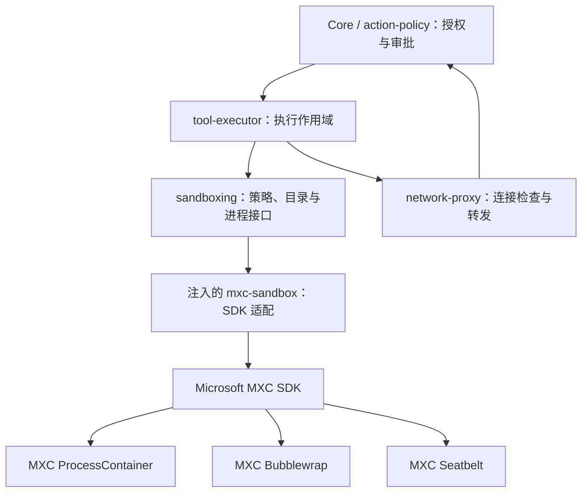

# 沙箱架构

Zeta 决定权限与执行要求，Microsoft MXC 负责满足这些要求的系统隔离。Zeta 的 `mxc-sandbox` 是适配器；它与 Microsoft MXC 执行框架是两个不同的层。

## 调用与所有权

编译依赖为 `mxc-sandbox → sandboxing + mxc-sdk`。产品组合注入后端，Core、Agent 和 Executor 不依赖 MXC 或具体系统后端。

| Owner | 职责 |
| --- | --- |
| `action-policy` / Core | 操作及网络授权、审查、持久审批、重试决定 |
| `sandboxing` | 获批权限、目录范围、宿主改动要求、启动与进程句柄契约 |
| `tool-executor` | 输入输出、执行环境、预算、超时、取消和代理作用域 |
| `network-proxy` | 观察真实连接目标，执行授权结果并转发 |
| `mxc-sandbox` | 请求、句柄与错误的机械转换 |
| Microsoft MXC | 能力检查、后端选择、进程创建、系统策略与资源清理 |
| `install-context` | 包布局与外部可执行文件候选 |

授权语义见 [permissions.md](permissions.md)，审查语义见 [auto-review.md](auto-review.md)。

## 权限契约

- `ReadOnly` 保持宿主文件只读；`DirectoryWrite` 开放授予的可写目录，并保护目录元数据。
- `FullAccess` 扩大文件权限，但仍保留明确的只读、隐藏目录和网络限制。
- `Denied` 禁止外部网络；`Managed` 只允许通过执行专属代理；`Allowed` 允许网络。
- `SandboxScope` 隐藏共享存储并开放本次 Grant，拒绝重复、重叠或跨 Environment 的目录集合。
- `HostAclChanges::Denied` 禁止以修改宿主 ACL 的方式实施隔离；`Scoped` 允许 SDK 对策略中的路径做必要配置，并要求正常关闭清理。
- App Server 与配置 Hook 的固定执行策略明确选取 `Scoped`，命令参数不能选择它；基础策略构造器默认 `Denied`。
- `FullAccess + Allowed` 且普通单目录范围是显式的普通进程执行，不通过能力缺失触发。

后端只能在满足要求的实现中选择。缺失能力时返回不支持，不能开放更多目录、网络或宿主改动。
Windows ProcessContainer 的不同实现不保证能力等价：断网请求可使用合规的 AppContainer/DACL 路径；精确代理、身份等要求仍受 SDK 能力限制。

## 启动与生命周期

1. 授权后建立执行专属代理，取得单个 HTTP/SOCKS 共享端点。
2. `SandboxManager` 验证目录，适配器构造 SDK 请求；尚未启动用户命令。
3. `PreparedCommand` 持有 `SandboxLaunch`。Executor 在执行起点调用它，得到通用 `ProcessHandle`。
4. SDK 持有隔离进程与系统资源，Executor 排空输出并检查取消和超时。
5. 结束时通过 SDK 终止、等待进程树，排空输出，再释放句柄和代理。

适配器不会把 SDK 启动阶段的未知失败标成可安全重跑。子进程输出的权限错误只用于“可能已有副作用”的诊断。
普通进程实现仍由通用进程层持有；不与受限后端的能力选择混用。

## SDK 承接与旧实现

| 原路径或职责 | 当前归属 |
| --- | --- |
| `sandboxing/src/macos.rs` 的系统执行 | MXC `seatbelt_common` |
| `linux-sandbox/` 的隔离与网络辅助程序 | MXC `bwrap_common` |
| `windows-sandbox-rs/` 的系统隔离 | MXC `appcontainer_common` / ProcessContainer |
| `windows-sandbox-service/`、worker、MSI | 自建服务链退出；使用 SDK 的系统实施与生命周期 |
| 前一版 `mxc-sandbox` 中的 PSEC、Seatbelt、FD 转交实现 | 已移除，改为 SDK 启动与句柄 |

补丁、来源和验证说明见 [MXC 依赖](../zeta-rs/vendor/mxc/README.md)。
补丁覆盖 SDK 请求控制、目录例外、代理环境和退出观察；没有把旧 Zeta 平台后端复制进适配器。
Linux 包保留上游 Bubblewrap；Windows 不再携带 Zeta command runner 或系统服务。

## 当前支持与验收限制

| 项目 | 状态 |
| --- | --- |
| macOS SDK 执行、目录与代理隔离 | 有真实进程回归测试 |
| Linux SDK 受管网络 | 有实机测试入口；依赖 slirp4netns、util-linux、iptables 和相应内核功能 |
| Windows SDK 文件与断网策略 | 完整 SDK 可编译；仍需实机验证所选实现 |
| Windows 当前严格 `Managed` 请求 | 明确不支持：代理身份和入站约束不能按当前部署完整表达 |
| Windows ACL 崩溃恢复、完整平台逃逸验证 | 尚未完成 |

SDK 接口接通、交叉编译和包测试不能替代系统隔离验收。固定 MXC 版本仍为早期预览，尚未取得生产安全边界资格。
Windows 步骤见 [验收手册](windows-sandbox-acceptance-runbook.md)，网络规则见 [network-proxy](../zeta-rs/network-proxy/README.md)。
