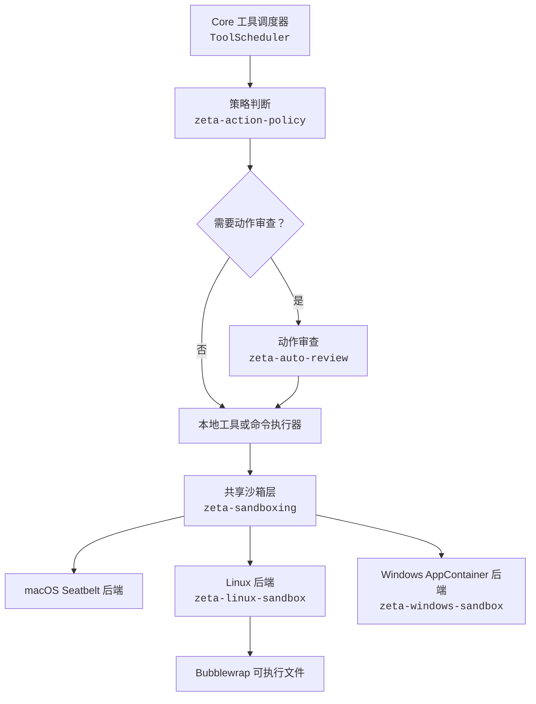

# 沙箱架构

> 文档所有权：本文件是操作系统沙箱策略、平台后端和强制执行边界的权威文档。

## 快速理解

沙箱系统落实已经决定好的执行能力：它限制文件、网络和进程范围，但不判断用户意图，也不负责
批准动作。

| 执行请求 | 系统行为 | 当前边界 |
| --- | --- | --- |
| 目录只读且禁止网络 | 选择当前平台的只读沙箱后端 | macOS、Linux 已接入；Windows 仍需真实平台验收 |
| 目录可写且禁止网络 | 只开放已授权目录写入，继续限制其他路径和网络 | 各平台按自身机制翻译相同共享策略 |
| 完全文件访问且允许网络 | 共享策略允许直接执行，不伪装成受限沙箱 | 仍须先经过权限决定 |
| 后端缺失或无法表达策略 | 失败即关闭，不降级为普通进程 | 返回明确的后端不可用错误 |
| 沙箱拒绝动作 | 返回结构化执行证据 | 是否重试或扩权由 Core 与权限系统决定 |

## 1. 定位

Zeta 将动作审查、沙箱策略、平台选择、命令构建和操作系统强制执行分开：



沙箱管理器 `SandboxManager` 只调度沙箱后端：它在 canonical `Dir` 内解析命令工作目录、解析当前平台的策略，并生成
可执行的主机启动计划。它不负责工具并行计划、用户批准、重试、确定性结果排序或工具调用与结果的
持久化；这些仍属于 Core 的工具调度器 `ToolScheduler`。动作审查的风险判断见
[`auto-review.md`](auto-review.md)；授权、用户批准与最终执行决定的整体语义见
[`permissions.md`](permissions.md)。

## 2. crate 边界

| 位置 | 唯一职责 |
| --- | --- |
| `zeta-sandboxing` | 统一管理要限制的文件、网络和进程能力 |
| `zeta-linux-sandbox` | 决定这些限制在 Linux 下如何转换并强制执行 |
| `zeta-rs/vendor/bubblewrap` | 保存 Linux 隔离工具 Bubblewrap 的上游源码 |

### 2.0 `zeta-install-context`

`zeta-install-context` 描述当前可执行文件所在的包布局，并提供 `zeta-path/` 可执行文件候选路径
与 `zeta-resources/` 资源候选路径。它不选择沙箱策略，不验证辅助程序的能力或摘要，也不启动或
复制资源。

当前本地 `rg`、Linux Bubblewrap 与 Windows AppContainer 的运行时组合已经接入该契约。规范包
写入 `zeta-package.json` 与 `zeta-path/rg`；Linux 另带 `zeta-resources/bwrap`，Windows 另带
命令运行器和沙箱设置辅助程序。平台后端在主机组合阶段完成候选项验证、能力与协议探测，并冻结
规范身份。

### 2.1 `zeta-sandboxing`

`zeta-sandboxing` 是共享契约与后端管理器：

- `SandboxPolicy`、`FileSystemAccess`、`NetworkAccess`；
- `SandboxCommand` 与 `PreparedCommand`；
- 沙箱后端契约 `SandboxBackend`；
- `SandboxManager` 的目录路径验证与后端分派；
- 当前 macOS Seatbelt 命令转换；
- `zeta-file-access::Dir` 提供的 canonical 目录边界。

macOS 实现暂时保留在本 crate，因为 Seatbelt 转换层很薄，且平台选择与共享策略紧密。
当 macOS 原生实现需要独立 FFI、辅助程序、较重依赖，或接近 500 行代码时，再提取为
`zeta-macos-sandbox`；提取不能改变共享策略。

### 2.2 `zeta-linux-sandbox`

`zeta-linux-sandbox` 决定 Linux 下如何落实共享策略，并通过私有的类型化参数构造器生成 Bubblewrap 调用：

- 非完全访问 `FullAccess` 的文件系统默认从只读根目录开始；
- 目录可写 `DirectoryWrite` 通过更具体的读写挂载重新开放已授权目录；
- 禁止网络时使用独立网络命名空间；
- 添加用户与进程命名空间、新建的 `/proc`、`/dev`、会话和父进程退出约束；
- Bubblewrap 不可用或不支持所需能力时必须返回错误。

该 crate 当前拥有系统或随包提供的 `bwrap` 发现、所需 CLI 能力探测和规范身份冻结。后续仍拥有
版本诊断、WSL 检查、seccomp 与受管网络桥接；这些细节不能进入共享策略。

### 2.3 `zeta-rs/vendor/bubblewrap`

`zeta-rs/vendor/bubblewrap` 保存 Bubblewrap 0.11.2 的完整上游源码、许可证和来源元数据。它只提供 Linux 隔离工具的源码，不拥有 Zeta 的共享限制、Linux 策略翻译、可执行文件发现或失败决策。`zeta-bwrap` 只是把这份源码编译成随包 `bwrap` 的机械构建入口，不构成独立沙箱职责层。

### 2.4 `zeta-windows-sandbox`

物理目录保留上游习惯名 `windows-sandbox-rs/`，Cargo 包与 API 名为
`zeta-windows-sandbox` / `zeta_windows_sandbox`。它拥有：

- 从共享策略到 Windows 文件系统与网络授权的解析；
- AppContainer 配置文件与能力、ACL、子进程策略和 Job Object 强制执行；
- Windows 辅助程序与启动器的生命周期和平台诊断。

当前 `zeta-command-runner.exe` 先调用 `zeta-windows-sandbox-setup.exe` 创建或复用按
规范目录与读写模式隔离的 AppContainer 配置文件，为已授权目录和冻结的内部可执行文件安装 ACL，
再以零能力的 AppContainer 令牌启动进程。零网络能力负责断网，配置文件 SID 与 ACL 负责文件
访问；子进程限制与单进程 Job Object 补充进程树控制。当前只支持只读或目录可写模式
`ReadOnly` / `DirectoryWrite` 与禁止网络 `Denied` 的组合；其他受限组合必须失败即关闭。

这不是 Codex 专用本地用户与 WFP 防火墙实现的复制。Zeta v1 选择 Windows 原生 AppContainer
边界，并明确记录 ACL 是持久化的文件系统元数据。辅助程序已接入包、资源发现、App Server 与
MSVC 目标交叉检查；真实 Windows AppContainer、ACL 和网络集成测试尚未完成，因此暂不标记为
生产环境强制执行。
Windows 测试人员应按
[`windows-sandbox-acceptance-runbook.md`](windows-sandbox-acceptance-runbook.md)
回填实际结果、退出码、执行记录和 ACL 证据，再与固定预期结果比对。

## 3. 依赖方向

允许：

```text
zeta-linux-sandbox   → zeta-sandboxing
zeta-windows-sandbox → zeta-install-context + zeta-sandboxing
zeta-bwrap build     → zeta-rs/vendor/bubblewrap
主机组合              → zeta-install-context + 平台沙箱 + 工具运行时
zeta-action-policy   → zeta-execpolicy + zeta-sandboxing
zeta-execpolicy      → no sandbox dependency
zeta-auto-review     → zeta-action-policy + zeta-sandboxing
主机执行器            → zeta-sandboxing + 当前平台后端
```

禁止：

```text
zeta-bwrap → zeta-sandboxing / zeta-linux-sandbox / protocol / core
平台沙箱 → zeta-core / ThreadStore / 批准界面
zeta-sandboxing → shell-command / file-system / apply-patch / app-server / provider
zeta-sandboxing → zeta-action-policy / zeta-auto-review
zeta-execpolicy → zeta-action-policy / zeta-sandboxing / Core
zeta-install-context → zeta-sandboxing / 平台沙箱 / shell-command
```

平台后端通过 `SandboxBackend` 注入。共享管理器不依赖所有平台实现，因此不会形成
“共享沙箱 ↔ 平台 crate”循环，也不会把 Windows 原生依赖带入 Linux 或 macOS 可执行文件。

## 4. 安全不变量

- 非“完全访问 + 允许网络” `FullAccess + Allowed` 请求必须由平台沙箱强制执行；
- 后端缺失、版本过旧或策略无法完整表达时必须失败即关闭；
- `Dir` 的目录 containment 不是操作系统沙箱，不能作为降级方案；
- 模型或工具参数不能选择后端、扩大挂载、授予网络或要求降级；
- 命令与 `bwrap` 参数始终以结构化参数数组传递；
- 符号链接、不存在的写入路径、嵌套拒绝和只读例外必须在进入真实执行前处理；
- 能力探测与实际启动使用同一个已解析可执行文件，避免检查与执行之间的竞态；
- 诊断必须区分后端不可用、策略不受支持、设置失败和沙箱拒绝。

## 5. 实施顺序

1. 类型化策略、后端契约与命令构建；
2. 将进程执行器改为消费准备命令 `PreparedCommand`；
3. Linux 的 `bwrap` 发现、探测与随包分发；
4. Linux 真实命名空间集成测试与 seccomp；
5. Windows AppContainer 启动器、ACL 与网络强制执行和 Windows CI；
6. macOS Seatbelt 配置文件兼容性与集成测试；
7. 受管网络代理、PTY、取消和进程树终止集成。

`zeta-rs/vendor/bubblewrap` 源码、Linux 随包构建和发现已完成；真实 Linux 命名空间集成与 seccomp 仍是当前限制。Windows
辅助程序、构建、发现和强制执行路径已完成，仍需通过真实 Windows 集成测试后才能标记为生产环境
强制执行。
